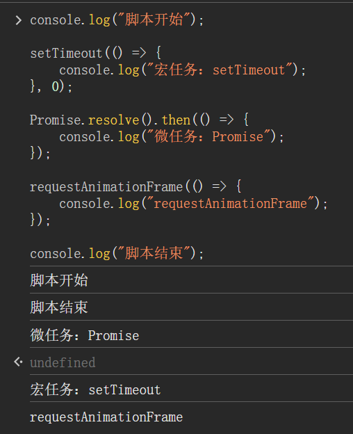
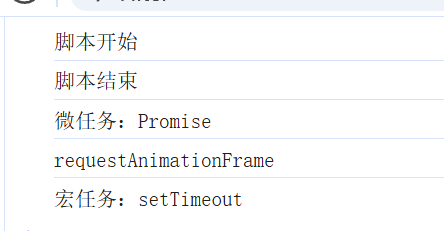

## requestAnimation介绍

[Window：requestAnimationFrame() 方法 - Web API | MDN](https://developer.mozilla.org/zh-CN/docs/Web/API/Window/requestAnimationFrame)

`requestAnimationFrame`（简称 `rAF`）是一种用于在浏览器的下一次重绘之前执行代码的 API。它的回调执行在浏览器的刷新周期内，以实现流畅的动画效果。那么在事件循环中，`requestAnimationFrame` 属于以下特点：

- **它不属于宏任务或微任务，而是一个单独的调度机制**。它会在浏览器的渲染阶段执行，而不依赖于宏任务或微任务队列。
- 浏览器会在每一帧的渲染前调用 `requestAnimationFrame` 回调，通常以每秒 60 次左右的频率运行（这取决于显示器刷新率和系统性能）。
- `rAF` 回调的执行优先级低于微任务（例如 `Promise.then`），但高于 `setTimeout` 等宏任务。

`requestAnimationFrame` 不属于典型的宏任务或微任务，而是由浏览器优化控制，以便在合适的时间触发，从而确保动画和绘制的流畅性。

## 执行时机的验证

```javascript
console.log("脚本开始");

setTimeout(() => {
	console.log("宏任务：setTimeout");
}, 0);

Promise.resolve().then(() => {
	console.log("微任务：Promise");
});

requestAnimationFrame(() => {
	console.log("requestAnimationFrame");
});

console.log("脚本结束");
```

##### 按照我们的总结, 这段代码应该会按照以下次序输出

```js
//首先输出同步任务
脚本开始
脚本结束
//微任务
微任务：Promise
//requstAnimation
requestAnimationFrame
//宏任务
宏任务：setTimeout
```

##### 下面我们来看看在浏览器控制台的输出(chrome隐私模式下)



输出中的undefined我们不用管(

控制台中的 `undefined` 是由 **JavaScript 执行结果的默认返回值** 引起的。

在浏览器控制台中，任何代码块或表达式执行完后，如果没有显式的返回值，控制台会输出 `undefined`，作为这个代码块的默认返回结果。

)


我们会发现好像跟我们的预期并不一样

宏任务为什么会先在requestAnimation之前执行呢?


##### 我们先来看看在html文件中执行的输出顺序



现在和我们的总结是一致的


## 为什么会出现浏览器控制台和html文件中执行的输出顺序不一样呢

猜测可能是以下的几个原因:

1. **控制台环境的特殊性**：浏览器控制台的执行环境有时会与实际页面加载时的事件循环有所不同。在控制台直接输入和执行的代码，有时会延迟 `requestAnimationFrame` 的触发，导致其错过当前帧的渲染周期。
2. **事件循环的具体调度实现**：浏览器的事件循环处理 `requestAnimationFrame` 和宏任务的顺序时，会按照“下一帧渲染之前执行”的原则来处理 `requestAnimationFrame`。但在控制台环境下，因为**没有实际的页面渲染**，可能会延迟 `requestAnimationFrame` 的执行，**使它在下一个循环周期中被处理，从而排在宏任务后**。
3. **浏览器性能优化**：现代浏览器会对控制台脚本进行优化，而这些优化在页面加载时和控制台环境下可能有所不同。在页面脚本中，`requestAnimationFrame` 更能符合预期的执行顺序（微任务 → `requestAnimationFrame` → 宏任务），而在控制台环境下可能会有所改变。