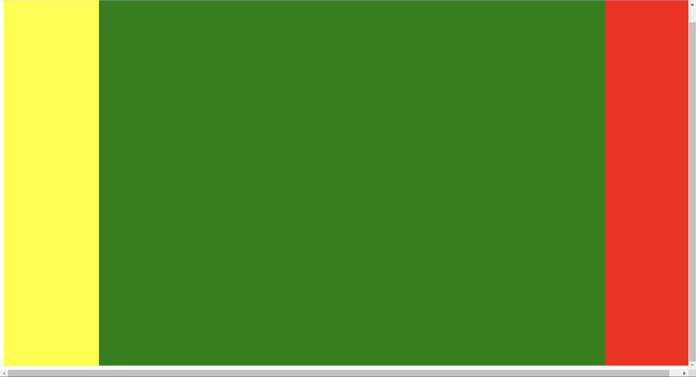

### 在去做flex左右固定,中间自适应宽度的布局时, 发现这样一个问题:

就是我明明是宽度占据整个视口, 但是却多出了横向的滚动条

效果是这样的



把width改成100%,就没有滚动条了

### 原因:

body是有默认样式的, 会有一定的默认边距, 把默认边距清除就是正常的了

同时, 如果把高度设置超过100vh, `width: 100vw` 时，元素的宽度会占据整个视口的宽度，包括滚动条的宽度

这时,滚动条会占据一定的宽度，这会导致元素的实际宽度超过视口的可见宽度，从而出现横向滚动条。

##### 为什么设置为width: 100%时就不会有滚动条:

`width: 100%` 表示元素的宽度是其父元素宽度的 100%。具体来说：

**父元素宽度**：父元素的宽度是视口的宽度减去滚动条的宽度（如果有滚动条）。

**子元素宽度**：子元素的宽度会根据父元素的宽度进行计算，不会超过父元素的宽度。

因此，即使视口有滚动条，`width: 100%` 的元素宽度也不会超过视口的可见宽度，所以不会出现横向滚动条。

### 解决方法:

在width中减去滚动条的宽度就可以了, 一般是17px, `calc(100vw - 17px)`

或者使用width: 100%


### 代码

```html
<!DOCTYPE html>
<html lang="en">
	<head>
		<meta charset="UTF-8" />
		<meta name="viewport" content="width=device-width, initial-scale=1.0" />
		<title>Document</title>
		<style>
            /*去除页面默认边距
            html body{
                padding: 0;
                margin: 0;
            }*/
			.wrap {
				display: flex;
                //如果高度大于100vh需要将width:100vw的部分减去滚动条宽度
                height: 100vh;
                width: 100vw;
                overflow: hidden;
			}
			.left {
				width: 200px;
				background-color: yellow;
			}
			.middle {
				flex: 1;
				background-color: green;
			}
			.right {
				width: 200px;
				background-color: red;
			}
		</style>
	</head>
	<body>
		<div class="wrap">
			<div class="left"></div>
			<div class="middle"></div>
			<div class="right"></div>
		</div>
	</body>
</html>
```


