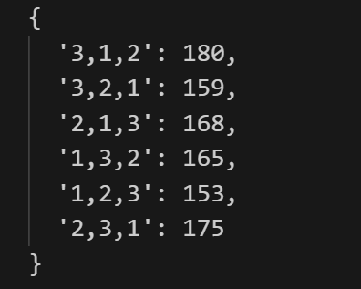
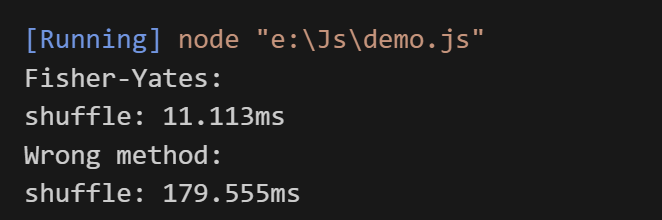

### 如果让你打乱一个数组你会怎么做

#### Array.sort()

```javascript
const shuffle2 = arr => arr.sort(() => Math.random() - 0.5);
```

用sort当然是可以的,但是sort用的是快排,时间复杂度NlogN,那么有没有更好的办法呢

下面就迎来了我们的主角: `洗牌算法`

#### 洗牌算法

```javascript
function fisherYatesShuffle(arr) {
    // 克隆数组避免修改原数组
    const result = [...arr];
    
    // 从末尾开始遍历
    for (let i = result.length - 1; i > 0; i--) {
        // 生成 [0, i] 范围内的随机索引
        const j = Math.floor(Math.random() * (i + 1));
        
        // 交换元素
        [result[i], result[j]] = [result[j], result[i]];
    }
    
    return result;
}

// 测试代码
const arr = [1, 2, 3, 4, 5];
console.log(fisherYatesShuffle(arr));

// 验证随机性
function verifyRandomness(arr, iterations = 1000) {
    const counts = {};
    for (let i = 0; i < iterations; i++) {
        const shuffled = fisherYatesShuffle(arr);
        const key = shuffled.join(',');
        counts[key] = (counts[key] || 0) + 1;
    }
    return counts;
}

// 打印每种排列出现的次数
console.log(verifyRandomness([1, 2, 3], 1000));
```

##### 执行结果



**步骤分析：**

1. 从数组末尾开始向前遍历
2. 对于每个位置i，在[0,i]范围内随机选择一个位置j
3. 交换位置i和位置j的元素
4. 每次迭代后，当前位置i之后的元素都已被随机打乱

**优点：**

1. 时间复杂度O(n)，空间复杂度O(1)
2. 完全随机 - 每个元素出现在每个位置的概率相等
3. 原地算法 - 不需要额外空间
4. 稳定性好 - 相同元素的相对顺序可能改变

### 洗牌算法的随机性是怎么保障的

举例说明第一轮迭代：

1. 数组长度为5，最后一个位置是索引4
2. 在[0,4]范围内随机选择一个位置j
3. 每个元素被选中的概率是1/5
4. 交换后，位置4的元素已经确定

第二轮迭代：

1. 处理索引3的位置
2. 在[0,3]范围内随机选择位置
3. 每个剩余位置被选中的概率是1/4

以此类推，确保了每个元素在每个位置出现的概率相等。

#### 洗牌算法和sort的性能对比

```javascript
//sort方法
const sortShuffle = arr => arr.sort(() => Math.random() - 0.5);
//洗牌算法
...
function benchmark(shuffleFunc, size = 1000, iterations = 1000) {
    const arr = Array.from({length: size}, (_, i) => i);
    console.time('shuffle');
    for (let i = 0; i < iterations; i++) {
        shuffleFunc([...arr]);
    }
    console.timeEnd('shuffle');
}

console.log('Fisher-Yates:');
benchmark(fisherYatesShuffle);

console.log('Wrong method:');
benchmark(sortShuffle);
```



可以发现洗牌算法的性能比sort的速度要快了很多