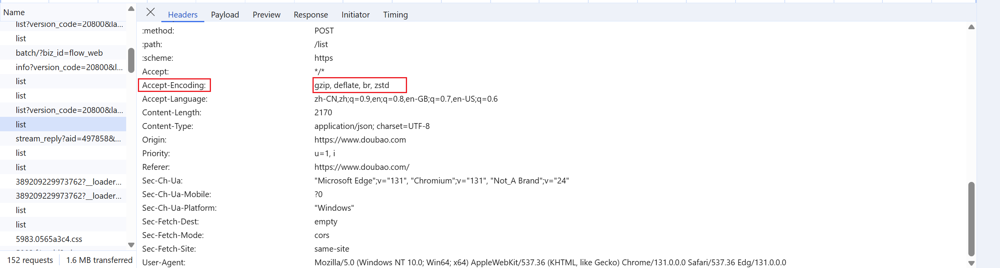

浏览器支持的压缩算法多种多样，每种都有其独特的特点。下面我将介绍几种常见的压缩算法：Gzip、Brotli 和 Zstd，并讨论它们的特点。

1. **Gzip**：
   - Gzip 是一种广泛使用的无损数据压缩算法，基于 DEFLATE 算法，它结合了 LZ77（字典编码）和 Huffman 编码（熵编码）。Gzip 的普及程度非常高，几乎所有的现代浏览器都支持这种压缩算法。
   - Gzip 提供了 1 到 9 的压缩级别，数字越大，表示压缩率越高，但同时 CPU 消耗也越大。在实际应用中，通常选择一个适中的压缩级别以平衡性能与效率。
   - 由于 Gzip 的广泛兼容性，它是网站优化中常用的压缩方法之一。对于文本文件，如 HTML, CSS, JavaScript 文件，Gzip 可以显著减少传输的数据量，从而提高网页加载速度。

2. **Brotli**：
   - Brotli 是 Google 推出的一种较新的无损压缩算法，特别适用于 HTTP 压缩。相较于 Gzip，Brotli 能够提供更高的压缩率，通常可以比 Gzip 高 10% 到 20%，并且解压速度相当或更快。
   - Brotli 支持 1 到 11 的压缩级别，同样地，级别越高，压缩率越高，CPU 使用也会增加。Brotli 还使用了一个预定义的静态字典来增强对常用字符串的压缩效果，这有助于进一步减小文件大小。
   - 尽管 Brotli 的压缩率更高，但是它的压缩速度相对较慢，因此在实时压缩场景下可能不是最佳选择。不过，预先压缩静态资源文件并在服务器上存储压缩版本是一种有效的做法。

3. **Zstandard (Zstd)**：
   - Zstd 是 Facebook 开发的一种快速压缩算法，旨在提供高压缩率的同时保持快速的压缩/解压缩速度。Zstd 的压缩级别从 1 到 22，级别越高，压缩率越高，但 CPU 使用也会相应增加。
   - 相比于 Gzip 和 Brotli，Zstd 在压缩速度上表现更优，尤其是在较低的压缩级别时。这意味着即使在需要快速响应的情况下，Zstd 也能提供良好的压缩效果。
   - Zstd 的内存占用相对较低，这使得它成为处理大量数据时的一个有吸引力的选择。此外，Zstd 对于那些既要求高压缩率又需要快速处理的应用场景来说是一个很好的解决方案。

综上所述，当为网站选择合适的压缩算法时，应该考虑以下因素：
- **兼容性**：如果需要最广泛的浏览器支持，Gzip 是一个安全的选择。
- **压缩率**：如果追求最高的压缩率，那么 Brotli 或者 Zstd 会是更好的选择。
- **性能**：如果需要快速的压缩/解压缩速度，尤其是对于动态内容的即时压缩，Zstd 会优于其他两者。
- **应用场景**：根据是否需要实时压缩或者可以预先压缩静态资源来决定使用哪种算法。

在实际部署时，可以配置 Web 服务器（如 Nginx）来自动选择客户端支持的最佳压缩算法，以此来最大化压缩效果并确保良好的用户体验。例如，可以通过设置 `Accept-Encoding` 标头来让服务器知道客户端支持哪些压缩类型，并据此做出相应的响应。

浏览器支持的压缩算法有很多种，其中最常见的包括 **GZIP**、**DEFLATE**、**Brotli (BR)** 和 **Zstandard (ZSTD)**。这些算法都用于减小 HTTP 请求和响应数据的体积，从而加快网页加载速度，减少带宽消耗。接下来，我们逐一介绍这四种算法的特点、底层原理，并进行对比。

### 1. GZIP

#### 特点：

- **最广泛支持**：GZIP 是最早被广泛使用的压缩算法之一，几乎所有的浏览器和服务器都支持 GZIP。
- **基于 DEFLATE**：GZIP 本质上是基于 DEFLATE 算法的，通常会增加一些额外的元数据，例如文件名、时间戳等。
- **压缩效率适中**：压缩率相对适中，但在大多数情况下能提供良好的性能与速度平衡。
- **速度**：GZIP 压缩和解压缩速度较快，但不如 Brotli 和 Zstandard 高效。

#### 底层原理：

GZIP 使用 **DEFLATE** 算法。DEFLATE 结合了两种压缩技术：

- **LZ77 算法**：一种基于滑动窗口的字典压缩技术，通过查找重复的字符串来减少数据量。
- **哈夫曼编码**：对符号（字符）使用变长编码，以减少高频符号的存储空间。

#### 适用场景：

由于其广泛的支持和适中的压缩效率，GZIP 适用于各种情况，特别是需要兼容性的环境。

### 2. DEFLATE

#### 特点：

- **算法本身较简单**：DEFLATE 是 GZIP 的核心算法，也是 ZIP 格式的核心算法，主要使用滑动窗口压缩和哈夫曼编码。
- **无需附加元数据**：与 GZIP 不同，DEFLATE 不包含文件名、时间戳等额外元数据，因此通常压缩后的文件稍小。

#### 底层原理：

DEFLATE 使用 **LZ77** 算法和 **哈夫曼编码**。它首先使用滑动窗口寻找重复的数据块，然后使用哈夫曼编码来进一步压缩这些数据。

#### 适用场景：

DEFLATE 适用于对压缩效率要求较高且不需要额外元数据的场景，如某些网络传输协议。

### 3. Brotli (BR)

#### 特点：

- **高压缩比**：Brotli 是由 Google 开发的一种新型压缩算法，在许多情况下提供比 GZIP 更高的压缩比，尤其是在静态内容（如 HTML、CSS 和 JavaScript）上。
- **速度适中**：虽然 Brotli 在压缩率上表现优越，但它的压缩速度通常较慢，解压速度较快，适合静态资源的长期缓存。
- **广泛支持**：现代浏览器（如 Chrome、Firefox、Edge）已全面支持 Brotli，但一些旧版本的浏览器可能不支持。

#### 底层原理：

Brotli 结合了以下技术：

- **LZ77** 算法：类似于 DEFLATE，用于寻找重复的数据块。
- **Huffman 编码**：对频繁出现的符号使用较短的编码。
- **字典编码**：为了提高压缩比，Brotli 使用了静态字典和动态字典。
- **二级哈夫曼树**：这种编码方式提供了更高的压缩效率。

#### 适用场景：

适用于压缩静态内容，尤其是在需要高压缩比且解压速度不敏感的情况下，如 Web 资源的 HTTP 响应。

### 4. Zstandard (ZSTD)

#### 特点：

- **最高的压缩性能**：Zstandard 是由 Facebook 开发的一种新型算法，提供了比 GZIP 和 Brotli 更高的压缩效率和更快的压缩速度。
- **灵活性高**：Zstd 可以通过不同的压缩级别调节速度和压缩率，适应不同的使用场景。
- **广泛支持**：虽然 Zstandard 的支持比 GZIP 或 Brotli 稍差，但它正在逐渐被浏览器和服务器所接受。

#### 底层原理：

Zstandard 使用：

- **字典压缩**：类似于 LZ77，Zstandard 也使用字典来查找重复的字节模式。
- **熵编码**：使用类似哈夫曼编码的熵编码方法来进一步压缩数据。
- **多阶段压缩**：Zstandard 的压缩过程分为多个阶段，能够在不同的阶段进行优化。

#### 适用场景：

Zstandard 特别适合高压缩需求的应用，尤其是对于需要在压缩效率和速度之间做权衡的场景，如数据库压缩、日志文件压缩等。

### 算法对比

| 特性           | GZIP           | DEFLATE        | Brotli (BR)           | Zstandard (ZSTD)     |
| -------------- | -------------- | -------------- | --------------------- | -------------------- |
| **压缩比**     | 中等           | 中等           | 高                    | 非常高               |
| **压缩速度**   | 快             | 快             | 慢                    | 非常快               |
| **解压速度**   | 快             | 快             | 快                    | 快                   |
| **广泛支持性** | 极好           | 好             | 良好                  | 较少                 |
| **适用场景**   | 兼容性强的环境 | 对元数据要求低 | 静态资源压缩          | 高效压缩和解压       |
| **使用场合**   | HTTP 压缩      | 文件压缩       | HTTP 压缩（静态内容） | 数据库、日志文件压缩 |

### 总结：

- **GZIP** 是最常见和最广泛支持的压缩算法，适合大多数场景。
- **DEFLATE** 是 GZIP 的核心算法，压缩效率较好，但没有 GZIP 的元数据，适合需要较小文件且不要求元数据的场景。
- **Brotli** 提供更高的压缩比，适合静态资源（如 HTML、CSS、JavaScript）的传输，特别是在现代浏览器中。
- **Zstandard** 提供最佳的压缩效率和速度，适用于对压缩性能有较高要求的场景，如日志和数据库压缩。

在选择压缩算法时，您需要考虑目标应用的需求：如果需要兼容性和较快的压缩速度，GZIP 是不错的选择；如果追求高压缩比和更快的解压速度，可以考虑 Brotli 或 Zstandard。