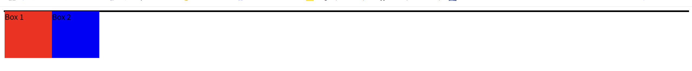

### 概念

高度塌陷就是在某些情况下，父元素的高度没有被其子元素的高度撑开，导致父元素的高度为0或不符合预期。这种情况通常发生在使用浮动（float）布局时。

### 代码示例

比如我们有一个父元素 `container`，其中包含两个浮动的子元素 `box1` 和 `box2`。由于浮动元素脱离了正常的文档流，父元素的高度不会被撑开，导致高度塌陷。

可以看到下面父元素的背景色只有一条线



```javascript
<!DOCTYPE html>
<html lang="en">
	<head>
		<meta charset="UTF-8" />
		<meta name="viewport" content="width=device-width, initial-scale=1.0" />
		<title>Height Collapse Example</title>
		<style>
			.container {
				border: 2px solid black;
				background-color: lightgray;
			}

			.box {
				width: 100px;
				height: 100px;
				float: left;
			}

			.box1 {
				background-color: red;
			}

			.box2 {
				background-color: blue;
			}
		</style>
	</head>
	<body>
		<div class="container">
			<div class="box box1">Box 1</div>
			<div class="box box2">Box 2</div>
		</div>
	</body>
</html>

```

### 解决方法

##### 1.通过在父元素的末尾添加一个清除浮动的伪元素

```javascript
.container::after {
    content: "";
    display: block;
    clear: both;
}
```

##### 2.使用`clear: both`

1. `clear: both`的元素会:
   - 移动到所有浮动元素下方
   - 确保自己的顶部不会和任何浮动元素相邻
   - 强制父元素包含所有浮动元素
2. 具体作用:
   - 阻止元素被浮动元素影响
   - 迫使父元素计算高度时包含浮动元素
   - 实现浮动元素的闭合
3. 缺点
   - 需要额外的空标签
   - 增加无语义的HTML结构
   - 不够优雅

```javascript
<div class="container">
    <div class="box box1">Box 1</div>
    <div class="box box2">Box 2</div>
    <div class="clear"></div>
</div>
.clear{
    clear: both;
}
```

##### 3.触发父元素的BFC

1. float
2. positon为absolute或fixed
3. display不为none, 其中`display: flow-root` 是一个新的CSS属性，可以创建一个新的BFC
4. overflow不为visible

