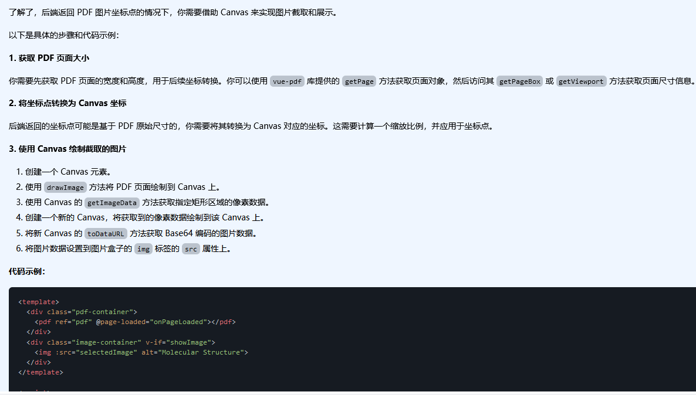
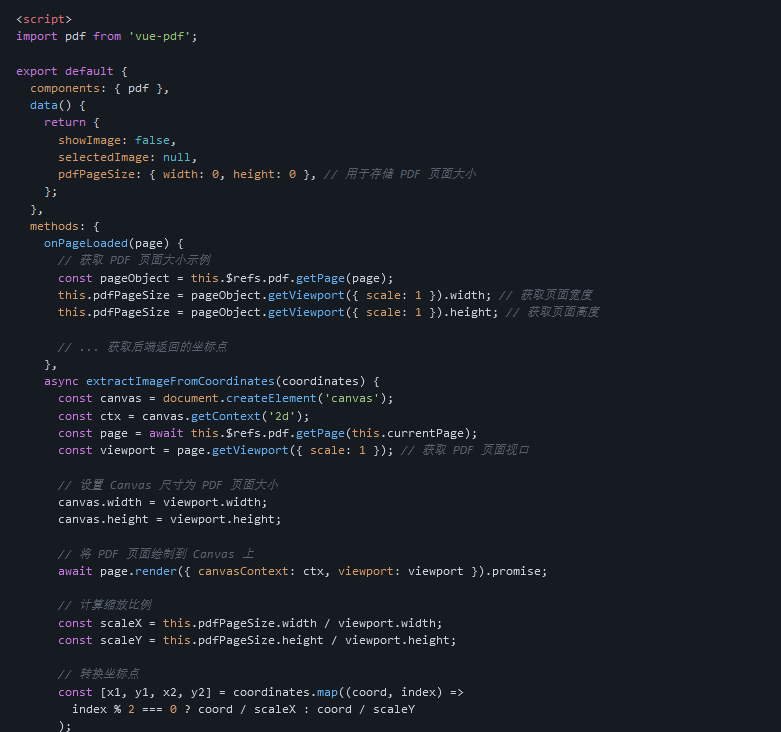
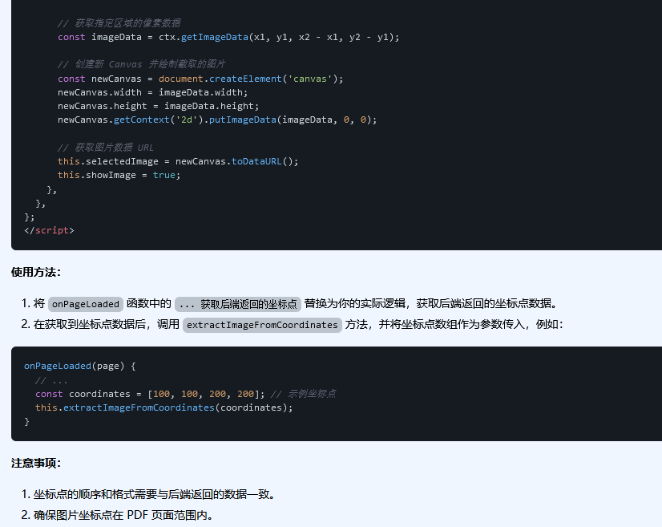
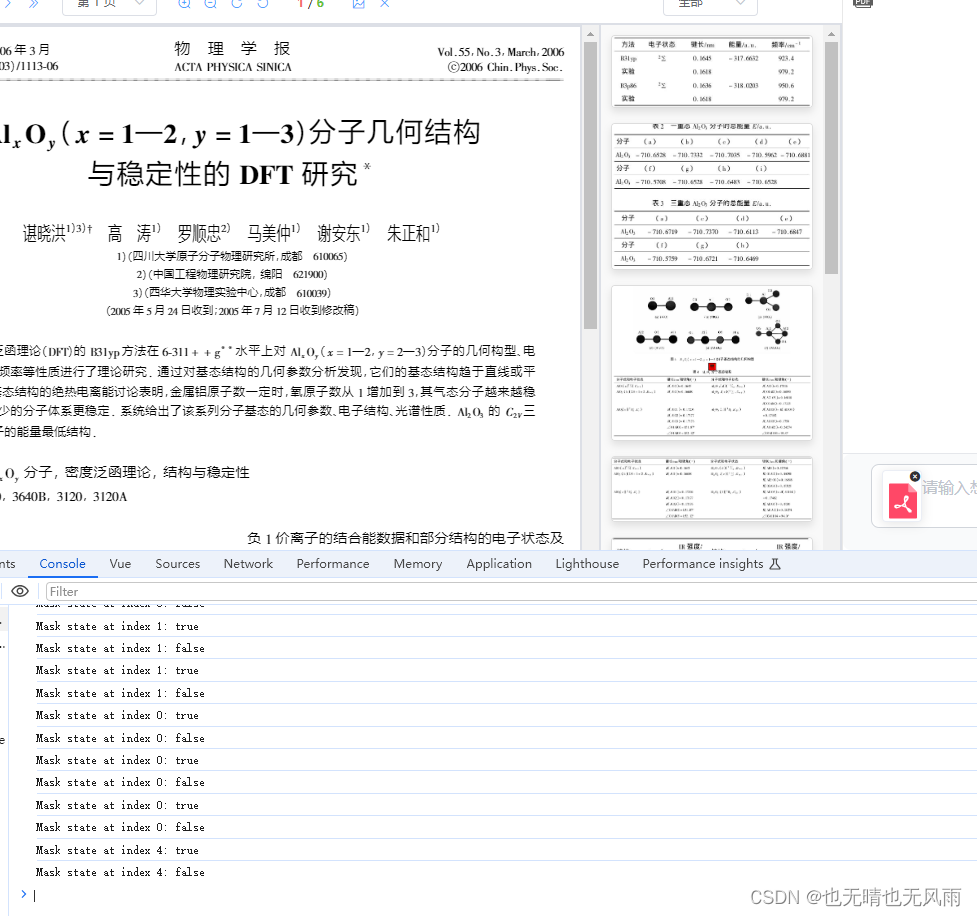
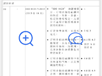
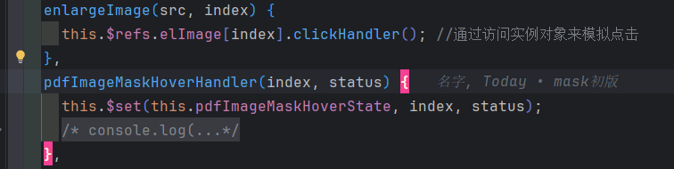
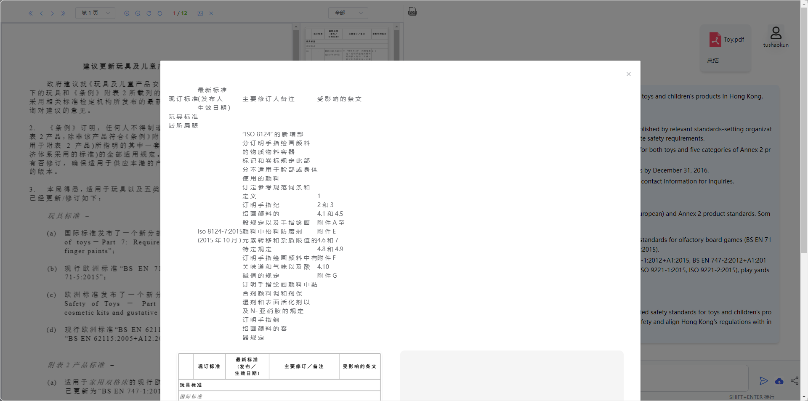

## 控制台打印[object Object]的远原因

这是打印输出代码

```javascript
console.log("111111111111111111111"+this.basicInfo);
```

控制台打印显示


原因

因为 `console.log` 在尝试转换对象为字符串时调用了对象的 `toString()` 方法。对于普通 JavaScript 对象，`toString()` 方法并没有做特殊处理，所以返回的是对象的通用字符串表示形式，即 `[object Object]`。


要更详细地查看对象的内容，可以使用几种方法：

1. **直接传递对象给 `console.log`**: 不要将对象与字符串拼接。直接将对象作为参数传给 `console.log` 可以让浏览器控制台显示对象的可交互树形结构。

   ```javascript
   const obj = { name: 'Alice', age: 25 };
   console.log(obj); // 控制台将显示对象的详细结构
   ```

2. **使用 `console.dir`**: `console.dir` 方法可以显示一个对象的所有属性和方法，这对于调试复杂对象特别有用。

   ```javascript
   console.dir(obj);
   ```

3. **JSON.stringify**: 使用 `JSON.stringify` 可以将对象转换为其 JSON 字符串表示，这样可以在一行中看到整个对象。你还可以通过额外的参数美化输出。

   ```javascript
   console.log(JSON.stringify(obj));
   console.log(JSON.stringify(obj, null, 2)); // 第三个参数指定缩进，使输出更易读
   ```

4. **使用展开运算符或 `Object.assign()`**: 当你使用展开运算符时，在控制台打印时将会生成对象的浅拷贝，这也可以帮助展示对象的结构。

   ```javascript
   console.log({...obj});
   console.log(Object.assign({}, obj));
   ```


## Elementui的el-footer标签使用报错

###### 其余标签的使用没有报错信息


###### el-footer的报错信息


###### 原因:

​	警告信息表示 Vue 不识别 `<el-footer>`


###### 解决方式:


###### 在组件中进行引入和暴露

## 单个标签的多个监听器绑定

```javascript
 <el-button 
	type="primary" 
	plain size="small" 
	@click="saveCallout(scope.row.responses) 
	@click="saveMessage(scope.row.responses)"
 >
      保存标注
 </el-button>
```

==语法错误==

###### 目的:对一个按钮绑定多个监听器处理事件

###### 解决方法:通过在一个处理事件内调用两个方法

```javascript
<el-button type="primary" plain size="small" @click="handleClick(scope.row.responses)">
  保存标注
</el-button>
```


```javascript
methods: {
  handleClick(responses) {
    this.saveCallout(responses);
    this.saveMessage(responses);
  },
  saveCallout(responses) {
    // 保存标注的逻辑
  },
  saveMessage(responses) {
    // 保存消息的逻辑
  }
}
```


## git push 报错

###### 报错信息

```bash
To https://github.com/xxxx/Js.git
 ! [rejected]        master -> master (fetch first)
error: failed to push some refs to 'https://github.com/xxxx/Js.git'
hint: Updates were rejected because the remote contains work that you do not
hint: have locally. This is usually caused by another repository pushing to
hint: the same ref. If you want to integrate the remote changes, use
hint: 'git pull' before pushing again.
hint: See the 'Note about fast-forwards' in 'git push --help' for details.
```

###### 原因

错误信息说明试图推送到 GitHub 上的存储库时出现了冲突，因为远程仓库中含有本地没有的新内容。具体来说，有其他的更改已经被推送到同一个分支（此处为 `master` 分支），而本地分支落后于这些更改。

为解决这个问题，需要先将远程仓库的变更拉取（合并）到本地仓库中，然后再尝试推送你的更改


**拉取远程仓库的变更到本地：** 在命令行中，执行以下命令：

```bash
git pull origin master
```

**处理合并冲突**

```bash
git add .
```

###### push

```bash
git push origin master
```

## Shell脚本开机自动化启动程序

在Windows系统中，通常不使用传统的Shell脚本（如Bash脚本，这种脚本多用于类Unix系统），而是使用Windows PowerShell脚本或批处理（batch）脚本来实现类似的功能。下面将具体说明如何使用这些工具在每次启动Windows电脑时自动启动指定的应用程序。

### 方法1：使用批处理脚本（Batch Script）

1. **创建批处理文件**：
   打开记事本，输入以下命令行内容，按需修改以启动你需要的应用程序。例如，启动记事本和计算器：

   ```batch
   @echo off
   start notepad.exe
   start calc.exe
   ```

   保存此文件时，选择“所有文件”类型，文件名设为 `startup.bat`。

2. **将批处理文件放入启动文件夹**：
   - 按 `Win+R` 打开运行对话框，输入 `shell:startup`，按回车键。
   - 将你创建的 `startup.bat` 文件复制或移动到打开的文件夹中。

   这样，每次登录你的账户时，Windows就会运行这个批处理文件，从而启动列出的应用程序。

### 方法2：使用PowerShell脚本

1. **创建PowerShell脚本**：
   打开记事本，输入以下脚本内容，按需修改以启动你需要的应用程序。例如，启动记事本和计算器：

   ```powershell
   Start-Process "notepad.exe"
   Start-Process "calc.exe"
   ```

   保存此文件时，选择“所有文件”类型，文件名设为 `startup.ps1`。

2. **更改策略以允许脚本运行（如果需要）**：
   在运行PowerShell脚本之前，可能需要更改执行策略，因为Windows默认可能不允许执行未签名的脚本。打开PowerShell（以管理员身份），并运行以下命令：
   
   ```powershell
   Set-ExecutionPolicy RemoteSigned
   ```

   选择 [Y] 是（Yes）以确认更改。

3. **将脚本添加到启动文件夹**：
   使用和批处理文件相同的方法将 `startup.ps1` 文件放入 `shell:startup` 文件夹。

这两种方法都能达到在Windows电脑每次开机时自动启动指定应用的目的。根据你对批处理和PowerShell的熟悉度，可以选择其中一种方式实施。如果你更熟悉Windows环境并且有一定的编程基础，PowerShell 脚本提供了更多灵活和强大的操作选项。

在进行Windows启动脚本的配置过程中，关于应用程序路径的处理取决于具体情况：

1. **如果应用程序位于系统PATH环境变量中的路径**：在这种情况下，你不需要在脚本中指定完整的应用程序路径。像 `notepad.exe` 和 `calc.exe` 这样的系统应用程序通常都可以直接调用，因为它们的执行文件路径已被包含在系统的PATH环境变量中。

2. **如果应用程序不在系统的PATH环境变量中**：这种情况下，你需要在脚本中提供应用程序的完整路径。例如，如果你想启动一个位于 `C:\Program Files\MyApp` 文件夹中的应用程序 `myapp.exe`，你需要在脚本中这样写：

   **对于批处理脚本**：
   ```batch
   @echo off
   start "" "C:\Program Files\MyApp\myapp.exe"
   ```

   **对于PowerShell脚本**：
   ```powershell
   Start-Process "C:\Program Files\MyApp\myapp.exe"
   ```

在实际操作中，以下几个步骤可帮助确认是否需要完整路径：

- 尝试在命令行（CMD或PowerShell）中直接输入程序名运行，如能成功启动，则无需完整路径。
- 如果直接运行失败，提示找不到文件，那么则需要在脚本中使用完整路径。

确保测试你的脚本以验证它是否正常工作。这可以通过直接在命令行手动运行脚本来完成，看看是否如预期那样启动了需要的应用程序。

如果你想在启动时运行多个程序，你可以很简单地在同一个脚本中按顺序添加多个 `Start-Process` 命令行。每一个 `Start-Process` 命令都会启动一个程序。以下是一个PowerShell脚本的例子，展示如何同时启动多个应用程序。

### 创建一个PowerShell脚本

1. 打开记事本或任何文本编辑器。
2. 将以下代码输入到文本编辑器中。这里以启动 `Snipaste.exe` 和 Microsoft Word（假设它的路径为 `C:\Program Files\Microsoft Office\root\Office16\WINWORD.EXE`）为例：

```powershell
Start-Process "C:\Users\tushaokun\Downloads\Snipaste-2.8.8-Beta-x64\Snipaste.exe"
Start-Process "C:\Program Files\Microsoft Office\root\Office16\WINWORD.EXE"
```

3. 保存这个文件，确保文件扩展名为 `.ps1`，例如 `startup.ps1`。

### 设置执行策略（如果之前未设置）

打开PowerShell管理员窗口，执行以下命令（如果之前已做过这步，可以跳过）：
```powershell
Set-ExecutionPolicy RemoteSigned
```
选择 `[A] 是, 全部允许` 或 `[Y] 是` 来允许执行本地脚本。

### 将脚本添加到启动文件夹

1. 按 `Win + R` 来打开运行对话框。
2. 输入 `shell:startup` 并按回车。
3. 打开后的文件夹中，将你的 `startup.ps1` 脚本复制或移动到此位置。

### 重启你的电脑

重启电脑后，你应该会看到这些程序在用户登录后自动启动。

### 添加更多程序

如果你想添加更多的启动程序，只需按照上面相同的格式在脚本中添加更多的 `Start-Process` 行，每行对应一个程序的启动路径即可。

确保检查每个程序的路径是否正确，并确保PowerShell脚本没有语法错误。这样，你可以自定义多个程序在Windows用户登录时自动启动。这个方法非常灵活，可以根据需要添加任何数量的程序。

### Vue的provide和inject使用中出现的问题

```javascript
    
    // 解构赋值多模型对比属性,数据来自父组件index.vue
    const { multi: isMulti } = inject("settings");
	console.log(settings)
	//[Vue warn]: Error in data(): "ReferenceError: Cannot access 'settings' before initialization"
	const settings = inject("settings");
	console.log(settings)//输出正常
```

### console的各种方法

在JavaScript中，`console`对象提供了许多方法用于发送消息到浏览器的控制台。以下是一些常用的`console`方法的列表和简单描述：

1. **console.log()**
   - 最常用的方法，用于输出信息到控制台。
   - 示例: `console.log('Hello, world!');`

2. **console.info()**
   - 与`console.log()`相似，通常用于输出信息性的消息。
   - 示例: `console.info('Information message');`

3. **console.warn()**
   - 输出警告消息到控制台。
   - 示例: `console.warn('Warning message');`

4. **console.error()**
   - 输出错误消息到控制台。
   - 示例: `console.error('Error message');`

5. **console.debug()**
   - 输出调试信息到控制台，与`console.log()`类似，但可以通过控制台设置过滤只显示调试信息。
   - 示例: `console.debug('Debugging message');`

6. **console.table()**
   - 将数据以表格形式展示。
   - 示例: `console.table([{a: 1, b: 'Y'}, {a: 2, b: 'Z'}]);`

7. **console.assert()**
   - 用于进行断言测试，如果第一个参数的评估结果为`false`，则输出错误信息。
   - 示例: `console.assert(1 === 2, 'Assertion failed');`

8. **console.count()**
   - 输出特定标签被调用的次数。
   - 示例: `console.count('MyLabel');`

9. **console.countReset()**
   - 重置特定标签的计数器。
   - 示例: `console.countReset('MyLabel');`

10. **console.group() / console.groupEnd()**
    - 创建一个新的行内分组，使得输出的消息可以分组显示。
    - 示例:
      ```javascript
      console.group('My group');
      console.log('Info inside group');
      console.groupEnd();
      ```

11. **console.groupCollapsed()**
    - 类似`console.group()`，但新创建的分组默认是折叠的状态。
    - 示例:
      ```javascript
      console.groupCollapsed('My collapsed group');
      console.log('Info inside collapsed group');
      console.groupEnd();
      ```

12. **console.time() / console.timeEnd()**
    - 启动一个计时器，用以计算操作的持续时间。
    - 示例:
      ```javascript
      console.time('MyTimer');
      // 延时操作
      setTimeout(() => {
        console.timeEnd('MyTimer');
      }, 1000);
      ```

13. **console.dir()**
    - 显示一个对象的所有属性和方法。
    - 示例: `console.dir(document.body);`

14. **console.dirxml()**
    - 如果参数是一个 HTML 或 XML 元素，`console.dirxml()`会显示元素的树形视图。
    - 示例: `console.dirxml(document);`

15. **console.trace()**
    - 显示代码在控制台的堆栈跟踪。
    - 示例: `console.trace('Trace message');`

16. **console.clear()**
    
    - 清空控制台的所有输出。
    - 示例: `console.clear();`

这些方法在日常开发中非常有用，尤其是在调试和优化代码的过程中。在不同的浏览器和Node.js环境中，这些方法的表现可能略有不同。

## pdf







## Vue中对数组直接赋值视图中无法获取响应式状态的问题

```javascript
      <div class="image-container" v-if="showImage">
        <div
          v-for="(imgSrc, index) in pdfPreviewImage || []"
          :key="index"
          @mouseenter="pdfImageMaskHoverHandler(index, true)"
          @mouseleave="pdfImageMaskHoverHandler(index, false)"
        >
          <div class="pdfImage" style="position: relative">
            <el-image :src="imgSrc" :alt="'Image ' + index"></el-image>
            <div class="mask" v-if="pdfImageMaskHoverState[index]">
              <span>图标1</span>
              <span>图标2</span>
              <span>图标3</span>
            </div>
          </div>
        </div>
      </div>
```


对每个图片渲染遮罩层,发现在鼠标进入离开事件中,页面上并不显示相应的显示隐藏,而且vue调试工具中对应的状态也未发生改变

创建pdfImageMaskHoverHandler方法进行输出调试发现控制台也会输出对应状态变更




排查原因:Vue 无法侦测到通过直接修改数组索引的方式来改变数组元素。也就是说，当使用 this.pdfImageMaskHoverState[index] = status 时，Vue 并不会触发视图更新。

解决办法:使用 Vue 提供的能够触发视图更新的数组方法，例如 splice、$set 等。

解决方案:

```javascript
pdfImageMaskHoverHandler(index, status) {
      this.$set(this.pdfImageMaskHoverState, index, status);
      console.log(
        `Mask state at index ${index}: ${this.pdfImageMaskHoverState[index]}`
      );
   }
```


## 通过模拟el-image的点击事件来从外部方法实现图片预览

##### 模版代码:目的是通过鼠标悬浮在渲染的图片上后点击按钮来放大图片预览



```vue
<div class="image-container" v-if="showImage">
        <div
          v-for="(imgSrc, index) in pdfPreviewImage || []"
          :key="index"
          @mouseenter="pdfImageMaskHoverHandler(index, true)"
          @mouseleave="pdfImageMaskHoverHandler(index, false)"
        >
          <div class="pdfImage" style="position: relative">
            <el-image
              :src="imgSrc"
              :alt="'Image ' + index"
              :preview-src-list="pdfPreviewImage"
              ref="elImage"
            ></el-image>
            <div class="mask" v-if="pdfImageMaskHoverState[index]">
              <!--              <span>图标1</span>-->
              <span @click="enlargeImage(imgSrc, index)">
                <svg
                  t="1717568515011"
                  class="icon"
                  viewBox="0 0 1024 1024"
                  version="1.1"
                  xmlns="http://www.w3.org/2000/svg"
                  p-id="5303"
                  id="mx_n_1717568515012"
                  width="35"
                  height="35"
                >
                  <path></path>
                  <path></path>
                </svg>
              </span>
              <span>
                <svg
                  t="1717568160939"
                  class="icon"
                  viewBox="0 0 1024 1024"
                  version="1.1"
                  xmlns="http://www.w3.org/2000/svg"
                  p-id="3654"
                  width="35"
                  height="35"
                >
                  <path></path>
                </svg>
              </span>
            </div>
          </div>
```

##### 方法实现:通过访问el-image的实例并触发点击



## v-html渲染排版错乱的问题



##### 数据内容

```html
<html>
<body>
<table border="1">
    <tr>
        <td></td>
        <td>现 订 标 准</td>
        <td>最 鞭 标 准<br>( 发 布 7<br>生 效 日 期</td>
        <td>要 修 订 , Ed 备 注</td>
        <td>受 影 响 的 & 文</td>
    </tr>
    <tr>
        <td></td>
        <td></td>
        <td></td>
        <td> 更 新 测 试 程 序 包 括 关<br>于 孔 洞 间 隙 或 开 口 的<br>量 度 V 形 或 不 规 刑 形<br>状 孔 洞 间 隔 或
            开<br>口 床 HI<br>RR 向 上 或 向 下 的<br>静 态<br>态 负 载 床 架 耐 用 测<br>试 以 及 相 关 图 表
        </td>
        <td>5.3 和 5.4</td>
    </tr>
    <tr>
        <td>英 历 人 菊 笑 土 学 助</td>
        <td></td>
        <td></td>
        <td></td>
        <td></td>
    </tr>
    <tr>
        <td>(i)<br>英 厉 人</td>
        <td>及 美 国 材 料<br>试 验 学 介<br>些 标<br>淅<br>ASTM<br>F1004-13<br>蝉 嗣 脚 筒 及</td>
        <td>美 材 试 国 料 验<br>学 a<br>云 标 淅<br>ASTM F1004-<br>16b<br>1(2016 年 月 )<br>多 劣 历 获 尿 脚 茹</td>
        <td> 修 照 文 及 词 条 订 件<br>修 订 校 正 和 化 规<br>定<br> 修 订 般 规 定 和 伯 能 规<br>定<br> 修 订 测 试
            方 法 包 括 测<br>试 籼 具 的 规 定 测 试 指<br>引 | 以 及 不 同 机 制 的 各<br>项 测 试<br> 修 订 标 记 和
            卷 标 规 定<br>以 及 明 书 包 括 在 警<br>企<br>口 和 说 明 书 的 项 目 中 使<br>用 的 文 字 和 征 号
        </td>
        <td>2 和<br> 4.5<br> 5 和 6<br> 7<br> 8 和</td>
    </tr>
    <tr>
        <td>(i)</td>
        <td>美 国 材 料 及<br>试 验 学 介<br>些 标<br>淅<br>ASTM F404-<br>14a</td>
        <td>美 国 材 料 及 试 验<br>学 a<br>云 标 淅<br>ASTM F404-16a<br>(2016 年 3 月 )</td>
        <td> 修 订 苑 围 和 词 条<br> 修 订 产 巳<br>R 佐 能 规 定 包<br>括 稳 定 度 系 紧 系 统<br>被 劣 胸 部 系 紧 采
            统 室<br>出 部 分 和 有 关 图
        </td>
        <td>1 和<br> 6.5 6.8<br>6.9 和 6.13</td>
    </tr>
</table>
</body>
</html>
```

##### ==问题原因==

问题在于你的 CSS 样式定义在 `scoped` 属性的作用域下，而 `v-html` 指令插入的 HTML 内容并不在该作用域内，因此无法应用这些样式。

你有两种解决方法：

**方法一：去掉 `scoped` 属性**

去掉 `<style lang="less" scoped>` 中的 `scoped` 属性，这样 CSS 样式就会变成全局样式，对 `v-html` 插入的内容也生效。

**方法二：使用深度作用选择器**

在 `scoped` 属性的作用域下，使用深度作用选择器(`/deep/`) 可以将样式应用到子组件的根元素以及所有子元素。

**选择方法的建议:**

- 如果你的项目中没有其他地方使用了相同的 class 名称 (`my-table`)，那么方法一 (去掉 `scoped`) 更简单。
- 如果你的项目中其他地方也使用了相同的 class 名称，那么为了避免样式冲突，建议使用方法二 (深度作用选择器) 将样式限制在当前组件内。

## el-table的scope，row之类的数据都代表什么吗

在使用 Element UI 的 `<el-table>` 组件时，`scope` 和 `row` 是两个关键概念，特别是在使用自定义模板进行数据绑定和操作时。这些概念帮助你管理和访问表格的数据行。

### scope

`scope` 是一个对象，用于在 `<el-table-column>` 的模板中传递当前行的上下文信息。它是一个包含关于该行的所有必要数据的临时对象，让你可以在模板中访问和操作这些数据。

`scope` 主要包含以下属性：

- **row**: 表示当前行的数据对象。这是你绑定到 `<el-table>` 的 `data` 属性中的其中一个元素。
- **column**: 包含当前列的定义信息，例如列的名称和其他由 `<el-table-column>` 定义的属性。
- **$index**: 当前行的索引，基于当前分页。这是行在当前页的顺序索引，从 0 开始。
- **store**: 有关表格的状态，如排序和过滤状态。这通常不需要手动操作，但在特定情况下，可以通过它访问更深层次的表格状态。

### row

`row` 是 `scope` 对象的一个属性，它直接引用表格数据数组中当前行的单个数据对象。通过 `row`，你可以访问和修改当前行的所有数据。`row` 是对数据源的直接引用，因此对 `row` 的任何修改都会反映在你的数据源和表格界面上。

### 示例

下面是一个使用 `<el-table>` 和 `<el-table-column>` 的简单示例，展示如何使用 `scope` 和 `row`：

```xml
<template>
  <el-table :data="tableData" style="width: 100%;">
    <!-- 定义表格列 -->
    <el-table-column prop="id" label="ID" width="180">
    </el-table-column>
    <el-table-column prop="name" label="Name" width="180">
    </el-table-column>
    <el-table-column label="操作">
      <template slot-scope="scope">
        <!-- 使用 scope 访问当前行数据 -->
        <el-button @click="deleteRow(scope.$index, tableData)">删除</el-button>
      </template>
    </el-table-column>
  </el-table>
</template>

<script>
export default {
  data() {
    return {
      tableData: [
        { id: 1, name: 'Apple' },
        { id: 2, name: 'Banana' }
      ]
    };
  },
  methods: {
    deleteRow(index, tableData) {
      tableData.splice(index, 1);
    }
  }
};
</script>
```

在这个例子中：

- `tableData` 是存储表格数据的数组。
- 每个 `el-table-column` 定义了表格的一列。
- 通过一个带有 `slot-scope="scope"` 的模板插槽，在最后一个列中定义了一个操作按钮。使用 `scope` 可以访问当前行的索引 (`$index`) 和数据 (`row`)。
- 对于操作，我们传递了当前行索引和数据数组到 `deleteRow` 方法中，以便从数据源中删除该行。

这样的设计使得 `scope` 和 `row` 在 Element UI 的表格中非常有用，特别是在动态处理行数据和执行行级操作时

## git拉取远程仓库开发流程

git clone 远程仓库

git checkout到最新的分支名

git checkout -b newBranchName 基于最新的分支创建一个新分支

在分支上进行开发，commit和push以后远程仓库就会有最新分支了

## js复制新数组

1. let arr2 = new Array(...arr)
2. let arr2 = arr.slice()

直接赋值对新数组的修改会影响原数组

## Math.ceil()向上取整

## 数字和数组的大小比较

```javascript
let a= 35, arr = [4,5]
console.log(a > arr) //false
```

* 在JavaScript中，当尝试比较一个数字a与一个数组arr，会发生一个过程称为类型转换，以便比较这两个不同类型的值。

对于a > arr的表达式，JavaScript 是这样运作的:

数组到基本类型的转换： 当比较操作涉及到基本数据类型和引用数据类型（如数组）时，JavaScript 引擎会试图将引用数据类型转换为基本数据类型。在这种情况下，数组arr = [4,5]会首先尝试转换成其原始值。

对数组调用.toString()：在默认情况下，数组对象的toString()方法被调用，它返回数组元素组成的字符串，并用逗号分隔。因此，arr.toString()将[4,5]数组转换为字符串"4,5"。

字符串与数字的比较： 既然arr已经被转换为了字符串"4,5"，接下来是比较数字3和字符串"4,5"。在进行数字和字符串的比较时，JavaScript会尝试将字符串转换为数字：

将字符串"4,5"尝试转换为数字，结果是NaN（不是一个数字），因为 "4,5" 不是一个有效的数字格式。

比较结果： 此时，我们比较3和NaN。在JavaScript中，任何包含NaN的比较操作结果都是false（不论是大于、小于还是等于）。

因此，console.log(a > arr)会输出false，因为在JavaScript中进行比较运算时，数组[4,5]转变为了字符串"4,5"再到NaN，而==任何与NaN的比较结果无论如何都返回false==。

## reduceRight的问题

您提出了一个很好的问题。实际上，这种写法是不正确的，我来解释一下原因：

```javascript
let res2 = s.reduceRight((acc, curr) => acc.push(curr), [])
```

这个写法有两个问题：

1. `Array.prototype.push()` 方法返回的是新数组的长度，而不是数组本身。所以每次迭代，`acc` 都会变成一个数字（新数组的长度），而不是我们期望的数组。
2. 箭头函数没有显式的返回语句。在这种简写形式中，表达式的结果会被自动返回。但是 `push()` 方法返回的是长度，所以每次迭代都会返回一个数字。

要修复这个问题，我们需要显式地返回 `acc`：

```javascript
let res2 = s.reduceRight((acc, curr) => {
    acc.push(curr);
    return acc;
}, []);
```

或者，如果你想保持简洁的箭头函数写法，可以这样做：

```javascript
let res2 = s.reduceRight((acc, curr) => (acc.push(curr), acc), []);
```

这里使用了逗号操作符，它会执行 `push` 操作，然后返回 `acc`。

这两种方法都能正确地反转数组。记住，当使用 `reduce` 或 `reduceRight` 时，总是需要返回累加器（在这个case中是数组），以便它可以传递到下一次迭代中。

## forEach的注意点

JavaScript 的 `forEach()` 方法是一种在数组上实现迭代的高阶函数。其特性和使用场景主要包括以下几点：

1. **简洁性**: 使用 `forEach()` 可以使代码更简洁、易读，尤其是当你只是想对数组中的每个元素执行操作而不关心返回值时。
2. **不可中断**: 如之前讨论所述，你不能使用 `return`、`break` 或 `continue` 语句来中断 `forEach()` 循环。这与 `for` 或 `for...of` 循环不同，后者可以通过这些语句提前退出循环。
3. **函数作用域**: `forEach()` 方法需要一个回调函数作为参数。该回调函数在执行时，其内部的 `this` 指向可以通过 `forEach()` 的第二个参数显式指定，否则默认为 `undefined`（严格模式下）或指向全局对象（非严格模式下）。
4. **改变原数组**: 在 `forEach()` 循环中对元素执行的操作可以改变原数组的内容。例如，你可以直接修改、添加或删除原数组的元素。然而，这种修改是有风险的，尤其是在异步操作中。
5. **无返回值**: `forEach()` 方法不返回任何值（返回`undefined`）。这意味着你不能像使用 `map()` 或 `filter()` 那样从 `forEach()` 中得到一个新的数组。如果需要通过迭代生成新数组，应该考虑使用这些方法。
6. **效率问题**: 在某些性能敏感的场景下，使用传统的 `for` 循环可能比 `forEach()` 更高效，因为 `forEach()` 方法涉及调用额外的回调函数。
7. **不处理稀疏数组的未赋值索引**: `forEach()` 会跳过数组中未初始化的索引。这一点与 `for` 循环不同，`for` 循环会处理包括未初始化的索引在内的每一个索引。
8. **链式调用不适用**: 由于 `forEach()` 返回 `undefined`，所以不能将其用于方法链中。

## ...复制新数组

```javascript
let arr = [1,2,3]
let res = [...arr]
res.push(5)
console.log(arr) // [1,2,3]
console.log(res) // [1,2,3,5]
```

## 数据精度处理函数


以上修改可能有助于减少在快速或斜向调整选区时出现的抖动。每种修改的效果可能因浏较器和具体实现的细节而异。实际操作中可能需要结合具体情况进行调整优化。

1. Math.floor() 作用：向下取整，返回小于或等于给定数字的最大整数。 例如：Math.floor(4.7) 返回 4
2. Math.round() 作用：四舍五入到最接近的整数。 例如：Math.round(4.7) 返回 5，Math.round(4.4) 返回 4
3. Math.trunc() 作用：去除小数部分，返回整数部分。 例如：Math.trunc(4.7) 返回 4，Math.trunc(-4.7) 返回 -4
4. Math.sign() 作用：返回数字的符号，正数返回1，负数返回-1，0返回0。 例如：Math.sign(4.7) 返回 1，Math.sign(-4.7) 返回 -1
5. Math.abs() 作用：返回数字的绝对值。 例如：Math.abs(-4.7) 返回 4.7
6. toFixed() 作用：将数字格式化为指定小数位数的字符串。 例如：(4.7589).toFixed(2) 返回 "4.76"
7. parseInt() 作用：将字符串解析为整数。 例如：parseInt("4.7") 返回 4
8. parseFloat() 作用：将字符串解析为浮点数。 例如：parseFloat("4.7") 返回 4.7

## forEach的返回值

```javascript
let a = [1, 2, 3]
let a = a.forEach(n => n * n)
console.log(a) //undefined

let a = [1, 2, 3]
a.forEach(n => n * n)
console.log(a)// [1, 2, 3]
```

foreach不改变原数组，也不会返回新的数组

## 数组之间的比较

js中数组之间的比较为引用之间的比较

```javascript
let a = [1, 2, 3]
let b = [1, 2, 3]
console.log(a == b) //false
```

## 判断是否为小数

```javascript
n % 2 === 0
// 小数取模不为0
```

## alert输出内容为【Object Object】

`alert` 无法直接显示对象的内容，因为它默认只能显示字符串

如果你想以可读的形式查看对象的内容，可以将对象转换为字符串格式，通常可以使用 `JSON.stringify()` 函数来实现。这是因为 `JSON.stringify()` 会将 JavaScript 对象序列化为 JSON 字符串格式。

`JSON.stringify(response.data, null, 2)` 会把 `response.data` 转变为一个格式良好的字符串形式，其中 `null` 和 `2` 是分别用于替换函数和缩进级别的参数，缩进级别
