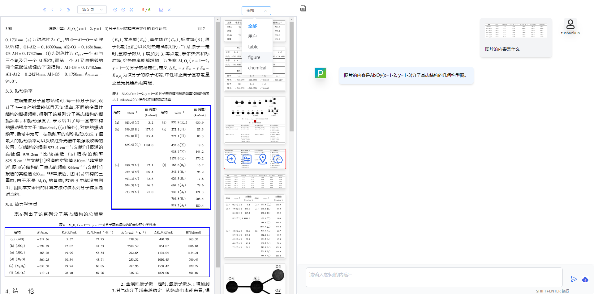

##### ==问题:这是我的代码,如何可以设置当我点击渲染出来的可点击区域后,图片预览栏对应的图片显示一个红色的边框,并且如果图片预览栏里对应的图片不在当前视口的话,自动滚动到当前视口==


要实现点击 PDF 内的可点击区域后在图片预览栏对应的图片显示红色边框，并且确保图片如果不在当前视口中则自动滚动到视口内，你需要在你的 Vue 组件中添加一些逻辑和样式。下面是实现这些功能的步骤：

### 1. 点击事件处理

首先，为每个可点击区域添加点击事件处理函数。这个处理函数将会改变相应图片的状态，显示红色边框，并且检查图片位置，如果不在视口中则滚动到视口内。

#### 修改 `createClickableAreas` 方法 

在创建可点击区域的 div 元素时，添加点击事件监听器：

```javascript
clickableArea.addEventListener('click', () => {
  this.handleImageActivation(coord.imageIndex);
});
```

确保传递一个可以标识对应图片的参数，如 `imageIndex`，这应当是图片在 `pdfPreviewImage` 数组中的索引。

#### 创建 `handleImageActivation` 方法

这个方法负责设置当前激活的图片，并处理滚动逻辑：

```javascript
handleImageActivation(index) {
  this.activeImageIndex = index; // 设置当前激活的图片索引

  // 获取对应的图片元素
  const imgElement = this.$refs.elImage[index].$el;

  // 添加红色边框样式
  this.pdfPreviewImage.forEach((img, idx) => {
    if (idx === index) {
      imgElement.style.border = '2px solid red';
    } else {
      this.$refs.elImage[idx].$el.style.border = 'none';
    }
  });

  // 滚动到图片
  this.scrollToView(imgElement);
}
```

#### 创建 `scrollToView` 方法

这个方法负责将不在视口中的图片滚动到视口内：

```javascript
scrollToView(element) {
  // 仅当元素不在视口中时执行滚动
  if (!this.isElementInViewport(element)) {
    element.scrollIntoView({ behavior: 'smooth', block: 'nearest', inline: 'start' });
  }
}

isElementInViewport(el) {
  const rect = el.getBoundingClientRect();
  return (
    rect.top >= 0 &&
    rect.left >= 0 &&
    rect.bottom <= (window.innerHeight || document.documentElement.clientHeight) &&
    rect.right <= (window.innerWidth || document.documentElement.clientWidth)
  );
}
```

### 2. 样式添加

确保你在 CSS 中有适合的样式设置来显示激活状态：

```css
.image-container /deep/ .el-image {
  border: 1px solid #ddd; /* 默认无红色边框 */
  /* 其他样式不变 */
}
```

`handleImageActivation` 方法会动态改变元素的边框样式。

### 3. 组件状态

在 `data` 方法中添加 `activeImageIndex` 状态用来追踪当前激活的图片索引：

```javascript
data() {
  return {
    activeImageIndex: null,
    // 其他数据不变
  };
}
```

完成以上步骤后，你应该能够达到点击 PDF 的可点击区域，在图片预览栏中对应的图片显示红色边框，并且如果该图片不在当前视口中，会自动滚动到视口的功能。

要让PowerShell脚本在计算机启动时自动执行，您可以使用任务计划程序（Task Scheduler）来设置。这里是如何设置的详终步骤：

### 步骤 1: 创建PowerShell脚本

首先，确保您的PowerShell脚本可以正常运行并且可以实现您想要的功能（比如打开一个软件）。例如，您的脚本可能看起来像这样：

```ps1
# 打开记事本
Start-Process "notepad.exe"
```

保存这个脚本到一个您记得的位置，例如 `C:\Scripts\startup.ps1`。

### 步骤 2: 设置任务计划程序

1. 按 `Win + R` 打开运行窗口，输入 `taskschd.msc` 并回车，这将打开任务计划程序。
2. 在右侧的操作栏中点击“创建基本任务...”。
3. 为任务命名，例如：“Start PowerShell Script on Startup”，并可以选择添加描述，点击“下一步”。
4. 选择“当计算机启动时”作为触发器，然后点击“下一步”。
5. 在“操作”界面中，选择“启动程序”，点击“下一步”。
6. 在“程序或脚本”栏中输入 `powershell.exe`。
7. 在“添加参数 (可选)” 栏中输入 `-ExecutionPolicy Bypass -File "C:\Scripts\startup.ps1"`（请确保路径是您保存脚本的精确位置）。
8. 点击“下一步”并查看摘要是否正确，然后点击“完成”。

### 步骤 3: 测试您的任务

- 重启计算机以测试自动执行脚本是否正常工作。
- 如果脚本没有执行，检查脚本路径和任务设置是否正确。

使用任务计划程序可以使您的脚本在没有任何手动介入的情况下在启动时自动执行。如果您希望更改脚本的行为，只需修改保存的 `.ps1` 脚本文件即可。请确保您的脚本没有错误，并且在预期的执行环境中能正常运行。


你遇到的错误是因为在 `<script setup>` 语法糖中，`this` 关键字的行为与传统 Vue 组件中的不同。在 `<script setup>` 中，`this` 指向的是 setup 函数的返回值，而不是组件实例。

由于 `$store` 是 Vuex 插件注入到组件实例上的属性，所以你不能直接使用 `this.$store`。

**解决方案**：

1. **直接导入 `useStore` 函数**：

   ```javascript
   import { defineComponent, inject, nextTick, ref, reactive, watch, onUnmounted, getCurrentInstance, useStore } from '@vue/composition-api';
   
   export default defineComponent({
     setup(props, { root }) {
       // ... other code
   
       const store = useStore(); // 获取 store 实例
   
       const sumbit = () => {
         // ... other code
         store.commit("updateCancelModelAnswer", true); 
         // ... other code
       }
   
       // ... other code
     }
   });
   ```

2. **使用 `root` 属性**：

   ```javascript
   export default defineComponent({
     setup(props, { root }) { 
       // ... other code
   
       const sumbit = () => {
         // ... other code
         root.$store.commit("updateCancelModelAnswer", true); // 使用 root.$store
         // ... other code
       }
   
       // ... other code
     }
   });
   ```

这两种方法都可以让你在 `<script setup>` 中正确地访问到 Vuex store 实例，并调用 `commit` 方法。


那为什么下面的这样写就不报错


你说的没错！在 `handleChange` 函数中，`this.$store` 确实可以正常工作，这是因为 `handleChange` 函数是被 `el-upload` 组件内部调用的，它的 `this` 指向的是 `el-upload` 组件实例，而不是 `<script setup>` 中的 `setup` 函数返回值。

为了更清楚地说明，我画了一张图：

```
+------------------------+     +------------------------+
|                        |     |                        |
|     el-upload 组件     |     |     <script setup>    |
|                        |     |                        |
+------------------------+     +------------------------+
| this: el-upload 实例 |     |  this: setup 返回值   |
|                        |     |                        |
| - handleChange()       |     |                        |
|                        |     |                        |
+------------------------+     +------------------------+
```

- 当 `el-upload` 组件触发 `handleChange` 事件时，它会调用你定义的 `handleChange` 函数，并将 `this` 指向 `el-upload` 组件实例。
- 由于 `el-upload` 组件实例是传统的 Vue 组件实例，所以它拥有 `$store` 属性，因此 `this.$store` 可以正常工作。

**总结**: `this` 指向取决于函数的调用上下文。在 `<script setup>` 中，你需要特别注意 `this` 的行为。如果函数是在 `<script setup>` 外部被调用的，那么 `this` 可能不会指向你期望的对象。在这种情况下，你需要使用 `useStore` 函数或 `root` 属性来访问 Vuex store 实例。




您提供的三种深拷贝方法都是常见的实现方式，每种方法都有其适用场景和限制。让我们逐一分析：

1. JSON.parse(JSON.stringify(obj))
   - 优点：简单、快速
   - 缺点：如您所说，有很多局限性，不能处理函数、undefined、Symbol、循环引用等
   - 适用：适合简单的数据结构，且不包含特殊类型数据
2. 递归实现 (deepCopy 函数)
   - 优点：可以处理嵌套对象和数组
   - 缺点：
     - 不能处理循环引用
     - 不能正确复制特殊对象（如 Date、RegExp、Map、Set 等）
     - 不能复制对象的原型链
     - 不能处理 Symbol 类型的键
   - 改进建议：
     - 添加循环引用检测
     - 添加对特殊对象类型的处理
     - 考虑使用 Object.create() 来保留原型链
3. 使用 lodash 的 _.cloneDeep()
   - 优点：
     - 功能全面，可以处理大多数复杂情况
     - 包括循环引用、特殊对象类型、Symbol 键等
     - 经过广泛测试和优化
   - 缺点：
     - 需要引入额外的库，增加了项目体积
   - 适用：复杂的深拷贝需求，尤其是在已经使用 lodash 的项目中

总结：

- 对于简单数据结构，JSON 方法足够
- 对于稍复杂的情况，可以使用改进后的递归方法
- 对于非常复杂或关键的深拷贝需求，使用成熟的库如 lodash 是最安全和全面的选择

改进的递归深拷贝函数示例：

```javascript
function deepCopy(obj, hash = new WeakMap()) {
  if (Object(obj) !== obj) return obj; // primitives
  if (hash.has(obj)) return hash.get(obj); // cyclic reference
  let result;
  if (obj instanceof Set) {
    result = new Set(obj); // 处理 Set
  } else if (obj instanceof Map) {
    result = new Map(Array.from(obj, ([key, val]) => [key, deepCopy(val, hash)])); // 处理 Map
  } else if (obj instanceof Date) {
    result = new Date(obj); // 处理 Date
  } else if (obj instanceof RegExp) {
    result = new RegExp(obj.source, obj.flags); // 处理 RegExp
  } else if (typeof obj === 'function') {
    return obj; // 处理函数
  } else {
    result = Array.isArray(obj) ? [] : Object.create(Object.getPrototypeOf(obj));
  }
  hash.set(obj, result);
  return Object.assign(result, ...Object.keys(obj).map(
    key => ({ [key]: deepCopy(obj[key], hash) })
  ));
}
```

这个改进版本处理了更多的边界情况，包括循环引用、特殊对象类型和原型链。但即便如此，对于非常复杂的情况，使用经过充分测试的第三方库仍然是更安全的选择。


检测对象是否存在循环引用是一个重要的问题，特别是在处理深拷贝、序列化或遍历复杂对象时。以下是几种检测循环引用的方法：

1. 使用 WeakMap（推荐）

这是一种高效且内存友好的方法：

```javascript
function hasCycle(obj) {
  const seenObjects = new WeakMap();

  function detect(obj) {
    if (obj && typeof obj === 'object') {
      if (seenObjects.has(obj)) {
        return true;
      }
      seenObjects.set(obj, true);
      for (let key in obj) {
        if (Object.prototype.hasOwnProperty.call(obj, key) && detect(obj[key])) {
          return true;
        }
      }
    }
    return false;
  }

  return detect(obj);
}
```

WeakMap 允许使用对象作为键，而且不会阻止这些对象被垃圾回收。

1. 使用数组

这种方法简单，但对于大型对象可能会消耗更多内存：

```javascript
function hasCycle(obj) {
  const seenObjects = [];

  function detect(obj) {
    if (obj && typeof obj === 'object') {
      if (seenObjects.indexOf(obj) !== -1) {
        return true;
      }
      seenObjects.push(obj);
      for (let key in obj) {
        if (Object.prototype.hasOwnProperty.call(obj, key) && detect(obj[key])) {
          return true;
        }
      }
      seenObjects.pop();
    }
    return false;
  }

  return detect(obj);
}
```

1. 使用 Set

Set 提供了比数组更高效的查找：

```javascript
function hasCycle(obj) {
  const seenObjects = new Set();

  function detect(obj) {
    if (obj && typeof obj === 'object') {
      if (seenObjects.has(obj)) {
        return true;
      }
      seenObjects.add(obj);
      for (let key in obj) {
        if (Object.prototype.hasOwnProperty.call(obj, key) && detect(obj[key])) {
          return true;
        }
      }
      seenObjects.delete(obj);
    }
    return false;
  }

  return detect(obj);
}
```

1. JSON.stringify 方法（不推荐）

虽然不是专门用于检测循环引用，但 JSON.stringify 在遇到循环引用时会抛出错误：

```javascript
function hasCycle(obj) {
  try {
    JSON.stringify(obj);
    return false;
  } catch (err) {
    return err.message.includes('Converting circular structure to JSON');
  }
}
```

这种方法简单但不太可靠，因为它可能会因为其他原因也抛出错误。

使用示例：

```javascript
const obj1 = { a: 1 };
const obj2 = { b: obj1 };
obj1.c = obj2;

console.log(hasCycle(obj1)); // true

const obj3 = { x: 1, y: { z: 2 } };
console.log(hasCycle(obj3)); // false
```

总结：

- WeakMap 方法通常是最佳选择，因为它既高效又内存友好。
- 对于简单情况，Set 或数组方法也可以使用。
- 避免使用 JSON.stringify 方法，因为它可能会产生误报。

选择哪种方法取决于你的具体需求、性能要求和对象的复


Vite 比 Webpack 快的原因主要有以下几点:

1. 利用浏览器原生 ES 模块

Vite 直接利用浏览器原生的 ES 模块功能,不需要像 Webpack 那样打包所有模块。开发时 Vite 只需要转换和提供源文件,浏览器负责解析导入。

1. 按需编译

Vite 只在需要时编译某个模块,而 Webpack 需要先构建整个依赖图再编译。Vite 的按需编译大大减少了不必要的工作。

1. 预构建依赖

Vite 会预先构建项目的依赖,并缓存结果。这样后续启动时可以直接使用缓存,避免重复工作。

1. esbuild 预构建

Vite 使用 esbuild 来预构建依赖。esbuild 使用 Go 编写,比传统的 JavaScript 构建工具快 10-100 倍。

1. 高效的热更新

Vite 的热更新只需要精确地使已编辑的模块与其最近的 HMR 边界之间的链失活,不需要重新构建整个束或刷新页面。

1. 优化的静态资源处理

Vite 对静态资源如图片等进行了优化处理,避免不必要的转换。

1. 内置优化

Vite 针对 SPA、库模式等场景提供了内置的优化默认配置。

1. 简化的配置

相比 Webpack,Vite 的配置更加简洁直观,减少了很多复杂性。

1. 利用现代浏览器特性

Vite 面向现代浏览器,可以利用它们的新特性来提升性能。

总的来说,Vite 通过更现代的架构设计和技术选型,在开发环境下实现了显著的性能提升。不过在生产构建时,Vite 和 Webpack 的差异就没那么大了,因为都需要打包优化代码

## apply,call

apply(thisArg, [argsArray])：接受一个数组或类数组对象作为参数列表。

call(thisArg, arg1, arg2, ...)：接受若干个参数。