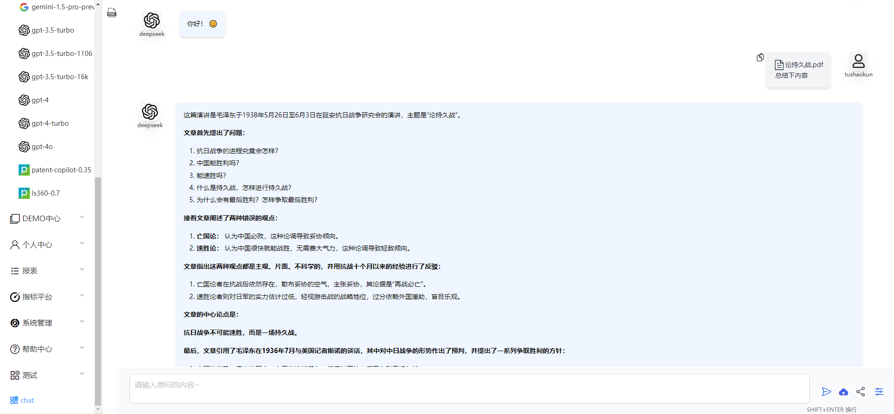

# 5-20

###### 侧边栏新开新对话页面入口

###### 对路由路径进行调整配置

###### 对平台目前问答页面主要内容和逻辑进行熟悉

###### 将平台已有问答页面复用到新的问答页面

###### 对新问答页面进行部分重构

###### 修改部分源码配置使用的模型

###### 更改文件上传的问答展示

###### 图片和pdf的上传不再显示具体文件内容和问题重述

###### 对文件上传图标进行修改，从先前的图片图标修改为上传的云朵使其更加合理

###### 当前页面内容

