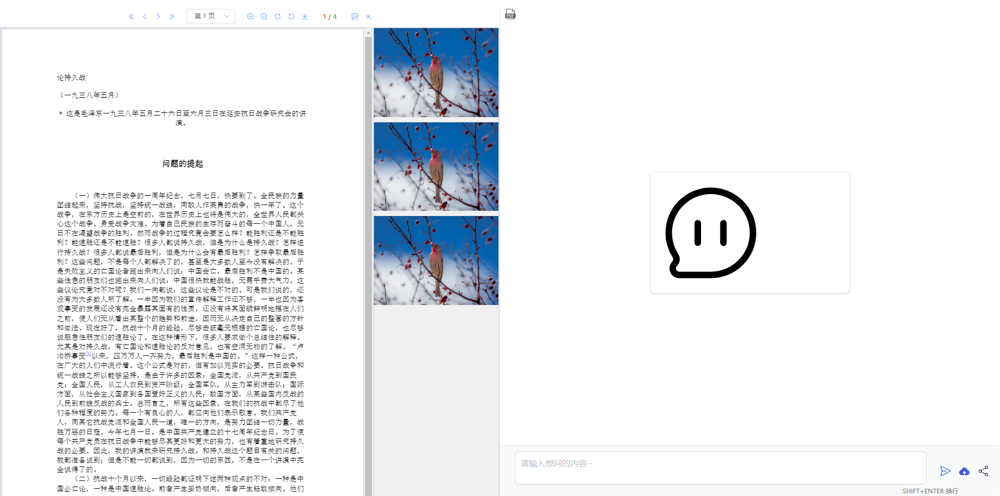
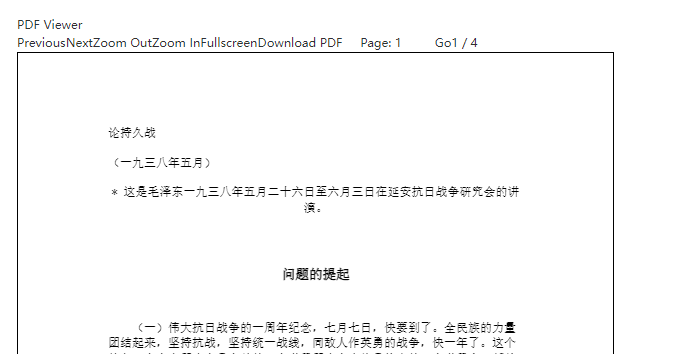

# 5-22

#### pdf预览界面工具栏优化

#### 对pdf预览部分组件进行重构,分配图片展示部位的位置

#### 使用假数据来模拟呈现,页面呈现

#### pdf部分和图片部分设置各自单独的滚动条

#### 尝试根据坐标位置截取pdf上对应位置的图片

#### 其中需要涉及到pdfjs库中各种api的使用,以及canvas的操作

#### 在使用基于pdfjs封装的vue-pdf库对pdfjs的一些原生方法的获取中出现获取不到的问题,暂时未解决

#### 其他思路:使用pdfjs来对代码进行重构,再通过直接调用原生api的方式进行尝试和操作

#### 为项目安装pdfjs包的过程中,由于项目node版本为14,而pdfjs要求>18,由于项目相应依赖版本都比较旧,更改node版本会导致各种报错和依赖冲突导致项目无法运行

#### 尝试使用较旧的pdfjs版本,在使用过程中产生了冲突,暂时未解决

#### 搁置本地引入的方式,使用cdn来做尝试,在本地可以运行

#### 下步计划:

###### 由于项目当前基于vuepdf来构建,再次尝试vue-pdf去做渲染,看看库的源码看能不能找到解决方案

###### 如果尝试失败,尝试基于pdfjs的构建,并对代码进行重构,使用原生api来继续进行尝试和构建