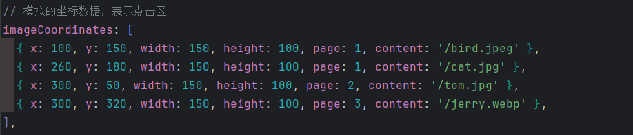
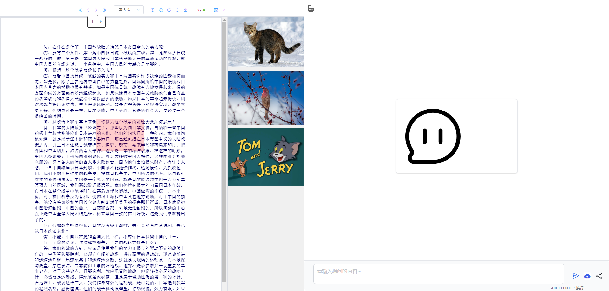

# 5-23

##### 细分实现步骤,向pdf页面添加点击区域

###### 点击区域通过绝对定位和暂时模拟的假数组对象坐标来确定

###### 具体方式通过获取pdf对象的dom元素节点使用原生JS的api来实现

###### 然后给添加的可点击区域设置一个有色背景色,便于下一步调试

###### 设置数组对象,通过给点击区域添加click监听器来实现点击后图片添加到侧边栏

###### 到此有了新的实现思路,不一定非要通过canva来渲染绘制截取坐标内的图片,也可以通过数组中url信息来对数据进行添加和展示

###### 完善点击区域逻辑,根据数组信息,不同的页面建立不同的可点击区域,切换页面后清除上一页的点击区域,否则上一页的点击区域会继续留存

###### 进一步模拟完善,点击区域的监听器中添加对应数组中图片的url信息来实现不同点击区域的点击展示不同的图片

###### 细化数组信息当前为:坐标,页码,图片url

###### 完善逻辑,根据不同页码来创建不同点击区域

##### 逻辑优化,每个点击区域的点击只能添加一次对应图片

###### 当前界面

