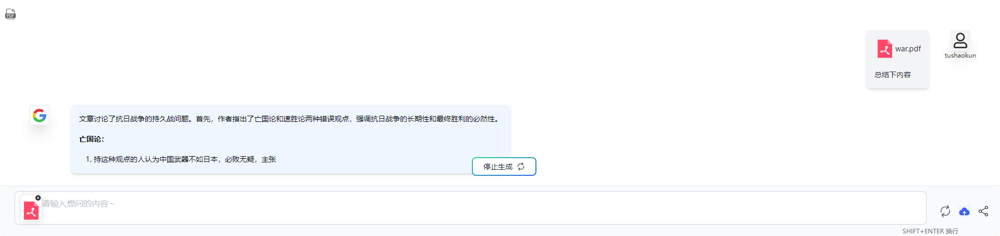
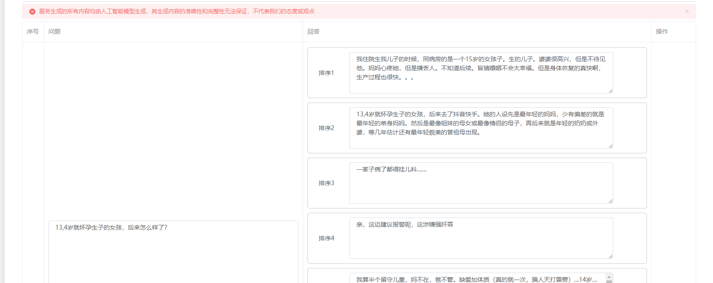

# 5-30

##### 对话组件部分代码进行删减和重构

###### 解决了取消解析后再次对话请求信息中ai部分内容为空的bug

###### 替换源代码的文件图标

###### 对直接上传pdf文件到后端进行探索尝试

###### 实际数据集下拖拽排序功能的初步测试

###### 现存问题:

- ###### response过多时当前页面展示不下的问题

- ###### 当前排版对于大数据量下表现出的“不适应”

- ###### 排序后没有标记提示间接体现的操作后反应不直观