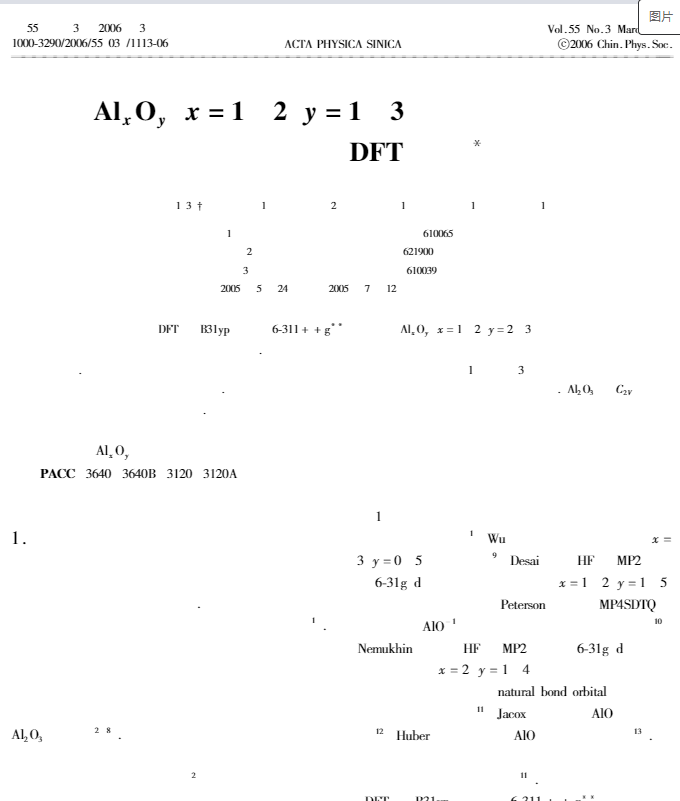
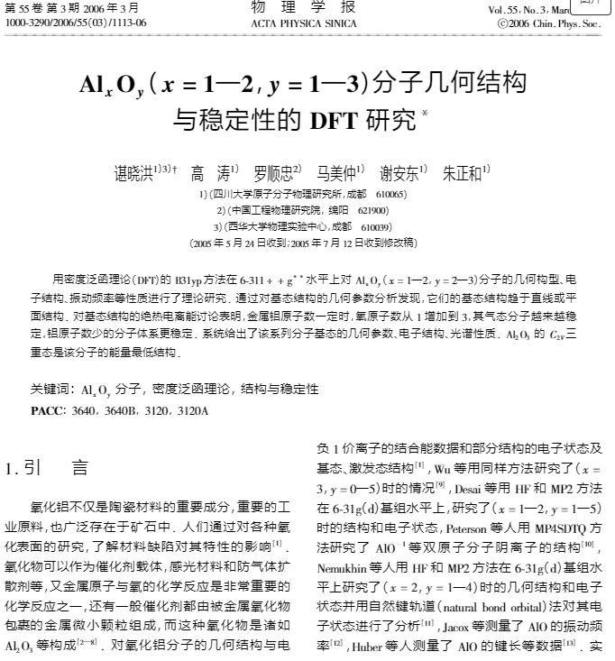

# 6-3

###### 优化逻辑,upload选择非pdf文件不触发向后端发送请求

###### 优化逻辑,upload选择非pdf文件不合理的消息提示

###### 实现表格图片的点击放大预览

###### 表格图片获取成功时的标识tip

##### 解决了vue-pdf不显示中文字体的问题

###### 添加不同类别的图片信息下拉框,完善相关展示逻辑

###### pdf文件名过长时文件图标的优化

###### 完善pdf图片数据未成功加载时的提示信息

###### 完善页面部分逻辑