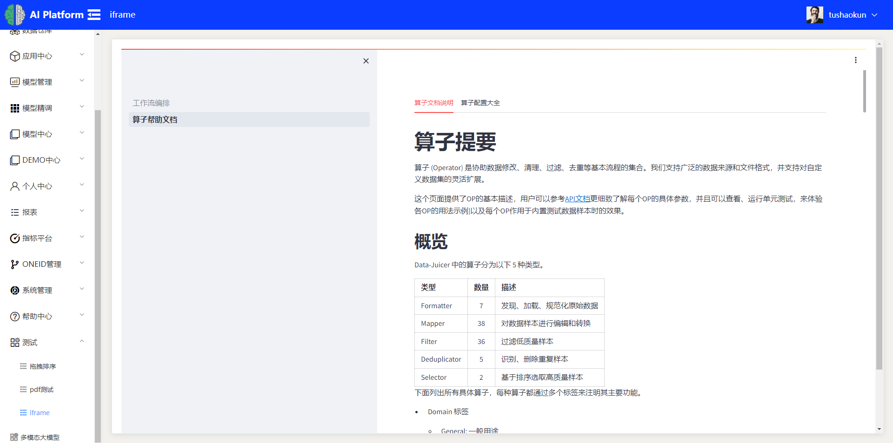

# 7-2

#### 数据集排序页面结构修改

元素不在一行时通过elementui的gutter和span属性来嵌套和应用

#### 添加鼠标悬浮一键生成和删除的功能项

通过外层绝对定位,内层相对定位来实现

出现第一条回答上方的功能项超出部分被隐藏问题,原因为第三方组件库的样式设置

使用z-index来提高层级无效,因为overflow为hidden时z-index无效

通过浏览器开发者工具来对框架的样式进行查找和调试

定位到对应的回答框节点,将对应样式赋值到组件

再通过first-child选择器来进行定位来解决

#### 在当前框架内通过iframe嵌套站点

应用百分比来对宽高进行设置出现元素宽高无法撑开的情况,将基本单位修改为vh,百分比继承自父元素,修改父元素会造成页面其他结构出现问题,采用vh只应用在当前视口,不会产生其他关联性问题

