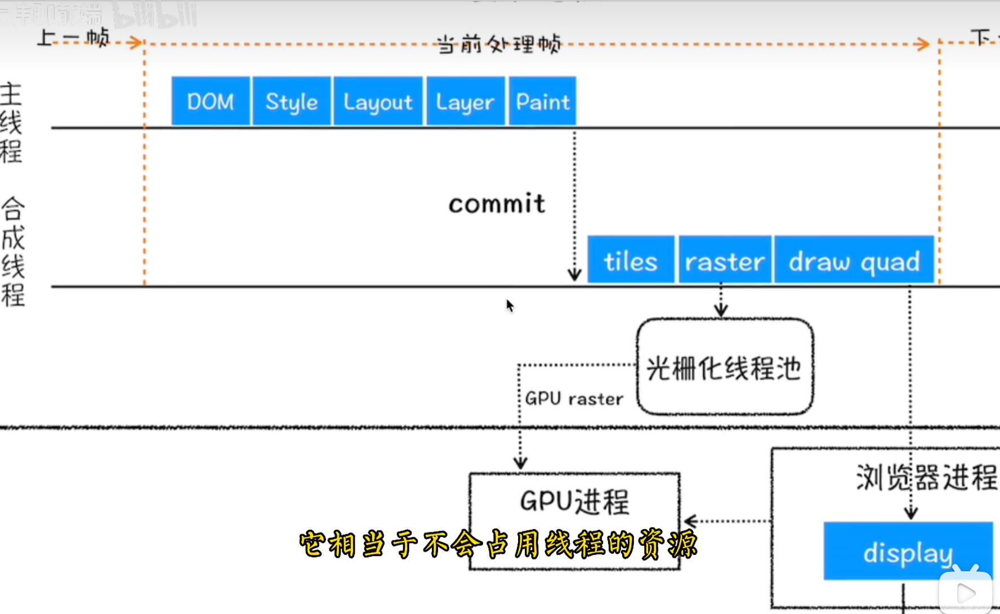

## UI更新是在事件循环的哪个阶段

在浏览器的事件循环（Event Loop）机制中，UI更新通常发生在**渲染阶段（渲染帧）**。但是，为了全面理解UI更新的时机，我们需要了解事件循环的各个阶段。

### 浏览器事件循环的简化过程

1. **宏任务队列（Macro-task Queue）**：
   - 包含整体脚本、定时器（如`setTimeout`、`setInterval`）、UI事件处理、I/O等。
   - 每次迭代循环时，浏览器会从宏任务队列中取出并执行一个宏任务，然后检查微任务队列。

2. **微任务队列（Micro-task Queue）**：
   - 包含Promise回调（`.then()`、`.catch()`、`.finally()`）、`MutationObserver`等。
   - 在当前宏任务执行结束后，会立即执行微任务队列中的所有任务。

3. **渲染阶段（Rendering）**：
   - 在所有微任务完成后，浏览器将开始准备更新UI。
   - 如果需要重绘或回流（即渲染更新），渲染阶段会处理这些。

### UI更新

UI更新是**在所有的微任务执行完毕后和下一个宏任务开始之前进行的**。具体概述如下：

- **渲染触发时机**：
  - 浏览器通常执行一次宏任务后——包括其相关的所有微任务——会检查是否需要进行UI更新。
  - UI更新包括重新计算样式、布局和绘制等过程。
  
- **优化机制**：
  - 多数浏览器有自己的优化机制，如在高频率操作时（比如持续触发JavaScript事件、快速变动DOM、快速改变CSS样式等），它们会合并这些操作，减少不必要的渲染，以提高性能。

- **requestAnimationFrame**：
  - 浏览器提供的`requestAnimationFrame`是一个可以在下一次重绘前执行的回调，非常适合用于动画等需要精确控制的UI更新。

通过了解事件循环的这些阶段，我们知道UI更新通常发生在每个宏任务和关联微任务完成后的渲染阶段。当你编写涉及频繁UI变化的JavaScript代码时，记得善用`requestAnimationFrame`来优化性能，确保平滑的用户体验。

## 判断设备类型

使用 JavaScript 判断用户端设备类型可以通过多种方法。其中最常用的方法是检查 `navigator.userAgent` 属性，该属性包含一个字符串，描述了浏览器和操作系统的相关信息。基于这个字符串，可以检测设备是桌面设备、手机还是平板。

以下是几个常见的方法和示例代码：

### 1. 使用 `navigator.userAgent`

可以通过解析 `navigator.userAgent` 字符串来判断设备类型。虽然这种方法有些繁琐，但能够覆盖较多的情况。

```javascript
function detectDevice() {
    const userAgent = navigator.userAgent.toLowerCase();

    if (userAgent.includes("mobile")) {
        return "Mobile";
    } else if (userAgent.includes("tablet") || (userAgent.includes("ipad") || (userAgent.includes("android") && !userAgent.includes("mobile")))) {
        return "Tablet";
    } else {
        return "Desktop";
    }
}

console.log(detectDevice()); // 输出设备类型
```

### 2. 使用 `navigator.userAgentData` (更现代的解决方案)

一些现代浏览器提供了 `navigator.userAgentData` 接口，其结构化数据比 `navigator.userAgent` 更加可靠。

```javascript
if (navigator.userAgentData) {
    navigator.userAgentData.getHighEntropyValues(['platform', 'model'])
    .then(ua => {
        console.log('platform:', ua.platform);
        console.log('model:', ua.model);
        if (ua.mobile) {
            console.log('Mobile');
        } else {
            console.log('Desktop or Tablet');
        }
    });
} else {
    console.log('navigator.userAgentData is not supported');
}
```

### 3. 使用特定的库

可以使用一些第三方库，例如 Mobile-Detect.js。这些库通常维护得比较好，也有较广泛的社区支持。

```html
<script src="https://cdnjs.cloudflare.com/ajax/libs/mobile-detect/1.4.5/mobile-detect.min.js"></script>
<script>
    const md = new MobileDetect(window.navigator.userAgent);
    if (md.mobile()) {
        console.log("Mobile");
    } else if (md.tablet()) {
        console.log("Tablet");
    } else {
        console.log("Desktop");
    }
</script>
```

### 4. 使用 CSS 媒体查询与 JavaScript 结合

可以结合 CSS 媒体查询和 JavaScript 来判断设备类型。例如，通过 JavaScript 检测当前视口宽度：

```javascript
function getDeviceType() {
    if (window.matchMedia("(max-width: 767px)").matches) {
        return "Mobile";
    } else if (window.matchMedia("(min-width: 768px) and (max-width: 1024px)").matches) {
        return "Tablet";
    } else {
        return "Desktop";
    }
}

console.log(getDeviceType()); // 输出设备类型
```

### 总结

1. 使用 `navigator.userAgent` 是一种经典的方法，但字符串解析可能会因为设备字符串的多样性而变得复杂和不易维护。
2. `navigator.userAgentData` 是较为现代和结构化的方式，但兼容性尚未覆盖所有浏览器，需要做好兼容性检查。
3. 第三方库如 Mobile-Detect.js 提供了方便的接口，但需要引入额外的资源。
4. 结合 CSS 媒体查询也可以判断设备类型，尤其在响应式布局的场景下非常有用。

根据具体情况和需求，选择合适的方法来判断用户端设备类型。

## 单行和多行文字中设置省略号

在Web开发中，处理文本溢出时常需要使用省略号来表示内容超出了可见区域。这可以通过CSS实现，下面就单行和多行文本分别讲解如何设置省略号。

### 单行文本设置省略号

要在单行文本中添加省略号，可以使用以下CSS属性：

```css
.ellipsis-single {
    white-space: nowrap;         /* 强制文本不换行 */
    overflow: hidden;            /* 隐藏超出容器的部分 */
    text-overflow: ellipsis;     /* 使用省略号表示溢出的文本 */
    width: 200px;                /* 设置元素的宽度限制 */
}
```

**使用示例：**

```html
<div class="ellipsis-single">
    这是一段很长的文本，需要在溢出时显示省略号。
</div>
```

### 多行文本设置省略号

多行文本溢出时添加省略号相对复杂一些，因为CSS没有原生属性能直接支持多行省略号，我们通常会使用更加现代的CSS特性来实现，例如 `-webkit-line-clamp`（需要结合其他属性一起使用）：

```css
.ellipsis-multi {
    display: -webkit-box;             /* 必须结合 -webkit-line-clamp 使用 */
    -webkit-box-orient: vertical;     /* 垂直布局 */
    overflow: hidden;                 /* 隐藏溢出内容 */
    text-overflow: ellipsis;          /* 虽然用于单行，但仍然需要，否则不兼容 */
    -webkit-line-clamp: 3;            /* 显示的行数 */
    max-height: 4.5em;                /* 需要根据行高和行数自己调整 */
    line-height: 1.5em;               /* 配合行高使用 */
    width: 200px; /* 增加宽度 */
    font-size: 14px; /* 设置合适的字体大小 */
    border: 1px solid black; /* 添加边框以便观察 */
}
```

**使用示例：**

```html
<div class="ellipsis-multi">
    这是一段很长的文本。这里会有多行内容，当文本超过三行时，将会显示省略号。继续添加更多的文字以确保文本长度足够长以进行测试。
</div>
```

### 注意事项

- **兼容性**：`-webkit-line-clamp` 是一个 WebKit 前缀属性，最初由 Safari 提出，因此在一些旧版非 WebKit 浏览器中可能不兼容。现代浏览器如 Chrome、Safari 和新版 Edge 都能很好地支持。对于非 WebKit 浏览器如 Firefox，目前没有直接相应的属性实现多行省略号，需要用 JavaScript 来手动截断文本。
  
- **替代方案**：对于那些需要更兼容性的情况，可能需要借助 JavaScript 进行动态的文本截断处理，并手动添加省略号，尤其是在需要多浏览器支持的项目中。

通过这些方法，您可以在单行或多行文本中过滤内容并使用省略号来提示用户存在更多内容，提升用户体验。

## 元素的水平和垂直居中

实现元素的水平和垂直居中可以通过多种方法来实现，选择哪种方法主要取决于具体的需求和布局环境。以下是一些常用的方法：

### 1. 使用 `flexbox`

最简单和现代的方法之一是使用 CSS 的 Flexbox 布局，适用于同一容器中的单个子元素或多个子元素。

```html
<div class="container">
    <div class="centered">
        内容居中
    </div>
</div>
```

```css
.container {
    display: flex;
    justify-content: center; /* 水平居中 */
    align-items: center;    /* 垂直居中 */
    height: 100vh;          /* 使容器的高度与视口高度一致 */
}
```

### 2. 使用 CSS Grid

类似于 Flexbox，CSS Grid 也是一种用于布局的现代技术。

```html
<div class="container">
    <div class="centered">
        内容居中
    </div>
</div>
```

```css
.container {
    display: grid;
    place-items: center;   /* 简写形式，可以同时进行水平和垂直居中 */
    height: 100vh;
}
```

### 3. 使用 `position` 和 `transform`

适用于不知道元素的确切宽高时。

```html
<div class="container">
    <div class="centered">
        内容居中
    </div>
</div>
```

```css
.container {
    position: relative;
    height: 100vh;
}

.centered {
    position: absolute;
    top: 50%;
    left: 50%;
    transform: translate(-50%, -50%);  /* 使用 transform 将元素从中心拉回 */
}
```

### 4. 使用 `table` 布局

利用表格布局借助 CSS 来实现。

```html
<div class="container">
    <div class="centered">
        内容居中
    </div>
</div>
```

```css
.container {
    display: table;
    width: 100vw;
    height: 100vh;
}

.centered {
    display: table-cell;
    vertical-align: middle;   /* 垂直居中 */
    text-align: center;       /* 水平居中 */
}
```

### 5. 行内块级元素结合文本居中

适用于简单行内内容的居中。

```html
<div class="container">
    <span class="centered">内容居中</span>
</div>
```

```css
.container {
    text-align: center; /* 水平居中 */
    height: 100vh; 
    line-height: 100vh; /* 使行高等于容器高度以实现垂直居中 */
}

.centered {
    display: inline-block; 
    line-height: normal;   /* 恢复行高为标准 */
    vertical-align: middle;
}
```

选择哪个方法主要取决于：
- 浏览器兼容性（Flexbox 和 Grid 是现代浏览器支持的方法）
- 内容和父容器的布局环境
- 对简单布局的偏好或复杂布局的要求

## meta

`<meta>` 标签是 HTML 中用于指定网页元数据的标签。元数据不会直接显示在网页上，但对页面的描述、关键词、作者信息、字符集声明等有重要作用。一些常用的元数据是给搜索引擎和浏览器使用的，以帮助和提供页面的正确展示和更优的搜索效果。

### 常用 `meta` 标签类型及示例

以下是一些常见的 `meta` 标签及其用途：

#### 1. 字符集声明

指定网页使用的字符编码，确保网页内容正确显示：

```html
<meta charset="UTF-8">
```

#### 2. 设置页面视口

对于响应式设计非常重要，帮助布局在不同设备上的表现：

```html
<meta name="viewport" content="width=device-width, initial-scale=1.0">
```

- `width=device-width`：设置视口宽度等于设备宽度。
- `initial-scale=1.0`：设置页面初始缩放比例。

#### 3. 提供页面描述

用于搜索引擎结果中的页面描述，有助于 SEO：

```html
<meta name="description" content="这是一个示例网页的描述。">
```

#### 4. 关键词

提供页面的关键词列表，但现代搜索引擎对其依赖度较低：

```html
<meta name="keywords" content="HTML, CSS, JavaScript, 示例">
```

#### 5. 作者信息

指定页面作者：

```html
<meta name="author" content="张三">
```

#### 6. 刷新/重定向

设置多少秒后刷新页面或重定向到新 URL：

```html
<meta http-equiv="refresh" content="5;url=https://www.example.com">
```

上述示例表示页面将在 5 秒后重定向到指定的 URL。

#### 7. HTTP 标头信息

可以发出各种 HTTP 标头命令：

```html
<meta http-equiv="X-UA-Compatible" content="IE=edge">
```

上面的例子告诉 IE 浏览器用最新版本的渲染引擎进行渲染。

#### 8. 防止页面缓存

防止页面被缓存：

```html
<meta http-equiv="cache-control" content="no-cache">
<meta http-equiv="pragma" content="no-cache">
```

#### 9. OGP（Open Graph Protocol）标签

用于增强共享到社交平台时的展示效果：

```html
<meta property="og:title" content="这是页面标题">
<meta property="og:description" content="这是页面描述">
<meta property="og:image" content="https://www.example.com/image.jpg">
<meta property="og:url" content="https://www.example.com">
```

#### 10. Viewport Control

用于移动设备优化：

```html
<meta name="viewport" content="width=device-width, initial-scale=1, shrink-to-fit=no">
```

### 示例

结合以上常用的 `meta` 标签，下面是一个完整的 HTML 示例：

```html
<!DOCTYPE html>
<html lang="zh-CN">
<head>
    <meta charset="UTF-8">
    <meta name="viewport" content="width=device-width, initial-scale=1.0">
    <meta name="description" content="这是一个示例网页的描述。">
    <meta name="keywords" content="HTML, CSS, JavaScript, 示例">
    <meta name="author" content="张三">
    <meta http-equiv="X-UA-Compatible" content="IE=edge">
    <meta property="og:title" content="这是页面标题">
    <meta property="og:description" content="这是页面描述">
    <meta property="og:image" content="https://www.example.com/image.jpg">
    <meta property="og:url" content="https://www.example.com">
    <title>示例网页</title>
</head>
<body>
    <h1>欢迎来到示例网页</h1>
    <p>这是网页的内容。</p>
</body>
</html>
```

### 结论

`<meta>` 标签在 HTML 页面中扮演了非常重要的角色，用于定义页面的元数据。这些数据不仅对浏览器的正确显示和页面性能优化至关重要，还对用户体验和搜索引擎优化（SEO）有很大的影响。因此，正确理解和使用 `<meta>` 标签是前端开发中必不可少的一部分。

## 盒子模型

一个盒子由四个部分组成：`content`、`padding`、`border`、`margin`

`CSS`中，盒子模型可以分成：

- W3C 标准盒子模型
- IE 怪异盒子模型
- 默认情况下，盒子模型为`W3C` 标准盒子模型

1. **标准盒模型：**
   - 在标准盒模型中，元素的宽度和高度（width 和 height）属性值只包括内容区域的大小，不包括内边距（padding）、边框（border）和外边距（margin）。
   - `即元素的实际宽度和高度是由内容区域的大小加上内边距、边框和外边距的总和确定的。`
   - 这种盒模型是 CSS 标准规定的默认行为，也是现代浏览器的默认行为。
2. **怪异盒模型：**
   - 在怪异盒模型中，元素的宽度和高度（width 和 height）属性值包括内容区域、内边距和边框的大小，但不包括外边距。
   - `即元素的实际宽度和高度是由内容区域的大小加上内边距和边框的总和确定的。`
   - 怪异盒模型通常在老版本的浏览器（如 IE6 及以下）中存在，是这些浏览器的默认行为。当页面处于怪异模式（Quirks Mode）时，浏览器会采用怪异盒模型。

width部分不同,标准盒模型是content,怪异盒模型是content + border + padding

比如在怪异盒模型下，你设置width之后在设置padding，总的宽度是不变的，而是会挤压内容区

## css选择器

`css`属性选择器常用的有：

- id选择器（#box），选择id为box的元素
- 类选择器（.one），选择类名为one的所有元素
- 标签选择器（div），选择标签为div的所有元素
- 后代选择器（#box div），选择id为box元素内部所有的div元素
- 子选择器（.one>one_1），选择父元素为.one的所有.one_1的元素
- 相邻同胞选择器（.one+.two），选择紧接在.one之后的所有.two元素
- 群组选择器（div,p），选择div、p的所有元素

#### 优先级

`内联` >` ID选择器` > `类选择器` > `标签选择器`

如果外部样式需要覆盖内联样式，就需要使用`!important`

#### 继承属性

- 字体系列属性

```javascript
font:组合字体
font-family:规定元素的字体系列
font-weight:设置字体的粗细
font-size:设置字体的尺寸
font-style:定义字体的风格
font-variant:偏大或偏小的字体
```

- 文本系列属性

```javascript
text-indent：文本缩进
text-align：文本水平对刘
line-height：行高
word-spacing：增加或减少单词间的空白
letter-spacing：增加或减少字符间的空白
text-transform：控制文本大小写
direction：规定文本的书写方向
color：文本颜色
```

- 元素可见性

```javascript
visibility
```

- 表格布局属性

```css
caption-side：定位表格标题位置
border-collapse：合并表格边框
border-spacing：设置相邻单元格的边框间的距离
empty-cells：单元格的边框的出现与消失
table-layout：表格的宽度由什么决定
```

- 列表属性

```javascript
list-style-type：文字前面的小点点样式
list-style-position：小点点位置
list-style：以上的属性可通过这属性集合
```

- 引用

```css
quotes：设置嵌套引用的引号类型
```

- 光标属性

```css
cursor：箭头可以变成需要的形状
```

继承中比较`特殊`的几点：

- `a 标签`的`字体颜色`不能被继承
- `h1-h6`标签字体的大小也是不能被继承的

#### 无继承的属性

- display
- 文本属性：vertical-align、text-decoration
- 盒子模型的属性：宽度、高度、内外边距、边框等
- 背景属性：背景图片、颜色、位置等
- 定位属性：浮动、清除浮动、定位position等
- 生成内容属性：content、counter-reset、counter-increment
- 轮廓样式属性：outline-style、outline-width、outline-color、outline
- 页面样式属性：size、page-break-before、page-break-after

## em/px/rem/vh/vw区别

`em`、`px`、`rem`、`vh` 和 `vw` 是 CSS 中常见的长度单位。它们用于定义元素的宽度、高度、间距和字体大小等属性。每种单位都有其独特的使用场景和优点。

### 1. `px`（像素）

- **定义:** 像素是屏幕上显示的最小单位，也是最常用的长度单位之一。
- 特点:
  - 绝对单位，固定大小，不随其他元素的变化而变化。
  - 容易理解和使用。
- 缺点:
  - 不利于网页的响应式设计，因为在不同分辨率的屏幕上，像素的大小是不同的。
  - 在高分辨率屏幕上，使用像素可能会导致元素过小。

### 2. `em(相对单位)`

`em` 是一个相对单位，相对于其父元素的字体大小。如果没有明确的父元素字体大小设置，它继承自浏览器的默认字体大小（通常是16px）。

- 特点:
  - 相对单位，会随着父元素字体大小的变化而变化。
  - 可以实现字体大小的相对缩放，使网页在不同字体大小设置下保持一致性。
- 缺点:
  - 计算较为复杂，因为需要考虑父元素的字体大小。
  - 如果嵌套层级较多，可能会导致字体大小难以控制。

#### 示例：
```css
.parent {font-size: 16px; /* 1em = 16px */}
.child {font-size: 2em; /* 2em = 32px */}
```

### 3. `rem`（根`em`）

`rem` 也是一个相对单位，但与 `em` 不同，它始终相对于根元素（通常是 `<html>`）的字体大小。默认情况下，`<html>` 的字体大小是16px。

- - 相对单位，会随着根元素字体大小的变化而变化。
  - 类似于 `em`，但更容易控制，因为其参照物始终是根元素。
  - 非常适合用于响应式网页设计，可以通过改变根元素的字体大小来实现全局缩放。
- 缺点:
  - 需要开发者手动设置根元素的字体大小。可以使用媒体查询来对根元素字体进行设置

#### 示例：
```css
html {font-size: 16px; /* 1rem = 16px */}
.element {font-size: 2rem; /* 2rem = 32px */}
```

### 4. `vh`（视口高度）

`vh` 是一个相对单位，根据当前视口（viewport）的高度进行计算。1vh 等于视口高度的1%。

#### 特点：
- 自适应性强，基于当前视口尺寸。
- 适合全屏布局和高度自适应设计。

```css
.full-height {height: 100vh; /* 高度等于视口高度 */}
```

### 5. `vw`（视口宽度）

`vw` 是一个相对单位，根据当前视口（viewport）的宽度进行计算。1vw 等于视口宽度的1%。

- 自适应性强，基于当前视口尺寸。
- 适合全屏布局和宽度自适应设计。

#### 示例：
```css
.full-width {width: 100vw; /* 宽度等于视口宽度 */}
```

### 选择单位时的考虑因素

1. **精确控制：** 如果你需要精确控制元素的大小，尤其是像素级别的控制，`px` 是首选。
2. **响应式设计：** 如果你希望你的设计在不同设备和屏幕尺寸下都能很好地适应，`rem`、`vh` 和 `vw` 是不错的选择。
3. **继承性和一致性：** 使用 `rem` 单位可以避免 `em` 嵌套带来的一些问题，从而获得一致的大小控制。
4. **动态适应：** 对于动态适应的布局，如全屏横幅，`vh` 和 `vw` 是理想的选择。

### 总结

- 对于需要固定大小的元素，可以使用 `px`。
- 对于需要根据字体大小进行缩放的元素，可以使用 `em` 或 `rem`，其中 `rem` 更容易控制。
- 对于需要根据视窗大小进行布局的元素，可以使用 `vh` 或 `vw`。

- `vh` 和 `vw`：基于视口的高度和宽度，适用于全屏和自适应布局。

## 设备像素、css像素、设备独立像素、dpr、ppi 之间的区别

理解设备像素、CSS像素、设备独立像素、DPR 和 PPI 之间的区别对于现代前端开发尤为重要，这些概念在响应式设计、高分辨率显示和跨设备兼容性中扮演了重要角色。下面详细解释这些术语：

### 1. 设备像素（Device Pixel）

#### 定义：
设备像素是物理设备屏幕上的最小显示单位。每个设备像素只能显示一种颜色。

#### 特点：
- 基于设备硬件的实际像素。
- 随设备的分辨率和屏幕密度的不同而变化。

#### 示例：
一个1920x1080分辨率的显示器有1920个水平设备像素和1080个垂直设备像素。

### 2. CSS像素（CSS Pixel）

#### 定义：
CSS像素是一种抽象单位，用于网页设计和布局。它是一个在 CSS 中定义尺寸的基本单位，它试图在不同屏幕和设备上提供一致的用户体验。

#### 特点：
- 在HTML和CSS中被广泛使用。
- 不等同于设备像素，特别是在高DPI设备上。

#### 示例：
```css
.element {
    width: 300px;
    height: 150px;
}
```

### 3. 设备独立像素（DIP，Device Independent Pixels）

#### 定义：
设备独立像素是一种硬件无关的测量单位，旨在解决不同设备上的显示一致性问题。它通常等同于CSS像素，用于跨设备的设计一致性。

#### 特点：
- 与设备像素无关，可以在不同DPI的设备上提供一致的显示效果。

#### 示例：
在高DPI设备上，1 DIP 可能对应多个设备像素。

### 4. DPR（设备像素比，Device Pixel Ratio）

#### 定义：
DPR 是设备物理像素和设备独立像素之间的比率。用来描述设备显示屏的像素密度。

#### 特点：
- 通过 `window.devicePixelRatio` 可以在JavaScript中获取。
- 用于处理高分辨率显示器（如Retina屏幕）上的图像和文字显示。

#### 示例：
- 在标准屏幕上（如传统的桌面显示器），DPR 通常是 1。
- 在 Retina 显示屏上，DPR 通常是 2 或更高。

```javascript
console.log(window.devicePixelRatio); // 输出设备的DPR
```

### 5. PPI（每英寸像素数，Pixels Per Inch）

#### 定义：
PPI 是用于测量屏幕分辨率的物理单位，表示每英寸长度中包含的像素数。

#### 特点：
- 是衡量屏幕密度的标准单位。
- 数值越高，屏幕显示越清晰，细节越多。

#### 示例：
- 标准桌面显示器可能有 96 PPI。
- 一个高分辨率手机屏幕可能有 300 PPI 或更高。

### 总结及综合应用
为了更好地理解这些概念，举一个综合应用的例子：

假设你有一个设备，屏幕尺寸为 5 英寸，对角线，分辨率为 1080x1920 像素，DPR 为 3。

- 设备像素：1080x1920。
- CSS像素：假设网页设计按 360x640 CSS像素来布局，则需要使用 DPR 进行缩放。
- 设备独立像素：在这些设备上，CSS像素和设备独立像素可以被看作相同，因为它们用于布局。
- PPI：假设该设备 PPI 为 400，那么屏幕的物理尺寸可以用来推算出设备像素。

## css隐藏元素的方式

### . `display: none;`

- **效果**：完全隐藏元素，元素不占据任何空间。
- **使用场景**：需要完全隐藏元素，并且不希望它占据空间。

```
css复制代码.hidden {
  display: none;
}
```

### 2. `visibility: hidden;`

- **效果**：隐藏元素，但元素仍然占据空间。
- **使用场景**：需要隐藏元素，但保留其占据的空间，例如在动画或过渡中。

```
css复制代码.hidden {
  visibility: hidden;
}
```

### 3. `opacity: 0;`

- **效果**：元素变得完全透明，但仍然占据空间并且可以响应点击事件。
- **使用场景**：需要元素不可见但仍然响应交互，例如悬停效果或动画。

```
css复制代码.hidden {
  opacity: 0;
}
```

### 4. `position: absolute; left: -9999px;`

- **效果**：将元素移出视口，使其不可见，但元素仍然在文档流中。
- **使用场景**：用于隐藏元素但保留其在文档流中的位置，例如屏幕阅读器的无障碍支持。

```
css复制代码.hidden {
  position: absolute;
  left: -9999px;
}
```

### 5. `clip-path: inset(100%);` 或 `clip: rect(0, 0, 0, 0);`

- **效果**：裁剪元素，使其不可见，但仍然占据空间并且可以响应点击事件。
- **使用场景**：隐藏元素但保留其在文档流中的位置和交互性。

```
css复制代码.hidden {
  clip: rect(0, 0, 0, 0);
  position: absolute;
}
```

### 6. `height: 0; overflow: hidden;`

- **效果**：设置元素高度为 0 并隐藏溢出内容，使其不可见但仍然占据水平空间。
- **使用场景**：需要隐藏元素的内容但保留其水平空间，例如折叠内容区域。

```
css复制代码.hidden {
  height: 0;
  overflow: hidden;
}
```

### 7. `transform: scale(0);`

- **效果**：缩放元素至不可见，但元素仍然占据空间。
- **使用场景**：需要通过缩放动画隐藏元素。

```
css复制代码.hidden {
  transform: scale(0);
}
```

### 8. `z-index: -1;`

- **效果**：将元素置于其他内容的下面，使其不可见，但仍然占据空间并且可以响应点击事件。
- **使用场景**：需要通过调整层叠顺序隐藏元素。

```
css复制代码.hidden {
  position: relative;
  z-index: -1;
}
```

### 总结

选择哪种方式取决于具体的需求：

- **完全隐藏**且不占据空间：使用 `display: none;`。
- **隐藏**但保留空间：使用 `visibility: hidden;`。
- **隐藏**但保留交互性和空间：使用 `opacity: 0;`。
- **隐藏**但保留文档流位置：使用 `position: absolute; left: -9999px;` 或 `clip-path: inset(100%);`。
- **隐藏**内容但保留水平空间：使用 `height: 0; overflow: hidden;`。
- **通过动画隐藏**：使用 `transform: scale(0);`。

## 谈谈你对BFC的理解？

BFC（块级格式化上下文）是 CSS 中的一种布局模式，用于定义块级盒子的布局及其内部元素如何相互排布和相互影响

1. **概念：**
   - BFC 是指一个独立的渲染区域，内部的块级盒子布局与外部无关，是一个独立的容器。
2. **特点：**
   - 内部的`块级盒子垂直方向上的布局是从上到下`的，两个块级盒子会`一个接一个地排列`。
   - 属于同一个 BFC 的`两个相邻的块级盒子的外边距会发生折叠`。
   - BFC 内部的元素`不会影响外部元素`，反之亦然。
3. **触发条件：**
   - 根元素（html）
   - 浮动元素（`float不为none`）
   - 绝对定位元素（`position`为`absolute`或`fixed`）
   - 行内块元素（`display`为`inline-block`）
   - `overflow`属性`不为visible`的块级元素
4. **应用场景：**
   - 清除浮动：将包含浮动元素的父元素设为 BFC，可以清除浮动。
   - 阻止外边距折叠：可以避免外边距折叠的影响。
   - 自适应两栏布局：使用 BFC 可以实现左右两栏布局，使得两栏高度相等且不会影响其他元素。

## 元素水平垂直居中的方法有哪些？如果元素不定宽高呢？

实现元素水平垂直居中的方式：

1. 利用定位+margin:auto
   - 设置父元素为相对定位， 子元素移动自身50%实现水平垂直居中		

1. 利用定位+margin:负值
2. 利用定位+transform
3. table布局
4. flex布局
5. grid布局

## 如何实现两栏布局，右侧自适应？三栏布局中间自适应呢

#### 两栏布局

- 使用 float 左浮左边栏
- 右边模块使用 margin-left 撑出内容块做内容展示
- 为父级元素添加BFC，防止下方元素飞到上方内容


`flex`可以说是最好的方案了，代码少，使用简单

注意的是，`flex`容器的一个默认属性值:`align-items: stretch;`

这个属性导致了列等高的效果。 为了让两个盒子高度自动，需要设置: `align-items: flex-start`

#### 三栏布局

- 两边使用 float，中间使用 margin
- 两边使用 absolute，中间使用 margin
- 两边使用 float 和负 margin
- display: table 实现
- flex实现
- grid网格布

## 圣杯布局

圣杯布局是一个经典的网页布局模式，用于实现三栏布局，其中左右两侧是固定宽度的边栏，中间是自适应宽度的内容区。这种布局的需求往往出现在需要侧边栏和主内容区域的网页中，比如新闻网站、博客等。它的目标是使左右两边的侧栏在中间内容的顶部和底部保持固定，同时中间内容能自适应填充剩余空间。

实现圣杯布局有多种方法，以下是其中一种常用的方法，使用现代的CSS技术，如Flexbox，在简化代码的同时提供了良好的兼容性。

### 使用 Flexbox 实现圣杯布局

```html
<!DOCTYPE html>
<html lang="en">
<head>
    <meta charset="UTF-8">
    <meta name="viewport" content="width=device-width, initial-scale=1.0">
    <title>Holy Grail Layout</title>
    <style>
        body {
            margin: 0;
            min-height: 100vh;
            display: flex;
            flex-direction: column;
        }
        .header, .footer {
            background-color: #f8f8f8;
            padding: 10px;
            text-align: center;
        }

        .container {
            flex: 1; /* Fills all the available space between header and footer */
            display: flex; /* Flex container for central layout */
        }

        .sidebar {
            background-color: #f0f0f0;
            flex: 0 0 200px; /* Fixed width for sidebars */
        }

        .main {
            background-color: #fff;
            flex: 1; /* Take the remaining space */
            padding: 10px;
        }
    </style>
</head>
<body>
    <div class="header">Header</div>
    <div class="container">
        <div class="sidebar">Left Sidebar</div>
        <div class="main">Main Content</div>
        <div class="sidebar">Right Sidebar</div>
    </div>
    <div class="footer">Footer</div>
</body>
</html>
```

### 说明：

- **Flexbox布局**：我们使用了Flexbox，这使得布局的实现变得非常简单和直观。
  
  - `body`被设置为一个垂直方向的Flex容器，以便让`header`与`footer`固定在页面的顶部和底部。
  
  - `container`是一个水平的Flex容器，包含左侧栏、主内容区和右侧栏。

- **侧栏宽度**：通过`flex: 0 0 200px;`来指定侧栏的宽度。这里的`flex`属性的`0 0`部分表示侧栏的宽度是固定的。

- **主内容区**：通过`flex: 1;`让主内容区自适应填满剩余空间。将其放在中间确保了主内容的自适应性。

- **兼容性与现代性**：使用Flexbox是一种现代的方式，可以在大多数现代浏览器中有良好的支持。相比于传统的浮动或使用复杂的CSS技巧实现圣杯布局，Flexbox让布局代码更加易读和维护。

这种使用Flexbox的方法是实现圣杯布局的高效而简洁的方式，非常适用于大多数现代Web项目中。

## flex原理

Flexbox（Flexible Box Module，弹性盒模型）是一种一维布局模型，专门用于在容器内高效排列子元素（或称为“弹性子项”）。它是CSS3的一个模块，主要用于替代旧的浮动布局和表格布局，能够提供更灵活和更高效的布局方式。

### 核心概念

1. **Flex容器（Flex Container）：**
   任何一个HTML元素可以通过将其`display`属性设置为`flex`或`inline-flex`来变成Flex容器。
   ```css
   .container {
       display: flex;
   }
   ```

2. **Flex子项（Flex Item）：**
   Flex容器内的所有直接子元素自动成为Flex子项。

### 主轴和交叉轴

- **主轴（Main Axis）**：定义了Flex子项的排列方向。可以通过`flex-direction`属性来设置，默认是从左到右（即横向）。
  
  ```css
  .container {
      display: flex;
      flex-direction: row; /* 可以是 row, row-reverse, column, column-reverse */
  }
  ```

- **交叉轴（Cross Axis）**：垂直于主轴的方向。无论主轴是水平还是垂直，交叉轴总是以90度角形式存在。

### Flex容器的主要属性

1. **`flex-direction`**：定义主轴的方向。
2. **`flex-wrap`**：定义如果子项在主轴方向上溢出，是否应该换行。
   ```css
   .container {
       flex-wrap: wrap; /* 可选：nowrap, wrap, wrap-reverse */
   }
   ```

3. **`flex-flow`**：是`flex-direction`和`flex-wrap`的简写形式。
   ```css
   .container {
       flex-flow: row wrap;
   }
   ```

4. **`justify-content`**：定义Flex子项在主轴方向上的对齐方式。
   ```css
   .container {
       justify-content: center; /* 可选：flex-start, flex-end, center, space-between, space-around, space-evenly */
   }
   ```

5. **`align-items`**：定义Flex子项在交叉轴方向上的对齐方式。
   ```css
   .container {
       align-items: center; /* 可选：flex-start, flex-end, center, baseline, stretch */
   }
   ```

6. **`align-content`**：定义多根轴线在交叉轴方向上的对齐方式（只有多行时有效）。
   ```css
   .container {
       align-content: center; /* 可选：flex-start, flex-end, center, space-between, space-around, stretch */
   }
   ```

### Flex子项的主要属性

1. **`order`**：定义子项的排列顺序，数值越小，越靠前。
   ```css
   .item {
       order: 1;
   }
   ```

2. **`flex-grow`**：定义子项如何分配伸展空间，默认是0（即不伸展）。
   ```css
   .item {
       flex-grow: 1;
   }
   ```

3. **`flex-shrink`**：定义子项如何分配收缩空间，默认是1（即允许收缩）。
   ```css
   .item {
       flex-shrink: 1;
   }
   ```

4. **`flex-basis`**：在分配剩余空间之前，定义子项的初始大小，可以是长度单位或关键字`auto`。
   ```css
   .item {
       flex-basis: 100px;
   }
   ```

5. **`flex`**：`flex-grow`、`flex-shrink`和`flex-basis`的简写形式。
   ```css
   .item {
       flex: 1 0 100px; /* 分别是：flex-grow, flex-shrink, flex-basis */
   }
   ```

6. **`align-self`**：允许单个子项在交叉轴上对齐，覆盖align-items的设置。
   ```css
   .item {
       align-self: center; /* 可选：auto, flex-start, flex-end, center, baseline, stretch */
   }
   ```

### 实际应用

```html
<div class="container">
    <div class="item">Item 1</div>
    <div class="item">Item 2</div>
    <div class="item">Item 3</div>
</div>

<style>
.container {
    display: flex;
    flex-direction: row;
    justify-content: space-between;
    align-items: center;
    flex-wrap: wrap;
}

.item {
    flex: 1;
    margin: 10px;
}
</style>
```

这种灵活的布局方式可以帮助更直观地控制页面元素，创建响应式和复杂的布局，同时提高代码的可读性和可维护性。

## flexbox（弹性盒布局模型）,以及适用场景

Flexbox（弹性盒布局模型）是 CSS3 中的一种布局模式，用于在容器中对子元素进行灵活的排列和对齐。它通过在父元素上设置一些灵活的属性来控制子元素的布局，适用于各种不同的布局需求。

#### **特点：**

1. **灵活的布局：** Flexbox 可以让子元素在容器内以弹性的方式布局，根据容器的大小和子元素的特性自动调整布局。
2. **一维布局：** Flexbox 是针对一维布局（主轴和交叉轴）设计的，主要用于解决水平或垂直方向上的布局问题。
3. **对齐和排列：** Flexbox 提供了多种属性来控制子元素在主轴和交叉轴上的对齐和排列方式，包括主轴上的对齐方式（justify-content）、交叉轴上的对齐方式（align-items）、以及单个子元素的对齐方式（align-self）等。
4. **弹性伸缩：** Flexbox 允许子元素根据自身的特性和父容器的大小进行伸缩，可以设置子元素的伸缩比例（flex-grow）、收缩比例（flex-shrink）、以及基准大小（flex-basis）等。
5. **自适应布局：** Flexbox 可以适应不同尺寸的屏幕和设备，实现响应式布局效果，提高页面的适应性和可用性。

#### **适用场景：**

1. **水平和垂直居中：** 使用 Flexbox 可以轻松实现水平和垂直居中的效果，适用于各种布局场景。
2. **等高布局：** Flexbox 可以实现等高列布局，即使子元素的高度不同也可以保持同一行的高度相等。
3. **弹性布局：** Flexbox 可以实现弹性伸缩的布局效果，根据内容和空间的变化自动调整布局，适用于动态内容和可变尺寸的页面。
4. **响应式布局：** Flexbox 可以实现简单且有效的响应式布局，适应不同尺寸的屏幕和设备，提高页面的适应性和可用性。

## flex布局 basis的作用

在CSS的Flexbox布局中，`flex-basis`是一个属性，用于定义一个flex项在主轴方向上的初始大小（即在分配额外空间之前的大小）。它与`width`或`height`属性类似，但特定于flex布局。

### `flex-basis`的作用：

1. **定义初始大小**：
   - `flex-basis`为每个flex项设置初始大小，而不考虑该项内容的大小。当设置了`flex-basis`时，它会优先于`width`或`height`属性。

2. **与`flex-grow`和`flex-shrink`结合使用**：
   - 在计算flex项最终大小时，浏览器首先考虑`flex-basis`，然后再根据容器的可用空间调整大小，结合`flex-grow`和`flex-shrink`属性来决定最终的尺寸。

3. **接受相对和绝对值**：
   - `flex-basis`可以接受绝对值（如`px`）或者相对值（如百分比`%`）。
   - 如果设置为`auto`，则元素的内容尺寸或其默认大小将被用作`flex-basis`的值。

举个例子：

```css
.container {
  display: flex;
}

.item {
  flex-basis: 200px; /* 每个flex项的初始大小设置为200像素 */
  flex-grow: 1; /* 允许项目在可用空间中增长 */
  flex-shrink: 1; /* 允许项目在必要时收缩 */
}
```

在这个例子中，每个`.item`元素的初始宽度被设置为200像素；然而，它可以根据容器的剩余空间进行增长或收缩，具体取决于`flex-grow`和`flex-shrink`的值。

总而言之，`flex-basis`是Flexbox布局中一个重要的属性，用于帮助定义flex项如何分配空间，使得开发者能够精确控制项的布局方式。

## Grid（网格布局）

CSS Grid（网格布局）是 CSS3 中的一种布局模式，它提供了一种强大且灵活的方式来创建二维布局，可以将页面划分为行和列，并在这些行和列中放置元素。以下是 CSS Grid 的主要特点和适用场景：

**特点：**

1. **二维布局：** CSS Grid 是一种二维布局模式，可以同时控制行和列，以创建复杂的布局结构。
2. **自动调整：** Grid 布局可以根据网格容器的大小和子元素的特性自动调整布局，适应不同尺寸的屏幕和设备。
3. **强大的对齐方式：** Grid 提供了多种属性来控制子元素在网格中的对齐方式，包括对齐到网格线、对齐到网格区域等。
4. **网格线和网格轨道：** Grid 使用网格线（grid lines）和网格轨道（grid tracks）来定义布局，可以通过设置网格线的位置和间距来实现灵活的布局效果。
5. **网格区域：** Grid 允许将多个网格单元格组合成一个网格区域，可以通过命名网格区域来更方便地管理布局。

**适用场景：**

1. **复杂布局：** Grid 布局适用于创建复杂的布局结构，例如多栏布局、网格瀑布流布局等。
2. **等高布局：** Grid 布局可以实现等高列布局，即使子元素的高度不同也可以保持同一行的高度相等。
3. **响应式布局：** Grid 布局可以实现简单且有效的响应式布局，适应不同尺寸的屏幕和设备。
4. **项目布局：** Grid 布局适用于项目管理和布局，可以使用网格区域来更清晰地定义和管理页面的结构。

## CSS3新增了哪些新特性

1. **选择器的增强：** CSS3 引入了许多新的选择器，如属性选择器（Attribute Selectors）、伪类选择器（Pseudo-classes）、伪元素选择器（Pseudo-elements）等，使得样式的选择更加灵活和强大。
2. **盒模型的增强：** CSS3 引入了新的盒模型属性，如 box-sizing 属性，可以控制盒模型的尺寸计算方式，使得开发者可以更方便地进行布局设计。
3. **布局模块的增强：** CSS3 引入了弹性盒子布局（Flexbox）、网格布局（Grid Layout）等新的布局模块，可以更方便地实现复杂的页面布局效果。
4. **字体样式的增强：** CSS3 引入了新的字体属性，如 @font-face 规则、字体阴影（text-shadow）等，使得文字样式的设置更加丰富和灵活。
5. **渐变效果：** CSS3 引入了渐变效果（Gradient），包括线性渐变和径向渐变，可以在元素背景、边框等位置实现丰富多彩的渐变效果。
6. **过渡和动画：** CSS3 引入了过渡效果（Transition）和动画效果（Animation），可以实现元素的平滑过渡和动画效果，使得页面更加生动和具有交互性。
7. **多列布局：** CSS3 引入了多列布局（Multi-column Layout），可以实现多列文本布局，提高页面的可读性和排版效果。
8. **响应式布局：** CSS3 提供了媒体查询（Media Queries）和弹性图片（Flexible Images）等技术，可以实现响应式布局，使得页面可以在不同设备上呈现出最佳的布局效果。
9. **阴影和边框效果：** CSS3 引入了新的阴影效果（Box-shadow）和边框效果（Border-radius），可以实现丰富多彩的阴影和边框样式。
10. **3D转换和变换：** CSS3 引入了 3D 转换（Transform）和变换（Transform）效果，可以实现元素的三维旋转、缩放、平移等效果，增强页面的视觉效果。

## css3动画有哪些

- transition 实现渐变动画
- transform 转变动画
- animation 实现自定义动画

## 回流跟重绘



他是从页面渲染 DOM style layout layer paint这5个阶段去讲的

重绘只进行style和paint阶段,中间俩跳了,比较省时间

【彻底搞懂浏览器的重排和重绘！轻松应对面试】https://www.bilibili.com/video/BV1WP411Z75i?vd_source=f0023585540bbe6ab9edf17e0ec3b5a8

#### 重绘与重排区别

```javascript
    重排/回流（Reflow）：当DOM的变化影响了元素的几何信息，浏览器需要重新计算元素的几何属性，将其安放在界面中的正确位置，这个过程叫做重排。表现为重新生成布局，重新排列元素。

    重绘(Repaint): 当一个元素的外观发生改变，但没有改变布局,叫做重绘。表现为某些元素的外观被改变

『重绘』不一定会出现『重排』，『重排』必然会出现『重绘』。

如何触发重排和重绘？

    添加、删除、更新DOM节点

    通过display: none隐藏一个DOM节点-触发重排和重绘
display: none; 样式会立即隐藏元素，并触发回流和重绘，但是它不会占据页面布局空间，也无法接收用户交互事件。
    通过visibility: hidden隐藏一个DOM节点-只触发重绘

    移动或者给页面中的DOM节点添加动画

    添加一个样式表，调整样式属性

    用户行为，例如调整窗口大小，改变字号，或者滚动。

如何避免重绘或者重排？

    集中改变样式，不要一条一条地修改 DOM 的样式。

    不要把 DOM 结点的属性值放在循环里当成循环里的变量。

    尽量只修改position：absolute或fixed元素，对其他元素影响不大

    提升为合成层

    优点：
        合成层的位图，会交由 GPU 合成，比 CPU 处理要快
        当需要 repaint 时，只需要 repaint 本身，不会影响到其他的层
        对于 transform 和 opacity 效果，不会触发 layout 和 paint

方式：是使用 CSS 的 will-change 属性
```

## 行内元素、块级元素、空元素

| 类型         | 元素                                                         |
| :----------- | :----------------------------------------------------------- |
| 块级元素     | `<div>`, `<p>`, `<h1>`, `<h2>`, `<h3>`, `<h4>`, `<h5>`, `<h6>`, `<ol>`, `<ul>`, `<li>`, `<table>`, `<form>`, `<header>`, `<footer>`, `<section>`, `<article>`, `<nav>`, `<aside>` |
| 行内元素     | `<span>`, `<a>`, `<strong>`, `<b>`, `<em>`, `<i>`, `<u>`, `<sub>`, `<sup>`, ``, `<label>`, `<textarea>`, `<input>`（部分情况除外）, `<button>`（部分情况除外） |
| 行内块级元素 | ``, `<input>`, `<label>`, `<button>`                    |

### 块级元素（Block-level elements）

- **布局特性**：通常会占据调用它的容器的整个宽度，并且其后的元素会在新的一行显示。
- **常见用途**：用于创建文档或应用的结构布局。

### 行内元素（Inline elements）

- **布局特性**：不会独占一行，其宽度仅包围其内容。
- **常见用途**：用于标记文本，可以在段落内部或其他块级元素内部使用，而不会引起文本换行。

### 行内块级元素（Inline-block elements）

- **布局特性**：类似于行内元素，不会导致换行；同时具有块级元素的某些特性，如设置宽度和高度。
- **常见用途**：适合在需求同时需要行内布局和宽高控制的场景。

请注意，这个表格中的分类是基于元素的默认显示类型，但CSS可以修改这些元素的默认行为（例如，使用`display:block`，`display:inline`或`display:inline-block`等CSS属性）。

## Css预编语言

CSS预处理器是一种将类似于编程语言的特性引入CSS的工具，它们使得CSS`更具有可维护性`、可扩展性和重用性。常见的CSS预处理器包括Sass、Less和Stylus等,预处理是`Css`的超集

1. **特性**：
   - CSS 预处理器引入了类似于编程语言的特性，如变量、嵌套规则、混合（mixin）、继承（extend）等，使得样式代码更加模块化和易于维护。
   - 原生CSS没有这些特性，编写复杂的样式时可能会导致代码冗长和重复。
2. **变量**：
   - 预处理器允许定义变量来存储颜色、尺寸等样式信息，提高了样式的可重用性和维护性。
   - 原生CSS没有变量的概念，样式信息需要在多个地方重复编写。
3. **嵌套规则**：
   - 预处理器支持将样式规则嵌套在父选择器内，更加清晰地表示样式之间的层级关系。
   - 原生CSS不支持嵌套，需要在样式表中重复写选择器，增加了代码的冗余度。
4. **混合（Mixin）**：
   - 预处理器允许定义可重用的样式块，称为混合（Mixin），可以在需要的地方引用。
   - 原生CSS中实现相同效果需要使用类似于类的方式来实现，代码会变得冗长。
5. **继承（Extend）**：
   - 预处理器支持通过继承来共享样式规则，提高了样式的复用性和可维护性。
   - 原生CSS中没有继承的概念，样式需要在多个地方重复编写。
6. **代码压缩和优化**：
   - 预处理器通常提供了代码压缩和优化的功能，可以将编写的样式文件编译为精简的CSS文件，减少页面加载时间。
   - 原生CSS没有这样的功能，需要手动进行代码压缩和优化

## SCSS

SCSS（Sassy CSS）是一种 CSS 预处理语言，它扩展了 CSS 的功能并且提供了更多程序化的特性。SCSS 通过 Sass（Syntactically Awesome Style Sheets）来处理，Sass 是一个成熟、稳定、且强大的 CSS 扩展语言。SCSS 让你可以使用变量、嵌套规则、混入（mixins）、继承以及更多有助于编写可维护和重用的样式表的功能。

### 主要特性

#### 1. 变量

你可以存储一些经常使用的样式值，如颜色、字体或任何 CSS 值，并且通过一个方便的名称来重用它们。这让你的 CSS 代码更容易维护和更新。

```scss
$font-stack: Helvetica, sans-serif;
$primary-color: #333;

body {
  font: 100% $font-stack;
  color: $primary-color;
}
```

#### 2. 嵌套

SCSS 允许你使用嵌套语法，让 CSS 规则的结构更清晰和更紧凑。这样的方式使得继承父选择器的制定更为直观。

```scss
nav {
  ul {
    margin: 0;
    padding: 0;
    list-style: none;
  }

  li { display: inline-block; }

  a {
    display: block;
    padding: 6px 12px;
    text-decoration: none;
  }
}
```

#### 3. 混入

混入允许你创建可复用的代码块，并且可以包含全部的 CSS 属性。

```scss
@mixin border-radius($radius) {
  -webkit-border-radius: $radius;
     -moz-border-radius: $radius;
      -ms-border-radius: $radius;
          border-radius: $radius;
}

.box { @include border-radius(10px); }
```

#### 4. 导入

SCSS 提供了一个更加强大的 `@import` 规则，它允许你导入其他样式表文件，这有助于你组织和模块化你的样式代码。

#### 5. 继承

使用 `@extend`，你可以让一个选择器继承另一个选择器的样式。这是一个简单强大的方式来避免重复代码，并保持样式表的整洁和可读性。

```scss
.error {
  border: 1px #f00;
  background-color: #fdd;
}

.seriousError {
  @extend .error;
  border-width: 3px;
}
```

#### 6. 控制指令

SCSS 提供了一些编程结构如条件语句和循环，这些可以用来动态生成样式。

```scss
@for $i from 1 through 10 {
  .border-#{$i} { border-width: #{$i}px; }
}
```

## SCSS的优势

你目前的代码结构很清晰，使用 JavaScript 处理 PDF 功能，用 CSS 样式美化页面。

**使用 SCSS 代替 CSS 的优势**

1. **提高代码组织性**

   *  **嵌套:** SCSS 允许你按照 HTML 结构嵌套样式规则，使代码更易读和维护，例如：
     ```scss
     .main {
       border: 2px solid #dcdfe6;
      
       .pdf-container {
         width: 75%; 
         // ...其他样式
       }
     }
     ```

   * **变量:**  你可以定义变量来存储颜色、字体等重复值，方便全局修改：
     ```scss
     $primary-color: #F56C6C; 
     $secondary-color: #67C23A;
      
     .total { 
       b {
         &:first-of-type { color: $primary-color; } // 使用变量
         &:last-of-type { color: $secondary-color; }
       }
     }
     ```

   * **Mixins:**  将可复用的样式块定义为 mixin，减少重复代码：
      ```scss
      @mixin button-style { 
        border: none;
        background: none;
        cursor: pointer;
      }
      
      .el-button[type="text"] {
        @include button-style; 
      }
      ```

2. **代码更简洁、可维护性强**

   通过变量、嵌套、mixin 等特性，SCSS 能够显著减少代码量，提高可读性和可维护性，尤其是在大型项目中优势更加明显。

3. **功能更强大**

   * 函数：SCSS 支持自定义函数，实现更复杂的逻辑运算。
   *  控制流：可以使用 `@if`, `@for`, `@each` 等控制语句，根据条件生成不同的样式。

**如何修改现有代码以使用 SCSS**

1. 将 `<style lang="less" scoped>` 改为 `<style lang="scss" scoped>`。

2.  根据 SCSS 语法，利用上面提到的特性重构你的 CSS 代码。

**总结**

对于你目前的代码，使用 SCSS 可以使代码更清晰、易于维护，但优势不是特别明显。  如果你之后需要添加更多样式，或者项目规模扩大，那么使用 SCSS 将会带来更大的好处。

## SVG的属性

###  核心属性

- **id:** 定义唯一标识符。
- **class:** 指定应用一个或多个类。
- **style:** 用于指定CSS样式。

### 2. 图形属性

- **fill:** 定义图形的`填充颜色`。
- **stroke:** 定义图形`轮廓的颜色`。
- **stroke-width:** 定义`轮廓的宽度`。

### 3. 位置与尺寸属性

- **x, y:** 用于定义元素的`位置`。
- **width, height:** 用来`定义元素的宽度和高度`。
- **cx, cy:** 对于圆形元素，`定义圆心位置`。
- **r:** 对于圆形元素，`定义半径`。
- **d:** 用于`<path>`元素，`定义路径`。

### 4. 变换属性

- **transform:** 应用于元素的变换，如平移（`translate`）、缩放（`scale`）、旋转(`rotate`)、斜切(`skewX`, `skewY`)。

### 5. 文本属性

- **text-anchor:** 定义文本的对齐方式（如`start`, `middle`, `end`）。
- **font-size, font-family, font-weight:** 分别设置字体大小、字体族和字体粗细。

### 6. 视图控制属性

- **viewBox:** 定义要从SVG图像中显示的部分。
- **preserveAspectRatio:** 控制SVG图形在不同视口尺寸下的缩放和对齐方式。

### 7. 颜色和样式

- **opacity:** 定义`透明度`。
- **fill-opacity, stroke-opacity:** 分别设置填充和描边的透明度。

### 8. 动画属性

- **animate, animateTransform, animateMotion:** 用于定义动画效果。

### 9. 链接属性

- **href (或 xlink:href):** 用于在SVG元素中`创建链接`。

### 10. 事件属性

SVG支持绑定常见的事件如：

- **onclick, onmouseover, onmouseout, onload,** 等

## position的属性

`position` 属性用来指定一个元素在文档中的定位方式。`position` 属性有以下几种值：

1. **`static`**:
   - 这是默认值。
   - 元素按照正常的文档流进行排布。
   - 此时的 `top`、`right`、`bottom`、`left` 和 `z-index` 属性不会被应用。
2. **`relative`**:
   - 相对定位允许元素相对于其在正常流中的位置进行定位。
   - 设置 `top`、`right`、`bottom` 或 `left` 属性会使元素相对于其正常位置移动。
   - 元素仍保留在常规流中，即不会影响其他元素的布局。
3. **`absolute`**:
   - 绝对定位使元素相对于其最近的已定位的祖先元素定位（即非 `static` 的元素），如果没有已定位的祖先元素，则相对于初始包含块（通常是页面的文档体或 `viewport`）定位。
   - 元素被从常规流中移除，因此不会影响其他元素的布局。
   - 使用 `top`、`right`、`bottom` 和 `left` 属性来规定元素从最近的定位祖先的边框到元素边框的距离。
4. **`fixed`**:
   - 固定定位将元素相对于浏览器窗口进行定位。
   - 元素随着页面滚动而保持固定位置。
   - 元素被从常规流中移除，同样不影响其他元素的布局。
5. **`sticky`**:
   - 粘性定位可以被看作是相对定位和固定定位的混合。
   - 它基于用户的滚动位置来定位元素。
   - 元素在屏幕中的位置依赖于滚动位置，并且在达到滚动阈值之前表现为相对定位，之后表现为固定定位。
   - 需要使用 `top`、`right`、`bottom` 或 `left` 中的某个属性来设置元素在变为 "sticky"（粘性定位）之前的滚动范围。

## TailWind Css

Tailwind CSS 是一种`功能类优先`的` CSS 框架`，它提供了大量的实用类，用于快速构建用户界面。它与传统的 CSS 方法不同，因为它不鼓励直接书写 CSS 样式，而是使用预定义的类直接在 HTML 中应用样式。

### Tailwind CSS 的主要特点：

1. **功能类优先**：功能类可以直接在 HTML 中应用，使得布局和设计的更改更加快速和直观。例如，`mt-4` 用于应用 `margin-top: 1rem;`。
2. **高度自定义**：Tailwind CSS 允许通过配置文件（通常是 `tailwind.config.js`）高度自定义设计系统，例如颜色、字体、间距等。你可以调整这些设置以符合你的品牌标准。
3. **响应式设计**：通过使用诸如 `sm:`, `md:` 这样的前缀，可以轻松创建响应式设计。这些前缀使得在不同的屏幕尺寸下应用不同的样式变得简单。
4. **实用的插件生态**：Tailwind 社区提供了许多插件，这些插件可以扩展框架的基础功能，如表单插件、行过滤插件等。
5. **与现代工具集成**：Tailwind CSS 可以轻松集成到现代前端工具链中，包括 Webpack, Vite, PostCSS 等。
6. **可显著减少 CSS 文件大小**：使用 PurgeCSS（现在内置于 Tailwind CSS）可以从最终的生产构建中删除未使用的 CSS，从而显著减小文件大小。
7. **实用的默认配色方案**：Tailwind 提供了一个旨在美观实用的默认配色方案，但也允许高度自定义。

### 使用场景：

- **快速原型开发**：Tailwind 的功能类方法使得快速迭代和原型开发变得非常快捷。
- **自定义用户界面设计**：对于需要高度定制 UI 的项目，Tailwind 让设计师和开发者能够更精细地控制界面的每一个细节。
- **与组件库结合**：可以将 Tailwind 与 React, Vue, Angular 等现代 JavaScript 框架一起使用，创建可重用的 UI 组件。

通过使用 Tailwind CSS，开发者和设计师可以更加专注于构建精美而响应迅速的界面，而无需担心大量的样式维护问题。与传统 CSS 相比，它提供了一种更为高效和可控的方式来处理前端样式问题。

## requestAnimationFrame 

requestAnimationFrame 是一个浏览器 API，用于优化动画渲染性能。它的主要作用和特点包括：

1. 优化动画性能：
   - 与浏览器的刷新率同步，通常是 60fps（每秒60帧）。
   - 确保动画更加流畅，减少卡顿。

2. 提高电池寿命：
   - 当标签页不可见时，动画会自动暂停，节省 CPU 和 GPU 资源。

3. 自动调节帧率：
   - 根据设备性能和系统负载自动调整，保证最佳性能。

4. 精确的时间控制：
   - 提供一个高精度的时间戳，便于计算动画进度。

5. 避免过度渲染：
   - 限制在浏览器重绘之前完成所有动画操作，防止一帧中多次重绘。

6. 优化后台标签页：
   - 当页面不在活动标签页时，动画会自动暂停，节省资源。

7. 替代 setTimeout 和 setInterval：
   - 对于动画来说，requestAnimationFrame 比这两个方法更加高效和准确。

使用示例：

```javascript
function animate(time) {
    // 更新动画状态
    updateAnimation(time);

    // 绘制动画
    drawAnimation();

    // 继续下一帧
    requestAnimationFrame(animate);
}

// 开始动画循环
requestAnimationFrame(animate);
```

在这个例子中，animate 函数会在每一帧被调用，time 参数提供了一个精确的时间戳。

总之，requestAnimationFrame 是创建高性能、流畅 Web 动画的关键工具，它能够智能地管理动画timing，优化资源使用，并提供更好的用户体验。

###  为什么定时器会卡

- 我们在手机或者电脑显示屏上看东西时，显示屏会默默的不停地干活（刷新画面）
- 这个刷新值得是每秒钟刷新次数，普通显示器的刷新率约为60Hz（每秒刷新60次），高档的有75Hz、90Hz、120Hz、144Hz等等
- 刷新率次数越高，显示器显示的图像越清晰、越流畅、越丝滑
- 不刷新就是静态的画面，刷新比较低就是`卡了`，`PPT`的感觉
- 动画想要丝滑流畅，需要卡住时间点进行代码操作（代码语句赋值、浏览器重绘）
- 所以只需要每隔1000毫秒的60分之一（60HZ）即约为17毫秒，进行一次动画操作即可
- 只要卡住这个17毫秒，每隔17毫秒进行操作，就能确保动画丝滑
- 但是定时器的回调函数，会受到`js`的事件队列宏任务、微任务影响，可能设定的是17毫秒执行一次，但是实际上这次是17毫秒、下次21毫秒、再下次13毫秒执行，所以并不是严格的卡住了这个60HZ的时间
- 没有在合适的时间点操作，就会出现：类似这样的情况：`变`、`不变`、`不变`、`变`、`不变`...
- 于是就出现了，绘制不及时的情况，就会有抖动的出现（以上述案例，位置和时间没有线性对应更新变化导致看起来抖动）

### 2. 为何`requestAnimationFrame`不会卡

`setTimeout`和`setInterval`的问题是，它们都不精确。它们的内在运行机制决定了时间间隔，参数实际上只是指定了把动画代码添加到浏览器`UI`线程队列中以等待执行的时间。如果队列前面已经加入了其他任务，那动画代码就要等前面的任务完成后再执行。

`requestAnimationFrame`能够做到，精准严格的卡住显示器刷新的时间，比如普通显示器`60HZ`它会自动对应`17ms`执行一次，高级显示器`120HZ`，它会自动对应`9ms`执行一次。当然`requestAnimationFrame`只会执行一次，想要使其多次执行，要写成递归的形式。

所以，这就是`requestAnimationFrame`的好处，`window.requestAnimationFrame`这个`api`就是解决了定时器不精准的问题的。

作者：前端掘金者H
链接：https://juejin.cn/post/7202785660666495037
来源：稀土掘金
著作权归作者所有。商业转载请联系作者获得授权，非商业转载请注明出处。

### 为什么`requestAnimationFrame`能够做到，精准严格的卡住显示器刷新的时间

`requestAnimationFrame` 是浏览器提供的一个 API，用于在下一次浏览器重绘之前执行指定的回调函数。它的设计初衷是为了让开发者能够在浏览器重绘之前更新动画，从而实现流畅的动画效果。`requestAnimationFrame` 能够精准严格地卡住显示器刷新的时间，主要是因为以下几个原因：

#### 1. **与显示器刷新率同步**
   - **显示器刷新率**：现代显示器的刷新率通常是 60Hz（每秒刷新 60 次）或更高，这意味着显示器每秒会重绘屏幕 60 次或更多次。每次重绘的时间间隔大约是 16.67 毫秒（1000 毫秒 / 60）。
   - **`requestAnimationFrame` 的调用时机**：`requestAnimationFrame` 的回调函数会在浏览器下一次重绘之前执行。浏览器会根据显示器的刷新率来安排这些回调函数的执行时间，确保它们与显示器的刷新周期同步。

#### 2. **避免过度绘制**
   - **避免过度绘制**：如果动画的更新频率高于显示器的刷新率，可能会导致过度绘制（即在同一帧内多次更新），这不仅浪费计算资源，还可能导致动画不流畅。`requestAnimationFrame` 确保回调函数只在每次重绘之前执行一次，避免了过度绘制。

#### 3. **优化性能**
   - **性能优化**：`requestAnimationFrame` 会根据浏览器的当前状态（如是否处于后台标签页、是否处于省电模式等）来调整回调函数的执行频率。如果页面处于后台，浏览器可能会降低回调函数的执行频率，以节省资源。这种智能调度机制有助于优化性能，同时确保动画在可见时仍然流畅。

#### 4. **跨平台一致性**
   - **跨平台一致性**：`requestAnimationFrame` 的设计考虑了不同设备和浏览器的差异。无论是在高刷新率的设备上（如 120Hz 或 144Hz），还是在低刷新率的设备上，`requestAnimationFrame` 都能确保回调函数在合适的时机执行，从而实现一致的动画效果。

#### 5. **避免掉帧**
   - **避免掉帧**：在传统的基于 `setTimeout` 或 `setInterval` 的动画中，如果回调函数的执行时间超过了显示器的刷新间隔（如 16.67 毫秒），可能会导致掉帧（即某一帧的绘制被跳过）。`requestAnimationFrame` 通过与显示器刷新率同步，确保每一帧都能在合适的时间点绘制，从而避免掉帧现象。

### 总结
`requestAnimationFrame` 之所以能够精准严格地卡住显示器刷新的时间，是因为它与显示器的刷新率同步，避免了过度绘制和掉帧，优化了性能，并且在不同设备和浏览器上保持了一致性。这使得它成为实现流畅动画的理想选择。

## css会阻塞dom渲染吗，dom解析呢

在讨论浏览器渲染过程中 CSS 对于 DOM 和页面显示的影响时，需要区分几个关键步骤：DOM 解析、CSSOM 解析、渲染树构建、布局计算与绘制。

### 1. CSS 是否阻塞 DOM 解析？

**CSS 不会阻塞 DOM 解析**。浏览器在解析 HTML 文件时，会同时进行 DOM 树构建和 CSSOM 树构建。具体流程如下：
- **DOM 树**：浏览器从上到下解析 HTML，逐步构建 DOM 树。
- **CSSOM 树**：浏览器在解析遇到 `<link>` 标签引入的外部 CSS 文件时，会开始下载和解析这些 CSS 文件，构建 CSSOM 树。

虽然 CSS 解析是并行进行的，但它并不阻止 DOM 树的构建。

### 2. CSS 是否阻塞 DOM 渲染？

**CSS 会阻塞 DOM 的渲染**。这是因为，在页面渲染之前，浏览器需要将 CSSOM 树与 DOM 树结合起来，生成渲染树（Render Tree）。只有当 CSSOM 树和 DOM 树都构建完成以后，浏览器才能开始生成渲染树，并进行后续的布局计算与绘制。因此，如果在构建 CSSOM 树的过程中某些关键 CSS 文件尚未加载完毕，就会导致渲染过程被阻塞，进而影响页面的首屏渲染。

### 小结：

- **DOM 解析**：CSS 不会阻塞 DOM 树的解析。
- **页面渲染**：CSS 会阻塞渲染树的生成，进而阻塞页面的最终渲染。

### 优化技巧

为了优化页面的加载性能，减少 CSS 文件对 DOM 渲染的阻塞影响，可以采取以下几种策略：

1. **尽量减少 CSS 文件的数量和体积**：合并和压缩 CSS 文件，移除不必要的样式。
2. **使用异步加载 CSS**：例如使用 `media` 属性，或者动态创建 `<link>` 标签加载非关键 CSS 文件。
   ```html
   <link rel="stylesheet" href="styles.css" media="print" onload="this.media='all'; this.onload=null;">
   ```
3. **内联关键 CSS**：在 HTML 文件中包含关键的 CSS 片段，确保首屏内容可以尽快渲染。
   ```html
   <style>
       /* Critical CSS */
   </style>
   ```
4. **异步加载非关键 CSS**：可以使用 JavaScript 动态加载非关键的 CSS 文件。
   ```javascript
   const link = document.createElement('link');
   link.rel = 'stylesheet';
   link.href = 'non-critical-styles.css';
   document.head.appendChild(link);
   ```

总结来说，尽管 CSS 不会阻塞 DOM 解析，但它会阻塞页面的渲染。通过合理地组织和加载 CSS，能够有效提升页面的加载速度和用户体验。

## querySelectorAll得到结果，能否用forEach遍历，如何遍历？

`querySelectorAll` 方法返回一个静态的 `NodeList` 对象，虽然这个结果看起来类似于数组，但它并不是一个真正的 JavaScript 数组。然而，自 ECMAScript 2015 (ES6) 以来，`NodeList` 对象已经实现了 `forEach` 方法，因此你可以直接对 `NodeList` 进行 `forEach` 遍历。

### 使用 `forEach` 遍历 `NodeList`

以下是一个简单的例子，展示了如何使用 `forEach` 方法遍历 `querySelectorAll` 返回的 `NodeList`：

```html
<!DOCTYPE html>
<html lang="en">
<head>
  <meta charset="UTF-8">
  <meta name="viewport" content="width=device-width, initial-scale=1.0">
  <title>Query Selector All Example</title>
</head>
<body>
  <div class="item">Item 1</div>
  <div class="item">Item 2</div>
  <div class="item">Item 3</div>
  <script>
    document.addEventListener("DOMContentLoaded", () => {
      const items = document.querySelectorAll('.item');
      items.forEach(item => {
        console.log(item.textContent);
      });
    });
  </script>
</body>
</html>
```

### 兼容性考虑

尽管现代浏览器都支持 `NodeList.prototype.forEach`，如果你需要在不支持 `forEach` 方法的旧浏览器（如 IE）上也能正常运行代码，可以将 `NodeList` 转换为一个真正的数组，然后再进行遍历。这可以通过 `Array.from` 或者 `Array.prototype.slice.call` 实现。

#### 使用 `Array.from`

```javascript
const items = document.querySelectorAll('.item');
Array.from(items).forEach(item => {
  console.log(item.textContent);
});
```

#### 使用 `Array.prototype.slice.call`

```javascript
const items = document.querySelectorAll('.item');
Array.prototype.slice.call(items).forEach(item => {
  console.log(item.textContent);
});
```

### 其它遍历方法

除了使用 `forEach`，你也可以使用其他遍历方法，例如 `for...of` 循环或传统的 `for` 循环。

#### 使用 `for...of`

```javascript
const items = document.querySelectorAll('.item');
for (const item of items) {
  console.log(item.textContent);
}
```

#### 使用传统的 `for` 循环

```javascript
const items = document.querySelectorAll('.item');
for (let i = 0; i < items.length; i++) {
  console.log(items[i].textContent);
}
```

总结来说，`querySelectorAll` 返回的 `NodeList` 是可以使用 `forEach` 直接进行遍历的，此外你也可以选择将其转换为数组或使用其他循环方式进行遍历。

## CSS懒加载

CSS 懒加载是一种优化网页加载性能的方法，旨在推迟加载非关键的 CSS 资源，直到它们实际需要时才进行加载。这种策略可以减少页面初次加载时的渲染阻塞，提高页面加载速度和性能。

### 为什么需要 CSS 懒加载？

1. **提高初次渲染速度**：在页面首次加载时，浏览器会等待关键 CSS 文件下载完毕再进行渲染，懒加载非关键 CSS 可以减少渲染阻塞。
   
2. **减小页面初始加载重量**：只加载首屏需要的样式，减少初次加载的 CSS 文件大小。
   
3. **密集带宽利用**：将非必要的 CSS 延迟加载，有助于更高效地利用网络带宽。

### 实现 CSS 懒加载的方法

#### 1. **Media Queries**

通过为 `<link>` 标签设置 `media` 属性，可以指定某些 CSS 仅在特定媒体条件下加载。例如：

```html
<link rel="stylesheet" href="print.css" media="print">
```

这里的 CSS 文件只在页面打印时加载。

#### 2. **JavaScript 动态加载**

可以使用 JavaScript 动态创建 `<link>` 标签来加载 CSS：

```javascript
function loadCSS(href) {
  const link = document.createElement("link");
  link.rel = "stylesheet";
  link.href = href;
  document.head.appendChild(link);
}

// 在需要时调用
loadCSS("styles.css");
```

这种方法可以用于在特定用户交互或页面滚动到某个部分时加载 CSS。

#### 3. **Preload + On Demand Loading**

首先预加载CSS，然后在结束时应用：

```html
<link rel="preload" href="styles.css" as="style" onload="this.onload=null;this.rel='stylesheet'">
<noscript><link rel="stylesheet" href="styles.css"></noscript>
```

这里使用 `preload` 在浏览器后台预加载 CSS 文件，当文件加载完成后，`onload` 回调将 `rel` 修改为 `stylesheet`，以此方式应用样式。

#### 4.使用 `Intersection Observer` 实现懒加载

intersection observer观察目标元素与其祖先元素或视口的交叉情况

mutation observer观察DOM树的变化,包括元素的添加、删除、属性的修改、文本内容的改变等。

可以使用 `Intersection Observer` 来检测元素是否出现在视口中，然后懒加载对应的样式。

```javascript
// 初始化 Intersection Observer
const observer = new IntersectionObserver((entries, observer) => {
  entries.forEach(entry => {
    if (entry.isIntersecting) {
      // 当目标元素出现在视口中时，加载所需的 CSS 文件
      loadCSS('/path/to/style.css');
      // 停止观察该元素
      observer.unobserve(entry.target);
    }
  });
});

// 目标元素
const targetElement = document.querySelector('#lazy-load-element');

// 开始观察目标元素
observer.observe(targetElement);
```

#### 5.路由懒加载与 CSS 懒加载结合

在使用前端路由时（如 Vue Router 或 React Router），可以在路由切换时动态加载特定页面的 CSS。

### 注意事项

- **确保关键渲染路径的 CSS 不被懒加载**：CSS 懒加载应该只应用于非关键样式，否则会导致页面打开时未渲染完全的闪烁或无样式的元素。
  
- **处理 FOUC（无样式内容闪烁）**：一些懒加载策略可能导致首屏出现无样式内容闪烁的问题，要小心控制懒加载 CSS 的时机。

- **浏览器兼容性**：某些方法可能在老旧浏览器中不被支持，应该进行浏览器兼容性检查。

总的来说，合理的 CSS 懒加载策略可以显著提升页面的首屏加载性能，同时确保用户体验不受影响。根据项目的具体需求选择合适的懒加载技术至关重要。

## HTML5语义化

HTML5 引入了许多新的语义化标签，以提供更清晰的文档结构和更好的可读性。语义化标签不仅让开发者从代码中理解页面的结构和内容，更有助于搜索引擎优化（SEO）和辅助技术（如屏幕阅读器）的使用。以下是关于 HTML5 语义化的详细介绍和常用语义化标签的用途。

### 1. 什么是语义化？

**语义化** 指的是**使用有意义的标签来描述内容的结构和意图**。语义化标签明确表达了内容的含义，使代码更具可读性和可维护性，并能**帮助搜索引擎和辅助技术更好地理解网页内容**。

### 2. 常用的 HTML5 语义化标签

以下是一些常用的 HTML5 语义化标签及其用途：

#### 2.1 `<header>`

表示文档或一个 section 的头部内容，通常包含标题、导航链接、标识等。

```html
<header>
  <h1>网站名称</h1>
  <nav>
    <ul>
      <li><a href="#home">首页</a></li>
      <li><a href="#about">关于我们</a></li>
      <li><a href="#contact">联系我们</a></li>
    </ul>
  </nav>
</header>
```

#### 2.2 `<nav>`

表示导航链接部分。

```html
<nav>
  <ul>
    <li><a href="#home">首页</a></li>
    <li><a href="#about">关于我们</a></li>
    <li><a href="#contact">联系我们</a></li>
  </ul>
</nav>
```

#### 2.3 `<main>`

表示文档的主要内容，应该是文档中唯一一个 `<main>` 元素。

```html
<main>
  <h2>主要内容标题</h2>
  <p>这里是主要内容。</p>
</main>
```

#### 2.4 `<section>`

表示文档中的一个独立分区，通常带有标题。

```html
<section>
  <h2>分区标题</h2>
  <p>这里是分区内容。</p>
</section>
```

#### 2.5 `<article>`

表示一段独立的内容，比如新闻文章、博客文章、评论等。

```html
<article>
  <h2>文章标题</h2>
  <p>这里是文章内容。</p>
</article>
```

#### 2.6 `<aside>`

表示和主要内容相关的辅助内容，通常用于侧边栏。

```html
<aside>
  <h2>相关内容</h2>
  <p>这里是辅助内容。</p>
</aside>
```

#### 2.7 `<footer>`

表示文档或一个 section 的页脚内容，通常包含版权信息、作者信息、联系信息等。

```html
<footer>
  <p>© 2023 公司名称. 保留所有权利。</p>
</footer>
```

#### 2.8 `<figure>` 和 `<figcaption>`

表示独立的图像、图表、照片等，并且可以使用 `<figcaption>` 标签来添加说明。

```html
<figure>
  
  <figcaption>图片的说明文字。</figcaption>
</figure>
```

### 3. HTML5 语义化的好处

#### 3.1 可读性和可维护性

语义化标签能显著提升代码的可读性，使开发者能更容易理解文档结构，从而在维护和更新代码时更加高效。

#### 3.2 SEO 优化

搜索引擎能够更好地理解和索引语义化标签，提升页面在搜索结果中的排名。例如，使用 `<article>` 标签可以告诉搜索引擎这是独立的内容单元。

#### 3.3 辅助技术支持

语义化标签有助于辅助技术（如屏幕阅读器）准确理解网页内容，提升访问用户的体验。例如，屏幕阅读器可以快速导航到 `<nav>` 标签表示的导航部分。

#### 3.4 未来拓展

使用语义化标签有助于应对未来的技术变化和标准升级，使页面结构在未来适应新技术时更具兼容性。

### 4. 使用语义化标签的最佳实践

#### 4.1 合理使用标签

不要滥用或过度使用语义化标签，每个标签应该准确描述其所包含的内容。例如，不要为单纯的样式效果而使用 `<section>` 或 `<article>`。

#### 4.2 组织文档结构

根据内容有逻辑地组织文档结构，使各个语义化标签嵌套合理。例如，一个 `<main>` 标签应包含页面的主要内容，而 `<article>` 可以放在 `<main>` 内以表示每篇独立的文章。

```html
<main>
  <section>
    <header>
      <h1>欢迎访问我的网站</h1>
      <nav>
        <ul>
          <li><a href="#home">首页</a></li>
          <li><a href="#about">关于我们</a></li>
          <li><a href="#contact">联系我们</a></li>
        </ul>
      </nav>
    </header>
    <article>
      <h2>文章标题</h2>
      <p>这里是文章内容。</p>
    </article>
    <aside>
      <h2>侧边栏内容</h2>
      <p>这里是侧边栏内容。</p>
    </aside>
  </section>
</main>
<footer>
  <p>© 2023 公司名称. 保留所有权利。</p>
</footer>
```

#### 4.3 看重内容的独立性

在使用 `<article>`、`<section>` 等标签时，要确保内容具有一定独立性。例如，每个 `<article>` 都应具有完整的语义，包含标题和内容。

#### 4.4 辅助标签的使用

结合 `<header>`、`<footer>”、“<nav>` 等标签使用，为页面或其子部分提供更好的结构和可读性。

### 总结

HTML5 的语义化标签极大地提升了网页的结构化和可读性，对 SEO 和辅助技术也有显著帮助。在开发网页时，合理应用这些语义化标签，可以使代码更具可维护性和扩展性，同时提升用户体验。总之，合理使用 HTML5 语义化标签是现代 Web 开发的重要一环。

## 图片懒加载

图片懒加载（Lazy Loading）是一种优化网页性能的技术，其核心思想是在用户需要时才加载图片，而不是在页面加载时立即加载所有图片。这样做可以降低网页初始加载时间，提高用户体验，特别是在拥有大量图片的网页上。以下是懒加载的详细介绍和实现方法：

### 优势

1. **提升性能**：减少初始页面加载时间和数据传输量。
2. **降低带宽消耗**：用户只会请求当前视口内的图片，节省不必要的网络流量。
3. **提升用户体验**：特别是在移动设备上，可以加快页面的首次渲染速度。

### 实现方法

#### 1. 使用 `loading="lazy"` 属性

现代浏览器已经支持原生的懒加载，通过在 `` 标签上添加 `loading` 属性即可实现：
```html

```

这个属性对于兼容支持的浏览器来说，最为简单且高效。

#### 2. JavaScript 自定义实现

对于不支持原生懒加载属性的浏览器，或者需要更复杂的懒加载逻辑（如动画效果），可以使用 JavaScript 来实现。

##### 使用 `Intersection Observer` API

`Intersection Observer` 是一个高效的观察视口内元素变化的 API，非常适合实现懒加载。

```javascript
document.addEventListener("DOMContentLoaded", function() {
  const lazyImages = document.querySelectorAll('img[data-src]');

  let observer = new IntersectionObserver((entries, observer) => {
    entries.forEach(entry => {
      if (entry.isIntersecting) {
        const img = entry.target;
        img.src = img.getAttribute('data-src');
        img.removeAttribute('data-src');
        observer.unobserve(img);
      }
    });
  });

  lazyImages.forEach(img => {
    observer.observe(img);
  });
});
```

在 HTML 文件中，你可以按如下方式标记图片：

data-src是自定义属性

在 JavaScript 中，可以通过 `dataset` 属性来访问这些自定义数据属性

```html

```


这段代码实现了图片的懒加载功能，使用了 Intersection Observer API。让我们逐步解析这段代码：

1. 事件监听器:
```javascript
document.addEventListener("DOMContentLoaded", function() {
  // ...
});
```
这行代码在 DOM 内容加载完成后触发回调函数，确保在操作 DOM 元素时它们已经存在。

2. 选择懒加载图片:
```javascript
const lazyImages = document.querySelectorAll('img[data-src]');
```
这行代码选择所有带有 `data-src` 属性的 `img` 元素，这些是需要懒加载的图片。

3. 创建 Intersection Observer:
```javascript
let observer = new IntersectionObserver((entries, observer) => {
  // ...
});
```
创建一个新的 Intersection Observer 实例。这个 observer 会监视目标元素（在这个案例中是图片）是否进入视口。

4. 处理交叉状态:
```javascript
entries.forEach(entry => {
  if (entry.isIntersecting) {
    const img = entry.target;
    img.src = img.getAttribute('data-src');
    img.removeAttribute('data-src');
    observer.unobserve(img);
  }
});
```
对于每个被观察的元素：
- 检查元素是否与视口交叉（即是否可见）
- 如果可见，将 `data-src` 属性的值赋给 `src` 属性，加载图片
- 移除 `data-src` 属性，因为它不再需要
- 停止观察这个图片，因为它已经加载

5. 开始观察图片:
```javascript
lazyImages.forEach(img => {
  observer.observe(img);
});
```
对每个懒加载的图片启动观察。

这种方法的优点：

1. 性能优化：只有当图片接近或进入视口时才会加载，减少了初始页面加载时间和带宽使用。

2. 自动化：一旦设置，图片会自动在适当的时候加载，不需要额外的滚动事件监听器。

3. 效率：使用 Intersection Observer 比传统的滚动事件监听更高效，因为它是由浏览器原生实现的。

4. 灵活性：可以轻松地应用于任何需要懒加载的元素，不仅限于图片。

使用这种方法时，你需要在 HTML 中这样设置图片：

```html

```

实际的图片 URL 放在 `data-src` 属性中，而不是 `src` 属性。这样可以防止图片在页面加载时就立即下载。


##### 使用滚动事件（不推荐）

这一方法较为原始且性能不佳，但若为了兼容性需要可以考虑。在页面滚动时检查图片是否进入视口。建议仅在不支持 `Intersection Observer` 时使用。

```javascript
function lazyLoad() {
  const lazyImages = document.querySelectorAll('img[data-src]');

  lazyImages.forEach(img => {
    if (img.getBoundingClientRect().top < window.innerHeight && img.getBoundingClientRect().bottom > 0) {
      img.src = img.getAttribute('data-src');
      img.removeAttribute('data-src');
    }
  });
}

window.addEventListener('scroll', lazyLoad);
window.addEventListener('resize', lazyLoad);
window.addEventListener('DOMContentLoaded', lazyLoad);
```

这段代码是用于检查一个图片元素是否在当前视口（viewport）内可见的条件判断。让我们逐部分解析：

1. `img.getBoundingClientRect()`
   - 这个方法返回一个 DOMRect 对象，包含了元素的大小及其相对于视口的位置信息。

2. `img.getBoundingClientRect().top`
   - 这返回元素顶部边缘相对于视口顶部的距离（以像素为单位）。
   - 如果这个值为负，说明元素的顶部在视口上方（可能部分不可见）。

3. `window.innerHeight`
   - 这是浏览器窗口的视口（viewport）高度。

4. `img.getBoundingClientRect().top < window.innerHeight`
   - 这个条件检查元素的顶部是否在视口内或者视口下方。
   - 如果元素顶部的位置小于视口高度，说明元素至少部分可见或者在视口下方。

5. `img.getBoundingClientRect().bottom`
   - 这返回元素底部边缘相对于视口顶部的距离。

6. `img.getBoundingClientRect().bottom > 0`
   - 这个条件检查元素的底部是否在视口内或者视口上方。
   - 如果元素底部的位置大于0，说明元素至少部分可见或者在视口上方。

7. 整个条件 `(img.getBoundingClientRect().top < window.innerHeight && img.getBoundingClientRect().bottom > 0)`
   - 这个条件组合检查图片是否至少部分在视口内可见。
   - 它确保图片的顶部在视口内或下方，同时底部在视口内或上方。

这种方法的优点是它可以精确地判断元素是否在视口内，不仅仅是完全可见，也包括部分可见的情况。

然而，这种方法也有一些潜在的问题：
1. 性能：每次调用 `getBoundingClientRect()` 都会触发浏览器的重排（reflow），如果频繁调用可能会影响性能。
2. 兼容性：虽然 `getBoundingClientRect()` 和 `window.innerHeight` 有很好的浏览器支持，但在非常老的浏览器中可能会有问题。

在现代web开发中，通常推荐使用 Intersection Observer API 来处理元素可见性检测，因为它更高效且不会引起性能问题。但是，对于需要精确控制或者在不支持 Intersection Observer 的环境中，这种方法仍然是一个有效的选择。

### 注意事项

- **兼容性**：使用 `Intersection Observer` 前可以检查浏览器兼容性，如果不支持，考虑降级处理。
- **用户体验**：尽量为懒加载图片设置占位符或默认图片以避免加载时的空白。
- **SEO考虑**：合理使用懒加载，确保所有重要图片能够被搜索引擎爬虫获取。

这些方法能够帮助在各类项目中合理地实现图像懒加载，提高网页加载性能和用户体验。

## 移动端适配

移动端适配是指在不同尺寸和分辨率的移动设备上确保Web内容具有良好的可视性和用户体验。这是Web开发的重要部分，尤其是在如今多种多样的设备和屏幕尺寸的环境中。以下是一些关于移动端适配的关键概念和技术：

### 响应式设计

响应式设计是最常见的适配方法之一，通过使用灵活的布局、图像和CSS媒体查询，可以使网页在不同设备上自适应显示。

#### 1. 弹性布局

- **使用百分比**：比起固定像素，用百分比来定义宽度可以让内容相对于父元素调整。
- **Flexbox** 和 **CSS Grid**：采用现代布局模式，可以方便地创建自适应的布局。

#### 2. 媒体查询

媒体查询根据设备的屏幕特性（如宽度、高度、分辨率等）应用不同的样式。
```css
@media (max-width: 768px) {
  .container {
    flex-direction: column;
  }
}
```

#### 3. 视口（viewport）

通过 `<meta>` 标签设定视口，可以控制布局显示的基础。
```html
<meta name="viewport" content="width=device-width, initial-scale=1.0">
```

### 设计技巧

#### 1. 移动优先

采用移动优先的设计策略，即从为小屏幕设计入手，然后逐步增强以适应更大屏幕：
- 优先考虑移动端的基本布局和功能。
- 使用媒体查询来增强桌面端的表现。

#### 2. 触摸优化

确保按钮和交互元素大小适合触摸操作（一般至少40px x 40px），并考虑触摸反馈，比如hover效果的替代方案。

### 图像与字体适配

#### 1. 响应性图片

使用`<picture>`元素或`srcset`属性可以根据不同设备提供不同分辨率的图片。

```html

```

#### 2. 图标字体与SVG

采用矢量格式（如SVG）而非位图，可以保证图标在任何分辨率下的清晰度。

### 兼容性检查

- **浏览器测试**：通过在实际设备或仿真工具中测试，确保在各种浏览器（如Safari, Chrome, Firefox）下的兼容性。
- **调试工具**：使用浏览器开发工具（如Chrome DevTools）来模拟不同设备，检查响应效果。

### 性能优化

- **加载优化**：减少资源大小，提高加载速度（例如，使用懒加载）。
- **代码分割与压缩**：使用工具如Webpack进行代码分割，减少初始加载量并压缩代码。
- **缓存策略**：合理使用浏览器缓存，以减少重复加载。

通过上述方法和技巧，可以有效地进行移动端适配，以提升网页在各种设备上的用户体验和可访问性。

## 0.5px怎么处理

在Web设计中，处理0.5像素的需求可能会遇到一些挑战，因为某些显示器和浏览器不支持亚像素级别的渲染。在这种情况下，浏览器通常会尝试最接近的整数像素值进行渲染，比如向上或向下取整。

这里有一些方法可以用来处理0.5像素的情况：

1. **CSS Transform缩放**：
   - 你可以通过对元素进行缩放来模拟半像素效果。比如将元素的宽度设置为1像素，然后使用`transform`来缩放：
   ```css
   .half-pixel {
       width: 1px;
       transform: scaleX(0.5);
   }
   ```

2. **Border的使用**：
   - 有时候，可以通过对边框的调整来达到近似效果。这里是一个示例：
   ```css
   .half-border {
       border-left: 0.5px solid black;
       /* 有些浏览器会做部分像素支持优化 */
   }
   ```

3. **SVG和Canvas**：
   - 如果需要非常精确的绘图，考虑使用SVG或者Canvas，这些技术允许更细粒度的控制，能够支持亚像素渲染。比如在SVG中可以精确地指定0.5像素的线条：

   ```html
   <svg width="10" height="10">
       <line x1="0" y1="0" x2="10" y2="0" stroke="black" stroke-width="0.5" />
   </svg>
   ```

4. **媒体查询**：
   - 在高分辨率设备上，0.5像素的问题通常不会出现，但在低分辨率的设备上可能会需要进行调整。对此，媒体查询可以用来为不同的分辨率设置不同的样式：

   ```css
   @media (min-resolution: 2dppx) {
       .thin-line {
           border-width: 0.5px;
       }
   }
   ```

5. **CSS变量与渐变**：
   - 在某些情况下，您可以使用渐变与CSS变量来创建0.5像素线的视觉效果：

   ```css
   .gradient-line {
       background: linear-gradient(to right, black 50%, transparent 50%);
       height: 1px;
       background-size: 2px 1px;
   }
   ```

6. **检查浏览器支持**：
   - 如今的许多现代浏览器在高DPI显示器上处理0.5像素已经没有太大的问题。但是老浏览器可能还是会有兼容性问题。可以通过针对具体浏览器进行测试来确保视觉效果符合预期。

在多数情况下，现代浏览器中的0.5像素问题不会过多地影响最终用户体验，尤其是在高DPI的显示器上。然而，通过上述的一些方法，可以在需要的时候优化和调整视觉效果。

## flex的grow和shrink是什么

在CSS的Flexbox布局中，`flex-grow`和`flex-shrink`是两个非常重要的属性，它们用于控制弹性容器中的子项（或称为flex items）如何占据可用空间。

### flex-grow

- **定义**：`flex-grow`属性定义了弹性容器中项目的增长因子。如果容器有剩余的可用空间，具有较高`flex-grow`值的项目将会占据更多的可用空间。
  
- **默认值**：默认是`0`，意味着该项目将不增长，也就是说，容器的可用空间不会分配给此项目。
  
- **用法**：
  ```css
  .flex-item {
      flex-grow: 1;
  }
  ```
  如果多个项目都具有不同的`flex-grow`值，那么值较大的项目相对于其他项目会获得更多的空间。例如，假设容器中有三个项目，`flex-grow`值分别是`1`, `2`, 和`1`，那么可用空间将会按`1:2:1`的比例分配。

### flex-shrink

- **定义**：`flex-shrink`属性定义了弹性容器中项目的收缩因子。如果容器空间不足以容纳所有子项目，它决定了项目被收缩的程度。

- **默认值**：默认是`1`，意味着项目在空间不足时会收缩。但如果设置为`0`，则项目将不会收缩，可能导致溢出容器。

- **用法**：
  ```css
  .flex-item {
      flex-shrink: 1;
  }
  ```
  如果容器中的项目有不同的`flex-shrink`值，那么值较大的项目将在不足空间的情况下收缩更多。例如，三个项目的`flex-shrink`值分别是`1`, `2`, 和`1`，则空间不足时会按照`1:2:1`的比例进行收缩。

### 实际使用

通常情况下，你会使用简写`flex`属性结合`flex-grow`、`flex-shrink`和`flex-basis`来一起定义，例如：

```css
.flex-item {
    flex: 1 1 100px; /* 相当于 flex-grow: 1; flex-shrink: 1; flex-basis: 100px; */
}
```

在这个示例中：
- `flex-grow: 1` 指定项目可以增长以填充容器的可用空间。
- `flex-shrink: 1` 表示项目可以在空间不足时收缩。
- `flex-basis: 100px` 指定项目的初始尺寸。

通过理解和使用`flex-grow`和`flex-shrink`，可以创建出高效、响应性强的布局，尤其在需要处理动态内容时。

## css 水平居中

在CSS中，可以通过多种方式实现水平居中，具体的方法取决于需要居中的元素类型（如行内元素、块级元素、或者是具有定位的元素）以及布局上下文（如Flexbox或Grid布局）。以下是一些常见的水平居中方法：

### 1. 行内元素

对于行内元素（如`<span>`, `<a>`等），可以通过`text-align`属性实现水平居中：

```html
<div style="text-align: center;">
  <span>水平居中</span>
</div>
```

### 2. 块级元素

#### 方法1：使用`margin: auto;`（适用于已知宽度）

对于块级元素，设置`margin: auto;`并指定宽度，可以使其水平居中。

```html
<div style="width: 50%; margin: 0 auto;">
  块级元素水平居中
</div>
```

#### 方法2：使用Flexbox

Flexbox是一种强大而灵活的布局方式，可以非常简便地实现各种居中效果。

```html
<div style="display: flex; justify-content: center;">
  <div>水平居中</div>
</div>
```

#### 方法3：使用Grid布局

Grid布局也可以用于简化水平居中对齐。

```html
<div style="display: grid; place-items: center;">
  <div>水平居中</div>
</div>
```

### 3. 绝对定位元素

对于使用绝对定位的元素，可以通过组合使用`left`、`right`、`transform`属性达到居中效果。

```html
<div style="position: relative; height: 100px;">
  <div style="position: absolute; left: 50%; transform: translateX(-50%);">
    绝对定位元素水平居中
  </div>
</div>
```

### 总结

选择适合的水平居中方法往往取决于具体的布局和需求：

- **行内元素**：`text-align: center`
- **块级元素，已知宽度**：`margin: auto`
- **使用Flexbox布局**：`display: flex; justify-content: center;`
- **使用Grid布局**：`display: grid; place-items: center;`
- **绝对定位元素**：`left: 50%; transform: translateX(-50%);`

不同的项目和布局需求可能需要不同的方法，上述方法可根据具体需求选择和组合使用。

## 如果绝对定位失效可能是什么原因

如果在使用绝对定位时发现其失效，通常是因为某些常见的配置问题导致的。以下是一些可能的原因及解决建议：

1. **没有包含相对定位的父元素**:
   - **原因**: 绝对定位元素以最近的已定位(具有`position: relative;`或`position: absolute;`等CSS属性)的父元素为参考。如果没有这样的父元素，元素将以`<html>`或`<body>`元素为参考，可能不会如预期定位。
   - **解决方法**: 确保绝对定位的元素的父级元素拥有`position: relative;`或者其他定位属性。

2. **CSS语法错误或冲突**:
   - **原因**: CSS文件中可能存在语法错误或者选择器冲突，导致样式未能正确应用。
   - **解决方法**: 使用浏览器开发者工具检查CSS是否生效，以及是否存在选择器优先级问题。

3. **`z-index`设置问题**:
   - **原因**: 元素可能被其他元素覆盖，导致它看起来像是“失效”。
   - **解决方法**: 确保`z-index`值足够大，使绝对定位的元素位于正确的层级。

4. **元素不可见或被隐藏**:
   - **原因**: 元素可能具有`display: none;`或`visibility: hidden;`。
   - **解决方法**: 检查元素的可见性和显示属性。

5. **缺少必要的`top`, `right`, `bottom`, `left`属性**:
   - **原因**: 绝对定位需要至少一个方向属性来定义位置。
   - **解决方法**: 确保至少指定了`top`, `right`, `bottom`, `left`中的一个来实际定位元素。

6. **缓存问题**:
   - **原因**: 有时候浏览器会缓存旧的CSS文件。
   - **解决方法**: 尝试清除浏览器缓存或在开发者工具中禁用缓存。

7. **选择器未正确匹配**:
   - **原因**: 如果CSS规则未能正确匹配目标元素，样式就不会应用。
   - **解决方法**: 确认CSS选择器正确指向需要定位的元素，并不是对其他元素起效。

通过系统地检查以上这些可能的原因，你可以更快地找到问题所在，并修复绝对定位失效的问题。通常使用浏览器开发者工具（如Chrome DevTools）的“元素检查”功能，会比较容易发现问题。

## 了解css计算属性吗？可以通过计算属性实现三栏布局吗？

CSS 中的计算属性（`calc()` 函数）允许你在样式中进行数学运算，以动态计算长度、百分比等。它常用于实现灵活的布局和响应式设计。

在 `calc()` 中，你可以使用以下基本运算：

- 加法：`+`
- 减法：`-`
- 乘法：`*`
- 除法：`/`

通过计算属性，实现三栏布局是一个常见且有效的使用场景。以下是一个简单的实现示例：

### 三栏布局示例

假设我们要实现一个左栏、中间内容区和右栏的三栏布局，并保证左栏和右栏有固定宽度，中间区域自适应剩余的宽度。

```html
<!DOCTYPE html>
<html lang="en">
<head>
    <meta charset="UTF-8">
    <meta name="viewport" content="width=device-width, initial-scale=1.0">
    <style>
        .container {
            display: flex;
            width: 100%;
            height: 100vh;
        }

        .left, .right {
            width: 200px; /* 固定宽度 */
            background-color: lightgray;
        }

        .content {
            flex: 1; /* 自适应剩余空间 */
            background-color: lightblue;
        }
    </style>
    <title>三栏布局</title>
</head>
<body>
    <div class="container">
        <div class="left">Left Sidebar</div>
        <div class="content">Main Content Area</div>
        <div class="right">Right Sidebar</div>
    </div>
</body>
</html>
```

### 通过 `calc()` 实现中间自适应

假如需要使用 `calc()` 来进一步优化或调整布局，比如调整特定宽度间距的计算，你可以这样做：

```css
.content {
    width: calc(100% - 400px); /* 100% 减去左右两边的固定宽度 */
    background-color: lightblue;
}
```

在 CSS Flexbox 布局中，使用 `flex: 1` 已经很方便地处理了这种自适应问题，通常不需要额外使用 `calc()`。 但是 `calc()` 在需要复杂计算的情况下尤其有用，比如考虑到边距、填充或其他元素的间距时。

### 总结

通过结合 CSS Flexbox 和计算属性 `calc()`，可以非常灵活地实现各类复杂布局需求，并保持良好的响应性和适配性。选择使用哪种方法主要取决于设计的具体需求和复杂程度。

## antd 5中的`css in js`

Ant Design 5 引入了 `CSS-in-JS` 方案，以提升开发体验和组件的样式定制能力。Ant Design 5 使用的主要工具是 `Emotion`，它是一个流行的 CSS-in-JS 库。通过这种方式，开发者可以在 JavaScript 中直接编写样式，使样式更为动态和具有良好的模块化支持。

### 关键特性：

1. **动态样式**：能够基于组件状态或 prop 动态生成样式。
   
2. **模块化**：样式与组件紧密结合，易于管理和维护。

3. **局部作用域**：避免全局样式冲突，通过唯一的类名来确保样式的局部性。

4. **主题定制**：通过变量和主题能力，更轻松地实现全局样式或主题的个性化定制。

5. **提升性能**：通过 Emotion 的优化机制（如样式缓存和懒加载），提升应用的性能表现。

### 基本用法：

在 Ant Design 5 中，使用 `styled` 和 `css` 两种方式来定义和应用 CSS。以下是简单的例子：

```jsx
import { css, styled } from '@emotion/react';
import { Button } from 'antd';

// 使用 `css` 方法
const buttonStyle = css`
  background-color: hotpink;
  font-size: 16px;
  &:hover {
    background-color: darkorchid;
  }
`;

// 使用 `styled` 方法
const StyledButton = styled(Button)`
  background-color: hotpink;
  font-size: 16px;
  &:hover {
    background-color: darkorchid;
  }
`;

const App = () => (
  <>
    <Button css={buttonStyle}>Regular Button</Button>
    <StyledButton>Styled Button</StyledButton>
  </>
);

export default App;
```

通过以上示例，您可以将样式直接附加到组件中，并根据需求进行动态调整。这是 Ant Design 5 所倡导的 `CSS-in-JS` 使用方式的一个基本示例。随着 Ant Design 的更新和社区的参与，关于 `CSS-in-JS` 的支持可能会带来更多特性和优化。

## css 实现颗粒度相关

实现颗粒度效果是指在网页上创建一种粒子背景或粒子的视觉效果。这种效果可以通过纯 CSS 动画、Canvas 或使用 JavaScript 来实现。不过，仅使用 CSS，可以通过一些技巧实现类似效果，不过通常比较简单，比如使用动画、透明度和伪元素。以下是一些方法来实现基本的颗粒度效果：

### 1. 使用 CSS 动画和伪元素

```html
<!DOCTYPE html>
<html lang="en">
<head>
    <meta charset="UTF-8">
    <meta name="viewport" content="width=device-width, initial-scale=1.0">
    <title>颗粒度效果</title>
    <style>
        body {
            margin: 0;
            height: 100vh;
            overflow: hidden;
            background-color: #282c34;
        }

        .particle {
            position: absolute;
            top: 50%;
            left: 50%;
            width: 10px;
            height: 10px;
            background-color: white;
            border-radius: 50%;
            opacity: 0;
            animation: moveParticles 5s infinite;
        }

        @keyframes moveParticles {
            0% {
                transform: translate(-50%, -50%) scale(0.5);
                opacity: 1;
            }
            100% {
                transform: translate(calc(100vw * var(--x)), calc(100vh * var(--y))) scale(0);
                opacity: 0;
            }
        }
    </style>
</head>
<body>
    <!-- 创建多个粒子，通过<div>标签 -->
    <div class="particle" style="--x: 0.1; --y: 0.1;"></div>
    <div class="particle" style="--x: 0.3; --y: 0.4;"></div>
    <div class="particle" style="--x: 0.5; --y: 0.7;"></div>
    <div class="particle" style="--x: 0.9; --y: 0.2;"></div>
    <div class="particle" style="--x: 0.8; --y: 0.9;"></div>
    <!-- 添加更多粒子以增加密度 -->
</body>
</html>
```

### 解释

- **伪元素 `::before` 和 `::after`**：在本例中未使用，但它们通常用于创建在元素前后出现的内容。可以为元素生成更多的“颗粒”效果。

- **CSS 动画**：使用 `@keyframes` 创建的动画，可以设置颗粒的运动路径。

- **自定义属性 `--x` 和 `--y`**：这些是在每个粒子元素内定义的，以随机化粒子散布的效果。

### 其他技术

- **CSS 变量**：使用 CSS 变量可以轻松调整效果参数，如速度、颜色和大小。

- **背景图像**：如果需求不需要动态效果，可以创建一张带有颗粒效果的背景图像，然后在 CSS 中设置为背景图。

- **更多复杂效果**：对于更加复杂的颗粒效果，比如交互式或响应动画，JavaScript 或 canvas 是更好的选择。

这些 CSS 技术适用于创建简单而适度的颗粒效果，如果需要更复杂和精细的控制与效果，可以考虑结合 JavaScript 一起使用。
## css如何实现选择列表前三个
在 CSS 中，可以使用伪类选择器来选择列表的前三个元素。最常用的两种伪类选择器是 `:nth-child()` 和 `:nth-of-type()`。下面是具体的实现方法：

### 使用 `:nth-child()`

`:nth-child(n)` 选择器匹配其父元素的第 n 个子元素，不考虑元素类型。如果列表元素不一定是同一类型的，这个选择器可能导致选择的结果不一致。

```html
<!DOCTYPE html>
<html lang="en">
<head>
  <meta charset="UTF-8">
  <meta name="viewport" content="width=device-width, initial-scale=1.0">
  <title>Select First Three Items</title>
  <style>
    ul {
      list-style-type: none;
      padding: 0;
    }

    li {
      padding: 10px;
      background-color: lightgray;
      margin: 5px 0;
    }

    /* 选择前3个列表项 */
    li:nth-child(-n + 3) {
      background-color: lightblue;  /* 改变背景颜色表示选中 */
    }
  </style>
</head>
<body>

<ul>
  <li>Item 1</li>
  <li>Item 2</li>
  <li>Item 3</li>
  <li>Item 4</li>
  <li>Item 5</li>
</ul>

</body>
</html>
```

在这个例子中，`:nth-child(-n + 3)` 选择器选择的是前三个子元素，无论它们是什么类型的元素。`-n + 3` 表示第一个到第三个元素。

### 使用 `:nth-of-type()`

`:nth-of-type(n)` 选择器只选择特定类型元素的第 n 个子元素。这在你希望选择特定类型的前几个子元素（例如 `li` 元素）时非常有用。

```html
<!DOCTYPE html>
<html lang="en">
<head>
  <meta charset="UTF-8">
  <meta name="viewport" content="width=device-width, initial-scale=1.0">
  <title>Select First Three List Items</title>
  <style>
    ul {
      list-style-type: none;
      padding: 0;
    }

    li {
      padding: 10px;
      background-color: lightgray;
      margin: 5px 0;
    }

    /* 选择前3个 li 元素 */
    li:nth-of-type(-n + 3) {
      background-color: lightgreen;  /* 改变背景颜色表示选中 */
    }
  </style>
</head>
<body>

<ul>
  <li>Item 1</li>
  <li>Item 2</li>
  <li>Item 3</li>
  <li>Item 4</li>
  <li>Item 5</li>
</ul>

</body>
</html>
```

在这个例子中，`:nth-of-type(-n + 3)` 选择前三个 `li` 元素，忽略其他类型的兄弟元素。这对于选择前 N 个特定类型的元素更为精确。

### 总结

伪类选择器 `:nth-child()` 和 `:nth-of-type()` 都可以用来选择列表的前三个元素，选择哪一个取决于你需要的精确度：

- `:nth-child(-n + 3)`：选择父元素的第 1 到第 3 个子元素，不考虑子元素的类型。
- `:nth-of-type(-n + 3)`：选择特定类型的第 1 到第 3 个子元素，推荐用于选择特定类型的元素。

只需要选择其中一种方法即可根据具体需求进行应用。

## 前端动画是怎么执行的

前端动画的执行可以通过多种技术来实现，这些技术主要包括 CSS 动画、JavaScript 动画以及 Web 动画 API。每种方法的实现和工作原理如下：

### 1. CSS 动画

- **CSS 过渡 (Transitions)**:
  - 允许在元素的样式属性变化时，定义从一个状态到另一个状态的平滑过渡。
  - 需要定义要过渡的样式属性、过渡的持续时间、过渡函数（如`ease-in-out`）和延迟时间。

- **CSS 动画 (Animations)**:
  - 使用 `@keyframes` 来定义动画序列，可以在指定的时间内创建复杂的动画效果。
  - 需要指定动画名称、关键帧（`from` 和 `to` 或百分比）、动画持续时间、动画曲线等。

CSS 动画的最大优点是它们通常在浏览器的合成层处理，不涉及主线程，从而提供了较好的性能。

### 2. JavaScript 动画

- **直接操作 DOM**:
  - 通过周期性地更新 DOM 元素的样式属性，例如使用 `setInterval` 或 `setTimeout`，通常用于简单动画。
  - **`requestAnimationFrame`** 是推荐的方式。它允许浏览器在下一次重绘前执行指定的动画代码，提供更流畅的动画效果并减少不必要的性能消耗。

JavaScript 动画的灵活性很强，可以与用户交互进行复杂的动画控制，但需要对性能进行优化，避免频繁的DOM操作导致的重排和重绘。

### 3. Web 动画 API

- Web 动画 API 提供了一种在 JavaScript 中控制动画的标准化方式。
- 通过 `Element.animate()` 方法，允许对元素的 CSS 属性进行动画设置，比如关键帧、持续时间、时序函数等。
- 该 API 提供了对动画播放、暂停、停止等更细粒度的控制，并提供了事件监听器来响应动画的开始、结束等事件。

### 执行过程

1. **初始化**: 动画的初始状态和参数（如位置、颜色等）准备好。

2. **更新和计算**: 
   1. **CSS 动画**：浏览器计算动画的中间帧，更新元素的样式属性。
   2. **JavaScript 动画**：通过 `requestAnimationFrame` 或定时器，逐帧计算和更新元素的样式属性。

3. **重绘和重排**:
   - 浏览器会根据新的样式属性更新元素的位置、大小和其他样式。
   - **重绘 (Repaint)**: 如果只改变了样式（如颜色），页面的重绘会更高效。
   - **重排 (Reflow)**: 如果更改了影响元素布局的属性（如宽高、位置），可能会导致页面布局的重新计算和较大开销。

4. 帧渲染：
   - 浏览器的渲染引擎基于计算结果，依次绘制每一帧。

5. 硬件加速：
   - 浏览器尝试将动画移交给 GPU 进行硬件加速，特别是对于 `transform` 和 `opacity` 动画，这大大提高了动画的流畅性和性能。


通过合理地使用这些动画技术，可以创建从简单的过渡到复杂动效的各种网页动画效果。实际开发中选择哪种方法通常取决于具体的需求、性能考虑以及开发的便捷性。

## 动画每改变一次位置就会触发回流或重绘嘛

### 哪些动画会触发回流或重绘？

1. **触发回流的动画**

改变元素的几何属性（如宽度、高度、位置）会触发回流。例如：

```css
@keyframes moveRight {
  from {
    left: 0;
  }
  to {
    left: 100px;
  }
}

.box {
  position: absolute;
  animation: moveRight 2s infinite;
}
```

在这个例子中，每次 `left` 属性的变化都会触发回流，因为它改变了元素的几何属性。

1. **触发重绘的动画**

改变元素的外观属性（如颜色、透明度）会触发重绘。例如：

```css
@keyframes fade {
  from {
    opacity: 0;
  }
  to {
    opacity: 1;
  }
}

.box {
  animation: fade 2s infinite;
}
```

在这个例子中，每次 `opacity` 属性的变化都会触发重绘，因为它改变了元素的可见性但没有改变几何属性。

1. **CSS 变换和不透明度**

使用 `transform` 和 `opacity` 属性通常不会触发回流或重绘。这些属性可以利用 GPU 加速，从而避免回流和重绘。例如：

```css
@keyframes slide {
  from {
    transform: translateX(0);
  }
  to {
    transform: translateX(100px);
  }
}

.box {
  animation: slide 2s infinite;
}
```

在这个例子中，`transform` 属性只会触发复合 (composite) 操作，而不会触发回流或重绘。复合操作由 GPU 处理，通常性能更好。

### JavaScript 动画中的回流与重绘

如果在 JavaScript 中直接操作 DOM 元素并改变其样式属性，同样会触发回流或重绘：

#### 触发回流的 JavaScript 代码：

```javascript
const box = document.querySelector('.box');
function move() {
  box.style.left = `${parseInt(box.style.left, 10) + 1}px`;
  requestAnimationFrame(move);
}
move();
```

#### 触发重绘的 JavaScript 代码：

```javascript
const box = document.querySelector('.box');
function fade() {
  box.style.opacity = parseFloat(box.style.opacity) + 0.01;
  if (parseFloat(box.style.opacity) < 1) {
    requestAnimationFrame(fade);
  }
}
fade();
```

### 优化动画性能

1. **使用 `transform` 和 `opacity` 属性**：这些属性通常由 GPU 加速，避免了回流和重绘：

   ```css
   .box {
     transition: transform 2s ease, opacity 2s ease;
   }
   ```

2. **优化复杂布局**：减少和优化可能触发回流的属性更改，尤其是在复杂的页面布局中。

3. **合并 DOM 操作**：尽量在一次帧刷新周期内合并多次 DOM 操作，减少重新计算样式和回流的频率。

   ```javascript
   // 使用文档碎片 (Document Fragment) 批量操作 DOM：
   const fragment = document.createDocumentFragment();
   for (let i = 0; i < 100; i++) {
     const item = document.createElement('div');
     item.className = 'item';
     fragment.appendChild(item);
   }
   document.body.appendChild(fragment);
   ```

4. **分离读写操作**：把对 DOM 的读操作和写操作分离，避免在同一帧内交替进行读写操作。

   ```javascript
   // 把读操作和写操作分离
   const box = document.querySelector('.box');
   const currentLeft = box.offsetLeft; // 读操作
   box.style.left = `${currentLeft + 100}px`; // 写操作
   ```

### 总结

- **回流**：布局变化，如宽度、高度、位置改变。
- **重绘**：视觉变化，如颜色、背景、透明度改变。
- **优化策略**：使用 `transform` 和 `opacity` 属性，减少和优化可能触发回流的操作，合并 DOM 操作，以及分离读写操作。