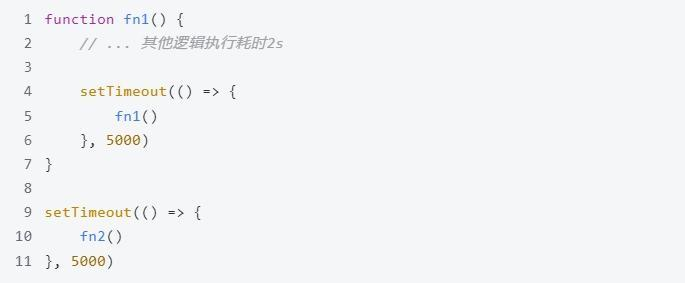

## 了解ts吗,ts的特点,比js好在哪里

1. TypeScript（简称 TS）是一种由微软开发的开源编程语言，是 JavaScript 的超集，增加了静态类型检查和其他一些功能。以下是对 TypeScript 的详细介绍以及它相对于 JavaScript 的优势。

   ### TypeScript 的特点

   1. **静态类型检查**:
       - TypeScript 加入了静态类型的概念，这意味编写代码时，可以指定变量、函数参数和返回值的类型，从而捕捉到许多类型相关的错误。
       - 在编译时就可以发现类型错误，而不是在运行时。

   2. **类型推论**：
       - TypeScript 拥有优秀的类型推论机制，可以在大部分情况下自动推断出变量的类型，即使没有明确地指定。

   3. **面向对象编程支持**：
       - TypeScript 支持类（classes）、接口（interfaces）、继承（inheritance）、修饰符（modifiers）等面向对象编程特性。

   4. **模块化**:
       - 提供了模块系统，可以使用 `import` 和 `export` 关键字来引入和导出模块，有效地管理和组织代码。

   5. **兼容性**：
       - TypeScript 是 JavaScript 的超集，任何有效的 JavaScript 代码都是有效的 TypeScript 代码。
       - TypeScript 可以编译成不同版本的 JavaScript（如 ES5、ES6），以确保兼容各种不同环境。

   6. **强大的编辑器支持**：
       - TypeScript 提供了更强大的代码补全、导航、重构和错误检测功能，大大提高了开发效率。
       - 编辑器（如 VSCode）能够更好地理解代码，提高开发体验。

   7. **类型定义文件（`.d.ts`）**：
       - 可以为现有的 JavaScript 库和框架编写类型定义文件，从而在 TypeScript 中使用它们。

   ### TypeScript 相对 JavaScript 的优势

   1. **错误提前捕获**：
       - 由于 TypeScript 的静态类型检查机制，许多错误可以在编写代码时被发现，而不是等到运行时才发现。这可以显著减少调试和测试时间。

   2. **增强的代码可维护性**：
       - 静态类型明确了代码的意图和数据结构，使代码更容易理解和维护，特别是在大型代码库中。
       - 通过接口和类型注解，开发团队可以更好地协作，减少因类型不一致引起的问题。

   3. **更好的开发工具支持**：
       - TypeScript 的类型系统使编辑器能够提供更智能的代码补全、导航和重构功能，这对提高开发效率至关重要。
       - 编写 TypeScript 代码时，编辑器的语法检查、类型推断和提示功能更为强大。

   4. **面向对象编程**：
       - TypeScript 提供了类、接口、继承和修饰符等特性，使得面向对象编程更加便捷，代码更具结构性和复用性。

   5. **逐步迁移**：
       - 现有的 JavaScript 项目可以逐步迁移到 TypeScript，而不需要一次性完成。这种逐步迁移允许团队在迁移过程中享受 TypeScript 的优势，减少了风险和成本。

   ### 示例代码

   #### JavaScript 示例

   ```javascript
   function add(a, b) {
     return a + b
   }
   
   console.log(add(1, "2"))  // 会输出 "12"，因为 "2" 被解释为字符串
   ```

   #### TypeScript 示例

   ```typescript
   function add(a: number, b: number): number {
     return a + b
   }
   
   console.log(add(1, 2))  // 正确
   console.log(add(1, "2"))  // 编译时会报错
   ```

   在以上 TypeScript 代码中，函数 `add` 的参数和返回值都是明确规定的，因此如果传入类型不符的参数，编译器会报错。


## 说说var、let、const之间的区别

1. `var`、`let` 和 `const` 是 JavaScript 中用于声明变量的三种关键字。它们之间有很多重要的区别，涉及变量作用域、变量提升、可变性（变量值是否可以改变）等方面。以下是它们的详细区别：
   
   ### 1. 作用域（Scope）
   
   #### `var`
   - **函数作用域**：`var` 声明的变量在函数内是局部的，在其他所有情况下是全局的。
       ```javascript
       function example() {
           var x = 10;
           if (true) {
               var x = 20; // 同一个变量
               console.log(x); // 20
           }
           console.log(x); // 20
       }
       example();
       ```
   
   #### `let` 和 `const`
   - **块作用域**：`let` 和 `const` 声明的变量在块级作用域（由一对花括号 `{}` 包围的区域）内有效。
       ```javascript
       function example() {
           let x = 10;
           if (true) {
               let x = 20; // 不同于外部的 x
               console.log(x); // 20
           }
           console.log(x); // 10
       }
       example();
       ```
   
   ### 2. 变量提升（Hoisting）
   
   #### `var`
   - **变量提升**：`var` 声明的变量会被提升到其作用域的顶部，但初始化不会被提升。
       ```javascript
       console.log(x); // undefined
       var x = 10;
       ```
   
   #### `let` 和 `const`
   - **暂时性死区（TDZ）**：`let` 和 `const` 声明的变量也会被提升，但在声明之前的区域被称为暂时性死区，访问这些变量会导致引用错误。
       ```javascript
       console.log(x); // ReferenceError: x is not defined
       let x = 10;
       
       console.log(y); // ReferenceError: y is not defined
       const y = 20;
       ```
   
   ### 3. 可变性（Mutability）
   
   #### `var` 和 `let`
   - **可重赋值**：`var` 和 `let` 声明的变量可以重新赋值。
       ```javascript
       var x = 10;
       x = 20; // 可以重新赋值
       
       let y = 30;
       y = 40; // 可以重新赋值
       ```
   
   #### `const`
   - **不可重赋值**：`const` 声明的变量必须在声明时初始化，并且无法重新赋值。
       ```javascript
       const z = 50;
       z = 60; // TypeError: Assignment to constant variable.
       ```
   
   ### 4. 全局对象属性
   
   #### `var`
   - **全局对象属性**：在全局作用域中，`var` 声明的变量会成为全局对象的属性（例如浏览器中的 `window` 对象）。
       ```javascript
       var a = 10;
       console.log(window.a); // 10
       ```
   
   #### `let` 和 `const`
   - **不成为全局对象属性**：在全局作用域中，`let` 和 `const` 声明的变量不会成为全局对象的属性。
       ```javascript
       let b = 20;
       const c = 30;
       console.log(window.b); // undefined
       console.log(window.c); // undefined
       ```
   
   ### 总结
   
   - **`var`**：函数作用域、变量提升、可重赋值、在全局作用域中成为全局对象属性。
   - **`let`**：块作用域、暂时性死区、可重赋值、不会成为全局对象属性。
   - **`const`**：块作用域、暂时性死区、不可重赋值、不会成为全局对象属性。
   
   理解这些区别可以帮助你更好地选择合适的关键字来声明变量，写出更健壮和更具可维护性的代码。

## ES6中数组新增了哪些扩展？

1. **Array.from() 方法：** `Array.from()` 方法可以`将类数组对象或可迭代对象转换为真正的数组`。它接受一个类数组对象或可迭代对象作为参数，并`返回一个新的数组`。

   ```javascript
   const arrayLike = { 0: 'a', 1: 'b', 2: 'c', length: 3 };
   const newArray = Array.from(arrayLike); // ['a', 'b', 'c']
   ```

2. **Array.of() 方法：** `Array.of()` 方法用于`创建一个新数组`，它接受任意数量的参数，并将这些参数作为数组的元素，`返回一个新的数组`。

   ```javascript
   const newArray = Array.of(1, 2, 3); // [1, 2, 3]
   ```

3. **Array.prototype.find() 和 Array.prototype.findIndex() 方法：** `find()` 方法用于查找数组中满足条件的第一个元素，`findIndex()` 方法用于查找数组中满足条件的第一个元素的索引。

   ```javascript
   const numbers = [1, 2, 3, 4, 5];
   const found = numbers.find(num => num > 3); // 4
   const foundIndex = numbers.findIndex(num => num > 3); // 3
   ```

4. **Array.prototype.fill() 方法：** `fill()` 方法用于`填充`数组的所有元素，可以指定起始位置和结束位置。

   ```javascript
   const array = [1, 2, 3, 4, 5];
   array.fill(0, 2, 4); // [1, 2, 0, 0, 5]
   ```

5. **Array.prototype.includes() 方法：** `includes()` 方法用于检查数组中是否包含指定的元素，返回`布尔值。`

   ```javascript
   const array = [1, 2, 3, 4, 5];
   const isIncluded = array.includes(3); // true
   ```

6. **扩展运算符（Spread Operator）：** 扩展运算符 `...` 可以在`数组字面量中用来展开数组`，或者在`函数`调用时用来`传递参数`。

   ```javascript
   const array1 = [1, 2, 3];
   const array2 = [...array1, 4, 5, 6]; // [1, 2, 3, 4, 5, 6]
   
   function sum(a, b, c) {
       return a + b + c;
   }
   
   const numbers = [1, 2, 3];
   const result = sum(...numbers); // 6
   ```

#### entries()，keys()，values()

`keys()`是对键名的遍历、`values()`是对键值的遍历，`entries()`是对键值对的遍历

## 对象新增了哪些扩展？

1. **对象属性的简洁表示法：**如果对象的属性和变量名相同，可以省略属性名。
2. **计算属性名：** 在对象字面量中，属性名可以使用表达式来定义。
3. **对象方法的简写语法：**定义对象的方法时可以省略 function 关键字。
4. **Object.assign() 方法：** 用于将所有可枚举的属性从一个或多个源对象复制到目标对象，并返回目标对象。
5. `this`关键字总是指向函数所在的当前对象，ES6 又新增了另一个类似的`关键字super`，指向当前对象的原型对象
6. 解构赋值,`解构赋值必须是最后一个参数`，否则会报错,解构赋值是`浅拷贝`

```javascript
let { x, y, ...z } = { x: 1, y: 2, a: 3, b: 4 };
x // 1
y // 2
z // { a: 3, b: 4 }
let obj = { a: { b: 1 } };
let { ...x } = obj;
obj.a.b = 2; // 修改obj里面a属性中键值
x.a.b // 2，影响到了结构出来x的值
```

##### Object.is()

严格判断两个值是否相等，与严格比较运算符（===）的行为基本一致，不同之处只有两个：一是`+0`不等于`-0`，二是`NaN`等于自身

## ES6中函数新增了哪些扩展

`ES6`允许为函数的参数设置默认值

```javascript
function log(x, y = 'World') {
  console.log(x, y);
}
```

函数的形参是默认声明的，不能使用`let`或`const`再次声明

```js
function foo(x = 5) {
    let x = 1; // error
    const x = 2; // error
}
```

参数默认值可以与解构赋值的默认值结合起来使用

```js
function foo({x, y = 5}) {
  console.log(x, y);
}

foo({}) // undefined 5
foo({x: 1}) // 1 5
foo({x: 1, y: 2}) // 1 2
foo() // TypeError: Cannot read property 'x' of undefined
```

##### **箭头函数中的 this：** 

箭头函数没有自己的 `this`，它们的 `this` 值继承自外围作用域。

##### 严格模式

只要函数参数使用了默认值、解构赋值、或者扩展运算符，那么函数内部就不能显式设定为严格模式，否则会报错

## Set和Map

`Set`是一种叫做`集合`的数据结构，`Map`是一种叫做`字典`的数据结构

##### Map

- 键值对的集合，其中键可以是任何类型（包括对象）。
- 记住键的原始插入顺序。

##### Set

- 集合中的每个值只能出现一次，即 Set 中的元素是唯一的。
- 可以存储任何类型的值。
- 保证插入顺序

#### 区别？

- Set 只存储值，而 Map 存储键值对。
- Set 中的值是唯一的，而 Map 允许重复的值（但键是唯一的）。
- Set 主要用于检查一个值是否存在于集合中，而 Map 用于存储具有关联关系的数据。

#### 都有的遍历方法

- keys()：返回键名的遍历器
- values()：返回键值的遍历器
- entries()：返回所有成员的遍历器
- forEach()：遍历 Map 的所有成员

#### `WeakSet` 和 `WeakMap`

`WeakSet` 和 `WeakMap` 主要用于`存储对象的弱引用`，`适用于`需要`临时存储对象`，且不希望妨碍这些对象被垃圾回收的场景。

共同特点:

- **只能使用对象作为键：** 的键必须是**对象**，不能是原始值。
  - 虽然键必须是对象，但值可以是任意类型的数据。

- **弱引用：** 键是弱引用的，当键对象被垃圾回收时，相应的键值对会自动从 中删除。
- **不可迭代：**不支持迭代方法（如 `forEach`），因此不能遍历其中的键值对。
- **无法知道大小：** 没有 `size` 属性，也没有类似 `size` 的方法，因此无法知道其中包含的键值对数量。
- 垃圾回收友好：
  - 当键对象不再被引用时，相关的键值对会被自动清除，有助于防止内存泄漏。
- 不能被 JSON 序列化

## Promise

异步编程的一种解决方案，主要用于`解决回调地狱`（callback hell）和提供`更优雅的异步编程`解决方案。比传统的解决方案（回调函数）更加合理和更加强大

`promise`解决异步操作的优点：

- 链式操作减低了编码难度
- 代码可读性明显增强

### Promise 的特点：

1. **状态（State）：** `Promise` 对象有三种状态：`pending`（进行中）、`fulfilled`（已成功）和`rejected`（已失败）。
2. **状态转换：** `Promise` 对象的状态一旦改变，就会凝固，不会再改变。只有异步操作的结果可以决定状态的转变。
3. **链式调用：** `Promise` 支持链式调用，可以将多个异步操作按照顺序串联起来，避免回调地狱，使代码更加清晰和易于维护。
4. **错误处理：** `Promise` 允许通过 `.catch()` 方法捕获异步操作中的错误，并进行统一的错误处理。
5. **多个异步操作的并行和串行：** `Promise.all()` 方法可以将多个异步操作并行执行，直到所有操作完成；`Promise.race()` 方法可以将多个异步操作串行执行，只要有一个操作完成就返回结果。

### Promise的主要方法

1. 实例方法：

   a. then(onFulfilled, onRejected)
   - 用于处理 Promise 成功或失败的情况
   - 返回一个新的 Promise

   ```javascript
   promise.then(
     result => console.log(result),
     error => console.error(error)
   );
   ```

   b. catch(onRejected)
   - 用于处理 Promise 失败的情况
   - 相当于 then(null, onRejected)

   ```javascript
   promise.catch(error => console.error(error));
   ```

   c. finally(onFinally)
   - 无论 Promise 成功还是失败都会执行
   - 不接收任何参数

   ```javascript
   promise.finally(() => console.log('Finished'));
   ```

2. 静态方法：

   a. Promise.resolve(value)
   - 返回一个以给定值解决的 Promise

   ```javascript
   const resolvedPromise = Promise.resolve(42);
   ```

   b. Promise.reject(reason)
   - 返回一个以给定原因拒绝的 Promise

   ```javascript
   const rejectedPromise = Promise.reject(new Error('Failed'));
   ```

   c. Promise.all(iterable)
   - 等待所有 Promise 都成功，或任一 Promise 失败
   - 返回一个新的 Promise

   ```javascript
   Promise.all([promise1, promise2, promise3])
     .then(results => console.log(results));
   ```

   d. Promise.race(iterable)
   - 返回一个 Promise，一旦迭代器中的某个 promise 解决或拒绝，就采用第一个 promise 的值作为它的值

   ```javascript
   Promise.race([promise1, promise2, promise3])
     .then(result => console.log(result));
   ```

   e. Promise.allSettled(iterable)
   - 等待所有 Promise 都完成（无论成功或失败）
   - 返回一个包含所有结果的数组

   ```javascript
   Promise.allSettled([promise1, promise2, promise3])
     .then(results => console.log(results));
   ```

   f. Promise.any(iterable)
   - 只要给定的迭代中的一个 promise 成功，就返回那个已经成功的 promise
   - 如果所有 promise 都失败，则返回一个失败的 promise

   ```javascript
   Promise.any([promise1, promise2, promise3])
     .then(result => console.log(result))
     .catch(error => console.error(error));
   ```

3. 创建 Promise：

   使用 Promise 构造函数创建新的 Promise

   ```javascript
   const promise = new Promise((resolve, reject) => {
     // 异步操作
     if (/* 操作成功 */) {
       resolve(value);
     } else {
       reject(error);
     }
   });
   ```

这些方法让 Promise 能够灵活地处理各种异步场景，从简单的单一异步操作到复杂的多个异步操作的组合。理解和熟练使用这些方法可以大大提高处理异步代码的能力。

## js不是单线程的吗，Promise.all为什么是并行

您提出了一个非常好的问题！这确实是一个容易混淆的概念。让我来解释一下：

1. JavaScript 确实是单线程的：
   JavaScript 的确是单线程执行的，这意味着在任何给定时刻，只有一个操作在执行。

2. 异步和并发：
   尽管 JavaScript 是单线程的，但它支持异步编程。这允许代码以非阻塞的方式执行，给人一种"并行"的错觉。

3. 事件循环：
   JavaScript 使用事件循环来管理异步操作。当遇到异步操作时，JavaScript 会将其放入事件队列，继续执行后续代码，然后在主线程空闲时处理队列中的事件。

4. Promise.all() 的"并行"：
   当我们说 Promise.all() 是"并行"执行的，实际上是指它同时启动了所有的异步操作，而不是一个接一个地等待它们完成。

5. 实际的执行过程：
   - 当调用 Promise.all() 时，它会立即启动所有传入的 Promise。
   - 这些 Promise 可能包含 AJAX 请求、定时器、文件操作等异步任务。
   - JavaScript 引擎会将这些异步任务交给浏览器的其他部分（如 Web APIs）来处理。
   - 主线程继续执行，不会被这些异步操作阻塞。
   - 当异步操作完成时，相应的回调会被添加到事件队列。
   - 事件循环会在主线程空闲时，从队列中取出这些回调并执行。

6. 并发 vs 并行：
   - 严格来说，这种行为更准确的描述是"并发"而不是"并行"。
   - 并发是指同时管理多个任务，而并行是指同时执行多个任务。
   - JavaScript 通过事件循环实现了并发，但由于单线程的本质，它不能真正地并行执行任务。

示例：

```javascript
console.log('Start');

Promise.all([
  new Promise(resolve => setTimeout(() => resolve('One'), 1000)),
  new Promise(resolve => setTimeout(() => resolve('Two'), 2000)),
  new Promise(resolve => setTimeout(() => resolve('Three'), 3000))
]).then(console.log);

console.log('End');

// 输出：
// Start
// End
// (大约3秒后)
// ['One', 'Two', 'Three']
```

在这个例子中，所有的定时器几乎同时开始，但它们在不同的时间完成。JavaScript 引擎不会等待这些定时器，而是继续执行后续代码。

总结：虽然 JavaScript 是单线程的，但通过事件循环和异步编程，它能够高效地管理多个并发操作，给人一种"并行"的感觉。Promise.all() 利用了这种机制，同时启动多个异步操作，但实际上它们仍然是在单个线程上交错执行的。

## async和await

`async` 和 `await` 并不是直接的语法糖，而是`建立在 Promise 和 Generator 的基础上的语法糖`

`async` 和 `await` 是 ES8（也称为 ES2017）引入的新特性，用于更方便地处理异步操作，使得异步代码的编写和理解更加简洁和直观。

`async` 函数是用来定义异步函数的关键字，它可以将函数声明为异步函数，使得函数内部可以使用 `await` 来等待异步操作的结果。

- `async` 函数内部使用 `return` 返回的值会被包装成一个 Promise 对象，无论这个函数内部是否显式地返回了一个 `Promise`。
- 在 `async` 函数内部可以使用 `await` 关键字来等待 Promise 对象的完成，并且 `await` 只能在 `async` 函数内部使用。

------

`await` 是用于等待异步操作完成的关键字，它只能在 `async` 函数内部使用。当 `await` 后面跟着一个 Promise 对象时，它会暂停函数的执行，直到该 Promise 对象状态变为 resolved（完成）或 rejected（失败）。

- await 关键字只能在 async 函数内部使用。
- 当遇到 await 时，JavaScript 引擎会暂停当前 async 函数的执行。
- await 后面的表达式会立即执行，然后函数暂停，等待 Promise settled（即 resolved 或 rejected）。
- 一旦 Promise settled，函数会恢复执行。
- 如果 Promise resolved，await 表达式的值就是 Promise 的结果。
- 如果 Promise rejected，await 表达式会抛出异常。

### 内部实现：

async/await 的内部实现利用了生成器（Generator）和 Promise。可以将其理解为一个自动执行的生成器函数。

```javascript
async function example() {
  const result = await someAsyncOperation();
  return result;
}

// 可以理解为以下形式
function example() {
  return new Promise((resolve, reject) => {
    const generator = function* () {
      try {
        const result = yield someAsyncOperation();
        resolve(result);
      } catch (error) {
        reject(error);
      }
    };
    
    const iterator = generator();
    const handleNext = (value) => {
      const next = iterator.next(value);
      if (next.done) return;
      Promise.resolve(next.value).then(handleNext, iterator.throw);
    };
    
    handleNext();
  });
}
```

#### 执行过程：

- 当调用 async 函数时，它会立即返回一个 Promise。
- 函数体开始执行，直到遇到第一个 await 表达式。
- await 表达式会暂停函数的执行，并等待 Promise 的结果。
- 一旦 Promise settled，函数恢复执行，await 返回 Promise 的结果（或抛出异常）。
- 这个过程会一直重复，直到函数执行完毕或抛出未捕获的异常。

1. 错误处理：
   - 在 async 函数中，可以使用 try/catch 来捕获 await 的错误。
   - 如果没有被捕获，错误会导致返回的 Promise 被 reject。
2. 事件循环和任务队列：
   - async/await 不会阻塞事件循环。当遇到 await 时，函数的后续代码会被放入微任务队列（microtask queue）。
   - 这确保了异步操作不会阻塞主线程，同时保持了代码的顺序执行。

使用场景

- **简化异步操作：** `async` 和 `await` 可以简化异步操作的编写，使得异步代码更加清晰和易于理解，避免了回调地狱。
- **错误处理：** `await` 可以与 `try...catch` 结合使用来捕获异步操作中的错误，使得错误处理更加方便。
- **串行/并行操作：** `await` 可以按照顺序执行异步操作，也可以使用 `Promise.all()` 来并行执行多个异步操作。

## ES6中的Proxy

`Proxy` 是一种用于`创建代理对象`的特殊对象，它可以`拦截并定义基本操作的自定义行为`，例如属性查找、赋值、删除等操作。`Proxy` 可以用来`拦截对目标对象的访问`，并在必要时`修改目标对象的行为`。

#### Proxy 的特点：

1. **拦截操作：** `Proxy` 可以拦截目标对象的各种操作，包括属性的读取（get）、属性的设置（set）、属性的删除（deleteProperty）、属性的枚举（enumerate）、函数调用（apply）等。
2. **自定义行为：** 通过在代理对象上设置拦截器（handler），可以定义对应操作的自定义行为，使得可以对目标对象的操作进行定制化处理。
3. **可扩展性：** `Proxy` 提供了一种灵活且可扩展的方式来操作和定制对象的行为，使得可以实现更加复杂的逻辑和功能。

#### 使用场景：

1. **属性验证和过滤：** 可以使用 `Proxy` 对象拦截属性的赋值操作，在`赋值之前进行验证和过滤`，以确保属性的合法性。
2. **数据绑定和响应式编程：** 可以使用 `Proxy` 对象`实现数据的双向绑定和响应式编程`，`监听`目标对象的`变化`并`自动更新相关的视图`。
3. **拦截操作和记录日志：** 可以使用 `Proxy` 对象`拦截目标对象的各种操作`，并在拦截器中`记录日志`、统计调用次数等信息。
4. **性能优化：** 可以使用 `Proxy` 对象拦截目标对象的访问，并对访问进行`缓存或优化`，以提高程序的性能和效率。`缓存`某些计算结果或`重复访问的数据`,`延迟加载数据`，只在`真正需要访问时`才进行加载和`初始化`
5. **权限控制：** 可以使用 `Proxy` 对象实现对目标对象的访问权限控制，限制用户对特定属性或方法的访问权限。限制某些属性只读或只写，或者禁止对某些属性的访问

## ES6中Module

模块（Module）是一种用于`组织和管理 `JavaScript 代码的方式，它提供了一种`模块化的编程风格`，使得代码可以`更加清晰、可维护和可重用`。

#### 模块的特点：

1. **独立性：** `每个模块都是独立的作用域`，模块内部的变量、函数和类默认不会暴露到全局作用域，需要通过 `export` 导出才能被其他模块使用。
2. **导入导出：** 模块可以通过 `export` 关键字导出变量、函数、类等，使得这些成员可以被其他模块使用；同时，可以使用 `import` 关键字导入其他模块导出的成员，使得模块之间可以相互调用和引用。
3. **静态解析：** 模块系统是静态的，即在代码执行之前就确定了模块之间的依赖关系和引用关系，使得代码的依赖关系更加清晰和可靠。
4. **可重用性：** 模块化的编程风格使得代码可以`更容易地被重用和组合`，从而提高了代码的可维护性和可扩展性。

#### 使用场景：

1. **项目组织：** 可以使用`模块来组织项目的代码结构`，将代码分`割成独立的模块`，使得每个模块只关注于特定的功能或责任，提高了代码的可维护性和可读性。
2. **代码复用：** 可以`将通用的功能封装成模块`，并在`需要的地方导入和使用`，避免了重复编写相似的代码，提高了代码的复用性和效率。
3. **依赖管理：** 模块系统提供了依赖管理的机制，可以明确地`声明和管理模块之间的依赖关系`，使得项目的依赖关系更加清晰和可控。
4. **库和插件：** 可以`将自己编写的功能模块封装成库或插件`，并在其他项目中引入和使用，从而`实现功能的共享和扩展`。

## ES6中的 Decorator 

- 代码可读性变强了，装饰器命名相当于一个注释
- 在不改变原有代码情况下，对原来功能进行扩展

#### 装饰器的特点：

1. **语法糖：** 装饰器提供了一种更简洁、更直观的语法来实现对类和类成员的装饰，使得`代码更加清晰`和易于理解。
2. **可组合性：** 装饰器`可以串联使用`，多个装饰器可以按照顺序应用到同一个目标上，从而实现更复杂的装饰逻辑。
3. **动态修改：** 装饰器可以在运行时动态地修改类和类成员的行为，使得可以根据需要进行灵活的定制和调整。
4. **可重用性：** 装饰器本身是一种函数，可以定义为独立的函数，从而可以在`多个地方重复使用`。

#### 使用场景：

1. **日志记录：** 可以使用装饰器来实现`方法调用的日志记录`，记录方法的调用时间、参数、返回值等信息。
2. **性能监控：** 可以使用装饰器来实现方法调用的`性能监控`，`统计`方法的`执行时间`、调用次数等信息。
3. **权限控制：** 可以使用装饰器来实现对方法或属性的`访问权限控制`，限制只有特定角色或权限的用户才能访问。
4. **参数校验：** 可以使用装饰器来对方法的参数进行`校验和验证`，确保参数的合法性和正确性。
5. **缓存优化：** 可以使用装饰器来实现方法调用的`结果缓存`，`避免重复计算或请求`，提高程序的性能和效率。

## JavaScript中的数据类型

- 原始类型
- 引用类型

两种类型的主要区别是：`存储位置`不同

#### 原始类型（Primitive Types）：

1. **Number（数字）：** 用于表示数值，可以是整数或浮点数。
2. **String（字符串）：** 用于表示文本数据，可以包含任意字符序列。
3. **Boolean（布尔值）：** 用于表示逻辑值，可以是 `true` 或 `false`。
4. **Undefined（未定义）：** 表示未初始化的变量或缺少值的情况。
5. **Null（空值）：** 表示空值或无效值。
6. **Symbol（符号）：** 用于创建唯一的标识符。

#### 引用类型（Reference Types）：

1. **Object（对象）：** 用于表示复杂数据结构，可以包含多个属性和方法。
2. **Array（数组）：** 特殊的对象，用于表示有序的集合数据。
3. **Function（函数）：** 特殊的对象，用于执行特定的任务或操作。
4. **Date（日期）：** 用于表示日期和时间。
5. **RegExp（正则表达式）：** 用于处理字符串的模式匹配。
6. **Map、Set：** ES6 新增的数据结构，用于存储键值对集合或唯一值集合。

#### 存储上的差别：

1. **原始类型：** 存储在`栈`内存（Stack）中，`数据直接存储在变量访问的位置`，因此访问速度较快，但大小固定且较小。
2. **引用类型：** 存储在`堆`内存（Heap）中，`变量存储的是对象的引用（地址）`，实际的数据存储在堆内存中，因此访问速度较慢，但大小可变且较大。

## 数组的常用方法

1. |     方法      | 修改原数组？ | 功能                                                         |
   | :-----------: | :----------: | ------------------------------------------------------------ |
   |    push()     |      是      | 向数组末尾添加一个或多个元素，返回数组的最新长度             |
   |     pop()     |      是      | 删除并返回数组的最后一个元素，返回被删除的项                 |
   |   unshift()   |      是      | 向数组开头添加一个或多个元素，然后返回新的数组长度           |
   |    shift()    |      是      | 删除并返回数组的第一个元素，返回被删除的项                   |
   |   concat()    |      否      | 合并两个或多个数组为一个新数组,返回新数组                    |
   |    join()     |      否      | 将数组中所有元素连接成一个字符串                             |
   |    slice()    |      否      | 返回数组的一部分，不修改原数组                               |
   |   splice()    |      是      | 添加或删除数组的元素，同时修改原数组，返回包含删除元素的数组 |
   |   indexOf()   |      否      | 返回指定元素在数组中的第一个匹配项的索引                     |
   | lastIndexOf() |      否      | 返回指定元素在数组中的最后一个匹配项的索引                   |
   |   forEach()   |      否      | 遍历数组，对每个元素执行指定操作                             |
   |     map()     |      否      | 遍历数组，对每个元素执行指定操作，并返回结果数组             |
   |   filter()    |      否      | 遍历数组，根据指定条件筛选元素                               |
   |   reduce()    |      否      | 遍历数组，将数组元素归纳为单个值                             |
   | reduceRight() |      否      | 与 reduce() 方法类似，但从右向左遍历数组                     |
   |    find()     |      否      | 返回数组中满足条件的第一个元素                               |
   |  findIndex()  |      否      | 返回数组中满足条件的第一个元素的索引                         |
   |    every()    |      否      | 检查数组中的所有元素是否满足条件                             |
   |    some()     |      否      | 检查数组中是否存在满足条件的元素                             |
   |    sort()     |      是      | 对数组元素进行排序，修改原数组                               |
   |   reverse()   |      是      | 颠倒数组中元素的顺序，修改原数组                             |

## JavaScript字符串的常用方法

1. **length：** 返回字符串的长度。
2. **charAt()：** 返回指定位置的字符。
3. **charCodeAt()：** 返回指定位置字符的 Unicode 编码。
4. **concat()：** 连接两个或多个字符串，并返回新字符串。
5. **indexOf()：** 返回指定子字符串首次出现的位置。
6. **lastIndexOf()：** 返回指定子字符串最后一次出现的位置。
7. **startsWith()：** 检查字符串是否以指定子字符串开头。
8. **endsWith()：** 检查字符串是否以指定子字符串结尾。
9. **includes()：** 检查字符串是否包含指定子字符串。
10. **substring()：** 返回指定位置之间的子字符串。
11. **slice()：** 提取字符串的一部分，并返回新字符串。
12. **substr()：** 从指定位置开始，返回指定长度的子字符串。
13. **replace()：** 替换字符串中的匹配子字符串。
14. **toUpperCase()：** 将字符串转换为大写。
15. **toLowerCase()：** 将字符串转换为小写。
16. **trim()：** 移除字符串两端的空白字符。
17. **split()：** 将字符串分割为字符串数组。
18. **match()：** 在字符串中检索指定值，返回匹配的子字符串数组。
19. **search()：** 在字符串中搜索指定值，返回匹配的位置。
20. **repeat()：** 返回包含指定字符串的指定数量副本的新字符串。

##  JavaScript 中的类型转换机制

`隐式类型转换`和`显式类型转换`

#### 隐式类型转换

- **字符串拼接**：当一个字符串与其他类型的值进行加法运算时，其他值会被自动转换为字符串。

```javascript
console.log("5" + 2); // 输出 "52"
```

- **算术运算：** 当一个非字符串值与字符串进行算术运算时，非字符串值会被自动转换为数字。

```javascript
console.log("5" - 2); // 输出 3
```

- **逻辑运算：** 当非布尔值参与逻辑运算时，会将其转换为布尔值。

```javascript
if (1) {  console.log("true"); }// 输出 "true"
```

#### 显式类型转换

- **转换为字符串：** 使用 `String()` 函数或字符串模板。
- **转换为数字：** 使用 `Number()` 函数或 `+` 操作符。
- **转换为布尔值：** 使用 `Boolean()` 函数。
- **parseInt() 和 parseFloat()：** 将字符串转换为整数或浮点数。

## == 和 ===区别，分别在什么情况使用

用于比较两个值是否相等。它们的`区别`主要在于`类型转换的方式和严格性`。

#### `==` （相等运算符，Equality Operator）：

- **类型转换：** 在进行比较之前，`会进行类型转换`，使得两个值的类型相同。
- **松散比较：** `只比较值`是否相等，`不考虑数据类型`。
- **隐式类型转换：** 可能会触发`隐式类型转换`。

#### `===` （严格相等运算符，Strict Equality Operator）：

- **类型与值都要相等：** `不会进行类型转换`，只有在类型和值都相等时才返回 true。
- **严格比较：** `区分数据类型`。
- **不触发隐式类型转换：** 不会进行隐式类型转换，`必须类型和值都相等才返回 true`。

比较对象属性为`null`或者`undefined`的情况下，我们可以使用相等操作符

其他情况建议一律使用全等操作符

这是因为 `null` 和 `undefined` 在`相等比较中被认为是相等的`，而`不会触发类型转换`。这种情况下，两者之间的比较会返回 `true`。

## 检测数据类型的方法

除了 `typeof` 操作符，JavaScript 还有其他几种获取数据类型的方法。以下是一些常用的方法：

除了 `typeof` 操作符，JavaScript 还有其他几种获取数据类型的方法。以下是一些常用的方法：

- Object.prototype.toString.call()

这是一种更可靠的类型检查方法，能够识别更多的类型：

```javascript
Object.prototype.toString.call(42);           // "[object Number]"
Object.prototype.toString.call('');           // "[object String]"
Object.prototype.toString.call(true);         // "[object Boolean]"
Object.prototype.toString.call(undefined);    // "[object Undefined]"
Object.prototype.toString.call(null);         // "[object Null]"
Object.prototype.toString.call({});           // "[object Object]"
Object.prototype.toString.call([]);           // "[object Array]"
Object.prototype.toString.call(function(){}); // "[object Function]"
```

- instanceof 操作符

用于检查对象是否是某个构造函数的实例：

```javascript
[] instanceof Array;  // true
{} instanceof Object; // true
```

- Array.isArray()

专门用于检查是否为数组：

```javascript
Array.isArray([]);  // true
Array.isArray({});  // false
```

- constructor 属性

可以用来查看对象的构造函数：

```javascript
[].constructor === Array;  // true
({}).constructor === Object;  // true
```

- Symbol.toStringTag

ES6 引入的一个新特性，允许自定义对象在 `Object.prototype.toString.call()` 中的行为：

```javascript
class MyClass {
    get [Symbol.toStringTag]() {
        return "MyClass";
    }
}
Object.prototype.toString.call(new MyClass()); // "[object MyClass]"
```

- 使用库

一些流行的 JavaScript 库如 Lodash 提供了更复杂的类型检查方法。

每种方法都有其适用场景和限制。在实际开发中，通常需要根据具体需求选择合适的类型检查方法，有时甚至需要组合使用多种方法来准确判断数据类型。

## 深拷贝浅拷贝的区别？如何实现一个深拷贝

`基本类型`数据保存在在`栈`内存中

`引用类型`数据保存在`堆`内存中，引用数据类型的变量是一个`指向堆内存中实际对象的引用`，`存在栈中`

#### 深拷贝（Deep Copy）：

深拷贝是将原始数据结构中的所有嵌套对象或数组都复制一份，而不仅仅是复制其引用。这意味着`修改拷贝后的数据结构不会影响到原始数据结构`，它们之间是相互独立的。

常见的深拷贝方式有：

- _.cloneDeep()
- jQuery.extend()
- JSON.stringify()
- 手写循环递归

#### 浅拷贝（Shallow Copy）：

浅拷贝`只是复制原始数据结构中的基本数据类型`（如数字、字符串、布尔值等）`和引用类型的引用`（即地址），`而不是复制引用类型的内容`。这意味着拷贝后的数据结构中的嵌套对象或数组仍然与原始数据结构共享相同的嵌套对象或数组，如果修改了拷贝后的数据结构中的嵌套对象或数组，原始数据结构中的对应嵌套对象或数组也会受到影响。

存在浅拷贝的现象有：

- `Object.assign`
- `Array.prototype.slice()`, `Array.prototype.concat()`
- 使用拓展运算符实现的复制

JavaScript 中的深拷贝和浅拷贝是两种不同的复制对象的方法，它们之间的主要区别在于如何处理嵌套的对象或数组。

1. 浅拷贝（Shallow Copy）:

   - 创建一个新对象，该对象有着原始对象属性值的一份精确拷贝。
   - 如果属性是基本类型，拷贝的就是基本类型的值。
   - 如果属性是引用类型，拷贝的就是内存地址，所以如果其中一个对象改变了这个地址，就会影响到另一个对象。
   - 只复制对象的第一层属性。

   示例：
   ```javascript
   let obj1 = { a: 1, b: { c: 2 } };
   let obj2 = Object.assign({}, obj1);
   // 或者使用展开运算符
   // let obj2 = { ...obj1 };

   obj2.a = 3;
   obj2.b.c = 4;

   console.log(obj1); // { a: 1, b: { c: 4 } }
   console.log(obj2); // { a: 3, b: { c: 4 } }
   ```

2. 深拷贝（Deep Copy）:

   - 创建一个新对象，该对象有着原始对象属性值的一份精确拷贝。
   - 对于非基本类型的属性，递归地复制其所有层级的属性。
   - 深拷贝会创建一个全新的对象，与原始对象完全独立，互不影响。

   示例：
   ```javascript
   let obj1 = { a: 1, b: { c: 2 } };
   let obj2 = JSON.parse(JSON.stringify(obj1)); // 一种简单的深拷贝方法，但有局限性
   
   obj2.a = 3;
   obj2.b.c = 4;
   
   console.log(obj1); // { a: 1, b: { c: 2 } }
   console.log(obj2); // { a: 3, b: { c: 4 } }
   ```

主要区别：

1. 复制深度：
   - 浅拷贝只复制对象的第一层属性。
   - 深拷贝递归复制对象的所有层级。

2. 内存分配：
   - 浅拷贝中，对于复杂类型的属性，新对象和原对象引用同一块内存。
   - 深拷贝会创建全新的内存空间，新旧对象完全独立。

3. 相互影响：
   - 浅拷贝中，改变新对象的复杂类型属性会影响原对象。
   - 深拷贝中，新旧对象互不影响。

4. 性能：
   - 浅拷贝通常更快，因为它只复制一层。
   - 深拷贝可能较慢，尤其是对于大型、嵌套的对象。

5. 实现复杂度：
   - 浅拷贝相对简单，可以使用 Object.assign() 或展开运算符。
   - 深拷贝相对复杂，通常需要递归或使用专门的库。

注意：简单的 JSON.parse(JSON.stringify()) 方法虽然可以实现深拷贝，但它有一些局限性：

- 无法复制函数、undefined、symbol。
- 不能处理循环引用。
- 会丢失原型链。

对于更复杂的深拷贝需求，可能需要使用递归方法或专门的库（如 lodash 的 _.cloneDeep()）来实现。

## 闭包

闭包是 JavaScript 的一个强大特性，它涉及作用域以及作用域链的概念。理解闭包对于编写高效、灵活和健壮的 JavaScript 代码非常重要。以下是对闭包的详细深入介绍。

### 什么是闭包

闭包是指一个函数可以记住所处的词法作用域，即使这个函数是在当前词法作用域之外执行的。这意味着闭包可以访问它创建时捕获的变量。

简单地说，闭包使得函数在外部函数执行完毕后，依然能够继续访问该外部函数的变量。

### 闭包的定义与示例

#### 基本示例

以下是一个经典的闭包示例：

```javascript
function outerFunction() {
    let outerVariable = 'I am from outer function';

    function innerFunction() {
        console.log(outerVariable);
    }

    return innerFunction;
}

const closure = outerFunction();
closure();  // 输出: I am from outer function
```

在这个例子中：

1. `outerFunction` 创建了一个局部变量 `outerVariable`。
2. `innerFunction` 是一个内部函数，它访问并使用了 `outerVariable`.
3. 当 `outerFunction` 返回 `innerFunction` 时，它形成了一个闭包，`innerFunction` 记住了它创建时的词法作用域，其中包括 `outerVariable`。

### 闭包的特性

#### 延长变量的生命周期

通常情况下，当函数执行完毕后，它的局部变量会被销毁。然而，闭包会延长这些局部变量的生命周期，因为闭包中引用的变量在闭包存在期间不会被销毁。

```javascript
function createCounter() {
    let count = 0;

    return function() {
        count++;
        return count;
    };
}

const counter = createCounter();
console.log(counter()); // 输出: 1
console.log(counter()); // 输出: 2
console.log(counter()); // 输出: 3
```

在这个例子中，变量 `count` 的生命周期被延长，因为返回的匿名函数引用了它，每次调用该匿名函数都会改变 `count` 的值。

#### 创建私有变量

闭包可以用于模拟 JavaScript 中的私有变量，因为闭包中的变量只能通过闭包中的函数访问，而在外部作用域无法直接访问这些变量。

```javascript
function createPerson(name) {
    let _name = name;

    return {
        getName: function() {
            return _name;
        },
        setName: function(newName) {
            _name = newName;
        }
    };
}

const person = createPerson('Alice');
console.log(person.getName()); // 输出: Alice
person.setName('Bob');
console.log(person.getName()); // 输出: Bob
```

在这个示例中，变量 `_name` 是私有变量，只有通过 `getName` 和 `setName` 方法才能访问或修改它。

### 闭包的常见应用

1. **回调函数**:

闭包广泛应用于事件处理、异步编程等回调函数中。

```javascript
function setupClickHandler(buttonId) {
    let count = 0;

    document.getElementById(buttonId).addEventListener('click', function() {
        count++;
        console.log(`Button clicked ${count} times`);
    });
}

setupClickHandler('myButton');
```

2. **创建模块化代码**：

闭包可以用来创建模块化代码，将相关的函数和变量封装在一个闭包内，避免污染全局命名空间。

```javascript
const myModule = (function() {
    let privateVar = 'Hello World';

    function privateFunction() {
        console.log(privateVar);
    }

    return {
        publicMethod: function() {
            privateFunction();
        }
    };
})();

myModule.publicMethod(); // 输出: Hello World
```

3. **保持状态**：

闭包可以用来保持函数内部状态，使得状态在函数调用之间得以维持。

```javascript
function createIncrementer(start) {
    let current = start;

    return function() {
        current += 1;
        return current;
    };
}

const incrementer = createIncrementer(5);
console.log(incrementer()); // 输出: 6
console.log(incrementer()); // 输出: 7
```

### 注意事项

1. **内存泄漏**：

由于闭包可以延长变量的生命周期，如果使用不当可能会导致内存泄漏。例如，过多的事件监听器没有被正确移除。

2. **性能考虑**：

闭包占用内存，因为它保留了创建时的作用域上下文。大量使用闭包可能会导致内存占用过多，因此在性能敏感的应用中应谨慎使用。

### 闭包及其作用域链

为了理解闭包的工作原理，有必要了解 JavaScript 的作用域链。作用域链是指在函数执行时，搜索变量的顺序。每个函数都拥有自己的作用域链，随着函数嵌套，形成一条作用域链。

在闭包中，内部函数会保存对外部函数作用域的引用，当内部函数需要访问外部函数的变量时，它将沿着作用域链找到这些变量。

### 总结

闭包是 JavaScript 中一个非常强大且常用的特性，通过允许函数记住其词法作用域，可以实现许多复杂而有用的编程模式。这些模式包括创建私有变量、保持状态和回调函数等。理解并正确使用闭包将使您能够编写更加强大和灵活的代码。

## JavaScript原型，原型链

1. JavaScript 原型和原型链是理解 JavaScript 中继承和对象创建机制的关键概念。掌握这些概念有助于开发者更深入地理解 JavaScript 的面向对象编程模型。以下是详细深入的介绍。

   ### 什么是原型

   在 JavaScript 中，每个对象都有一个内部链接 (internal link) 指向另一个对象，这个对象被称为原型 (prototype)。当我们访问一个对象的属性或方法时，如果这个对象本身没有这个属性或方法，JavaScript 引擎会在其原型对象中继续查找，直到找到属性或达到原型链的顶端（即 `null`）。

   #### 示例

   ```javascript
   let obj = { name: "Alice" };
   
   console.log(obj.toString()); // 调用了 obj 的原型对象上的 toString() 方法
   ```

   在这个例子中，`obj` 没有定义 `toString` 方法。JavaScript 引擎会在 `obj` 的原型上查找 `toString` 方法，而这个原型通常是 `Object.prototype`，`Object.prototype` 本身也有一个 `toString` 方法。

   ### 原型链

   原型链是由对象及其原型对象链接在一起形成的链式结构，它定义了对象的继承机制。当我们访问一个对象的属性或方法时，JavaScript 引擎会沿着这条链逐级向上查找。

   #### 示例

   ```javascript
   function Person(name) {
       this.name = name;
   }
   
   Person.prototype.sayHello = function() {
       console.log("Hello, my name is " + this.name);
   };
   
   let alice = new Person("Alice");
   
   alice.sayHello(); // 输出: Hello, my name is Alice
   ```

   在这个例子中：

   1. `Person` 是一个构造函数。
   2. `Person.prototype` 定义了一个方法 `sayHello`。
   3. `alice` 是使用 `Person` 构造函数创建的新对象。
   4. 当 `alice.sayHello()` 被调用时，JavaScript 引擎会首先查看 `alice` 对象自身是否有 `sayHello` 方法。如果没有，则会查找 `alice` 的原型对象，即 `Person.prototype`，并找到 `sayHello` 方法。

   ### 使用 `__proto__` 和 `prototype`

   在 JavaScript 中，`__proto__` 和 `prototype` 是两个常见的属性，但它们有不同的用途和含义。

   #### `__proto__`

   `__proto__` 是每个 JavaScript 对象都拥有的一个隐式属性，它指向对象的原型。我们通常通过 `Object.getPrototypeOf` 获取或者设置一个对象的原型。

   ```javascript
   let obj = {};
   let proto = Object.getPrototypeOf(obj);
   
   console.log(proto === Object.prototype); // 输出: true
   
   let customProto = { custom: "custom prototype" };
   Object.setPrototypeOf(obj, customProto);
   
   console.log(obj.__proto__ === customProto); // 输出: true
   console.log(obj.custom); // 输出: custom prototype
   ```

   #### `prototype`

   `prototype` 是函数对象特有的属性，用于实现基于原型的继承。当我们使用构造函数创建对象时，新创建的对象的 `__proto__` 属性会指向构造函数的 `prototype` 属性。

   ```javascript
   function Person(name) {
       this.name = name;
   }
   
   console.log(Person.prototype.constructor === Person); // 输出: true
   
   let alice = new Person("Alice");
   console.log(alice.__proto__ === Person.prototype); // 输出: true
   ```

   ### 继承与原型链

   JavaScript 的继承机制是基于原型链的。我们可以使用原型链创建任意层次的继承关系。

   #### 示例：继承

   ```javascript
   function Animal(name) {
       this.name = name;
   }
   
   Animal.prototype.speak = function() {
       console.log(`${this.name} makes a noise.`);
   };
   
   function Dog(name) {
       Animal.call(this, name); // 调用父构造函数
   }
   
   Dog.prototype = Object.create(Animal.prototype); // 设置原型链
   Dog.prototype.constructor = Dog;
   
   Dog.prototype.speak = function() {
       console.log(`${this.name} barks.`);
   };
   
   let dog = new Dog("Rex");
   dog.speak(); // 输出: Rex barks
   ```

   在这个例子中：

   1. `Animal` 构造函数和 `Animal.prototype.speak` 方法定义了一个基类。
   2. `Dog` 构造函数继承了 `Animal` 构造函数，并通过 `Dog.prototype = Object.create(Animal.prototype)` 设置了原型链。
   3. `Dog` 的实例 `dog` 继承了 `Animal` 的属性和方法，并重写了 `speak` 方法。

   ### 原型链查找规则

   当我们访问一个属性或方法时，JavaScript 引擎会按照以下顺序进行查找：

   1. 查找对象自身的属性和方法。
   2. 如果不存在，则查找对象的原型（`__proto__`）。
   3. 继续沿着原型链向上查找，直到找到该属性或方法为止。
   4. 如果最终在原型链顶端也没有找到，则返回 `undefined`。

   ### 原型链的顶端

   原型链的顶端是 `null`。所有对象最终的原型都可以追溯到 `Object.prototype`，而 `Object.prototype.__proto__` 则为 `null`。

   ```javascript
   let obj = {};
   console.log(Object.getPrototypeOf(obj) === Object.prototype); // 输出: true
   console.log(Object.prototype.__proto__ === null); // 输出: true
   ```

   ### 内置对象的原型链

   JavaScript 中的内置对象如数组、函数等也都有各自的原型链。例如：

   #### Array

   ```javascript
   let arr = [];
   console.log(Object.getPrototypeOf(arr) === Array.prototype); // 输出: true
   console.log(Object.getPrototypeOf(Array.prototype) === Object.prototype); // 输出: true
   ```

   #### Function

   ```javascript
   function foo() {}
   console.log(Object.getPrototypeOf(foo) === Function.prototype); // 输出: true
   console.log(Object.getPrototypeOf(Function.prototype) === Object.prototype); // 输出: true
   ```

   ### 总结

   - **原型** 是 JavaScript 中的对象，其它对象通过 `__proto__` 属性指向它。
   - **原型链** 是由对象及其原型对象链接在一起形成的链式结构，用于实现继承。
   - **`__proto__`** 是对象的隐式原型属性，指向对象的原型。
   - **`prototype`** 是函数的显式原型属性，所有通过该函数创建的对象的 `__proto__` 均指向该原型。
   - 原型链的顶端是 `null`，即 `Object.prototype.__proto__ === null`。

   理解原型和原型链是深入掌握 JavaScript 的关键，能帮助你编写更高效、更灵活的代码，并解决复杂的继承和复用问题。

## Javascript如何实现继承

JavaScript 是一种基于原型的语言，继承机制与基于类的语言（如 Java 或 C++）有所不同。JavaScript 通过原型链实现继承。本文将详细深入讨论 JavaScript 中的继承，包括不同的实现方式和相关概念。

### 构造函数继承

构造函数继承是 JavaScript 继承的一种常见方式，通常包括两部分：
1. 构造函数调用。
2. 原型链设置。

#### 示例1: 基本构造函数继承

我们通过以下步骤实现构造函数继承：

1. 调用父构造函数。
2. 设置子类的原型链。

```javascript
// 定义父类构造函数
function Animal(name) {
    this.name = name;
}

// 在父类原型上添加方法
Animal.prototype.speak = function() {
    console.log(this.name + ' makes a noise.');
};

// 定义子类构造函数
function Dog(name, breed) {
    Animal.call(this, name); // 调用Animal构造函数
    this.breed = breed;
}

// 设置子类的原型链
Dog.prototype = Object.create(Animal.prototype);
Dog.prototype.constructor = Dog;

// 覆写子类的方法
Dog.prototype.speak = function() {
    console.log(this.name + ' barks.');
};

// 创建实例
let dog = new Dog('Rex', 'German Shepherd');
dog.speak(); // 输出: Rex barks.
```

#### 分析

1. `Animal.call(this, name)`：
   - 调用父类构造函数，将 `this` 绑定到子类实例 `Dog`。
   - 这步确保了 `name` 属性被正确赋值给 `Dog` 实例。

2. `Dog.prototype = Object.create(Animal.prototype)`：
   - 这里创建了一个新的对象，这个对象的原型是 `Animal.prototype`。这一步确保了 `Dog` 实例能够继承 `Animal` 的方法。

3. `Dog.prototype.constructor = Dog`：
   - 修正 `constructor` 属性，使其指向子类构造函数 `Dog`。

### ES6 Class 语法

ES6 引入了 class 语法糖，使得继承更加简洁清晰，但本质上仍然是基于原型链的继承。

#### 示例2: 使用ES6的class继承

```javascript
class Animal {
    constructor(name) {
        this.name = name;
    }

    speak() {
        console.log(this.name + ' makes a noise.');
    }
}

class Dog extends Animal {
    constructor(name, breed) {
        super(name); // 调用父类构造函数
        this.breed = breed;
    }

    speak() {
        console.log(this.name + ' barks.');
    }
}

let dog = new Dog('Rex', 'German Shepherd');
dog.speak(); // 输出: Rex barks.
```

#### 分析

1. `class Animal` 和 `class Dog`：
   - 这为定义类和继承提供了更简洁的语法。
  
2. `super(name)`：
   - 调用父类构造函数，确保 `this` 上下文正确。
   - 必须在子类构造函数中使用 `this` 之前调用。

3. 覆写 `speak` 方法：
   - 使用相同方法名 `speak` 覆写父类方法。

### 混合（Mixins）

JavaScript 中的继承不仅限于单一的父子关系。为了复用代码，可以通过混合模式模拟多继承。

#### 示例3: 使用混合模式实现继承

```javascript
// 定义一个混合函数
function mixin(target, ...sources) {
    Object.assign(target, ...sources);
}

const canEat = {
    eat() {
        console.log('Eating');
    }
};

const canWalk = {
    walk() {
        console.log('Walking');
    }
};

const canSwim = {
    swim() {
        console.log('Swimming');
    }
};

class Person {
    constructor() {
        this.name = 'Person';
    }
}

mixin(Person.prototype, canEat, canWalk);

const person = new Person();
person.eat(); // 输出: Eating
person.walk(); // 输出: Walking
```

#### 分析

1. `mixin` 函数：
   - 使用 `Object.assign` 将多个源对象中的属性复制到目标对象中。
   - 这使得 `Person.prototype` 拥有 `canEat` 和 `canWalk` 的方法。

2. `Person` 类的实例 `person`：
   - 可以调用 `eat` 和 `walk` 方法，因为这些方法被混入到了 `Person.prototype` 中。

### 原型继承 (Prototypal Inheritance)

原型继承是一种更灵活但也较少直接使用的方式，主要用于创建对象而不是类。可以使用Object.create()方法来实现。

#### 示例4: 使用Object.create()进行继承

```javascript
// 原型对象
const animal = {
    speak() {
        console.log(this.name + ' makes a noise.');
    }
};

// 使用Object.create()进行继承
const dog = Object.create(animal);
dog.name = 'Rex';
dog.speak(); // 输出: Rex makes a noise.
```

#### 分析

1. `animal` 对象：
   - 定义了一个原型对象，包含 `speak` 方法。

2. `Object.create(animal)`：
   - 创建一个新对象 `dog`，其原型是 `animal`。
   - `dog` 实例可以访问 `animal` 上的方法和属性。

### 组合继承

组合继承结合了构造函数继承和原型继承的优点。它在实例化时调用了父类构造函数，同时通过原型链实现继承。

#### 示例5: 组合继承

```javascript
function Vehicle(type) {
    this.type = type;
}

Vehicle.prototype.drive = function() {
    console.log(this.type + ' is driving.');
};

function Car(type, brand) {
    Vehicle.call(this, type); // 调用父类构造函数
    this.brand = brand;
}

Car.prototype = Object.create(Vehicle.prototype);
Car.prototype.constructor = Car;

const myCar = new Car('Car', 'Toyota');
myCar.drive(); // 输出: Car is driving.
```

#### 分析

1. `Vehicle.call(this, type)`：
   - 调用父类构造函数，确保 `type` 属性被继承。

2. `Object.create(Vehicle.prototype)`：
   - 为子类创建一个新的原型对象，从而继承父类的方法。

3. `Car.prototype.constructor = Car`：
   - 修正 `constructor` 属性，使其指向 `Car` 构造函数。

### ES6 Class 复杂继承

通过 ES6 的 class 语法，可以实现更复杂的继承结构。例如，多层级继承和多态。

#### 示例6: 多层级继承和多态

```javascript
class LivingBeing {
    constructor(name) {
        this.name = name;
    }

    describe() {
        console.log(this.name + ' is a living being.');
    }
}

class Animal extends LivingBeing {
    constructor(name, species) {
        super(name);
        this.species = species;
    }

    describe() {
        console.log(this.name + ' is a ' + this.species + '.');
    }
}

class Dog extends Animal {
    constructor(name, breed) {
        super(name, 'Dog');
        this.breed = breed;
    }

    describe() {
        console.log(this.name + ' is a ' + this.breed + ' dog.');
    }
}

const rex = new Dog('Rex', 'German Shepherd');
rex.describe(); // 输出: Rex is a German Shepherd dog.
```

#### 分析

1. 多级继承链：
   - `LivingBeing` -> `Animal` -> `Dog`。

2. `super` 调用：
   - 子类构造函数中分别调用父类构造函数，确保属性的正确初始化。

3. 多态：
   - `describe` 方法在每个类中都被覆写，基于实例类型调用正确的方法。

### 小结

JavaScript 中的继承机制可以通过多种方式实现，常见的方法包括构造函数继承、原型继承、组合继承和使用 ES6 的 class 语法。其中：

- **构造函数继承** 和 **原型链设置** 是最早的实现方式。
- **ES6 class** 语法使得继承更简洁、更类似面向对象的语法。
- **混合模式** 允许在 JavaScript 模拟多继承。
- **原型继承** 提供了更简单的对象创建和继承方法。
- **组合继承** 结合了构造函数和原型链的优点。

理解这些继承模式及其实现方式，有助于开发者编写高效、灵活且可维护的 JavaScript 代码。

## 谈谈this对象的理解

`this` 是 JavaScript 中一个常用却容易混淆的概念。`this` 的值（又称其上下文）取决于它所在的代码执行环境，而这种环境是由函数是如何调用来决定的。理解 `this` 对于正确编写和调试 JavaScript 代码非常重要。以下是关于 `this` 的详细解释及其在不同情况下的行为。

### 全局上下文和函数上下文

#### 全局上下文

在全局执行环境中，`this` 指向全局对象。在浏览器中，全局对象是 `window`，而在 Node.js 中，它是 `global`。

```javascript
console.log(this); // 在浏览器中输出: Window
```

#### 函数上下文

在非严格模式下，普通函数中的 `this` 依然指向全局对象。

```javascript
function foo() {
    console.log(this);
}

foo(); // 输出: Window（在浏览器中）
```

在严格模式下，`this` 将是 `undefined`。

```javascript
"use strict";

function foo() {
    console.log(this);
}

foo(); // 输出: undefined
```

### 方法调用

当一个函数作为对象的方法调用时，`this` 会被设置为调用该方法的对象。

```javascript
const obj = {
    name: 'Alice',
    getName() {
        return this.name;
    }
};

console.log(obj.getName()); // 输出: Alice
```

在这个例子中，`getName` 函数中的 `this` 指向调用 `getName` 的对象 `obj`。

### 构造函数调用

当一个函数使用 `new` 关键字调用时，该函数作为构造函数，`this` 将指向新创建的实例对象。

```javascript
function Person(name) {
    this.name = name;
}

const alice = new Person('Alice');
console.log(alice.name); // 输出: Alice
```

这里，`this` 指向新创建的 `Person` 实例。

### `call` 和 `apply` 调用

通过 `call` 或 `apply` 方法，可以显式地指定 `this` 的值。

```javascript
function greet() {
    console.log(`Hello, my name is ${this.name}`);
}

const alice = { name: 'Alice' };
const bob = { name: 'Bob' };

greet.call(alice); // 输出: Hello, my name is Alice
greet.call(bob); // 输出: Hello, my name is Bob
```

#### `call` 和 `apply` 的不同

- `call`：按顺序传递参数。
  
  ```javascript
  greet.call(alice, arg1, arg2);
  ```
  
- `apply`：传递一个参数数组。
  
  ```javascript
  greet.apply(alice, [arg1, arg2]);
  ```

### `bind` 调用

`bind` 方法创建一个新的函数，它的 `this` 永远绑定到指定的对象。

```javascript
const bob = { name: 'Bob' };
const greetBob = greet.bind(bob);
greetBob(); // 输出: Hello, my name is Bob
```

### 箭头函数

箭头函数中的 `this` 是在定义时绑定的，并继承自外层的 `this`，而不是调用时决定的。这意味着箭头函数中的 `this` 永远不会改变。

```javascript
function Person(name) {
    this.name = name;
    this.greet = () => {
        console.log(`Hello, my name is ${this.name}`);
    };
}

const alice = new Person('Alice');
alice.greet(); // 输出: Hello, my name is Alice

const bob = { name: 'Bob' };
alice.greet.call(bob); // 输出: Hello, my name is Alice
```

在这个例子中，即使 `greet` 方法使用 `call` 方法尝试改变 `this`，它的 `this` 依旧指向 `alice`，因为 `greet` 是一个箭头函数。

### DOM 事件处理函数

在 DOM 事件处理函数中，`this` 通常指向触发事件的元素。

```javascript
document.querySelector('#myButton').addEventListener('click', function() {
    console.log(this); // 输出: <button id="myButton">...</button>
});
```

使用箭头函数时，需要注意 `this` 将不会指向事件目标，而是继承自父作用域。

```javascript
document.querySelector('#myButton').addEventListener('click', () => {
    console.log(this); // 输出: Window 或者 undefined（严格模式下）
});
```

### `setTimeout` 和 `setInterval`

`setTimeout` 和 `setInterval` 调用中的 `this` 根据运行环境有所不同。在浏览器中，`this` 默认会指向 `window`。但你可以通过使用箭头函数或者 `bind` 方法来控制 `this` 的指向。

```javascript
function sayHello() {
    console.log(this.name);
}

const alice = { name: 'Alice' };

setTimeout(sayHello.bind(alice), 1000); // 输出: Alice

// 或者使用箭头函数
setTimeout(() => alice.sayHello(), 1000);
```

### Class 构造函数中的 `this`

在 ES6 的 class 语法中，`this` 也同样遵循一般的规则。在类的构造方法中，`this` 指向新创建的实例对象。

```javascript
class Person {
    constructor(name) {
        this.name = name;
    }
    
    greet() {
        console.log(`Hello, my name is ${this.name}`);
    }
}

const alice = new Person('Alice');
alice.greet(); // 输出: Hello, my name is Alice
```

### 小结

理解 JavaScript 中 `this` 的指向主要可以归纳为以下几条规则：

1. **默认绑定**：独立函数调用，`this` 指向全局对象（严格模式下为 `undefined`）。
2. **隐式绑定**：方法调用，`this` 指向调用该方法的对象。
3. **显式绑定**：通过 `call`、`apply`、`bind` 方法，`this` 指向由这些方法指定的对象。
4. **new 绑定**：构造函数调用，`this` 指向新创建的对象。
5. **箭头函数**：`this` 继承自定义时的上下文，不会被后续调用所改变。

通过对这些规则的掌握，可以更好地理解和控制 `this` 的行为，从而编写出更清晰、正确的 JavaScript 代码。

## JavaScript中执行上下文和执行栈

JavaScript中执行上下文和执行栈是理解JavaScript代码执行过程的核心概念。它们决定了代码的解析、变量和函数的解析顺序，以及作用域的确定。本文将详细探讨这两个概念。

### 执行上下文（Execution Context）

执行上下文可以简单理解为JavaScript代码执行的环境。每当JavaScript运行一段可执行代码时，都会创建一个对应的执行上下文。根据代码类型，执行上下文可以分为三种类型：

1. **全局执行上下文（Global Execution Context）**：这是默认的执行上下文，任何未在函数或块级作用域中定义的代码都会在这里执行。全局执行上下文只会有一个，在浏览器中它对应于 `window` 对象，在 Node.js 中对应于 `global` 对象。

2. **函数执行上下文（Function Execution Context）**：每当函数被调用时，都会创建一个新的函数执行上下文。每个函数都有它自己的执行上下文，它们可以被多次创建。

3. **Eval 执行上下文（Eval Execution Context）**：每当 `eval` 函数被执行时，会创建一个新的执行上下文（但由于 `eval` 不推荐使用，这种上下文在现实中很少用到）。

一个执行上下文由以下几个部分组成：

1. **变量对象（Variable Object，VO）**：在全局上下文中这是 `Global Object`，在函数上下文中这是 `Activation Object`。它存储了函数的参数、内部变量和函数声明。
2. **作用域链（Scope Chain）**：用于解决标识符的查找，由当前执行上下文的变量对象和父级执行上下文的变量对象组成，逐级向上直到全局上下文。
3. **`this` 的值**：在非严格模式下，对于全局上下文和普通函数，`this` 通常指向全局对象，而在严格模式下，`this` 为 `undefined`；在对象方法中，`this` 指向调用该方法的对象；在构造函数中，`this` 指向新创建的对象。

#### 创建阶段

在创建阶段，执行上下文的变量对象、作用域链、以及 `this` 会被初始化。

1. **变量对象**：在全局上下文中，变量对象包含所有的全局变量和函数声明。在函数上下文中，变量对象被称为活动对象，包含函数的参数、内部变量和函数声明。

2. **作用域链**：作用域链会包括当前执行上下文的变量对象以及父级上下文的变量对象，直至全局上下文。

3. **`this` 关键词**：值会被确定。

#### 执行阶段

在执行阶段，代码逐行执行，并且会对变量和函数赋值。

```javascript
function foo(a) {
  var b = 2;
  function bar() {}
  var c = function() {};

  bar();
}

foo(1);
```

上面这个例子中，函数 `foo` 的执行上下文会在创建阶段和执行阶段按照顺序处理：

1. **创建阶段**：
   - 变量对象初始化为：
     ```javascript
     {
       arguments: { 0: 1, length: 1 },
       a: 1,
       b: undefined,
       bar: <reference to function bar>,
       c: undefined
     }
     ```
   - 作用域链：包含当前上下文的变量对象和父级上下文的变量对象（即全局上下文的变量对象）。
   - `this` 绑定到全局对象（在非严格模式下）。

2. **执行阶段**：
   - 变量和函数赋值：
     ```javascript
     a = 1;
     b = 2;
     c = <reference to anonymous function>;
     ```

### 执行栈（Execution Stack）

执行栈，也叫调用栈，是一个LIFO（后进先出）的数据结构，用来存储程序在执行中的所有执行上下文。从程序启动到结束，JavaScript 引擎都会保持对执行栈的追踪。

#### 执行栈的运作

当 JavaScript 引擎首次解析代码时，它会创建全局执行上下文，并将其压入执行栈。每当函数被调用时，都会创建一个函数执行上下文并将其压入执行栈。函数执行完毕后，其执行上下文将从栈中弹出，控制权返回到栈顶的上下文。

```javascript
function foo() {
  function bar() {
    console.log('Inside bar');
  }
  bar();
}

foo();
console.log('After foo');
```

解析和执行这个代码时，执行栈的变化过程如下：

1. 全局上下文被创建并压入执行栈。
   - 执行栈：[ 全局上下文 ]

2. `foo` 被调用，创建了 `foo` 的执行上下文并压入执行栈。
   - 执行栈：[ 全局上下文, foo 执行上下文 ]

3. `bar` 被 `foo` 调用，创建了 `bar` 的执行上下文并压入执行栈。
   - 执行栈：[ 全局上下文, foo 执行上下文, bar 执行上下文 ]

4. `bar` 执行完成后，其执行上下文从栈中弹出。
   - 执行栈：[ 全局上下文, foo 执行上下文 ]

5. `foo` 执行完成后，其执行上下文从栈中弹出。
   - 执行栈：[ 全局上下文 ]

6. 执行到 `console.log('After foo')`。
   - 执行栈：[ 全局上下文 ]

7. 全部代码执行完毕后，全局上下文从栈中弹出。
   - 执行栈：[]

### 小结

理解执行上下文和执行栈是深入掌握JavaScript语言关键运行机制的基础：

1. **执行上下文**：
   - 包括全局执行上下文、函数执行上下文和 `eval` 执行上下文。
   - 包含变量对象、作用域链和 `this` 绑定。

2. **执行栈**：
   - 采用LIFO机制，存储和管理代码执行中的多个执行上下文。
   - 控制程序执行流程，每个执行上下文的进入与离开都会影响栈的状态。

通过深入理解这两个概念，你可以更清晰地理解JavaScript代码执行过程中的变量解析、作用域治理和函数调用栈管理，有助于编写更高效、更具可读性和可维护性的代码。

## 说说JavaScript中的事件模型

JavaScript 事件模型是实现网页交互和动态行为的关键部分。理解事件模型能够帮助开发者更好地处理用户输入、浏览器事件和各种异步操作。JavaScript 的事件模型主要包括事件的捕获、冒泡和事件处理（即事件监听和处理函数）等概念。本文将深入探讨 JavaScript 中的事件模型。

### 1. 事件（Event）

在浏览器环境中，事件是用户或浏览器自身触发的动作，例如点击、键盘按键、页面加载、网络请求完成等。每个事件都伴随着一个事件对象（`Event` 对象），该对象包含了与事件相关的详细信息，如目标元素（`target`）、事件类型（`type`）、鼠标位置等。

### 2. 事件模型概述

JavaScript 的事件模型主要包括：

- **事件流**：描述事件在 DOM 树中的传播路径，包括捕获、目标、冒泡三个阶段。
- **事件处理器**：处理特定事件的函数，又称事件监听器或事件侦听器。
- **事件委托**：一种通过将事件监听器添加到父级元素而非直接目标元素上来处理事件的技术，可以提高性能和简化代码。

### 3. 事件流（Event Flow）

事件从触发到处理的过程称为事件流。在 JavaScript 中，事件流分为三个阶段：

- **捕获阶段**：事件从文档的根节点沿着 DOM 树向下传播到目标元素。
- **目标阶段**：事件到达目标元素，即触发事件的元素。
- **冒泡阶段**：事件从目标元素沿着 DOM 树向上传播到根节点。

为了更好地理解事件流，我们可以看一个示例 HTML 结构：

```html
<!DOCTYPE html>
<html lang="en">
<head>
    <meta charset="UTF-8">
    <title>Event Flow Example</title>
</head>
<body>
    <div id="parent">
        <button id="child">Click me</button>
    </div>
</body>
</html>
```

假如用户点击了按钮 `#child`，事件将按以下顺序传播：

1. **捕获阶段**：
   - `html` -> `body` -> `div#parent` -> `button#child`

2. **目标阶段**：
   - `button#child`

3. **冒泡阶段**：
   - `button#child` -> `div#parent` -> `body` -> `html`

### 4. 添加事件处理器

可以使用 `addEventListener` 方法来添加事件处理器。该方法有三个参数：事件类型、事件处理函数、以及可选的布尔值参数（`useCapture`），用于指定事件处理器是在捕获阶段还是冒泡阶段触发。

```javascript
const parentElement = document.getElementById('parent');
const childElement = document.getElementById('child');

// 冒泡阶段处理
parentElement.addEventListener('click', function(event) {
    console.log('Parent element clicked');
}, false); // false 表示在冒泡阶段触发

// 捕获阶段处理
childElement.addEventListener('click', function(event) {
    console.log('Child element clicked');
}, true); // true 表示在捕获阶段触发
```

### 5. 移除事件处理器

可以使用 `removeEventListener` 方法来移除事件处理器。它的参数和 `addEventListener` 一致。

```javascript
childElement.removeEventListener('click', handleClick, true);
```

其中 `handleClick` 是先前添加的事件处理函数。

### 6. 阻止事件传播

有时需要阻止事件在捕获或冒泡阶段继续传播，可以通过 `event.stopPropagation()` 方法来实现。

```javascript
childElement.addEventListener('click', function(event) {
    event.stopPropagation();
    console.log('Child element clicked');
});
```

调用 `event.stopPropagation()` 后，事件将不会冒泡到父级元素。

### 7. 阻止默认行为

有些事件有默认行为，例如链接点击会导航到新页面，表单提交会刷新页面等。可以通过 `event.preventDefault()` 方法来阻止这些默认行为。

```javascript
const linkElement = document.querySelector('a');
linkElement.addEventListener('click', function(event) {
    event.preventDefault();
    console.log('Link click prevented');
});
```

### 8. 事件委托（Event Delegation）

事件委托是指把事件的监听器添加到元素的父级，通过判断事件的目标元素来处理子元素的事件。这样可以提高性能，比如减少事件处理器的数量，尤其在需要动态添加大量子元素的情况下。

```javascript
const parentElement = document.getElementById('parent');

parentElement.addEventListener('click', function(event) {
    if (event.target && event.target.id === 'child') {
        console.log('Child element clicked');
    }
});
```

通过把监听器添加到父级元素 `#parent`，事件处理逻辑集中在一个地方，提高了代码的组织和执行效率。

### 9. 事件对象（Event Object）

每个事件处理函数会接收一个事件对象，该对象包含了与事件相关的信息。常用的属性和方法包括：

- `event.type`：事件的类型（例如 `'click'`）。
- `event.target`：触发事件的原始目标元素。
- `event.currentTarget`：绑定事件处理器的当前元素。
- `event.stopPropagation()`：阻止事件冒泡或捕获。
- `event.preventDefault()`：阻止事件的默认行为。
- `event.clientX` 和 `event.clientY`：鼠标事件中，鼠标点击时距离视口左上角的水平和垂直距离。
- `event.key` 和 `event.code`：键盘事件中，表示按下的键和键盘码。

```javascript
document.getElementById('child').addEventListener('click', function(event) {
    console.log('Event type:', event.type);
    console.log('Event target:', event.target);
    console.log('Click X:', event.clientX, 'Y:', event.clientY);
});
```

### 小结

JavaScript 的事件模型是实现动态交互的重要机制，了解并灵活应用事件捕获、冒泡、事件处理和事件委托等概念，可以帮助开发者编写更高效、结构更优雅的代码。

1. **事件流**：捕获、目标和冒泡阶段。
2. **事件处理器**：使用 `addEventListener` 和 `removeEventListener` 添加和移除事件处理器。
3. **阻止传播和默认行为**：`stopPropagation` 和 `preventDefault` 方法。
4. **事件委托**：有效管理较多元素的事件处理。
5. **事件对象**：了解事件对象中的属性和方法，可以获取详细的事件信息。

通过掌握这些知识，可以更加灵活地处理事件，提升网页的交互体验。

## typeof 与 instanceof 区别

`typeof` 和 `instanceof` 是 JavaScript 中用于检测变量类型的两个重要操作符，但它们的用途和适用场景有所不同。

### `typeof` 操作符

`typeof` 是一个一元操作符，用于返回一个字符串，表示未经计算的操作数的数据类型。它可以应用于任何变量，并且结果通常是以下几种类型之一：

- `'undefined'`：如果变量未定义。
- `'boolean'`：如果变量是布尔值。
- `'number'`：如果变量是数字。
- `'string'`：如果变量是字符串。
- `'object'`：如果变量是对象（包括 `null`，数组，以及几乎所有对象类型）。
- `'function'`：如果变量是函数。
- `'symbol'`：如果变量是符号（在ES6中引入）。

#### 使用示例

```javascript
console.log(typeof 42); // "number"
console.log(typeof 'hello'); // "string"
console.log(typeof true); // "boolean"
console.log(typeof undefined); // "undefined"
console.log(typeof {name: 'John'}); // "object"
console.log(typeof [1, 2, 3]); // "object"
console.log(typeof function() {}); // "function"
console.log(typeof null); // "object" （这是一个历史遗留问题）
console.log(typeof Symbol('symbol')); // "symbol"
```

#### 注意点

- **`null` 返回 "object"**：这被认为是 JavaScript 的一个历史遗留错误，但是为了保持兼容性并未修复。
- **数组**：`typeof` 对数组返回 "object"，因为数组在底层也是一种对象。
- **函数**：对于函数类型，`typeof` 会返回 "function"。

### `instanceof` 操作符

`instanceof` 是一个二元操作符，用于检测对象是否为某个构造函数的实例。它用于确定对象的原型链上是否存在特定构造函数的 `prototype` 属性。

#### 使用示例

```javascript
let arr = [1, 2, 3];
console.log(arr instanceof Array); // true
console.log(arr instanceof Object); // true

let date = new Date();
console.log(date instanceof Date); // true
console.log(date instanceof Object); // true

let func = function() {};
console.log(func instanceof Function); // true
console.log(func instanceof Object); // true

function Person() {}
let person = new Person();
console.log(person instanceof Person); // true
console.log(person instanceof Object); // true
```

#### 注意点

- **原型链检查**：`instanceof` 检查的是构造函数的 `prototype` 属性在不在对象的原型链上，所以结果依据实际的原型链结构。**如果修改了原型链**，结果会不同。

  - ```javascript
    let a = new String('a');  // 创建一个字符串对象，而不是原始字符串
    Object.setPrototypeOf(a, Array.prototype);
    console.log(a instanceof Array);  // 输出：true
    ```

- **与 `typeof` 的对比**：`instanceof` 更适合用于检测复杂的数据类型（如自定义对象或类），而 `typeof` 主要用于基本数据类型的检测。

### 区别与总结

1. **检测对象类型**：
   - `typeof` 主要用于检测基本数据类型（Boolean、Number、String、Undefined、Symbol）。
   - `instanceof` 主要用于检测复杂数据类型（自定义类的实例或内置对象如数组、日期等）。

2. **返回值**：
   - `typeof` 返回一个表示数据类型的字符串。
   - `instanceof` 返回一个布尔值，表示对象是否是特定构造函数的实例。

3. **适用场景**：
   - 使用 `typeof` 来检测基本类型，如 `number`、`string`、`boolean`、`undefined`、`function`。
   - 使用 `instanceof` 来检测某个对象是否是某个构造函数的实例，适用于复杂类型及继承体系。

4. **特殊情况**：
   - 对于 `null`，`typeof null` 返回 "object"，这是一种历史遗留问题，应特别注意。
   - 对于数组，`typeof` 返回 "object" 而 `instanceof Array` 返回 true。

#### 示例总结

```javascript
let num = 100;
let str = "hello";
let bool = true;
let und;
let obj = {a: 1};
let arr = [1, 2, 3];
let func = function() {};
let date = new Date();
let regex = /abc/;
let nul = null;

console.log(typeof num); // "number"
console.log(typeof str); // "string"
console.log(typeof bool); // "boolean"
console.log(typeof und); // "undefined"
console.log(typeof obj); // "object"
console.log(typeof arr); // "object"
console.log(typeof func); // "function"
console.log(typeof date); // "object"
console.log(typeof regex); // "object"
console.log(typeof nul); // "object"

console.log(arr instanceof Array); // true
console.log(arr instanceof Object); // true
console.log(date instanceof Date); // true
console.log(date instanceof Object); // true
console.log(func instanceof Function); // true
console.log(func instanceof Object); // true
console.log(obj instanceof Object); // true
console.log(str instanceof String); // false
```

通过理解 `typeof` 和 `instanceof` 的不同使用场景和返回值，你可以选择合适的操作符来进行类型检测，提高代码的正确性和可维护性。


## 事件冒泡和事件捕获

- 事件冒泡（Event Bubbling）和事件捕获（Event Capturing）是 Web 开发中处理 DOM 事件的重要概念，它们定义了事件在 DOM 树中传播的方式。让我们深入了解这两个机制及其区别。

  ### 事件流（Event Flow）

  事件流是指当一个事件发生时，它如何通过 DOM 元素传播。事件流由三个阶段组成：

  1. **捕获阶段（Capture Phase）**：事件从文档根节点向目标元素传播。
  2. **目标阶段（Target Phase）**：事件到达目标元素。
  3. **冒泡阶段（Bubble Phase）**：事件从目标元素向上传播回文档根节点。

  我们可以通过下图来更好地理解事件流：

  ```
  Document (Document Root)
     |
     V
  Element 1
     |
     V
  Element 2
     |
     V
  Element 3
     |
     V
  (Target Element) Element 4
  ```

  在这个事件流中，当我们在 `Element 4` 触发一个事件时，事件首先经过捕获阶段依次经过 `Element 1`, `Element 2`, `Element 3` 到达 `Element 4`（目标元素），然后进入目标阶段。随后，在冒泡阶段，事件从 `Element 4` 依次向上传播回 `Element 3`, `Element 2`, `Element 1`，最终到达文档根节点。

  ### 事件捕获

  在事件传播的第一阶段，事件从文档根节点向目标元素传播，这称为事件捕获。默认情况下，事件监听器在捕获阶段不会触发，但你可以通过 `addEventListener` 的第三个参数（`options.capture` 或 `useCapture`）将其设置为 `true` 来监听捕获阶段的事件。

  ```javascript
  document.getElementById("parent").addEventListener("click", function(event) {
      console.log("Parent (Capture)");
  }, true);
  
  document.getElementById("child").addEventListener("click", function(event) {
      console.log("Child (Capture)");
  }, true);
  ```

  ### 事件冒泡

  在事件传播的最后阶段，事件从目标元素向上传播，这称为事件冒泡。默认情况下，事件监听器在冒泡阶段触发。

  ```javascript
  document.getElementById("parent").addEventListener("click", function(event) {
      console.log("Parent (Bubble)");
  }, false);
  
  document.getElementById("child").addEventListener("click", function(event) {
      console.log("Child (Bubble)");
  }, false);
  ```

  ### `stopPropagation()` 和 `stopImmediatePropagation()`

  - **`event.stopPropagation()`**：阻止事件进一步冒泡（但不阻止同一元素的其他事件处理器）。
  - **`event.stopImmediatePropagation()`**：阻止事件进一步冒泡，同时阻止当前元素上剩余的事件处理器。
  
  ### 总结
  
  1. `event.target` 是实际被点击的元素
  2. `event.currentTarget` 是绑定该事件处理器的元素
  
  - **事件捕获（Capture Phase）**：事件从文档根节点向目标元素传播。
  - **事件冒泡（Bubble Phase）**：事件从目标元素向上传播回文档根节点。
  
  通过合理利用事件捕获和事件冒泡，你可以更灵活地控制事件在 DOM 树中的传播和处理。

## addEventListener的第三个参数

`addEventListener` 方法的第三个参数是一个可选的参数，可以是一个布尔值或一个对象，用来指定事件监听器的各种选项。具体来说，这个参数决定了事件监听器在事件流中的行为方式，以及一些额外的特性。让我们详细看一下：

### 布尔值（`useCapture`）

在较早的版本中，第三个参数是一个布尔值，称为 `useCapture`。这个参数决定了事件监听器是否在捕获阶段触发。

- `false` 或 **默认值**：事件监听器在冒泡阶段触发。
- `true`：事件监听器在捕获阶段触发。

#### 事件流简介

事件流分为三个阶段：

1. **捕获阶段**（Capture Phase）：事件从根到目标元素依次经过祖先元素。
2. **目标阶段**（Target Phase）：事件到达目标元素本身。
3. **冒泡阶段**（Bubble Phase）：事件从目标元素向上依次经过祖先元素，直到根结束。

```javascript
// 示例：在冒泡阶段触发
element.addEventListener('click', function(event) {
    console.log('Button clicked');
}, false);

// 示例：在捕获阶段触发
element.addEventListener('click', function(event) {
    console.log('Button clicked');
}, true);
```

### 对象（`options`）

随着现代浏览器的发展，第三个参数也可以是一个对象，用于详细指定事件监听器的行为选项。这个对象可以包含以下属性：

1. **capture**（布尔值，和 `useCapture` 一样）
   - `true`：在捕获阶段触发。
   - `false`：在冒泡阶段触发（默认值）。

2. **once**（布尔值）
   - `true`：事件监听器在触发一次后自动移除。
   - `false`：事件监听器在每次相应事件发生时都会触发（默认值）。

3. **passive**（布尔值）
   - `true`：将永远不会调用 `preventDefault()`，即表明事件监听器不会阻止默认行为。这对于滚动事件等默认行为非常有帮助。
   - `false`：事件监听器可以调用 `preventDefault()` 来阻止默认行为（默认值）。

4. **signal**（`AbortSignal` 对象）
   - 允许您通过 `AbortController` 中止事件监听。

```javascript
// 示例：使用 options 对象
const options = {
    capture: true,
    once: true,
    passive: true
};

element.addEventListener('click', function(event) {
    console.log('Button clicked');
}, options);

// 示例：使用 AbortController
const controller = new AbortController();

element.addEventListener('click', function(event) {
    console.log('Button clicked');
}, { signal: controller.signal });

// 之后如何中止事件监听器
controller.abort();
```

### 综合示例

下面是一个更加综合的示例，展示如何使用这几种方式来配置事件监听器：

```javascript
// 使用useCapture（旧版本）
element.addEventListener('click', function(event) {
    console.log('Clicked (useCapture)');
}, true);

// 使用 options（新版本，推荐）
element.addEventListener('click', function(event) {
    console.log('Clicked (options)');
}, {
    capture: false,
    once: true,
    passive: false
});

// 使用 AbortSignal 取消事件监听
const abortController = new AbortController();
element.addEventListener('click', function(event) {
    console.log('Clicked (AbortSignal)');
}, { signal: abortController.signal });

// 中止事件监听
abortController.abort();
```

### 总结

- **布尔值 `useCapture`**：用于指定是否在捕获阶段触发事件监听器。
- **对象 `options`**：允许详细指定事件监听器的各种行为，包括捕获阶段、自动移除、被动监听和中止监听。

选择哪种方式取决于你需要精确控制事件监听器的哪方面行为。对于大部分现代浏览器，推荐使用 `options` 对象，因为它更具描述性且功能更强大。

#### 应用场景：

1. **动态添加元素：** 当页面中的元素是动态生成的，并且数量较多时，可以使用事件代理来简化事件处理逻辑。`只需将事件监听器绑定到父元素上`，而`不需要为每个子元素都添加事件监听器`。
2. **性能优化：** 在大型列表或表格中，如果为每个元素都添加事件监听器，可能会导致页面性能下降。使用事件代理可以`减少事件处理程序的数量`，提高页面的性能。
3. **元素重新渲染：** 在使用虚拟 DOM 技术或框架时，页面元素可能会经常重新渲染。如果直接在子元素上绑定事件监听器，每次重新渲染都需要重新绑定事件。而使用事件代理，`只需在父元素上绑定一次事件监听器，不受元素重新渲染的影响`。
4. **节省内存：** 在特定情况下，使用事件代理可以节省内存。因为`事件处理程序只需绑定到一个父元素上，而不是多个子元素上，减少了内存消耗`。


## new操作符具体干了什么

`new` 操作符在 JavaScript 中用于创建一个由构造函数定义的新实例。构造函数是一个普通的函数，但是当使用 `new` 操作符调用它时，会执行一些与直接调用函数不同的操作。深入理解 `new` 的内部机制可以帮助开发者更好地掌握 JavaScript 的面向对象编程。本节将详细介绍 `new` 操作符的步骤和其执行的具体操作。

### `new` 操作符的具体步骤

使用 `new` 操作符时，JavaScript 会执行以下步骤来创建新对象：

1. **创建一个新对象**：
   - 创建一个空的简单 JavaScript 对象（从 `Object.prototype` 继承）。

2. **将构造函数的原型赋值给新对象的 `__proto__` 属性**：
   - 将新对象的内部属性 `[[Prototype]]`（即 `__proto__` 属性）指向构造函数的原型对象（`Constructor.prototype`）。

3. **将构造函数的 `this` 绑定到新创建的对象**：
   - 使用新创建的对象通过 `this` 关键字绑定到构造函数中，执行构造函数代码。

4. **返回新创建的对象**：
   - 如果构造函数显式返回一个对象（即返回值是一个对象类型），那么返回该对象。
   - 否则，返回新创建的对象。

下面是一个用伪代码描述的流程：

```javascript
function myNew(constructor, ...args) {
    // 1. 创建一个空对象
    let obj = {};

    // 2. 将新对象的原型设置为构造函数的原型
    obj.__proto__ = constructor.prototype;

    // 3. 将构造函数的 this 绑定到新对象，并执行构造函数
    let result = constructor.apply(obj, args);

    // 4. 如果构造函数返回的结果是对象，返回该对象；否则返回新对象
    return (result !== null && (typeof result === 'object' || typeof result === 'function')) ? result : obj;
}
```

### 详解步骤

#### 1. 创建一个新对象

当使用 `new` 操作符时，首先会创建一个空的 JavaScript 对象，这个对象继承自 `Object.prototype`。

```javascript
let obj = {};
```

#### 2. 设置新对象的原型

然后，将新对象的 `__proto__` 设置为构造函数的 `prototype` 属性。这意味着新对象将通过原型链继承构造函数 `prototype` 上的方法和属性。

```javascript
obj.__proto__ = Constructor.prototype;
```

#### 3. 绑定 `this` 并执行函数

接下来，使用构造函数的 `this` 绑定到新创建的对象 `obj`。然后，执行构造函数，并且把构造函数的参数传递进去。

```javascript
let result = Constructor.apply(obj, args);
```

#### 4. 返回新对象

最后，如果构造函数返回了一个对象，那么返回这个对象；否则返回新创建的对象 `obj`。

```javascript
return (result !== null && (typeof result === 'object' || typeof result === 'function')) ? result : obj;
```

### 示例代码

通过下面的示例代码来验证上述步骤：

```javascript
function Person(name, age) {
    this.name = name;
    this.age = age;

    // 如果显式返回一个对象
    // return { custom: 'object' };
}

// 使用 new 操作符创建一个 Person 实例
let person = new Person('Alice', 30);

console.log(person.name); // Alice
console.log(person.age); // 30
console.log(person instanceof Person); // true
console.log(person instanceof Object); // true
```

在这个例子中：

1. 创建一个新对象 `{}`。
2. 将新对象的 `__proto__` 设置为 `Person.prototype`。
3. 绑定 `this` 到新对象并执行 `Person` 函数。
4. 返回新对象，因此 `person` 的 `name` 和 `age` 属性被正确赋值，且 `person` 是 `Person` 类的实例。

### 显式返回非对象的情况

如果构造函数返回一个非对象类型的值，那么返回新创建的对象：

```javascript
function Car(make, model) {
    this.make = make;
    this.model = model;
    return 42; // 显式返回一个基本类型（非对象）
}

let car = new Car('Toyota', 'Camry');

console.log(car.make); // Toyota
console.log(car.model); // Camry
console.log(car instanceof Car); // true
```

尽管构造函数返回了一个基本类型 `42`，但是 `new` 操作符仍然返回新创建的对象。

### 显式返回对象的情况

如果构造函数显式返回一个对象，那么这个对象将作为整个 `new` 操作的返回值：

```javascript
function House(address) {
    this.address = address;
    return { custom: 'This is a custom object' };
}

let house = new House('123 Main St');

console.log(house.custom); // This is a custom object
console.log(house.address); // undefined
console.log(house instanceof House); // false
```

在这个例子中，构造函数返回了一个显式对象 `{ custom: 'This is a custom object' }`，所以 `house` 变量的值是这个显式返回的对象，而不是新创建关联 `House.prototype` 的对象。

### 小结

`new` 操作符在 JavaScript 中实现了面向对象编程，通过以下步骤创建一个新对象并执行构造函数：

1. 创建一个空对象。
2. 设置新对象的原型链。
3. 绑定 `this` 到新对象并执行构造函数。
4. 返回新对象（如果构造函数未显式返回对象）。

通过理解这些底层机制，开发者可以更好地利用 JavaScript 的对象系统，编写健壮和高效的代码。

## Ajax

Ajax，全称是 Asynchronous JavaScript and XML（异步JavaScript和XML），是一种在网页中实现异步交互技术的开发方法。Ajax允许网页在不重新加载整个页面的情况下，向服务器请求数据并更新页面内容。这种技术极大地提升了用户体验，使得Web应用程序能够像桌面应用程序一样流畅和即时响应。

### Ajax的核心技术

Ajax并不是一种单一的技术，而是一种多种技术的融合。以下是Ajax的核心组成技术：

1. **HTML/XHTML**：用来构建网页的基本结构。
2. **CSS**：用来控制网页的样式和布局。
3. **JavaScript**：用来实现动态交互逻辑。
4. **DOM（Document Object Model）**：用来访问和操作网页内容。
5. **XMLHttpRequest对象**：用来与服务器进行异步通信。
6. **XML/JSON**：用来在客户端和服务器之间传输数据。XML是早期广泛使用的数据格式，JSON是目前更流行和轻量级的数据格式。

### XMLHttpRequest对象

XMLHttpRequest 是Ajax的核心对象，用来与服务器进行异步通信。以下是它的一些基本方法和属性：

- **open(method, url, async)**：初始化请求，method可以是"GET"或"POST"，url是请求的地址，async是异步标志（true为异步，false为同步）。
- **send(data)**：发送请求。如果是POST请求，可以将数据作为参数传递。
- **abort()**：取消当前请求。
- **setRequestHeader(header, value)**：设置HTTP请求头。
- **getResponseHeader(header)**：获取指定的HTTP响应头。
- **responseText**：服务器响应的数据（文本）。
- **responseXML**：服务器响应的数据（XML格式）。
- **status**：HTTP状态码。
- **statusText**：HTTP状态文本信息。

### Ajax常见应用场景

1. **动态内容加载**：
   - 使用Ajax技术，可以在不刷新页面的情况下动态加载内容。例如，在电子商务网站中，可以使用Ajax技术动态加载产品列表、产品详情等。
2. **表单提交**：
   - 通过Ajax，可以在浏览器中提交表单而无需重新加载整个页面。例如，用户注册、登录表单提交等。
3. **实时验证**：
   - 在表单输入时，可以使用Ajax根据用户输入内容进行实时验证。例如，验证用户名是否可用等。
4. **实时搜索**：
   - Ajax可以实现实时搜索功能，用户在输入框中输入时，动态显示搜索建议或搜索结果。
5. **数据可视化**：
   - 使用Ajax从服务器获取数据，用于动态更新数据图表和表格等。

### Ajax的优点和缺点

**优点**：

1. **提高用户体验**：
   - Ajax可以在不重新加载整个页面的情况下，更新页面的一部分内容，从而减少等待时间，提高响应速度，提升用户体验。
2. **节省带宽**：
   - Ajax的异步通信只传输关键信息，不会重复传输整个页面内容，从而节省了带宽资源。
3. **增强交互性**：
   - Ajax可以实现更加复杂和高级的用户交互效果，例如实时数据更新、动态内容加载等。

**缺点**：

1. **搜索引擎不友好**：
   - 因为Ajax加载的内容不会被搜索引擎抓取，不利于SEO优化。
2. **浏览器兼容性问题**：
   - 虽然现代浏览器对Ajax的支持已经非常好，但在不同浏览器之间可能仍然存在一些细节上的差异。
3. **代码复杂度增加**：
   - Ajax的异步特性以及状态管理、错误处理等，可能会增加开发和维护的复杂度。
4. **安全问题**：
   - Ajax请求的数据传输可能会被拦截或篡改，因此需要额外注意数据传输的安全性，确保使用HTTPS和其他防护措施。
5. **依赖JavaScript**：
   - Ajax技术依赖于JavaScript，如果用户禁用了浏览器的JavaScript功能，则Ajax功能将无法正常工作。

### 现代Ajax技术的发展

随着技术的发展，Ajax已经从最初的纯XMLHttpRequest对象发展到了更加现代化和简洁的方案。以下是一些更加现代的Ajax技术和方法：

#### Fetch API

Fetch API 是现代浏览器提供的用于发起网络请求的接口，旨在取代旧的XMLHttpRequest对象。Fetch API 使用Promise，将异步操作处理变得更加简洁清晰。

```javascript
fetch('https://api.example.com/data')
    .then(response => {
        if (!response.ok) {
            throw new Error('Network response was not ok');
        }
        return response.json();  // 假定返回JSON数据
    })
    .then(data => console.log(data))
    .catch(error => console.error('Fetch error:', error));
```

#### Axios

Axios是一个基于Promise的HTTP客户端，功能强大、易于使用，在前端开发中广泛应用。

```javascript
axios.get('https://api.example.com/data')
    .then(response => console.log(response.data))
    .catch(error => console.error('Axios error:', error));
```

### 总结

Ajax技术极大地提升了Web应用的交互性和用户体验，使得网页应用能够更快速、更动态地响应用户操作。无论是通过原生的XMLHttpRequest、jQuery的封装、还是现代的Fetch API和Axios，开发者都可以选择适合自己的工具和方法来实现异步的数据请求和页面更新。然而，使用Ajax时也需要注意可能的兼容性、安全性和代码复杂度问题。合理地应用Ajax技术，将为Web应用带来更高的用户满意度和更好的用户体验。

## bind、call、apply 区别

`bind`、`call` 和 `apply` 都是 JavaScript 中用于`改变函数执行上下文`的方法

- 三者都可以改变函数的`this`对象指向
- 三者第一个参数都是`this`要指向的对象，如果如果没有这个参数或参数为`undefined`或`null`，则默认指向全局`window`
- 三者都可以传参，但是`apply`是数组，而`call`是参数列表，且`apply`和`call`是一次性传入参数，而`bind`可以分为多次传入
- `bind`是返回绑定this之后的函数，`apply`、`call` 则是立即执行

##### 实现一个Bind

```javascript
Function.prototype.myBind = function (context) {
    var self = this; // 保存原函数的引用
    var args = Array.prototype.slice.call(arguments, 1); // 获取除 context 外的参数

    return function () { // 返回一个新函数
        var bindArgs = Array.prototype.slice.call(arguments); // 获取新函数的参数
        return self.apply(context, args.concat(bindArgs)); // 使用 apply 执行原函数，将 context 和参数合并传入
    };
};
```

- `call`：在函数调用时需要立即传递多个参数。
- `apply`：在函数调用时需要立即传递一个参数数组（例如，数组元素作为独立参数传递给函数）。
- `bind`：在需要创建一个新函数，并希望在之后的某个时间点调用这个新函数，同时预置一些参数。

## 正则表达式

### 1. 创建正则表达式

在 JavaScript 中，可以通过两种方式创建正则表达式：字面量和 RegExp 构造函数。

```javascript
// 字面量
const regex1 = /pattern/flags;

// 构造函数
const regex2 = new RegExp('pattern', 'flags');
```

### 2. 元字符

元字符（metacharacters）在正则表达式中有特殊含义，需要转义才能匹配其字面值。

- `.`: 匹配除换行符以外的任何单个字符
- `^`: 匹配输入的开始
- `$`: 匹配输入的结尾
- `*`: 匹配前面的子表达式零次或多次
- `+`: 匹配前面的子表达式一次或多次
- `?`: 匹配前面的子表达式零次或一次
- `\`: 转义字符
- `|`: 或
- `{}`: 界定符
- `[]`: 字符类
- `()`: 捕获组
- `\b`: 匹配一个单词边界
- `\d`: 匹配一个数字字符
- `\D`: 匹配一个非数字字符
- `\w`: 匹配一个单字字符（字母、数字或下划线）
- `\W`: 匹配一个非单字字符
- `\s`: 匹配任何空白字符
- `\S`: 匹配任何非空白字符

### 3. 标志（Flags）

正则表达式的标志用来控制正则表达式的行为。

- `g`: 全局匹配
- `i`: 忽略大小写
- `m`: 多行匹配
- `u`: 启用Unicode匹配
- `y`: 粘性（sticky）匹配
- `s`: 允许 `.`（点）匹配换行符

### 4. 常用方法

#### String 的正则方法

- `match()`: 在字符串内检索正则表达式的匹配
- `replace()`: 替换与正则表达式匹配的子字符串
- `search()`: 检索与正则表达式匹配的值
- `split()`: 使用正则表达式将字符串分割成数组

```javascript
const str = "Hello, this is a test.";
const regex = /test/;

console.log(str.search(regex));  // 输出 17
console.log(str.match(regex));   // 输出 ["test"]
console.log(str.replace(regex, 'demo'));  // 输出 "Hello, this is a demo."
console.log(str.split(/\s/));  // 输出 ["Hello,", "this", "is", "a", "test."]
```

#### RegExp 对象的方法

- `exec()`: 在一个指定字符串中执行查找，并返回一个结果数组（如果没有匹配，则返回null）
- `test()`: 测试一个字符串是否匹配一个模式（如果匹配则返回true，否则返回false）

```javascript
const regex = /\d+/;
const str = "The answer is 42";

console.log(regex.test(str));  // 输出 true
console.log(regex.exec(str));  // 输出 ["42", index: 14, input: "The answer is 42", groups: undefined]
```

### 5. 捕获组和反向引用

捕获组用圆括号 `()` 来定义，用来匹配子表达式。

```javascript
const regex = /(foo)bar\1/;
const str = "foobarfoo";

console.log(regex.test(str));  // 输出 true
```

### 6. 前瞻和后顾

前瞻（lookahead）和后顾（lookbehind）用于描述在某个位置前后出现的字符而不包含它们在捕获中。

- 前瞻：`(?=...)`（正前瞻），`(?!...)`（负前瞻）
- 后顾：`(?<=...)`（正后顾），`(?<!...)`（负后顾）

```javascript
const regex1 = /\d(?=\D)/;
const regex2 = /\d(?=\D)/;
const str = "a1b 2c3";

console.log(str.match(regex1));  // 输出 ["1"]
console.log(str.match(regex2));  // 输出 ["2"]
```

### 7. 嵌入条件

JavaScript 不支持嵌入式条件（条件表达式），这是一些其他语言的特性。

## 事件循环

JavaScript 的事件循环（Event Loop）是理解其异步编程模型的关键概念。JavaScript 是单线程的，这意味着它一次只能执行一段代码。为了处理异步操作（如 I/O 操作、计时器、网络请求等），JavaScript 使用了事件循环机制来管理这些操作。事件循环允许 JavaScript 执行异步代码，而不会阻塞主线程的执行。

### 事件循环的核心概念

在深入探讨事件循环之前，需要理解一些与之相关的核心概念：

- **调用栈（Call Stack）**：是一种数据结构，JavaScript 用它来跟踪函数的执行。当函数被调用时，它被推入调用栈顶；当函数执行完毕时，它从栈中弹出。
- **任务队列（Task Queue，也称为 Callback Queue）**：是等待执行的任务的队列。任务有两种：宏任务（macro tasks）和微任务（micro tasks）。
- **宏任务（Macro Tasks）**：包括 I/O 操作、事件处理、计时器、`setTimeout`、`setInterval` 等。
- **微任务（Micro Tasks）**：包括 `Promise` 回调函数、`MutationObserver` 等。
- **事件循环（Event Loop）**：是一个无限循环，它在调用栈为空时从任务队列中取出任务并执行它们。

### 事件循环的工作流程

1. 从调用栈顶部开始，执行函数。
2. 如果调用栈为空，检查微任务队列是否有待执行的任务。
3. 执行所有微任务队列中的任务，直到微任务队列为空。
4. 如果微任务队列为空，从宏任务队列中取出一个任务并执行。
5. 回到第 1 步，重复此过程。

### 图示化解释

让我们通过一个例子来更清楚地认识事件循环的工作机制。

```javascript
console.log('Start');

setTimeout(() => {
  console.log('Timeout');
}, 0);

Promise.resolve()
  .then(() => {
    console.log('Promise 1');
  })
  .then(() => {
    console.log('Promise 2');
  });

console.log('End');
```

#### 执行顺序：

1. 首先，`console.log('Start')` 被推入调用栈并执行，打印出 `Start`。
2. 接着，`setTimeout` 注册一个宏任务，它的回调函数被放入宏任务队列。
3. 接下来调用 `Promise.resolve()`，第一个 `then` 回调被放入微任务队列。
4. 再次调用 `then`，第二个 `then` 回调也被加入到微任务队列。
5. `console.log('End')` 被推入调用栈并执行，打印出 `End`。
6. 调用栈现在为空，检查微任务队列。执行第一个 `then` 回调，打印 `Promise 1`。
7. 继续从微任务队列中取出下一个 `then` 回调，打印 `Promise 2`。
8. 微任务队列现在为空，取出宏任务队列中的 `setTimeout` 回调，并执行，打印 `Timeout`。

预期输出：
```
Start
End
Promise 1
Promise 2
Timeout
```

### 任务队列的优先级

微任务队列中的任务总是会在下一个宏任务之前执行。例如，如果有多个 `then` 方法连在一起，它们会按顺序放入微任务队列，并在调用栈清空时执行完毕。

### 宏任务和微任务的源

**常见的宏任务**：
- `setTimeout`
- `setInterval`
- `setImmediate` (Node.js 环境)
- I/O 任务
- UI 渲染任务（浏览器环境）

**常见的微任务**：
- `Promise` 回调
- `process.nextTick` (Node.js 环境)
- `MutationObserver` 回调

### Node.js 中的事件循环

Node.js 的事件循环实现与浏览器中略有不同。在 Node.js 中，事件循环分为多个阶段，每个阶段都有不同的任务队列：

- `timers`: 处理 `setTimeout` 和 `setInterval` 的回调。
- `pending callbacks`: 执行一些系统操作的回调。
- `idle, prepare`: 仅供内部使用。
- `poll`: 检索 I/O 事件，并执行I/O回调。
- `check`: 执行 `setImmediate` 回调。
- `close callbacks`: 执行关闭操作的回调。

每个阶段都有自己的队列，并按顺序执行。当一个阶段的回调执行完并且检查微任务队列后，事件循环会进入下一个阶段。

## 常见Dom操作

#### 什么是dom

DOM（Document Object Model，`文档对象模型`）是一种`用于表示和操作网页文档的编程接口`。它`将整个 HTML 或 XML 文档表示为一个树状结构`，其中`每个节点都是文档中的一个元素、属性或文本`。通过 DOM，可以使用编程方式访问、操作和修改网页的内容、结构和样式

#### 主要特点：

1. **树状结构：** DOM 将文档表示为一个`树状结构`，由多个节点组成，包括元素节点、文本节点、属性节点等。
2. **对象模型：** DOM 将文档中的`每个部分都表示为一个对象`，通过操作这些对象可以实现对文档内容、结构和样式的控制。
3. **平台和语言无关：** DOM 是`与平台和语言无关的标准`，因此`可以在各种编程语言和平台上使用`，例如 JavaScript、Python、Java 等。
4. **动态性：** 由于 DOM 可以通过编程方式修改，因此`可以实现动态地更新页面内容、结构和样式`。

#### 常见的 DOM 操作

1. **获取元素：**
   - `document.getElementById()`: 根据元素的 id 获取元素对象。
   - `document.getElementsByClassName()`: 根据类名获取元素对象集合。
   - `document.getElementsByTagName()`: 根据标签名获取元素对象集合。
   - `document.querySelector()`: 根据 CSS 选择器获取第一个匹配的元素对象。
   - `document.querySelectorAll()`: 根据 CSS 选择器获取所有匹配的元素对象集合。
2. **创建元素：**
   - `document.createElement()`: 创建新的元素节点。
   - `document.createTextNode()`: 创建新的文本节点。
3. **插入、删除和替换元素：**
   - `parentNode.appendChild()`: 将一个新的子节点添加到指定节点的子节点列表的末尾。
   - `parentNode.removeChild()`: 从父节点中移除一个子节点。
   - `parentNode.replaceChild()`: 用一个新的节点替换父节点中的一个子节点。
   - `parentNode.insertBefore()`: 在指定的已有子节点之前插入新的子节点。
4. **修改元素的属性和样式：**
   - `element.setAttribute()`: 设置元素的属性值。
   - `element.getAttribute()`: 获取元素的属性值。
   - `element.style.property`: 直接设置元素的 CSS 样式。
   - `element.classList.add()`: 添加一个类名到元素的类列表中。
   - `element.classList.remove()`: 从元素的类列表中移除一个类名。
   - `element.classList.toggle()`: 如果元素的类列表中存在指定的类名，则删除它；如果不存在，则添加它。
5. **事件处理：**
   - `element.addEventListener()`: 绑定事件监听器。
   - `element.removeEventListener()`: 移除事件监听器。
   - `element.onclick`: 直接设置元素的点击事件处理函数。
6. **获取和修改元素内容：**
   - `element.innerHTML`: 获取或设置元素的 HTML 内容。
   - `element.innerText`: 获取或设置元素的文本内容。
   - `element.textContent`: 获取或设置元素的纯文本内容。

## BOM

#### 什么是BOM

BOM（Browser Object Model，`浏览器对象模型`）是 `JavaScript 中`用于`操作浏览器窗口和浏览器本身的一组对象`。它`提供了一系列的对象和方法`，`用于获取和控制浏览器窗口`、`导航`、历史记录、屏幕信息等。

`Bom`的核心对象是`window`，它表示浏览器的一个实例

浏览器中，`window`对象有双重角色，即是浏览器窗口的一个接口，又是全局对象

因此所有在全局作用域中声明的变量、函数都会变成`window`对象的属性和方法

#### 常见的 BOM 对象：

1. **window 对象：** 代表浏览器窗口，是 BOM 中的核心对象，包含了很多属性和方法，例如 `window.location`、`window.document`、`window.alert()` 等。
2. **navigator 对象：** 包含有关浏览器的信息，例如浏览器类型、版本、操作系统等，常用属性有 `navigator.userAgent`、`navigator.platform`。
3. **screen 对象：** 包含有关用户屏幕的信息，例如屏幕宽度、高度、像素深度等，常用属性有 `screen.width`、`screen.height`、`screen.availWidth` 等。
4. **history 对象：** 用于操作浏览器的历史记录，可以前进、后退、跳转到指定页面等，常用方法有 `history.back()`、`history.forward()`、`history.go()`。
5. **location 对象：** 包含有关当前 URL 的信息，可以用于获取和修改浏览器的当前地址，常用属性有 `location.href`、`location.pathname`、`location.search`、`location.hash` 等。
6. **document 对象：** 代表当前网页的文档，可以用于操作网页中的元素、样式、内容等，常用方法有 `document.getElementById()`、`document.createElement()`、`document.querySelector()` 等。
7. **event 对象：** 包含有关当前事件的信息，例如事件的类型、目标元素等，常用属性有 `event.type`、`event.target`。
8. **XMLHttpRequest 对象：** 用于在后台与服务器交换数据，可以实现异步加载数据，常用于 AJAX 请求。

## JavaScript 中内存泄漏的几种情况

JavaScript 中的内存泄漏指的是程序中`不再需要的内存仍然被占用`，`无法被及时释放`，`最终导致内存占用过高或者持续增长`，影响程序性能和稳定性。

Javascript 具有自动垃圾回收机制（GC：Garbage Collecation），也就是说，`执行环境会负责管理代码执行过程中使用的内存`

两种方式:

- 标记清理
- 引用计数

#### 常见的引起内存泄漏的情况

1. **未释放的引用：** `当一个对象不再被使用，但仍然被其他对象持有引用`，导致对象无法被垃圾回收器识别和释放。这种情况通常发生在循环引用、闭包、事件绑定等场景中。
2. **定时器未清理：** 如果定时器未被正确清理或者重复设置，会导致定时器中的回调函数一直存在引用，即使不再需要，也无法被垃圾回收器回收。
3. **DOM 节点未移除：** 当页面上的 DOM 节点被移除或者替换时，如果没有及时清理相关的事件监听器、数据绑定等，会导致 DOM 节点及其相关的对象无法被释放。
4. **全局变量未销毁：** 如果全局变量不再需要但没有被及时销毁，会一直存在于内存中，无法被回收。
5. **闭包：** 闭包中的变量在函数执行完毕后依然存在于内存中，如果闭包中引用了大量的外部变量或者其他对象，可能导致内存泄漏。
6. **缓存：** `缓存数据未被正确管理`，如果缓存过多或者缓存时间过长，会占用大量内存，导致内存泄漏。

## Javascript本地存储的方式有哪些？区别及应用场景？

JavaScript 在浏览器环境中提供了多种本地存储方式，可以用于存储和管理数据。这些存储方式包括：

1. **Cookie**
2. **LocalStorage**
3. **SessionStorage**
4. **IndexedDB**
5. **Web SQL（已废弃）**

### 1. Cookie

**简介**：
Cookies 是最早用于在客户端存储数据的一种机制，通常用于保持登录状态、用户偏好等。它们是小段的文本信息，服务器可以通过 HTTP 头部字段 `Set-Cookie` 设置。

**特点**：
- **数据大小**：每个 Cookie 的最大存储大小约为 4KB。
- **持久性**：可以通过 `expires` 和 `max-age` 属性设置过期时间，默认情况下是会话结束后失效。
- **访问范围**：可以通过 `domain` 和 `path` 属性设置 Cookie 的作用范围。
- **安全性**：支持 `Secure` 和 `HttpOnly` 属性，分别用于 HTTPS 传输和禁止 JavaScript 访问。

**API**:
JavaScript 通过 `document.cookie` 读写 Cookie。

```javascript
// 设置 Cookie
document.cookie = "username=JohnDoe; expires=Fri, 31 Dec 2023 23:59:59 GMT; path=/";

// 读取 Cookie
console.log(document.cookie);  // "username=JohnDoe"
```

**应用场景**：
- 保存用户认证信息会话。
- 保存用户首选项。
- 跟踪用户行为（如广告系统）。

### 2. LocalStorage

**简介**：
LocalStorage 是 HTML5 提供的一种持久化的客户端存储机制，数据不会过期，除非明确地删除它。

**特点**：
- **数据大小**：最大存储容量约为 5-10MB（视浏览器而定）。
- **持久性**：持久存储，除非明确删除，否则数据不会过期。
- **访问范围**：同源策略下，域名和端口必须相同才能访问相同的 LocalStorage。

**API**:
```javascript
// 存储数据
localStorage.setItem('key', 'value');

// 读取数据
let value = localStorage.getItem('key');

// 删除数据
localStorage.removeItem('key');

// 清空所有数据
localStorage.clear();
```

**应用场景**：
- 持久化用户设置和偏好。
- 存储轻量的数据，例如表单输入的临时保存。
- 作为 Progressive Web App（PWA）的本地数据存储。

### 3. SessionStorage

**简介**：
SessionStorage 类似于 LocalStorage，但它的作用域为单个窗口或标签页，数据仅在会话期间有效。关闭窗口或标签页后，数据即被清除。

**特点**：
- **数据大小**：最大存储容量约为 5-10MB（视浏览器而定）。
- **持久性**：仅在会话期间有效，窗口或标签页关闭后，数据即被清除。
- **访问范围**：同源策略下，且仅在当前会话的同一窗口或标签页可以访问。

**API**:
```javascript
// 存储数据
sessionStorage.setItem('key', 'value');

// 读取数据
let value = sessionStorage.getItem('key');

// 删除数据
sessionStorage.removeItem('key');

// 清空所有数据
sessionStorage.clear();
```

**应用场景**：
- 存储会话级别的数据，如表单输入。
- 在页面刷新或导航时临时保存数据。
- 单页应用（SPA）中的临时数据存储。

### 4. IndexedDB

**简介**：
IndexedDB 是一种低级 API，用于在浏览器中存储大量结构化数据。它可以创建索引，执行事务和进行异步查询，非常适合高性能、持久化的客户端存储。

**特点**：
- **数据大小**：理论上可以存储大量数据，具体大小取决于浏览器实现和用户设置。
- **持久性**：持久存储，数据不会过期。
- **访问范围**：同源策略下，域名和端口必须相同才能访问相同的 IndexedDB。

**API**：
IndexedDB 的 API 较为复杂，采用了大量的异步操作，例如 `open` 方法创建数据库，`transaction` 处理事务。

```javascript
let request = indexedDB.open("myDatabase", 1);

request.onupgradeneeded = function(event) {
  let db = event.target.result;
  let store = db.createObjectStore("myObjectStore", { keyPath: "id" });
  store.createIndex("nameIndex", "name");
};

request.onsuccess = function(event) {
  let db = event.target.result;
  
  let transaction = db.transaction("myObjectStore", "readwrite");
  let store = transaction.objectStore("myObjectStore");

  // 添加数据
  store.put({ id: 1, name: "John Doe" });
};
```

**应用场景**：
- 大量结构化数据存储。
- 需要复杂查询的本地应用。
- 离线应用的数据存储。

### 选择合适的存储方式

| 方式           | 数据大小     | 持久性                     | 访问范围     | 主要应用场景                             |
| -------------- | ------------ | -------------------------- | ------------ | ---------------------------------------- |
| Cookie         | ~4KB         | 可配置                     | 同域名       | 用户认证、保存用户首选项、用户行为跟踪   |
| LocalStorage   | ~5-10MB      | 持久存储                   | 同域名       | 持久化用户设置、轻量数据                 |
| SessionStorage | ~5-10MB      | 会话存储（窗口关闭后清除） | 同域名同窗口 | 临时数据、单页应用（SPA）                |
| IndexedDB      | 理论上无限制 | 持久存储                   | 同域名       | 大量结构化数据、离线应用、高性能数据存储 |
| Web SQL (废弃) | -            | -                          | -            | 不推荐使用                               |

选择合适的存储方式取决于具体的应用场景和需求。例如，对于需要持久化和大数据量的存储场景，IndexedDB 是最佳选择；而对于简单的用户设置和偏好保存，LocalStorage 则比较合适。了解并正确使用这些存储方式，能使前端应用在数据存储层面更加灵活高效。

## 函数式编程

函数式编程是一种"编程范式"（programming paradigm），一种编写程序的方法论

主要的编程范式有三种：`命令式编程`，`声明式编程`和`函数式编程`

函数式编程更加`强调程序执行的结果`而非执行的过程，

#### 命令式编程（Imperative Programming）：

- **特点：**
  - 通过编写一系列的命令和指令来描述程序的执行过程。
  - 程序员需要关注程序的具体实现细节，指定每一步的执行过程。
  - 强调如何实现某个目标，而不仅仅是描述目标是什么。
- **示例：** 典型的命令式编程语言包括 C、C++、Java 等，例如使用循环、条件语句、变量赋值等来控制程序流程。

#### 声明式编程（Declarative Programming）：

- **特点：**
  - 强调描述问题的解决方案，而不是解决问题的步骤。
  - 程序员关注需要实现的目标，而不是具体的执行过程。
  - 更关注问题的本质和解决方案的逻辑，而不是实现细节。
- **示例：** SQL 是声明式编程的一个典型例子，通过简单的 SQL 查询语句描述数据查询操作，而不需要指定具体的执行过程。

#### 函数式编程（Functional Programming）：

- **特点：**
  - 将计算视为数学函数的求值，强调使用纯函数和不可变数据结构来进行编程。
  - 函数是一等公民，可以作为参数传递、返回值返回，支持高阶函数和函数组合。
  - 避免了状态变量和可变数据，强调无副作用的函数调用。

函数式编程（Functional Programming，简称 FP）是一种编程范式，它强调使用纯函数和不可变的数据结构来编写程序。函数式编程源自数学中的 λ 演算（Lambda Calculus），近年来由于其在处理并行计算、容错性和可维护性方面的优势，越来越受欢迎。JavaScript 支持函数式编程，使其在命令式和面向对象编程之外，提供了一种不同的编程方法。

### 函数式编程的基本概念

#### 1. 纯函数 (Pure Functions)

纯函数是指给定相同的输入，永远返回相同的输出，并且没有任何副作用的函数。副作用包括修改全局变量、修改参数、IO 操作（如写文件、网络请求）等。

#### 特点：
- 幂等性：相同输入产生相同输出，便于测试和调试。
- 无副作用：不依赖或改变外部状态，增强代码可预测性和可重用性。

**示例**：
```javascript
// 纯函数
const add = (a, b) => a + b;

// 非纯函数：有副作用修改外部变量
let counter = 0;
const increment = (value) => counter += value;
```

#### 2. 不可变性 (Immutability)

不可变性意味着一旦创建的数据结构不能再修改。所有对数据的操作都会返回一个新的数据结构，而不是在原有数据结构上进行修改。

**示例**：
```javascript
const list = [1, 2, 3];

// 非纯函数（可变操作）
list.push(4);

// 纯函数（不可变操作）
const newList = [...list, 4];

console.log(list);    // [1, 2, 3]
console.log(newList); // [1, 2, 3, 4]
```

#### 3. 高阶函数 (Higher-Order Functions)

高阶函数是指函数可以接受另一个函数作为参数，或者返回一个函数。

**示例**：
```javascript
// 接受函数作为参数
const map = (arr, fn) => arr.map(fn);

// 返回一个函数
const greaterThan = (n) => (m) => m > n;

const greaterThanTen = greaterThan(10);
console.log(greaterThanTen(11)); // true
```

#### 4. 函数组合 (Function Composition)

函数组合是将多个函数组合成一个新的函数，这个新的函数会依次调用所有组合的函数。常用工具函数 `compose` 可以实现这个功能。

**示例**：
```javascript
const compose = (f, g) => (x) => f(g(x));

const double = (x) => x * 2;
const increment = (x) => x + 1;

const doubleThenIncrement = compose(increment, double);
console.log(doubleThenIncrement(3)); // 7
```

#### 5. 柯里化 (Currying)

柯里化是将多个参数的函数转换为多个嵌套的单参数函数。柯里化有助于部分应用某些参数，生成更具体的函。

**示例**：
```javascript
// 普通函数
const add = (a, b) => a + b;

// 柯里化函数
const curriedAdd = (a) => (b) => a + b;

const addFive = curriedAdd(5);
console.log(addFive(3)); // 8
```

### JavaScript 中的函数式编程

在 JavaScript 中，尽管函数式编程不是唯一的编程范式，但它通过了以下特性支持函数式编程：

1. **一等函数（First-Class Functions）**：JavaScript 中的函数被视为“一等公民”，这意味着函数可以存储在变量中，作为参数传递或作为返回值。
2. **高阶函数**：许多 JavaScript 内建方法如 `map`、`filter` 和 `reduce` 等均是高阶函数。
3. **闭包（Closures）**：JavaScript 支持闭包，这使得函数能够捕捉周围环境中的变量。

### 函数式编程的优势

1. **代码简洁，可读性高**：纯函数和不可变数据使代码更为简洁明了。
2. **易于测试**：由于纯函数的确定性，测试变得简单，只需关注输入和输出。
3. **调试容易**：没有副作用的纯函数使得调试变得更容易。
4. **并发编程**：不可变数据和无副作用使多线程编程更易于管理。

### 函数式编程的挑战

1. **学习曲线**：对于习惯了命令式编程的人来说，函数式编程需要一种新的思维方式。
2. **性能开销**：频繁创建新的数据结构，可能带来性能的开销，尤其是在某些高频操作中。
3. **调试复杂度**：使用大量高阶函数和函数组合时，调试栈追踪可能变得复杂。

### 实践与应用

#### 1. 数组操作

函数式编程常用于数组的操作，利用高阶函数如 `map`、`filter` 和 `reduce`。

```javascript
const numbers = [1, 2, 3, 4, 5];

// 使用 map 对数组元素做平方
const squares = numbers.map(x => x * 2);

// 使用 filter 过滤掉所有偶数
const oddNumbers = numbers.filter(x => x % 2 !== 0);

// 使用 reduce 累加所有元素
const sum = numbers.reduce((acc, x) => acc + x, 0);

console.log(squares);    // [1, 4, 9, 16, 25]
console.log(oddNumbers); // [1, 3, 5]
console.log(sum);        // 15
```

#### 2. 数据转换

函数式编程擅长处理数据流转换。假设我们有一个用户数据数组，我们可以用函数式编程进行一系列的转换。

```javascript
const users = [
  { name: 'John Doe', age: 28 },
  { name: 'Jane Doe', age: 32 },
  { name: 'Mary Jane', age: 22 }
];

// 提取用户的名字并转换为大写字母
const usernames = users.map(user => user.name.toUpperCase());

console.log(usernames); // ['JOHN DOE', 'JANE DOE', 'MARY JANE']
```

#### 3. 组合复杂函数

通过嵌套函数和组合来实现复杂的逻辑。

```javascript
const compose = (...fns) => res =>
  fns.reduceRight((acc, fn) => fn(acc), res);

// 简单函数
const double = x => x * 2;
const square = x => x ** 2;

// 组合函数
const doubleAndSquare = compose(square, double);

console.log(doubleAndSquare(3)); // 36
```

#### 区别：

1. **实现方式：**` 命令式编程关注如何实现目标`，`以具体的步骤和指令描述程序执行过程`；`声明式编程`关注`描述目标的解决方案`，`以描述性的语句表达解决方案`；函数式编程则将计算视为函数的求值，避免了状态变量和可变数据。
2. **抽象程度：** 函数式编程是声明式编程的一种，它更强调抽象和高级概念，通过函数组合和高阶函数实现更高层次的抽象；而命令式编程更侧重于底层细节和具体实现。
3. **可变性：** 命令式编程和一些声明式编程方式（如部分的函数式编程）通常允许可变数据和状态变量，而函数式编程强调不可变性和纯函数的使用。

## 函数缓存

函数缓存（Function Caching），也称“记忆化”（Memoization），是一种优化技术，特别适用于那些存在重复计算需求的场景。通过缓存函数的计算结果，可以避免重复计算，从而提高性能。

### 什么是函数缓存？

函数缓存是指在函数第一次运行时，将计算结果缓存起来。下次当函数被调用时，如果输入相同，就直接返回缓存的结果，而不再进行重复计算。函数缓存通常用于那些计算复杂且代价较高的函数。

### 基本实现思路

1. 创建一个缓存对象，用于存储输入参数和相应的输出结果。
2. 在每次函数调用时，先检查输入参数是否在缓存对象中。
3. 如果在缓存中找到相应的结果，直接返回该结果。
4. 如果未找到，执行计算，并将结果存储到缓存对象中，然后返回该结果。

### 简单实现

我们先来看一个简单的 Memoization 实现，用于缓存单一参数的函数结果：

```javascript
function memoize(fn) {
  const cache = {};
  return function(...args) {
    const key = JSON.stringify(args);
    if (cache[key]) {
      return cache[key];
    } else {
      const result = fn.apply(this, args);
      cache[key] = result;
      return result;
    }
  };
}

// 示例函数：计算斐波那契数列
function fibonacci(n) {
  if (n <= 1) return n;
  return fibonacci(n - 1) + fibonacci(n - 2);
}

// 使用 memoize 包装斐波那契函数
const memoizedFibonacci = memoize(fibonacci);
console.time()
console.log(memoizedFibonacci(40));
console.timeEnd()
console.time()
console.log(memoizedFibonacci(40))
console.timeEnd()
---------------------------------------log-------------------------------------------
102334155
default: 932.363ms
102334155
default: 0.079ms

```

### 深入理解

让我们更加深入地阐述函数缓存的细节和优化：

#### 1. 缓存策略

不同的缓存策略可能影响缓存的命中率和性能。例如，缓存可能按值（value-based）或按引用（reference-based）存储数据。对于复杂对象，通常需要对输入参数进行序列化（如使用 JSON.stringify）。

#### 2. 自动清理

在实际应用中，缓存可能会占用大量内存。可以使用“缓存过期”或者“LRU（Least Recently Used）”策略进行自动清理。下面是一个简单的 LRU 缓存示例：

```javascript
function memoize(fn, limit = 10) {
  const cache = new Map();

  return function(...args) {
    const key = JSON.stringify(args);

    if (cache.has(key)) {
      const value = cache.get(key);
      cache.delete(key);
      cache.set(key, value);
      return value;
    }

    const result = fn.apply(this, args);

    cache.set(key, result);
    if (cache.size > limit) {
      // 删除最早添加的缓存
      cache.delete(cache.keys().next().value);
    }
    return result;
  };
}
```

#### 3. 函数缓存适用场景

函数缓存尤其适用于以下场景：

- **计算密集型任务**：如数学计算、图形处理。
- **纯函数**：无副作用且仅依赖输入参数。例如，斐波那契数列、阶乘运算。
- **网络请求缓存**：避免多次请求同一资源。
- **重复性数据转换**：如大型数据集的转换和映射。

#### 4. 函数缓存的注意事项

- **内存使用**：缓存数据会占用内存，在处理大数据量或长时间运行的程序中需要注意内存管理。
- **副作用**：仅对纯函数有效，带有副作用的函数不适合使用缓存。
- **缓存命中率**：低命中率可能导致不如预期的性能提升，需根据具体情况使用缓存。

### 实际案例

来看一个实际应用中的函数缓存案例：HTTP 请求结果缓存。

```javascript
function memoizeAsync(fn) {
  const cache = new Map();

  return async function(...args) {
    const key = JSON.stringify(args);

    if (cache.has(key)) {
      return cache.get(key);
    }

    const result = await fn.apply(this, args);
    cache.set(key, result);
    return result;
  };
}

// 模拟异步请求函数
async function fetchData(url) {
  const response = await fetch(url);
  return response.json();
}

// 包装异步请求函数
const memoizedFetchData = memoizeAsync(fetchData);

// 使用示例
memoizedFetchData('https://jsonplaceholder.typicode.com/todos/1')
  .then(data => console.log(data))
  .catch(err => console.error(err));
```

### 高阶库和工具

在实际开发中，可以使用某些库和工具来简化和增强函数缓存的实现：

1. **lodash.memoize**：流行的实用工具库 lodash 提供了 memoize 方法。
2. **memoizee**：功能强大的 memoization 库，支持多参数、异步和限时缓存。

```javascript
const memoize = require('lodash.memoize');

const memoizedFunction = memoize((n) => {
  // 模拟复杂计算
  console.log(`Computing for ${n}`);
  return n * 2;
});

console.log(memoizedFunction(5)); // Computing for 5, 10
console.log(memoizedFunction(5)); // 10 (缓存命中，没有计算)
```

### 总结

函数缓存（Memoization）是一种高效的优化技术，适用于纯函数和计算密集型任务。通过缓存计算结果，可以大幅减少计算次数，提高性能。实际应用中要结合具体情况选择合适的缓存策略，并注意内存管理和缓存命中率。充分利用现有的库和工具也可以简化实现，提升开发效率。掌握这一技术，可以使代码在性能优化方面达到一个新的水平。

## Javascript 数字精度

JavaScript 的数字精度是一个复杂而重要的话题，涉及到 IEEE 754 标准、浮点数表示、以及在实际编程中的各种注意事项。让我们深入探讨这个主题：

### JavaScript 中的数字表示

JavaScript 使用 IEEE 754 标准的双精度浮点数来表示所有数字。这意味着：

- 使用 64 位来存储一个数字
- 1 位用于符号
- 11 位用于指数
- 52 位用于尾数（也称为有效数字或小数部分）

### 精度限制

由于这种表示方法，JavaScript 中的数字存在一些精度限制：

a) 整数精度
   - 可以精确表示的最大整数是 2^53 - 1（9007199254740991）
   - 超过这个范围的整数可能会失去精度

```javascript
console.log(Number.MAX_SAFE_INTEGER); // 9007199254740991
console.log(9007199254740991 + 1 === 9007199254740991 + 2); // true
```

b) 浮点数精度
   - 浮点数运算可能产生微小的舍入误差

```javascript
console.log(0.1 + 0.2); // 0.30000000000000004
console.log(0.1 + 0.2 === 0.3); // false
```

### 常见问题和解决方案

a) 浮点数比较
   问题：直接比较浮点数可能导致意外结果
   解决方案：使用一个很小的误差范围（epsilon）进行比较

```javascript
function areEqual(a, b, epsilon = 0.0001) {
  return Math.abs(a - b) < epsilon;
}

console.log(areEqual(0.1 + 0.2, 0.3)); // true
```

b) 金融计算
   问题：金融计算需要精确的小数
   解决方案：使用专门的库（如 decimal.js）或将金额转换为整数计算

```javascript
// 不推荐
console.log(0.1 + 0.2); // 0.30000000000000004

// 推荐
function add(a, b) {
  return (a * 100 + b * 100) / 100;
}
console.log(add(0.1, 0.2)); // 0.3
```

c) 舍入误差
   问题：某些十进制小数无法精确表示为二进制浮点数
   解决方案：使用 toFixed() 方法或自定义舍入函数

```javascript
function round(number, decimals) {
  return Number(Math.round(number + 'e' + decimals) + 'e-' + decimals);
}

console.log(round(1.005, 2)); // 1.01
```

### BigInt

对于需要处理超出 Number.MAX_SAFE_INTEGER 范围的整数，JavaScript 提供了 BigInt 类型：

```javascript
const bigInt = 1234567890123456789012345678901234567890n;
console.log(bigInt); // 1234567890123456789012345678901234567890n

// BigInt 运算
console.log(bigInt + 1n); // 1234567890123456789012345678901234567891n
```

注意：BigInt 不能与普通数字直接进行混合运算。

### 数字格式化

a) toFixed()
   用于格式化小数位数，但可能引入舍入误差

```javascript
const num = 1.23456;
console.log(num.toFixed(2)); // "1.23"
```

b) toPrecision()
   控制有效数字的位数

```javascript
const num = 1.23456;
console.log(num.toPrecision(3)); // "1.23"
```

### 特殊数值

JavaScript 有一些特殊的数值需要注意：

a) Infinity 和 -Infinity
```javascript
console.log(1 / 0);  // Infinity
console.log(-1 / 0); // -Infinity
```

b) NaN (Not a Number)
```javascript
console.log(0 / 0);  // NaN
console.log(parseInt("Hello")); // NaN
```

### 精确计算库

对于需要高精度计算的场景，可以使用专门的库：

a) decimal.js
```javascript
import Decimal from 'decimal.js';

const a = new Decimal(0.1);
const b = new Decimal(0.2);
console.log(a.plus(b).toString()); // "0.3"
```

b) big.js
```javascript
import Big from 'big.js';

const x = new Big(0.1);
const y = x.plus(0.2);
console.log(y.toString()); // "0.3"
```

#### 性能考虑

- 整数运算通常比浮点数运算快
- 使用高精度库可能会影响性能，应权衡精度需求和性能要求

#### 最佳实践

a) 避免直接比较浮点数
b) 金融计算时使用专门的库或整数运算
c) 了解并正确处理 NaN 和 Infinity
d) 对于大整数，使用 BigInt
e) 在展示结果时使用适当的舍入和格式化方法

#### ES6+ 新特性

##### a) Number.EPSILON

   表示 1 与大于 1 的最小浮点数之间的差

```javascript
function epsEqual(x, y) {
  return Math.abs(x - y) < Number.EPSILON;
}

console.log(epsEqual(0.1 + 0.2, 0.3)); // true
```

##### b) Number.isSafeInteger()

   检查一个数是否在安全整数范围内

```javascript
console.log(Number.isSafeInteger(9007199254740991)); // true
console.log(Number.isSafeInteger(9007199254740992)); // false
```

结论：
JavaScript 的数字精度问题源于其使用 IEEE 754 浮点数表示法的特性。虽然这种表示方法在大多数情况下工作良好，但在需要高精度计算（如金融应用）或处理非常大的数字时，可能会遇到问题。理解这些限制并采用适当的策略（如使用专门的库、正确的比较方法、适当的舍入技术等）可以帮助开发者有效地处理 JavaScript 中的数字精度问题。随着 JavaScript 的发展，新的特性如 BigInt 的引入也为处理大整数提供了新的解决方案。在实际开发中，选择合适的数字处理方法应该基于具体的应用需求和性能考虑。

## 8种数据类型

JavaScript 作为一门动态、松散类型的编程语言，其数据类型体系相对简单，但也有一些独特的设计。JavaScript 的数据类型可以分为两大类：**原始类型（Primitive Types）**和**引用类型（Reference Types）**。原始类型包括 `Undefined`、`Null`、`Boolean`、`Number`、`String`、`Symbol` 和 `BigInt`。引用类型主要是 `Object`。

JavaScript 中的8种主要数据类型可以分为原始类型和引用类型：

- **原始类型**：
  - Undefined
  - Null
  - Boolean
  - Number
  - String
  - Symbol
  - BigInt

- **引用类型**：
  - Object：包括普通对象、数组、函数、日期、正则表达式、Map、Set 等。

**原始类型**是不可变的，直接存储值。**引用类型**是可变的，通过引用存储值。理解这些不同的数据类型及其特性，是编写高效和健壮JavaScript代码的基础。

### 1. Undefined

`Undefined` 表示一个未赋值的变量或者一个未定义的属性。

```javascript
let x;
console.log(x); // undefined
console.log(typeof x); // "undefined"
const obj = {};
console.log(obj.nonExistentProperty); // undefined
```

### 2. Null

`Null` 表示一个空值或者一个无效的对象引用。它是一个关键字，可以用作字面量。

```javascript
let y = null;
console.log(y); // null
console.log(typeof y); // "object" (这是一个被认为是设计错误的问题)
```

### 3. Boolean

`Boolean` 类型有两个值：`true` 和 `false`，主要用于条件判断。

```javascript
const isTrue = true;
const isFalse = false;
console.log(typeof isTrue); // "boolean"
console.log(typeof isFalse); // "boolean"
```

### 4. Number

`Number` 类型表示的是64位双精度浮点数（符合 IEEE 754 标准）。`Number` 类型可以表示整数和小数。

```javascript
const intNum = 42;
const floatNum = 3.14;
console.log(typeof intNum); // "number"
console.log(typeof floatNum); // "number"
```

- **特殊值**：
    - `Infinity`：表示正无穷大。
    - `-Infinity`：表示负无穷大。
    - `NaN`（Not a Number）：表示一个非数字值。

```javascript
console.log(1 / 0); // Infinity
console.log(-1 / 0); // -Infinity
console.log("hello" / 2); // NaN
```

### 5. String

`String` 是用于表示文本数据的类型。字符串可以用单引号（`'`）、双引号（`"`）或者反引号（`` ` ``）括起来。

```javascript
const singleQuoteStr = 'Hello, World!';
const doubleQuoteStr = "Hello, World!";
const templateStr = `Hello, World!`;
console.log(typeof singleQuoteStr); // "string"
console.log(typeof doubleQuoteStr); // "string"
console.log(typeof templateStr); // "string"

// 模板字符串还支持插值和多行字符串：
const name = "John";
const greeting = `Hello, ${name}!`;
const multiLineStr = `This is line 1
This is line 2`;
console.log(greeting); // "Hello, John!"
console.log(multiLineStr);
```

### 6. Symbol

`Symbol` 是 ES6 引入的一种原始数据类型，表示唯一的标识符，通常用于对象属性的键，以避免属性命名冲突。

```javascript
const sym1 = Symbol();
const sym2 = Symbol('description');
console.log(typeof sym1); // "symbol"
console.log(sym1 === sym2); // false

const obj = {};
const symKey = Symbol('key');
obj[symKey] = 'value';
console.log(obj[symKey]); // 'value'
```

### 7. BigInt

`BigInt` 是 ES11 引入的一种原始类型，用于表示任意精度的整数。这种类型主要为了解决 `Number` 类型无法精确表示大整数的问题。

```javascript
const bigInt1 = 1234567890123456789012345678901234567890n;
const bigInt2 = BigInt("1234567890123456789012345678901234567890");
console.log(typeof bigInt1); // "bigint"

const sum = bigInt1 + bigInt2;
console.log(sum); // 2469135780246913578024691357802469135780n
```

### 8. Object

`Object` 是引用类型，表示集合或者复杂的一组数据。所有其他的数据类型都被称为原始类型。

常见的对象类型包括：

1. **普通对象（Object）**：

```javascript
const obj = { name: "John", age: 30 };
console.log(typeof obj); // "object"
console.log(obj.name); // "John"
```

2. **数组（Array）**：

```javascript
const arr = [1, 2, 3];
console.log(typeof arr); // "object"
console.log(Array.isArray(arr)); // true
console.log(arr[0]); // 1
```

3. **函数（Function）**：

```javascript
function greeting() {
  console.log("Hello, World!");
}
console.log(typeof greeting); // "function"
greeting(); // "Hello, World!"
```

4. **日期（Date）**：

```javascript
const date = new Date();
console.log(typeof date); // "object"
console.log(date); // The current date and time
```

5. **正则表达式（RegExp）**：

```javascript
const regex = /\d+/;
console.log(typeof regex); // "object"
console.log(regex.test("123abc")); // true
```

6. **Map 和 Set**：

```javascript
const map = new Map();
map.set('key', 'value');
console.log(typeof map); // "object"
console.log(map.get('key')); // "value"

const set = new Set();
set.add(1);
console.log(typeof set); // "object"
console.log(set.has(1)); // true
```

## 防抖和节流

本质上是`优化高频率执行代码`的一种手段

如浏览器的 `resize`、`scroll`、`keypress`、`mousemove` 等事件在触发时，会不断地调用绑定在事件上的回调函数，极大地浪费资源，降低前端性能

为了优化体验，需要对这类事件进行调用次数的限制，对此我们就可以采用 **防抖（debounce）** 和 **节流（throttle）** 的方式来减少调用频率

#### 防抖（Debouncing）：

防抖是指`在一段连续触发事件结束后，只执行一次函数`。`如果在指定的时间间隔内又触发了该事件`，则`重新开始计时`，`直到再次触发事件结束`。

#### 节流（Throttling）：

节流是指`在一段时间内，只执行一次函数`。如果在`指定的时间间隔内多次触发了该事件`，则`忽略后续的触发`，`直到时间间隔过去后再次触发`。

#### 区别：

- **执行时机不同：** `防抖是在事件结束后执行一次函数`，而`节流是在固定时间间隔内执行一次函数`。
- **执行频率不同：** `防抖可以确保函数只会执行一次`，而`节流可以控制函数在一定时间内的执行频率`。

#### 应用场景

##### 防抖在连续的事件，只需触发一次回调的场景有：

- **搜索框实时搜索**：当用户在搜索框中快速连续输入时，不需要在每次输入时立即发起搜索请求，而是等待用户停止输入一段短暂时间（比如300毫秒）后才发起请求，以减少对服务器的压力和带宽消耗。
- **窗口大小调整**（Window Resize）：当用户快速调整浏览器窗口大小时，如果不做防抖处理，resize事件会被频繁触发，这可能会导致大量不必要的计算和布局重排。通过防抖，可以确保在窗口大小稳定后才执行布局计算和渲染。
- **表单验证**：在用户连续修改表单字段时，不需要每次键入后都立即验证表单，而是等到用户停顿后再验证。

##### 节流应用场景

- **页面滚动事件（Scroll Event）**：在无限滚动加载的页面中，不需要每滚动一点点就触发加载更多数据的操作，而是设置一个时间间隔，例如每滚动停止500毫秒后才触发加载事件，既能及时响应用户的滚动行为，又能避免过于频繁的后台请求。
- **鼠标连续移动事件（MouseMove Event）**：在某些情况下，无需实时响应鼠标每一点微小的移动，只需要在一定时间间隔内（如每100毫秒）取最近一次移动事件坐标进行处理。

## 如何判断一个元素是否在可视区域中

判断一个元素是否在可视区域中，是前端开发中常见的需求，尤其是在实现懒加载、滚动加载等功能时。判断元素是否在可视区域涉及到浏览器视口（Viewport）和元素的边界盒的计算。以下是详细的方法和技术细节。

### 方法概述

一般有以下几种方法：
1. 使用 `getBoundingClientRect()` 方法。
2. 使用 `Intersection Observer` API。
3. 混合使用滚动事件和元素位置计算。

### 方法一：使用 `getBoundingClientRect()`

`getBoundingClientRect()` 方法返回元素的大小及其相对于视口的位置。

#### 示例代码：

```javascript
function isElementInViewport(el) {
  const rect = el.getBoundingClientRect();

  return (
    rect.top >= 0 &&
    rect.left >= 0 &&
    rect.bottom <= (window.innerHeight || document.documentElement.clientHeight) &&
    rect.right <= (window.innerWidth || document.documentElement.clientWidth)
  );
}

// Example usage
const element = document.getElementById('myElement');
console.log(isElementInViewport(element)); // Returns true or false
```

#### 解释：
- `rect.top`：元素顶部相对于视口顶部的距离。
- `rect.left`：元素左侧相对于视口左侧的距离。
- `rect.bottom`：元素底部相对于视口顶部的距离。
- `rect.right`：元素右侧相对于视口左侧的距离。
- `window.innerHeight`：视口的高度。
- `window.innerWidth`：视口的宽度。

### 方法二：使用 `Intersection Observer` API

`Intersection Observer` API 是一种现代、异步的方法，可以用于检测目标元素与其祖先元素或顶级文档视口的交叉状态（即元素的可见性）。相比于上述方法，`Intersection Observer` 更加高效，因为它不会在滚动或调整窗口大小时频繁触发回调。

#### 示例代码：

```javascript
// Callback function to execute when intersections are observed
function intersectionCallback(entries, observer) {
  entries.forEach(entry => {
    if (entry.isIntersecting) {
      console.log('Element is in the viewport!');
      // Perform actions when the element is in the viewport
    } else {
      console.log('Element is not in the viewport.');
      // Perform actions when the element is out of the viewport
    }
  });
}

// Create an Intersection Observer instance
const observer = new IntersectionObserver(intersectionCallback, {
  root: null, // Defaults to the browser viewport
  rootMargin: '0px', // Margin around the root
  threshold: 0.1 // Threshold to trigger callback
});

// Get the element to observe
const element = document.getElementById('myElement');

// Start observing the element
observer.observe(element);
```

#### 解释：
- `root`：用作视口的元素。如果设置为 `null`，则为浏览器视口。
- `rootMargin`：视口的边距，可以用像素或百分比。
- `threshold`：一个值或数组，表示在交叉比例达到多少时触发回调（比如0.1表示10%的可见性）。

### 方法三：混合使用滚动事件和元素位置计算

这种方法结合滚动事件和 `getBoundingClientRect()` 计算元素位置，当用户滚动页面时进行判断，适用于不支持 `Intersection Observer` 的旧浏览器。

#### 示例代码：

```javascript
function isElementInViewport(el) {
  const rect = el.getBoundingClientRect();

  return (
    rect.top >= 0 &&
    rect.left >= 0 &&
    rect.bottom <= (window.innerHeight || document.documentElement.clientHeight) &&
    rect.right <= (window.innerWidth || document.documentElement.clientWidth)
  );
}

// Example usage with scroll event
window.addEventListener('scroll', function() {
  const element = document.getElementById('myElement');
  if (isElementInViewport(element)) {
    console.log('Element is in the viewport!');
  } else {
    console.log('Element is not in the viewport.');
  }
});
```

### 总结

不同的方法在不同的场景下有其优劣：

1. **`getBoundingClientRect()` 方法**：
   - 优点：简单易用，兼容性好。
   - 缺点：需要手动监听滚动和调整大小事件，可能会导致性能问题。

2. **`Intersection Observer` API**：
   - 优点：现代浏览器原生支持，性能较好，能够处理复杂的视口和元素交互。
   - 缺点：可能不兼容旧版本浏览器，如IE，需要使用 polyfill 解决。

3. **混合使用滚动事件和位置计算**：
   - 优点：兼容旧版浏览器。
   - 缺点：代码较为繁琐，性能可能不如 `Intersection Observer`。

### 建议

在选择实现方式时，可以优先选择 `Intersection Observer` API 这种现代、高效的方法。同时，了解并熟练使用 `getBoundingClientRect()` 方法，在某些特定情况下，也可以作为一个可靠的替代方案。对于需要支持旧浏览器的场景，可以结合滚动事件和位置计算来实现。

## 大文件上传如何做断点续传

大文件上传在前端开发中是一个常见的挑战，尤其是在网络不稳定的情况下，断点续传显得尤为重要。断点续传（Resumable Upload）是一种技术，允许用户在中断后继续上传文件而不是从头开始。本文将深入探讨如何实现前端大文件上传和断点续传，包括分片上传、进度跟踪、错误处理和文件合并。

### 1. 分片上传的原理

为了实现断点续传，首先需要将大文件分成多个小块（Chunk），然后分别上传每个块。服务器端接收到所有块后再进行合并。这样在上传过程中，如果某一块出现问题，只需要重新上传该块，而不需要重新上传整个文件。

### 2. 实现步骤

1. **文件分块（Chunking）**
2. **上传块（Upload Chunks）**
3. **上传进度跟踪（Track Upload Progress）**
4. **错误处理（Handle Errors）**
5. **合并块（Merge Chunks on Server）**

#### 2.1 文件分块

使用 JavaScript 的 `Blob.slice` 方法将文件分成小块。

```javascript
function sliceFile(file, chunkSize) {
    const chunks = [];
    for (let start = 0; start < file.size; start += chunkSize) {
        const end = Math.min(start + chunkSize, file.size);
        const chunk = file.slice(start, end); // Create a blob for each chunk
        chunks.push({ chunk, start, end });
    }
    return chunks;
}

// Example usage:
const file = document.getElementById('fileInput').files[0];
const chunkSize = 1024 * 1024; // 1MB
const chunks = sliceFile(file, chunkSize);
```

#### 2.2 上传块

使用 `XMLHttpRequest` 或 `fetch` API 来上传每个块。需要在请求中携带文件的元数据（如文件名、位置）。

```javascript
async function uploadChunk(url, chunk, fileId, chunkIndex) {
    const formData = new FormData();
    formData.append('file', chunk.chunk);
    formData.append('fileId', fileId);
    formData.append('chunkIndex', chunkIndex);
    formData.append('start', chunk.start);
    formData.append('end', chunk.end);

    const response = await fetch(url, {
        method: 'POST',
        body: formData
    });

    if (!response.ok) {
        throw new Error(`Chunk upload failed: ${response.statusText}`);
    }
    return response.json();
}

// Example usage:
const uploadUrl = 'https://yourserver.com/uploadChunk';
const fileId = 'unique-file-id';
chunks.forEach((chunk, index) => {
    uploadChunk(uploadUrl, chunk, fileId, index)
        .then(response => console.log(`Chunk ${index} uploaded successfully`))
        .catch(error => console.error(`Chunk ${index} upload failed`, error));
});
```

#### 2.3 上传进度跟踪

可以使用 XMLHttpRequest 的 `onprogress` 事件或 `fetch` API 的 `ReadableStream` 来跟踪上传进度。

```javascript
function uploadChunkWithProgress(url, chunk, fileId, chunkIndex, onProgress) {
    return new Promise((resolve, reject) => {
        const formData = new FormData();
        formData.append('file', chunk.chunk);
        formData.append('fileId', fileId);
        formData.append('chunkIndex', chunkIndex);
        formData.append('start', chunk.start);
        formData.append('end', chunk.end);

        const xhr = new XMLHttpRequest();
        xhr.open('POST', url, true);
        
        xhr.upload.onprogress = (e) => {
            if (e.lengthComputable) {
                const percentComplete = (e.loaded / e.total) * 100;
                onProgress(percentComplete, chunkIndex);
            }
        };

        xhr.onload = () => {
            if (xhr.status === 200) {
                resolve(JSON.parse(xhr.responseText));
            } else {
                reject(new Error(`Chunk upload failed: ${xhr.statusText}`));
            }
        };

        xhr.onerror = () => reject(new Error("Network error"));
        xhr.send(formData);
    });
}

// Example usage:
chunks.forEach((chunk, index) => {
    uploadChunkWithProgress(uploadUrl, chunk, fileId, index, (percentComplete, chunkIndex) => {
        console.log(`Chunk ${chunkIndex} is ${percentComplete}% uploaded.`);
    })
        .then(response => console.log(`Chunk ${index} uploaded successfully`))
        .catch(error => console.error(`Chunk ${index} upload failed`, error));
});
```

#### 2.4 错误处理

在上传过程中，要处理网络错误、服务器错误，并实现重试机制。

```javascript
function retry(fn, retries = 3) {
    return fn().catch(error => {
        if (retries > 0) {
            console.log(`Retrying... (${retries} retries left)`);
            return retry(fn, retries - 1);
        } else {
            throw error;
        }
    });
}

// Example usage with uploadChunkWithProgress using retry:
chunks.forEach((chunk, index) => {
    retry(() => uploadChunkWithProgress(uploadUrl, chunk, fileId, index, (percentComplete, chunkIndex) => {
        console.log(`Chunk ${chunkIndex} is ${percentComplete}% uploaded.`);
    }))
        .then(response => console.log(`Chunk ${index} uploaded successfully`))
        .catch(error => console.error(`Chunk ${index} upload failed after retries`, error));
});
```

#### 2.5 合并块

当所有块上传完成后，通知服务器进行合并。可以发送一个请求包含文件ID和块的总数。

```javascript
async function mergeChunks(url, fileId, totalChunks) {
    const response = await fetch(url, {
        method: 'POST',
        headers: {
            'Content-Type': 'application/json'
        },
        body: JSON.stringify({ fileId, totalChunks })
    });

    if (!response.ok) {
        throw new Error(`Merge failed: ${response.statusText}`);
    }
    return response.json();
}

// Example usage:
const mergeUrl = 'https://yourserver.com/mergeChunks';
mergeChunks(mergeUrl, fileId, chunks.length)
    .then(response => console.log(`File merged successfully`, response))
    .catch(error => console.error(`File merge failed`, error));
```

### 3. 服务器端处理

服务器端也需要配合分块上传和合并。以下是一个简单的Node.js示例：

#### 3.1 接收块

```javascript
const express = require('express');
const multer = require('multer');
const fs = require('fs');
const path = require('path');
const app = express();
const upload = multer({ dest: 'uploads/tmp/' });

app.post('/uploadChunk', upload.single('file'), (req, res) => {
    const { fileId, chunkIndex, start, end } = req.body;
    const chunkPath = path.join(__dirname, 'uploads', fileId, `${chunkIndex}`);
    
    if (!fs.existsSync(path.dirname(chunkPath))) {
        fs.mkdirSync(path.dirname(chunkPath), { recursive: true });
    }

    fs.rename(req.file.path, chunkPath, (err) => {
        if (err) {
            return res.status(500).send({ error: err.message });
        }
        res.send({ status: 'ok' });
    });
});

app.listen(3000, () => {
    console.log('Server running on port 3000');
});
```

#### 3.2 合并块

```javascript
app.post('/mergeChunks', (req, res) => {
    const { fileId, totalChunks } = req.body;
    const filePath = path.join(__dirname, 'uploads', `${fileId}.final`);

    const writeStream = fs.createWriteStream(filePath);

    function appendChunk(index) {
        const chunkPath = path.join(__dirname, 'uploads', fileId, `${index}`);
        const readStream = fs.createReadStream(chunkPath);

        readStream.pipe(writeStream, { end: false });
        readStream.on('end', () => {
            fs.unlink(chunkPath, (err) => {
                if (err) {
                    return res.status(500).send({ error: err.message });
                }

                if (index + 1 < totalChunks) {
                    appendChunk(index + 1);
                } else {
                    writeStream.end();
                    res.send({ status: 'ok' });
                }
            });
        });
    }

    appendChunk(0);
});
```

### 4. 整体流程图

```markdown
用户选择文件 -> 文件分块 -> 上传每个块 -> 服务器接收块 -> 服务器保存块 -> 上传完成通知 -> 服务端合并块
```

### 总结

通过以上步骤，可以实现前端大文件的断点续传功能。分块上传、进度跟踪、错误处理和文件合并是实现这一功能的关键。在实现过程中，需要注意文件的元数据管理、网络错误处理和服务器端合并逻辑的优化。这样可以确保大文件上传的可靠性和用户体验。

## 单点登录？如何实现？

单点登录（Single Sign-On，简称SSO）是一种身份验证机制，允许用户在多个相关但独立的系统中进行一次登录，即可访问所有系统。这种机制旨在提升用户体验并简化管理。接下来，我们深入探讨单点登录的原理、实现方法和注意事项。

### 单点登录的原理

单点登录的基本原理是通过一个集中式的认证服务（Identity Provider，简称IDP）来管理和验证用户身份。当一个用户登录时，IDP会发放一个认证令牌或票据，不同的应用系统通过验证这个令牌来确认用户身份。

### 单点登录的实现方式

单点登录常见的实现方式包括基于Cookie、基于Token（如JWT）、OAuth2、SAML等协议。

#### 1. 基于Cookie的单点登录

这是最传统的方式，通过共享认证Cookie来实现。

- **实现步骤**：
  1. 用户访问应用A，未登录，重定向至SSO登录页面。
  2. 用户登录成功，SSO创建会话并设置一个域范围的Cookie（如`.example.com`）。
  3. 用户访问应用B，携带Cookie，应用B通过SSO验证Cookie，确认用户身份。
- **优缺点**：
  - 优点：实现简单，适用于单域名下的多个子系统。
  - 缺点：跨域支持困难，安全性较低，容易被劫持。

#### 2. 基于Token的单点登录

使用JWT（JSON Web Token）或其他类似的令牌机制。

- **实现步骤**：
  1. 用户访问应用A，未登录，重定向至SSO登录页面。
  2. 用户登录成功，SSO生成JWT并返回给用户。
  3. 用户请求应用A时携带JWT，应用A验证JWT，确认用户身份。
  4. 用户访问应用B时，将JWT传递给应用B，应用B同样验证JWT。
- **优缺点**：
  - 优点：跨域支持好，安全性较高，可扩展性强。
  - 缺点：需要额外的令牌管理机制。

#### 3. 基于OAuth2的单点登录

OAuth2是非常流行的授权框架，它提供了授权码模式、密码模式、客户端模式、简化模式。

- **实现步骤（基于授权码模式）**：
  1. 用户访问应用A，未登录，重定向至SSO登录页面。
  2. 用户登录成功，SSO重定向回应用A，并携带授权码。
  3. 应用A使用授权码向SSO获取访问令牌和ID令牌。
  4. 应用A通过验证ID令牌获取用户身份信息。
  5. 用户访问应用B，与应用A类似的步骤。
- **优缺点**：
  - 优点：安全性高，灵活性强，广泛被业界接受。
  - 缺点：实现复杂，涉及多种令牌和授权流程。

#### 4. 基于SAML的单点登录

SAML（Security Assertion Markup Language）是一种标准的用于描述和交换认证和授权数据的XML协议。

- **实现步骤**：
  1. 用户访问应用A，未登录，重定向至SSO登录页面。
  2. 用户登录成功，SSO生成SAML断言，签名并发回应用A。
  3. 应用A通过解析和验证SAML断言确认用户身份。
  4. 用户访问应用B，与应用A类似的步骤。
- **优缺点**：
  - 优点：标准化程度高，安全性好，适合企业级应用。
  - 缺点：实现复杂，需要处理XML和数字签名等。

### 注意事项

1. **安全性**：确保令牌的安全性，防止XSS、CSRF等攻击。
2. **统一注销**：在一个系统中注销时应能通知其他系统，支持统一注销功能。
3. **令牌管理**：妥善管理令牌的创建、存储和失效。
4. **跨域问题**：在跨域情况下，需处理跨域请求、CORS配置等。

## web常见的攻击方式有哪些？如何防御？

Web应用在互联网环境中面临多种多样的攻击威胁，了解这些攻击方式及其防御手段对于保障应用安全至关重要。以下是一些常见的Web攻击方式及其防御方法的详细说明：

### 1. SQL注入（SQL Injection）

#### 攻击描述：
SQL注入攻击是指攻击者通过输入恶意的SQL语句，利用应用程序对用户输入的数据库查询的处理不当，在应用数据库中执行未经授权的SQL语句，从而获取数据库中的敏感信息、篡改数据，甚至远程控制服务器。

#### 防御方法：
1. **使用预处理语句（Prepared Statements）和参数化查询**：
   - 预处理语句可以防止SQL注入，因为数据库会将SQL代码和数据分开处理。
   
   ```javascript
   const sql = 'SELECT * FROM users WHERE username = ?';
   connection.query(sql, [username], (error, results) => {
       if (error) throw error;
       // Process results
   });
   ```

2. **使用ORM（对象关系映射）框架**：
   - 现代ORM框架（如Hibernate, Sequelize）通常内置了防SQL注入功能。
   
3. **输入验证和逃逸**：
   - 对用户输入进行严格验证和净化，确保只接受符合预期格式的数据。
   - 对特殊字符进行转义处理。
   
   ```javascript
   const mysql = require('mysql');
   const userInput = mysql.escape(rawUserInput);
   ```

4. **最小权限原则**：
   - 确保数据库的用户权限最小化，限制其只进行必要的操作。

### 2. 跨站脚本攻击（XSS，Cross-Site Scripting）

#### 攻击描述：
XSS攻击是指攻击者在网页中注入恶意脚本，当其他用户访问该网页时，恶意脚本会在他们的浏览器中执行，从而导致信息窃取、会话劫持等风险。

#### 防御方法：
1. **输出编码**：
   - 在输出到HTML页面时对用户输入进行编码，以防止脚本注入。
   
   ```javascript
   const escapeHtml = (str) => {
       return str.replace(/&/g, '&amp;')
                 .replace(/</g, '&lt;')
                 .replace(/>/g, '&gt;')
                 .replace(/"/g, '&quot;')
                 .replace(/'/g, '&#039;');
   };
   ```

2. **内容安全策略（CSP，Content Security Policy）**：
   - CSP是一种浏览器安全机制，允许指定资源可加载的位置，防止外部恶意脚本执行。
   
   ```html
   <meta http-equiv="Content-Security-Policy" content="default-src 'self'; script-src 'self' https://trusted.cdn.com">
   ```

3. **输入验证和净化**:
   - 验证和清理所有用户输入，去除或替换潜在的恶意代码。

4. **使用安全的JavaScript库**：
   - 使用安全的JavaScript框架和库（如React）有助于防止XSS，因为它们默认会对数据进行处理和转义。

### 3. 跨站请求伪造（CSRF，Cross-Site Request Forgery）

#### 攻击描述：
CSRF攻击是指攻击者冒充用户发送恶意请求，利用用户已经认证的会话在受信任的网站上执行未经授权的操作。

#### 防御方法：
1. **CSRF令牌**：
   - 在敏感操作的请求中引入一个唯一、不重复的令牌（token），服务器验证该令牌来确认请求的合法性。
   
   ```html
   <input type="hidden" name="csrf_token" value="generated_csrf_token">
   ```

2. **验证Referer和Origin头**：
   - 检查请求头中的Referer和Origin字段，确保请求来自信任的域。
   
   ```javascript
   const referer = req.get('Referer');
   if (referer !== 'https://trusted.domain.com') {
       res.status(403).send('Forbidden');
   }
   ```

3. **SameSite Cookie属性**：
   - 将Cookie设置为SameSite属性，这样只允许同站点请求携带Cookie。
   
   ```javascript
   res.cookie('sessionId', 'your-session-id', { sameSite: 'Strict' });
   ```

### 4. 远程代码执行（RCE，Remote Code Execution）

#### 攻击描述：
RCE攻击是指攻击者通过某种方式在服务器上执行恶意代码，获取服务器的控制权。

#### 防御方法：
1. **输入验证和净化**：
   - 不信任任何用户输入，严格验证和净化输入数据，防止注入恶意代码。

2. **不直接在生产环境执行用户输入的代码**：
   - 避免在生产环境中直接执行用户提交的代码，考虑使用沙箱环境或替代方案。

3. **限制调用外部程序**：
   - 限制Web应用中调用外部程序或脚本的能力，避免使用不安全的函数（如`eval`、`exec`等）。

### 5. 文件上传漏洞

#### 攻击描述：
攻击者通过上传恶意文件（如可执行脚本），在服务器上执行不受信任的代码，从而控制服务器或篡改数据。

#### 防御方法：
1. **严格限制文件类型**：
   - 仅允许上传特定类型的文件，并通过文件头信息（Magic Number）验证文件类型。
   
   ```javascript
   if(!['image/jpeg', 'image/png'].includes(file.mimetype)) {
       throw new Error('Invalid file type');
   }
   ```

2. **存储位置安全**：
   - 将上传的文件存储在服务器不可执行的目录中，并确保文件的访问权限。
   
3. **文件名净化**：
   - 对文件名进行净化，防止路径穿越攻击。
   
   ```javascript
   const sanitizedFilename = path.basename(uploadedFile.name);
   ```

### 6. 会话劫持（Session Hijacking）

#### 攻击描述：
会话劫持是指攻击者窃取用户的会话令牌（Cookie），冒充用户进行操作。

#### 防御方法：
1. **使用HTTPS**：
   - 强制使用HTTPS，加密传输数据，防止会话信息被窃取。
   
2. **HttpOnly和Secure标志**：
   - 设置Cookie的HttpOnly标志，防止JavaScript访问Cookie。
   - 设置Cookie的Secure标志，确保Cookie仅在HTTPS传输。
   
   ```javascript
   res.cookie('sessionId', 'your-session-id', { httpOnly: true, secure: true });
   ```

3. **定期刷新会话**：
   - 定期刷新会话令牌（例如登录后，特定操作后），提高会话安全性。

### 7. 目录遍历（Directory Traversal）

#### 攻击描述：
目录遍历攻击是指攻击者利用相对路径（如`../`）访问服务器上未公开的文件和目录，从而获取敏感信息。

#### 防御方法：
1. **净化和验证路径参数**：
   - 严格净化和验证路径参数，禁止相对路径的使用。
   
   ```javascript
   const filePath = path.join('/safe/directory', path.basename(requestedPath));
   ```

2. **限制文件访问范围**：
   - 使用服务器配置限制文件访问的范围。

### 8. 拒绝服务攻击（DoS，Denial of Service）

#### 攻击描述：
DoS攻击通过大量无效请求使服务器过载，从而导致正当用户无法访问服务。

#### 防御方法：
1. **使用负载均衡和CDN**：
   - 通过负载均衡和CDN分散攻击流量，缓解服务器压力。

2. **限制请求速率**：
   - 使用速率限制（Rate Limiting）和IP白名单策略，限制单个IP的请求频率。
   
3. **监控和报警**：
   - 实时监控流量，及时发现和应对攻击。

### 总结

Web应用安全是一个复杂而广泛的领域，需结合具体的应用场景和威胁建模，制定全面的防御措施。这些常见的攻击方式只是冰山一角，防御方法也在不断演进。定期进行安全审计、代码评审、漏洞扫描、渗透测试等安全措施，有助于及早发现并修复安全隐患，从而有效保障Web应用的安全性。

## Session

session在网络应用中称为“会话控制”，是服务器为了保存用户状态而创建的一个特殊的对象。简而言之，`session就是一个对象`，用于`存储信息`。 

## JS字符串和数组的区别

JavaScript 中的字符串（String）和数组（Array）是两种不同的对象类型，各自具有独特的特性和用途。理解它们的区别对于有效编写 JavaScript 代码至关重要。以下是对字符串和数组的详细深入分析：

### 一、基本定义

- **字符串**（String）：表示文本数据的不可变对象，也就是说，一旦创建了字符串，其内容是不可变的（即无法更改）。

- **数组**（Array）：表示按序排列的数据集合，是一种可以存储多个数据项的可变对象，数据项可以是任意类型。

### 二、创建方式

#### 字符串创建：

1. **字面量创建**：
   ```javascript
   let str = "Hello, World!";
   ```

2. **构造函数创建**：
   ```javascript
   let str = new String("Hello, World!");
   ```

#### 数组创建：

1. **字面量创建**：
   ```javascript
   let arr = [1, 2, 3, 4, 5];
   ```

2. **构造函数创建**：
   ```javascript
   let arr = new Array(1, 2, 3, 4, 5);
   ```

3. **指定长度创建**：
   ```javascript
   let arr = new Array(5); // 创建包含5个未定义项目的空数组
   ```

### 三、存储和访问

#### 字符串：

- **存储**：字符串是字符的序列。每个字符通过索引位置进行标识。
- **访问**：可以通过索引访问特定字符，不过字符串是不可变的，因此无法直接修改某个索引的字符。

```javascript
let str = "Hello";
console.log(str[0]); // 输出: "H"
str[0] = "h"; // 尝试修改字符（无效）
console.log(str); // 输出: "Hello"
```

#### 数组：

- **存储**：数组是按顺序存储的元素集合。元素可以是任意类型（包括其他数组）。
- **访问**：可以通过索引访问和修改数组元素。

```javascript
let arr = [1, 2, 3];
console.log(arr[0]); // 输出: 1
arr[0] = 0; // 修改数组元素
console.log(arr); // 输出: [0, 2, 3]
```

### 四、长度和属性

#### 字符串：

- **长度**：使用 `length` 属性获取字符串长度。
  
  ```javascript
  let str = "Hello";
  console.log(str.length); // 输出: 5
  ```

- **不可变性**：字符串一旦创建，内容和长度不可变。

#### 数组：

- **长度**：使用 `length` 属性获取数组长度，可以动态改变数组长度。

  ```javascript
  let arr = [1, 2, 3];
  console.log(arr.length); // 输出: 3
  arr.length = 5; // 改变数组长度
  console.log(arr); // 输出: [1, 2, 3, <2 empty items>]
  ```

- **可变性**：数组的内容和长度均可变。

### 五、方法和操作

#### 字符串方法：

- **截取**：
  - `substring(start, end)`
  - `slice(start, end)`
  - `substr(start, length)`

  ```javascript
  let str = "Hello, World!";
  console.log(str.substring(0, 5)); // 输出: "Hello"
  console.log(str.slice(0, 5)); // 输出: "Hello"
  console.log(str.substr(0, 5)); // 输出: "Hello"
  ```

- **查找**：
  - `indexOf(substring)`
  - `lastIndexOf(substring)`
  - `includes(substring)`

  ```javascript
  let str = "Hello, World!";
  console.log(str.indexOf("o")); // 输出: 4
  console.log(str.lastIndexOf("o")); // 输出: 8
  console.log(str.includes("World")); // 输出: true
  ```

- **转换**：
  - `toUpperCase()`
  - `toLowerCase()`
  - `trim()`

  ```javascript
  let str = "  Hello  ";
  console.log(str.trim()); // 输出: "Hello"
  ```

- **分割和拼接**：
  - `split(separator)`
  - `concat(...strings)`

  ```javascript
  let str = "a,b,c";
  let arr = str.split(","); // ["a", "b", "c"]
  let newStr = arr.join("-"); // "a-b-c"
  ```

#### 数组方法：

- **添加和删除**：
  - `push(item)`
  - `pop()`
  - `unshift(item)`
  - `shift()`
  - `splice(start, deleteCount, ...items)`

  ```javascript
  let arr = [1, 2, 3];
  arr.push(4); // 添加到数组末尾: [1, 2, 3, 4]
  arr.pop(); // 删除末尾元素: [1, 2, 3]
  arr.unshift(0); // 添加到数组开头: [0, 1, 2, 3]
  arr.shift(); // 删除开头元素: [1, 2, 3]
  arr.splice(1, 0, 'a'); // 插入: [1, 'a', 2, 3]
  ```

- **遍历和映射**：
  - `forEach(callback)`
  - `map(callback)`
  - `filter(callback)`
  - `reduce(callback, initialValue)`

  ```javascript
  let arr = [1, 2, 3];
  arr.forEach(item => console.log(item)); // 输出: 1 2 3
  let squared = arr.map(x => x * x); // [1, 4, 9]
  let evens = arr.filter(x => x % 2 === 0); // [2]
  let sum = arr.reduce((total, num) => total + num, 0); // 6
  ```

- **查找和排序**：
  - `indexOf(item)`
  - `lastIndexOf(item)`
  - `includes(item)`
  - `find(callback)`
  - `sort(compareFunction)`

  ```javascript
  let arr = [3, 1, 4, 1, 5];
  console.log(arr.indexOf(1)); // 输出: 1
  console.log(arr.lastIndexOf(1)); // 输出: 3
  console.log(arr.includes(4)); // 输出: true
  console.log(arr.find(x => x > 3)); // 输出: 4
  arr.sort((a, b) => a - b); // [1, 1, 3, 4, 5]
  ```

- **连接和切割**：
  - `concat(...arrays)`
  - `slice(start, end)`
  - `join(separator)`

  ```javascript
  let arr1 = [1, 2];
  let arr2 = [3, 4];
  let combined = arr1.concat(arr2); // [1, 2, 3, 4]
  let subArray = arr1.slice(0, 1); // [1]
  let str = combined.join("-"); // "1-2-3-4"
  ```

### 六、可变性与不可变性

- **字符串**：不可变。一旦创建，字符串内容和长度都无法改变。进行任何修改操作（如 `slice`, `concat`）都会返回一个新的字符串实例。

  ```javascript
  let str = "Hello";
  let newStr = str.concat(", World!"); // 原字符串 str 未改变
  console.log(str); // "Hello"
  console.log(newStr); // "Hello, World!"
  ```

- **数组**：可变。数组的内容和长度是可以改变的。通过 `push`, `pop`, `splice` 等方法，可以直接修改数组本身。

  ```javascript
  let arr = [1, 2, 3];
  arr.push(4); // 数组 arr 被修改
  console.log(arr); // [1, 2, 3, 4]
  ```

### 七、性能和使用场景

- **字符串**：由于不可变性，一些常见的操作（如拼接）可能相对较慢。如果要频繁拼接字符串，可以考虑使用 `Array.join` 方法，或者在高性能环境中使用 `StringBuilder`（在某些语言中才有，JavaScript 中可以通过特定算法实现类似效果）。

  ```javascript
  let parts = ["Hello", " ", "World"];
  let str = parts.join(""); // 拼接成一个字符串
  ```

- **数组**：适用于需要存储有序数据集合的场景，尤其是需要频繁增删操作的场景。现代 JavaScript 引擎对数组进行了高度优化，在大多数情况下，数组操作的性能都非常高。

### 总结

- **字符串和数组的根本区别在于它们的数据类型和用途**。
- **字符串**：用于存储和操作文本数据，不可变。常见操作包括拼接、查找、截取、转换等。
- **数组**：用于存储有序的元素集合，可变。常见操作包括增删元素、遍历、查找、排序等。

理解这些基本概念和操作，对于高效编写和调试 JavaScript 代码至关重要。根据具体的需求选择合适的数据结构，可以提高代码的性能和可维护性。

## 网页出现卡顿,怎么排查怎么解决

1. **检查`网络和服务器`**：
   - 网络延迟或服务器响应时间过长可能会导致网页加载缓慢或卡顿。使用网络工具（如浏览器开发者工具的 Network 标签）检查网络请求和响应时间，并确保服务器性能良好。
2. **检查`代码质量`**：
   - 大量的`无效代码、冗余代码、重复代码、死循环`或者复杂的算法可能会导致网页运行缓慢。通过代码审查和性能分析工具（如Chrome DevTools的Performance标签）来检查和优化代码。
3. **优化`页面渲染`**：
   - 复杂的DOM结构、大量的DOM操作、频繁的重绘和重排可能会导致页面渲染性能下降。优化CSS样式，`减少不必要的DOM操作`，`使用 CSS 动画而不是 JavaScript 动画`，尽量减少频繁更新 DOM。
4. **`压缩和合并`资源**：
   - 优化网页加载速度，可以`压缩和合并 JavaScript、CSS、图片等静态资源`，减少网络请求次数，提高加载速度。
5. **使用`懒加载`**：
   - 对于大型网页或者包含大量图片的网页，可以使用懒加载技术，延迟加载图片或者其他资源，减少首次加载时的压力。
6. **使用`缓存`**：
   - `合理使用浏览器缓存和服务器缓存，减少不必要的重复请求，提高网页加载速度`。
7. **`处理大量数据`**：
   - 如果网页需要处理大量数据，可以`考虑使用分页、虚拟滚动`等技术，`减少一次性加载大量数据`导致的性能问题。
8. **浏览器`兼容性`**：
   - 不同浏览器可能对同一段代码的性能表现有所差异，需要进行跨浏览器测试，并针对性地进行优化。
9. **`硬件加速`**：
   - 对于一些复杂的动画或者渲染效果，可以考虑使用硬件加速，通过 CSS 属性 `transform` 或者 `opacity` 触发 `GPU 加速`，提高动画性能。
10. **使用`服务端渲染`（SSR）**：
    - 对于需要大量计算或者复杂逻辑的页面，可以考虑使用`服务端渲染来提高网页的性能`和加载速度。

## css包大怎么处理

1. **`代码优化`**：
   - 检查 CSS 代码，`删除不必要的样式和规则`，减少冗余和重复的代码。
   - 使用压缩工具（例如CSS压缩器）`对CSS文件进行压缩`，减少文件大小。
   - 将大型的`CSS文件拆分成多个小文件，按需加载`，减少单个文件的大小和加载时间。
2. **使用 `CSS 预处理器`**：
   - 使用 CSS 预处理器（如`Sass、Less`等）可以提高CSS代码的可维护性，并通过`使用变量、嵌套、混合等功能来减少重复代码量`。
   - 预处理器可以帮助你更好地组织和管理 CSS 代码，同时生成压缩的 CSS 输出。
3. **`图像优化`**：
   - 对于使用了大量图像的网页，可以使用`图像压缩工具`（如ImageOptim、TinyPNG等）来减少图像文件的大小，从而减少 CSS 包的大小。
   - 考虑使用 `CSS Sprites 技术将多个小图标合并成一张大图`，`减少 HTTP 请求`次数。
4. **使用`字体子集`**：
   - 如果网页中使用了自定义字体，可以考虑使用字体子集（Font Subset）来仅包含页面所需的字符，减少字体文件的大小。
5. **`模块化开发`**：
   - 使用模块化开发工具（如Webpack、Parcel等）来`对 CSS 进行模块化管理和打包`，`只打包页面所需的 CSS 文件`，减少冗余和不必要的代码。
6. **`CDN 加速`**：
   - 使用内容分发网络（CDN）来`加速 CSS 文件的加载`，提高网页的访问速度。
7. **`缓存和资源优化`**：
   - 合理设置缓存策略，利用`浏览器缓存和服务器缓存`来`减少重复加载 CSS 文件的次数`。
   - 将CSS文件放置在静态资源服务器上，通过优化服务器配置来提高文件的传输速度。

## 排序算法有哪些,时间复杂度多少

| 算法     | 最快时间复杂度 | 最慢时间复杂度 | 平均时间复杂度 | 空间复杂度 | 简单介绍                                                     |
| -------- | :------------: | :------------: | :------------: | :--------: | :----------------------------------------------------------- |
| 冒泡排序 |      O(n)      |     O(n^2)     |     O(n^2)     |    O(1)    | 通过比较相邻元素，将较大的元素逐步“冒泡”到数组的末尾。       |
| 选择排序 |     O(n^2)     |     O(n^2)     |     O(n^2)     |    O(1)    | 从未排序部分选择最小（或最大）元素并放入已排序部分。         |
| 插入排序 |      O(n)      |     O(n^2)     |     O(n^2)     |    O(1)    | 将元素逐个插入已排序的部分，以构建有序数组。                 |
| 快速排序 |    O(nlogn)    |     O(n^2)     |    O(nlogn)    |  O(logn)   | 使用分治法将数组划分为较小的子数组，然后递归地排序子数组。   |
| 归并排序 |    O(nlogn)    |    O(nlogn)    |    O(nlogn)    |    O(n)    | 将数组分成两半，递归地排序每一半，然后合并两个有序子数组。   |
| 堆排序   |    O(nlogn)    |    O(nlogn)    |    O(nlogn)    |    O(1)    | 使用堆数据结构，将数组视为完全二叉树，然后进行排序。         |
| 希尔排序 | 取决于步长选择 | 取决于步长选择 | 取决于步长选择 |    O(1)    | 通过多次插入排序，每次使用不同的步长，逐渐改进数组的有序性。 |
| 基数排序 |    O(logRB)    |    O(logRB)    |    O(logRB)    |   O(RB)    | 按照位数（个位、十位、百位等）对数字进行排序，从低位到高位。 |

## [HMR] Waiting for update signal from WDS...

1. **HMR**：全称为 Hot Module Replacement（热模块替换）。这是一种技术，允许开发者在应用运行时替换、添加或删除模块，而无需完全重新加载页面。这大大提高了开发效率，因为你可以实时看到更改的效果。
2. **WDS**：全称为 Webpack Dev Server（Webpack  开发服务器）。这是一个小型的 Express 服务器，它使用 webpack 与浏览器进行通信，并且利用 sockjs  提供实时重载功能。它主要用于在开发期间提供 assets（由 webpack 构建）。


## 什么是`运行时`

在JavaScript（以及其他编程语言）中，`运行时`（runtime）指的是程序代码在运行或执行的阶段，相对于编译时或静态分析阶段而言。在运行时，程序的所有逻辑、计算和交互都被动态执行，变量和函数被解析和调用，内存被分配和释放，异常被捕获和处理。理解运行时有助于更加深入地掌握如何编写高效、健壮的代码。

### 运行时的主要概念

1. **执行上下文（Execution Context）**：
    - 每当JavaScript代码运行时，它都会在某个“环境”中执行，这个环境叫做“执行上下文”。主要有三种类型的执行上下文：
        - **全局执行上下文**：这个上下文是默认的、最外层的上下文。在浏览器中，它关联到 `window` 对象。
        - **函数执行上下文**：每调用一个JavaScript函数，都会为这个函数创建一个新的上下文。
        - **Eval执行上下文**：执行 `eval` 函数时会创建一个新的执行上下文，但在现代JavaScript中很少推荐使用 `eval` 。
    
    - 每个执行上下文都有自己的变量对象（Variable Object）、作用域链（Scope Chain） 和 `this` 绑定。

2. **调用栈（Call Stack）**：
    - JavaScript引擎使用调用栈来管理函数的调用。当一个函数被调用时，其执行上下文被压入栈顶，当函数执行完毕时，该执行上下文从栈顶移除。
    - 通过调用栈，JavaScript能够知道当前正在执行的代码片段和接下来要执行的代码。

3. **事件循环（Event Loop）**：
    - JavaScript是单线程语言，使用事件循环来处理异步操作。事件循环有助于管理任务队列（Task Queue），确保异步操作（例如计时器、I/O操作等）在合适的时间段执行。
    - 它通过不断检查调用栈是否为空，然后从任务队列中取出任务并执行，确保程序不会阻塞。

4. **内存管理**：
    - 在运行时，内存分配、垃圾回收（Garbage Collection）是非常关键的部分。JavaScript引擎会自动进行内存分配和回收，程序员不需要手动管理内存。
    - 常见的垃圾回收算法包括标记-清除（Mark-and-Sweep）和引用计数（Reference Counting）。

### 运行时的重要元素

#### 执行上下文详解

每个执行上下文在创建时会进行以下步骤：
1. **创建阶段**：
    a. 创建变量对象（Variable Object，VO）：存储变量、函数声明和函数参数。
    b. 建立作用域链（Scope Chain）：包括当前上下文的变量对象和其父级作用域链，直到全局上下文。
    c. 确定 `this` 的指向。

2. **执行阶段**：
    - 变量赋值、函数引用和代码执行。

```javascript
// Example demonstrating execution context
var a = 10;

function foo() {
    var b = 20;
    function bar() {
        var c = 30;
        console.log(a, b, c);
    }
    bar();
}

foo();
```
在上述代码中：
- 全局上下文创建并首先执行，其中包含变量 `a` 和函数 `foo`。
- 当 `foo` 执行时，创建其函数执行上下文，并在这个上下文中定义 `b` 和 `bar`。
- `bar` 执行时，会创建其函数执行上下文，在这个上下文中定义 `c`。

#### 调用栈详解

```javascript
function firstFunction() {
    console.log("Inside firstFunction");
    secondFunction();
}

function secondFunction() {
    console.log("Inside secondFunction");
}

firstFunction();
```

调用栈执行过程：
1. `firstFunction` 被调用，并压入调用栈。
2. `console.log("Inside firstFunction");` 执行。
3. `secondFunction` 被调用，并压入调用栈。
4. `console.log("Inside secondFunction");` 执行，随后 `firstFunction` 和 `secondFunction` 移出调用栈。

#### 事件循环详解

事件循环的关键在于同步任务和异步任务的调度：
- 同步任务：直接进入调用栈执行。
- 异步任务：当异步操作完成后，将回调函数放入任务队列中等待执行。

```javascript
console.log('Hi');

setTimeout(function () {
    console.log('There');
}, 0);

console.log('JS');
```

执行顺序：
1. `'Hi'` 打印。
2. `setTimeout` 登记异步任务，但不会立即执行，将其放入任务队列。
3. `'JS'` 打印。
4. 主线程空闲，事件循环检查任务队列，将异步任务回调函数加入调用栈执行，最终 `'There'` 打印。

### 总结
运行时涵盖了程序执行期间发生的所有动态行为，包括执行上下文的创建与销毁、内存分配与回收、函数调用顺序管理、事件和异步任务调度等。理解运行时机制有助于开发者编写性能更好、响应更及时的代码，并有效避免内存泄漏和其他性能问题。

## 数组扁平化(多维转一维数组)

在JavaScript中，将二维数组或者含有嵌套数组的数组转换成一维数组有多种方法。这种操作通常被称为“扁平化”数组。对于数组 `let arr = [1,2,[3,4],5]`，下面是几种常见的方法进行扁平化处理：

### 1. 使用 `Array.prototype.flat()`
`Array.prototype.flat()` 方法可以创建一个新的数组，其中所有的子数组元素都被递归地按照指定深度连接到新数组中。

```javascript
let arr = [1, 2, [3, 4], 5];
let flatArray = arr.flat(); // 默认深度是 1
console.log(flatArray); // 输出: [1, 2, 3, 4, 5]
```

### 2. 使用 `Array.prototype.reduce()` 和 `Array.prototype.concat()`
这种方法利用 `reduce` 来累加每个元素，如果元素是数组就用 `concat` 方法来扩展。

```javascript
let arr = [1, 2, [3, 4], 5];
let flatArray = arr.reduce((acc, val) => acc.concat(val), []);
console.log(flatArray); // 输出: [1, 2, 3, 4, 5]
```

### 3. 使用递归函数手动扁平化
如果数组的嵌套层级非常深，可以自定义一个递归函数来处理。

```javascript
function flatten(arr) {
    let result = [];
    arr.forEach((element) => {
        if (Array.isArray(element)) {
            result = result.concat(flatten(element)); // 递归扁平化
        } else {
            result.push(element);
        }
    });
    return result;
}

let arr = [1, 2, [3, 4], 5];
let flatArray = flatten(arr);
console.log(flatArray); // 输出: [1, 2, 3, 4, 5]
```

### 4. 使用扩展运算符 `...`
这种方法和 `reduce` 结合使用，可以有效地展开一层嵌套的数组。

```javascript
let arr = [1, 2, [3, 4], 5];
let flatArray = arr.reduce((acc, val) => acc.concat(Array.isArray(val) ? [...val] : val), []);
console.log(flatArray); // 输出: [1, 2, 3, 4, 5]
```

### 5. 利用 `toString` 和 `split`
这是一种比较取巧的方法，可以在一些简单的场景下使用，但它将所有元素转换为字符串，然后再转换回数字。

```javascript
let arr = [1, 2, [3, 4], 5];
let flatArray = arr.toString().split(',').map(Number);
console.log(flat theiray); // 输出: [1, 2, 3, 4, 5]
```

### 6. 利用 `Array.prototype.flatMap()`
`flatMap()` 方法首先使用映射函数映射每个元素，然后将结果压平到新数组。它只能扁平一层。

```javascript
let arr = [1, 2, [3, 4], 5];
let flatArray = arr.flatMap(x => x);
console.log(flatArray); // 输出: [1, 2, 3, 4, 5]
```

这些方法中，推荐使用 `flat()` 方法或是递归方法，因为它们语义清晰，而且 `flat()` 方法是现代JavaScript标准的一部分。其他方法依具体情况选用，尤其考虑到性能和代码的可读性。

## 箭头函数和普通函数的this指向

```javascript
var obj = {
  name: 'obj',
  foo1: () => {
    console.log(this.name)
  },
  foo2: function () {
    console.log(this.name)
    return () => {
      console.log(this.name)
    }
  }
}
var name = 'window'
obj.foo1()
obj.foo2()()
```

在 JavaScript 中，函数内 `this` 的值取决于函数是如何被调用的，以及该函数是如何定义的（传统函数还是箭头函数）。以下是对你给出的代码中各函数调用时 `this` 值的一个详细解释：

1. **`obj.foo1()` 调用**:
   - `foo1` 是使用箭头函数定义的。在箭头函数中，`this` 是在函数创建时词法绑定的，也就是说箭头函数不会创建自己的 `this` 上下文，它只会捕获其所在上下文的 `this` 值。在你提供的代码片段中，`foo1` 是在全局范围内创建的，而在全局范围内（在非严格模式下），`this` 指向全局对象，即 `window`。因此，`console.log(this.name)` 在 `foo1` 中输出的是 `window.name`，由于你已经在全局作用域定义了 `var name = 'window'`，所以输出的是 'window'。

2. **`obj.foo2()` 调用**:
   - `foo2` 是一个传统的函数表达式。对于非箭头函数，`this` 的值完全取决于函数的调用方式。由于 `foo2` 是作为对象 `obj` 的方法被调用的（即通过 `obj.foo2()`），在这种情况下，`this` 被自动设置为调用方法的对象，即 `obj`。因此，`console.log(this.name)` 在 `foo2` 的执行环境中输出 'obj'，这是因为 `this` 指向 `obj`，而 `obj.name` 等于 'obj'。

3. **`obj.foo2()()` 再调用返回的箭头函数**:
   - 在 `foo2` 内部返回的是一个箭头函数。如前所述，箭头函数不会创建自己的 `this` 上下文，它`捕获并使用在它创建时所处的上下文中`的 `this` 值。因为这个箭头函数是在 `foo2` 的环墼中创建的，而当时 `foo2` 的 `this` 绑定到了 `obj`，所以这个返回的箭头函数里的 `this` 也将指向 `obj`。因此，当你通过 `obj.foo2()()` 调用这个箭头函数时，它里面的 `console.log(this.name)` 输出的依旧是 'obj'。

总结来说，箭头函数与传统函数在 `this` 绑定上有本质的不同。箭头函数不会为 `this` 创建绑定，它简单地从它自己的上下文链中继承 `this`，而传统函数的 `this` 则取决于如何调用这个函数。在这个例子中，这导致了在不同场景下 `this.name` 的输出有 'window' 和 'obj' 的不同。


##### `自问` foo1创建时所处的上下文不是obj吗

在 JavaScript 中，箭头函数的 `this` 值是在`函数定义时`（而不是在执行时）捕获的，且其 `this` 值取决于上层作用域的 `this`。即使箭头函数位于某个对象内部，它依然不会将 `this` 绑定到该对象上，而是继续捕获包含它的（词法上的）外部函数的 `this` 值。如果外部没有函数，那么在全局作用域中，`this` 会指向全局对象（在浏览器中是 `window`），也就是箭头函数在全局代码中定义时的情况。

在给定的代码示例中，即使 `foo1` 被定义为对象 `obj` 的属性，箭头函数 `foo1` 并没有“看到” `obj` 作为它的上层作用域，而是继承了更外层作用域（全局作用域）的 `this`。因此，即使它在对象 `obj` 里面定义，它在执行时 `this` 依然指向全局对象。

这种行为与在哪里（或在哪个对象中）调用箜头函数无关；它完全取决于函数定义时的外围作用域。由于 `foo1` 定义在全局作用域中，它的 `this` 将指向全局对象，这也是为什么当调用 `obj.foo1()` 时，输出的是全局变量 `name` 的值（假设是在浏览器环境中运行，`this` 在全局上下文中通常指向 `window`，且 `window.name` 命中了设置的 `'window'` 字符串值）。

总结，虽然 `foo1` 函数本身是作为对象 `obj` 的方法定义的，但是箭头函数中的 `this` 并不会指向 `obj` 而是其在定义时的上下文环境，也就是全局对象 `window`。希望这次的解释能够更清晰地表明原因。

## async和defer

`async` 和 `defer` 有一个共同点：加载这样的脚本都不会阻塞页面的渲染。因此，用户可以立即阅读并了解页面内容。

但是，它们之间也存在一些本质的区别：

|         | 顺序                                                         | `DOMContentLoaded`                                           |
| :------ | :----------------------------------------------------------- | :----------------------------------------------------------- |
| `async` | **加载优先顺序**。脚本在文档中的顺序不重要 —— 先加载完成的先执行 | 不相关。可能在文档加载完成前加载并执行完毕。如果脚本很小或者来自于缓存，同时文档足够长，就会发生这种情况。 |
| `defer` | **文档顺序**（它们在文档中的顺序）                           | 在文档加载和解析完成之后（如果需要，则会等待），即在 `DOMContentLoaded` 之前执行。 |

在实际开发中，`defer` 用于需要整个 DOM 的脚本，和/或脚本的相对执行顺序很重要的时候。

`async` 用于独立脚本，例如计数器或广告，这些脚本的相对执行顺序无关紧要。

`async` 和 `defer` 是 HTML 中用于脚本加载的两个属性，它们用于优化 JavaScript 加载和执行方式，改善页面性能和用户体验。虽然这两个属性都通过异步加载脚本来加速页面加载速度，但它们在加载和执行时序上有一些重要区别。

### 基本概念

- **没有 `async` 和 `defer` 属性**
  - 脚本加载和执行是同步的。浏览器会停止解析 HTML 文档，直到脚本加载和执行完毕。这种行为可能导致页面加载延迟，影响用户体验。

- **带 `async` 属性**
  - 脚本异步加载，但一旦加载完成，立即执行，这可能会在 HTML 文档解析时中断文档解析。
  - 适用于独立的脚本，不依赖于其他脚本或 DOM 内容。

- **带 `defer` 属性**
  - 脚本异步加载，但会等到 HTML 文档完全解析完毕后再执行。
  - 脚本按顺序执行，适用于需要等待 DOM 结构解析完成且可能依赖于其他脚本的情况。

### 详细深入

#### 默认脚本加载行为

```html
<script src="script.js"></script>
```

- **默认行为**：浏览器遇到 `<script>` 标签时会中止 HTML 文档的解析，开始同步加载和执行脚本。这样做会阻塞页面加载，降低性能。

#### `async` 属性

```html
<script src="script.js" async></script>
```

- **异步加载**：浏览器不会中止 HTML 文档的解析，而是并行加载脚本。
- **执行时机**：脚本加载完成后立即执行，可能会打断 HTML 解析过程。
- **适用场景**：适合那些独立且不依赖于其他脚本或 DOM 内容的脚本，例如第三方分析工具。

#### `defer` 属性

```html
<script src="script.js" defer></script>
```

- **异步加载**：与 `async` 类似，脚本与 HTML 并行加载，不会阻碍 HTML 解析。
- **执行时机**：等到整个 HTML 文档完全解析完毕后才执行，按标签顺序执行。
- **适用场景**：适用于依赖 DOM 和其他脚本的情况，例如需要在 DOM 树构建完成后操作 DOM 元素。

#### 多个脚本的执行时序

假设我们有如下 HTML 页面：

```html
<!DOCTYPE html>
<html lang="en">
<head>
    <title>Test Page</title>
    <script src="script1.js" defer></script>
    <script src="script2.js" async></script>
    <script src="script3.js" defer></script>
</head>
<body>
    <h1>Hello World</h1>
    <script src="script4.js"></script>
</body>
</html>
```

1. 浏览器解析 HTML 到 `<head>` 标签，遇到 `script1.js`。
   - 使用 `defer` 属性，立即开始异步加载，不影响解析。
   - `script1.js` 将在 DOM 解析完成后执行，但会在 `script3.js` 之前。

2. 继续解析到 `script2.js`。
   - 使用 `async` 属性，立即开始异步加载，不影响解析。
   - `script2.js` 加载完成后立即执行，具体时机不确定，可能打断 HTML 解析。

3. 解析到 `script3.js`。
   - 使用 `defer` 属性，立即开始异步加载，不影响解析。
   - `script3.js` 将在 DOM 解析完成后执行，并且在 `script1.js` 之后。

4. HTML 解析到 `<body>` 标签，遇到 `script4.js`。
   - 没有 `async` 或 `defer` 属性，立即停止解析，加载和执行 `script4.js`。
   - 加载和执行 `script4.js` 之后，再继续解析 HTML。

### 实际用途和性能最佳实践

1. **性能优化**：
   - 使用 `async` 和 `defer` 可以显著提高页面加载性能，因为脚本加载不会阻塞 DOM 解析。
   
2. **独立脚本**：
   - 数据分析工具、广告脚本等独立脚本通常使用 `async` 加载，因为它们无需等待 DOM 解析，也不依赖于其他脚本。

3. **依赖脚本**：
   - 依赖 DOM 或其他脚本的脚本应使用 `defer` 加载，在 DOM 解析完毕后按顺序执行，确保依赖关系不被打乱。

### 总结

- **`async`**：脚本异步加载并尽快执行，打断 HTML 解析。如不依赖其它脚本或 DOM 内容的独立脚本。
- **`defer`**：脚本异步加载但在 HTML 完全解析后按顺序执行。如依赖 DOM 结构或其它脚本的业务逻辑。
- **无属性时**：脚本同步加载和执行，阻塞HTML解析。

通过理解 `async` 和 `defer` 的细微差别，可以在适当的场景中选择合适的加载方式，从而优化网页性能和用户体验。async和defer的区别

1. **执行顺序**：
   - `async`：脚本下载完成后立即执行，执行顺序可能与HTML中出现的顺序不同。
   - `defer`：脚本按照它们在文档中出现的顺序执行，并在HTML文档解析完成后执行。

2. **对页面渲染的影响**：
   - `async`可能会在页面解析过程中的任意时刻执行脚本，可能会影响页面的渲染（尤其是长时间执行的脚本）。
   - `defer`会等到页面解析完成之后再执行，因此对页面初始渲染几乎没有影响。

3. **属性兼容性**：
   - 这两个属性只能用于外部脚本文件，不能用于内联脚本。

4. **浏览器支持**：
   - 大多数现代浏览器都支持`async`和`defer`属性。需要注意的是，在非常旧版本的浏览器中，支持情况可能有所不同。

### 实际应用建议

- **使用`async`**：适用于那些与其他脚本无关的、独立的脚本，比如统计和广告脚本。它们通常无需等待DOM结构以及其他脚本的执行。
  
- **使用`defer`**：适用于需要确保DOM完全可操作、或需要按顺序执行的脚本。尤其是当脚本彼此之间存在依赖关系时，`defer`是最优选择。

通过合理的选择和使用`async`与`defer`，可以显著提高页面的加载性能和用户体验。

## 宏任务与微任务

[JavaScript 运行机制详解：再谈Event Loop - 阮一峰的网络日志 (ruanyifeng.com)](https://www.ruanyifeng.com/blog/2014/10/event-loop.html)

例子

##### queueMicrotask()

[queueMicrotask() - Web API | MDN (mozilla.org)](https://developer.mozilla.org/zh-CN/docs/Web/API/queueMicrotask)

[`Window`](https://developer.mozilla.org/zh-CN/docs/Web/API/Window) 或 [`Worker`](https://developer.mozilla.org/zh-CN/docs/Web/API/Worker) 接口的 **`queueMicrotask()`** 方法，将微任务加入队列以在控制返回浏览器的事件循环之前的安全时间执行。

```javascript
<div id="progress"></div>

<script>
  let i = 0;

  function count() {

    // 做繁重的任务的一部分 (*)
    do {
      i++;
      progress.innerHTML = i;
    } while (i % 1e3 != 0);

    if (i < 1e6) {
      queueMicrotask(count);
    }

  }

  count();
```

这样写有什么用吗,我还是不太理解,为什么要写if呢

您提出了一个很好的问题。让我更详细地解释这段代码的目的和结构：

1. 代码的目的： 这段代码模拟了一个耗时的操作（counting to a large number），同时展示了如何在不阻塞用户界面的情况下执行这种操作。

2. 为什么要使用 if 语句：

   ```javascript
   if (i < 1e6) {
     queueMicrotask(count);
   }
   ```

   这个 if 语句有两个重要作用：

   a. 设定终止条件：

   - 当 i 达到或超过 1,000,000 (1e6) 时，停止计数。
   - 如果没有这个条件，计数会无限进行下去。

   b. 控制任务分割：

   - 使用 queueMicrotask() 将下一次 count() 调用安排为一个微任务。
   - 这允许浏览器在每 1000 次计数后有机会更新 UI 和处理其他事件。

3. 为什么这样写有用：

   - 性能优化：通过将大任务分割成小块，可以避免长时间阻塞主线程。
   - 响应性提升：即使在执行耗时操作时，用户界面仍然保持响应。
   - 进度可视化：用户可以看到实时更新的进度。

4. 不使用这种方法的问题： 如果直接在一个循环中计数到 1,000,000，会导致浏览器暂时无响应，用户界面会冻结，直到计数完成。

5. 实际应用场景： 这种技术可以应用于需要处理大量数据或执行耗时操作的网页应用，例如：

   - 大文件处理
   - 复杂计算
   - 大量数据的前端处理

## java跟js的区别

语言类型：

- Java:` 静态类型`、`编译型语言`
- JavaScript: `动态类型`、`解释型语言`

运行环境：

- Java: 主要在Java虚拟机(JVM)上运行
- JavaScript: 主要在浏览器中运行，也可以在Node.js等环境中运行

应用领域：

- Java: 主要用于后端开发、Android应用开发、大型企业级应用等
- JavaScript: 主要用于前端web开发，也可用于后端(Node.js)、移动应用开发等

面向对象：

- Java: 完全面向对象
- JavaScript: 基于原型的面向对象

类型系统：

- Java: `强类型`，变量必须声明类型
- JavaScript: `弱类型`，变量类型可以动态改变

编译过程：

- Java: 需要`编译成字节码后运行`
- JavaScript: `直接解释执行`

多线程：

- Java: 支持`多线程`
- JavaScript: `单线程`（尽管有异步编程模型）

内存管理：

- Java: 自动垃圾回收
- JavaScript: 自动垃圾回收，但管理方式不同

语法：

- 虽有一些相似之处，但整体语法差异较大

标准库和生态系统：

- Java: 拥有庞大的标准库和第三方库
- JavaScript: 标准库相对较小，但有大量的npm包可用

## 有ipv4了为什么还要有ipv6

1. 主要原因：`地址耗尽`
   - 简述：`IPv4的42亿个地址已接近用尽，无法满足当今互联网设备的需求。`
   - 数据点：提及IoT设备预计将达到数百亿，远超IPv4地址容量。
2. 技术改进
   - 安全性：`IPv6内置IPSec`，提供`更好的网络层安全`。
   - 效率：`简化的头部结构`，`提高数据包处理速度`。
   - QoS：通过流标签和优先级改进服务质量。
3. 现代网络需求
   - 自动配置：支持无状态地址自动配置（SLAAC），简化网络管理。
   - 移动性：better支持移动设备和5G网络。
   - 直接连接：减少NAT使用，实现真正的端到端连接。
4. 未来技术支持
   - IoT：为海量物联网设备提供充足地址空间。
   - 5G和未来网络：满足高速、大容量网络的需求。
5. 全球互联网发展
   - 新兴市场：为缺乏IPv4地址的地区提供发展机会。
   - 数字化转型：支持全球范围内的数字化进程。
6. 总结
   - IPv6不仅解决了地址短缺问题，还为未来网络技术和应用提供了基础。
   - 强调IPv6是互联网可持续发展的必要条件。


1. 地址空间耗尽：
   - IPv4只有约43亿个唯一地址，随着互联网设备的激增，这些地址已经接近用尽。
   - IPv6提供了128位地址空间，理论上可以为2^128个设备分配唯一地址，这个数字几乎是无限的。
2. 更好的安全性：
   - IPv6内置了IPSec（Internet Protocol Security），提供了更好的加密和认证机制。
   - 改进了对网络层安全的支持。
3. 简化的头部结构：
   - IPv6的头部结构更加简单，有助于提高数据包的处理速度和效率。
4. 改进的服务质量（QoS）：
   - IPv6通过流标签和优先级字段提供了更好的QoS支持。
5. 自动配置：
   - IPv6支持无状态地址自动配置（SLAAC），使得网络设置更加简单。
6. 更好的移动性支持：
   - IPv6改进了对移动设备的支持，更适合移动互联网时代。
7. 消除NAT（网络地址转换）的需求：
   - 由于地址充足，IPv6可以为每个设备分配公网IP，减少了对NAT的依赖。
8. `更好的多播支持`：
   - IPv6改进了对多播的支持，`有利于流媒体等应用`。
9. 简化网络管理：
   - 地址自动配置和端到端连接性使网络管理变得更加简单。
10. 为物联网（IoT）做准备：
    - 随着IoT设备的增多，需要更多的IP地址，IPv6可以满足这一需求。
11. 新功能和未来扩展：
    - IPv6的设计考虑了未来的扩展性，为新的互联网功能和应用提供了基础。
12. 全球互联网发展：
    - 某些地区（如亚太地区）的IPv4地址已经严重不足，IPv6为这些地区的互联网发展提供了机会。

## nextTick

在Vue.js中，`nextTick()` 函数是一种非常有用的方法，它用于延迟执行代码，直到下一次的DOM更新周期之后。这意味着它确保所有的DOM更改都已完成，并且渲染过程已经稳定下来后，你的代码将会运行。

### 作用和用途

1. **确保DOM更新完成**: 当你在组件的数据上做出修改时，Vue更新DOM的变化是异步执行的。如果你立即尝试访问或操作DOM（比如获取一个元素的尺寸或位置），可能会得到未更新的值。`nextTick` 允许你在DOM更新完成后执行代码，确保你的代码看到的是最新的DOM状态。
2. **解决由于异步更新导致的问题**: 在Vue的响应式系统中，数据变化后DOM的更新并不是立即发生的，而是被异步延迟的。如果你依赖于最新的DOM状态来执行操作（如滚动到一个新添加的元素），使用 `nextTick` 可以确保操作执行时DOM已经被更新。

### 示例

```javascript
export default {
  data() {
    return {
      message: "Hello"
    };
  },
  methods: {
    updateMessage() {
      this.message = "Hello, World";
      // 立即查询这个元素可能获取不到最新的DOM
      console.log(document.getElementById('message').innerText);  // 输出: Hello
      
      // 使用nextTick以确保获取更新后的DOM
      this.$nextTick(() => {
        console.log(document.getElementById('message').innerText);  // 输出: Hello, World
      });
    }
  }
}
```

在这个示例中，修改数据 `message` 后，我们立即打印了元素的内容和使用 `nextTick` 后打印该元素的内容。没有 `nextPanel` 的直接访问可能拿到旧的DOM状态，而 `nextTick` 确保获取的是新状态。

### 使用场景

- 当你需要确保视图完全更新后再执行某些操作时。
- 在修改数据后，需要基于最新的视图状态进行DOM操作或执行某些后续逻辑。
- 测试或调试过程中，确定Vue实例的状态和DOM的一致性。

## map和set的原理以及区别

在JavaScript中，`Map`和`Set`是两种常用的数据结构，它们在ES6版本中被正式引入。尽管两者都用于存储数据，但它们的用途和内部实现原理有所不同。

### Map

#### 原理:

- **Map** 是键值对的集合，类似于对象，但键可以是任意类型的值，包括对象、数组或任何其他的原始类型。
- 内部实现通常是通过哈希表实现的，但具体实现取决于JavaScript引擎。哈希表是一种使用哈希函数来计算数据存储位置的数据结构，从而实现快速的数据查找、添加和删除等操作。

#### 特点:

- 键的唯一性：不会有重复的键存在于Map中。
- 保持键值插入的顺序。
- 直接可以通过大小（size属性）获取元素个数。

### Set

#### 原理:

- **Set** 是值的集合，每个元素只能出现一次，即所有元素都是唯一的。
- Set的实现通常也基于哈希表，以支持快速访问和修改集合。Set中的每个元素被视为键和值相同（或者仅作为键），这一点类似于只有键没有值的Map。

#### 特点:

- 元素的唯一性：集合中不会有两个相同的元素。
- 元素的排序：和Map一样，Set保持元素的插入顺序。
- 对象引用：如果你添加了一个对象的引用到Set中，即使两个对象内容相等，只要它们的引用不相同，它们都会被添加到Set中。

### Map和Set的区别

1. **用途的不同**:
   - `Map`保存键值对集合，你可以通过键来获取值。
   - `Set`仅保存键（值）的集合，用于检查数据是否存在。
2. **键的类型**:
   - `Map`的键可以是任意值，包括函数、对象或任何原始类型。
   - `Set`的元素也几乎可以是任何类型，但在Set中它们只作为值存在。
3. **API方法**:
   - `Map`有 `.get()`, `.set()`, `.has()`, `.delete()` 等方法。
   - `Set`有 `.add()`, `.has()`, `.delete()`, `.clear()` 等方法。
4. **性能**:
   - `Map`对于键值对的插入、删除和查找都提供较快的操作，尤其是当键是非字符串类型时。
   - `Set`在检查值是否存在、删除值和添加值时也具有高效的性能。
5. **实现原理相似**:
   - 通过哈希表来管理数据，这允许两种结构在存储和搜索数据时具有较高的效率。

### 使用场景

- 使用`Map`当你需要关联数据，并通过键快速检索数据。
- 使用`Set`当你需要检查某项数据是否已经存在于集合中，或者当你需要存储一个集合的唯一项时。

哈希表（Hash Table），也称为散列表，是一种广泛使用的数据结构，它提供了非常快速的数据插入、查找和删除操作的平均时间复杂度，通常是O(1)，即常数时间复杂度。在最坏的情况下（比如发生大量哈希冲突时），哈希表操作的时间复杂度可以退化到O(n)。哈希表通过使用哈希函数对存储的数据进行处理，将输入（通常是一个键）转换成一个数组索引来实现这些操作。

### 原理

1. **哈希函数**: 哈希表使用一个哈希函数将插入的键转换为数组的索引。理想的哈希函数应该快速计算，并且尽可能均匀地将键分配到数组索引上，以减少冲突（两个键映射到同一索引）。
2. **数组结构**: 哈希表底层通常使用数组来存储数据。每个键通过哈希函数转换成一个数组的索引，相关的值则存储在数组的这个位置上。
3. **冲突解决**: 当两个键的哈希值相同，即它们映射到同一数组位置时，就会发生冲突。解决冲突的常用方法有：
   - **开放寻址**（Open addressing）: 当发生冲突时，寻找数组中的下一个空闲位置。
   - **链表法**（Chaining）: 每个数组元素维护一个链表，所有映射到该索引的元素都会被添加到这个链表中。
   - **双重哈希**（Double hashing）: 使用第二个哈希函数来决定探查序列。

### 功能和应用

- **插入（Put）**: 插入键值对时，使用哈希函数将键转换成数组索引，并将值存储在该索引位置。
- **删除（Remove）**: 删除键时，同样使用哈希函数找到数组索引并进行删除操作。
- **查找（Get）**: 查找键对应的值时，使用哈希函数确定数组索引并获取存储在那里的数据。

### 优点

- **快速操作**: 在没有发生或发生少量冲突的情况下，哈希表的大部分基本操作（插入、删除、查找）可以在常数时间内完成。
- **空间效率**: 尽管哈希表可能需要额外的空间来解决哈希冲突，但它通常使用空间换取时间的效率。

### 缺点

- **哈希冲突**: 哈希冲突是哈希表的主要问题，需要通过良好的哈希函数和冲突解决策略来处理。
- **动态扩展**: 当哈希表元素过多时，负载因子（即元素个数与数组长度的比率）会增加，可能需要重新哈希所有键值到一个更大的哈希表中。

哈希表在许多编程语言中都有实现，如Java的HashMap、Python的字典（dict）、和JavaScript的对象或Map等。它们广泛应用于需要快速数据访问的场合，如数据库索引、缓存实现、查找表、防止数据重复等场景。

## this指向

```javascript
let name = 'a'
let obj = {
    name: 'b',
    func: () => console.log(this.name)
}
obj.func()
//undefined
为什么输出是undefined
```

在这个代码示例中，您使用了一个箭头函数来定义 `obj.func`。箭头函数的一个关键特性是它不会创建自己的 `this` 上下文。相反，箭头函数捕获其在定义时所处的上下文的 `this` 值。在您的示例中，因为 `obj.func()` 是在全局作用域中定义的（即使它被赋给了一个对象的属性），其 `this` 指向的是全局对象（在浏览器中通常是 `window`），而不是 `obj` 对象本身。

因为您是在严格模式之外编写代码，所以全局作用域下的 `this` 默认指向全局对象 `window`。==在全局对象 `window` 上并没有定义一个名为 `name` 的变量==（除非已经在其他地方这样做了），所以 `this.name` 的结果是 `undefined`。

这里需要注意的是，即使 `obj` 对象内部有一个 `name` 属性，箭头函数并不会将 `this` 绑定到定义它的对象 `obj`，而是继承定义它时的上下文的 `this`。这是箭头函数与常规函数在 `this` 行为上的主要差异。

```javascript
let name = 'a'
let obj = {
    name: 'b',
    func: () => console.log(name)
}
obj.func()
//a
```

## var的特性

在JavaScript中，当你使用`var`关键字在全局作用域中声明变量时，这个变量会成为`window`对象的属性（这里假设是在浏览器环境中）。这意味着，当你在浏览器中的全局作用域使用`var`声明变量，你实际上是在给`window`对象添加属性。

例如：

```javascript
var x = 5;
console.log(window.x);  // 输出 5
```

这种行为是`var`声明的特性之一，并且与`let`和`const`关键字不同，后者在全局作用域中声明变量时不会将这些变量添加到`window`对象。

一个重要的点是，在使用`var`声明变量时还有一些其他特性要注意，如变量提升。变量提升意味着变量可以在声明之前使用，尽管实际的初始化仍必须在声明后发生。

例如：

```javascript
console.log(y);  // 输出 undefined，而不是抛出 ReferenceError 错误
var y = 10;
```

在这个例子中，变量`y`在声明语句执行之前就已经存在，但是它的值是`undefined`直到执行到声明语句的位置。这种提升行为只适用于`var`声明的变量，不适用于`let`或`const`声明的变量。

## MVVM

MVVM（Model-View-ViewModel）是一种==软件架构模式==，通常用于构建用户界面，特别是在前端开发中。它主要分为三个组成部分：

1. **Model（模型）**：
   - 模型==代表应用程序的数据和业务逻辑==。它们通常是通过 REST API、数据库或其他数据源获取的数据。在==前端开发中，模型通常是应用程序需要显示或操作的数据对象==。
2. **View（视图）**：
   - 视图是==用户界面的结构、布局和外观==。它们通常是由 HTML、CSS 和 UI 组件构成，==负责将数据呈现给用户==，并==处理用户的输入和交互==。
3. **ViewModel（视图模型）**：
   - `视图模型`是连接`视图`和`模型`之间的`中介`。它==从模型中获取数据==，并对其进行适当的转换，然后==暴露给视图使用==。视图模型通常包含了展示逻辑和业务逻辑，以便视图能够简化和优化展示和交互。

MVVM 的`关键思想`是通过`数据绑定`将`视图和视图模型连接起来`。具体来说，视图通过数据绑定从视图模型获取数据，并将用户的操作传递给视图模型处理。这种双向绑定使得`当视图模型中的数据发生变化时`，视图会`自动更新`，而当视图中的用户操作发生时，视图模型也能即时地响应并更新相关数据或状态。

MVVM（Model-View-ViewModel）是一种软件架构模式，主要用于构建用户界面，使之与业务逻辑和数据相分离。这种设计模式特别适合于数据绑定和双向数据流的应用程序，尤其在WPF（Windows Presentation Foundation）和Xamarin等框架中被广泛使用。下面对MVVM模式进行详细深入的讲解：

### 组成部分

1. **Model（模型）**
   - **定义**：Model代表应用程序的核心业务逻辑和数据。在这个层次中，不包含任何界面相关的代码。
   - **职责**：负责获取数据，通常来自数据库、网络服务或本地存储。Model的变化通常通过通知或事件来更新ViewModel。
   - **特点**：独立于UI，它不关注数据如何被展示。

2. **View（视图）**
   - **定义**：View是用户界面的展现层，负责定义UI的布局和外观。
   - **职责**：只负责展示，不包含任何业务逻辑。响应用户的输入，并通过绑定的方式与ViewModel交互。
   - **特点**：通常是声明式的，通过XAML等标记语言定义布局。它依赖于ViewModel提供的数据。

3. **ViewModel**
   - **定义**：ViewModel充当View和Model之间的中介，它是模型数据在视图中的抽象化表示。
   - **职责**：
     - 处理View的请求，再向Model请求数据或处理业务逻辑。
     - 将Model的数据转换为UI可以展示的形式。
     - 实现双向数据绑定，以便自动更新View。
   - **特点**：不直接引用View，而是通过数据绑定和命令来实施交互逻辑。

### 工作原理

1. **数据绑定**：View通过数据绑定与ViewModel通信。每当ViewModel中的数据发生更改时，View会自动更新以反映这些更改。
   
2. **命令模式**：View中的用户交互（如按钮点击）通过命令向ViewModel发送请求。ViewModel通过命令处理逻辑操作，然后更新Model。
   
3. **通知变更**：ViewModel实现了通知机制（如INotifyPropertyChanged接口），确保当其属性变更时，View能够自动更新。

### 优势

- **清晰的分离**：UI与业务逻辑的清晰分离，促进代码的可维护性和可测试性。
- **代码重用性高**：ViewModel可以独立测试，因为它不依赖于具体的UI。
- **开发效率高**：支持设计人员和开发人员并行工作，设计人员专注于View开发，而开发人员专注于业务逻辑。

### 缺点

- **复杂性**：对于简单的应用程序，引入MVVM可能增加不必要的复杂性。
- **学习曲线**：需要理解数据绑定、命令模式和通知机制。
- **性能问题**：错误实现双向绑定可能会导致性能问题，需要对绑定的管理进行仔细考虑。

总的来说，MVVM模式在需要高维护性、复杂数据交互或多人协作开发的应用程序中显得非常有效。在适当的环境中使用MVVM，能够极大地提高软件的质量和开发效率。

## JSON.stringfy做深拷贝的缺点

1. 无法处理`函数`
   - `JSON.stringify()` 会`忽略对象中的函数属性`。
   - 在`深拷贝后`，所有的`函数都会丢失`。
2. `无法处理 undefined`
   - JSON.stringify() `会将 undefined 转换为 null 或完全忽略`（如果是对象的属性值）。
3. 无法处理 `Symbol`
   - `Symbol 类型的属性会被完全忽略`。
4. `无法处理循环引用`
   - 如果对象中存在循环引用，`JSON.stringify() 会抛出错误`。
5. 无法正确处理一些特殊对象
   - 如 `Date 对象会被转换为字符串`。
   - `RegExp`、`Error `对象会`被转换为空对象`。
   - `Map`、`Set`、`WeakMap`、WeakSet` 等会被转换为空对象`。
6. `无法保持对象的原型链`
   - 所有的原型信息都会丢失，`深拷贝后的对象都是普通对象`。
7. `NaN 和 Infinity 会被转换为 null`
   - 这可能导致数据的不一致。
8. 大型数据结构可能会有性能问题
   - 对于非常大的对象，先将其转换为字符串再解析回对象可能会很慢。
9. 精度问题
   - 对于非常大的数字，可能会失去精度。
10. `无法处理 BigInt`
    - `BigInt 类型会导致 JSON.stringify() 抛出错误`。
11. `不能正确处理 getter/setter`
    - `对象的 getter/setter 会被忽略`。
12. `不安全`
    - `如果数据中包含用户输入`，使用 JSON.parse() `可能会执行恶意代码`。

因为这些限制，在需要完整、准确的深拷贝时，通常建议使用专门的深拷贝函数或库（如 lodash 的 _.cloneDeep()），或者根据具体需求自己实现深拷贝函数。这些方法虽然可能会稍微复杂一些，但能够处理更多的边界情况，提供更可靠的深拷贝结果。

## 检测循环引用

1. 使用 WeakMap（推荐）

这是一种高效且内存友好的方法：

```javascript
function hasCycle(obj) {
  const seenObjects = new WeakMap();

  function detect(obj) {
    if (obj && typeof obj === 'object') {
      if (seenObjects.has(obj)) {
        return true;
      }
      seenObjects.set(obj, true);
      for (let key in obj) {
        if (Object.prototype.hasOwnProperty.call(obj, key) && detect(obj[key])) {
          return true;
        }
      }
    }
    return false;
  }

  return detect(obj);
}
```

WeakMap 允许使用对象作为键，而且不会阻止这些对象被垃圾回收。

1. 使用数组

这种方法简单，但对于大型对象可能会消耗更多内存：

```javascript
function hasCycle(obj) {
  const seenObjects = [];

  function detect(obj) {
    if (obj && typeof obj === 'object') {
      if (seenObjects.indexOf(obj) !== -1) {
        return true;
      }
      seenObjects.push(obj);
      for (let key in obj) {
        if (Object.prototype.hasOwnProperty.call(obj, key) && detect(obj[key])) {
          return true;
        }
      }
      seenObjects.pop();
    }
    return false;
  }

  return detect(obj);
}
```

1. 使用 Set

Set 提供了比数组更高效的查找：

```javascript
function hasCycle(obj) {
  const seenObjects = new Set();

  function detect(obj) {
    if (obj && typeof obj === 'object') {
      if (seenObjects.has(obj)) {
        return true;
      }
      seenObjects.add(obj);
      for (let key in obj) {
        if (Object.prototype.hasOwnProperty.call(obj, key) && detect(obj[key])) {
          return true;
        }
      }
      seenObjects.delete(obj);
    }
    return false;
  }

  return detect(obj);
}
```

1. JSON.stringify 方法（不推荐）

虽然不是专门用于检测循环引用，但 JSON.stringify 在遇到循环引用时会抛出错误：

```javascript
function hasCycle(obj) {
  try {
    JSON.stringify(obj);
    return false;
  } catch (err) {
    return err.message.includes('Converting circular structure to JSON');
  }
}
```

## Vite为什么比webpack快

Vite 比 Webpack 快的原因主要有以下几点:

1. `利用浏览器原生 ES 模块`

Vite 直接利用浏览器原生的 ES 模块功能,`不需要像 Webpack 那样打包所有模块`。开发时 Vite 只需要转换和提供源文件,浏览器负责解析导入。

1. `按需编译`

Vite `只在需要时编译某个模块`,而 `Webpack 需要先构建整个依赖图再编译`。Vite 的按需编译大大减少了不必要的工作。

1. `预构建依赖`

Vite 会预先构建项目的依赖,并`缓存结果`。这样后续启动时可以直接使用缓存,避免重复工作。

1. `esbuild 预构建`

Vite 使用 esbuild 来预构建依赖。`esbuild 使用 Go 编写`,比传统的 JavaScript 构建工具快 10-100 倍。

1. 高效的`热更新`

Vite 的热更新`只需要精确地使已编辑的模块与其最近的 HMR 边界之间的链失活`,`不需要重新构建整个束或刷新页面。`

1. 优化的静态资源处理

Vite `对静态资源如图片等进行了优化处理`,避免不必要的转换。

1. 内置优化

Vite 针对 SPA、库模式等场景提供了内置的优化默认配置。

1. 简化的配置

相比 Webpack,Vite 的配置更加简洁直观,减少了很多复杂性。

1. 利用现代浏览器特性

Vite 面向现代浏览器,可以利用它们的新特性来提升性能。

总的来说,Vite 通过更现代的架构设计和技术选型,在开发环境下实现了显著的性能提升。不过在生产构建时,Vite 和 Webpack 的差异就没那么大了,因为都需要打包优化代码。

## 深拷贝的一个问题

### 问题

```javascript
function deepCopy(obj, map = new WeakMap()) {
	if (obj === null || typeof obj !== "object") {
		return obj;
	}
	if (map.has(obj)) {
		return map.get(obj);
	}
	let copy;
	if (Array.isArray(obj)) {
		copy = [];
		map.set(obj, copy);
		for (let i = 0; i < obj.length; i++) {
			copy[i] = deepCopy(obj[i], map);
		}
	} else {
		copy = {};
		map.set(obj, copy);
		for (let key in obj) {
			if (obj.hasOwnProperty(key)) {
				copy[key] = deepCopy(obj[key], map);
			}
		}
	}
	return copy;
}
```


#### 那为什么这段代码不使用改为 Object.prototype.hasOwnProperty.call就没有问题

你提出了一个很好的问题。这段代码中直接使用 `obj.hasOwnProperty(key)` 而不是 `Object.prototype.hasOwnProperty.call(obj, key)` 确实能正常工作，原因如下：

1. 对象的性质： 在这个 `deepCopy` 函数中，我们主要处理的是普通的 JavaScript 对象和数组。这些对象通常都继承自 `Object.prototype`，因此它们自然就拥有 `hasOwnProperty` 方法。
2. 上下文正确： 当我们使用 `obj.hasOwnProperty(key)` 时，`this` 上下文自动指向 `obj`，这正是我们想要的。
3. 没有覆盖 `hasOwnProperty`： 在这个例子中，我们假设没有对象覆盖了它自己的 `hasOwnProperty` 方法。
4. 简单场景： 这个深拷贝函数主要用于处理简单的对象结构，不涉及特殊的对象类型。

然而，使用 `Object.prototype.hasOwnProperty.call(obj, key)` 通常被认为是更安全和更严谨的做法，原因如下：

1. 安全性： 它可以处理那些可能不直接继承自 `Object.prototype` 的对象，或者那些可能覆盖了 `hasOwnProperty` 方法的对象。
2. 防御性编程： 即使在当前场景中可能不需要，但使用这种方式可以预防将来可能出现的问题，特别是当函数被用于更复杂的对象结构时。
3. 一致性： 在整个代码库中保持一致的编码风格，可以提高代码的可读性和可维护性。
4. 避免潜在错误： 在某些极端情况下（例如，某个对象的原型链被修改），直接调用 `obj.hasOwnProperty` 可能会导致错误。

所以，虽然在你给出的简单例子中直接使用 `obj.hasOwnProperty(key)` 不会导致问题，但使用 `Object.prototype.hasOwnProperty.call(obj, key)` 或者更现代的 `Object.hasOwn(obj, key)` 是一种更安全、更可靠的做法，特别是在编写可能被广泛使用的库或框架时。

对于你的具体代码，可以这样修改来提高安全性：

```javascript
if (Object.prototype.hasOwnProperty.call(obj, key)) {
    copy[key] = deepCopy(obj[key], map);
}
```

或者使用更现代的方法：

```javascript
if (Object.hasOwn(obj, key)) {
    copy[key] = deepCopy(obj[key], map);
}
```

这些修改不会改变当前代码的行为，但会使其更加健壮，能够处理更多边缘情况。

### if (Object.prototype.hasOwnProperty.call(value, key)) {详细讲述这个方法

改为 `Object.prototype.hasOwnProperty` 而不使用 `.call` 方法可能会导致所有输出都为 false 的原因主要有以下几点：

1. 上下文问题： 当你直接使用 `Object.prototype.hasOwnProperty` 而不是 `.call` 方法时，`hasOwnProperty` 方法中的 `this` 不再指向被检查的对象（`value`），而是指向 `Object.prototype`。这意味着它实际上在检查 `Object.prototype` 是否有特定的属性，而不是检查 `value` 对象。
2. 属性查找： `for...in` 循环会遍历对象自身的属性和其原型链上的可枚举属性。当你直接使用 `Object.prototype.hasOwnProperty`，它总是返回 `false`，因为你实际上在问 "Object.prototype 是否有名为 [某个属性名] 的自有属性？"，答案几乎总是否定的。
3. 递归中断： 由于 `hasOwnProperty` 检查总是返回 `false`，`detect` 函数不会递归到对象的嵌套属性中。这意味着即使存在循环引用，函数也无法检测到它，因为它从不深入对象结构。
4. 丢失安全检查： 使用 `.call` 的一个重要原因是为了安全地处理可能不继承自 `Object.prototype` 的对象，或者那些可能覆盖了 `hasOwnProperty` 方法的对象。去掉 `.call` 就失去了这层保护。

解决方案：

1. 使用原来的 `Object.prototype.hasOwnProperty.call(value, key)`。

2. 使用 ES2022 引入的 `Object.hasOwn(value, key)`：

   ```javascript
   if (Object.hasOwn(value, key)) {
     if (detect(value[key])) {
       return true;
     }
   }
   ```

3. 如果你确定所有对象都是普通对象（继承自 `Object.prototype`），可以使用：

   ```javascript
   if (value.hasOwnProperty(key)) {
     if (detect(value[key])) {
       return true;
     }
   }
   ```

4. 或者，完全移除 `hasOwnProperty` 检查，但这可能会导致检查继承的属性：

   ```javascript
   for (let key in value) {
     if (detect(value[key])) {
       return true;
     }
   }
   ```

使用这些方法中的任何一个都应该能够正确检测循环引用，并给出预期的输出。

## 对作用域的理解

JavaScript 的作用域是一个非常重要的概念，它决定了变量的可访问性。以下是对 JavaScript 作用域的一些关键理解：

1. `全局`作用域
   - 在任何`函数外部声明的变量都属于全局作用域`。
   - `全局变量可以在整个程序中访问`。
   - 过多的全局变量可能导致命名冲突和代码难以维护。
2. `函数`作用域
   - 在`函数内部声明的变量只在该函数内部可见`。
   - `函数作用域有助于封装和隔离变量`。
3. `块级作用域 (ES6+)`
   - 使用` let 和 const 关键字声明的变量具有块级作用域`。
   - 块级作用域`限制了变量只在声明它的代码块内可见`。
4. `词法作用域（静态作用域`）
   - JavaScript 使用词法作用域，意味着`函数的作用域在函数定义时确定`，而`不是在调用时`。
5. `作用域链`
   - 当`访问一个变量`时，JavaScript 会`先在当前作用域查找`，如果`找不到`，会`沿着作用域链向上查找`。
   - 这个过程一直`持续到找到变量或达到全局作用域`。
6. `闭包`
   - 闭包是函数及其词法环境的组合，`允许函数访问其外部作用域的变量`。
   - `闭包使得函数可以保持对其所在的词法作用域的访问`。
7. `变量提升`
   - 使用` var 声明的变量会被提升到其所在作用域的顶部`。
   - `函数声明`也`会被提升`。
8. `let 和 const` (ES6+)
   - `不同于 var`，`let 和 const 不会被提升`。
   - 它们有`"暂时性死区"（TDZ）`，在`声明前访问会抛出错误`。
9. `模块作用域 (ES6+)`
   - 使用` import 和 export 的模块有自己的作用域`。
   - `模块中的变量默认是私有的`，除非显式导出。
10. `eval() 和 with`
    - 这两个特性`可以动态改变作用域`，但通常不推荐使用，因为它们会影响性能和代码可读性。
11. 严格模式 ('use strict')
    - 严格模式下，未声明的变量赋值会抛出错误，而不是创建全局变量。

理解和正确使用作用域对于编写清晰、高效和可维护的 JavaScript 代码至关重要。它有助于避免变量污染、提高代码的可预测性，并支持更好的封装和模块化设计。

## set和map进行查找的时间复杂度

Set 和 Map 在 JavaScript 中都是基于`哈希表实现的数据结构`，因此它们的查找（查询）操作通常具有很高的效率。以下是它们查找操作的时间复杂度：

1. Set 的查找操作:

   - 时间复杂度：`O(1) 平均情况`

   Set 使用 has() 方法进行查找。例如：

   ```javascript
   const mySet = new Set([1, 2, 3]);
   mySet.has(2); // 返回 true
   ```

2. Map 的查找操作:

   - 时间复杂度：`O(1) 平均情况`

   Map 使用 get() 或 has() 方法进行查找。例如：

   ```javascript
   const myMap = new Map([['a', 1], ['b', 2]]);
   myMap.get('a'); // 返回 1
   myMap.has('b'); // 返回 true
   ```

需要注意的是：

1. 这里的` O(1) 是平均情况和理想情况下的时间复杂度`。在`极端情况`下（比如`哈希冲突非常严重时`），最坏情况下的`时间复杂度可能会退化到 O(n)`，其中 n 是 Set 或 Map 中的元素数量。
2. 实际性能可能会受到各种因素的影响，如数据量大小、哈希函数的质量、JavaScript 引擎的具体实现等。
3. 相比于数组或普通对象，Set 和 Map 在大量数据的快速查找方面通常表现更好。
4. 对于小型数据集，简单的数组或对象可能因为较低的开销而表现得更好。

## 介绍一下哈希表并说明为什么set和map平均是O1

#### `哈希表`（Hash Table）：

哈希表是一种`基于数组实现`的`数据结构`，它`利用哈希函数将键（key）映射到数组的索引上`，从而实现快速的插入、删除和查找操作。

哈希表的核心组成：

1. `数组`：`用于存储数据`。
2. `哈希函数`：将`键转换为数组索引`。
3. 冲突解决机制：处理不同键可能映射到同一索引的情况。

工作原理：

1. 当插入一个键值对时：
   - 使用哈希函数计算键的哈希值。
   - 将哈希值映射到数组的索引。
   - 在该索引位置存储值。
2. 当`查找一个键时`：
   - 再次`使用哈希函数计算键的哈希值`。
   - `找到对应的数组索引`。
   - `返回该位置存储的值`。

#### `为什么 Set 和 Map 的平均查找时间复杂度是 O(1)：`

1. `直接访问`：`哈希表利用数组的特`性，可以`通过索引直接访问元素`，这个操作的时间复杂度是 O(1)。
2. `哈希函数`：好的哈希函数能够`将键均匀地分布在数组中`，`减少冲突`。`计算哈希值的时间通常是固定的`，不`依赖于数据量`。
3. `数组大小调整`：当`元素数量增加时`，`哈希表会自动增大数组大小并重新分配元素`，保持较低的冲突率。
4. `冲突解决`：即使发生冲突，常见的解决方法（如链地址法）也能在较小的常数时间内完成。
5. 平均情况：虽然在`最坏情况`下（`所有键都冲突到同一个索引`），查找可能`退化到 O(n)`，但这种情况在实际中极少发生。通过良好的哈希函数和动态调整数组大小，可以使平均情况保持在 O(1)。

示例： 假设有一个存储 1000 个元素的 Set：

- 如果使用数组，查找一个元素平均需要检查 500 次。
- 使用哈希表，通常只需要 1 次哈希计算和 1 次数组访问，无论元素有多少。

总结： Set 和 Map 之所以能够实现 O(1) 的平均查找时间复杂度，是因为它们基于哈希表实现。哈希表通过牺牲一些空间来换取时间效率，利用直接数组访问的特性，使得大多数操作能够在常数时间内完成。这使得 Set 和 Map 在需要频繁查找、插入和删除操作的场景中非常高效。

## 发布订阅模式

前端中的发布订阅模式（Publish-Subscribe Pattern）是一种常用的设计模式，用于实现对象之间的松耦合通信。这种模式允许对象（称为订阅者）订阅一个事件，当该事件被发布时，所有订阅该事件的对象都会收到通知。

以下是发布订阅模式的基本原理和实现方式：

1. 核心组件：

   - 发布者（Publisher）：负责发布事件。
   - 订阅者（Subscriber）：订阅并响应事件。
   - 事件中心（Event Channel）：管理订阅和发布的过程。

2. 基本原理：

   - 维护一个事件到订阅者的映射表。
   - 提供订阅和取消订阅的方法。
   - 提供发布事件的方法。

3. 实现步骤：

   a. 创建事件中心：

   - 使用对象存储事件及其对应的订阅者列表。
   - 实现订阅（on/subscribe）、取消订阅（off/unsubscribe）和发布（emit/publish）方法。

   b. 订阅过程：

   - 订阅者调用事件中心的订阅方法。
   - 事件中心将订阅者添加到相应事件的订阅者列表中。

   c. 发布过程：

   - 发布者调用事件中心的发布方法。
   - 事件中心遍历该事件的所有订阅者，并通知它们。

4. 代码示例：

```javascript
class EventEmitter {
  constructor() {
    this.events = {};
  }

  // 订阅事件
  on(eventName, callback) {
    if (!this.events[eventName]) {
      this.events[eventName] = [];
    }
    this.events[eventName].push(callback);
  }

  // 发布事件
  emit(eventName, ...args) {
    const eventCallbacks = this.events[eventName];
    if (eventCallbacks) {
      eventCallbacks.forEach(callback => callback(...args));
    }
  }

  // 取消订阅
  off(eventName, callback) {
    const eventCallbacks = this.events[eventName];
    if (eventCallbacks) {
      this.events[eventName] = eventCallbacks.filter(cb => cb !== callback);
    }
  }
}

// 使用示例
const emitter = new EventEmitter();

// 订阅事件
const handler = data => console.log('Received:', data);
emitter.on('dataUpdated', handler);

// 发布事件
emitter.emit('dataUpdated', { message: 'Hello, World!' });

// 取消订阅
emitter.off('dataUpdated', handler);
```

1. 优点：
   - 松耦合：发布者和订阅者不需要直接知道对方的存在。
   - 灵活性：可以动态地添加或移除订阅者。
   - 可扩展性：易于添加新的发布者和订阅者。
2. 缺点：
   - 可能导致内存泄漏：如果订阅者忘记取消订阅。
   - 复杂性：在大型应用中，可能难以追踪事件流。

## 为什么typeof null === 'object'?

`typeof null === 'object'` 这个现象是 JavaScript 中一个长期被认为是设计缺陷的问题。这个问题可以追溯到 JavaScript 语言设计的早期版本。以下是详细解释：

### 原因

在 JavaScript 最初版本的设计中，JavaScript 的值是通过表示一个类型标签（type  tag）和实际的值来存储的。其中，类型标签主要用于标识数据类型，而这数据类型可以是对象、数字、字符串等等。在当时，所有的复杂数据类型（对象，数组，函数等）都是通过对象类型标签来表示的。下面是一些类型标签的示例：

- 对象：`000`
- 整数：`1`
- 浮点数：`010`
- 字符串：`100`
- 布尔值：`110`

当时 `null` 的二进制表示是全零（即`00000000`），这与对象的类型标签相同。因此，`typeof null` 被认为是对象。从技术层面上看，这是因为无论是对象类型标签还是 `null` 的二进制表示，都是全零，这导致了 `typeof null` 返回 `'object'`。

### 解决方案

虽然这个问题已被广泛了解，但由于涉及到向后兼容性，所以这个类型检查行为无法改变。这意味着 `typeof null === 'object'` 将继续存在。

### 如何判断 null

为了更准确地判断一个值是否为 `null`，通常可以使用直接的 `null` 比较：

```javascript
let value = null;
console.log(value === null); // true
```

## js为什么是单线程的

1. 简单性和可预测性
   - 单线程模型使得 JavaScript 代码的执行顺序是可预测的,避免了多线程编程中的复杂性和同步问题。
   - 开发者不需要处理线程安全、死锁等并发问题,降低了编程难度。
2. 浏览器环境的需求
   - JavaScript 最初是为了在浏览器中操作 DOM 而设计的。如果是多线程,可能会导致多个线程同时操作 DOM,造成冲突。
   - 单线程模型确保了对 DOM 的操作是串行的,避免了潜在的竞争条件。
3. 历史原因
   - 当 JavaScript 被创建时(1995年),计算机性能相对较低,多线程编程复杂度高,单线程模型更适合当时的技术环境。
4. 避免资源竞争
   - 在浏览器环境中,多个线程可能会导致对共享资源(如用户界面)的竞争,单线程模型避免了这个问题。
5. 事件驱动模型
   - JavaScript 采用事件驱动的编程模型,这与单线程执行非常契合。通过事件循环和回调机制,可以高效地处理异步操作。
6. 内存效率
   - 单线程模型在内存使用上更加高效,不需要为多线程管理分配额外的资源。

虽然 JavaScript 是单线程的,但它通过以下机制来处理并发和异步操作:

1. 事件循环(Event Loop)
   - 允许非阻塞的异步操作。
2. Web Workers
   - 允许在后台运行脚本,不影响主线程的性能。
3. 异步编程模式
   - 如回调函数、Promise、async/await 等。
4. 定时器和 I/O 操作
   - 这些操作在后台执行,不会阻塞主线程。

## 不同窗口数据共享场景题

### 打开两个相同的页面，例如： 页面1：https://space.bilibili.com/8692067 页面2：https://space.bilibili.com/8692067 你在页面1中点击关注，我们希望第二个页面的未关注变为已关注，也就是第二个页面同步第一个页面的状态，有哪些方法可以做到？

要实现两个相同的网页在一个页面做出操作时同步更新另一个页面，你可以考虑以下几种方法：

### 1. 使用 WebSocket
WebSocket 可以用于在客户端和服务器之间建立实时的双向通信。当您在页面1点击关注按钮时，可以通过 WebSocket 将此操作发送到服务器，并由服务器通知所有其他打开的相同页面进行更新。

**服务器端 (Node.js 例子):**
```javascript
const WebSocket = require('ws');
const wss = new WebSocket.Server({ port: 8080 });

wss.on('connection', function connection(ws) {
  ws.on('message', function incoming(message) {
    // 广播给所有其他客户端
    wss.clients.forEach(function each(client) {
      if (client !== ws && client.readyState === WebSocket.OPEN) {
        client.send(message);
      }
    });
  });
});
```

**客户端 (浏览器):**
```javascript
const socket = new WebSocket('ws://localhost:8080');

socket.addEventListener('message', function (event) {
  // 接收到其他页面的消息后更新UI
  if (event.data === 'follow') {
    updateFollowStatus();
  }
});

document.getElementById('followButton').addEventListener('click', function () {
  // 点击关注按钮后发送消息给服务器
  socket.send('follow');
  updateFollowStatus();
});

function updateFollowStatus() {
  // 更新关注状态的函数
  document.getElementById('followButton').innerText = '已关注';
}
```

### 2. 使用 LocalStorage 和 `storage` 事件
利用浏览器的 localStorage 和 `storage` 事件可以在多个同源的浏览器窗口间同步数据。

**页面1 和 页面2:**
```javascript
// 监听storage事件
window.addEventListener('storage', function (event) {
  if (event.key === 'followStatus' && event.newValue === 'followed') {
    updateFollowStatus();
  }
});

document.getElementById('followButton').addEventListener('click', function () {
  localStorage.setItem('followStatus', 'followed');
  updateFollowStatus();
});

function updateFollowStatus() {
  document.getElementById('followButton').innerText = '已关注';
}
```

### 3. 使用 Service Worker (广播通信)
Service Worker 可以用于更高级的场景，通过 `postMessage` 可以在不同客户端之间进行通信。

**Service Worker 注册和利用:**
```javascript
// 注册 Service Worker
if ('serviceWorker' in navigator) {
  navigator.serviceWorker.register('/sw.js').then(function(registration) {
    console.log('Service Worker registered with scope:', registration.scope);
  });
}

// 页面1 和 页面2
navigator.serviceWorker.ready.then(function(registration) {
  navigator.serviceWorker.addEventListener('message', function(event) {
    if (event.data === 'follow') {
      updateFollowStatus();
    }
  });

  document.getElementById('followButton').addEventListener('click', function () {
    navigator.serviceWorker.controller.postMessage('follow');
    updateFollowStatus();
  });
});

function updateFollowStatus() {
  document.getElementById('followButton').innerText = '已关注';
}
```

**Service Worker 文件 (sw.js):**
```javascript
self.addEventListener('install', function(event) {
  self.skipWaiting();
});

self.addEventListener('activate', function(event) {
  event.waitUntil(self.clients.claim());
});

self.addEventListener('message', function(event) {
  self.clients.matchAll().then(function(clients) {
    clients.forEach(function(client) {
      client.postMessage(event.data);
    });
  });
});
```

### 4. 使用 IndexedDB 和 `idb` 库
IndexedDB 也是一个可以被多个窗口访问的存储机制，可以用 `idb` 库简化操作。

**安装 idb 库：**
```bash
npm install idb
```

**页面1 和 页面2:**
```javascript
import { openDB } from 'idb';

async function initDB() {
  const db = await openDB('followDB', 1, {
    upgrade(db) {
      db.createObjectStore('settings');
    },
  });

  return db;
}

const db = await initDB();

db.get('settings', 'followStatus').then(status => {
  if (status === 'followed') {
    updateFollowStatus();
  }
});

window.addEventListener('storage', async function(event) {
  if (event.key === 'followStatus' && event.newValue === 'followed') {
    updateFollowStatus();
  }
});

document.getElementById('followButton').addEventListener('click', async function () {
  await db.put('settings', 'followed', 'followStatus');
  localStorage.setItem('followStatus', 'followed');
  updateFollowStatus();
});

function updateFollowStatus() {
  document.getElementById('followButton').innerText = '已关注';
}
```

## 定时器轮询区别

### 两种轮询的方式，下面这个每隔5秒它会去执行这个fn2，上面fn1里边它会启动一个定时器，5秒后再次执行这个fn1。这两种轮旋的方式有什么区别呢？



这两种轮询方式在 JavaScript 中的主要区别在于它们的执行机制和时序。让我们逐一分析它们：

### 第一种方式：递归定时器调用
```javascript
function fn1() {
  // ... 其他逻辑执行耗时2s
  
  setTimeout(() => {
    fn1();
  }, 5000);
}
```

#### 特点和分析：
1. **函数执行完再去排队：**
   - `fn1` 执行后，会设置一个5秒的定时器，之后函数结束。
   - 5秒后定时器触发，`fn1` 再次被调用。
   - 注意，这里的5秒是从`setTimeout`被调用时开始算起，而不是从`fn1`开始执行到再执行之间的总时间。

2. **包括执行时间：**
   - 如果`fn1`中的逻辑（假设包括耗时2秒的其他逻辑）需要花费大量时间，这会导致每次间隔可能会比预期的5秒长。
   - 实际上，下一次`fn1` 的调用是上一次执行结束后5秒。

3. **适用场景：**
   - 适用于需要等待前一次操作完成后再进行下一次操作的情况。
   - 通常用于递归操作或需要依赖于前一次操作结果的任务调度。

### 第二种方式：独立定时器调用
```javascript
setTimeout(() => {
  fn2();
}, 5000);
```

#### 特点和分析：
1. **独立运行：**
   - 定时器设置后，不管`fn2`执行需要多久，每隔5秒定时器都会触发。
   - 这里的5秒是严格意义上的，每隔5秒触发一次，不受到`fn2`执行时间的影响。

2. **并行执行：**
   - 如果`fn2`执行时间超过5秒，比如`fn2`又花费2秒来完成任务，同时又有下一个定时器在等待，这可能会导致执行的重叠或并行。

3. **适用场景：**
   - 适用于需要严格固定间隔时间进行触发的任务，例如轮询服务器状态、定时刷新数据等。
   - 在任务不依赖于前一次执行的结果时效果最佳。

### 实际效果差异
假设`fn1`及其逻辑执行时间是2秒：

1. **递归定时器：**
   - 总时间 = 执行时间(2秒) + 间隔时间(5秒) = 每7秒执行一次新的`fn1`。
   - 充分保证每个定时器间隔5秒是在前一个`fn1`完成后开始。

2. **独立定时器：**
   - 每隔5秒`fn2`执行一次，不考虑上一次`fn2`执行时间。
   - 如果执行时间 + 下一次定时器触发间隔时间超过5秒，`fn2`会重叠执行。

### 总结
- 第一种递归定时器更适合需要逐次操作完成后继续下一次的场景，间隔时间和执行时间加总决定了轮询频率。
- 第二种独立定时器方式适合需要固定时间段内反复执行的操作，不考虑操作本身的执行时间，从而使得操作具有更严格的时间间隔。

选择使用哪种方式应该依赖于具体的使用场景和对时间间隔的严格性要求。

## web accessibility

Web Accessibility（网络可访问性）指的是确保所有用户，包括那些有视觉、听觉、运动和认知障碍的用户，都能够平等地访问和使用网站。实现Web可访问性可以提高网站的用户体验，并且在很多地区已经成为法律或法规的要求。

### 为什么Web可访问性很重要？

1. **法律要求**：
   在许多国家和地区（例如美国的《残疾人法案》（ADA）和欧洲的《无障碍信息技术指令》），不符合可访问性标准的网站可能面临法律诉讼。

2. **更大的受众群体**：
   提高了网站的用户覆盖面，使得有各种障碍的用户也能顺利访问和使用你的网站。

3. **改进的用户体验**：
   可访问性措施往往也会带来更好的用户体验，不仅对障碍用户，对所有用户都有益。

4. **SEO 优化**：
   一些可访问性实践（如文本替代标签、结构化HTML）有助于搜索引擎优化，提高搜索引擎排名。

### 在网页设计中实现Web可访问性的方法

1. **语义化HTML**：
   使用正确的HTML标签，例如`<header>`, `<nav>`, `<main>`, `<aside>`, 和`<footer>`。这些标签帮助屏幕阅读器理解页面结构。
   
   ```html
   <header>
       <h1>网站标题</h1>
       <nav>
           <ul>
               <li><a href="#home">首页</a></li>
               <li><a href="#about">关于我们</a></li>
               <li><a href="#contact">联系</a></li>
           </ul>
       </nav>
   </header>
   ```

2. **提供文本替代标签 (Alt Text)**：
   所有图像应当有描述性替代文本 (`alt` 属性)，帮助视觉障碍用户了解图像内容。

   ```html
   
   ```

3. **使用适当的对比度**：
   确保文本和背景有足够的颜色对比度，以便有视觉障碍的用户可以阅读内容。可以使用工具如 [WebAIM Contrast Checker](https://webaim.org/resources/contrastchecker/) 来验证对比度。

4. **键盘导航**：
   确保网站可以通过键盘导航。所有的交互元素如链接、按钮和表单应当可以通过 tab 键进行访问。

   ```html
   <button>点击我</button>
   ```

5. **使用ARIA（Accessible Rich Internet Applications）标签**：
   ARIA标签能够为动态内容提供附加信息，使屏幕阅读器更容易理解和解释。
   
   ```html
   <div role="alert">这是一个重要的警告信息。</div>
   ```

6. **提供可操作的表单**：
   为表单元素提供标签，并使用正确的输入类型。

   ```html
   <form>
       <label for="name">姓名:</label>
       <input type="text" id="name" name="name" required />
       <button type="submit">提交</button>
   </form>
   ```

7. **避免闪烁内容**：
   闪烁或频闪会对有癫痫症的用户产生危险，尽量避免这种设计。

8. **字幕和文字说明**：
   为视频和音频内容提供字幕和文字说明，这对听力障碍用户至关重要。

   ```html
   <video controls>
       <source src="movie.mp4" type="video/mp4">
       <track kind="captions" src="captions.vtt" srclang="en" label="English">
   </video>
   ```

9. **可调整字体大小**：
   确保用户可以自由调整文本的大小而不影响页面布局和功能。

10. **定期测试和验证**：
    使用工具和屏幕阅读器（比如NVDA、JAWS、VoiceOver）进行测试，确保网站符合Web可访问性标准。可以参考WCAG（Web Content Accessibility Guidelines）中的具体标准。

## Babel

Babel 是一个流行的 JavaScript 转译器（transpiler），用于将最新版本的 JavaScript 代码（包括  ECMAScript 2015+ 或更高版本）转换为兼容旧浏览器和运行环境的代码。Babel 可以处理新语法和新  API，将它们转译为兼容性更好的旧语法和旧 API。它的主要目的是帮助开发者使用最新的 JavaScript  功能，同时保证代码在所有目标运行环境中都能正常运行。

### Babel 的核心功能

1. **语法转译（Syntax Transformation）**：将新的 JavaScript 语法转译为旧语法。
2. **Polyfills**：通过加载库（如 `core-js` 和 `regenerator-runtime`），提供新的 JavaScript API 的兼容实现。
3. **插件体系**：提供灵活的插件系统，可以根据需要裁剪和扩展功能。

### Babel 的工作原理

Babel 的工作流程大致可以分为三个步骤：

1. **解析（Parsing）**：
   - **词法分析（Lexical Analysis）**：将代码拆解成标记（tokens）。
   - **语法分析（Syntactic Analysis）**：将标记转换为抽象语法树（AST）。
2. **转换（Transforming）**：
   - 使用插件或预设（presets）对抽象语法树进行转换。例如，ES6 的 `let` 被转换为 ES5 的 `var`，箭头函数被转换为普通的函数表达式。
3. **生成（Generation）**：
   - 将转换后的抽象语法树重新生成代码。

### 详细解释

1. **解析**： 使用 `@babel/parser` 将 JavaScript 代码解析为抽象语法树（AST）。

   ```javascript
   const parser = require("@babel/parser");
   const ast = parser.parse(code);
   ```

2. **转换**： 使用 `@babel/traverse` 遍历 AST，并应用转换规则。在这个例子中，将所有的 `const` 声明转换为 `var` 声明：

   ```javascript
   traverse(ast, {
     enter(path) {
       if (t.isVariableDeclaration(path.node, { kind: "const" })) {
         path.node.kind = "var";
       }
     }
   });
   ```

3. **生成**： 使用 `@babel/generator` 将修改后的 AST 重新生成代码：

   ```javascript
   const output = generator(ast, {}, code);
   console.log(output.code); // 输出: var x = 1;
   ```

## JS的底层实现

JavaScript 的底层实现通常是由 C 或 C++ 编写的。不同的 JavaScript 引擎可能使用不同的具体实现，但大多数主流引擎都是用 C++ 编写的。以下是一些主要的 JavaScript 引擎及其实现语言：

1. V8 (Google Chrome, Node.js)
   - 主要由 C++ 实现
2. SpiderMonkey (Mozilla Firefox)
   - 主要由 C 和 C++ 实现
3. JavaScriptCore (Apple Safari)
   - 主要由 C++ 实现
4. Chakra (Microsoft Edge 旧版)
   - 主要由 C++ 实现
5. Hermes (Facebook, 用于 React Native)
   - 主要由 C++ 实现
6. QuickJS (独立的轻量级引擎)
   - 主要由 C 实现

这些引擎的底层实现涉及多个方面：

1. 解析器 (Parser)：将 JavaScript 源代码转换为抽象语法树 (AST)。
2. 解释器 (Interpreter)：直接执行 AST 或字节码。
3. 编译器 (Compiler)：将 JavaScript 代码编译为机器码。许多现代引擎使用即时编译（JIT）技术。
4. 垃圾回收器 (Garbage Collector)：管理内存分配和回收。
5. 运行时 (Runtime)：提供 JavaScript 标准库和内置对象的实现。
6. 优化器 (Optimizer)：应用各种优化技术来提高代码执行效率。

使用 C/C++ 实现 JavaScript 引擎的主要原因包括：

- 性能：C/C++ 是编译型语言，可以直接编译为机器码，执行效率高。
- 底层控制：C/C++ 提供了对系统底层资源的直接访问和控制。
- 成熟的工具链：C/C++ 有成熟的编译器、调试器和性能分析工具。
- 跨平台能力：C/C++ 可以在多种操作系统和硬件平台上编译和运行。

虽然 JavaScript 引擎的核心通常是用 C/C++ 实现的，但在引擎的某些部分或工具中可能会使用其他语言。例如，一些测试套件或辅助工具可能用 Python 或其他高级语言编写。

总的来说，JavaScript 作为一种高级解释型语言，其执行环境（引擎）是由更低级的系统编程语言实现的，这使得 JavaScript 可以在保持其灵活性和易用性的同时，通过优化的底层实现来获得良好的性能。

## 浏览器的每个页面是一个线程还是一个进程

现代主流浏览器中，通常每个页面是一个独立的进程，而不是线程

使用多进程架构可以带来许多好处：

1. **稳定性**：一个标签页或插件崩溃不会影响整个浏览器，可以提高整体的稳定性。
2. **安全性**：进程间隔离提供了一个额外的安全层，防止恶意网页或扩展影响其他页面或系统。
3. **性能**：不同进程可以运行在不同 CPU 核心上，以实现更好的并发性能。缺点

然而，多进程架构也带来了一些缺点：

1. **内存消耗**：每个进程需要独立的内存空间，会增加整体的内存使用量。

## 数组去重

1. Set

   ```javascript
   const result = [...new Set(arr)]
   ```

2. 对象键名一致性

   ```javascript
   const obj = {}
   for(let n of arr) obj[n] = n;
   Object.values(obj).map(Number)
   ```

3. 双循环splice

   ```javascript
   for(let i = 0; i < arr.length; i++){
       let n = arr[i]
       for(let j = i+1; j < arr.length; j++){
           if(arr[j] === n){
               arr.splice(i, 1)
               j--
           }
       }
   }
   ```

4. 排序扫描

   ```javascript
   arr.sort()//默认升序
   const result = arr[0]
   for(let i = 1; i < arr.length; i++){
       if(arr[i] !== arr[i - 1]) result.push(arr[i])
   }
   ```

5. reduce

   ```javascript
   let res = arr.reduce((acc, curr) => acc.includes(curr) ? acc : [...acc, curr], [])
   ```

6. filter

   ```javascript
   let res = arr.filter((item, index) => arr.indexOf(item) === index)
   ```

7. map

   ```javascript
   const map = new Map()
   for(let n of arr){
     map.set(n, n)
   }
   let res = map.values()
   console.log([...res])
   ```

8. indexof 或 includes

   ```javascript
   const res = []
   for(let i = 0; i < arr.length; i++){
   	if(!res.includes(arr[i]))
           res.push(arr[i])
   }
   ```


