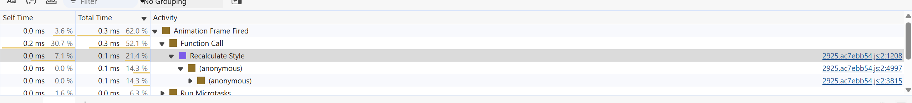
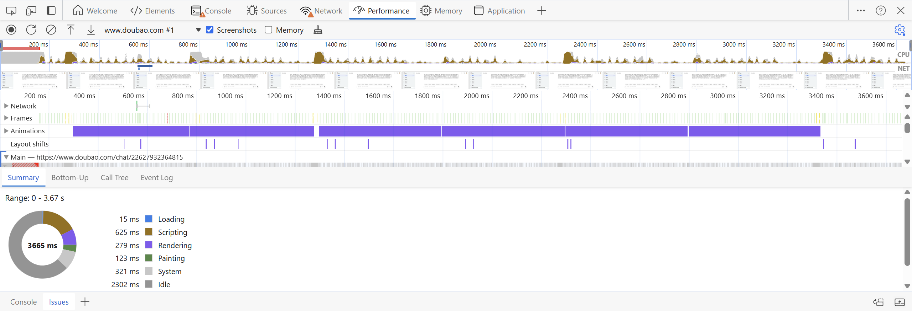
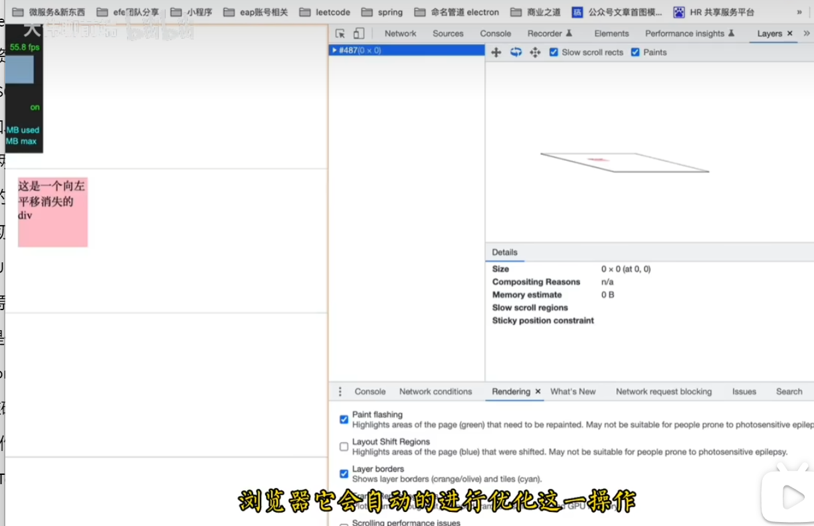
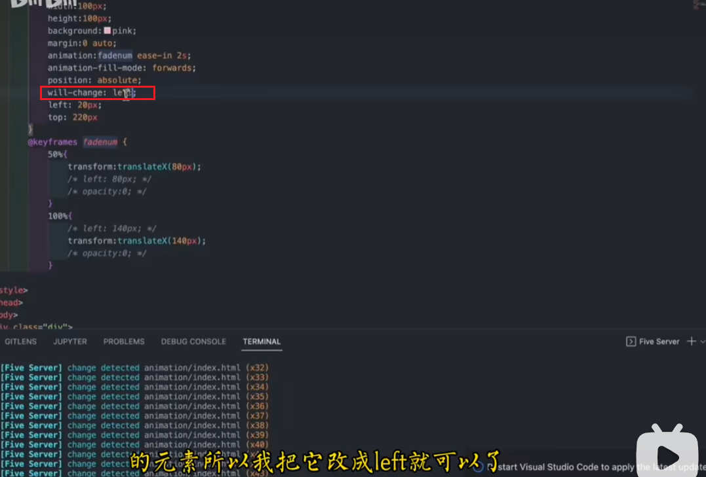
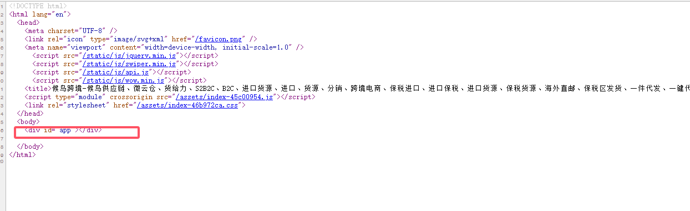

## 说说var、let、const之间的区别

1. `var`、`let` 和 `const` 是 JavaScript 中用于声明变量的三种关键字。它们之间有很多重要的区别，涉及变量作用域、变量提升、可变性（变量值是否可以改变）等方面。以下是它们的详细区别：
   
   ### 1. 作用域（Scope）
   
   #### `var`
   - **函数作用域**：`var` 声明的变量在**函数内是局部**的，在其他所有情况下是全局的。
     
   - 全局作用域下for循环条件内用var声名的变量在外部也可以进行访问
     
       ```javascript
       function example() {
           var x = 10;
           if (true) {
               var x = 20; // 同一个变量
               console.log(x); // 20
           }
           console.log(x); // 20
       }
       example();
       ```
   
   #### `let` 和 `const`
   - **块作用域**：`let` 和 `const` 声明的变量在**块级作用域**（由一对花括号 `{}` 包围的区域）内有效。
   
   ### 2. 变量提升（Hoisting）
   
   #### `var`
   - **变量提升**：`var` **声明的变量会被提升**到其作用域的顶部，但**初始化不会被提升**。
     
       ```javascript
       console.log(x); // undefined
       var x = 10;
       ```
   
   #### `let` 和 `const`
   - **暂时性死区（TDZ）**：`let` 和 `const` 声明的变量也会被提升，但在声明之前的区域被称为暂时性死区，访问这些变量会导致引用错误。
       ```javascript
       console.log(x); // ReferenceError: x is not defined
       let x = 10;
       
       console.log(y); // ReferenceError: y is not defined
       const y = 20;
       ```
   
   ### 3. 可变性（Mutability）
   
   #### `var` 和 `let`
   - **可重赋值**：`var` 和 `let` 声明的变量可以重新赋值。
   
   #### `const`
   - **不可重赋值**：`const` 声明的变量必须在声明时初始化，并且无法重新赋值。
   
   ### 4. 全局对象属性
   
   #### `var`
   - **全局对象属性**：在全局作用域中，`var` 声明的变量会成为全局对象的属性（例如浏览器中的 `window` 对象）。
       ```javascript
       var a = 10;
       console.log(window.a); // 10
       ```
   
   #### `let` 和 `const`
   - **不成为全局对象属性**：在全局作用域中，`let` 和 `const` 声明的变量不会成为全局对象的属性。
   
   ### 总结
   
   - **`var`**：函数作用域、变量提升、可重赋值、在全局作用域中成为全局对象属性。
   - **`let`**：块作用域、暂时性死区、可重赋值、不会成为全局对象属性。
   - **`const`**：块作用域、暂时性死区、不可重赋值、不会成为全局对象属性。
   

## ES6中数组新增了哪些扩展？

1. **Array.from() 方法：** `Array.from()` 方法可以`将类数组对象或可迭代对象转换为真正的数组`。它接受一个类数组对象或可迭代对象作为参数，并`返回一个新的数组`。

   ```javascript
   const arrayLike = { 0: 'a', 1: 'b', 2: 'c', length: 3 };
   //必须有length才能被转为数组，否则为空
   const newArray = Array.from(arrayLike); // ['a', 'b', 'c']
   ```

2. **Array.of() 方法：** `Array.of()` 方法用于`创建一个新数组`，它接受任意数量的参数，并将这些参数作为数组的元素，`返回一个新的数组`。

   ```javascript
   const newArray = Array.of(1, 2, 3); // [1, 2, 3]
   ```

3. **Array.prototype.find() 和 Array.prototype.findIndex() 方法：** `find()` 方法用于查找数组中满足条件的第一个元素，`findIndex()` 方法用于查找数组中满足条件的第一个元素的索引。

   ```javascript
   const numbers = [1, 2, 3, 4, 5];
   const found = numbers.find(num => num > 3); // 4
   const foundIndex = numbers.findIndex(num => num > 3); // 3
   ```

4. **Array.prototype.fill() 方法：** `fill()` 方法用于`填充`数组的所有元素，可以指定起始位置和结束位置。

   ```javascript
   const array = [1, 2, 3, 4, 5];
   array.fill(0, 2, 4); // [1, 2, 0, 0, 5]
   ```

5. **Array.prototype.includes() 方法：** `includes()` 方法用于检查数组中是否包含指定的元素，返回`布尔值。`

   ```javascript
   const array = [1, 2, 3, 4, 5];
   const isIncluded = array.includes(3); // true
   ```

6. **扩展运算符（Spread Operator）：** 扩展运算符 `...` 可以在`数组字面量中用来展开数组`，或者在`函数`调用时用来`传递参数`。

   ```javascript
   const array1 = [1, 2, 3];
   const array2 = [...array1, 4, 5, 6]; // [1, 2, 3, 4, 5, 6]
   
   function sum(a, b, c) {
       return a + b + c;
   }
   
   const numbers = [1, 2, 3];
   const result = sum(...numbers); // 6
   ```

#### entries()，keys()，values()

`keys()`是对键名的遍历、`values()`是对键值的遍历，`entries()`是对键值对的遍历

## 对象新增了哪些扩展？

1. **对象属性的简洁表示法：**如果对象的属性和变量名相同，可以省略属性名。
2. **计算属性名：** 在对象字面量中，属性名可以使用表达式来定义。
3. **对象方法的简写语法：**定义对象的方法时可以省略 function 关键字。
4. **Object.assign() 方法：** 用于将所有可枚举的属性从一个或多个源对象复制到目标对象，并返回目标对象。
5. `this`关键字总是指向函数所在的当前对象，ES6 又新增了另一个类似的`关键字super`，指向当前对象的原型对象
6. 解构赋值,`解构赋值必须是最后一个参数`，否则会报错,解构赋值是`浅拷贝`

```javascript
let { x, y, ...z } = { x: 1, y: 2, a: 3, b: 4 };
x // 1
y // 2
z // { a: 3, b: 4 }
let obj = { a: { b: 1 } };
let { ...x } = obj;
//第一层是深拷贝，修改不会影响，后续是浅拷贝，比如修改obj.a，x.a是不会受影响的
obj.a.b = 2; // 修改obj里面a属性中键值
x.a.b // 2，影响到了结构出来x的值
```

##### Object.is()

**严格判断两个值是否相等**，与严格比较运算符**（===）的行为基本一致**，不同之处只有两个：一是`+0`不等于`-0`，二是`NaN`等于自身

## ES6中函数新增了哪些扩展

`ES6`允许为函数的参数设置默认值


函数的形参是默认声明的，不能使用`let`或`const`再次声明

```js
function foo(x = 5) {
    let x = 1; // error
    const x = 2; // error
}
```

参数默认值可以与解构赋值的默认值结合起来使用

```js
function foo({x, y = 5}) {
  console.log(x, y);
}

foo({}) // undefined 5
foo({x: 1}) // 1 5
foo({x: 1, y: 2}) // 1 2
foo() // TypeError: Cannot read property 'x' of undefined
```

##### **箭头函数中的 this：** 

箭头函数没有自己的 `this`，它们的 `this` 值继承自外围作用域。

##### 严格模式

只要函数参数使用了默认值、解构赋值、或者扩展运算符，那么函数内部就不能显式设定为严格模式，否则会报错

## Set和Map

`map`和`set`的**键值可以是任意类型**

`weakmap`和`weakset`的**键**只能是**对象**

##### Map

- 键值对的集合，其中键可以是任何类型（包括对象）。
- 记住键的原始插入顺序。

##### Set

- 集合中的每个值只能出现一次，即 Set 中的元素是唯一的。
- 可以存储任何类型的值。
- 保证插入顺序

#### 区别？

- Set 只存储值，而 Map 存储键值对。
- Set 中的值是唯一的，而 Map 允许重复的值（但键是唯一的）。
- Set 主要用于检查一个值是否存在于集合中，而 Map 用于存储具有关联关系的数据。

#### 都有的遍历方法

- keys()：返回键名的遍历器
- values()：返回键值的遍历器
- entries()：返回所有成员的遍历器
- forEach()：遍历 Map 的所有成员

#### `WeakSet` 和 `WeakMap`

`WeakSet` 和 `WeakMap` 主要用于`存储对象的弱引用`，`适用于`需要`临时存储对象`，且不希望妨碍这些对象被垃圾回收的场景。

共同特点:

- **只能使用对象作为键：** 的键必须是**对象**，不能是原始值。
  - 虽然键必须是对象，但**值可以是任意类型的数据**。

- **弱引用：** 键是弱引用的，当键对象被垃圾回收时，相应的键值对会自动从 中删除。
- **不可迭代：**不支持迭代方法（如 `forEach`），因此不能遍历其中的键值对。
- **无法知道大小：** 没有 `size` 属性，也没有类似 `size` 的方法，因此无法知道其中包含的键值对数量。
- 垃圾回收友好：
  - 当键对象不再被引用时，相关的键值对会被自动清除，有助于防止内存泄漏。
- **不能被 JSON 序列化**

## map和weakmap

```javascript
const map = new Map()
const weakmap = new WeakMap()
(function(){
    const foo = {foo: 1}
    const bar = {bar: 1}
    map.set(foo, 1)
    weakmap.set(bar, 1)
})()
console.log(map)
console.log(weakmap)
//Map(1) { { foo: 1 } => 1 }
//WeakMap { <items unknown> }
```

bar在释放后, weakmap没有键的引用就自动被回收了

### 为什么 `WeakMap` 的输出是 `<items unknown>`？

`WeakMap` 的设计是为了避免内存泄漏，因此它不会暴露其内部的键值对。你不能直接遍历 `WeakMap` 的键或值，也不能检查其大小。`WeakMap` 的键值对只有在键对象没有其他引用时才会被垃圾回收。


这段代码没有错误，但它展示了 `Map` 和 `WeakMap` 在处理对象键时的不同行为。`Map` 会保留键值对，而 `WeakMap` 的键值对可能会被垃圾回收。


vue3源码里的响应式对象通过weakmap来对对象做代理


**WeakMap 的键是弱引用，当键对象不再有强引用时，键值对会被垃圾回收。**

**Node.js 和浏览器环境的垃圾回收机制存在差异，导致 WeakMap 的行为在不同环境下可能会有所不同。**

## Promise

异步编程的一种解决方案，主要用于`解决回调地狱`（callback hell）和提供`更优雅的异步编程`解决方案。比传统的解决方案（回调函数）更加合理和更加强大

`promise`解决异步操作的优点：

- 链式操作减低了编码难度
- 代码可读性明显增强

### Promise 的特点：

1. **状态（State）：** `Promise` 对象有三种状态：`pending`（进行中）、`fulfilled`（已成功）和`rejected`（已失败）。
2. **状态转换：** `Promise` 对象的状态一旦改变，就会凝固，不会再改变。只有异步操作的结果可以决定状态的转变。
3. **链式调用：** `Promise` 支持链式调用，可以将多个异步操作按照顺序串联起来，避免回调地狱，使代码更加清晰和易于维护。
4. **错误处理：** `Promise` 允许通过 `.catch()` 方法捕获异步操作中的错误，并进行统一的错误处理。
5. **多个异步操作的并行和串行：** `Promise.all()` 方法可以将多个异步操作并行执行，直到所有操作完成；`Promise.race()` 方法可以将多个异步操作串行执行，只要有一个操作完成就返回结果。

### Promise的主要方法

a. then(onFulfilled, onRejected)
- 用于处理 Promise 成功或失败的情况
- 返回一个新的 Promise

```javascript
promise.then(
  result => console.log(result),
  error => console.error(error)
);
```

b. catch(onRejected)
- 用于处理 Promise 失败的情况
- 相当于 then(null, onRejected)

```javascript
promise.catch(error => console.error(error));
```

c. finally(onFinally)
- 无论 Promise 成功还是失败都会执行
- 不接收任何参数

```javascript
promise.finally(() => console.log('Finished'));
```

静态方法：

a. Promise.resolve(value)
- 返回一个以给定值解决的 Promise

```javascript
const resolvedPromise = Promise.resolve(42);
```

b. Promise.reject(reason)
- 返回一个以给定原因拒绝的 Promise

```javascript
const rejectedPromise = Promise.reject(new Error('Failed'));
```

c. Promise.all(iterable)
- 等待所有 Promise 都成功，或任一 Promise 失败
- 返回一个新的 Promise

```javascript
Promise.all([promise1, promise2, promise3])
  .then(results => console.log(results));
```

d. Promise.race(iterable)
- 返回一个 Promise，一旦迭代器中的某个 promise 解决或拒绝，就采用**第一个** promise 的值作为它的值

```javascript
Promise.race([promise1, promise2, promise3])
  .then(result => console.log(result));
```

e. Promise.allSettled(iterable)
- 等待所有 Promise **都完成（无论成功或失败）**
- 返回一个**包含所有结果的数组**

```javascript
Promise.allSettled([promise1, promise2, promise3])
  .then(results => console.log(results));
```

f. Promise.any(iterable)
- 只要给定的迭代中的一个 promise 成功，就返回那个已经成功的 promise
- 如果所有 promise 都失败，则返回一个失败的 promise

```javascript
Promise.any([promise1, promise2, promise3])
  .then(result => console.log(result))
  .catch(error => console.error(error));
```

## js不是单线程的吗，Promise.all为什么是并行

您提出了一个非常好的问题！这确实是一个容易混淆的概念。让我来解释一下：

1. JavaScript 确实是单线程的：
   JavaScript 的确是单线程执行的，这意味着在任何给定时刻，只有一个操作在执行。

2. 异步和并发：
   尽管 JavaScript 是单线程的，但它支持异步编程。这允许代码以非阻塞的方式执行，给人一种"并行"的错觉。

3. 事件循环：
   JavaScript 使用事件循环来管理异步操作。当遇到异步操作时，JavaScript 会将其放入事件队列，继续执行后续代码，然后在主线程空闲时处理队列中的事件。

4. Promise.all() 的"并行"：
   当我们说 Promise.all() 是"并行"执行的，实际上是指它同时启动了所有的异步操作，而不是一个接一个地等待它们完成。

5. 实际的执行过程：
   - 当调用 Promise.all() 时，它会立即启动所有传入的 Promise。
   - 这些 Promise 可能包含 AJAX 请求、定时器、文件操作等异步任务。
   - JavaScript 引擎会将这些异步任务交给浏览器的其他部分（如 Web APIs）来处理。
   - 主线程继续执行，不会被这些异步操作阻塞。
   - 当异步操作完成时，相应的回调会被添加到事件队列。
   - 事件循环会在主线程空闲时，从队列中取出这些回调并执行。

6. 并发 vs 并行：
   - 严格来说，这种行为更准确的描述是"并发"而不是"并行"。
   - 并发是指同时管理多个任务，而并行是指同时执行多个任务。
   - JavaScript 通过事件循环实现了并发，但由于单线程的本质，它不能真正地并行执行任务。

示例：

```javascript
console.log('Start');

Promise.all([
  new Promise(resolve => setTimeout(() => resolve('One'), 1000)),
  new Promise(resolve => setTimeout(() => resolve('Two'), 2000)),
  new Promise(resolve => setTimeout(() => resolve('Three'), 3000))
]).then(console.log);

console.log('End');

// 输出：
// Start
// End
// (大约3秒后)
// ['One', 'Two', 'Three']
```

在这个例子中，所有的定时器几乎同时开始，但它们在不同的时间完成。JavaScript 引擎不会等待这些定时器，而是继续执行后续代码。

总结：虽然 JavaScript 是单线程的，但通过事件循环和异步编程，它能够高效地管理多个并发操作，给人一种"并行"的感觉。Promise.all() 利用了这种机制，同时启动多个异步操作，但实际上它们仍然是在单个线程上交错执行的。
### 并行处理概念

在单线程环境中，JavaScript 是如何“并行”处理异步操作的呢？

1. **异步操作的本质**：
   
    - 异步操作（如网络请求、文件读取、定时器等）不会阻塞主线程。相反，这些操作通常委托给浏览器或 Node.js 的底层实现（如 I/O 操作系统级别的支持），并且可以在其开始时安排回调函数。
2. **事件循环**：
   
    - JavaScript 的事件循环机制允许执行异步操作的回调函数被推入事件队列中，然后在主线程空闲时依次执行。
    - 这样，尽管 JavaScript 是单线程执行代码，它仍然可以通过异步操作的处理来“同时”执行多个任务。
## js的定时器和promise到底是js来执行还是分配给浏览器执行

JavaScript 的定时器和 `Promise` 本身的执行是通过 JavaScript 引擎管理的，但某些异步操作会被委托给浏览器或 Node.js 的运行环境。这种机制通常涉及到事件循环和任务队列的概念。

### 定时器
定时器包括 `setTimeout` 和 `setInterval`：

- **`setTimeout` 和 `setInterval`**：
  - 这些函数安排一个任务在特定的时间后运行。虽然它们是 JavaScript 提供的 API，但它们的计时功能往往由浏览器或 Node.js 本身来处理。
  - 当定时器到期时，相应的回调函数将被放入任务队列中，等待 JavaScript 事件循环进行处理。

### Promise
`Promise` 是用于管理异步操作的对象：

- **Promise 本身的执行**：
  - `Promise` 的执行（即 `executor` 函数的执行）是同步的。当你创建一个 `Promise` 对象时，传入的函数会立即执行。
  - 使用 `Promise` 的异步行为，如 `.then()` 和 `.catch()`，其实本身是通过事件循环来管理。它们的回调会被加入到微任务队列中。

### 浏览器 vs JavaScript 引擎

1. **JavaScript 引擎**：
   - JavaScript 引擎（如 V8）负责执行 JavaScript 代码，包括同步代码和 `Promise` 等异步操作接口。
   - JavaScript 引擎管理着事件循环，处理任务队列（宏任务）以及微任务队列（如 `Promise` 的回调）。

2. **浏览器**：
   - 浏览器或 Node.js 环境会负责监控和执行某些异步操作（如 I/O 操作、定时器的计时等）。
   - 一旦这些异步操作完成（例如 HTTP 请求完成或定时器到期），它们会将相应的回调函数放入事件循环的任务队列，然后由 JavaScript 引擎来处理。

### 总结
所以，定时器和 `Promise` 的管理涉及到 JavaScript 引擎和浏览器/Node.js 环境的协作：

- **JavaScript 引擎**：负责执行 JavaScript 代码，管理事件循环和任务队列。
- **浏览器/Node.js**：负责底层异步任务的处理（例如计时和 I/O 操作），并在完成时将回调放入JavaScript 引擎的任务队列。
1. **JavaScript 引擎（如 V8）**：
   
    - 负责执行 JavaScript 代码，包括同步和异步的 JavaScript 逻辑。
    - 管理任务队列和微任务队列（如 Promise 的回调）。
    - 控制事件循环的运行，决定何时执行任务队列中的任务和微任务队列中的任务。
2. **浏览器/Node.js 环境**：
   
    - 提供系统级别的 API，如定时器、网络请求、文件系统等，这些是 JavaScript 运行时环境的一部分，而不是 JavaScript 语言本身的一部分。
    - 这些环境负责在适当的时候将已完成的异步操作（如计时器到期、I/O 完成）推入事件循环的任务队列。

## async和await

`async` 和 `await` 并不是直接的语法糖，而是`建立在 Promise 和 Generator 的基础上的语法糖`

`async` 和 `await` 是 ES8（也称为 ES2017）引入的新特性，用于更方便地处理异步操作，使得异步代码的编写和理解更加简洁和直观。

`async` 函数是用来定义异步函数的关键字，它可以将函数声明为异步函数，使得函数内部可以使用 `await` 来等待异步操作的结果。

- `async` 函数内部使用 `return` 返回的值会被包装成一个 Promise 对象，无论这个函数内部是否显式地返回了一个 `Promise`。
- 在 `async` 函数内部可以使用 `await` 关键字来等待 Promise 对象的完成，并且 `await` 只能在 `async` 函数内部使用。

------

`await` 是用于等待异步操作完成的关键字，它只能在 `async` 函数内部使用。当 `await` 后面跟着一个 Promise 对象时，它会暂停函数的执行，直到该 Promise 对象状态变为 resolved（完成）或 rejected（失败）。

- await 关键字只能在 async 函数内部使用。
- 当遇到 await 时，JavaScript 引擎会暂停当前 async 函数的执行。
- await 后面的表达式会立即执行，然后函数暂停，等待 Promise settled（即 resolved 或 rejected）。
- 一旦 Promise settled，函数会恢复执行。
- 如果 Promise resolved，await 表达式的值就是 Promise 的结果。
- 如果 Promise rejected，await 表达式会抛出异常。

### 内部实现：

async/await 的内部实现利用了生成器（Generator）和 Promise。可以将其理解为一个自动执行的生成器函数。

```javascript
async function example() {
  const result = await someAsyncOperation();
  return result;
}

// 可以理解为以下形式
function example() {
  return new Promise((resolve, reject) => {
    const generator = function* () {
      try {
        const result = yield someAsyncOperation();
        resolve(result);
      } catch (error) {
        reject(error);
      }
    };
    
    const iterator = generator();
    const handleNext = (value) => {
      const next = iterator.next(value);
      if (next.done) return;
      Promise.resolve(next.value).then(handleNext, iterator.throw);
    };
    
    handleNext();
  });
}
```

#### 执行过程：

- 当调用 async 函数时，它会立即返回一个 Promise。
- 函数体开始执行，直到遇到第一个 await 表达式。
- await 表达式会暂停函数的执行，并等待 Promise 的结果。
- 一旦 Promise settled，函数恢复执行，await 返回 Promise 的结果（或抛出异常）。
- 这个过程会一直重复，直到函数执行完毕或抛出未捕获的异常。

1. 错误处理：
   - 在 async 函数中，可以使用 try/catch 来捕获 await 的错误。
   - 如果没有被捕获，错误会导致返回的 Promise 被 reject。
2. 事件循环和任务队列：
   - async/await 不会阻塞事件循环。当遇到 await 时，函数的后续代码会被放入微任务队列（microtask queue）。
   - 这确保了异步操作不会阻塞主线程，同时保持了代码的顺序执行。

使用场景

- **简化异步操作：** `async` 和 `await` 可以简化异步操作的编写，使得异步代码更加清晰和易于理解，避免了回调地狱。
- **错误处理：** `await` 可以与 `try...catch` 结合使用来捕获异步操作中的错误，使得错误处理更加方便。
- **串行/并行操作：** `await` 可以按照顺序执行异步操作，也可以使用 `Promise.all()` 来并行执行多个异步操作。

## ES6中的Proxy

`Proxy` 是一种用于`创建代理对象`的特殊对象，它可以`拦截并定义基本操作的自定义行为`，例如属性查找、赋值、删除等操作。`Proxy` 可以用来`拦截对目标对象的访问`，并在必要时`修改目标对象的行为`。

#### Proxy 的特点：

1. **拦截操作：** `Proxy` 可以拦截目标对象的各种操作，包括属性的读取（get）、属性的设置（set）、属性的删除（deleteProperty）、属性的枚举（enumerate）、函数调用（apply）等。
2. **自定义行为：** 通过在代理对象上设置拦截器（handler），可以定义对应操作的自定义行为，使得可以对目标对象的操作进行定制化处理。
3. **可扩展性：** `Proxy` 提供了一种灵活且可扩展的方式来操作和定制对象的行为，使得可以实现更加复杂的逻辑和功能。

#### 使用场景：

1. **属性验证和过滤：** 可以使用 `Proxy` 对象拦截属性的赋值操作，在`赋值之前进行验证和过滤`，以确保属性的合法性。
2. **数据绑定和响应式编程：** 可以使用 `Proxy` 对象`实现数据的双向绑定和响应式编程`，`监听`目标对象的`变化`并`自动更新相关的视图`。
3. **拦截操作和记录日志：** 可以使用 `Proxy` 对象`拦截目标对象的各种操作`，并在拦截器中`记录日志`、统计调用次数等信息。
4. **性能优化：** 可以使用 `Proxy` 对象拦截目标对象的访问，并对访问进行`缓存或优化`，以提高程序的性能和效率。`缓存`某些计算结果或`重复访问的数据`,`延迟加载数据`，只在`真正需要访问时`才进行加载和`初始化`
5. **权限控制：** 可以使用 `Proxy` 对象实现对目标对象的访问权限控制，限制用户对特定属性或方法的访问权限。限制某些属性只读或只写，或者禁止对某些属性的访问

## ES6中Module

模块（Module）是一种用于`组织和管理 `JavaScript 代码的方式，它提供了一种`模块化的编程风格`，使得代码可以`更加清晰、可维护和可重用`。

#### 模块的特点：

1. **独立性：** `每个模块都是独立的作用域`，模块内部的变量、函数和类默认不会暴露到全局作用域，需要通过 `export` 导出才能被其他模块使用。
2. **导入导出：** 模块可以通过 `export` 关键字导出变量、函数、类等，使得这些成员可以被其他模块使用；同时，可以使用 `import` 关键字导入其他模块导出的成员，使得模块之间可以相互调用和引用。
3. **静态解析：** **模块系统是静态**的，即在**代码执行之前就确定了模块之间的依赖关系和引用关系**，使得代码的依赖关系更加清晰和可靠。
4. **可重用性：** 模块化的编程风格使得代码可以`更容易地被重用和组合`，从而提高了代码的可维护性和可扩展性。

#### 使用场景：

1. **项目组织：** 可以使用`模块来组织项目的代码结构`，将代码分`割成独立的模块`，使得每个模块只关注于特定的功能或责任，提高了代码的可维护性和可读性。
2. **代码复用：** 可以`将通用的功能封装成模块`，并在`需要的地方导入和使用`，避免了重复编写相似的代码，提高了代码的复用性和效率。
3. **依赖管理：** 模块系统提供了依赖管理的机制，可以明确地`声明和管理模块之间的依赖关系`，使得项目的依赖关系更加清晰和可控。
4. **库和插件：** 可以`将自己编写的功能模块封装成库或插件`，并在其他项目中引入和使用，从而`实现功能的共享和扩展`。

## ES6中的 Decorator 

- 代码可读性变强了，装饰器命名相当于一个注释
- 在不改变原有代码情况下，对原来功能进行扩展

#### 装饰器的特点：

1. **语法糖：** 装饰器提供了一种更简洁、更直观的语法来实现对类和类成员的装饰，使得`代码更加清晰`和易于理解。
2. **可组合性：** 装饰器`可以串联使用`，多个装饰器可以按照顺序应用到同一个目标上，从而实现更复杂的装饰逻辑。
3. **动态修改：** 装饰器可以在运行时动态地修改类和类成员的行为，使得可以根据需要进行灵活的定制和调整。
4. **可重用性：** 装饰器本身是一种函数，可以定义为独立的函数，从而可以在`多个地方重复使用`。

#### 使用场景：

1. **日志记录：** 可以使用装饰器来实现`方法调用的日志记录`，记录方法的调用时间、参数、返回值等信息。
2. **性能监控：** 可以使用装饰器来实现方法调用的`性能监控`，`统计`方法的`执行时间`、调用次数等信息。
3. **权限控制：** 可以使用装饰器来实现对方法或属性的`访问权限控制`，限制只有特定角色或权限的用户才能访问。
4. **参数校验：** 可以使用装饰器来对方法的参数进行`校验和验证`，确保参数的合法性和正确性。
5. **缓存优化：** 可以使用装饰器来实现方法调用的`结果缓存`，`避免重复计算或请求`，提高程序的性能和效率。

## JavaScript中的数据类型

- 原始类型
- 引用类型

两种类型的主要区别是：`存储位置`不同

#### 原始类型（Primitive Types）：

1. **Number（数字）：** 用于表示数值，可以是整数或浮点数。
2. **String（字符串）：** 用于表示文本数据，可以包含任意字符序列。
3. **Boolean（布尔值）：** 用于表示逻辑值，可以是 `true` 或 `false`。
4. **Undefined（未定义）：** 表示未初始化的变量或缺少值的情况。
5. **Null（空值）：** 表示空值或无效值。
6. **Symbol（符号）：** 用于创建唯一的标识符。

#### 引用类型（Reference Types）：

1. **Object（对象）：** 用于表示复杂数据结构，可以包含多个属性和方法。
2. **Array（数组）：** 特殊的对象，用于表示有序的集合数据。
3. **Function（函数）：** 特殊的对象，用于执行特定的任务或操作。
4. **Date（日期）：** 用于表示日期和时间。
5. **RegExp（正则表达式）：** 用于处理字符串的模式匹配。
6. **Map、Set：** ES6 新增的数据结构，用于存储键值对集合或唯一值集合。

#### 存储上的差别：

1. **原始类型：** 存储在`栈`内存（Stack）中，`数据直接存储在变量访问的位置`，因此访问速度较快，但大小固定且较小。
2. **引用类型：** 存储在`堆`内存（Heap）中，`变量存储的是对象的引用（地址）`，实际的数据存储在堆内存中，因此访问速度较慢，但大小可变且较大。

#### 访问栈比访问堆快主要有以下几个原因：

一、内存分配方式

##### 栈的内存分配：

- **栈的内存分配是连续的**，并且通常由系统自动管理。当一个函数被调用时，系统会为其在栈上分配一块连续的内存空间，用于存储函数的局部变量、参数和返回地址等。
- 这种连续的内存分配方式使得**访问栈上的变量非常快速**，因为**处理器可以通过简单的指针运算快速定位到变量的内存地址**。

##### 堆的内存分配：

- 堆的内**存分配是动态的**，并且通常由程序员手动管理。当需要在堆上分配内存时，系统需要查找足够大的连续空闲内存块，并进行分配和管理。
- 这种动态的内存分配方式使得**堆上的内存可能不是连续**的，访问堆上的变量**需要通过指针间接寻址**，这**增加了访问的时间开销**。

二、内存管理方式

##### 栈的内存管理：

- 栈的**内存管理非常简单**，当一个**函数执行完**毕时，系统会**自动释放该函数在栈上占用的内存空间**。
- 这种自动的内存管理方式使得栈的内存使用非常高效，并且不会出现内存泄漏等问题。

##### 堆的内存管理：

- 堆的内存管理相对复杂，程序员需要**手动分配和释放内存**。如果程序员没有正确地管理堆上的内存，可能会导致内存泄漏、内存碎片等问题。
- 手动的内存管理方式增加了程序的复杂性，并且可能会导致性能问题。

三、缓存局部性

##### 栈的缓存局部性：

- 由于栈的内存分配是连续的，并且函数的调用通常是嵌套的，因此访问栈上的变量通常具有良好的缓存局部性。
- 这意味着处理器可以更快地访问栈上的变量，因为它们很可能已经在处理器的缓存中。

##### 堆的缓存局部性：

- 由于堆的内存分配是动态的，并且访问堆上的变量通常是随机的，因此访问堆上的变量通常具有较差的缓存局部性。
- 这意味着处理器可能需要从内存中读取变量，而不是从缓存中读取，这增加了访问的时间开销
- 。

综上所述，访问栈比访问堆快主要是因为栈的内存分配和管理方式更加简单高效，并且具有更好的缓存局部性。然而，在实际编程中，需要根据具体的需求选择使用栈还是堆来存储数据。如果需要快速访问局部变量或者需要自动管理内存，可以使用栈；如果需要动态分配内存或者需要存储大量数据，可以使用堆。

## 数组的常用方法

1. |     方法      | 修改原数组？ | 功能                                                         |
   | :-----------: | :----------: | ------------------------------------------------------------ |
   |    push()     |      是      | 向数组末尾添加一个或多个元素，返回数组的最新长度             |
   |     pop()     |      是      | 删除并返回数组的最后一个元素，返回被删除的项                 |
   |   unshift()   |      是      | 向数组开头添加一个或多个元素，然后返回新的数组长度           |
   |    shift()    |      是      | 删除并返回数组的第一个元素，返回被删除的项                   |
   |   concat()    |      否      | 合并两个或多个数组为一个新数组,返回新数组                    |
   |    join()     |      否      | 将数组中所有元素连接成一个字符串                             |
   |    slice()    |      否      | 返回数组的一部分，不修改原数组                               |
   |   splice()    |      是      | 添加或删除数组的元素，同时修改原数组，返回包含删除元素的数组 |
   |   indexOf()   |      否      | 返回指定元素在数组中的第一个匹配项的索引                     |
   | lastIndexOf() |      否      | 返回指定元素在数组中的最后一个匹配项的索引                   |
   |   forEach()   |      否      | 遍历数组，对每个元素执行指定操作                             |
   |     map()     |      否      | 遍历数组，对每个元素执行指定操作，并返回结果数组             |
   |   filter()    |      否      | 遍历数组，根据指定条件筛选元素                               |
   |   reduce()    |      否      | 遍历数组，将数组元素归纳为单个值                             |
   | reduceRight() |      否      | 与 reduce() 方法类似，但从右向左遍历数组                     |
   |    find()     |      否      | 返回数组中满足条件的第一个元素                               |
   |  findIndex()  |      否      | 返回数组中满足条件的第一个元素的索引                         |
   |    every()    |      否      | 检查数组中的所有元素是否满足条件                             |
   |    some()     |      否      | 检查数组中是否存在满足条件的元素                             |
   |    sort()     |      是      | 对数组元素进行排序，修改原数组                               |
   |   reverse()   |      是      | 颠倒数组中元素的顺序，修改原数组                             |

## JavaScript字符串的常用方法

1. **length：** 返回字符串的长度。
2. **charAt()：** 返回指定位置的字符。
3. **charCodeAt()：** 返回指定位置字符的 Unicode 编码。
4. **concat()：** 连接两个或多个字符串，并返回新字符串。
5. **indexOf()：** 返回指定子字符串首次出现的位置。
6. **lastIndexOf()：** 返回指定子字符串最后一次出现的位置。
7. **startsWith()：** 检查字符串是否以指定子字符串开头。
8. **endsWith()：** 检查字符串是否以指定子字符串结尾。
9. **includes()：** 检查字符串是否包含指定子字符串。
10. **substring()：** 返回指定位置之间的子字符串。
11. **slice()：** 提取字符串的一部分，并返回新字符串。
12. **substr()：** 从指定位置开始，返回指定长度的子字符串。
13. **replace()：** 替换字符串中的匹配子字符串。
14. **toUpperCase()：** 将字符串转换为大写。
15. **toLowerCase()：** 将字符串转换为小写。
16. **trim()：** 移除字符串两端的空白字符。
17. **split()：** 将字符串分割为字符串数组。
18. **match()：** 在字符串中检索指定值，返回匹配的子字符串数组。
19. **search()：** 在字符串中搜索指定值，返回匹配的位置。
20. **repeat()：** 返回包含指定字符串的指定数量副本的新字符串。

##  JavaScript 中的类型转换机制

`隐式类型转换`和`显式类型转换`

#### 隐式类型转换

- **字符串拼接**：当一个字符串与其他类型的值进行加法运算时，其他值会被自动转换为字符串。

```javascript
console.log("5" + 2); // 输出 "52"
```

- **算术运算：** 当一个非字符串值与字符串进行算术运算时，非字符串值会被自动转换为数字。

```javascript
console.log("5" - 2); // 输出 3
```

- **逻辑运算：** 当非布尔值参与逻辑运算时，会将其转换为布尔值。

```javascript
if (1) {  console.log("true"); }// 输出 "true"
```

#### 显式类型转换

- **转换为字符串：** 使用 `String()` 函数或字符串模板。
- **转换为数字：** 使用 `Number()` 函数或 `+` 操作符。
- **转换为布尔值：** 使用 `Boolean()` 函数。
- **parseInt() 和 parseFloat()：** 将字符串转换为整数或浮点数。

## == 和 ===区别，分别在什么情况使用

用于比较两个值是否相等。它们的`区别`主要在于`类型转换的方式和严格性`。

#### `==` （相等运算符，Equality Operator）：

- **类型转换：** 在进行比较之前，`会进行类型转换`，使得两个值的类型相同。
- **松散比较：** `只比较值`是否相等，`不考虑数据类型`。
- **隐式类型转换：** 可能会触发`隐式类型转换`。

#### `===` （严格相等运算符，Strict Equality Operator）：

- **类型与值都要相等：** `不会进行类型转换`，只有在类型和值都相等时才返回 true。
- **严格比较：** `区分数据类型`。
- **不触发隐式类型转换：** 不会进行隐式类型转换，`必须类型和值都相等才返回 true`。

比较对象属性为`null`或者`undefined`的情况下，我们可以使用相等操作符

其他情况建议一律使用全等操作符

这是因为 `null` 和 `undefined` 在`相等比较中被认为是相等的`，而`不会触发类型转换`。这种情况下，两者之间的比较会返回 `true`。

## 检测数据类型的方法

除了 `typeof` 操作符，JavaScript 还有其他几种获取数据类型的方法。以下是一些常用的方法：

除了 `typeof` 操作符，JavaScript 还有其他几种获取数据类型的方法。以下是一些常用的方法：

### Object.prototype.toString.call()

这是一种更可靠的类型检查方法，能够识别更多的类型：

```javascript
Object.prototype.toString.call(42);           // "[object Number]"
Object.prototype.toString.call('');           // "[object String]"
Object.prototype.toString.call(true);         // "[object Boolean]"
Object.prototype.toString.call(undefined);    // "[object Undefined]"
Object.prototype.toString.call(null);         // "[object Null]"
Object.prototype.toString.call({});           // "[object Object]"
Object.prototype.toString.call([]);           // "[object Array]"
Object.prototype.toString.call(function(){}); // "[object Function]"
```

### instanceof 操作符

用于检查对象是否是某个构造函数的实例：

```javascript
[] instanceof Array;  // true
{} instanceof Object; // true
```

- Array.isArray()

专门用于检查是否为数组：

```javascript
Array.isArray([]);  // true
Array.isArray({});  // false
```

### constructor 属性

可以用来查看对象的构造函数：

```javascript
[].constructor === Array;  // true
({}).constructor === Object;  // true
```

- Symbol.toStringTag

ES6 引入的一个新特性，允许自定义对象在 `Object.prototype.toString.call()` 中的行为：

```javascript
class MyClass {
    get [Symbol.toStringTag]() {
        return "MyClass";
    }
}
Object.prototype.toString.call(new MyClass()); // "[object MyClass]"
```

## 深拷贝浅拷贝的区别？如何实现一个深拷贝

`基本类型`数据保存在在`栈`内存中

`引用类型`数据保存在`堆`内存中，引用数据类型的变量是一个`指向堆内存中实际对象的引用`，`存在栈中`

#### 深拷贝（Deep Copy）：

深拷贝是将原始数据结构中的所有嵌套对象或数组都复制一份，而不仅仅是复制其引用。这意味着`修改拷贝后的数据结构不会影响到原始数据结构`，它们之间是相互独立的。

常见的深拷贝方式有：

- _.cloneDeep()
- jQuery.extend()
- JSON.stringify()
- 手写循环递归

#### 浅拷贝（Shallow Copy）：

浅拷贝`只是复制原始数据结构中的基本数据类型`（如数字、字符串、布尔值等）`和引用类型的引用`（即地址），`而不是复制引用类型的内容`。这意味着拷贝后的数据结构中的嵌套对象或数组仍然与原始数据结构共享相同的嵌套对象或数组，如果修改了拷贝后的数据结构中的嵌套对象或数组，原始数据结构中的对应嵌套对象或数组也会受到影响。

存在浅拷贝的现象有：

- `Object.assign`
- `Array.prototype.slice()`, `Array.prototype.concat()`
- 使用拓展运算符实现的复制

JavaScript 中的深拷贝和浅拷贝是两种不同的复制对象的方法，它们之间的主要区别在于如何处理嵌套的对象或数组。

1. 浅拷贝（Shallow Copy）:

   - 创建一个新对象，该对象有着原始对象属性值的一份精确拷贝。
   - 如果属性是基本类型，拷贝的就是基本类型的值。
   - 如果属性是引用类型，拷贝的就是内存地址，所以如果其中一个对象改变了这个地址，就会影响到另一个对象。
   - 只复制对象的第一层属性。

   示例：
   ```javascript
   let obj1 = { a: 1, b: { c: 2 } };
   let obj2 = Object.assign({}, obj1);
   // 或者使用展开运算符
   // let obj2 = { ...obj1 };

   obj2.a = 3;
   obj2.b.c = 4;

   console.log(obj1); // { a: 1, b: { c: 4 } }
   console.log(obj2); // { a: 3, b: { c: 4 } }
   ```

2. 深拷贝（Deep Copy）:

   - 创建一个新对象，该对象有着原始对象属性值的一份精确拷贝。
   - 对于非基本类型的属性，递归地复制其所有层级的属性。
   - 深拷贝会创建一个全新的对象，与原始对象完全独立，互不影响。

   示例：
   ```javascript
   let obj1 = { a: 1, b: { c: 2 } };
   let obj2 = JSON.parse(JSON.stringify(obj1)); // 一种简单的深拷贝方法，但有局限性
   
   obj2.a = 3;
   obj2.b.c = 4;
   
   console.log(obj1); // { a: 1, b: { c: 2 } }
   console.log(obj2); // { a: 3, b: { c: 4 } }
   ```

主要区别：

1. 复制深度：
   - 浅拷贝只复制对象的第一层属性。
   - 深拷贝递归复制对象的所有层级。

2. 内存分配：
   - 浅拷贝中，对于复杂类型的属性，新对象和原对象引用同一块内存。
   - 深拷贝会创建全新的内存空间，新旧对象完全独立。

3. 相互影响：
   - 浅拷贝中，改变新对象的复杂类型属性会影响原对象。
   - 深拷贝中，新旧对象互不影响。

4. 性能：
   - 浅拷贝通常更快，因为它只复制一层。
   - 深拷贝可能较慢，尤其是对于大型、嵌套的对象。

5. 实现复杂度：
   - 浅拷贝相对简单，可以使用 Object.assign() 或展开运算符。
   - 深拷贝相对复杂，通常需要递归或使用专门的库。

注意：简单的 JSON.parse(JSON.stringify()) 方法虽然可以实现深拷贝，但它有一些``局限性``：

- 无法复制函数、undefined、symbol。
- 不能处理循环引用。
- 会丢失原型链。

对于更复杂的深拷贝需求，可能需要使用递归方法或专门的库（如 lodash 的 _.cloneDeep()）来实现。

## 闭包

闭包 (Closure) 是指**函数拥有对其词法作用域的访问权限**，即使函数在定义后的其他地方被调用。

更简单地说，闭包**可以让函数 "记住" 它被创建时的环境**，即使它在其他地方被调用，仍然可以访问和修改当时的环境。

### 什么是闭包

闭包是指一个函数可以记住所处的词法作用域，即使这个函数是在当前词法作用域之外执行的。这意味着闭包可以访问它创建时捕获的变量。

简单地说，**闭包使得函数在外部函数执行完毕后，依然能够继续访问该外部函数的变量**。

### 变量何时会被释放？

JavaScript的垃圾回收机制采用的是引用计数或标记清除（mark-and-sweep）方式来释放不再使用的变量。

#### 变量会被释放的情况：

1. **没有引用**：当没有任何有效引用指向一个变量时，这个变量就变成了垃圾，可以被垃圾回收器回收用于释放内存。
2. **函数执行上下文（Execution Context）栈被清理**：当一个函数执行完毕，且没有闭包或其他地方引用它的作用域内的变量时，JavaScript引擎会认为它们是不可达的，因此会被回收。

#### 变量不会被释放的情况：

1. **存在闭包**：如果函数内部的变量被一个闭包引用，那么这些变量不会被释放。因为闭包维持了对其词法作用域的引用。
2. **全局作用域**：在全局作用域中声明的变量在应用程序的整个生命周期间都存在，除非手动删除（如删除全局对象上的属性）。
3. **被引用的对象**：如果对象被其他活动的对象引用，那么它不会被垃圾回收器清理。

### 闭包的定义与示例

#### 基本示例

以下是一个经典的闭包示例：

```javascript
function outerFunction() {
    let outerVariable = 'I am from outer function';

    function innerFunction() {
        console.log(outerVariable);
    }

    return innerFunction;
}

const closure = outerFunction();
closure();  // 输出: I am from outer function
```

在这个例子中：

1. `outerFunction` 创建了一个局部变量 `outerVariable`。
2. `innerFunction` 是一个内部函数，它访问并使用了 `outerVariable`.
3. 当 `outerFunction` 返回 `innerFunction` 时，它形成了一个闭包，`innerFunction` 记住了它创建时的词法作用域，其中包括 `outerVariable`。

### 闭包的特性

#### 延长变量的生命周期

通常情况下，当函数执行完毕后，它的局部变量会被销毁。然而，闭包会延长这些局部变量的生命周期，因为闭包中引用的变量在闭包存在期间不会被销毁。

```javascript
function createCounter() {
    let count = 0;

    return function() {
        count++;
        return count;
    };
}

const counter = createCounter();
console.log(counter()); // 输出: 1
console.log(counter()); // 输出: 2
console.log(counter()); // 输出: 3
```

在这个例子中，变量 `count` 的生命周期被延长，因为返回的匿名函数引用了它，每次调用该匿名函数都会改变 `count` 的值。

#### 创建私有变量

闭包可以用于模拟 JavaScript 中的私有变量，因为闭包中的变量只能通过闭包中的函数访问，而在外部作用域无法直接访问这些变量。

```javascript
function createPerson(name) {
    let _name = name;

    return {
        getName: function() {
            return _name;
        },
        setName: function(newName) {
            _name = newName;
        }
    };
}

const person = createPerson('Alice');
console.log(person.getName()); // 输出: Alice
person.setName('Bob');
console.log(person.getName()); // 输出: Bob
```

在这个示例中，变量 `_name` 是私有变量，只有通过 `getName` 和 `setName` 方法才能访问或修改它。

### 闭包的常见应用

#### **回调函数**:

闭包广泛应用于事件处理、异步编程等回调函数中。

```javascript
function setupClickHandler(buttonId) {
    let count = 0;

    document.getElementById(buttonId).addEventListener('click', function() {
        count++;
        console.log(`Button clicked ${count} times`);
    });
}

setupClickHandler('myButton');
```

#### **创建模块化代码**：

闭包可以用来创建模块化代码，将相关的函数和变量封装在一个闭包内，**避免污染全局命名空间**。

```javascript
const myModule = (function() {
    let privateVar = 'Hello World';

    function privateFunction() {
        console.log(privateVar);
    }

    return {
        publicMethod: function() {
            privateFunction();
        }
    };
})();

myModule.publicMethod(); // 输出: Hello World
```

#### **保持状态**：

闭包可以用来**保持函数内部状态**，使得**状态在函数调用之间得以维持**。

```javascript
function createIncrementer(start) {
    let current = start;

    return function() {
        current += 1;
        return current;
    };
}

const incrementer = createIncrementer(5);
console.log(incrementer()); // 输出: 6
console.log(incrementer()); // 输出: 7
```

### 注意事项

**内存泄漏**：

由于闭包可以延长变量的生命周期，如果使用不当可能会导致内存泄漏。例如，过多的事件监听器没有被正确移除。

**性能考虑**：

闭包占用内存，因为它保留了创建时的作用域上下文。大量使用闭包可能会**导致内存占用过多**，因此在性能敏感的应用中应谨慎使用。

### 闭包及其作用域链

为了理解闭包的工作原理，有必要了解 JavaScript 的作用域链。**作用域链是指在函数执行时，搜索变量的顺序。每个函数都拥有自己的作用域链，随着函数嵌套，形成一条作用域链**。

在**闭包中，内部函数会保存对外部函数作用域的引用**，当**内部函数需要访问外部函数的变量时**，它将**沿着作用域链找到这些变量**。

#### 闭包作用

1. **状态的封装和持久化**：
   - 闭包允许将函数与其词法环境（即创建该函数时的变量作用域）绑定在一起。这意味着函数可以访问其创建上下文的变量，即使函数在该上下文之外被调用。这在需要维护状态记忆的情况下非常有用。

2. **变量的私有性和数据隐藏**：
   - 闭包为创建私有变量提供了一种方式。在闭包内定义的变量对于外部是不可见和不可访问的，只能通过闭包提供的接口访问。这样可以实现数据封装和信息隐藏，增强代码的安全性和模块化。

3. **函数式编程特点的支持**：
   - 在函数式编程中，函数是一等公民，可以作为参数传递或返回。闭包允许函数捕获并记住其作用域中的变量，即便函数已exit了创建的作用域。这使得更高阶函数的实现成为可能，比如常见的回调函数、装饰器等。

4. **异步编程模型支持**：
   - 闭包的特性常用于异步编程中，尤其是事件驱动的编程模型下。它使得事件处理函数或回调函数能够访问和操作其创建上下文中的变量，而不会因上下文退出（例如，函数返回）而失去对这些变量的引用。

5. **减少全局变量的使用**：
   - 通过闭包，可以避免使用过多的全局变量。变量可以被封装在闭包内，减少全局作用域的污染，利于提升代码的可维护性和可读性。

## JavaScript原型，原型链

##### 看这个文章

[一文搞懂JS原型与原型链（超详细，建议收藏）前言 作为一个前端开发工程师，熟练掌握JS这门语言是必须要的。无论是日常的工 - 掘金 (juejin.cn)](https://juejin.cn/post/6984678359275929637)

### prototype(原型对象)的引出

在`构造函数`中通过`this`赋值的属性或者方法，是每个实例的`实例属性`以及`实例方法`，无法共享公共属性。所以又设计出了一个`原型对象`，来存储这个`构造函数`的公共属性以及方法。

### 构造函数创建实例的过程

1.创建1个新对象

2.将构造函数的作用域赋值给新对象（这样this就指向了新对象）

3.执行构造函数中的代码（为新对象添加实例属性和实例方法）

4.返回新对象

### 原型对象

JS的每个函数在创建的时候，都会生成一个属性`prototype`，这个属性指向一个对象，这个对象就是此函数的`原型对象`。该`原型对象`中有个属性为`constructor`，指向该函数。这样`原型对象`和`它的函数`之间就产生了联系。


### 原型链

原型链是由对象及其原型对象链接在一起形成的链式结构，它定义了对象的继承机制。当我们访问一个对象的属性或方法时，JavaScript 引擎会沿着这条链逐级向上查找。


讲清楚了JS的`原型对象`，来就是介绍JS的`原型链`了。既然有了`构造函数`，那么就可以通过该`构造函数`，来创建一个实例对象了。此时，完善一下我们的`Preson`构造函数

```javascript
   // 构造函数
    function Preson(name, age) {
      this.name = name;
      this.age = age;
    }
    // 所有实例共享的公共方法
    Preson.prototype.say = function (word) {
      console.log(`${this.name}说：${word}`);
    }

    const p1 = new Preson('张三', 18); // 创建一个Person实例对象
    p1.hasOwnProperty('say') // false 说明不是定义在其本身上的
    p1.say('hello world'); // 调用公共方法 打印：张三说：hello world
```

这里就要思考了，为什么我们构造的`p1`这个`实例对象`，它可以调用到`Person`这个`构造函数`的`原型对象`上的方法呢？明明只有在`构造函数`内部通过`this`来赋值的属性或者方法才会被实例所继承，为什么在`构造函数`的`原型对象`上定义的`say`方法也能通过实例来调用到呢？这里就引出了`原型链`这个概念。

#### ``__proto__``

当访问一个`对象`的某个属性时，会先在这个对象本身属性上查找，如果没有找到，则会通过它的`__proto__`隐式属性，找到它的`构造函数`的`原型对象`，如果还没有找到就会再在其`构造函数`的`prototype`的`__proto__`中查找，这样一层一层向上查找就会形成一个链式结构，我们称为`原型链`。

**注意点**：如果通过`p1实例对象`的`__proto__`属性赋值，则会改变其`构造函数`的`原型对象`，从而被所有实例所共享。

```javascript
// 构造函数
function Preson(name, age) {
	this.name = name;
	this.age = age;
}
// 所有实例共享的公共方法
Preson.prototype.say = function (word) {
	console.log(`${this.name}说：${word}`);
};

const p1 = new Preson("张三", 18); // 创建一个Person实例对象
const p2 = new Preson("李四", 20); // 新创建一个Proson实例对象
p1.say("hello world"); // 调用公共方法
p1.hasOwnProperty("say"); // false 说明不是定义在其本身上的
p1.__proto__.do = function () {
	console.log("往原型对象中添加方法");
};
p2.do(); // 打印出了-往原型对象中添加方法

console.log(p1.__proto__ === Preson.prototype)//true
```


### 使用 `__proto__` 和 `prototype`

在 JavaScript 中，`__proto__` 和 `prototype` 是两个常见的属性，但它们有不同的用途和含义。


`__proto__` 是每个 JavaScript 对象都拥有的一个隐式属性，它指向对象的原型。我们通常通过 `Object.getPrototypeOf` 获取或者设置一个对象的原型。

```javascript
let obj = {};
let proto = Object.getPrototypeOf(obj);

console.log(proto === Object.prototype); // 输出: true

let customProto = { custom: "custom prototype" };
Object.setPrototypeOf(obj, customProto);

console.log(obj.__proto__ === customProto); // 输出: true
console.log(obj.custom); // 输出: custom prototype
```

#### `prototype`

`prototype` 是函数对象特有的属性，用于实现基于原型的继承。当我们使用构造函数创建对象时，新创建的对象的 `__proto__` 属性会指向构造函数的 `prototype` 属性。

```javascript
function Person(name) {
    this.name = name;
}

console.log(Person.prototype.constructor === Person); // 输出: true

let alice = new Person("Alice");
console.log(alice.__proto__ === Person.prototype); // 输出: true
```

### 继承与原型链

JavaScript 的继承机制是基于原型链的。我们可以使用原型链创建任意层次的继承关系。

#### 示例：继承

```javascript
function Animal(name) {
    this.name = name;
}

Animal.prototype.speak = function() {
    console.log(`${this.name} makes a noise.`);
};

function Dog(name) {
    Animal.call(this, name); // 调用父构造函数
}

Dog.prototype = Object.create(Animal.prototype); // 设置原型链
Dog.prototype.constructor = Dog;

Dog.prototype.speak = function() {
    console.log(`${this.name} barks.`);
};

let dog = new Dog("Rex");
dog.speak(); // 输出: Rex barks
```

在这个例子中：

1. `Animal` 构造函数和 `Animal.prototype.speak` 方法定义了一个基类。
2. `Dog` 构造函数继承了 `Animal` 构造函数，并通过 `Dog.prototype = Object.create(Animal.prototype)` 设置了原型链。
3. `Dog` 的实例 `dog` 继承了 `Animal` 的属性和方法，并重写了 `speak` 方法。

### 原型链查找规则

当我们访问一个属性或方法时，JavaScript 引擎会按照以下顺序进行查找：

1. 查找对象自身的属性和方法。
2. 如果不存在，则查找对象的原型（`__proto__`）。
3. 继续沿着原型链向上查找，直到找到该属性或方法为止。
4. 如果最终在原型链顶端也没有找到，则返回 `undefined`。

### 原型链的顶端

原型链的顶端是 `null`。所有对象最终的原型都可以追溯到 `Object.prototype`，而 `Object.prototype.__proto__` 则为 `null`。

```javascript
let obj = {};
console.log(Object.getPrototypeOf(obj) === Object.prototype); // 输出: true
console.log(Object.prototype.__proto__ === null); // 输出: true
```

### 内置对象的原型链

JavaScript 中的内置对象如数组、函数等也都有各自的原型链。例如：

#### Array

```javascript
let arr = [];
console.log(Object.getPrototypeOf(arr) === Array.prototype); // 输出: true
console.log(Object.getPrototypeOf(Array.prototype) === Object.prototype); // 输出: true
```

#### Function

```javascript
function foo() {}
console.log(Object.getPrototypeOf(foo) === Function.prototype); // 输出: true
console.log(Object.getPrototypeOf(Function.prototype) === Object.prototype); // 输出: true
```

### 总结

- **原型** 是 JavaScript 中的对象，其它对象通过 `__proto__` 属性指向它。
- **原型链** 是由对象及其原型对象链接在一起形成的链式结构，用于实现继承。
- **`__proto__`** 是对象的隐式原型属性，指向对象的原型。
- **`prototype`** 是函数的显式原型属性，所有通过该函数创建的对象的 `__proto__` 均指向该原型。
- 原型链的顶端是 `null`，即 `Object.prototype.__proto__ === null`。

理解原型和原型链是深入掌握 JavaScript 的关键，能帮助你编写更高效、更灵活的代码，并解决复杂的继承和复用问题。

### JS的每个函数在创建的时候，都会生成一个属性prototype,那么JS的每个对象在创建的时候，都会生成一个属性prototype吗

### **问题解析**

不，**JavaScript 中的每个对象在创建时不会生成 `prototype` 属性**。  
只有 **函数（包括构造函数和类）** 才会自动生成一个 `prototype` 属性。普通对象（如通过字面量 `{}` 或 `new Object()` 创建的对象）不会有 `prototype` 属性，而是有一个**内部的原型引用**，即 `[[Prototype]]`，在现代 JavaScript 中你可以通过 `Object.getPrototypeOf()` 或 `__proto__` 访问这个原型链。

---

### **详细解析**

#### 1. **`prototype` 属性是什么？**
- **`prototype` 属性** 只存在于**函数对象**上（包括构造函数和类），用于定义所有由该构造函数创建的实例共享的方法和属性。
- 它是构造函数或类的一个普通对象，用来作为所有由它创建的实例的原型（`[[Prototype]]`）。

#### **示例：函数拥有 `prototype` 属性**

```javascript
function Test() {}
console.log(Test.prototype); // 输出: {}
console.log(typeof Test.prototype); // 输出: "object"
```

- 当你定义一个函数 `Test`，它会自动生成一个 **`prototype` 对象**。  
- 所有通过 `new Test()` 创建的实例对象，都会将其 **原型（`[[Prototype]]`）** 指向 `Test.prototype`。

---

#### 2. **对象没有 `prototype` 属性，但有 `[[Prototype]]`**

- 普通对象（如 `{}`、`new Object()`）没有 `prototype` 属性，它们只有一个**内部原型引用（`[[Prototype]]`）**，指向其构造函数的 `prototype`。

#### **示例：普通对象没有 `prototype` 属性**

```javascript
const obj = {};
console.log(obj.prototype); // 输出: undefined
console.log(Object.getPrototypeOf(obj)); // 输出: {}
console.log(obj.__proto__); // 输出: {}
```

- `obj` 通过对象字面量 `{}` 创建，因此它的内部原型（`[[Prototype]]`）指向 `Object.prototype`。
- `obj` 本身没有 `prototype` 属性，但你可以通过 `Object.getPrototypeOf()` 或 `obj.__proto__` 查看其原型。

---

#### 3. **构造函数与实例的关系**

- 构造函数的 `prototype` 属性是一个对象，作为所有实例的共享原型。
- 通过 `new` 关键字调用构造函数时，生成的实例的 `[[Prototype]]` 会指向构造函数的 `prototype`。

```javascript
function Test() {}
const obj = new Test();
console.log(Object.getPrototypeOf(obj) === Test.prototype); // 输出: true
```

- 在这里，通过 `new Test()` 创建的 `obj` 的 `[[Prototype]]` 指向 `Test.prototype`。

---

#### 4. **总结**

- **只有函数（构造函数和类）有 `prototype` 属性**，用于共享方法和属性。
- **普通对象没有 `prototype` 属性**，而是有一个内部的 `[[Prototype]]`（可以通过 `Object.getPrototypeOf()` 或 `__proto__` 访问）。
- 使用 `prototype` 实现的是**原型继承**，即所有实例共享同一个原型对象。

---

希望这个回答清楚地解释了为什么**对象没有 `prototype` 属性**，但**函数会有 `prototype`**。

## Javascript如何实现继承

JavaScript 是一种基于原型的语言，继承机制与基于类的语言（如 Java 或 C++）有所不同。JavaScript 通过原型链实现继承。本文将详细深入讨论 JavaScript 中的继承，包括不同的实现方式和相关概念。

### 构造函数继承

构造函数继承是 JavaScript 继承的一种常见方式，通常包括两部分：
1. 构造函数调用。
2. 原型链设置。

#### 示例1: 基本构造函数继承

我们通过以下步骤实现构造函数继承：

1. 调用父构造函数。
2. 设置子类的原型链。

```javascript
// 定义父类构造函数
function Animal(name) {
    this.name = name;
}

// 在父类原型上添加方法
Animal.prototype.speak = function() {
    console.log(this.name + ' makes a noise.');
};

// 定义子类构造函数
function Dog(name, breed) {
    Animal.call(this, name); // 调用Animal构造函数
    this.breed = breed;
}

// 设置子类的原型链
Dog.prototype = Object.create(Animal.prototype);
Dog.prototype.constructor = Dog;

// 覆写子类的方法
Dog.prototype.speak = function() {
    console.log(this.name + ' barks.');
};

// 创建实例
let dog = new Dog('Rex', 'German Shepherd');
dog.speak(); // 输出: Rex barks.
```

#### 分析

1. `Animal.call(this, name)`：
   - 调用父类构造函数，将 `this` 绑定到子类实例 `Dog`。
   - 这步确保了 `name` 属性被正确赋值给 `Dog` 实例。

2. `Dog.prototype = Object.create(Animal.prototype)`：
   - 这里创建了一个新的对象，这个对象的原型是 `Animal.prototype`。这一步确保了 `Dog` 实例能够继承 `Animal` 的方法。

3. `Dog.prototype.constructor = Dog`：
   - 修正 `constructor` 属性，使其指向子类构造函数 `Dog`。

### ES6 Class 语法

ES6 引入了 class 语法糖，使得继承更加简洁清晰，但本质上仍然是基于原型链的继承。

#### 示例2: 使用ES6的class继承

```javascript
class Animal {
    constructor(name) {
        this.name = name;
    }

    speak() {
        console.log(this.name + ' makes a noise.');
    }
}

class Dog extends Animal {
    constructor(name, breed) {
        super(name); // 调用父类构造函数
        this.breed = breed;
    }

    speak() {
        console.log(this.name + ' barks.');
    }
}

let dog = new Dog('Rex', 'German Shepherd');
dog.speak(); // 输出: Rex barks.
```

#### 分析

1. `class Animal` 和 `class Dog`：
   - 这为定义类和继承提供了更简洁的语法。
  
2. `super(name)`：
   - 调用父类构造函数，确保 `this` 上下文正确。
   - 必须在子类构造函数中使用 `this` 之前调用。

3. 覆写 `speak` 方法：
   - 使用相同方法名 `speak` 覆写父类方法。

### 混合（Mixins）

JavaScript 中的继承不仅限于单一的父子关系。为了复用代码，可以通过混合模式模拟多继承。

#### 示例3: 使用混合模式实现继承

```javascript
// 定义一个混合函数
function mixin(target, ...sources) {
    Object.assign(target, ...sources);
}

const canEat = {
    eat() {
        console.log('Eating');
    }
};

const canWalk = {
    walk() {
        console.log('Walking');
    }
};

const canSwim = {
    swim() {
        console.log('Swimming');
    }
};

class Person {
    constructor() {
        this.name = 'Person';
    }
}

mixin(Person.prototype, canEat, canWalk);

const person = new Person();
person.eat(); // 输出: Eating
person.walk(); // 输出: Walking
```

#### 分析

1. `mixin` 函数：
   - 使用 `Object.assign` 将多个源对象中的属性复制到目标对象中。
   - 这使得 `Person.prototype` 拥有 `canEat` 和 `canWalk` 的方法。

2. `Person` 类的实例 `person`：
   - 可以调用 `eat` 和 `walk` 方法，因为这些方法被混入到了 `Person.prototype` 中。

### 原型继承 (Prototypal Inheritance)

原型继承是一种更灵活但也较少直接使用的方式，主要用于创建对象而不是类。可以使用Object.create()方法来实现。

#### 示例4: 使用Object.create()进行继承

```javascript
// 原型对象
const animal = {
    speak() {
        console.log(this.name + ' makes a noise.');
    }
};

// 使用Object.create()进行继承
const dog = Object.create(animal);
dog.name = 'Rex';
dog.speak(); // 输出: Rex makes a noise.
```

#### 分析

1. `animal` 对象：
   - 定义了一个原型对象，包含 `speak` 方法。

2. `Object.create(animal)`：
   - 创建一个新对象 `dog`，其原型是 `animal`。
   - `dog` 实例可以访问 `animal` 上的方法和属性。

### 组合继承

组合继承结合了构造函数继承和原型继承的优点。它在实例化时调用了父类构造函数，同时通过原型链实现继承。

#### 示例5: 组合继承

```javascript
function Vehicle(type) {
    this.type = type;
}

Vehicle.prototype.drive = function() {
    console.log(this.type + ' is driving.');
};

function Car(type, brand) {
    Vehicle.call(this, type); // 调用父类构造函数
    this.brand = brand;
}

Car.prototype = Object.create(Vehicle.prototype);
Car.prototype.constructor = Car;

const myCar = new Car('Car', 'Toyota');
myCar.drive(); // 输出: Car is driving.
```

#### 分析

1. `Vehicle.call(this, type)`：
   - 调用父类构造函数，确保 `type` 属性被继承。

2. `Object.create(Vehicle.prototype)`：
   - 为子类创建一个新的原型对象，从而继承父类的方法。

3. `Car.prototype.constructor = Car`：
   - 修正 `constructor` 属性，使其指向 `Car` 构造函数。

### ES6 Class 复杂继承

通过 ES6 的 class 语法，可以实现更复杂的继承结构。例如，多层级继承和多态。

#### 示例6: 多层级继承和多态

```javascript
class LivingBeing {
    constructor(name) {
        this.name = name;
    }

    describe() {
        console.log(this.name + ' is a living being.');
    }
}

class Animal extends LivingBeing {
    constructor(name, species) {
        super(name);
        this.species = species;
    }

    describe() {
        console.log(this.name + ' is a ' + this.species + '.');
    }
}

class Dog extends Animal {
    constructor(name, breed) {
        super(name, 'Dog');
        this.breed = breed;
    }

    describe() {
        console.log(this.name + ' is a ' + this.breed + ' dog.');
    }
}

const rex = new Dog('Rex', 'German Shepherd');
rex.describe(); // 输出: Rex is a German Shepherd dog.
```

#### 分析

1. 多级继承链：
   - `LivingBeing` -> `Animal` -> `Dog`。

2. `super` 调用：
   - 子类构造函数中分别调用父类构造函数，确保属性的正确初始化。

3. 多态：
   - `describe` 方法在每个类中都被覆写，基于实例类型调用正确的方法。

### 小结

JavaScript 中的继承机制可以通过多种方式实现，常见的方法包括构造函数继承、原型继承、组合继承和使用 ES6 的 class 语法。其中：

- **构造函数继承** 和 **原型链设置** 是最早的实现方式。
- **ES6 class** 语法使得继承更简洁、更类似面向对象的语法。
- **混合模式** 允许在 JavaScript 模拟多继承。
- **原型继承** 提供了更简单的对象创建和继承方法。
- **组合继承** 结合了构造函数和原型链的优点。

理解这些继承模式及其实现方式，有助于开发者编写高效、灵活且可维护的 JavaScript 代码。

## 谈谈this对象的理解

`this` 是 JavaScript 中一个常用却容易混淆的概念。`this` 的值（又称其上下文）取决于它所在的代码执行环境，而这种环境是由函数是如何调用来决定的。理解 `this` 对于正确编写和调试 JavaScript 代码非常重要。以下是关于 `this` 的详细解释及其在不同情况下的行为。

### 全局上下文和函数上下文

#### 全局上下文

在全局执行环境中，`this` 指向全局对象。在浏览器中，全局对象是 `window`，而在 Node.js 中，它是 `global`。

```javascript
console.log(this); // 在浏览器中输出: Window
```

#### 函数上下文

在非严格模式下，普通函数中的 `this` 依然指向全局对象。

```javascript
function foo() {
    console.log(this);
}

foo(); // 输出: Window（在浏览器中）
```

在严格模式下，`this` 将是 `undefined`。

```javascript
"use strict";

function foo() {
    console.log(this);
}

foo(); // 输出: undefined
```

### 方法调用

当一个函数作为对象的方法调用时，`this` 会被设置为调用该方法的对象。

```javascript
const obj = {
    name: 'Alice',
    getName() {
        return this.name;
    }
};

console.log(obj.getName()); // 输出: Alice
```

在这个例子中，`getName` 函数中的 `this` 指向调用 `getName` 的对象 `obj`。

### 构造函数调用

当一个函数使用 `new` 关键字调用时，该函数作为构造函数，`this` 将指向新创建的实例对象。

```javascript
function Person(name) {
    this.name = name;
}

const alice = new Person('Alice');
console.log(alice.name); // 输出: Alice
```

这里，`this` 指向新创建的 `Person` 实例。

### `call` 和 `apply` 调用

通过 `call` 或 `apply` 方法，可以显式地指定 `this` 的值。

```javascript
function greet() {
    console.log(`Hello, my name is ${this.name}`);
}

const alice = { name: 'Alice' };
const bob = { name: 'Bob' };

greet.call(alice); // 输出: Hello, my name is Alice
greet.call(bob); // 输出: Hello, my name is Bob
```

#### `call` 和 `apply` 的不同

- `call`：按顺序传递参数。
  
  ```javascript
  greet.call(alice, arg1, arg2);
  ```
  
- `apply`：传递一个参数数组。
  
  ```javascript
  greet.apply(alice, [arg1, arg2]);
  ```

### `bind` 调用

`bind` 方法创建一个新的函数，它的 `this` 永远绑定到指定的对象。

```javascript
const bob = { name: 'Bob' };
const greetBob = greet.bind(bob);
greetBob(); // 输出: Hello, my name is Bob
```

### 箭头函数

箭头函数中的 `this` 是在定义时绑定的，并继承自外层的 `this`，而不是调用时决定的。这意味着箭头函数中的 `this` 永远不会改变。

```javascript
function Person(name) {
    this.name = name;
    this.greet = () => {
        console.log(`Hello, my name is ${this.name}`);
    };
}

const alice = new Person('Alice');
alice.greet(); // 输出: Hello, my name is Alice

const bob = { name: 'Bob' };
alice.greet.call(bob); // 输出: Hello, my name is Alice
```

在这个例子中，即使 `greet` 方法使用 `call` 方法尝试改变 `this`，它的 `this` 依旧指向 `alice`，因为 `greet` 是一个箭头函数。

### DOM 事件处理函数

在 DOM 事件处理函数中，`this` 通常指向触发事件的元素。

```javascript
document.querySelector('#myButton').addEventListener('click', function() {
    console.log(this); // 输出: <button id="myButton">...</button>
});
```

使用箭头函数时，需要注意 `this` 将不会指向事件目标，而是继承自父作用域。

```javascript
document.querySelector('#myButton').addEventListener('click', () => {
    console.log(this); // 输出: Window 或者 undefined（严格模式下）
});
```

### `setTimeout` 和 `setInterval`

`setTimeout` 和 `setInterval` 调用中的 `this` 根据运行环境有所不同。在浏览器中，`this` 默认会指向 `window`。但你可以通过使用箭头函数或者 `bind` 方法来控制 `this` 的指向。

```javascript
function sayHello() {
    console.log(this.name);
}

const alice = { name: 'Alice' };

setTimeout(sayHello.bind(alice), 1000); // 输出: Alice

// 或者使用箭头函数
setTimeout(() => alice.sayHello(), 1000);
```

### Class 构造函数中的 `this`

在 ES6 的 class 语法中，`this` 也同样遵循一般的规则。在类的构造方法中，`this` 指向新创建的实例对象。

```javascript
class Person {
    constructor(name) {
        this.name = name;
    }
    
    greet() {
        console.log(`Hello, my name is ${this.name}`);
    }
}

const alice = new Person('Alice');
alice.greet(); // 输出: Hello, my name is Alice
```

### 小结

理解 JavaScript 中 `this` 的指向主要可以归纳为以下几条规则：

1. **默认绑定**：独立函数调用，`this` 指向全局对象（严格模式下为 `undefined`）。
2. **隐式绑定**：方法调用，`this` 指向调用该方法的对象。
3. **显式绑定**：通过 `call`、`apply`、`bind` 方法，`this` 指向由这些方法指定的对象。
4. **new 绑定**：构造函数调用，`this` 指向新创建的对象。
5. **箭头函数**：`this` 继承自定义时的上下文，不会被后续调用所改变。

通过对这些规则的掌握，可以更好地理解和控制 `this` 的行为，从而编写出更清晰、正确的 JavaScript 代码。

## JavaScript中执行上下文和执行栈

JavaScript中执行上下文和执行栈是理解JavaScript代码执行过程的核心概念。它们决定了代码的解析、变量和函数的解析顺序，以及作用域的确定。本文将详细探讨这两个概念。

### 执行上下文（Execution Context）

执行上下文可以简单理解为JavaScript代码执行的环境。每当JavaScript运行一段可执行代码时，都会创建一个对应的执行上下文。根据代码类型，执行上下文可以分为三种类型：

1. **全局执行上下文（Global Execution Context）**：这是默认的执行上下文，任何未在函数或块级作用域中定义的代码都会在这里执行。全局执行上下文只会有一个，在浏览器中它对应于 `window` 对象，在 Node.js 中对应于 `global` 对象。

2. **函数执行上下文（Function Execution Context）**：每当函数被调用时，都会创建一个新的函数执行上下文。每个函数都有它自己的执行上下文，它们可以被多次创建。

3. **Eval 执行上下文（Eval Execution Context）**：每当 `eval` 函数被执行时，会创建一个新的执行上下文（但由于 `eval` 不推荐使用，这种上下文在现实中很少用到）。

一个执行上下文由以下几个部分组成：

1. **变量对象（Variable Object，VO）**：在全局上下文中这是 `Global Object`，在函数上下文中这是 `Activation Object`。它存储了函数的参数、内部变量和函数声明。
2. **作用域链（Scope Chain）**：用于解决标识符的查找，由当前执行上下文的变量对象和父级执行上下文的变量对象组成，逐级向上直到全局上下文。
3. **`this` 的值**：在非严格模式下，对于全局上下文和普通函数，`this` 通常指向全局对象，而在严格模式下，`this` 为 `undefined`；在对象方法中，`this` 指向调用该方法的对象；在构造函数中，`this` 指向新创建的对象。

#### 创建阶段

在创建阶段，执行上下文的变量对象、作用域链、以及 `this` 会被初始化。

1. **变量对象**：在全局上下文中，变量对象包含所有的全局变量和函数声明。在函数上下文中，变量对象被称为活动对象，包含函数的参数、内部变量和函数声明。

2. **作用域链**：作用域链会包括当前执行上下文的变量对象以及父级上下文的变量对象，直至全局上下文。

3. **`this` 关键词**：值会被确定。

#### 执行阶段

在执行阶段，代码逐行执行，并且会对变量和函数赋值。

```javascript
function foo(a) {
  var b = 2;
  function bar() {}
  var c = function() {};

  bar();
}

foo(1);
```

上面这个例子中，函数 `foo` 的执行上下文会在创建阶段和执行阶段按照顺序处理：

1. **创建阶段**：
   - 变量对象初始化为：
     ```javascript
     {
       arguments: { 0: 1, length: 1 },
       a: 1,
       b: undefined,
       bar: <reference to function bar>,
       c: undefined
     }
     ```
   - 作用域链：包含当前上下文的变量对象和父级上下文的变量对象（即全局上下文的变量对象）。
   - `this` 绑定到全局对象（在非严格模式下）。

2. **执行阶段**：
   - 变量和函数赋值：
     ```javascript
     a = 1;
     b = 2;
     c = <reference to anonymous function>;
     ```

### 执行栈（Execution Stack）

执行栈，也叫调用栈，是一个LIFO（后进先出）的数据结构，用来存储程序在执行中的所有执行上下文。从程序启动到结束，JavaScript 引擎都会保持对执行栈的追踪。

#### 执行栈的运作

当 JavaScript 引擎首次解析代码时，它会创建全局执行上下文，并将其压入执行栈。每当函数被调用时，都会创建一个函数执行上下文并将其压入执行栈。函数执行完毕后，其执行上下文将从栈中弹出，控制权返回到栈顶的上下文。

```javascript
function foo() {
  function bar() {
    console.log('Inside bar');
  }
  bar();
}

foo();
console.log('After foo');
```

解析和执行这个代码时，执行栈的变化过程如下：

1. 全局上下文被创建并压入执行栈。
   - 执行栈：[ 全局上下文 ]

2. `foo` 被调用，创建了 `foo` 的执行上下文并压入执行栈。
   - 执行栈：[ 全局上下文, foo 执行上下文 ]

3. `bar` 被 `foo` 调用，创建了 `bar` 的执行上下文并压入执行栈。
   - 执行栈：[ 全局上下文, foo 执行上下文, bar 执行上下文 ]

4. `bar` 执行完成后，其执行上下文从栈中弹出。
   - 执行栈：[ 全局上下文, foo 执行上下文 ]

5. `foo` 执行完成后，其执行上下文从栈中弹出。
   - 执行栈：[ 全局上下文 ]

6. 执行到 `console.log('After foo')`。
   - 执行栈：[ 全局上下文 ]

7. 全部代码执行完毕后，全局上下文从栈中弹出。
   - 执行栈：[]

### 小结

理解执行上下文和执行栈是深入掌握JavaScript语言关键运行机制的基础：

1. **执行上下文**：
   - 包括全局执行上下文、函数执行上下文和 `eval` 执行上下文。
   - 包含变量对象、作用域链和 `this` 绑定。

2. **执行栈**：
   - 采用LIFO机制，存储和管理代码执行中的多个执行上下文。
   - 控制程序执行流程，每个执行上下文的进入与离开都会影响栈的状态。

## 说说JavaScript中的事件模型(冒泡捕获)

css属性 **pointer-events: none,**加了这个属性的元素不会成为event.target,保证非目标元素不会为冒泡的target

比如在列表中有标题这种元素时可以使用这个减少代码逻辑


JavaScript 事件模型是实现网页交互和动态行为的关键部分。理解事件模型能够帮助开发者更好地处理用户输入、浏览器事件和各种异步操作。JavaScript 的事件模型主要包括事件的捕获、冒泡和事件处理（即事件监听和处理函数）等概念。本文将深入探讨 JavaScript 中的事件模型。

### 1. 事件（Event）

在浏览器环境中，事件是用户或浏览器自身触发的动作，例如点击、键盘按键、页面加载、网络请求完成等。每个事件都伴随着一个事件对象（`Event` 对象），该对象包含了与事件相关的详细信息，如目标元素（`target`）、事件类型（`type`）、鼠标位置等。

### 2. 事件模型概述

JavaScript 的事件模型主要包括：

- **事件流**：描述事件在 DOM 树中的传播路径，包括捕获、目标、冒泡三个阶段。
- **事件处理器**：处理特定事件的函数，又称事件监听器或事件侦听器。
- **事件委托**：一种通过将事件监听器添加到父级元素而非直接目标元素上来处理事件的技术，可以提高性能和简化代码。

### 3. 事件流（Event Flow）

事件从触发到处理的过程称为事件流。在 JavaScript 中，事件流分为三个阶段：

- **捕获阶段**：事件从文档的根节点沿着 DOM 树向下传播到目标元素。
- **目标阶段**：事件到达目标元素，即触发事件的元素。
- **冒泡阶段**：事件从目标元素沿着 DOM 树向上传播到根节点。

为了更好地理解事件流，我们可以看一个示例 HTML 结构：

```html
<!DOCTYPE html>
<html lang="en">
<head>
    <meta charset="UTF-8">
    <title>Event Flow Example</title>
</head>
<body>
    <div id="parent">
        <button id="child">Click me</button>
    </div>
</body>
</html>
```

假如用户点击了按钮 `#child`，事件将按以下顺序传播：

1. **捕获阶段**：
   - `html` -> `body` -> `div#parent` -> `button#child`

2. **目标阶段**：
   - `button#child`

3. **冒泡阶段**：
   - `button#child` -> `div#parent` -> `body` -> `html`

### 4. 添加事件处理器

可以使用 `addEventListener` 方法来添加事件处理器。该方法有三个参数：事件类型、事件处理函数、以及可选的布尔值参数（`useCapture`），用于指定事件处理器是在捕获阶段还是冒泡阶段触发。

```javascript
const parentElement = document.getElementById('parent');
const childElement = document.getElementById('child');

// 冒泡阶段处理
parentElement.addEventListener('click', function(event) {
    console.log('Parent element clicked');
}, false); // false 表示在冒泡阶段触发

// 捕获阶段处理
childElement.addEventListener('click', function(event) {
    console.log('Child element clicked');
}, true); // true 表示在捕获阶段触发
```

### 5. 移除事件处理器

可以使用 `removeEventListener` 方法来移除事件处理器。它的参数和 `addEventListener` 一致。

```javascript
childElement.removeEventListener('click', handleClick, true);
```

其中 `handleClick` 是先前添加的事件处理函数。

### 6. 阻止事件传播

有时需要阻止事件在捕获或冒泡阶段继续传播，可以通过 `event.stopPropagation()` 方法来实现。

```javascript
childElement.addEventListener('click', function(event) {
    event.stopPropagation();
    console.log('Child element clicked');
});
```

调用 `event.stopPropagation()` 后，事件将不会冒泡到父级元素。

### 7. 阻止默认行为

有些事件有默认行为，例如链接点击会导航到新页面，表单提交会刷新页面等。可以通过 `event.preventDefault()` 方法来阻止这些默认行为。

```javascript
const linkElement = document.querySelector('a');
linkElement.addEventListener('click', function(event) {
    event.preventDefault();
    console.log('Link click prevented');
});
```

### 8. 事件委托（Event Delegation）

事件委托是指把事件的监听器添加到元素的父级，通过判断事件的目标元素来处理子元素的事件。这样可以提高性能，比如减少事件处理器的数量，尤其在需要动态添加大量子元素的情况下。

```javascript
const parentElement = document.getElementById('parent');

parentElement.addEventListener('click', function(event) {
    if (event.target && event.target.id === 'child') {
        console.log('Child element clicked');
    }
});
```

通过把监听器添加到父级元素 `#parent`，事件处理逻辑集中在一个地方，提高了代码的组织和执行效率。

### 9. 事件对象（Event Object）

每个事件处理函数会接收一个事件对象，该对象包含了与事件相关的信息。常用的属性和方法包括：

- `event.type`：事件的类型（例如 `'click'`）。
- `event.target`：触发事件的原始目标元素。
- `event.currentTarget`：绑定事件处理器的当前元素。
- `event.stopPropagation()`：阻止事件冒泡或捕获。
- `event.preventDefault()`：阻止事件的默认行为。
- `event.clientX` 和 `event.clientY`：鼠标事件中，鼠标点击时距离视口左上角的水平和垂直距离。
- `event.key` 和 `event.code`：键盘事件中，表示按下的键和键盘码。

```javascript
document.getElementById('child').addEventListener('click', function(event) {
    console.log('Event type:', event.type);
    console.log('Event target:', event.target);
    console.log('Click X:', event.clientX, 'Y:', event.clientY);
});
```

### 小结

JavaScript 的事件模型是实现动态交互的重要机制，了解并灵活应用事件捕获、冒泡、事件处理和事件委托等概念，可以帮助开发者编写更高效、结构更优雅的代码。

1. **事件流**：捕获、目标和冒泡阶段。
2. **事件处理器**：使用 `addEventListener` 和 `removeEventListener` 添加和移除事件处理器。
3. **阻止传播和默认行为**：`stopPropagation` 和 `preventDefault` 方法。
4. **事件委托**：有效管理较多元素的事件处理。
5. **事件对象**：了解事件对象中的属性和方法，可以获取详细的事件信息。

## addEventListener的第三个参数

`addEventListener` 方法的第三个参数是一个可选的参数，可以是一个布尔值或一个对象，用来指定事件监听器的各种选项。具体来说，这个参数决定了事件监听器在事件流中的行为方式，以及一些额外的特性。让我们详细看一下：

### 布尔值（`useCapture`）

在较早的版本中，第三个参数是一个布尔值，称为 `useCapture`。这个参数决定了事件监听器是否在捕获阶段触发。

- `false` 或 **默认值**：事件监听器在冒泡阶段触发。
- `true`：事件监听器在捕获阶段触发。

### 对象（`options`）

随着现代浏览器的发展，第三个参数也可以是一个对象，用于详细指定事件监听器的行为选项。这个对象可以包含以下属性：

1. **capture**（布尔值，和 `useCapture` 一样）
   - `true`：在捕获阶段触发。
   - `false`：在冒泡阶段触发（默认值）。

2. **once**（布尔值）
   - `true`：事件监听器在触发一次后自动移除。
   - `false`：事件监听器在每次相应事件发生时都会触发（默认值）。

3. **passive**（布尔值）
   - `true`：将永远不会调用 `preventDefault()`，即表明事件监听器不会阻止默认行为。这对于滚动事件等默认行为非常有帮助。
   - `false`：事件监听器可以调用 `preventDefault()` 来阻止默认行为（默认值）。

4. **signal**（`AbortSignal` 对象）
   - 允许您通过 `AbortController` 中止事件监听。

```javascript
// 示例：使用 options 对象
const options = {
    capture: true,
    once: true,
    passive: true
};

element.addEventListener('click', function(event) {
    console.log('Button clicked');
}, options);

// 示例：使用 AbortController
const controller = new AbortController();

element.addEventListener('click', function(event) {
    console.log('Button clicked');
}, { signal: controller.signal });

// 之后如何中止事件监听器
controller.abort();
```

### 总结

- **布尔值 `useCapture`**：用于指定是否在捕获阶段触发事件监听器。
- **对象 `options`**：允许详细指定事件监听器的各种行为，包括捕获阶段、自动移除、被动监听和中止监听。

选择哪种方式取决于你需要精确控制事件监听器的哪方面行为。对于大部分现代浏览器，推荐使用 `options` 对象，因为它更具描述性且功能更强大。

#### 应用场景：

1. **动态添加元素：** 当页面中的元素是动态生成的，并且数量较多时，可以使用事件代理来简化事件处理逻辑。`只需将事件监听器绑定到父元素上`，而`不需要为每个子元素都添加事件监听器`。
2. **性能优化：** 在大型列表或表格中，如果为每个元素都添加事件监听器，可能会导致页面性能下降。使用事件代理可以`减少事件处理程序的数量`，提高页面的性能。
3. **元素重新渲染：** 在使用虚拟 DOM 技术或框架时，页面元素可能会经常重新渲染。如果直接在子元素上绑定事件监听器，每次重新渲染都需要重新绑定事件。而使用事件代理，`只需在父元素上绑定一次事件监听器，不受元素重新渲染的影响`。
4. **节省内存：** 在特定情况下，使用事件代理可以节省内存。因为`事件处理程序只需绑定到一个父元素上，而不是多个子元素上，减少了内存消耗`。

## typeof 与 instanceof 区别

`typeof` 和 `instanceof` 是 JavaScript 中用于检测变量类型的两个重要操作符，但它们的用途和适用场景有所不同。

### `typeof` 操作符

`typeof` 是一个一元操作符，用于返回一个字符串，表示未经计算的操作数的数据类型。它可以应用于任何变量，并且结果通常是以下几种类型之一：

- `'undefined'`：如果变量未定义。
- `'boolean'`：如果变量是布尔值。
- `'number'`：如果变量是数字。
- `'string'`：如果变量是字符串。
- `'object'`：如果变量是对象（包括 `null`，数组，以及几乎所有对象类型）。
- `'function'`：如果变量是函数。
- `'symbol'`：如果变量是符号（在ES6中引入）。

#### 使用示例

```javascript
console.log(typeof 42); // "number"
console.log(typeof 'hello'); // "string"
console.log(typeof true); // "boolean"
console.log(typeof undefined); // "undefined"
console.log(typeof {name: 'John'}); // "object"
console.log(typeof [1, 2, 3]); // "object"
console.log(typeof function() {}); // "function"
console.log(typeof null); // "object" （这是一个历史遗留问题）
console.log(typeof Symbol('symbol')); // "symbol"
```

#### 注意点

- **`null` 返回 "object"**：这被认为是 JavaScript 的一个历史遗留错误，但是为了保持兼容性并未修复。
- **数组**：`typeof` 对数组返回 "object"，因为数组在底层也是一种对象。
- **函数**：对于函数类型，`typeof` 会返回 "function"。

### `instanceof` 操作符

`instanceof` 是一个二元操作符，用于检测对象是否为某个构造函数的实例。它用于确定对象的原型链上是否存在特定构造函数的 `prototype` 属性。

#### 使用示例

```javascript
let arr = [1, 2, 3];
console.log(arr instanceof Array); // true
console.log(arr instanceof Object); // true

let date = new Date();
console.log(date instanceof Date); // true
console.log(date instanceof Object); // true

let func = function() {};
console.log(func instanceof Function); // true
console.log(func instanceof Object); // true

function Person() {}
let person = new Person();
console.log(person instanceof Person); // true
console.log(person instanceof Object); // true
```

#### 注意点

- **原型链检查**：[`instanceof`] 操作符用于检查一个对象是否是某个构造函数的实例。它通过检查构造函数的 [`prototype`] 属性是否出现在对象的原型链上来判断。。**如果修改了原型链**，结果会不同。

  - ```javascript
    let a = new String('a');  // 创建一个字符串对象，而不是原始字符串
    Object.setPrototypeOf(a, Array.prototype);
    console.log(a instanceof Array);  // 输出：true
    ```

- **与 `typeof` 的对比**：`instanceof` 更适合用于检测复杂的数据类型（如自定义对象或类），而 `typeof` 主要用于基本数据类型的检测。

### 区别与总结

1. **检测对象类型**：
   - `typeof` 主要用于检测基本数据类型（Boolean、Number、String、Undefined、Symbol）。
   - `instanceof` 主要用于检测复杂数据类型（自定义类的实例或内置对象如数组、日期等）。

2. **返回值**：
   - `typeof` 返回一个表示数据类型的字符串。
   - `instanceof` 返回一个布尔值，表示对象是否是特定构造函数的实例。

3. **适用场景**：
   - 使用 `typeof` 来检测基本类型，如 `number`、`string`、`boolean`、`undefined`、`function`。
   - 使用 `instanceof` 来检测某个对象是否是某个构造函数的实例，适用于复杂类型及继承体系。

4. **特殊情况**：
   - 对于 `null`，`typeof null` 返回 "object"，这是一种历史遗留问题，应特别注意。
   - 对于数组，`typeof` 返回 "object" 而 `instanceof Array` 返回 true。

#### 示例总结

```javascript
let num = 100;
let str = "hello";
let bool = true;
let und;
let obj = {a: 1};
let arr = [1, 2, 3];
let func = function() {};
let date = new Date();
let regex = /abc/;
let nul = null;

console.log(typeof num); // "number"
console.log(typeof str); // "string"
console.log(typeof bool); // "boolean"
console.log(typeof und); // "undefined"
console.log(typeof obj); // "object"
console.log(typeof arr); // "object"
console.log(typeof func); // "function"
console.log(typeof date); // "object"
console.log(typeof regex); // "object"
console.log(typeof nul); // "object"

console.log(arr instanceof Array); // true
console.log(arr instanceof Object); // true
console.log(date instanceof Date); // true
console.log(date instanceof Object); // true
console.log(func instanceof Function); // true
console.log(func instanceof Object); // true
console.log(obj instanceof Object); // true
console.log(str instanceof String); // false
```

## new操作符具体干了什么

### `new` 操作符的具体步骤

使用 `new` 操作符时，JavaScript 会执行以下步骤来创建新对象：

1. **创建一个新对象**：
   - 创建一个空的简单 JavaScript 对象（从 `Object.prototype` 继承）。

2. **将构造函数的原型赋值给新对象的 `__proto__` 属性**：
   - 将新对象的内部属性 `[[Prototype]]`（即 `__proto__` 属性）指向构造函数的原型对象（`Constructor.prototype`）。

3. **将构造函数的 `this` 绑定到新创建的对象**：
   - 使用新创建的对象通过 `this` 关键字绑定到构造函数中，执行构造函数代码。

4. **返回新创建的对象**：
   - 如果构造函数显式返回一个对象（即返回值是一个对象类型），那么返回该对象。
   - 否则，返回新创建的对象。

下面是一个用伪代码描述的流程：

```javascript
//类构造函数必须通过 new 关键字调用。如果不这样做，JavaScript 引擎会抛出一个 TypeError
function myNew(constructor, ...args) {

    // 1. 创建一个新的空对象

    const obj = {};

    // 2. 新对象的原型链接到构造函数的 prototype,确保实例能够访问到构造函数原型上的属性和方法

    Object.setPrototypeOf(obj, constructor.prototype);

    // 3. 将构造函数的 this 绑定到新创建的对象上，确保了构造函数中的 this 指向以 new 方式调用时创建的对象，

    //    并且构造函数内部定义的属性和方法会被正确地添加到这个对象上

    const result = constructor.apply(obj, args);

    // 4. 如果 result 不是对象（即为基本类型，如字符串、数字等），则返回新创建的对象 obj

    return result instanceof Object ? result : obj;
}
```

### 详解步骤

#### 1. 创建一个新对象

当使用 `new` 操作符时，首先会创建一个空的 JavaScript 对象，这个对象继承自 `Object.prototype`。

```javascript
let obj = {};
```

#### 2. 设置新对象的原型

然后，将新对象的 `__proto__` 设置为构造函数的 `prototype` 属性。这意味着新对象将通过原型链继承构造函数 `prototype` 上的方法和属性。

```javascript
obj.__proto__ = Constructor.prototype;
```

#### 3. 绑定 `this` 并执行函数

接下来，使用构造函数的 `this` 绑定到新创建的对象 `obj`。然后，执行构造函数，并且把构造函数的参数传递进去。

```javascript
let result = Constructor.apply(obj, args);
```

#### 4. 返回新对象

最后，如果构造函数返回了一个对象，那么返回这个对象；否则返回新创建的对象 `obj`。

```javascript
return (result !== null && (typeof result === 'object' || typeof result === 'function')) ? result : obj;
```

### 示例代码

通过下面的示例代码来验证上述步骤：

```javascript
function Person(name, age) {
    this.name = name;
    this.age = age;

    // 如果显式返回一个对象
    // return { custom: 'object' };
}

// 使用 new 操作符创建一个 Person 实例
let person = new Person('Alice', 30);

console.log(person.name); // Alice
console.log(person.age); // 30
console.log(person instanceof Person); // true
console.log(person instanceof Object); // true
```

### 小结

`new` 操作符在 JavaScript 中实现了面向对象编程，通过以下步骤创建一个新对象并执行构造函数：

1. 创建一个空对象。
2. 设置新对象的原型链。
3. 绑定 `this` 到新对象并执行构造函数。
4. 返回新对象（如果构造函数未显式返回对象）。


## bind、call、apply 区别

`bind`、`call` 和 `apply` 都是 JavaScript 中用于`改变函数执行上下文`的方法

- 三者都可以改变函数的`this`对象指向
- 三者第一个参数都是`this`要指向的对象，如果如果没有这个参数或参数为`undefined`或`null`，则默认指向全局`window`
- 三者都可以传参，但是`apply`是**数组**，而`call`是参数**列表**，且`apply`和`call`是**一次性**传入参数，而`bind`可以分为**多次**传入
- `bind`是**返回绑定this之后的函数**，`apply`、`call` 则是**立即执行**


- `call`：在函数调用时需要立即传递多个参数。
- `apply`：在函数调用时需要立即传递一个参数数组（例如，数组元素作为独立参数传递给函数）。
- `bind`：在需要创建一个新函数，并希望在之后的某个时间点调用这个新函数，同时预置一些参数。

## Node的事件循环

> （1）V8引擎解析JavaScript脚本。
>
> （2）解析后的代码，调用Node API。
>
> （3）[libuv库](https://github.com/joyent/libuv)负责Node API的执行。它将不同的任务分配给不同的线程，形成一个Event Loop（事	    件循环），以异步的方式将任务的执行结果返回给V8引擎。
>
> （4）V8引擎再将结果返回给用户。

除了setTimeout和setInterval这两个方法，Node.js还提供了另外两个与"任务队列"有关的方法：[process.nextTick](http://nodejs.org/docs/latest/api/process.html#process_process_nexttick_callback)和[setImmediate](http://nodejs.org/docs/latest/api/timers.html#timers_setimmediate_callback_arg)。它们可以帮助我们加深对"任务队列"的理解。

**process.nextTick方法可以在当前"执行栈"的尾部**----下一次Event  Loop（主线程读取"任务队列"）之前----触发回调函数。也就是说，**它指定的任务总是发生在所有异步任务之前**。**setImmediate方法则是在当前"任务队列"的尾部添加事件**，也就是说，**它指定的任务总是在下一次Event Loop时执行**


1. **`process.nextTick`**：
   - 这个方法会在**当前执行栈（即同步代码执行的部分）清空之后**，但在**事件循环的下一次迭代之前执行**。
   - 因此，它允许你立即（几乎）执行一个回调函数，但它会在任何 I/O 事件或定时器事件之前执行。
   - 这意味着 `process.nextTick` 中的回调会在事件循环的当前阶段立即被调度，而不是在下一个事件循环迭代中。
2. **`setImmediate`**：
   - `setImmediate` 方法用于**安排在当前"任务队列"的末尾执行回调函数**，这意味着它会在**下一次事件循环迭代中执行**，而不是在当前迭代中。
   - 使用 `setImmediate` 可以将代码推迟到下一个事件循环迭代，从而避免阻塞 I/O 操作。

## 事件循环

[深入解析 EventLoop 和浏览器渲染、帧动画、空闲回调的关系 - 知乎 (zhihu.com)](https://zhuanlan.zhihu.com/p/142742003)


1. 事件循环**不一定**每轮都伴随着重渲染，但是如果有微任务，一定会伴随着**微任务执行**。
2. 决定浏览器视图是否渲染的因素很多，浏览器是非常聪明的。
3. `requestAnimationFrame`在重新渲染屏幕**之前**执行，非常适合用来做动画。
4. `requestIdleCallback`在渲染屏幕**之后**执行，并且是否有空执行要看浏览器的调度，如果你一定要它在某个时间内执行，请使用 `timeout`参数。
5. `resize`和`scroll`事件其实自带节流，它只在 Event Loop 的渲染阶段去派发事件到 `EventTarget` 上。

JavaScript 的事件循环（Event Loop）是理解其异步编程模型的关键概念。JavaScript 是单线程的，这意味着它一次只能执行一段代码。为了处理异步操作（如 I/O 操作、计时器、网络请求等），JavaScript 使用了事件循环机制来管理这些操作。事件循环允许 JavaScript 执行异步代码，而不会阻塞主线程的执行。


### 浏览器会在每一轮事件循环中都去渲染屏幕吗

**进入更新渲染阶段，判断是否需要渲染，这里有一个 `rendering opportunity` 的概念，也就是说不一定每一轮 event loop 都会对应一次浏览 器渲染，要根据屏幕刷新率、页面性能、页面是否在后台运行来[共同决定](https://zhida.zhihu.com/search?content_id=119852187&content_type=Article&match_order=1&q=共同决定&zhida_source=entity)，通常来说这个渲染间隔是固定的。（所以多个 task 很可能在一次渲染之间执行）**


浏览器并不是每次事件循环都会进行页面渲染。渲染是基于浏览器的刷新率和页面的状态决定的。常见的刷新率是 **60帧每秒**（FPS），也就是大约每16.66ms刷新一次。

如果页面性能较差，浏览器可能会降低刷新率，比如 **30帧每秒**，也就是大约每 **33.33ms** 刷新一次，而不是强行保持在60fps并导致丢帧。

如果页面处于后台或不可见状态，浏览器可能进一步降低刷新率（比如4fps）甚至暂停渲染。


### 事件循环的核心概念

在深入探讨事件循环之前，需要理解一些与之相关的核心概念：

- **调用栈（Call Stack）**：是一种数据结构，JavaScript 用它来跟踪函数的执行。当函数被调用时，它被推入调用栈顶；当函数执行完毕时，它从栈中弹出。
- **任务队列（Task Queue，也称为 Callback Queue）**：是等待执行的任务的队列。任务有两种：宏任务（macro tasks）和微任务（micro tasks）。
- **宏任务（Macro Tasks）**：包括 I/O 操作、事件处理、计时器、`setTimeout`、`setInterval` 等。
- **微任务（Micro Tasks）**：包括 `Promise` 回调函数、`MutationObserver` 等。
- **事件循环（Event Loop）**：是一个无限循环，它在调用栈为空时从任务队列中取出任务并执行它们。

### 事件循环的工作流程

**微任务优先级更高**，因为一旦一个宏任务执行完，微任务会被立即执行，而且要清空微任务队列。

**宏任务是整个事件循环的基础**，每一轮事件循环只能处理一个宏任务

所以虽然宏任务先开始执行，但微任务的优先级实际上更高，因为它们会在每个宏任务结束后立即被处理完。

1. 从调用栈顶部开始，执行函数。
2. 如果调用栈为空，检查微任务队列是否有待执行的任务。
3. 执行所有微任务队列中的任务，直到微任务队列为空。
4. 如果微任务队列为空，从宏任务队列中取出一个任务并执行。
5. 回到第 1 步，重复此过程。

### 图示化解释

让我们通过一个例子来更清楚地认识事件循环的工作机制。

```javascript
console.log('Start');

setTimeout(() => {
  console.log('Timeout');
}, 0);

Promise.resolve()
  .then(() => {
    console.log('Promise 1');
  })
  .then(() => {
    console.log('Promise 2');
  });

console.log('End');
```

#### 执行顺序：

1. 首先，`console.log('Start')` 被推入调用栈并执行，打印出 `Start`。
2. 接着，`setTimeout` 注册一个宏任务，它的回调函数被放入宏任务队列。
3. 接下来调用 `Promise.resolve()`，第一个 `then` 回调被放入微任务队列。
4. 再次调用 `then`，第二个 `then` 回调也被加入到微任务队列。
5. `console.log('End')` 被推入调用栈并执行，打印出 `End`。
6. 调用栈现在为空，检查微任务队列。执行第一个 `then` 回调，打印 `Promise 1`。
7. 继续从微任务队列中取出下一个 `then` 回调，打印 `Promise 2`。
8. 微任务队列现在为空，取出宏任务队列中的 `setTimeout` 回调，并执行，打印 `Timeout`。

预期输出：
```
Start
End
Promise 1
Promise 2
Timeout
```

### 任务队列的优先级

**微任务队列中的任务总是会在下一个宏任务之前执行**。例如，如果有多个 `then` 方法连在一起，它们会按顺序放入微任务队列，并在调用栈清空时执行完毕。

### 宏任务和微任务的源

**常见的宏任务**：
- `setTimeout`
- `setInterval`
- `setImmediate` (Node.js 环境)
- I/O 任务
- UI 渲染任务（浏览器环境）

**常见的微任务**：
- `Promise` 回调
- `process.nextTick` (Node.js 环境)
- `MutationObserver` 回调

### Node.js 中的事件循环

Node.js 的事件循环实现与浏览器中略有不同。在 Node.js 中，事件循环分为多个阶段，每个阶段都有不同的任务队列：

- `timers`: 处理 `setTimeout` 和 `setInterval` 的回调。
- `pending callbacks`: 执行一些系统操作的回调。
- `idle, prepare`: 仅供内部使用。
- `poll`: 检索 I/O 事件，并执行I/O回调。
- `check`: 执行 `setImmediate` 回调。
- `close callbacks`: 执行关闭操作的回调。

每个阶段都有自己的队列，并按顺序执行。当一个阶段的回调执行完并且检查微任务队列后，事件循环会进入下一个阶段。

## 为什么宏任务是事件循环的开始

宏任务是事件循环的开始，原因可以从事件循环机制的设计和其主要功能来解释。

### 1. **事件循环的核心是处理外部事件**

事件循环的主要作用是协调浏览器的异步操作，比如用户的输入、网络请求、计时器等。这些操作大部分是通过**宏任务**（macrotask）实现的，比如：

- `setTimeout`、`setInterval`
- DOM 事件（如点击、键盘事件）
- 网络请求（如 `XMLHttpRequest`、`fetch`）
- UI 渲染
- I/O 操作

这些都是用户与应用交互时产生的“宏任务”，它们来自操作系统或浏览器内核之外，并需要浏览器安排去处理。这也是为什么**事件循环总是从宏任务开始**，因为这些宏任务是驱动应用逻辑的核心。

### 2. **宏任务代表“外部事件”**

事件循环的设计是为了确保浏览器能够高效、流畅地处理各种异步事件。每个宏任务通常是对一个“外部事件”的响应，比如计时器到期、用户点击按钮、网络响应完成等。这些外部事件是驱动应用的主要行为，所以它们需要优先进入事件循环，开始一次循环。

### 3. **微任务是为了细化和补充宏任务**

**微任务**（microtask）是**事件循环中用来处理更小**、**更细粒度的异步任务**。这些任务通常是在应用内部发生的，例如：

- `Promise.then`
- `MutationObserver`
- `process.nextTick`（Node.js）

微任务**通常是在执行宏任务的过程中被调度**的，例如：

- 一个 `Promise.then` 可能会在处理 HTTP 请求时被触发，而 HTTP 请求作为宏任务已经完成。
- `MutationObserver` 可能在 **DOM 变动后被调度**，但 **DOM 操作是一个宏**任务。

因此，微任务的执行是在每个宏任务之后，为了确保**内部逻辑的延续性和一致性**。

### 4. **宏任务定义事件循环的节奏**

事件循环中的每一轮，**宏任务是节奏的起点**。每次循环，浏览器从宏任务队列中取出一个任务，执行完后才去处理微任务，最后再决定是否进行页面渲染。因此宏任务决定了每轮事件循环何时开始，也定义了执行周期的节奏。

### 总结：

- **宏任务是外部事件的响应**，例如用户输入、计时器、网络请求等，它们是浏览器和用户互动的核心。
- **微任务是内部的、细粒度的异步任务**，用来细化和补充宏任务，但它们的执行是在每个宏任务完成后紧接着执行。
- 事件循环从**宏任务开始**，因为这是它处理异步操作的主要途径，而微任务是为保证任务的执行顺序和一致性而设计的。

## requestAnimation是在微任务执行前还是执行后执行,他是宏任务还是微任务

`requestAnimationFrame` 并不属于宏任务也不属于微任务，它有自己特殊的调度机制。它的执行时机是在**微任务执行之后**、**浏览器准备进行页面渲染之前**。

### `requestAnimationFrame` 的执行时机：

1. **宏任务执行**：事件循环开始时，会从宏任务队列中取出一个宏任务并执行，比如 `setTimeout`、用户点击事件等。
2. **微任务执行**：在宏任务执行完后，浏览器会执行所有的微任务队列，如 `Promise.then`、`MutationObserver` 等，直到微任务队列清空。
3. **页面渲染阶段**：在微任务执行完之后，浏览器会检查是否需要更新页面，并决定是否进行下一次渲染。如果需要渲染，`requestAnimationFrame` 会在这里执行，在渲染之前调用。

### `requestAnimationFrame` 的调度：

- **不属于宏任务或微任务**：它是一个**渲染任务**，专门用于在浏览器下一次重绘之前执行。与宏任务和微任务不同，`requestAnimationFrame` 的调度是基于浏览器的刷新率（通常是每秒60帧，约16.66ms一次）。
- **用于高效动画更新**：`requestAnimationFrame` 适合用于动画的更新，因为它的**执行时机是和浏览器的渲染周期同步**的，可以避免不必要的重绘和掉帧。

### 流程总结：

1. 先执行**宏任务**（例如 `setTimeout`）。
2. 宏任务结束后，执行所有**微任务**（例如 `Promise.then`）。
3. 微任务执行完毕，浏览器会判断是否需要更新页面：
   - 如果需要更新页面，**在渲染之前执行 `requestAnimationFrame` 回调**。
   - 然后进行页面渲染（如果需要）。

因此，`requestAnimationFrame` 的执行时机是在**微任务执行之后**、**页面渲染之前**，属于渲染阶段的一部分，不是宏任务也不是微任务。

## 常见Dom操作

#### 什么是dom

DOM（Document Object Model，`文档对象模型`）是一种`用于表示和操作网页文档的编程接口`。它`将整个 HTML 或 XML 文档表示为一个树状结构`，其中`每个节点都是文档中的一个元素、属性或文本`。通过 DOM，可以使用编程方式访问、操作和修改网页的内容、结构和样式

#### 主要特点：

1. **树状结构：** DOM 将文档表示为一个`树状结构`，由多个节点组成，包括元素节点、文本节点、属性节点等。
2. **对象模型：** DOM 将文档中的`每个部分都表示为一个对象`，通过操作这些对象可以实现对文档内容、结构和样式的控制。
3. **平台和语言无关：** DOM 是`与平台和语言无关的标准`，因此`可以在各种编程语言和平台上使用`，例如 JavaScript、Python、Java 等。
4. **动态性：** 由于 DOM 可以通过编程方式修改，因此`可以实现动态地更新页面内容、结构和样式`。

#### 常见的 DOM 操作

1. **获取元素：**
   - `document.getElementById()`: 根据元素的 id 获取元素对象。
   - `document.getElementsByClassName()`: 根据类名获取元素对象集合。
   - `document.getElementsByTagName()`: 根据标签名获取元素对象集合。
   - `document.querySelector()`: 根据 CSS 选择器获取第一个匹配的元素对象。
   - `document.querySelectorAll()`: 根据 CSS 选择器获取所有匹配的元素对象集合。
2. **创建元素：**
   - `document.createElement()`: 创建新的元素节点。
   - `document.createTextNode()`: 创建新的文本节点。
3. **插入、删除和替换元素：**
   - `parentNode.appendChild()`: 将一个新的子节点添加到指定节点的子节点列表的末尾。
   - `parentNode.removeChild()`: 从父节点中移除一个子节点。
   - `parentNode.replaceChild()`: 用一个新的节点替换父节点中的一个子节点。
   - `parentNode.insertBefore()`: 在指定的已有子节点之前插入新的子节点。
4. **修改元素的属性和样式：**
   - `element.setAttribute()`: 设置元素的属性值。
   - `element.getAttribute()`: 获取元素的属性值。
   - `element.style.property`: 直接设置元素的 CSS 样式。
   - `element.classList.add()`: 添加一个类名到元素的类列表中。
   - `element.classList.remove()`: 从元素的类列表中移除一个类名。
   - `element.classList.toggle()`: 如果元素的类列表中存在指定的类名，则删除它；如果不存在，则添加它。
5. **事件处理：**
   - `element.addEventListener()`: 绑定事件监听器。
   - `element.removeEventListener()`: 移除事件监听器。
   - `element.onclick`: 直接设置元素的点击事件处理函数。
6. **获取和修改元素内容：**
   - `element.innerHTML`: 获取或设置元素的 HTML 内容。
   - `element.innerText`: 获取或设置元素的文本内容。
   - `element.textContent`: 获取或设置元素的纯文本内容。

## BOM

#### 什么是BOM

BOM（Browser Object Model，`浏览器对象模型`）是 `JavaScript 中`用于`操作浏览器窗口和浏览器本身的一组对象`。它`提供了一系列的对象和方法`，`用于获取和控制浏览器窗口`、`导航`、历史记录、屏幕信息等。

`Bom`的核心对象是`window`，它表示浏览器的一个实例

浏览器中，`window`对象有双重角色，即是浏览器窗口的一个接口，又是全局对象

因此所有在全局作用域中声明的变量、函数都会变成`window`对象的属性和方法

#### 常见的 BOM 对象：

1. **window 对象：** 代表浏览器窗口，是 BOM 中的核心对象，包含了很多属性和方法，例如 `window.location`、`window.document`、`window.alert()` 等。
2. **navigator 对象：** 包含有关浏览器的信息，例如浏览器类型、版本、操作系统等，常用属性有 `navigator.userAgent`、`navigator.platform`。
3. **screen 对象：** 包含有关用户屏幕的信息，例如屏幕宽度、高度、像素深度等，常用属性有 `screen.width`、`screen.height`、`screen.availWidth` 等。
4. **history 对象：** 用于操作浏览器的历史记录，可以前进、后退、跳转到指定页面等，常用方法有 `history.back()`、`history.forward()`、`history.go()`。
5. **location 对象：** 包含有关当前 URL 的信息，可以用于获取和修改浏览器的当前地址，常用属性有 `location.href`、`location.pathname`、`location.search`、`location.hash` 等。
6. **document 对象：** 代表当前网页的文档，可以用于操作网页中的元素、样式、内容等，常用方法有 `document.getElementById()`、`document.createElement()`、`document.querySelector()` 等。
7. **event 对象：** 包含有关当前事件的信息，例如事件的类型、目标元素等，常用属性有 `event.type`、`event.target`。
8. **XMLHttpRequest 对象：** 用于在后台与服务器交换数据，可以实现异步加载数据，常用于 AJAX 请求。

## JavaScript 中内存泄漏的几种情况

JavaScript 中的内存泄漏指的是程序中`不再需要的内存仍然被占用`，`无法被及时释放`，`最终导致内存占用过高或者持续增长`，影响程序性能和稳定性。

Javascript 具有自动垃圾回收机制（GC：Garbage Collecation），也就是说，`执行环境会负责管理代码执行过程中使用的内存`

两种方式:

- 标记清理
- 引用计数

#### 常见的引起内存泄漏的情况

1. **未释放的引用：** `当一个对象不再被使用，但仍然被其他对象持有引用`，导致对象无法被垃圾回收器识别和释放。这种情况通常发生在循环引用、闭包、事件绑定等场景中。
2. **定时器未清理：** 如果定时器未被正确清理或者重复设置，会导致定时器中的回调函数一直存在引用，即使不再需要，也无法被垃圾回收器回收。
3. **DOM 节点未移除：** 当页面上的 DOM 节点被移除或者替换时，如果没有及时清理相关的事件监听器、数据绑定等，会导致 DOM 节点及其相关的对象无法被释放。
4. **全局变量未销毁：** 如果全局变量不再需要但没有被及时销毁，会一直存在于内存中，无法被回收。
5. **闭包：** 闭包中的变量在函数执行完毕后依然存在于内存中，如果闭包中引用了大量的外部变量或者其他对象，可能导致内存泄漏。
6. **缓存：** `缓存数据未被正确管理`，如果缓存过多或者缓存时间过长，会占用大量内存，导致内存泄漏。

## Javascript本地存储的方式有哪些？区别及应用场景？

总的来说，cookie 是受同源策略限制的，但可以通过现代 web 技术如 CORS 来支持跨域请求中的 cookie 传输

JavaScript 在浏览器环境中提供了多种本地存储方式，可以用于存储和管理数据。这些存储方式包括：

1. **Cookie**
2. **LocalStorage**
3. **SessionStorage**
4. **IndexedDB**

### 1. Cookie

**简介**：
Cookies 是最早用于在客户端存储数据的一种机制，通常用于保持登录状态、用户偏好等。它们是小段的文本信息，服务器可以通过 HTTP 头部字段 `Set-Cookie` 设置。

**特点**：
- **数据大小**：每个 Cookie 的最大存储大小约为 4KB。
- **持久性**：可以通过 `expires` 和 `max-age` 属性设置过期时间，默认情况下是会话结束后失效。
- **访问范围**：可以通过 `domain` 和 `path` 属性设置 Cookie 的作用范围。
- **安全性**：支持 `Secure` 和 `HttpOnly` 属性，分别用于 HTTPS 传输和禁止 JavaScript 访问。

**API**:
JavaScript 通过 `document.cookie` 读写 Cookie。

```javascript
// 设置 Cookie
document.cookie = "username=JohnDoe; expires=Fri, 31 Dec 2023 23:59:59 GMT; path=/";
// 读取 Cookie
console.log(document.cookie);  // "username=JohnDoe"
```

**应用场景**：
- 保存用户认证信息会话。
- 保存用户首选项。
- 跟踪用户行为（如广告系统）。

### 2. LocalStorage

**简介**：
LocalStorage 是 HTML5 提供的一种持久化的客户端存储机制，数据不会过期，除非明确地删除它。

**特点**：
- **数据大小**：最大存储容量约为 5-10MB（视浏览器而定）。
- **持久性**：持久存储，除非明确删除，否则数据不会过期。
- **访问范围**：**同源策略**下，**域名和端口必须相同**才能**访问相同的 LocalStorage**。

**API**:

```javascript
// 存储数据
localStorage.setItem('key', 'value');
// 读取数据
let value = localStorage.getItem('key');
// 删除数据
localStorage.removeItem('key');
// 清空所有数据
localStorage.clear();
```

**应用场景**：
- 持久化用户设置和偏好。
- 存储轻量的数据，例如表单输入的临时保存。
- 作为 Progressive Web App（PWA）的本地数据存储。

### 3. SessionStorage

**简介**：
SessionStorage 类似于 LocalStorage，但它的**作用域为单个窗口或标签页**，数据**仅在会话期间有效**。关闭窗口或标签页后，数据即被清除。

**特点**：
- **数据大小**：最大存储容量约为 5-10MB（视浏览器而定）。
- **持久性**：仅在会话期间有效，窗口或标签页关闭后，数据即被清除。
- **访问范围**：同源策略下，且仅在当前会话的同一窗口或标签页可以访问。

**API**:
```javascript
// 存储数据
sessionStorage.setItem('key', 'value');
// 读取数据
let value = sessionStorage.getItem('key');
// 删除数据
sessionStorage.removeItem('key');
// 清空所有数据
sessionStorage.clear();
```

**应用场景**：
- 存储会话级别的数据，如表单输入。
- 在页面刷新或导航时临时保存数据。
- 单页应用（SPA）中的临时数据存储。

### 4. IndexedDB

**简介**：
IndexedDB 是一种低级 API，用于在浏览器中存储大量结构化数据。它可以创建索引，执行事务和进行异步查询，非常适合高性能、持久化的客户端存储。

**特点**：
- **数据大小**：理论上可以存储大量数据，具体大小取决于浏览器实现和用户设置。
- **持久性**：持久存储，数据不会过期。
- **访问范围**：同源策略下，域名和端口必须相同才能访问相同的 IndexedDB。

**API**：
IndexedDB 的 API 较为复杂，采用了大量的异步操作，例如 `open` 方法创建数据库，`transaction` 处理事务。

```javascript
let request = indexedDB.open("myDatabase", 1);

request.onupgradeneeded = function(event) {
  let db = event.target.result;
  let store = db.createObjectStore("myObjectStore", { keyPath: "id" });
  store.createIndex("nameIndex", "name");
};

request.onsuccess = function(event) {
  let db = event.target.result;
  
  let transaction = db.transaction("myObjectStore", "readwrite");
  let store = transaction.objectStore("myObjectStore");

  // 添加数据
  store.put({ id: 1, name: "John Doe" });
};
```

**应用场景**：
- 大量结构化数据存储。
- 需要复杂查询的本地应用。
- **离线应用的数据存储**。

### 选择合适的存储方式

| 方式           | 数据大小     | 持久性                     | 访问范围     | 主要应用场景                             |
| -------------- | ------------ | -------------------------- | ------------ | ---------------------------------------- |
| Cookie         | ~4KB         | 可配置                     | 可配置       | 用户认证、保存用户首选项、用户行为跟踪   |
| LocalStorage   | ~5-10MB      | 持久存储                   | 同域名       | 持久化用户设置、轻量数据                 |
| SessionStorage | ~5-10MB      | 会话存储（窗口关闭后清除） | 同域名同窗口 | 临时数据、单页应用（SPA）                |
| IndexedDB      | 理论上无限制 | 持久存储                   | 同域名       | 大量结构化数据、离线应用、高性能数据存储 |

，对于需要持久化和大数据量的存储场景，IndexedDB 是最佳选择；而对于简单的用户设置和偏好保存，LocalStorage 则比较合适。

## Javascript 数字精度

JavaScript 的数字精度是一个复杂而重要的话题，涉及到 IEEE 754 标准、浮点数表示、以及在实际编程中的各种注意事项。让我们深入探讨这个主题：

JavaScript 在内部使用二进制来表示数字，但它不直接暴露二进制表示形式给用户。JavaScript 中的所有数字都是以64位浮点数格式存储的，这是遵循IEEE 754标准

##### 为什么在二进制中表示十进制的0.3是一个无限循环小数

在二进制中表示十进制的0.3是一个无限循环小数，这是因为0.3不能被2整除，且其分母（即10）与2的幂次没有直接的联系。让我们逐步了解为什么会出现这种情况。

##### 十进制转换为二进制

1. **理解十进制小数**：
   - 十进制的0.3可以写成分数：0.3=3100.3=103
2. **二进制表示**：
   - 在二进制中，小数点后的每一位代表12,14,18,116,…21,41,81,161,…等。

### JavaScript 中的数字表示

JavaScript 使用 IEEE 754 标准的双精度浮点数来表示所有数字。这意味着：

- 使用 64 位来存储一个数字
- 1 位用于符号
- 11 位用于指数
- 52 位用于尾数（也称为有效数字或小数部分）

### 精度限制

由于这种表示方法，JavaScript 中的数字存在一些精度限制：

a) 整数精度
   - 可以精确表示的最大整数是 2^53 - 1（9007199254740991）
   - 超过这个范围的整数可能会失去精度

```javascript
console.log(Number.MAX_SAFE_INTEGER); // 9007199254740991
console.log(9007199254740991 + 1 === 9007199254740991 + 2); // true
```

b) 浮点数精度
   - 浮点数运算可能产生微小的舍入误差

```javascript
console.log(0.1 + 0.2); // 0.30000000000000004
console.log(0.1 + 0.2 === 0.3); // false
```

### 常见问题和解决方案

a) 浮点数比较
   问题：直接比较浮点数可能导致意外结果
   解决方案：使用一个很小的误差范围（epsilon）进行比较

```javascript
function areEqual(a, b, epsilon = 0.0001) {
  return Math.abs(a - b) < epsilon;
}

console.log(areEqual(0.1 + 0.2, 0.3)); // true
```

b) 金融计算
   问题：金融计算需要精确的小数
   解决方案：使用专门的库（如 decimal.js）或将金额转换为整数计算

```javascript
// 不推荐
console.log(0.1 + 0.2); // 0.30000000000000004

// 推荐
function add(a, b) {
  return (a * 100 + b * 100) / 100;
}
console.log(add(0.1, 0.2)); // 0.3
```

c) 舍入误差
   问题：某些十进制小数无法精确表示为二进制浮点数
   解决方案：使用 toFixed() 方法或自定义舍入函数

```javascript
function round(number, decimals) {
  return Number(Math.round(number + 'e' + decimals) + 'e-' + decimals);
}

console.log(round(1.005, 2)); // 1.01
```

### BigInt

对于需要处理超出 Number.MAX_SAFE_INTEGER 范围的整数，JavaScript 提供了 BigInt 类型：

```javascript
const bigInt = 1234567890123456789012345678901234567890n;
console.log(bigInt); // 1234567890123456789012345678901234567890n

// BigInt 运算
console.log(bigInt + 1n); // 1234567890123456789012345678901234567891n
```

注意：BigInt ==不能与普通数字直接进行混合运算==。

### 数字格式化

a) toFixed()
   用于格式化小数位数，但可能引入舍入误差

```javascript
const num = 1.23456;
console.log(num.toFixed(2)); // "1.23"
```

b) toPrecision()
   控制有效数字的位数

```javascript
const num = 1.23456;
console.log(num.toPrecision(3)); // "1.23"
```

### 特殊数值

JavaScript 有一些特殊的数值需要注意：

a) Infinity 和 -Infinity
```javascript
console.log(1 / 0);  // Infinity
console.log(-1 / 0); // -Infinity
```

b) NaN (Not a Number)
```javascript
console.log(0 / 0);  // NaN
console.log(parseInt("Hello")); // NaN
```

### 精确计算库

对于需要高精度计算的场景，可以使用专门的库：

a) decimal.js

b) big.js
#### 性能考虑

- 整数运算通常比浮点数运算快
- 使用高精度库可能会影响性能，应权衡精度需求和性能要求

#### 最佳实践

a) 避免直接比较浮点数
b) 金融计算时使用专门的库或整数运算
c) 了解并正确处理 NaN 和 Infinity
d) 对于大整数，使用 BigInt
e) 在展示结果时使用适当的舍入和格式化方法

#### ES6+ 新特性

##### a) Number.EPSILON

   表示 1 与大于 1 的最小浮点数之间的差

```javascript
function epsEqual(x, y) {
  return Math.abs(x - y) < Number.EPSILON;
}

console.log(epsEqual(0.1 + 0.2, 0.3)); // true
```

##### b) Number.isSafeInteger()

   检查一个数是否在安全整数范围内

```javascript
console.log(Number.isSafeInteger(9007199254740991)); // true
console.log(Number.isSafeInteger(9007199254740992)); // false
```

## 8种数据类型

JavaScript 作为一门动态、松散类型的编程语言，其数据类型体系相对简单，但也有一些独特的设计。JavaScript 的数据类型可以分为两大类：**原始类型（Primitive Types）**和**引用类型（Reference Types）**。原始类型包括 `Undefined`、`Null`、`Boolean`、`Number`、`String`、`Symbol` 和 `BigInt`。引用类型主要是 `Object`。

- **原始类型**：
  - Undefined
  - Null
  - Boolean
  - Number
  - String
  - Symbol
  - BigInt

- **引用类型**：
  - Object：包括普通对象、数组、函数、日期、正则表达式、Map、Set 等。

**原始类型**是不可变的，直接存储值。**引用类型**是可变的，通过引用存储值。理解这些不同的数据类型及其特性，是编写高效和健壮JavaScript代码的基础。

### 1. Undefined

`Undefined` 表示一个未赋值的变量或者一个未定义的属性。

### 2. Null

`Null` 表示一个空值或者一个无效的对象引用。它是一个关键字，可以用作字面量。

```javascript
let y = null;
console.log(y); // null
console.log(typeof y); // "object" (这是一个被认为是设计错误的问题)
```

### 3. Boolean

`Boolean` 类型有两个值：`true` 和 `false`，主要用于条件判断。

### 4. Number

`Number` 类型表示的是64位双精度浮点数（符合 IEEE 754 标准）。`Number` 类型可以表示整数和小数。

```javascript
const intNum = 42;
const floatNum = 3.14;
console.log(typeof intNum); // "number"
console.log(typeof floatNum); // "number"
```

- **特殊值**：
    - `Infinity`：表示正无穷大。
    - `-Infinity`：表示负无穷大。
    - `NaN`（Not a Number）：表示一个非数字值。

```javascript
console.log(1 / 0); // Infinity
console.log(-1 / 0); // -Infinity
console.log("hello" / 2); // NaN
```

### 5. String

`String` 是用于表示文本数据的类型。字符串可以用单引号（`'`）、双引号（`"`）或者反引号（`` ` ``）括起来。

### 6. Symbol

`Symbol` 是 ES6 引入的一种原始数据类型，表示唯一的标识符，通常用于对象属性的键，以避免属性命名冲突。

```javascript
const sym1 = Symbol();
const sym2 = Symbol('description');
console.log(typeof sym1); // "symbol"
console.log(sym1 === sym2); // false

const obj = {};
const symKey = Symbol('key');
obj[symKey] = 'value';
console.log(obj[symKey]); // 'value'
```

### 7. BigInt

`BigInt` 是 ES11 引入的一种类型，用于表示任意精度的整数。这种类型主要为了解决 `Number` 类型无法精确表示大整数的问题。bigInt有自己的原型对象,我猜测是引用类型

```javascript
const bigInt1 = 1234567890123456789012345678901234567890n;
const bigInt2 = BigInt("1234567890123456789012345678901234567890");
console.log(typeof bigInt1); // "bigint"

const sum = bigInt1 + bigInt2;
console.log(sum); // 2469135780246913578024691357802469135780n
```

### 8. Object

`Object` 是引用类型，表示集合或者复杂的一组数据。所有其他的数据类型都被称为原始类型。

常见的对象类型包括：

1. **普通对象（Object）**：

2. **数组（Array）**：

```javascript
const arr = [1, 2, 3];
console.log(typeof arr); // "object"
console.log(Array.isArray(arr)); // true
console.log(arr[0]); // 1
```

3. **函数（Function）**：

```javascript
function greeting() {
  console.log("Hello, World!");
}
console.log(typeof greeting); // "function"
greeting(); // "Hello, World!"
```

4. **日期（Date）**：

```javascript
const date = new Date();
console.log(typeof date); // "object"
console.log(date); // The current date and time
```

5. **正则表达式（RegExp）**：

```javascript
const regex = /\d+/;
console.log(typeof regex); // "object"
console.log(regex.test("123abc")); // true
```

6. **Map 和 Set**：

```javascript
const map = new Map();
map.set('key', 'value');
console.log(typeof map); // "object"
console.log(map.get('key')); // "value"

const set = new Set();
set.add(1);
console.log(typeof set); // "object"
console.log(set.has(1)); // true
```

## 防抖和节流

本质上是`优化高频率执行代码`的一种手段

如浏览器的 `resize`、`scroll`、`keypress`、`mousemove` 等事件在触发时，会不断地调用绑定在事件上的回调函数，极大地浪费资源，降低前端性能

为了优化体验，需要对这类事件进行调用次数的限制，对此我们就可以采用 **防抖（debounce）** 和 **节流（throttle）** 的方式来减少调用频率

#### 防抖（Debouncing）：

防抖是指`在一段连续触发事件结束后，只执行一次函数`。`如果在指定的时间间隔内又触发了该事件`，则`重新开始计时`，`直到再次触发事件结束`。

#### 节流（Throttling）：

节流是指`在一段时间内，只执行一次函数`。如果在`指定的时间间隔内多次触发了该事件`，则`忽略后续的触发`，`直到时间间隔过去后再次触发`。

#### 区别：

- **执行时机不同：** `防抖是在事件结束后执行一次函数`，而`节流是在固定时间间隔内执行一次函数`。
- **执行频率不同：** `防抖可以确保函数只会执行一次`，而`节流可以控制函数在一定时间内的执行频率`。

#### 应用场景

##### 防抖在连续的事件，只需触发一次回调的场景有：

- **搜索框实时搜索**：当用户在搜索框中快速连续输入时，不需要在每次输入时立即发起搜索请求，而是等待用户停止输入一段短暂时间（比如300毫秒）后才发起请求，以减少对服务器的压力和带宽消耗。
- **窗口大小调整**（Window Resize）：当用户快速调整浏览器窗口大小时，如果不做防抖处理，resize事件会被频繁触发，这可能会导致大量不必要的计算和布局重排。通过防抖，可以确保在窗口大小稳定后才执行布局计算和渲染。
- **表单验证**：在用户连续修改表单字段时，不需要每次键入后都立即验证表单，而是等到用户停顿后再验证。

##### 节流应用场景

- **页面滚动事件（Scroll Event）**：在无限滚动加载的页面中，不需要每滚动一点点就触发加载更多数据的操作，而是设置一个时间间隔，例如每滚动停止500毫秒后才触发加载事件，既能及时响应用户的滚动行为，又能避免过于频繁的后台请求。
- **鼠标连续移动事件（MouseMove Event）**：在某些情况下，无需实时响应鼠标每一点微小的移动，只需要在一定时间间隔内（如每100毫秒）取最近一次移动事件坐标进行处理。

## 如何判断一个元素是否在可视区域中

### 方法概述

一般有以下几种方法：
1. 使用 `getBoundingClientRect()` 方法。
2. 使用 `Intersection Observer` API。
3. 混合使用滚动事件和元素位置计算。

### 方法一：使用 `getBoundingClientRect()`

`getBoundingClientRect()` 方法返回元素的大小及其相对于视口的位置。

#### 示例代码：

```javascript
function isElementInViewport(el) {
  const rect = el.getBoundingClientRect();

  return (
    rect.top >= 0 &&
    rect.left >= 0 &&
    rect.bottom <= (window.innerHeight || document.documentElement.clientHeight) &&
    rect.right <= (window.innerWidth || document.documentElement.clientWidth)
  );
}

// Example usage
const element = document.getElementById('myElement');
console.log(isElementInViewport(element)); // Returns true or false
```

#### 解释：
- `rect.top`：元素顶部相对于视口顶部的距离。
- `rect.left`：元素左侧相对于视口左侧的距离。
- `rect.bottom`：元素底部相对于视口顶部的距离。
- `rect.right`：元素右侧相对于视口左侧的距离。
- `window.innerHeight`：视口的高度。
- `window.innerWidth`：视口的宽度。

### 方法二：使用 `Intersection Observer` API

`Intersection Observer` API 是一种现代、异步的方法，可以用于检测目标元素与其祖先元素或顶级文档视口的交叉状态（即元素的可见性）。相比于上述方法，`Intersection Observer` 更加高效，因为它不会在滚动或调整窗口大小时频繁触发回调。

#### 示例代码：

```javascript
// Callback function to execute when intersections are observed
function intersectionCallback(entries, observer) {
  entries.forEach(entry => {
    if (entry.isIntersecting) {
      console.log('Element is in the viewport!');
      // Perform actions when the element is in the viewport
    } else {
      console.log('Element is not in the viewport.');
      // Perform actions when the element is out of the viewport
    }
  });
}

// Create an Intersection Observer instance
const observer = new IntersectionObserver(intersectionCallback, {
  root: null, // Defaults to the browser viewport
  rootMargin: '0px', // Margin around the root
  threshold: 0.1 // Threshold to trigger callback
});

// Get the element to observe
const element = document.getElementById('myElement');

// Start observing the element
observer.observe(element);
```

#### 解释：
- `root`：用作视口的元素。如果设置为 `null`，则为浏览器视口。
- `rootMargin`：视口的边距，可以用像素或百分比。
- `threshold`：一个值或数组，表示在交叉比例达到多少时触发回调（比如0.1表示10%的可见性）。

### 方法三：混合使用滚动事件和元素位置计算

这种方法结合滚动事件和 `getBoundingClientRect()` 计算元素位置，当用户滚动页面时进行判断，适用于不支持 `Intersection Observer` 的旧浏览器。

#### 示例代码：

```javascript
function isElementInViewport(el) {
  const rect = el.getBoundingClientRect();

  return (
    rect.top >= 0 &&
    rect.left >= 0 &&
    rect.bottom <= (window.innerHeight || document.documentElement.clientHeight) &&
    rect.right <= (window.innerWidth || document.documentElement.clientWidth)
  );
}

// Example usage with scroll event
window.addEventListener('scroll', function() {
  const element = document.getElementById('myElement');
  if (isElementInViewport(element)) {
    console.log('Element is in the viewport!');
  } else {
    console.log('Element is not in the viewport.');
  }
});
```

### 总结

不同的方法在不同的场景下有其优劣：

1. **`getBoundingClientRect()` 方法**：
   - 优点：简单易用，兼容性好。
   - 缺点：需要手动监听滚动和调整大小事件，可能会导致性能问题。

2. **`Intersection Observer` API**：
   - 优点：现代浏览器原生支持，性能较好，能够处理复杂的视口和元素交互。
   - 缺点：可能不兼容旧版本浏览器，如IE，需要使用 polyfill 解决。

3. **混合使用滚动事件和位置计算**：
   - 优点：兼容旧版浏览器。
   - 缺点：代码较为繁琐，性能可能不如 `Intersection Observer`。

### 建议

在选择实现方式时，可以优先选择 `Intersection Observer` API 这种现代、高效的方法。同时，了解并熟练使用 `getBoundingClientRect()` 方法，在某些特定情况下，也可以作为一个可靠的替代方案。对于需要支持旧浏览器的场景，可以结合滚动事件和位置计算来实现。

## 大文件上传如何做断点续传

大文件上传在前端开发中是一个常见的挑战，尤其是在网络不稳定的情况下，断点续传显得尤为重要。断点续传（Resumable Upload）是一种技术，允许用户在中断后继续上传文件而不是从头开始。本文将深入探讨如何实现前端大文件上传和断点续传，包括分片上传、进度跟踪、错误处理和文件合并。

### 1. 分片上传的原理

为了实现断点续传，首先需要将大文件分成多个小块（Chunk），然后分别上传每个块。服务器端接收到所有块后再进行合并。这样在上传过程中，如果某一块出现问题，只需要重新上传该块，而不需要重新上传整个文件。

### 2. 实现步骤

1. **文件分块（Chunking）**
2. **上传块（Upload Chunks）**
3. **上传进度跟踪（Track Upload Progress）**
4. **错误处理（Handle Errors）**
5. **合并块（Merge Chunks on Server）**

#### 2.1 文件分块

使用 JavaScript 的 `Blob.slice` 方法将文件分成小块。

```javascript
function sliceFile(file, chunkSize) {
    const chunks = [];
    for (let start = 0; start < file.size; start += chunkSize) {
        const end = Math.min(start + chunkSize, file.size);
        const chunk = file.slice(start, end); // Create a blob for each chunk
        chunks.push({ chunk, start, end });
    }
    return chunks;
}

// Example usage:
const file = document.getElementById('fileInput').files[0];
const chunkSize = 1024 * 1024; // 1MB
const chunks = sliceFile(file, chunkSize);
```

#### 2.2 上传块

使用 `XMLHttpRequest` 或 `fetch` API 来上传每个块。需要在请求中携带文件的元数据（如文件名、位置）。

```javascript
async function uploadChunk(url, chunk, fileId, chunkIndex) {
    const formData = new FormData();
    formData.append('file', chunk.chunk);
    formData.append('fileId', fileId);
    formData.append('chunkIndex', chunkIndex);
    formData.append('start', chunk.start);
    formData.append('end', chunk.end);

    const response = await fetch(url, {
        method: 'POST',
        body: formData
    });

    if (!response.ok) {
        throw new Error(`Chunk upload failed: ${response.statusText}`);
    }
    return response.json();
}

// Example usage:
const uploadUrl = 'https://yourserver.com/uploadChunk';
const fileId = 'unique-file-id';
chunks.forEach((chunk, index) => {
    uploadChunk(uploadUrl, chunk, fileId, index)
        .then(response => console.log(`Chunk ${index} uploaded successfully`))
        .catch(error => console.error(`Chunk ${index} upload failed`, error));
});
```

#### 2.3 上传进度跟踪

可以使用 XMLHttpRequest 的 `onprogress` 事件或 `fetch` API 的 `ReadableStream` 来跟踪上传进度。

```javascript
function uploadChunkWithProgress(url, chunk, fileId, chunkIndex, onProgress) {
    return new Promise((resolve, reject) => {
        const formData = new FormData();
        formData.append('file', chunk.chunk);
        formData.append('fileId', fileId);
        formData.append('chunkIndex', chunkIndex);
        formData.append('start', chunk.start);
        formData.append('end', chunk.end);

        const xhr = new XMLHttpRequest();
        xhr.open('POST', url, true);
        
        xhr.upload.onprogress = (e) => {
            if (e.lengthComputable) {
                const percentComplete = (e.loaded / e.total) * 100;
                onProgress(percentComplete, chunkIndex);
            }
        };

        xhr.onload = () => {
            if (xhr.status === 200) {
                resolve(JSON.parse(xhr.responseText));
            } else {
                reject(new Error(`Chunk upload failed: ${xhr.statusText}`));
            }
        };

        xhr.onerror = () => reject(new Error("Network error"));
        xhr.send(formData);
    });
}

// Example usage:
chunks.forEach((chunk, index) => {
    uploadChunkWithProgress(uploadUrl, chunk, fileId, index, (percentComplete, chunkIndex) => {
        console.log(`Chunk ${chunkIndex} is ${percentComplete}% uploaded.`);
    })
        .then(response => console.log(`Chunk ${index} uploaded successfully`))
        .catch(error => console.error(`Chunk ${index} upload failed`, error));
});
```

#### 2.4 错误处理

在上传过程中，要处理网络错误、服务器错误，并实现重试机制。

```javascript
function retry(fn, retries = 3) {
    return fn().catch(error => {
        if (retries > 0) {
            console.log(`Retrying... (${retries} retries left)`);
            return retry(fn, retries - 1);
        } else {
            throw error;
        }
    });
}

// Example usage with uploadChunkWithProgress using retry:
chunks.forEach((chunk, index) => {
    retry(() => uploadChunkWithProgress(uploadUrl, chunk, fileId, index, (percentComplete, chunkIndex) => {
        console.log(`Chunk ${chunkIndex} is ${percentComplete}% uploaded.`);
    }))
        .then(response => console.log(`Chunk ${index} uploaded successfully`))
        .catch(error => console.error(`Chunk ${index} upload failed after retries`, error));
});
```

#### 2.5 合并块

当所有块上传完成后，通知服务器进行合并。可以发送一个请求包含文件ID和块的总数。

```javascript
async function mergeChunks(url, fileId, totalChunks) {
    const response = await fetch(url, {
        method: 'POST',
        headers: {
            'Content-Type': 'application/json'
        },
        body: JSON.stringify({ fileId, totalChunks })
    });

    if (!response.ok) {
        throw new Error(`Merge failed: ${response.statusText}`);
    }
    return response.json();
}

// Example usage:
const mergeUrl = 'https://yourserver.com/mergeChunks';
mergeChunks(mergeUrl, fileId, chunks.length)
    .then(response => console.log(`File merged successfully`, response))
    .catch(error => console.error(`File merge failed`, error));
```

### 3. 服务器端处理

服务器端也需要配合分块上传和合并。以下是一个简单的Node.js示例：

#### 3.1 接收块

```javascript
const express = require('express');
const multer = require('multer');
const fs = require('fs');
const path = require('path');
const app = express();
const upload = multer({ dest: 'uploads/tmp/' });

app.post('/uploadChunk', upload.single('file'), (req, res) => {
    const { fileId, chunkIndex, start, end } = req.body;
    const chunkPath = path.join(__dirname, 'uploads', fileId, `${chunkIndex}`);
    
    if (!fs.existsSync(path.dirname(chunkPath))) {
        fs.mkdirSync(path.dirname(chunkPath), { recursive: true });
    }

    fs.rename(req.file.path, chunkPath, (err) => {
        if (err) {
            return res.status(500).send({ error: err.message });
        }
        res.send({ status: 'ok' });
    });
});

app.listen(3000, () => {
    console.log('Server running on port 3000');
});
```

#### 3.2 合并块

```javascript
app.post('/mergeChunks', (req, res) => {
    const { fileId, totalChunks } = req.body;
    const filePath = path.join(__dirname, 'uploads', `${fileId}.final`);

    const writeStream = fs.createWriteStream(filePath);

    function appendChunk(index) {
        const chunkPath = path.join(__dirname, 'uploads', fileId, `${index}`);
        const readStream = fs.createReadStream(chunkPath);

        readStream.pipe(writeStream, { end: false });
        readStream.on('end', () => {
            fs.unlink(chunkPath, (err) => {
                if (err) {
                    return res.status(500).send({ error: err.message });
                }

                if (index + 1 < totalChunks) {
                    appendChunk(index + 1);
                } else {
                    writeStream.end();
                    res.send({ status: 'ok' });
                }
            });
        });
    }

    appendChunk(0);
});
```

### 4. 整体流程图

```markdown
用户选择文件 -> 文件分块 -> 上传每个块 -> 服务器接收块 -> 服务器保存块 -> 上传完成通知 -> 服务端合并块
```

## 单点登录？如何实现？

单点登录（Single Sign-On，简称SSO）是一种身份验证机制，允许用户在**多个相关但独立的系统中**进行**一次登录**，即可**访问所有系统**。

### 单点登录的原理

单点登录的基本**原理是通过一个集中式的认证服务**（Identity Provider，简称IDP）来管理和验证用户身份。当一个**用户登录时**，IDP会**发放一个认证令牌或票据**，**不同的应用系统通过验证这个令牌来确认用户身份**。

### 单点登录的实现方式

单点登录常见的实现方式包括基于Cookie、基于Token（如JWT）、OAuth2、SAML等协议。

#### 1. 基于Cookie的单点登录

这是最传统的方式，通过共享认证Cookie来实现。

- **实现步骤**：
  1. 用户访问应用A，未登录，重定向至SSO登录页面。
  2. 用户登录成功，**SSO创建会话并设置一个域范围的Cookie**（如`.example.com`）。
  3. 用户访问应用B，携带Cookie，应用B**通过SSO验证Cookie**，确认用户身份。
- **优缺点**：
  - 优点：实现简单，**适用于单域名下的多个子系统**。
  - 缺点：跨域支持困难，安全性较低，容易被劫持。

#### 2. 基于Token的单点登录

使用JWT（JSON Web Token）或其他类似的令牌机制。

- **实现步骤**：
  1. 用户访问应用A，未登录，重定向至SSO登录页面。
  2. 用户登录成功，SSO生成JWT并返回给用户。
  3. 用户请求应用A时携带JWT，应用A验证JWT，确认用户身份。
  4. 用户访问应用B时，将JWT传递给应用B，应用B同样验证JWT。
- **优缺点**：
  - 优点：跨域支持好，安全性较高，可扩展性强。
  - 缺点：需要额外的令牌管理机制。

#### 3. 基于OAuth2的单点登录

OAuth2是非常流行的授权框架，它提供了授权码模式、密码模式、客户端模式、简化模式。

- **实现步骤（基于授权码模式）**：
  1. 用户访问应用A，未登录，重定向至SSO登录页面。
  2. 用户登录成功，SSO重定向回应用A，并携带授权码。
  3. 应用A使用授权码向SSO获取访问令牌和ID令牌。
  4. 应用A通过验证ID令牌获取用户身份信息。
  5. 用户访问应用B，与应用A类似的步骤。
- **优缺点**：
  - 优点：安全性高，灵活性强，广泛被业界接受。
  - 缺点：实现复杂，涉及多种令牌和授权流程。

#### 4. 基于SAML的单点登录

SAML（Security Assertion Markup Language）是一种标准的用于描述和交换认证和授权数据的XML协议。

- **实现步骤**：
  1. 用户访问应用A，未登录，重定向至SSO登录页面。
  2. 用户登录成功，SSO生成SAML断言，签名并发回应用A。
  3. 应用A通过解析和验证SAML断言确认用户身份。
  4. 用户访问应用B，与应用A类似的步骤。
- **优缺点**：
  - 优点：标准化程度高，安全性好，适合企业级应用。
  - 缺点：实现复杂，需要处理XML和数字签名等。

### 注意事项

1. **安全性**：确保令牌的安全性，防止XSS、CSRF等攻击。
2. **统一注销**：在一个系统中注销时应能通知其他系统，支持统一注销功能。
3. **令牌管理**：妥善管理令牌的创建、存储和失效。
4. **跨域问题**：在跨域情况下，需处理跨域请求、CORS配置等。

## web常见的攻击方式有哪些？如何防御？

### 1. SQL注入（SQL Injection）

#### 攻击描述：
SQL注入攻击是指攻击者通过输入恶意的SQL语句，利用应用程序对用户输入的数据库查询的处理不当，在应用数据库中执行未经授权的SQL语句，从而获取数据库中的敏感信息、篡改数据，甚至远程控制服务器。

#### 防御方法：
1. **使用预处理语句（Prepared Statements）和参数化查询**：
   - 预处理语句可以防止SQL注入，因为数据库会将SQL代码和数据分开处理。
   
   ```javascript
   const sql = 'SELECT * FROM users WHERE username = ?';
   connection.query(sql, [username], (error, results) => {
       if (error) throw error;
       // Process results
   });
   ```

2. **使用ORM（对象关系映射）框架**：
   - 现代ORM框架（如Hibernate, Sequelize）通常内置了防SQL注入功能。
   
3. **输入验证和逃逸**：
   - 对用户输入进行严格验证和净化，确保只接受符合预期格式的数据。
   - 对特殊字符进行转义处理。
   
   ```javascript
   const mysql = require('mysql');
   const userInput = mysql.escape(rawUserInput);
   ```

4. **最小权限原则**：
   - 确保数据库的用户权限最小化，限制其只进行必要的操作。

### 2. 跨站脚本攻击（XSS，Cross-Site Scripting）

#### 攻击描述：
XSS攻击是指攻击者**在网页中注入恶意脚本**，当**其他用户访问该网页时**，**恶意脚本会在他们的浏览器中执行，从而导致信息窃取、会话劫持等风险**。

#### 防御方法：
1. **输出编码**：
   - 在输出到HTML页面时对用户输入进行编码，以防止脚本注入。
   
   ```javascript
   const escapeHtml = (str) => {
       return str.replace(/&/g, '&amp;')
                 .replace(/</g, '&lt;')
                 .replace(/>/g, '&gt;')
                 .replace(/"/g, '&quot;')
                 .replace(/'/g, '&#039;');
   };
   ```

2. **内容安全策略（CSP，Content Security Policy）**：
   - CSP是一种浏览器安全机制，允许指定资源可加载的位置，防止外部恶意脚本执行。
   
   ```html
   <meta http-equiv="Content-Security-Policy" content="default-src 'self'; script-src 'self' https://trusted.cdn.com">
   ```

3. **输入验证和净化**:
   - 验证和清理所有用户输入，去除或替换潜在的恶意代码。

4. **使用安全的JavaScript库**：
   - 使用安全的JavaScript框架和库（如React）有助于防止XSS，因为它们默认会对数据进行处理和转义。

### 3. 跨站请求伪造（CSRF，Cross-Site Request Forgery）

#### 攻击描述：
CSRF攻击是指**攻击者冒充用户发送恶意请求**，**利用用户已经认证的会话在受信任的网站上执行未经授权的操作**。

#### 防御方法：
1. **CSRF令牌**：
   - 在敏感操作的请求中引入一个唯一、不重复的令牌（token），服务器验证该令牌来确认请求的合法性。
   
   ```html
   <input type="hidden" name="csrf_token" value="generated_csrf_token">
   ```

2. **验证Referer和Origin头**：
   - **检查请求头中的Referer和Origin字段**，确保请求来自信任的域。
   
   ```javascript
   const referer = req.get('Referer');
   if (referer !== 'https://trusted.domain.com') {
       res.status(403).send('Forbidden');
   }
   ```

3. **SameSite Cookie属性**：
   - 将Cookie设置为**SameSite属性，这样只允许同站点请求携带Cookie**。
   
   ```javascript
   res.cookie('sessionId', 'your-session-id', { sameSite: 'Strict' });
   ```

### 4. 远程代码执行（RCE，Remote Code Execution）

#### 攻击描述：
RCE攻击是指攻击者通过某种方式在服务器上执行恶意代码，获取服务器的控制权。

#### 防御方法：
1. **输入验证和净化**：
   - 不信任任何用户输入，严格验证和净化输入数据，防止注入恶意代码。

2. **不直接在生产环境执行用户输入的代码**：
   - 避免在生产环境中直接执行用户提交的代码，考虑使用沙箱环境或替代方案。

3. **限制调用外部程序**：
   - 限制Web应用中调用外部程序或脚本的能力，避免使用不安全的函数（如`eval`、`exec`等）。

### 5. 文件上传漏洞

#### 攻击描述：
攻击者通过上传恶意文件（如可执行脚本），在服务器上执行不受信任的代码，从而控制服务器或篡改数据。

#### 防御方法：
1. **严格限制文件类型**：
   - 仅允许上传特定类型的文件，并通过文件头信息（Magic Number）验证文件类型。
   
   ```javascript
   if(!['image/jpeg', 'image/png'].includes(file.mimetype)) {
       throw new Error('Invalid file type');
   }
   ```

2. **存储位置安全**：
   - 将上传的文件存储在服务器不可执行的目录中，并确保文件的访问权限。
   
3. **文件名净化**：
   - 对文件名进行净化，防止路径穿越攻击。
   
   ```javascript
   const sanitizedFilename = path.basename(uploadedFile.name);
   ```

### 6. 会话劫持（Session Hijacking）

#### 攻击描述：
会话劫持是指攻击者窃取用户的会话令牌（Cookie），冒充用户进行操作。

#### 防御方法：
1. **使用HTTPS**：
   - 强制使用HTTPS，加密传输数据，防止会话信息被窃取。
   
2. **HttpOnly和Secure标志**：
   - 设置Cookie的HttpOnly标志，防止JavaScript访问Cookie。
   - 设置Cookie的Secure标志，确保Cookie仅在HTTPS传输。
   
   ```javascript
   res.cookie('sessionId', 'your-session-id', { httpOnly: true, secure: true });
   ```

3. **定期刷新会话**：
   - 定期刷新会话令牌（例如登录后，特定操作后），提高会话安全性。

### 拒绝服务攻击（DoS，Denial of Service）

#### 攻击描述：
DoS攻击通过大量无效请求使服务器过载，从而导致正当用户无法访问服务。

#### 防御方法：
1. **使用负载均衡和CDN**：
   - 通过**负载均衡和CDN分散攻击流量**，缓解服务器压力。

2. **限制请求速率**：
   - 使用速率限制（Rate Limiting）和IP白名单策略，**限制单个IP的请求频率**。
   
3. **监控和报警**：
   - 实时监控流量，及时发现和应对攻击。

## JS字符串和数组的区别

JavaScript 中的字符串（String）和数组（Array）是两种不同的对象类型，各自具有独特的特性和用途。理解它们的区别对于有效编写 JavaScript 代码至关重要。以下是对字符串和数组的详细深入分析：

### 一、基本定义

- **字符串**（String）：表示文本数据的不可变对象，也就是说，一旦创建了字符串，其内容是不可变的（即无法更改）。

- **数组**（Array）：表示按序排列的数据集合，是一种可以存储多个数据项的可变对象，数据项可以是任意类型。

### 二、创建方式

#### 字符串创建：

1. **字面量创建**：
   ```javascript
   let str = "Hello, World!";
   ```

2. **构造函数创建**：
   ```javascript
   let str = new String("Hello, World!");
   ```

#### 数组创建：

1. **字面量创建**：
   ```javascript
   let arr = [1, 2, 3, 4, 5];
   ```

2. **构造函数创建**：
   ```javascript
   let arr = new Array(1, 2, 3, 4, 5);
   ```

3. **指定长度创建**：
   ```javascript
   let arr = new Array(5); // 创建包含5个未定义项目的空数组
   ```

### 三、存储和访问

#### 字符串：

- **存储**：字符串是字符的序列。每个字符通过索引位置进行标识。
- **访问**：可以通过索引访问特定字符，不过字符串是不可变的，因此无法直接修改某个索引的字符。

```javascript
let str = "Hello";
console.log(str[0]); // 输出: "H"
str[0] = "h"; // 尝试修改字符（无效）
console.log(str); // 输出: "Hello"
```

#### 数组：

- **存储**：数组是按顺序存储的元素集合。元素可以是任意类型（包括其他数组）。
- **访问**：可以通过索引访问和修改数组元素。

```javascript
let arr = [1, 2, 3];
console.log(arr[0]); // 输出: 1
arr[0] = 0; // 修改数组元素
console.log(arr); // 输出: [0, 2, 3]
```

### 四、长度和属性

#### 字符串：

- **长度**：使用 `length` 属性获取字符串长度。
  
  ```javascript
  let str = "Hello";
  console.log(str.length); // 输出: 5
  ```

- **不可变性**：字符串一旦创建，内容和长度不可变。

#### 数组：

- **长度**：使用 `length` 属性获取数组长度，可以动态改变数组长度。

  ```javascript
  let arr = [1, 2, 3];
  console.log(arr.length); // 输出: 3
  arr.length = 5; // 改变数组长度
  console.log(arr); // 输出: [1, 2, 3, <2 empty items>]
  ```

- **可变性**：数组的内容和长度均可变。

### 五、方法和操作

#### 字符串方法：

- **截取**：
  - `substring(start, end)`
  - `slice(start, end)`
  - `substr(start, length)`

  ```javascript
  let str = "Hello, World!";
  console.log(str.substring(0, 5)); // 输出: "Hello"
  console.log(str.slice(0, 5)); // 输出: "Hello"
  console.log(str.substr(0, 5)); // 输出: "Hello"
  ```

- **查找**：
  - `indexOf(substring)`
  - `lastIndexOf(substring)`
  - `includes(substring)`

  ```javascript
  let str = "Hello, World!";
  console.log(str.indexOf("o")); // 输出: 4
  console.log(str.lastIndexOf("o")); // 输出: 8
  console.log(str.includes("World")); // 输出: true
  ```

- **转换**：
  - `toUpperCase()`
  - `toLowerCase()`
  - `trim()`

  ```javascript
  let str = "  Hello  ";
  console.log(str.trim()); // 输出: "Hello"
  ```

- **分割和拼接**：
  - `split(separator)`
  - `concat(...strings)`

  ```javascript
  let str = "a,b,c";
  let arr = str.split(","); // ["a", "b", "c"]
  let newStr = arr.join("-"); // "a-b-c"
  ```

#### 数组方法：

- **添加和删除**：
  - `push(item)`
  - `pop()`
  - `unshift(item)`
  - `shift()`
  - `splice(start, deleteCount, ...items)`

  ```javascript
  let arr = [1, 2, 3];
  arr.push(4); // 添加到数组末尾: [1, 2, 3, 4]
  arr.pop(); // 删除末尾元素: [1, 2, 3]
  arr.unshift(0); // 添加到数组开头: [0, 1, 2, 3]
  arr.shift(); // 删除开头元素: [1, 2, 3]
  arr.splice(1, 0, 'a'); // 插入: [1, 'a', 2, 3]
  ```

- **遍历和映射**：
  - `forEach(callback)`
  - `map(callback)`
  - `filter(callback)`
  - `reduce(callback, initialValue)`

  ```javascript
  let arr = [1, 2, 3];
  arr.forEach(item => console.log(item)); // 输出: 1 2 3
  let squared = arr.map(x => x * x); // [1, 4, 9]
  let evens = arr.filter(x => x % 2 === 0); // [2]
  let sum = arr.reduce((total, num) => total + num, 0); // 6
  ```

- **查找和排序**：
  - `indexOf(item)`
  - `lastIndexOf(item)`
  - `includes(item)`
  - `find(callback)`
  - `sort(compareFunction)`

  ```javascript
  let arr = [3, 1, 4, 1, 5];
  console.log(arr.indexOf(1)); // 输出: 1
  console.log(arr.lastIndexOf(1)); // 输出: 3
  console.log(arr.includes(4)); // 输出: true
  console.log(arr.find(x => x > 3)); // 输出: 4
  arr.sort((a, b) => a - b); // [1, 1, 3, 4, 5]
  ```

- **连接和切割**：
  - `concat(...arrays)`
  - `slice(start, end)`
  - `join(separator)`

  ```javascript
  let arr1 = [1, 2];
  let arr2 = [3, 4];
  let combined = arr1.concat(arr2); // [1, 2, 3, 4]
  let subArray = arr1.slice(0, 1); // [1]
  let str = combined.join("-"); // "1-2-3-4"
  ```

### 六、可变性与不可变性

- **字符串**：不可变。一旦创建，字符串内容和长度都无法改变。进行任何修改操作（如 `slice`, `concat`）都会返回一个新的字符串实例。

  ```javascript
  let str = "Hello";
  let newStr = str.concat(", World!"); // 原字符串 str 未改变
  console.log(str); // "Hello"
  console.log(newStr); // "Hello, World!"
  ```

- **数组**：可变。数组的内容和长度是可以改变的。通过 `push`, `pop`, `splice` 等方法，可以直接修改数组本身。

  ```javascript
  let arr = [1, 2, 3];
  arr.push(4); // 数组 arr 被修改
  console.log(arr); // [1, 2, 3, 4]
  ```

### 七、性能和使用场景

- **字符串**：由于不可变性，一些常见的操作（如拼接）可能相对较慢。如果要频繁拼接字符串，可以考虑使用 `Array.join` 方法，或者在高性能环境中使用 `StringBuilder`（在某些语言中才有，JavaScript 中可以通过特定算法实现类似效果）。

  ```javascript
  let parts = ["Hello", " ", "World"];
  let str = parts.join(""); // 拼接成一个字符串
  ```

- **数组**：适用于需要存储有序数据集合的场景，尤其是需要频繁增删操作的场景。现代 JavaScript 引擎对数组进行了高度优化，在大多数情况下，数组操作的性能都非常高。

### 总结

- **字符串和数组的根本区别在于它们的数据类型和用途**。
- **字符串**：用于存储和操作文本数据，不可变。常见操作包括拼接、查找、截取、转换等。
- **数组**：用于存储有序的元素集合，可变。常见操作包括增删元素、遍历、查找、排序等。

理解这些基本概念和操作，对于高效编写和调试 JavaScript 代码至关重要。根据具体的需求选择合适的数据结构，可以提高代码的性能和可维护性。

## javascript字符串和数组都是存储在堆中的，那么为什么数组可变字符串不可变呢

javascript数组和字符串其实都是存储在堆中的，而栈只存储引用

### 1. **字符串不可变的原因**

在网络连接和数据库连接中经常使用字符串作为参数，例如，网络连接地址URL，反射机制所需要的 String 参数，其不变性可以保证连接的安全性。如果字符串是可变的，那么可以通过修改字符串指向对象的值进行破坏，可能会引起严重的安全问题。

字符串池是用来存储Java常量的一块空间。主要用来缓存和重用字符串对象，从而提高性能和节省内存。当我们声明一个字符串常量时，会先检查字符串池是否存在相同内容的字符串常量。如果存在，则直接返回字符串池中的对象引用；如果不存在，则在字符串池中创建一个新的字符串对象，并返回对象的引用。

#### **(1) 内存与性能优化**

- **共享与缓存**：因为字符串在很多程序中是高频操作的数据，如果每次修改字符串都重新分配新内存，会导致内存浪费和性能下降。
  - 比如，JavaScript 中不同变量可能引用**相同的字符串对象**（即某些字符串可能被缓存和共享）。
- **不变性**允许在底层实现时优化：如常量池的设计和字符串缓存，使得字符串的处理效率更高。

#### **(2) 安全性**

不可变字符串可以防止因多次引用造成的意外修改。

- 比如，当一个字符串传递到不同函数时，不需要担心其他函数会意外修改它。这对于程序的**可预测性**和**调试**非常重要。

#### **(3) JavaScript 设计中的决定**

JavaScript 遵循的 ECMAScript 规范定义了字符串为不可变对象，即使你对字符串执行拼接或截取操作，实际上会返回一个新的字符串，而不是在原字符串上修改。


1. **字符串不可变**是为了提升性能、安全性和优化共享缓存机制，减少不必要的内存使用。
2. **数组可变**是因为数组设计用于频繁修改数据，这种灵活性更适合程序开发中的需求。
3. **堆和栈**的存储位置并不决定数据的可变性，而是数据结构和语言规范决定的。

## 什么是`运行时`

在JavaScript（以及其他编程语言）中，`运行时`（runtime）指的是**程序代码在运行或执行的阶段**，相对于编译时或静态分析阶段而言。**在运行时**，程序的**所有逻辑**、**计算和交互都被动态执行**，变量和函数被解析和调用，内存被分配和释放，异常被捕获和处理。

### 运行时的主要概念

1. **执行上下文（Execution Context）**：
    - 每当JavaScript代码运行时，它都会在某个“环境”中执行，这个环境叫做“执行上下文”。主要有三种类型的执行上下文：
        - **全局执行上下文**：这个上下文是默认的、最外层的上下文。在浏览器中，它关联到 `window` 对象。
        - **函数执行上下文**：每调用一个JavaScript函数，都会为这个函数创建一个新的上下文。
        - **Eval执行上下文**：执行 `eval` 函数时会创建一个新的执行上下文，但在现代JavaScript中很少推荐使用 `eval` 。
    
    - 每个**执行上下文**都有自己的**变量对象**（Variable Object）、**作用域链**（Scope Chain） 和 `this` 绑定。

2. **调用栈（Call Stack）**：
    - JavaScript引擎使用调用栈来**管理函数的调用**。当一个**函数被调用时**，其**执行上下文被压入栈顶**，当**函数执行完毕时**，该**执行上下文从栈顶移除**。
    - 通过调用栈，JavaScript能够知道当前正在执行的代码片段和接下来要执行的代码。

3. **事件循环（Event Loop）**：
    - JavaScript是单线程语言，使用**事件循环来处理异步操作**。事件循环有助于管理任务队列（Task Queue），确保异步操作（例如计时器、I/O操作等）在合适的时间段执行。
    - 它通过不断检查调用栈是否为空，然后从任务队列中取出任务并执行，**确保程序不会阻塞**。

4. **内存管理**：
    - 在运行时，内存分配、垃圾回收（Garbage Collection）是非常关键的部分。JavaScript引擎会自动进行内存分配和回收，程序员不需要手动管理内存。
    - 常见的垃圾回收算法包括标记-清除（Mark-and-Sweep）和引用计数（Reference Counting）。

### 运行时的重要元素

#### 执行上下文详解

每个**执行上下文在创建时**会进行以下步骤：
1. **创建阶段**：
    a. **创建变量对象**（Variable Object，VO）：**存储变量**、**函数声明**和**函数参数**。
    b. **建立作用域链**（Scope Chain）：包括**当前上下文的变量对象**和其**父级作用域链**，**直到全局上下文**。
    c. 确定 `this` 的指向。

2. **执行阶段**：
    - 变量赋值、函数引用和代码执行。

```javascript
// Example demonstrating execution context
var a = 10;

function foo() {
    var b = 20;
    function bar() {
        var c = 30;
        console.log(a, b, c);
    }
    bar();
}

foo();
```
在上述代码中：
- 全局上下文创建并首先执行，其中包含变量 `a` 和函数 `foo`。
- 当 `foo` 执行时，创建其函数执行上下文，并在这个上下文中定义 `b` 和 `bar`。
- `bar` 执行时，会创建其函数执行上下文，在这个上下文中定义 `c`。

#### 调用栈详解

```javascript
function firstFunction() {
    console.log("Inside firstFunction");
    secondFunction();
}

function secondFunction() {
    console.log("Inside secondFunction");
}

firstFunction();
```

调用栈执行过程：
1. `firstFunction` 被调用，并压入调用栈。
2. `console.log("Inside firstFunction");` 执行。
3. `secondFunction` 被调用，并压入调用栈。
4. `console.log("Inside secondFunction");` 执行，随后 `firstFunction` 和 `secondFunction` 移出调用栈。


运行时涵盖了程序执行期间发生的所有动态行为，包括执行上下文的创建与销毁、内存分配与回收、函数调用顺序管理、事件和异步任务调度等。理解运行时机制有助于开发者编写性能更好、响应更及时的代码，并有效避免内存泄漏和其他性能问题。

## 数组扁平化(多维转一维数组)

在JavaScript中，将二维数组或者含有嵌套数组的数组转换成一维数组有多种方法。这种操作通常被称为“扁平化”数组。对于数组 `let arr = [1,2,[3,4],5]`，下面是几种常见的方法进行扁平化处理：

### 1. 使用 `Array.prototype.flat()`
`Array.prototype.flat()` 方法可以创建一个新的数组，其中所有的子数组元素都被递归地按照指定深度连接到新数组中。

```javascript
let arr = [1, 2, [3, 4], 5];
let flatArray = arr.flat(); // 默认深度是 1
console.log(flatArray); // 输出: [1, 2, 3, 4, 5]
```

### `Array.prototype.reduce()` 和 `Array.prototype.concat()`
这种方法利用 `reduce` 来累加每个元素，如果元素是数组就用 `concat` 方法来扩展。

```javascript
let arr = [1, 2, [3, 4], 5];
let flatArray = arr.reduce((acc, val) => acc.concat(val), []);
console.log(flatArray); // 输出: [1, 2, 3, 4, 5]
```

### 3. 使用递归函数手动扁平化
如果数组的嵌套层级非常深，可以自定义一个递归函数来处理。

```javascript
function flatten(arr) {
    let result = [];
    arr.forEach((element) => {
        if (Array.isArray(element)) {
            result = result.concat(flatten(element)); // 递归扁平化
        } else {
            result.push(element);
        }
    });
    return result;
}

let arr = [1, 2, [3, 4], 5];
let flatArray = flatten(arr);
console.log(flatArray); // 输出: [1, 2, 3, 4, 5]
```

### 4. 使用扩展运算符 `...`
这种方法和 `reduce` 结合使用，可以有效地展开一层嵌套的数组。

```javascript
let arr = [1, 2, [3, 4], 5];
let flatArray = arr.reduce((acc, val) => acc.concat(Array.isArray(val) ? [...val] : val), []);
console.log(flatArray); // 输出: [1, 2, 3, 4, 5]
```

### 5. 利用 `toString` 和 `split`
这是一种比较取巧的方法，可以在一些简单的场景下使用，但它将所有元素转换为字符串，然后再转换回数字。

```javascript
let arr = [1, 2, [3, 4], 5];
let flatArray = arr.toString().split(',').map(Number);
console.log(flat theiray); // 输出: [1, 2, 3, 4, 5]
```

### 6. 利用 `Array.prototype.flatMap()`
`flatMap()` 方法首先使用映射函数映射每个元素，然后将结果压平到新数组。它只能扁平一层。

```javascript
let arr = [1, 2, [3, 4], 5];
let flatArray = arr.flatMap(x => x);
console.log(flatArray); // 输出: [1, 2, 3, 4, 5]
```

这些方法中，推荐使用 `flat()` 方法或是递归方法，因为它们语义清晰，而且 `flat()` 方法是现代JavaScript标准的一部分。其他方法依具体情况选用，尤其考虑到性能和代码的可读性。

## 箭头函数和普通函数的this指向

```javascript
var obj = {
  name: 'obj',
  foo1: () => {
    console.log(this.name)
  },
  foo2: function () {
    console.log(this.name)
    return () => {
      console.log(this.name)
    }
  }
}
var name = 'window'
obj.foo1()
obj.foo2()()
```

在 JavaScript 中，函数内 `this` 的值取决于函数是如何被调用的，以及该函数是如何定义的（传统函数还是箭头函数）。以下是对你给出的代码中各函数调用时 `this` 值的一个详细解释：

1. **`obj.foo1()` 调用**:
   - `foo1` 是使用箭头函数定义的。在箭头函数中，`this` 是在函数创建时词法绑定的，也就是说箭头函数不会创建自己的 `this` 上下文，它只会捕获其所在上下文的 `this` 值。在你提供的代码片段中，`foo1` 是在全局范围内创建的，而在全局范围内（在非严格模式下），`this` 指向全局对象，即 `window`。因此，`console.log(this.name)` 在 `foo1` 中输出的是 `window.name`，由于你已经在全局作用域定义了 `var name = 'window'`，所以输出的是 'window'。

2. **`obj.foo2()` 调用**:
   - `foo2` 是一个传统的函数表达式。对于非箭头函数，`this` 的值完全取决于函数的调用方式。由于 `foo2` 是作为对象 `obj` 的方法被调用的（即通过 `obj.foo2()`），在这种情况下，`this` 被自动设置为调用方法的对象，即 `obj`。因此，`console.log(this.name)` 在 `foo2` 的执行环境中输出 'obj'，这是因为 `this` 指向 `obj`，而 `obj.name` 等于 'obj'。

3. **`obj.foo2()()` 再调用返回的箭头函数**:
   - 在 `foo2` 内部返回的是一个箭头函数。如前所述，箭头函数不会创建自己的 `this` 上下文，它`捕获并使用在它创建时所处的上下文中`的 `this` 值。因为这个箭头函数是在 `foo2` 的环墼中创建的，而当时 `foo2` 的 `this` 绑定到了 `obj`，所以这个返回的箭头函数里的 `this` 也将指向 `obj`。因此，当你通过 `obj.foo2()()` 调用这个箭头函数时，它里面的 `console.log(this.name)` 输出的依旧是 'obj'。

总结来说，箭头函数与传统函数在 `this` 绑定上有本质的不同。箭头函数不会为 `this` 创建绑定，它简单地从它自己的上下文链中继承 `this`，而传统函数的 `this` 则取决于如何调用这个函数。在这个例子中，这导致了在不同场景下 `this.name` 的输出有 'window' 和 'obj' 的不同。


##### `自问` foo1创建时所处的上下文不是obj吗

在 JavaScript 中，箭头函数的 `this` 值是在`函数定义时`（而不是在执行时）捕获的，且其 `this` 值取决于上层作用域的 `this`。即使箭头函数位于某个对象内部，它依然不会将 `this` 绑定到该对象上，而是继续捕获包含它的（词法上的）外部函数的 `this` 值。如果外部没有函数，那么在全局作用域中，`this` 会指向全局对象（在浏览器中是 `window`），也就是箭头函数在全局代码中定义时的情况。

在给定的代码示例中，即使 `foo1` 被定义为对象 `obj` 的属性，箭头函数 `foo1` 并没有“看到” `obj` 作为它的上层作用域，而是继承了更外层作用域（全局作用域）的 `this`。因此，即使它在对象 `obj` 里面定义，它在执行时 `this` 依然指向全局对象。

这种行为与在哪里（或在哪个对象中）调用箜头函数无关；它完全取决于函数定义时的外围作用域。由于 `foo1` 定义在全局作用域中，它的 `this` 将指向全局对象，这也是为什么当调用 `obj.foo1()` 时，输出的是全局变量 `name` 的值（假设是在浏览器环境中运行，`this` 在全局上下文中通常指向 `window`，且 `window.name` 命中了设置的 `'window'` 字符串值）。

总结，虽然 `foo1` 函数本身是作为对象 `obj` 的方法定义的，但是箭头函数中的 `this` 并不会指向 `obj` 而是其在定义时的上下文环境，也就是全局对象 `window`。希望这次的解释能够更清晰地表明原因。

## async和defer

`async` 和 `defer` 有一个共同点：加载这样的脚本都不会阻塞页面的渲染。因此，用户可以立即阅读并了解页面内容。

但是，它们之间也存在一些本质的区别：

|         | 顺序                                                         | `DOMContentLoaded`                                           |
| :------ | :----------------------------------------------------------- | :----------------------------------------------------------- |
| `async` | **加载优先顺序**。脚本在文档中的顺序不重要 —— 先加载完成的先执行 | 不相关。可能在文档加载完成前加载并执行完毕。如果脚本很小或者来自于缓存，同时文档足够长，就会发生这种情况。 |
| `defer` | **文档顺序**（它们在文档中的顺序）                           | 在文档加载和解析完成之后（如果需要，则会等待），即在 `DOMContentLoaded` 之前执行。 |

在实际开发中，`defer` 用于需要整个 DOM 的脚本，和/或脚本的相对执行顺序很重要的时候。

`async` 用于独立脚本，例如计数器或广告，这些脚本的相对执行顺序无关紧要。

`async` 和 `defer` 是 HTML 中用于脚本加载的两个属性，它们用于优化 JavaScript 加载和执行方式，改善页面性能和用户体验。虽然这两个属性都通过异步加载脚本来加速页面加载速度，但它们在加载和执行时序上有一些重要区别。

都优先于window.onload去执行

### 基本概念

- **没有 `async` 和 `defer` 属性**
  - 脚本加载和执行是同步的。浏览器会停止解析 HTML 文档，直到脚本加载和执行完毕。这种行为可能导致页面加载延迟，影响用户体验。

- **带 `async` 属性**
  - 脚本异步加载，但一旦加载完成，立即执行，这可能会在 HTML 文档解析时中断文档解析。
  - 适用于独立的脚本，不依赖于其他脚本或 DOM 内容。

- **带 `defer` 属性**
  - 脚本异步加载，但会等到 HTML 文档完全解析完毕后再执行。
  - 脚本按顺序执行，适用于需要等待 DOM 结构解析完成且可能依赖于其他脚本的情况。

### 详细深入

#### 默认脚本加载行为

```html
<script src="script.js"></script>
```

- **默认行为**：浏览器遇到 `<script>` 标签时会中止 HTML 文档的解析，开始同步加载和执行脚本。这样做会阻塞页面加载，降低性能。

#### `async` 属性

```html
<script src="script.js" async></script>
```

- **异步加载**：浏览器不会中止 HTML 文档的解析，而是并行加载脚本。
- **执行时机**：脚本加载完成后立即执行，可能会打断 HTML 解析过程。
- **适用场景**：适合那些独立且不依赖于其他脚本或 DOM 内容的脚本，例如第三方分析工具。

#### `defer` 属性

```html
<script src="script.js" defer></script>
```

- **异步加载**：与 `async` 类似，脚本与 HTML 并行加载，不会阻碍 HTML 解析。
- **执行时机**：等到整个 HTML 文档完全解析完毕后才执行，按标签顺序执行。
- **适用场景**：适用于依赖 DOM 和其他脚本的情况，例如需要在 DOM 树构建完成后操作 DOM 元素。

#### 多个脚本的执行时序

假设我们有如下 HTML 页面：

```html
<!DOCTYPE html>
<html lang="en">
<head>
    <title>Test Page</title>
    <script src="script1.js" defer></script>
    <script src="script2.js" async></script>
    <script src="script3.js" defer></script>
</head>
<body>
    <h1>Hello World</h1>
    <script src="script4.js"></script>
</body>
</html>
```

1. 浏览器解析 HTML 到 `<head>` 标签，遇到 `script1.js`。
   - 使用 `defer` 属性，立即开始异步加载，不影响解析。
   - `script1.js` 将在 DOM 解析完成后执行，但会在 `script3.js` 之前。

2. 继续解析到 `script2.js`。
   - 使用 `async` 属性，立即开始异步加载，不影响解析。
   - `script2.js` 加载完成后立即执行，具体时机不确定，可能打断 HTML 解析。

3. 解析到 `script3.js`。
   - 使用 `defer` 属性，立即开始异步加载，不影响解析。
   - `script3.js` 将在 DOM 解析完成后执行，并且在 `script1.js` 之后。

4. HTML 解析到 `<body>` 标签，遇到 `script4.js`。
   - 没有 `async` 或 `defer` 属性，立即停止解析，加载和执行 `script4.js`。
   - 加载和执行 `script4.js` 之后，再继续解析 HTML。

### 实际用途和性能最佳实践

1. **性能优化**：
   - 使用 `async` 和 `defer` 可以显著提高页面加载性能，因为脚本加载不会阻塞 DOM 解析。
   
2. **独立脚本**：
   - 数据分析工具、广告脚本等独立脚本通常使用 `async` 加载，因为它们无需等待 DOM 解析，也不依赖于其他脚本。

3. **依赖脚本**：
   - 依赖 DOM 或其他脚本的脚本应使用 `defer` 加载，在 DOM 解析完毕后按顺序执行，确保依赖关系不被打乱。

### 总结

- **`async`**：脚本异步加载并尽快执行，打断 HTML 解析。如不依赖其它脚本或 DOM 内容的独立脚本。
- **`defer`**：脚本异步加载但在 HTML 完全解析后按顺序执行。如依赖 DOM 结构或其它脚本的业务逻辑。

### 实际应用建议

- **使用`async`**：适用于那些与其他脚本无关的、独立的脚本，比如统计和广告脚本。它们通常无需等待DOM结构以及其他脚本的执行。
  
- **使用`defer`**：适用于需要确保DOM完全可操作、或需要按顺序执行的脚本。尤其是当脚本彼此之间存在依赖关系时，`defer`是最优选择。

通过合理的选择和使用`async`与`defer`，可以显著提高页面的加载性能和用户体验。

## 宏任务与微任务

[JavaScript 运行机制详解：再谈Event Loop - 阮一峰的网络日志 (ruanyifeng.com)](https://www.ruanyifeng.com/blog/2014/10/event-loop.html)

例子

##### queueMicrotask()

[queueMicrotask() - Web API | MDN (mozilla.org)](https://developer.mozilla.org/zh-CN/docs/Web/API/queueMicrotask)

[`Window`](https://developer.mozilla.org/zh-CN/docs/Web/API/Window) 或 [`Worker`](https://developer.mozilla.org/zh-CN/docs/Web/API/Worker) 接口的 **`queueMicrotask()`** 方法，将微任务加入队列以在控制返回浏览器的事件循环之前的安全时间执行。

```javascript
<div id="progress"></div>

<script>
  let i = 0;
  function count() {
    // 做繁重的任务的一部分 (*)
    do {
      i++;
      progress.innerHTML = i;
    } while (i % 1e3 != 0);

    if (i < 1e6) {
      queueMicrotask(count);
    }
  }
  count();
```

这样写有什么用吗,我还是不太理解,为什么要写if呢

您提出了一个很好的问题。让我更详细地解释这段代码的目的和结构：

1. 代码的目的： 这段代码模拟了一个耗时的操作（counting to a large number），同时展示了如何在不阻塞用户界面的情况下执行这种操作。

2. 为什么要使用 if 语句：

   ```javascript
   if (i < 1e6) {
     queueMicrotask(count);
   }
   ```

   这个 if 语句有两个重要作用：

   a. 设定终止条件：

   - 当 i 达到或超过 1,000,000 (1e6) 时，停止计数。
   - 如果没有这个条件，计数会无限进行下去。

   b. 控制任务分割：

   - 使用 queueMicrotask() 将下一次 count() 调用安排为一个微任务。
   - 这允许浏览器在每 1000 次计数后有机会更新 UI 和处理其他事件。

3. 为什么这样写有用：

   - 性能优化：通过将大任务分割成小块，可以避免长时间阻塞主线程。
   - 响应性提升：即使在执行耗时操作时，用户界面仍然保持响应。
   - 进度可视化：用户可以看到实时更新的进度。

4. 不使用这种方法的问题： 如果直接在一个循环中计数到 1,000,000，会导致浏览器暂时无响应，用户界面会冻结，直到计数完成。

5. 实际应用场景： 这种技术可以应用于需要处理大量数据或执行耗时操作的网页应用，例如：

   - 大文件处理
   - 复杂计算
   - 大量数据的前端处理

## map和set的原理以及区别

在**ES6**正式**引入**

### Map

#### 原理:

- **Map** 是键值对的集合，类似于对象，但键可以是任意类型的值，包括对象、数组或任何其他的原始类型。
- 内部实现通常是通过**哈希表实现**的，但具体实现取决于JavaScript引擎。哈希表是一种使用哈希函数来计算数据存储位置的数据结构，从而实现快速的数据查找、添加和删除等操作。

#### 特点:

- 键的唯一性：不会有重复的键存在于Map中。
- 保持键值插入的顺序。
- 直接可以通过大小（size属性）获取元素个数。

### Set

#### 原理:

- **Set** 是值的集合，每个元素只能出现一次，即所有元素都是唯一的。
- Set的实现通常**也基于哈希表**，以支持快速访问和修改集合。Set中的每个元素被视为键和值相同（或者仅作为键），这一点类似于只有键没有值的Map。

#### 特点:

- 元素的唯一性：集合中不会有两个相同的元素。
- 元素的排序：和Map一样，Set保持元素的插入顺序。
- 对象引用：如果你添加了一个对象的引用到Set中，即使两个对象内容相等，只要它们的引用不相同，它们都会被添加到Set中。

### Map和Set的区别

1. **用途的不同**:
   - `Map`保存键值对集合，你可以通过键来获取值。
   - `Set`仅保存键（值）的集合，用于检查数据是否存在。
2. **键的类型**:
   - `Map`的键可以是任意值，包括函数、对象或任何原始类型。
   - `Set`的元素也几乎可以是任何类型，但在Set中它们只作为值存在。
3. **API方法**:
   - `Map`有 `.get()`, `.set()`, `.has()`, `.delete()` 等方法。
   - `Set`有 `.add()`, `.has()`, `.delete()`, `.clear()` 等方法。
4. **性能**:
   - `Map`对于键值对的插入、删除和查找都提供较快的操作，尤其是当键是非字符串类型时。
   - `Set`在检查值是否存在、删除值和添加值时也具有高效的性能。
5. **实现原理相似**:
   - 通过哈希表来管理数据，这允许两种结构在存储和搜索数据时具有较高的效率。

### 使用场景

- 使用`Map`当你需要关联数据，并通过键快速检索数据。
- 使用`Set`当你需要检查某项数据是否已经存在于集合中，或者当你需要存储一个集合的唯一项时。

哈希表（Hash Table），也称为散列表，是一种广泛使用的数据结构，它提供了非常快速的数据插入、查找和删除操作的平均时间复杂度，通常是O(1)，即常数时间复杂度。在最坏的情况下（比如发生大量哈希冲突时），哈希表操作的时间复杂度可以退化到O(n)。哈希表通过使用哈希函数对存储的数据进行处理，将输入（通常是一个键）转换成一个数组索引来实现这些操作。

### 原理

1. **哈希函数**: 哈希表使用一个哈希函数将插入的键转换为数组的索引。理想的哈希函数应该快速计算，并且尽可能均匀地将键分配到数组索引上，以减少冲突（两个键映射到同一索引）。
2. **数组结构**: 哈希表底层通常使用数组来存储数据。每个键通过哈希函数转换成一个数组的索引，相关的值则存储在数组的这个位置上。
3. **冲突解决**: 当两个键的哈希值相同，即它们映射到同一数组位置时，就会发生冲突。解决冲突的常用方法有：
   - **开放寻址**（Open addressing）: 当发生冲突时，寻找数组中的下一个空闲位置。
   - **链表法**（Chaining）: 每个数组元素维护一个链表，所有映射到该索引的元素都会被添加到这个链表中。
   - **双重哈希**（Double hashing）: 使用第二个哈希函数来决定探查序列。

### 功能和应用

- **插入（Put）**: 插入键值对时，使用哈希函数将键转换成数组索引，并将值存储在该索引位置。
- **删除（Remove）**: 删除键时，同样使用哈希函数找到数组索引并进行删除操作。
- **查找（Get）**: 查找键对应的值时，使用哈希函数确定数组索引并获取存储在那里的数据。

### 优点

- **快速操作**: 在没有发生或发生少量冲突的情况下，哈希表的大部分基本操作（插入、删除、查找）可以在常数时间内完成。
- **空间效率**: 尽管哈希表可能需要额外的空间来解决哈希冲突，但它通常使用空间换取时间的效率。

### 缺点

- **哈希冲突**: 哈希冲突是哈希表的主要问题，需要通过良好的哈希函数和冲突解决策略来处理。
- **动态扩展**: 当哈希表元素过多时，负载因子（即元素个数与数组长度的比率）会增加，可能需要重新哈希所有键值到一个更大的哈希表中。

哈希表在许多编程语言中都有实现，如Java的HashMap、Python的字典（dict）、和JavaScript的对象或Map等。它们广泛应用于需要快速数据访问的场合，如数据库索引、缓存实现、查找表、防止数据重复等场景。

## this指向

```javascript
let name = 'a'
let obj = {
    name: 'b',
    func: () => console.log(this.name)
}
obj.func()
//undefined
node环境下输出是undefined
浏览器环境下输出是空
因为浏览器的全局window对象有name属性,值为空
注意let声明的对象不会挂在window上,var会
```

在这个代码示例中，您使用了一个箭头函数来定义 `obj.func`。箭头函数的一个关键特性是它不会创建自己的 `this` 上下文。相反，箭头函数捕获其在定义时所处的上下文的 `this` 值。在您的示例中，因为 `obj.func()` 是在全局作用域中定义的（即使它被赋给了一个对象的属性），其 `this` 指向的是全局对象（在浏览器中通常是 `window`），而不是 `obj` 对象本身。

因为您是在严格模式之外编写代码，所以全局作用域下的 `this` 默认指向全局对象 `window`。==在全局对象 `window` 上并没有定义一个名为 `name` 的变量==（除非已经在其他地方这样做了），所以 `this.name` 的结果是 `undefined`。

这里需要注意的是，即使 `obj` 对象内部有一个 `name` 属性，箭头函数并不会将 `this` 绑定到定义它的对象 `obj`，而是继承定义它时的上下文的 `this`。这是箭头函数与常规函数在 `this` 行为上的主要差异。

```javascript
let name = 'a'
let obj = {
    name: 'b',
    func: () => console.log(name)
}
obj.func()
//浏览器环境也是undefined，因为name是let声明的，不是var，var在全局下的声明会挂载在window下
```

## var的特性

在JavaScript中，当你使用`var`关键字在全局作用域中声明变量时，这个变量会成为`window`对象的属性（这里假设是在浏览器环境中）。这意味着，当你在浏览器中的全局作用域使用`var`声明变量，你实际上是在给`window`对象添加属性。

例如：

```javascript
var x = 5;
console.log(window.x);  // 输出 5
```

这种行为是`var`声明的特性之一，并且与`let`和`const`关键字不同，后者在全局作用域中声明变量时不会将这些变量添加到`window`对象。

一个重要的点是，在使用`var`声明变量时还有一些其他特性要注意，如变量提升。变量提升意味着变量可以在声明之前使用，尽管实际的初始化仍必须在声明后发生。

例如：

```javascript
console.log(y);  // 输出 undefined，而不是抛出 ReferenceError 错误
var y = 10;
```

在这个例子中，变量`y`在声明语句执行之前就已经存在，但是它的值是`undefined`直到执行到声明语句的位置。这种提升行为只适用于`var`声明的变量，不适用于`let`或`const`声明的变量。

## JSON.stringfy做深拷贝的缺点

1. 无法处理`函数`
   - `JSON.stringify()` 会`忽略对象中的函数属性`。
   - 在`深拷贝后`，所有的`函数都会丢失`。
2. `无法处理 undefined`
   - JSON.stringify() `会将 undefined 转换为 null 或完全忽略`（如果是对象的属性值）。
3. 无法处理 `Symbol`
   - `Symbol 类型的属性会被完全忽略`。
4. `无法处理循环引用`
   - 如果对象中存在循环引用，`JSON.stringify() 会抛出错误`。
5. 无法正确处理一些特殊对象
   - 如 `Date 对象会被转换为字符串`。
   - `RegExp`、`Error `对象会`被转换为空对象`。
   - `Map`、`Set`、`WeakMap`、WeakSet` 等会被转换为空对象`。
6. `无法保持对象的原型链`
   - 所有的原型信息都会丢失，`深拷贝后的对象都是普通对象`。
7. `NaN 和 Infinity 会被转换为 null`
   - 这可能导致数据的不一致。
8. 大型数据结构可能会有性能问题
   - 对于非常大的对象，先将其转换为字符串再解析回对象可能会很慢。
9. 精度问题
   - 对于非常大的数字，可能会失去精度。
10. `无法处理 BigInt`
    - `BigInt 类型会导致 JSON.stringify() 抛出错误`。
11. `不能正确处理 getter/setter`
    - `对象的 getter/setter 会被忽略`。
12. `不安全`
    - `如果数据中包含用户输入`，使用 JSON.parse() `可能会执行恶意代码`。

```javascript
const original = {
	a: 1,
	b: [2, 3],
	c: {
		d: 4,
		func: function () {
			console.log("Function");
		},
	},
	e: undefined,
	f: NaN,
	g: Infinity,
	h: Symbol("h"),
	i: { j: undefined, k: NaN, l: Infinity, m: Symbol("m") },
	o: new Date()
};
// 创建循环引用
// original.i.n = original;

const stringified = JSON.stringify(original);
const parsed = JSON.parse(stringified);
console.log(parsed);
//输出
{
  a: 1,
  b: [ 2, 3 ],
  c: { d: 4 },
  f: null,
  g: null,
  i: { k: null, l: null },
  o: '2024-10-13T08:29:26.006Z'
}
```


## 检测循环引用

1. 使用 WeakMap（推荐）

这是一种高效且内存友好的方法：

```javascript
function hasCycle(obj) {
  const seenObjects = new WeakMap();

  function detect(obj) {
    if (obj && typeof obj === 'object') {
      if (seenObjects.has(obj)) {
        return true;
      }
      seenObjects.set(obj, true);
      for (let key in obj) {
        if (Object.prototype.hasOwnProperty.call(obj, key) && detect(obj[key])) {
          return true;
        }
      }
    }
    return false;
  }

  return detect(obj);
}
```

WeakMap 允许使用对象作为键，而且不会阻止这些对象被垃圾回收。

1. 使用数组

这种方法简单，但对于大型对象可能会消耗更多内存：

```javascript
function hasCycle(obj) {
  const seenObjects = [];

  function detect(obj) {
    if (obj && typeof obj === 'object') {
      if (seenObjects.indexOf(obj) !== -1) {
        return true;
      }
      seenObjects.push(obj);
      for (let key in obj) {
        if (Object.prototype.hasOwnProperty.call(obj, key) && detect(obj[key])) {
          return true;
        }
      }
      seenObjects.pop();
    }
    return false;
  }

  return detect(obj);
}
```

1. 使用 Set

Set 提供了比数组更高效的查找：

```javascript
function hasCycle(obj) {
  const seenObjects = new Set();

  function detect(obj) {
    if (obj && typeof obj === 'object') {
      if (seenObjects.has(obj)) {
        return true;
      }
      seenObjects.add(obj);
      for (let key in obj) {
        if (Object.prototype.hasOwnProperty.call(obj, key) && detect(obj[key])) {
          return true;
        }
      }
      seenObjects.delete(obj);
    }
    return false;
  }

  return detect(obj);
}
```

1. JSON.stringify 方法（不推荐）

虽然不是专门用于检测循环引用，但 JSON.stringify 在遇到循环引用时会抛出错误：

```javascript
function hasCycle(obj) {
  try {
    JSON.stringify(obj);
    return false;
  } catch (err) {
    return err.message.includes('Converting circular structure to JSON');
  }
}
```

## 深拷贝的一个问题

### 问题

```javascript
function deepCopy(obj, map = new WeakMap()) {
	if (obj === null || typeof obj !== "object") {
		return obj;
	}
	if (map.has(obj)) {
		return map.get(obj);
	}
	let copy;
	if (Array.isArray(obj)) {
		copy = [];
		map.set(obj, copy);
		for (let i = 0; i < obj.length; i++) {
			copy[i] = deepCopy(obj[i], map);
		}
	} else {
		copy = {};
		map.set(obj, copy);
		for (let key in obj) {
			if (obj.hasOwnProperty(key)) {
				copy[key] = deepCopy(obj[key], map);
			}
		}
	}
	return copy;
}
```


#### 那为什么这段代码不使用改为 Object.prototype.hasOwnProperty.call就没有问题

你提出了一个很好的问题。这段代码中直接使用 `obj.hasOwnProperty(key)` 而不是 `Object.prototype.hasOwnProperty.call(obj, key)` 确实能正常工作，原因如下：

1. 对象的性质： 在这个 `deepCopy` 函数中，我们主要处理的是普通的 JavaScript 对象和数组。这些对象通常都继承自 `Object.prototype`，因此它们自然就拥有 `hasOwnProperty` 方法。
2. 上下文正确： 当我们使用 `obj.hasOwnProperty(key)` 时，`this` 上下文自动指向 `obj`，这正是我们想要的。
3. 没有覆盖 `hasOwnProperty`： 在这个例子中，我们假设没有对象覆盖了它自己的 `hasOwnProperty` 方法。
4. 简单场景： 这个深拷贝函数主要用于处理简单的对象结构，不涉及特殊的对象类型。

然而，使用 `Object.prototype.hasOwnProperty.call(obj, key)` 通常被认为是更安全和更严谨的做法，原因如下：

1. 安全性： 它可以处理那些可能不直接继承自 `Object.prototype` 的对象，或者那些可能覆盖了 `hasOwnProperty` 方法的对象。
2. 防御性编程： 即使在当前场景中可能不需要，但使用这种方式可以预防将来可能出现的问题，特别是当函数被用于更复杂的对象结构时。
3. 一致性： 在整个代码库中保持一致的编码风格，可以提高代码的可读性和可维护性。
4. 避免潜在错误： 在某些极端情况下（例如，某个对象的原型链被修改），直接调用 `obj.hasOwnProperty` 可能会导致错误。

所以，虽然在你给出的简单例子中直接使用 `obj.hasOwnProperty(key)` 不会导致问题，但使用 `Object.prototype.hasOwnProperty.call(obj, key)` 或者更现代的 `Object.hasOwn(obj, key)` 是一种更安全、更可靠的做法，特别是在编写可能被广泛使用的库或框架时。

对于你的具体代码，可以这样修改来提高安全性：

```javascript
if (Object.prototype.hasOwnProperty.call(obj, key)) {
    copy[key] = deepCopy(obj[key], map);
}
```

或者使用更现代的方法：

```javascript
if (Object.hasOwn(obj, key)) {
    copy[key] = deepCopy(obj[key], map);
}
```

这些修改不会改变当前代码的行为，但会使其更加健壮，能够处理更多边缘情况。

### if (Object.prototype.hasOwnProperty.call(value, key)) 详细讲述这个方法

改为 `Object.prototype.hasOwnProperty` 而不使用 `.call` 方法可能会导致所有输出都为 false 的原因主要有以下几点：

1. 上下文问题： 当你直接使用 `Object.prototype.hasOwnProperty` 而不是 `.call` 方法时，`hasOwnProperty` 方法中的 `this` 不再指向被检查的对象（`value`），而是指向 `Object.prototype`。这意味着它实际上在检查 `Object.prototype` 是否有特定的属性，而不是检查 `value` 对象。
2. 属性查找： `for...in` 循环会遍历对象自身的属性和其原型链上的可枚举属性。当你直接使用 `Object.prototype.hasOwnProperty`，它总是返回 `false`，因为你实际上在问 "Object.prototype 是否有名为 [某个属性名] 的自有属性？"，答案几乎总是否定的。
3. 递归中断： 由于 `hasOwnProperty` 检查总是返回 `false`，`detect` 函数不会递归到对象的嵌套属性中。这意味着即使存在循环引用，函数也无法检测到它，因为它从不深入对象结构。
4. 丢失安全检查： 使用 `.call` 的一个重要原因是为了安全地处理可能不继承自 `Object.prototype` 的对象，或者那些可能覆盖了 `hasOwnProperty` 方法的对象。去掉 `.call` 就失去了这层保护。

解决方案：

1. 使用原来的 `Object.prototype.hasOwnProperty.call(value, key)`。

2. 使用 ES2022 引入的 `Object.hasOwn(value, key)`：

   ```javascript
   if (Object.hasOwn(value, key)) {
     if (detect(value[key])) {
       return true;
     }
   }
   ```

3. 如果你确定所有对象都是普通对象（继承自 `Object.prototype`），可以使用：

   ```javascript
   if (value.hasOwnProperty(key)) {
     if (detect(value[key])) {
       return true;
     }
   }
   ```

4. 或者，完全移除 `hasOwnProperty` 检查，但这可能会导致检查继承的属性：

   ```javascript
   for (let key in value) {
     if (detect(value[key])) {
       return true;
     }
   }
   ```

使用这些方法中的任何一个都应该能够正确检测循环引用，并给出预期的输出。

## 对作用域的理解

JavaScript 的作用域是一个非常重要的概念，它决定了变量的可访问性。以下是对 JavaScript 作用域的一些关键理解：

1. `全局`作用域
   - 在任何`函数外部声明的变量都属于全局作用域`。
   - `全局变量可以在整个程序中访问`。
   - 过多的全局变量可能导致命名冲突和代码难以维护。
2. `函数`作用域
   - 在`函数内部声明的变量只在该函数内部可见`。
   - `函数作用域有助于封装和隔离变量`。
3. `块级作用域 (ES6+)`
   - 使用` let 和 const 关键字声明的变量具有块级作用域`。
   - 块级作用域`限制了变量只在声明它的代码块内可见`。
4. `词法作用域（静态作用域`）
   - JavaScript 使用词法作用域，意味着`函数的作用域在函数定义时确定`，而`不是在调用时`。
5. `作用域链`
   - 当`访问一个变量`时，JavaScript 会`先在当前作用域查找`，如果`找不到`，会`沿着作用域链向上查找`。
   - 这个过程一直`持续到找到变量或达到全局作用域`。
6. `闭包`
   - 闭包是函数及其词法环境的组合，`允许函数访问其外部作用域的变量`。
   - `闭包使得函数可以保持对其所在的词法作用域的访问`。
7. `变量提升`
   - 使用` var 声明的变量会被提升到其所在作用域的顶部`。
   - `函数声明`也`会被提升`。
8. `let 和 const` (ES6+)
   - `不同于 var`，`let 和 const 不会被提升`。
   - 它们有`"暂时性死区"（TDZ）`，在`声明前访问会抛出错误`。
9. `模块作用域 (ES6+)`
   - 使用` import 和 export 的模块有自己的作用域`。
   - `模块中的变量默认是私有的`，除非显式导出。
10. `eval() 和 with`
    - 这两个特性`可以动态改变作用域`，但通常不推荐使用，因为它们会影响性能和代码可读性。
11. 严格模式 ('use strict')
    - 严格模式下，未声明的变量赋值会抛出错误，而不是创建全局变量。


词法作用域（Lexical Scope）

- 定义：也称为静态作用域，指变量的作用域在代码编写时就已确定。
- 特点：
  - JavaScript 使用词法作用域。
  - 内部函数可以访问外部函数的变量，形成闭包。

示例：
```javascript
function outer() {
    var x = 10;
    function inner() {
        console.log(x); // 可以访问外部函数的 x
    }
    return inner;
}

var closureFn = outer();
closureFn(); // 输出 10
```

变量提升（Hoisting）

- 定义：JavaScript 引擎在执行代码之前，会将变量和函数声明移到其所在作用域的顶部。
- 特点：
  - 只有声明被提升，赋值不会被提升。
  - 函数声明会被完全提升，包括其定义。
  - let 和 const 声明的变量不会被提升。

示例：
```javascript
console.log(x); // 输出 undefined，而不是报错
var x = 5;

// 等同于：
var x;
console.log(x);
x = 5;

// 函数提升
foo(); // 可以在声明之前调用
function foo() {
    console.log("Hello from foo");
}
```

闭包（Closure）

- 定义：一个函数和对其周围状态（词法环境）的引用捆绑在一起构成闭包。
- 特点：
  - 允许函数访问并操作函数外部的变量。
  - 可以创建私有变量和方法。
  - 常用于数据隐藏和封装。

示例：
```javascript
function createCounter() {
    let count = 0;
    return function() {
        return ++count;
    };
}

const counter = createCounter();
console.log(counter()); // 1
console.log(counter()); // 2
```

8. 动态作用域 vs 词法作用域

- JavaScript 使用词法作用域，但 this 关键字的行为类似于动态作用域。
- 词法作用域在函数定义时确定，而动态作用域在函数调用时确定。

9. 作用域链

- 定义：当查找变量时，JavaScript 会沿着作用域链逐级向上查找。
- 特点：
  - 内部作用域可以访问外部作用域的变量。
  - 外部作用域不能访问内部作用域的变量。

10. 模块模式

- 利用闭包和立即执行函数表达式（IIFE）创建私有作用域。
- 可以模拟类似于其他语言中的公共和私有成员。

示例：
```javascript
const myModule = (function() {
    let privateVar = 0;
    
    function privateFunction() {
        console.log('Private function');
    }
    
    return {
        publicMethod: function() {
            privateVar++;
            privateFunction();
        },
        getPrivateVar: function() {
            return privateVar;
        }
    };
})();
```

11. 严格模式（"use strict"）

- 影响作用域的行为，例如禁止意外创建全局变量。
- 在函数内部使用时，只影响该函数的作用域。

12. ES6 模块

- 引入了新的模块系统，每个模块有自己的作用域。
- 通过 import 和 export 语句控制变量和函数的可见性。


## 为什么typeof null === 'object'?

`typeof null === 'object'` 这个现象是 JavaScript 中一个长期被认为是设计缺陷的问题。这个问题可以追溯到 JavaScript 语言设计的早期版本。以下是详细解释：

### 原因

在 JavaScript 最初版本的设计中，JavaScript 的**值**是通过表示一个**类型标签**（type  tag）和实际的值来存储的。其中，类型标签主要用于**标识数据类型**，而这数据类型可以是对象、数字、字符串等等。在当时，所有的复杂数据类型（对象，数组，函数等）都是通过对象类型标签来表示的。下面是一些类型标签的示例：

- 对象：`000`
- 整数：`1`
- 浮点数：`010`
- 字符串：`100`
- 布尔值：`110`

当时 `null` 的**二进制**表示是全零（即`00000000`），这与对象的类型标签相同。因此，`typeof null` 被认为是对象。从技术层面上看，这是因为无论是对象类型标签还是 `null` 的二进制表示，都是全零，这导致了 `typeof null` 返回 `'object'`。

### 解决方案

虽然这个问题已被广泛了解，但由于涉及到向后兼容性，所以这个类型检查行为无法改变。这意味着 `typeof null === 'object'` 将继续存在。

### 如何判断 null

为了更准确地判断一个值是否为 `null`，通常可以使用直接的 `null` 比较：

```javascript
let value = null;
console.log(value === null); // true
```

## js为什么是单线程的

1. 简单性和可预测性
   - 单线程模型使得 JavaScript 代码的**执行顺序是可预测**的,**避免了多线程编程中的复杂性和同步问题**。
   - 开发者**不需要处理线程安全、死锁**等并发问题,降低了编程难度。
2. 浏览器环境的需求
   - **JavaScript 最初是为了在浏览器中操作 DOM** 而设计的。如果是**多线程**,可能会**导致多个线程同时操作 DOM,造成冲突**。
   - 单线程模型**确保了对 DOM 的操作是串行的**,避免了潜在的竞争条件。
3. 历史原因
   - 当 JavaScript 被创建时(1995年),**计算机性能相对较低**,多线程编程复杂度高,单线程模型更适合当时的技术环境。
4. 避免资源竞争
   - 在浏览器环境中,多个线程可能会导致对共享资源(如用户界面)的竞争,单线程模型避免了这个问题。
5. 事件驱动模型
   - JavaScript 采用**事件驱动的编程模型**,这与单线程执行非常契合。通过**事件循环和回调机制,可以高效地处理异步操作**。
6. 内存效率
   - 单线程模型在**内存使用上更加高效**,不需要为多线程管理分配额外的资源。

虽然 JavaScript 是单线程的,但它通过以下机制来处理并发和异步操作:

1. 事件循环(Event Loop)
   - 允许非阻塞的异步操作。
2. Web Workers
   - 允许在后台运行脚本,不影响主线程的性能。
3. 异步编程模式
   - 如回调函数、Promise、async/await 等。
4. 定时器和 I/O 操作
   - 这些操作在后台执行,不会阻塞主线程。


## 数组去重

1. Set

   ```javascript
   const result = [...new Set(arr)]
   ```

2. 对象键名一致性

   ```javascript
   const obj = {}
   for(let n of arr) obj[n] = n;
   Object.values(obj).map(Number)
   ```

3. 双循环splice

   ```javascript
   for(let i = 0; i < arr.length; i++){
       let n = arr[i]
       for(let j = i+1; j < arr.length; j++){
           if(arr[j] === n){
               arr.splice(i, 1)
               j--
           }
       }
   }
   ```

4. 排序扫描

   ```javascript
   arr.sort()//默认升序
   const result = arr[0]
   for(let i = 1; i < arr.length; i++){
       if(arr[i] !== arr[i - 1]) result.push(arr[i])
   }
   ```

5. reduce

   ```javascript
   let res = arr.reduce((acc, curr) => acc.includes(curr) ? acc : [...acc, curr], [])
   ```

6. filter

   ```javascript
   let res = arr.filter((item, index) => arr.indexOf(item) === index)
   ```

7. map

   ```javascript
   const map = new Map()
   for(let n of arr){
     map.set(n, n)
   }
   let res = map.values()
   console.log([...res])
   ```

8. indexof 或 includes

   ```javascript
   const res = []
   for(let i = 0; i < arr.length; i++){
   	if(!res.includes(arr[i]))
           res.push(arr[i])
   }
   ```

## forEach为什么无法中断，如何在forEach中退出循环

让我们深入探讨 forEach 的特性以及如何在需要时模拟中断循环的行为。

1. forEach 无法中断的原因

forEach 是 Array 原型上的一个方法，设计初衷是提供一种简洁的方式来遍历数组的每个元素。它的内部实现类似于以下代码：

```javascript
Array.prototype.forEach = function(callback, thisArg) {
  var T, k;
  if (this == null) {
    throw new TypeError('this is null or not defined');
  }
  var O = Object(this);
  var len = O.length >>> 0;
  if (typeof callback !== 'function') {
    throw new TypeError(callback + ' is not a function');
  }
  if (arguments.length > 1) {
    T = thisArg;
  }
  k = 0;
  while (k < len) {
    var kValue;
    if (k in O) {
      kValue = O[k];
      callback.call(T, kValue, k, O);
    }
    k++;
  }
};
```

从这个实现可以看出：

- forEach 使用一个 while 循环遍历数组的每个元素。
- 它不检查回调函数的返回值。
- 没有提供任何机制来中断循环。

这种设计是有意为之的，目的是确保 forEach 始终遍历整个数组，提供一致和可预测的行为。

2. 为什么不应该中断 forEach

- 语义clarity：forEach 的名字本身就暗示了它会遍历"每个"元素。
- 函数式编程：forEach 更接近函数式编程范式，强调无副作用和不变性。
- 性能考虑：不检查返回值可能带来轻微的性能优势。

3. 如何模拟中断 forEach 循环

尽管 forEach 本身无法中断，但我们可以使用一些技巧来模拟中断行为：

a. 使用 try-catch 和抛出异常

```javascript
try {
  array.forEach(item => {
    if (condition) {
      throw new Error('Break');
    }
    // 正常逻辑
  });
} catch (e) {
  if (e.message !== 'Break') throw e;
}
```

优点：可以在任何点"中断"循环
缺点：使用异常控制流程可能影响代码可读性和性能

b. 使用 Array.prototype.some()

```javascript
array.some(item => {
  if (condition) {
    return true; // 终止循环
  }
  // 正常逻辑
  return false;
});
```

优点：语义清晰，性能好
缺点：需要返回布尔值

c. 使用 Array.prototype.every()

```javascript
array.every(item => {
  if (condition) {
    return false; // 终止循环
  }
  // 正常逻辑
  return true;
});
```

优点：与 some() 类似，但逻辑相反
缺点：返回值的逻辑可能不直观

d. 使用外部变量标记

```javascript
let shouldBreak = false;
array.forEach(item => {
  if (shouldBreak) return;
  if (condition) {
    shouldBreak = true;
    return;
  }
  // 正常逻辑
});
```

优点：简单直接
缺点：引入了外部状态，可能影响代码清晰度

4. 替代方案

如果你经常需要中断循环，考虑使用其他循环方式：

a. for 循环

```javascript
for (let i = 0; i < array.length; i++) {
  if (condition) {
    break;
  }
  // 正常逻辑
}
```

b. for...of 循环（ES6+）

```javascript
for (const item of array) {
  if (condition) {
    break;
  }
  // 正常逻辑
}
```

这些方法允许直接使用 break 语句，更符合传统的循环控制流程。

5. 性能考虑

在大多数情况下，forEach 和普通 for 循环的性能差异很小。但如果性能是关键考虑因素，特别是在处理大型数组时，传统的 for 循环可能会略快一些，因为它没有函数调用开销。

6. 结论

虽然 forEach 不支持直接中断，但这符合其设计初衷。在需要提前终止循环的场景中，可以考虑使用 some()、every()，或者直接使用传统的 for 循环或 for...of 循环。选择哪种方法应该基于具体需求、代码可读性和团队编码规范。

## 判断一个对象为空对象

在JavaScript中，可以通过几种不同的方法来判断一个对象是否为空对象。以下是一些常见的方法：

### 1. 使用 `Object.keys()` 方法

`Object.keys()` 方法返回一个对象自身可枚举属性的键数组。对于空对象，这个数组的长度为0。

```javascript
function isObjectEmpty(obj) {
    return Object.keys(obj).length === 0;
}

// 使用示例
const emptyObj = {};
const nonEmptyObj = { key: 'value' };

console.log(isObjectEmpty(emptyObj));  // 输出: true
console.log(isObjectEmpty(nonEmptyObj));  // 输出: false
```

### 2. 使用 `for...in` 循环

通过 `for...in` 循环可以遍历对象的所有可枚举属性。如果该对象没有属性，循环体不会执行。

```javascript
function isObjectEmpty(obj) {
    for (let key in obj) {
        if (obj.hasOwnProperty(key)) {
            return false;
        }
    }
    return true;
}

// 使用示例
const emptyObj = {};
const nonEmptyObj = { key: 'value' };

console.log(isObjectEmpty(emptyObj));  // 输出: true
console.log(isObjectEmpty(nonEmptyObj));  // 输出: false
```

### 3. 使用 `JSON.stringify()`

将对象转换成 JSON 字符串，空对象会被转换成 `"{}"`。

```javascript
function isObjectEmpty(obj) {
    return JSON.stringify(obj) === '{}';
}

// 使用示例
const emptyObj = {};
const nonEmptyObj = { key: 'value' };

console.log(isObjectEmpty(emptyObj));  // 输出: true
console.log(isObjectEmpty(nonEmptyObj));  // 输出: false
```

### 4. 使用 `Object.getOwnPropertyNames()`

`Object.getOwnPropertyNames()` 方法返回一个对象自身属性名称（包括不可枚举属性，但不包括 Symbol 属性）的数组。对于空对象，这个数组的长度同样为0。

```javascript
function isObjectEmpty(obj) {
    return Object.getOwnPropertyNames(obj).length === 0;
}

// 使用示例
const emptyObj = {};
const nonEmptyObj = { key: 'value' };

console.log(isObjectEmpty(emptyObj));  // 输出: true
console.log(isObjectEmpty(nonEmptyObj));  // 输出: false
```

## 不影响原数组的情况下修改某个属性

```javascript
const arr = [
    { id: 1, name: 'Alice' },
    { id: 2, name: 'Bob' },
    { id: 3, name: 'Charlie' }
];

const index = 1;         // 需要修改第二个元素
const property = 'name'; // 需要修改的属性
const newValue = 'John'; // 新的属性值

const newArray = arr.map((item, i) => i === index ? { ...item, [property]: newValue } : item);

console.log(newArray);
/*
输出:
[
    { id: 1, name: 'Alice' },
    { id: 2, name: 'John' },
    { id: 3, name: 'Charlie' }
]
*/

// 原数组不变
console.log(arr);
/*
输出:
[
    { id: 1, name: 'Alice' },
    { id: 2, name: 'Bob' },
    { id: 3, name: 'Charlie' }
]
*/
```

## 如果页面性能差，如何进行定位

1. 使用性能分析工具：

   a) Chrome **DevTools Performance** 面板：
      - 记录页面加载和运行时的性能数据。
      - **分析 Main 线程活动**、**JS 执行、布局、绘制**等。

   b) **Lighthouse**：
      - 提供整体性能评分和具体优化建议。
      - **分析首次内容绘制（FCP）、最大内容绘制（LCP）**等关键指标。

   c) WebPageTest：
      - 提供详细的加载瀑布图和各种性能指标。
      - 可以模拟不同网络条件和设备。

2. 检查**网络性能**：

   a) 使用 Network 面板分析资源加载：
      - 查看总下载大小和时间。
      - 识别大文件或加载缓慢的资源。
      - 检查不必要的请求。

   b) 分析 TTFB（Time To First Byte）：
      - 如果 TTFB 高，可能是服务器响应慢或网络延迟高。

3. 分析 JavaScript 性能：

   a) 使用 **Performance 面板的 Call Tree 和 Bottom-Up** 视图：
      - 识别耗时长的函数调用。
      - 查找可能的 JavaScript 性能瓶颈。

   b) **检查长任务**（Long Tasks）：
      - 超过 50ms 的任务可能会导致界面卡顿。

4. 检查渲染性能：

   a) 分析布局抖动（Layout Thrashing）：
      - 查看是否有频繁的强制同步布局。

   b) 检查绘制和合成：
      - 使用 **DevTools 的 Rendering 面板，开启 Paint flashing 和 Layer borders**。

5. 内存使用分析：

   a) 使用 **Memory 面板**：
      - 检查内存泄漏。
      - 分析 JS 堆内存使用情况。

6. 检查第三方脚本：

   - 分析第三方脚本的影响，如广告、分析工具等。

7. 移动端性能：

   - 使用 Chrome 的设备模式或真实设备进行测试。
   - 关注移动特有的性能问题，如触摸事件延迟。

8. 服务器端性能：

   - 检查服务器响应时间。
   - 分析数据库查询和 API 调用的效率。

9. 缓存策略：

   - **检查是否正确使用了浏览器缓存和 CDN**。

10. **代码分割和懒加载**：

    - 分析是否有机会进行代码分割和懒加载。

11. 图片优化：

    - 检查图片大小、格式是否最优。
    - 是否使用了响应式图片技术。

12. CSS 性能：

    - **分析 CSS 选择器复杂度**。
    - 检查是否有未使用的 CSS。

13. 字体加载：

    - 分析自定义字体的加载性能。

14. 动画性能：

    - **检查是否使用了高性能的动画技术（如 CSS transitions/animations, requestAnimationFrame）。**

15. 关键渲染路径优化：

    - 分析和优化关键 CSS 和 JavaScript。

16. 预加载和预连接：

    - **检查是否合理使用了 preload, prefetch, 和 dns-prefetch。**

定位过程：

1. 首先使用 Lighthouse 获得整体性能评分和主要问题。
2. 根据 Lighthouse 的建议，深入使用 Chrome DevTools 进行详细分析。
3. 对于网络问题，重点查看 Network 面板。
4. 对于 JavaScript 执行问题，使用 Performance 面板。
5. 对于渲染问题，结合 Performance 和 Rendering 面板。
6. 对于内存问题，使用 Memory 面板。
7. 根据分析结果，逐一解决发现的问题，并在修复后重新测试。

## 微前端沙箱隔离机制原理

微前端是一种将大型前端应用拆分为多个独立的子应用，以提高开发效率和可维护性的方法。要确保不同子应用之间的独立性和互不干扰，一个关键因素是沙箱隔离机制。这对于避免不同子应用之间的全局变量污染、样式冲突、资源加载冲突等问题尤为重要。

### 沙箱隔离机制的原理

沙箱隔离的核心目标是为每个子应用创建一个独立的执行环境，使它们的全局状态、样式和资源互不干扰。常见的隔离机制包括以下几种：

1. **Iframe沙箱**
2. **JavaScript沙箱**
3. **CSS隔离**
4. **静态资源隔离**

#### 1. Iframe沙箱

**原理**：

- **Iframe**天然具有隔离性。每个**iframe**都有自己**独立的JavaScript上下文**、**样式作用域和资源加载环境**。

**优点**：

- 隔离彻底，天然解决了全局变量和样式的污染问题。

**缺点**：
- **性能开销较大**，页面切换和资源加载速度相对较慢。
- Iframe与父窗口之间的**通信相对复杂**。

**示例**：
用Iframe加载子应用：

```html
<iframe src="https://subapp.example.com" >
</iframe>
```

#### 2. JavaScript沙箱

通过代理（Proxy）、虚拟机（VM）等技术，实现JavaScript代码间的隔离。

**原理**：
- 使用 `Proxy` 或 `with` 关键字，劫持全局对象（如 `window`、`document`）的读写操作，使之在不同的上下文环境中有不同的作用域。
- 可以动态创建一个独立的上下文环境，使子应用只访问这个独立上下文中的全局变量。

**优点**：
- 性能较好，避免了 Iframe 的性能开销。
- 更灵活的上下文控制，可以精细化管理全局对象的访问。

**缺点**：
- 需要手动管理全局对象的隔离。
- 实现复杂度较高。

**示例**：
使用 Proxy 劫持全局对象：
```javascript
const originalWindow = window;
const sandboxWindow = new Proxy(originalWindow, {
  get(target, property) {
    // 自定义代理逻辑，比如返回局部的sandbox上下文中的值
  },
  set(target, property, value) {
    // 自定义代理逻辑，比如将值写入sandbox上下文中
  }
});
```

#### 3. CSS隔离

CSS隔离是指确保不同子应用的样式互不干扰，主要有以下几种方式：

- **CSS Modules**：通过模块化的方式命名CSS类，确保类名的唯一性。
- **Scoped Styles（作用域样式）**：使用例如Vue的 `<style scoped>` 或 React 的`CSS-in-JS` 等机制，使样式仅在特定组件内生效。
- **前缀命名**：为不同子应用的样式类名添加唯一前缀。

**优点**：
- 方案多样，易于实现现有项目中集成。
- 无需引入额外的复杂机制。

**缺点**：
- 需要开发者编写和维护样式时遵守命名规范。
- 某些方案可能不适用于所有框架（如Scoped Styles 对于纯HTML项目可能不适用）。

**示例**：
CSS Modules 示例：
```css
/* button.module.css */
.button {
  background-color: red;
}

// 在React中使用
import styles from './button.module.css';

<button className={styles.button}>Click Me</button>
```

#### 4. 静态资源隔离

静态资源隔离是指为每个子应用加载独立的静态资源（如JS、CSS、图片等），避免资源冲突。

**方法**：
- 使用不同的资源路径和文件名确保资源的唯一性。
- 增加资源加载的版本号或哈希值，以避免缓存问题。

**优点**：
- 简单有效，确保不同子应用的资源不相互影响。

**缺点**：
- 需要在构建和部署过程中管理资源的路径和版本。

**示例**：
在构建工具中配置文件名包含哈希值：
```javascript
// webpack.config.js
module.exports = {
  output: {
    filename: '[name].[contenthash].js',
    path: path.resolve(__dirname, 'dist')
  }
};
```

### 复杂应用中的实践

一个实际的微前端应用可能会综合使用以上多种沙箱隔离机制。例如，可能会用Iframe来运行一些相互隔离度要求极高的应用，同时为另外一些应用使用JavaScript沙箱，以提高性能和灵活性。

#### 示例：
通过轻量级的微前端框架（如qiankun），可以自动管理这些隔离。而在qiankun中，主要使用JS沙箱为前提，同时结合CSS Modules等进行样式隔离。

```javascript
import { registerMicroApps, start } from 'qiankun';

// 注册子应用
registerMicroApps([
  {
    name: 'app1',
    entry: '//localhost:7100',
    container: '#container',
    activeRule: '/app1',
  },
  {
    name: 'app2',
    entry: '//localhost:7101',
    container: '#container',
    activeRule: '/app2',
  },
]);

// 启动微前端环境
start();
```

通过这样的配置，我们可以同时利用JavaScript沙箱和静态资源隔离，保证各个子应用的独立性和运行效率。

### 总结

通过沙箱隔离机制，微前端可以实现：
- 避免全局变量冲突。
- 样式隔离，防止CSS污染。
- 独立管理静态资源，避免资源冲突。

不同的沙箱机制各有优劣，实际应用中可以根据具体需求和场景，选择适合的方案或者结合多种方案以达到最佳效果。通过这些手段，可以显著提高微前端系统的可维护性和稳定性。

## 介绍一下Generator，怎么使用的，假如有return语句的话返回什么

Generator 是 JavaScript 中一种特殊类型的函数，通过控制函数执行的过程，可以实现函数的暂停和恢复。Generators 是使用 `function*` 语法定义的，并且可以通过 `yield` 关键字在函数内产生（返回）多个值。

### 1. Generator 的定义和使用

#### 定义 Generator 函数

要定义一个 Generator 函数，用 `function*` 关键字。例如：

```javascript
function* myGenerator() {
  yield 1;
  yield 2;
  yield 3;
}
```

#### 调用和使用 Generator 函数

调用一个 Generator 函数返回一个 Generator 对象，这个对象符合迭代器协议和可迭代协议。

```javascript
const gen = myGenerator();

console.log(gen.next()); // { value: 1, done: false }
console.log(gen.next()); // { value: 2, done: false }
console.log(gen.next()); // { value: 3, done: false }
console.log(gen.next()); // { value: undefined, done: true }
```

- **`value`**：表示 `yield` 表达式的返回值或 `return` 语句的返回值。
- **`done`**：表示 Generator 函数是否已完成。

### 2. 使用 `yield` 和 `return`

#### 简单的 `yield` 示例

`yield` 关键字的作用是暂停函数执行并返回一个带有 `value` 和 `done` 属性的对象。

```javascript
function* simpleGenerator() {
  yield "Hello";
  yield "World";
}

const gen = simpleGenerator();

console.log(gen.next()); // { value: "Hello", done: false }
console.log(gen.next()); // { value: "World", done: false }
console.log(gen.next()); // { value: undefined, done: true }
```

#### `yield*` 表达式

`yield*` 可以用来在一个 Generator 中委托其他 Generator。

```javascript
function* anotherGenerator() {
  yield 1;
  yield 2;
}

function* mainGenerator() {
  yield* anotherGenerator();
  yield 3;
}

const gen = mainGenerator();

console.log(gen.next()); // { value: 1, done: false }
console.log(gen.next()); // { value: 2, done: false }
console.log(gen.next()); // { value: 3, done: false }
console.log(gen.next()); // { value: undefined, done: true }
```

#### `return` 语句的效果

在 Generator 中使用 `return` 语句会终止生成器，并返回 `return` 语句中的值。该值会成为 Generator 对象最后一次调用 `next` 方法返回的 `value` 值，同时将 `done` 属性设为 `true`。

```javascript
function* generatorWithReturn() {
  yield 1;
  yield 2;
  return 3;
}

const gen = generatorWithReturn();

console.log(gen.next()); // { value: 1, done: false }
console.log(gen.next()); // { value: 2, done: false }
console.log(gen.next()); // { value: 3, done: true }
console.log(gen.next()); // { value: undefined, done: true }
```

### 3. Generator 函数的高级用法

#### 使用 `throw` 传递错误

可以通过 `throw` 方法向 Generator 函数内部传入错误，并在 Generator 内部进行错误处理。

```javascript
function* generatorWithErrorHandling() {
  try {
    yield 1;
    yield 2;
  } catch (error) {
    console.log("Error caught:", error);
  }
}

const gen = generatorWithErrorHandling();

console.log(gen.next()); // { value: 1, done: false }
console.log(gen.next()); // { value: 2, done: false }
gen.throw(new Error("Something went wrong")); // Error caught: Something went wrong
```

#### 使用 `return` 提前终止 Generator

可以在外部通过 `return` 方法主动终止 Generator 的执行，并设置 `value`。

```javascript
function* generatorForReturn() {
  yield 1;
  yield 2;
  yield 3;
}

const gen = generatorForReturn();

console.log(gen.next());   // { value: 1, done: false }
console.log(gen.return(99)); // { value: 99, done: true }
console.log(gen.next());   // { value: undefined, done: true }
```

### 4. 与迭代协议和可迭代协议

Generator 对象本身是可迭代的，可以用于 `for...of` 循环或者结构赋值等迭代操作。

```javascript
function* numberGenerator() {
  yield 1;
  yield 2;
  yield 3;
}

const gen = numberGenerator();

// 使用 for...of
for (const num of gen) {
  console.log(num); // 输出 1, 2, 3
}

// 使用扩展运算符
const numbers = [...numberGenerator()];
console.log(numbers); // 输出 [1, 2, 3]
```

### 5. 实际使用场景

1. **异步编程**：通过 Generator 函数能更直观地编写异步代码，常与 `co` 库和 `Promise` 搭配。
   
2. **实现迭代器**：通过 Generator 函数可以轻松实现自定义的迭代器。

3. **状态机**：Generator 函数适合实现复杂的状态机逻辑。

## Reflect

【Reflect的本质【渡一教育】】https://www.bilibili.com/video/BV13p42197sv?vd_source=f0023585540bbe6ab9edf17e0ec3b5a8

`Reflect` 是 ES6 中引入的一个内置对象，用于提供若干静态方法以便更方便、更一致地操作对象。与 `Object` 对象的方法类似，`Reflect` 的方法做了以下几方面的改进和补充：

### 简单介绍 Reflect

1. **不是构造函数**：`Reflect` 不是构造函数，不能用 `new Reflect()` 创建实例。
   
2. **没有实例方法**：所有方法都是静态方法，直接通过 `Reflect` 对象调用。


### 为什么要有 Reflect

`Reflect` 的引入有以下几个主要原因：

1. **统一和简化对象操作**：许多对象操作分散在语言的不同部分，不统一且易混淆。`Reflect` 提供一个统一的接口来进行这些操作，更加直观和简洁。

2. **与 Proxy 一致**：`Reflect` 提供的方法和 `Proxy` 对象的方法命名和参数一致，使得在创建 `Proxy` 时可以更方便地反射到默认行为。

3. **返回值一致性**：与某些原生操作（如 `delete` 操作符会返回布尔值）的行为一致，且 `Reflect` 的方法通常返回布尔值，表示操作是否成功，这样使用起来更加明确，减少了错误。

4. **增强安全性**：某些方法（如 `Reflect.defineProperty`）在操作失败时会返回 `false`，而不是抛出错误。使用 `Reflect` 可以更安全地编写代码。

## SVG和Canvas

### SVG (Scalable Vector Graphics)

#### 用法
- **XML 语法**: SVG 是基于 XML 的，用于描述二维矢量图形。通过在 HTML 中嵌入 `<svg>` 标签来使用。
- **创建图形**: 直接在 HTML 中编写 SVG 元素，例如 `<circle>`, `<rect>`, `<line>`, `<path>` 等。
- **样式和动画**: 可以使用 CSS 和 JavaScript 对 SVG 元素进行样式和动画处理。
- **交互性**: SVG **允许为其元素直接绑定事件**（例如 `onclick`, `onmouseover`等），使得其具有良好的交互性。

#### 特点
- **可缩放性**: 由于是矢量图形，**SVG 可以在不同分辨率和尺寸下保持高质量**。
- **可访问性**: 基于文本的格式可以更容易被搜索引擎和助视器读取。
- **复杂性**: 适合渲染相对简单的和中等复杂度的图形。不适合渲染大量的图形元素，可能会导致性能问题。

#### 示例
```html
<svg width="100" height="100">
  <circle cx="50" cy="50" r="40" stroke="black" stroke-width="3" fill="red" />
</svg>
```

### Canvas

#### 用法
- **HTML 元素**: 使用 `<canvas>` 标签在网页中创建一个绘图区域。
- **JavaScript API**: 通过 JavaScript 操作 Canvas 的 2D 上下文（通过 `getContext('2d')` 获取）进行绘图。
- **绘图命令**: 使用上下文对象的方法绘制形状、路径、图像等。

#### 特点
- **像素操作**: **基于像素的渲染，适合实时图形和动画**。
- **性能**: **优于 SVG 的性能，在绘制大量对象或动画时表现良好**。
- **无内置交互**: **需要手动管理交互事件**（例如，计算坐标并检测是否点击到某个图形）。
- **不可缩放**: 图形**默认是基于分辨率的，如果放大像素化严重**。

#### 示例
```html
<canvas id="myCanvas" width="200" height="200"></canvas>
<script>
  var canvas = document.getElementById('myCanvas');
  var ctx = canvas.getContext('2d');
  ctx.fillStyle = 'green';
  ctx.fillRect(10, 10, 100, 100);
</script>
```

### 比较和应用场景

- **SVG** 适合于要求**高质量缩放和良好访问性的应用**，如**界面图标**、简单图表、**LOGO**等。
- **Canvas** 更适合需要**立即渲染**和**更新图形**的应用场景，如游戏、数据密集型图表、复杂动画等。

### Canvas为什么性能好

Canvas 的性能通常被认为优于 SVG 尤其是在处理大量图形元素或复杂动画时，主要原因如下：

1. **逐像素绘制**：
   - Canvas 基于一套**逐像素绘制**的模式。这使得渲染引擎可以直接操作每一个像素，从而提供**更细粒度的控制和更高效的图形处理能力**。
   - 因为是逐像素绘制，Canvas **不需要在内存中维护每个形状的 DOM 节点树结构**，这减少了在更改画面时的开销。

2. **一次性绘制**：
   - 当使用 Canvas 绘制图形时，所有绘制操作都是立即生效的，图像直接被渲染到画布上。不需要像 SVG 那样管理和维护每个图形元素的状态，降低了复杂性。

3. **无额外的 DOM 负担**：
   - 与 SVG 不同，**Canvas 不会创建和操作大量的 DOM 节点**。因此，浏览器在处理和管理 DOM 树时会减少负载，尤其是在元素繁多的情况下显得更为高效。

4. **低内存消耗**：
   - 由于**不需要存储元素的状态和属性**，Canvas 的内存使用量相对较低。**绘图一旦完成**，**只有像素数据被保留**，而不是整个图形对象的定义。

5. **优化的图形库**：
   - Canvas 可以使用 GPU 加速来执行某些绘图操作（尤其在涉及复杂的图形变换和过滤时），这通过使用现代浏览器的图形硬件加速技术来提升性能。

6. **批量绘制**：
   - 你可以通过批量绘制操作来更高效地渲染多帧动画或更新画面。通过将多次绘制操作合并成一次性批量操作，可以显著减少重绘和优化性能。

然而，虽然 Canvas 对即时绘图和动画拥有更高的效率，它并不是在所有场景下都优于 SVG。对于需要复杂交互、事件处理和对像素独立分辨率支持的场合（特别是在图形平移、缩放时），SVG 可能更适合。选择合适的技术需要根据具体的使用场景和性能需求来评估。

## Canvas怎么支持点击事件

Canvas 本身并不直接支持像 SVG 那样的内置事件处理（如点击事件），因为它是一个基于像素的绘图区域，没有与图像内的图形元素直接关联的 DOM 节点。因此，需要通过 JavaScript 手动实现点击事件的检测。以下是基本步骤：

### 实现 Canvas 点击事件检测

1. **获取点击位置**：
   - 需要在 Canvas 上注册鼠标事件监听器（如 `click` 或 `mousedown`）。
   - 使用事件对象中的 `clientX` 和 `clientY` 获取鼠标点击的坐标，然后转换为相对于 Canvas 的坐标位置。

2. **坐标转换**：
   - 因为 `clientX` 和 `clientY` 是相对于浏览器窗口的坐标，所以需要减去 Canvas 元素相对于网页的偏移位置，得到相对于 Canvas 自身的坐标。

3. **检测点击的图形**：
   - 使用相对坐标来检测点击位置是否在某个图形元素的范围内，这通常需要你手动保存和管理这些元素的位置信息。

### 示例代码

下面是一个简单的示例，演示如何在 Canvas 上实现点击事件来检测用户是否点击到某个矩形：

```html
<canvas id="myCanvas" width="300" height="300" style="border:1px solid #000000;"></canvas>
<script>
  var canvas = document.getElementById('myCanvas');
  var ctx = canvas.getContext('2d');

  // 绘制一个矩形
  var rect = { x: 50, y: 50, width: 100, height: 100 };
  ctx.fillStyle = 'green';
  ctx.fillRect(rect.x, rect.y, rect.width, rect.height);

  // 添加鼠标点击事件监听
  canvas.addEventListener('click', function (event) {
    // 获取 Canvas 的边界矩形
    var rectBound = canvas.getBoundingClientRect();

    // 计算点击位置与 Canvas 的相对坐标
    var x = event.clientX - rectBound.left;
    var y = event.clientY - rectBound.top;

    // 检查点击位置是否在矩形内
    if (x >= rect.x && x <= rect.x + rect.width && y >= rect.y && y <= rect.y + rect.height) {
      alert('Rectangle clicked!');
    }
  });
</script>
```

### 注意事项

- **坐标精度**：在高 DPI 设备（如 Retina 屏幕）上，如果 Canvas 的实际显示尺寸和其使用的逻辑像素不一致，可能需要进一步处理坐标的缩放。
- **元素管理**：手动管理和检测图形元素的点击区域会增加代码的复杂度，尤其是在有很多重叠图形的情况下。
- **性能考虑**：在复杂的图形应用中，可能需要使用空间分割或其它加速算法来优化检测过程。

使用 Canvas 时，需要对元素逻辑进行更精准的管理和事件控制，这可以提供更高的渲染性能但同时也提出了对事件管理更多的编程要求。

## js如何实现函数重载

在JavaScript中，函数重载不像在其他一些编程语言（如Java、C++）中那样有直接的语言级支持。因此，JavaScript的函数重载需要基于编写逻辑来手动实现。一般来说，JavaScript的函数重载可以通过检测参数的数量和类型来实现。

以下是几种实现函数重载的方法：

### 1. 使用参数数量来实现重载

通过`arguments`对象判断传入的参数数量，从而在函数内部执行不同的逻辑。

```javascript
function doSomething() {
  if (arguments.length === 1) {
    console.log("One argument: ", arguments[0]);
  } else if (arguments.length === 2) {
    console.log("Two arguments: ", arguments[0], arguments[1]);
  }
}

doSomething("Hello");       // Output: One argument: Hello
doSomething("Hello", "World"); // Output: Two arguments: Hello World
```

### 2. 使用参数的类型来实现重载

通过`typeof`检查参数的类型，以决定执行哪个逻辑。

```javascript
function doSomething(param) {
  if (typeof param === "string") {
    console.log("String argument: ", param);
  } else if (typeof param === "number") {
    console.log("Number argument: ", param);
  }
}

doSomething("Hello"); // Output: String argument: Hello
doSomething(42);      // Output: Number argument: 42
```

### 3. 使用对象作为参数

通过将想传递的参数放入一个对象中，这样可以提供更多的灵活性和可读性。

```javascript
function doSomething(options) {
  if ("name" in options && "age" in options) {
    console.log(`Name: ${options.name}, Age: ${options.age}`);
  } else if ("name" in options) {
    console.log(`Name: ${options.name}`);
  } else {
    console.log("Unknown parameters");
  }
}

doSomething({ name: "Alice", age: 30 });  // Output: Name: Alice, Age: 30
doSomething({ name: "Bob" });             // Output: Name: Bob
```

### 4. 默认参数值

通过使用ES6的默认参数特性，为函数的参数提供默认值，这样可以模仿某种程度上的函数重载。

```javascript
function doSomething(name = "Unknown", age = 0) {
  console.log(`Name: ${name}, Age: ${age}`);
}

doSomething();                    // Output: Name: Unknown, Age: 0
doSomething("Charlie");           // Output: Name: Charlie, Age: 0
doSomething("David", 25);         // Output: Name: David, Age: 25
```

### 5. 函数的不同实现

为同一个功能编写不同的实现，并在主函数中决定调用哪个实现。

```javascript
function handleStringArg(arg) {
  console.log("Handling string: ", arg);
}

function handleNumberArg(arg) {
  console.log("Handling number: ", arg);
}

function doSomething(arg) {
  if (typeof arg === "string") {
    handleStringArg(arg);
  } else if (typeof arg === "number") {
    handleNumberArg(arg);
  }
}

doSomething("Hello"); // Output: Handling string: Hello
doSomething(42);      // Output: Handling number: 42
```

在JavaScript中，实现函数重载的关键是根据传入的参数数量或类型，灵活地在一个函数内部执行不同的逻辑。

## WebAssembly 深入解析

WebAssembly (wasm) 是一种全新的编程语言和运行时环境，为 Web 带来了革命性的性能提升和新的可能性。它不仅可以极大地提高 Web 应用的运行速度，还能**让开发者使用 C/C++、Rust 等语言编写高性能的 Web 应用**。

###  一、WebAssembly 是什么？

WebAssembly 是一种**底层字节码格式**，**可以在现代 Web 浏览器中运行**。它被设计为一种快速、安全、可移植的 Web 代码格式，可以用于：

* **提高 Web 应用性能：**wasm 字节码经过优化，可以比 JavaScript 代码更快地解析和执行。
* **扩展 Web 应用功能：**wasm 允许开发者使用 C/C++、Rust 等语言编写高性能代码，并将其**编译成 wasm 模块，然后在 Web 浏览器中运行**。
* **支持新的 Web 平台功能：**wasm 为 Web 平台带来了新的可能性，例如机器学习、游戏开发、虚拟现实等等。

### 二、WebAssembly 的核心概念

1. **模块（Module）：**wasm 代码的基本单元，包含了函数、全局变量、内存等信息。模块可以被加载、实例化和运行。
2. **内存（Memory）：** wasm 模块可以使用线性内存来存储数据。线性内存是一个连续的字节数组，可以通过 wasm 指令进行访问。
3. **表（Table）：** wasm 模块可以使用表来存储函数指针。表是一个可变长度的数组，每个元素都是一个函数指针。
4. **实例（Instance）：** wasm 模块的实例化结果，包含了模块的代码、数据和状态。一个模块可以有多个实例。
5. **函数（Function）：** wasm 模块中的可执行代码单元，可以被其他 wasm 模块或 JavaScript 代码调用。

### 三、WebAssembly 的工作原理

1. **编译：**开发者使用 C/C++、Rust 等语言编写代码，并将其编译成 wasm 字节码。
2. **加载：** JavaScript 代码可以使用 `WebAssembly.instantiate()` 方法加载 wasm 模块。
3. **实例化：** 加载完成后， JavaScript 代码可以实例化 wasm 模块，创建一个可以运行的实例。
4. **调用：** JavaScript 代码可以调用 wasm 模块中的函数，并传递参数。
5. **执行：** wasm 模块中的代码在 Web 浏览器中执行，并可以访问线性内存、表等资源。

### 四、WebAssembly 的优势

* **高性能：** wasm 字节码经过优化，可以比 JavaScript 代码更快地解析和执行，特别是在计算密集型任务中。
* **可移植性：** wasm 是一种平台无关的格式，可以在所有主流 Web 浏览器中运行。
* **安全性：** wasm 模块运行在沙盒环境中，不能访问浏览器或操作系统资源，保证了安全性。
* **语言无关性：** wasm 支持多种编程语言，开发者可以使用自己熟悉的语言编写高性能 Web 应用。

### 五、WebAssembly 的应用场景

* **高性能 Web 应用：**例如游戏、图像/视频处理、数据可视化等。
* **Web 平台扩展：**例如机器学习、虚拟现实、增强现实等。
* **代码复用：**将 C/C++ 代码库移植到 Web 平台。
* **跨平台开发：**使用一种代码库，开发 Web、桌面、移动等多平台应用。

### 六、WebAssembly 的未来

WebAssembly 还在不断发展中，未来将会更加强大和完善：

* **更强大的功能：**例如垃圾回收、线程支持、异常处理等。
* **更广泛的应用：**例如区块链、物联网、边缘计算等。
* **更完善的生态系统：**例如更多的工具、库、框架等。

### 七、学习 WebAssembly

* **官方文档：**https://webassembly.org/
* **MDN 文档：**https://developer.mozilla.org/zh-CN/docs/WebAssembly
* **教程和示例：**https://webassembly.studio/
* **书籍：**《WebAssembly 权威指南》

### 八、总结

WebAssembly 是一种革命性的技术，为 Web 带来了前所未有的性能提升和新的可能性。它将成为未来 Web 开发的重要组成部分，值得开发者深入学习和研究。

## map和forEach的区别

`Array.prototype.map` 和 `Array.prototype.forEach` 是 JavaScript 中用于遍历数组的两种常见方法。虽然它们在语法和使用上有一些相似之处，但它们的行为和用途有所不同。以下是详细区别以及示例：

### 用途和行为

#### 1. `forEach`
`forEach` 方法用于遍历数组中的每一项，并对每一项执行给定的回调函数。`forEach` 不会返回任何值，它只是对数组中的每一项执行操作，通常用于执行副作用（例如，修改数组外部的状态）。

- **返回值**：`forEach` 不返回值。
- **副作用**：通常用于有副作用的操作（例如，修改外部状态、打印日志等）。
- **原数组**：不会创建新的数组。

#### 示例：

```javascript
const numbers = [1, 2, 3, 4, 5];
numbers.forEach((num) => {
    console.log(num * 2); // 2, 4, 6, 8, 10
});
console.log(numbers);    //输出：[1, 2, 3, 4, 5] 原数组未改变
```

#### 2. `map`
`map` 方法用于遍历数组中的每一项，并对每一项执行给定的回调函数。回调函数的返回值被用来生成一个新的数组。`map` 通常用于对数组进行映射和转换。

- **返回值**：`map` 返回一个新的数组，新数组中的每一项是回调函数返回值。
- **副作用**：通常用于创建新数组，不用于有副作用的操作。
- **原数组**：不会修改原数组。

#### 示例：

```javascript
const numbers = [1, 2, 3, 4, 5];
const doubled = numbers.map((num) => num * 2);
console.log(doubled);    // 输出：[2, 4, 6, 8, 10]
console.log(numbers);    // 输出：[1, 2, 3, 4, 5] 原数组未改变
```

### 区别总结

| 特性     | `map`                               | `forEach`                            |
| -------- | ----------------------------------- | ------------------------------------ |
| 返回值   | 返回新数组                          | 不返回值                             |
| 使用目的 | 创建一个新数组（转换/映射数组）     | 对每个数组项执行操作（通常有副作用） |
| 原数组   | 不修改原数组                        | 不修改原数组                         |
| 常用场景 | 数据转换、映射（如乘以2、转换对象） | 日志记录、外部状态修改、DOM 操作等   |

### 使用示例对比

假设有一个学生成绩数组，要找到每个学生是否及格，并打印结果：

#### 使用 `map` 实现：

```javascript
const scores = [50, 75, 80, 60, 90];
const passedStatus = scores.map(score => score >= 60 ? 'Passed' : 'Failed');
console.log(passedStatus);  // 输出：["Failed", "Passed", "Passed", "Passed", "Passed"]
```

#### 使用 `forEach` 实现：

```javascript
const scores = [50, 75, 80, 60, 90];
scores.forEach(score => {
    const status = score >= 60 ? 'Passed' : 'Failed';
    console.log(status);  // 输出：Failed, Passed, Passed, Passed, Passed
});
```

在这个例子中，`map` 创建了一个新的数组，保存转换后的结果，而 `forEach` 则直接打印结果，没有创建新的数组。

### 何时使用哪种方法

- **使用 `map`**：当你需要将原数组转换为一个新的数组，并且新数组中的每一项是通过某种转换逻辑生成的。
- **使用 `forEach`**：当你需要对数组中的每一项执行操作，但不需要返回值。这些操作可能是有副作用的，例如更新外部状态、操作 DOM 等。

总的来说，`map` 和 `forEach` 各有其用武之地，选择使用哪种方法取决于你的具体需求。希望这些区别和示例能够帮助你更好地理解和使用它们。

## for in、for of、forEach 区别

在 JavaScript 中，`for...in`、`for...of` 和 `forEach` 是三种常用的迭代操作符或方法，它们在功能和应用场景上有所区别。以下是它们的详细分析，包括它们的用法、主要区别、优缺点及适用场景。

### 1. `for...in` 循环

#### 用法

`for...in` 语句是用来**遍历对象的可枚举属性**（包括继承的可枚举属性）的键名。它**适用于对象或数组的键（索引）**。

```javascript
const obj = { a: 1, b: 2, c: 3 };

for (let key in obj) {
  console.log(key); // 输出 "a", "b", "c"
}
```

#### 特点

1. **遍历对象属性**：适用于遍历对象的键名。
2. **遍历数组索引**：也可以用于遍历数组，但遍历的是数组的索引。
3. **包括继承属性**：会遍历对象自身的和继承的可枚举属性。
4. **顺序不确定**：对于对象，遍历顺序不一定是定义的顺序；对于数组，虽然通常会按索引顺序遍历，但这不是标准保证的行为。

#### 优缺点

- **优点**：能够遍历对象的所有可枚举属性（包括继承的属性）。
- **缺点**：不适合遍历数组，尤其是数组有继承属性时，可能会产生意想不到的结果。且遍历顺序不保证一致。

### 2. `for...of` 循环

#### 用法

`for...of` 语句是用来**遍历可迭代对象**（包括数组、字符串、Set、Map 等等）的值。`for...of` 不能直接用于普通对象（因为普通对象不可迭代），但对象的属性可以通过其他方式（如使用 `Object.keys()`）转为可迭代对象，再使用 `for...of`。

```javascript
const array = [10, 20, 30];

for (let value of array) {
  console.log(value); // 输出 "10", "20", "30"
}
```

#### 特点

1. **遍历可迭代对象**：适用于遍历所有可迭代对象（如数组、字符串、Map、Set）。
2. **值迭代**：直接访问元素的值，而非键/索引。
3. **原生支持**：不遍历对象的属性，确保仅限于元素值。

#### 优缺点

- **优点**：简单明了，适用于遍历数组和其他可迭代对象，确保值的顺序。
- **缺点**：不能直接用于遍历普通对象的属性（需要先将对象转化为可迭代对象）。

### 3. `forEach` 方法

#### 用法

`forEach` 是数组的方法，用于**遍历数组中的每个元素**，并**对每个元素执行提供的回调函数**。回调函数接收三个参数：**当前元素值**、**当前索引**及**数组本身**。

```javascript
const array = [10, 20, 30];

array.forEach((value, index, arr) => {
  console.log(value); // 输出 "10", "20", "30"
});
```

#### 特点

1. **数组专用**：主要用于数组遍历。
2. **回调函数**：为每个元素调用提供的回调函数。
3. **不可中断**：无法通过 `break`、`continue` 或 `return` 终止或跳过当前的对应循环。

#### 优缺点

- **优点**：代码简洁，直接对数组元素进行操作。
- **缺点**：无法中途停止循环（不可使用 `break` 或 `continue`），因此不适合需要提前终止的情况。

### 总结

| 特点             | `for...in`                         | `for...of`                             | `forEach`                              |
| ---------------- | ---------------------------------- | -------------------------------------- | -------------------------------------- |
| **适用对象**     | 对象、数组                         | 可迭代对象（如数组、字符串、Map、Set） | 数组                                   |
| **遍历内容**     | 对象属性键（索引）                 | 元素值                                 | 元素值                                 |
| **包括继承属性** | 是                                 | 否                                     | 否                                     |
| **遍历顺序**     | 不保证顺序（对象，不建议用于数组） | 按迭代器顺序                           | 按数组索引顺序                         |
| **中途停止**     | 支持 `return` 终止                 | 支持 `break` 终止                      | 不支持中途停止                         |
| **优点**         | 遍历对象属性，适用于对象           | 简洁，适用于遍历元素或迭代值           | 简短且直接，操作每个数组元素           |
| **缺点**         | 不推荐用于数组，顺序不保证         | 无法直接用于遍历对象属性               | 无法中途停止，不适合需要提前终止的场景 |

### 应用场景

- **`for...in`**：适用于遍历对象所有可枚举属性（包括继承属性）。不推荐用于数组，除非明确需要遍历数组的索引。
- **`for...of`**：适用于遍历数组、字符串、Map、Set 等可迭代对象，直接访问元素值，代码简洁清晰。
- **`forEach`**：专用于数组，简洁高效，对每个元素执行回调操作，但无法中途停止循环。

## webworker是线程还是进程

`Web Worker 是线程`，不是进程。让我详细解释一下：

1. Web Worker 的本质：
   Web Worker 提供了**在 Web 应用程序中运行脚本的背景线程**。它允许长时间运行的脚本在后台执行，而不会影响网页的性能或响应性。

2. 线程 vs 进程：
   - 进程是操作系统分配资源的基本单位，每个进程都有自己的内存空间。
   - 线程是进程内的执行单元，同一进程的多个线程共享该进程的资源。

3. Web Worker 作为线程：
   - Web Worker 运行在与主 JavaScript 程序相同的进程中，但在不同的线程上。
   - 它们共享同一个进程资源，但有自己独立的执行环境。

4. Web Worker 的特点：
   - 不能直接访问 DOM：因为它们运行在不同的线程上，不能直接操作 UI。
   - 有限的全局作用域：不能访问 window 对象和一些 DOM API。
   - 通过消息通信：与主线程通过 postMessage 方法和 onmessage 事件进行通信。

5. 为什么是线程而不是进程：
   - 轻量级：线程创建和销毁的开销比进程小。
   - 共享资源：可以更容易地共享某些资源，如网络请求。
   - 适合 Web 环境：浏览器环境下，使用线程更加高效和安全。

6. 类型的 Web Worker：
   - 专用 Worker（Dedicated Worker）：只能被创建它的脚本使用。
   - 共享 Worker（Shared Worker）：可以被多个脚本共享。
   - Service Worker：主要用于网络代理，支持离线 Web 应用。

7. 安全性：
   虽然 Web Worker 是线程，但浏览器确保了它们的安全性，防止直接访问主线程的数据。

总结：Web Worker 是浏览器提供的一种在后台线程中运行脚本的技术。它们是线程，不是独立的进程，这使得它们能够高效地执行任务，同时保持与主 JavaScript 环境的隔离和安全性。

## service worker和 web worker

### Web Worker

#### 定义：
Web Worker 是用于在后台线程运行 JavaScript 代码的一种方式，**目的在于避免阻塞主线程**（UI线程），从而提高网页的性能和响应速度。

#### 特点：
1. **线程分离：** **运行在独立的线程**中，**不会阻塞主线程**。
2. **无 DOM 访问：** **不能直接访问 DOM 和主线程中的 JavaScript 变量**。
3. **与主线程通信：** 使用 `postMessage` 和 `onmessage` 事件与主线程通信。
4. **长时间任务：** 适用于执行需要大量计算的长时间任务，而不影响主线程的响应。
5. **没有网络拦截能力：** 与 Service Worker 不同，**Web Worker 不能拦截网络请求**。

#### 示例：

主线程（JavaScript 文件）：
```javascript
const worker = new Worker('worker.js');

worker.onmessage = function(event) {
    console.log('Result from worker:', event.data);
}

worker.postMessage('Start');
```

Web Worker 线程文件（`worker.js`）：
```javascript
onmessage = function(event) {
    const data = event.data;
    // 进行复杂计算
    const result = doComplexCalculation(data);
    postMessage(result);
}

function doComplexCalculation(data) {
    // 模拟复杂计算
    let sum = 0;
    for (let i = 0; i < 1e6; i++) {
        sum += i;
    }
    return sum;
}
```

### Service Worker

#### 定义：
Service Worker 是一种**运行在浏览器背后的独立于网页的脚本**，主要**用于控制和缓存网络请求**，从而**实现离线访问**、**推送通知**和**后台数据同步**等功能。

#### 特点：
1. **网络代理：** **可以拦截和处理网络请求**，这使得它非常适合做离线缓存（类似应用程序缓存）。需要https环境
2. **事件驱动：** **工作在事件循环中**，通过不同的事件（如 `fetch`、`install`、`activate`）来执行任务。
3. **无DOM访问：** **同样不能直接访问 DOM**，但**可以与页面进行通信**。
4. **离线支持：** 通过缓存资源，能让网页在离线状态下仍然可以使用。
5. **长期运行：** 即使关闭浏览器，它仍然**可以在后台运行**，以**处理诸如推送通知等任务**。

#### 示例：

注册 Service Worker：
```javascript
if ('serviceWorker' in navigator) {
    window.addEventListener('load', function() {
        navigator.serviceWorker.register('/service-worker.js').then(function(registration) {
            console.log('Service Worker registered with scope:', registration.scope);
        }).catch(function(error) {
            console.log('Service Worker registration failed:', error);
        });
    });
}
```

Service Worker 文件（`service-worker.js`）：
```javascript
self.addEventListener('install', function(event) {
    event.waitUntil(
        caches.open('my-cache').then(function(cache) {
            return cache.addAll([
                '/',
                '/index.html',
                '/styles.css',
                '/script.js'
            ]);
        })
    );
});

self.addEventListener('fetch', function(event) {
    event.respondWith(
        caches.match(event.request).then(function(response) {
            return response || fetch(event.request);
        })
    );
});
```

### 总结

- **Web Worker**
  - 用于后台执行计算密集型任务，避免阻塞主线程。
  - 不能访问 DOM。
  - 通过 `postMessage` 与主线程通信。

- **Service Worker**
  - 用于拦截和处理网络请求，提供离线支持、推送通知等功能。
  - 不能访问 DOM。
  - 通过事件驱动机制（`install`、`fetch` 等）在后台运行。

二者各有用途，通常在实际开发中需要根据具体的需求选择合适的技术。

## 浏览器请求资源之后，资源的渲染过程，js执行顺序

当浏览器请求资源并接收到响应后，会进行资源的解析和渲染。以下是资源渲染过程和 JavaScript 执行顺序的详细信息。

### 资源的渲染过程

1. **解析 HTML**：
   - 浏览器开始解析 HTML 文档，构建一棵 DOM（Document Object Model）树。
   - HTML 元素被转换为节点，这些节点构成 DOM 树。

2. **处理 CSS**：
   - 当 HTML 解析器遇到 `<link>` 标签（外部 CSS）或 `<style>` 标签（内联 CSS）时，会暂停构建 DOM 树，下载并解析 CSS 内容来构建 CSSOM（CSS Object Model）树。
   - CSSOM 树用于存储样式信息，与 DOM 树类似。

3. **构建渲染树**：
   - 浏览器结合 DOM 树和 CSSOM 树来构建渲染树。这棵树包含了页面上可见元素的顺序和样式。
   - 不可见的节点（例如，被 `display: none` 隐藏的节点）不会出现在渲染树中。

4. **布局（排版）**：
   - 有了渲染树，浏览器开始计算每个节点的几何信息（位置和大小），形成布局。这个过程有时也被称为回流（reflow）。
   - 布局阶段明确每个元素在屏幕上的最终坐标。

5. **绘制**：
   - 浏览器根据渲染树和布局信息，将元素绘制到屏幕上。
   - 绘制过程可能因为 CSS3 动画效果、变换等引起重绘（repaint）。

### JavaScript 执行顺序

JavaScript 的执行会影响上述过程，主要因为它可能会修改 DOM 和 CSSOM。以下说明了 JavaScript 的执行顺序：

1. **同步脚本（默认行为）**：
   - 当 HTML 解析器遇到 `<script>` 标签时，会暂停 DOM 构建，取回并执行 JavaScript 代码。
   - 之后继续构建 DOM 树。这是因为 JavaScript 可能需要访问或修改未完成的 DOM。

2. **异步脚本**：
   - 如果 `<script>` 标签含有 `async` 属性，脚本会异步下载，但在下载完成后立刻执行。
   - 异步脚本不会阻塞页面的其余部分（尤其是 DOM 的构建）。

3. **延迟脚本**：
   - 如果 `<script>` 标签具有 `defer` 属性，脚本将与 HTML 一起异步下载，但将在整个文档完成解析之后执行。
   - 这种方式可以确保文档的构建和外部脚本的执行能彼此分离并且按顺序执行。

4. **动态脚本**：
   - 通过 JavaScript 动态插入的 `<script>` 标签（例如通过 `document.createElement` 和 `appendChild` ），这些脚本默认是异步执行的，类似于设置了 `async` 属性。

### 注意事项

- **DOMContentLoaded 事件**：在 **DOM 树完全构建**（即**不包括样式表、图像等其他资源**）后触发，常用于执行一些在 DOM 完成构建后但不需要等待样式或图片加载的操作。
- **Load 事件**：在所有资源（包括样式表、图像、iframe 等）完全加载后才会触发，适合一些需要在整个页面完全构建后执行的脚本。
  

上述过程描述了浏览器如何有效地管理资源的解析和 JavaScript 脚本的执行，确保能最快速地呈现页面并保持响应性。

## DOM树和CSSOM树是同步渲染的吗？

在浏览器的渲染过程中，DOM 树和 CSSOM 树的构建是**相互依赖但并非完全同步的过程**。让我们深入了解一下它们的构建和与渲染的关系：

### DOM 树构建

- **DOM 树**是从 HTML 文档中解析并构建出来的结构。这是解析 HTML 的过程，浏览器顺序地读取 HTML，逐步生成 DOM 节点。

### CSSOM 树构建

- **CSSOM 树**则是通过解析 CSS 来生成的。浏览器解析所有的 CSS，包括外部样式表和嵌入式样式，然后构建 CSSOM 树。

****

### 是否同步？

1. **解析顺序**：
   - DOM 树和 CSSOM 树的解析**并不是完全同步**的。DOM 树的解析开始于**浏览器接收到 HTML 时**，而 CSSOM 的构建需要**等待所有相关的 CSS 样式被下载和解析**。

2. **渲染依赖**：
   - **页面渲染确实需要完整的 CSSOM**，因为需要应用样式才能正确地布局元素并渲染页面。但浏览器通常会尽快地开始呈现页面内容以提高响应速度，所以会尽量并行处理。

3. **阻塞渲染**：
   - 当浏览器遇到 `<link>` 引用的 CSS 样式表时，通常会**阻塞 DOM 树的解析**，**直到该样式表被下载和解析**。目前大多数现代浏览器可以进行**流式解析**，但为了确保首次内容绘制不出错，还是会等待 CSSOM 准备好。

4. **JavaScript 的影响**：
   - 如果 HTML 中包含 `<script>` 标签，且脚本没有 `async` 或 `defer` 属性，它会暂停 DOM 的解析，而完成此脚本的执行。因此，JavaScript 也可能影响 DOM 和 CSSOM 的及时构建。

****

### 优化建议

- **使用 `async` 和 `defer`**：在脚本标签上设置这两个属性可以防止 JavaScript 阻塞 DOM 的解析和 CSSOM 的构建。
- **关键 CSS 内联**：为了加快首次渲染，可将关键 CSS 内联到 HTML 中，以便在页面加载时立即可用。
- **可延迟的 CSS**：对于不重要的 CSS，可以延迟加载，从而减少首次渲染时的阻塞。

总体而言，DOM 树和 CSSOM 树的构建是与页面渲染高度相关的过程。它们不是完全同步进行的

## DOM、CSS和JS的相互阻塞关系

****

### 1. DOM和CSS的关系

#### CSS阻塞DOM解析

- **外部CSS文件：** 当浏览器遇到一个外部CSS文件（通过`<link>`标签加载），它会**继续进行HTML的解析**，但**不会进行渲染树的生成**。因此，尽管**DOM树和CSSOM树可以并行构建**，**但浏览器在生成渲染树之前需要等待关键CSS文件的加载和解析**。这是**因为CSS会影响元素的样式和布局**。
- **内嵌CSS：** **如果CSS是内嵌在HTML中**的（例如使用`<style>`标签），浏览器**会立即解析这个CSS块，然后继续HTML的解析**。

### 2. DOM和JavaScript的关系

#### JavaScript阻塞DOM解析

- **JavaScript的执行：** 当浏览器遇到一个内联`<script>`标签或外部JavaScript文件时，**默认情况下它会立即停止HTML的解析**，**直到JavaScript文件被加载并执行完毕**。这可以阻塞DOM解析，特别是当JavaScript需要操作DOM时。
- `defer`和`async`属性：
  - `defer`: 如果在`<script>`标签上使用`defer`属性，浏览器会**继续解析DOM**，同时异步加载JavaScript文件。**JavaScript文件会在DOM解析完成后执行**，但**执行顺序是按在HTML中出现的顺序**。
  - `async`: 如果在`<script>`标签上使用`async`属性，浏览器会**继续解析DOM**，同时**异步加载JavaScript文件**。JavaScript文件**一旦加载完毕就立即执行**，**可能会在DOM解析完成之前执行**，执行**顺序不固定**。

### 3. CSS和JavaScript的关系

#### CSS阻塞JavaScript执行

- 当**浏览器遇到一个JavaScript文件时**，如果**上面有未完成的CSS文件加载**（例如通过`<link>`标签指向的外部CSS文件），浏览器**会等待CSS文件加载和解析完毕后再执行JavaScrip**t。这是**因为JavaScript可能依赖于CSS规则来计算元素的布局和样式**。

### 优化建议

1. **使用`defer`和`async`属性**：对于JavaScript文件，可以使用这两个属性来**避免阻塞HTML的解析**。
2. **最小化关键路径**：减少关键CSS，让浏览器尽快生成渲染树。
3. **非阻塞资源**：**将某些不需要渲染时就加载的资源设为非阻塞**，例**如将不关键的CSS放到页面底部加载**。
4. **CSS在`<head>`**：将**关键CSS文件**尽早放在`<head>`部分。
5. **JavaScript在底部或使用异步加载**：将**JavaScript文件放在页面底部**，**或者使用异步加载技术**，以**避免阻塞HTML解析和CSS加载**。

## 讲讲路由的两种模式,hash和history

在 **客户端路由** 中，常用的两种模式是 **Hash 模式** 和 **History 模式**，它们分别利用了 URL 中的不同部分来实现路由功能。

**1. Hash 模式 (#)**

* **原理**: 利用 **URL 中 hash 符号（#）后面的片段来表示不同的路由状态**。当 **# 后面的片段发生变化时**，浏览器不会向服务器发送请求，而是会**触发** `hashchange` 事件，**JavaScript 可以监听该事件并动态更新页面内容**。

* **例如**:

   ```http
   https://www.example.com/#/home
   https://www.example.com/#/about
   https://www.example.com/#/products/123
   ```

* **优点**:

   *  **兼容性好**: 兼容所有浏览器，包括旧版本的浏览器。
   *  **配置简单**: 无需服务器端配合，可以**直接在客户端实现**。

* **缺点**:

   *  **URL 不美观**:  # 符号的存在使得 URL 看起来不够简洁。
   *  **不利于 SEO**:  由于 **hash 部分不会发送到服务器**，**搜索引擎无法抓取到不同的路由状态**。

**2. History 模式 (HTML5 History API)**

* **原理**:  利用 **HTML5 History API** 中的 `pushState` 和 `replaceState` 方法来**操作浏览器历史记录**，改变 URL  的同时不会向服务器发送请求。监听 `popstate` 事件，可以捕获到 URL 的变化，从而进行相应的页面更新。

* **例如**:

   ```http
   https://www.example.com/home
   https://www.example.com/about
   https://www.example.com/products/123
   ```

* **优点**:

   *  **URL 美观**:  没有 # 符号，URL 看起来更自然。
   *  **有利于 SEO**:  **URL 的变化会被记录在浏览器历史记录中**，**搜索引擎可以抓取到不同的路由状态**。

* **缺点**:

   * **兼容性不如 Hash 模式**:  需要浏览器支持 HTML5 History API。
   *  **需要服务器端配合**:  当**用户直接访问非首页的路由时**，**服务器需要返回正确的 HTML 页面**，**否则会出现 404 错误**。


**总结**

| 特性     | Hash 模式             | History 模式        |
| -------- | --------------------- | ------------------- |
| 原理     | URL 中的 hash 部分    | HTML5 History API   |
| URL 示例 | `example.com/#/about` | `example.com/about` |
| 兼容性   | 所有浏览器            | 部分现代浏览器      |
| SEO      | 不利于 SEO            | 有利于 SEO          |
| 配置     | 简单                  | 需要服务器端配合    |

**选择建议:**

-  如果需要兼容旧版浏览器，或者对 SEO 要求不高，可以选择 Hash 模式。
-  如果追求更好的用户体验和 SEO 效果，可以选择 History 模式，但需要服务器端进行相应的配置。

## history模式的pushstate和replacestate的区别

[浅谈前端路由原理hash和history🎹序言 众所周知， hash 和 history 在前端面试中是很常考的一道题 - 掘金 (juejin.cn)](https://juejin.cn/post/6993840419041706014?searchId=20241013202256E9935941FB4FF3403456)

**1.  `pushState()`**

- **作用**:  向浏览器历史记录中 **添加** 一个新的状态，包括 URL、页面标题和可选的状态对象。
- **结果**: 
    * 浏览器地址栏的 URL 会更新为新的 URL。
    * 历史记录中会新增一条记录，可以通过“前进”按钮访问到。
    * **不会** 触发页面刷新，也不会向服务器发送请求。
    * 会触发 `popstate` 事件。

**2. `replaceState()`**

- **作用**:  **替换** 浏览器历史记录中的当前状态，包括 URL、页面标题和可选的状态对象。
- **结果**:
    * 浏览器地址栏的 URL 会更新为新的 URL。
    * 历史记录中的 **当前记录** 会被替换，不会新增记录。
    * **不会** 触发页面刷新，也不会向服务器发送请求。
    * **不会** 触发 `popstate` 事件。


**简单来说：**

- `pushState()`  像是在历史记录堆栈中 **"推入"**  一个新状态，用户可以通过浏览器的前进/后退按钮在历史记录中导航。
- `replaceState()`  则是 **"替换"**  当前状态，用户无法通过浏览器的前进按钮回到之前的状态。

**使用场景举例：**

- **`pushState()`**:  适合在用户进行页面跳转、页面操作需要记录历史状态的时候使用，例如：
    - 点击分页按钮，加载下一页数据并更新 URL。
    - 展开/折叠页面上的某个区域，将展开/折叠状态记录在 URL 中。
- **`replaceState()`**:  适合在需要更新 URL 但不希望影响用户历史记录的时候使用，例如：
    -  页面加载完成后，根据初始状态修改 URL，避免用户刷新页面后回到初始状态。
    -  用户修改了一些表单信息，希望将修改后的信息体现在 URL 中，但不需要记录为一个新的历史记录。


**总结:**

| 特性                | `pushState()`        | `replaceState()`     |
| ------------------- | -------------------- | -------------------- |
| 操作                | 添加新的历史记录     | 替换当前历史记录     |
| 对历史记录的影响    | 可以通过前进按钮访问 | 无法通过前进按钮访问 |
| 是否触发 `popstate` | 是                   | 否                   |

## 页面是怎么切换的

1. **监听 `popstate` 事件:**

   - 当用户点击浏览器的前进/后退按钮，或者使用 JavaScript 调用 `history.back()`、`history.forward()`、`history.go()` 等方法时，就会触发 `popstate` 事件。

   ```javascript
   window.addEventListener('popstate', function(event) {
     // 处理页面切换逻辑
   });
   ```

2. **获取当前路由信息:**

   - 在 `popstate` 事件处理函数中，可以通过 `event.state` 获取到当前路由状态对象（如果设置了的话），也可以通过解析当前 URL 来获取路由信息。

   ```javascript
   function handlePopState(event) {
     const state = event.state || {};  // 获取路由状态对象
     const url = window.location.pathname; // 获取当前 URL 路径
     // 根据 state 或 url 判断当前路由，并加载对应页面内容
   }
   ```

3. **动态更新页面内容:**

   - 根据获取到的路由信息，使用 AJAX 请求获取对应页面的数据，然后使用 JavaScript 动态更新页面上的 DOM 元素。

   ```javascript
   function handlePopState(event) {
     // ... 获取路由信息 ...
   
     if (url === '/home') {
       // 发起 AJAX 请求获取首页数据
       fetch('/api/home')
         .then(response => response.json())
         .then(data => {
           // 使用 data 更新页面上的 DOM 元素
           document.getElementById('content').innerHTML = data.html;
         });
     } else if (url === '/about') {
       // ... 加载关于页面内容 ...
     } else {
       // ... 处理其他路由 ...
     }
   }
   ```

**关键点:**

- **页面内容需要通过 JavaScript 动态加载和更新**，而不是通过服务器端渲染整个页面。
- **可以使用前端框架或库来简化路由管理和页面渲染**，例如 React Router、Vue Router 等。

## JS怎么实现URL的跳转

在JavaScript中，实现URL跳转有多种方式，可以根据需要选择使用。以下是几种常见的方法：

1. **使用 `window.location.href`**：
   这是最简单和常见的方法。可以直接将 `window.location.href` 设置为你想要跳转的URL。
   ```javascript
   window.location.href = 'https://www.example.com';
   ```

2. **使用 `window.location.assign()`**：
   功能上与直接设置 `window.location.href` 类似，都是将用户重定向到指定的URL。
   ```javascript
   window.location.assign('https://www.example.com');
   ```

3. **使用 `window.location.replace()`**：
   与 `assign` 的区别在于，`replace` 不会在浏览器历史记录中留下当前页面的记录，所以用户无法通过“后退”按钮返回到原来的页面。
   ```javascript
   window.location.replace('https://www.example.com');
   ```

4. **使用 `window.location.reload()`**：
   这个方法用于重新加载当前页面。如果你想强制从服务器加载，可以传入 `true`。
   ```javascript
   window.location.reload(); // 普通重新加载
   window.location.reload(true); // 强制从服务器重新加载
   ```

5. **使用 HTML `<a>` 标签和 JavaScript**：
   可以通过触发点击事件以编程方式使用`<a>` 标签跳转。
   ```html
   <a id="myLink" href="https://www.example.com">Go to Example</a>
   
   <script>
     document.getElementById('myLink').click();
   </script>
   ```

6. **使用 `window.history.pushState()` 和 `window.history.replaceState()`**：
   这两个方法用于单页面应用（SPA）中，更新浏览器历史记录而不触发页面刷新。需要注意的是，这些方法不进行实际跳转，它们用于在单页面应用中模拟跳转。
   ```javascript
   // 添加一个新状态
   window.history.pushState({ path: 'https://www.example.com' }, '', 'https://www.example.com');
   
   // 替换当前状态
   window.history.replaceState({ path: 'https://www.example.com' }, '', 'https://www.example.com');
   ```

使用时需要根据具体应用场景选择合适的方法，例如，如果不希望用户通过后退按钮返回到当前页面，可以选择 `window.location.replace()`。如果只是要简单的页面跳转，则 `window.location.href` 是最方便的方法。

## js函数传参是传值还是传引用

在JavaScript中，函数参数的传递方式可以分为两种：**传值**（pass by value）和**传引用**（pass by reference），这取决于传入参数的数据类型。

### 基本数据类型（传值）

对于基本数据类型（primitive types），包括 `number`, `string`, `boolean`, `undefined`, `null`, `bigint`, 和 `symbol`，JavaScript在函数调用时会**传值**。

- **行为**：当基本数据类型作为参数传递时，函数内部接收到的是这个值的拷贝。因此，在函数内部对参数的修改不会影响到函数外部的原始变量。

```javascript
function modifyValue(x) {
  x = 20;
  console.log("Inside function:", x); // 20
}

let a = 10;
modifyValue(a);
console.log("Outside function:", a);  // 10
```

在这个例子中，即使在函数`modifyValue`内部修改了`x`的值，外部的变量`a`仍然保持它的初始值 `10`。

### 引用数据类型（传引用）

对于引用数据类型（reference types），包括`object`、`array`、和 `function`，JavaScript在函数调用时会**传引用**。

- **行为**：当引用数据类型作为参数传递时，函数内部接收到的是这个对象的引用。因此，函数内部对参数的修改会影响到函数外部的原始对象。

```javascript
function modifyObject(obj) {
  obj.property = 20;
  console.log("Inside function:", obj.property); // 20
}

let myObj = { property: 10 };
modifyObject(myObj);
console.log("Outside function:", myObj.property); // 20
```

在这个例子中，`myObj`对象被传递到函数中。通过引用进行的修改直接影响了外部的 `myObj`，即在函数外部也能看到 `property` 的值被修改为 `20`。

### 理解细节

- **传值**：基本数据类型的参数传递类似于复制，它们的值在函数调用时被复制，任何变化仅限于函数内部。
  
- **传引用**：引用数据类型的参数传递是通过共享同一个对象引用进行的，因此修改会影响所有持有该引用的变量。

### 小结

- 对于基本数据类型，JavaScript是**传值**。
- 对于引用数据类型，JavaScript是**传引用**。
  


## instanceof工作机制

### `instanceof` 的工作机制

当你使用 `obj instanceof Constructor` 时，JavaScript会进行以下步骤检查：

1. **获取构造函数的`prototype`属性**：首先，`instanceof`会尝试获取右操作数（即构造函数）的`prototype`属性。这个`prototype`应该是一个对象。
2. **沿着对象的原型链查找**：然后，`instanceof`会检查左操作数（即对象）的原型链，看看是否有任何一个原型是与上一步获取到的`prototype`对象相同。
3. **返回结果**：如果在原型链中找到了相同的`prototype`，则返回`true`；否则，返回`false`。

## 为什么innerText比innerHtml更安全

`innerText` 和 `innerHTML` 都是用于操作 DOM 元素的内容，但是它们之间存在一些关键的不同之处，这使得在某些情况下使用 `innerText` 更加安全：

1. **处理 HTML 标签**：
   - `innerHTML`：当设置一个元素的 `innerHTML` 属性时，任何包含在字符串中的 HTML 标签都会被浏览器解析并渲染。这意味着如果内容中包含了恶意的 HTML 或者 JavaScript 代码，这些代码可能会被执行，从而导致 XSS (跨站脚本攻击) 安全问题。
   - `innerText`：相比之下，`innerText` 只会处理纯文本内容，并且会忽略任何 HTML 标签。因此，即使设置了包含 HTML 标签的字符串，这些标签也会被视为普通文本，不会被浏览器解析执行。
2. **防止 XSS 攻击**：
   - 使用 `innerText` 而不是 `innerHTML` 可以帮助防止跨站脚本攻击，因为 `innerText` 不会解析 HTML，所以不能注入可执行的脚本。
3. **数据安全性和隐私**：
   - 如果你正在处理的是用户输入的数据或者第三方提供的内容，使用 `innerText` 可以确保这些内容不会被用来执行恶意脚本，从而保护了网站的安全性和用户的隐私。

然而，需要注意的是，尽管 `innerText` 提供了一定程度的安全性，但在处理不可信的数据时，最佳实践仍然是对数据进行适当的清理和转义。例如，可以使用 `textContent` 属性，它与 `innerText` 类似，但在处理换行符和其他空白字符方面有所不同。更重要的是，应该使用内容安全策略 (CSP) 并确保所有的数据在展示之前都已经经过了适当的清理和验证。

## Progressive Web Apps

Progressive Web Apps（渐进式网络应用程序，简称 PWA）是一种**结合了网页应用和原生应用优势**的新型应用模式。

一、特点

1. 可靠性
- 即使在**网络状况不佳或者离线的情况下**，PWA 也能正常工作。**通过使用 Service Workers** 技术，PWA 可以**缓存关键资源**，当用户再次访问时，**即使没有网络连接**，**也能从缓存中加载页面内容**，提供基本的功能。
2. 快速响应
- PWA **加载速度快**，能够像原生应用一样迅速响应。它们通常采用优化的加载策略，**如预加载关键资源、延迟加载非关键资源**等，以减少用户的等待时间。
3. 可安装性
- 用户**可以将 PWA 添加到主屏幕**，就像安装原生应用一样。一旦安装，PWA 会有自己的图标，并且在启动时可以提供全屏体验，没有浏览器的地址栏和其他界面元素干扰。
4. 安全性
- PWA **运行在安全的 HTTPS 环境下**，确保用户数据的安全传输和存储。同时，它们也受到浏览器的安全机制保护，防止恶意攻击。

二、技术组成

1. Service Workers
- 这是 PWA 的核心技术之一。**Service Workers 是在后台运行的脚本，可以拦截和处理网络请求，实现离线缓存、推送通知等功能。**
2. Web App Manifest
- 这是一个 JSON 文件，用于描述 PWA 的名称、图标、启动 URL 等信息。它使得 PWA 可以被添加到主屏幕，并提供自定义的启动画面和图标。
3. HTTPS
- 为了确保安全，PWA 必须通过 HTTPS 协议进行部署。HTTPS 可以加密数据传输，防止中间人攻击，保护用户的隐私和安全。

三、优势

1. 跨平台性
- PWA **可以在各种操作系统和设备上运行**，包括桌面电脑、笔记本电脑、平板电脑和智能手机。无论用户使用的是哪种设备，都可以获得一致的体验。
2. 易于开发和维护
- PWA 是**基于网页技术开发**的，开发人员可以使用熟悉的 HTML、CSS 和 JavaScript 进行开发。与原生应用相比，PWA 的开发成本更低，维护也更加容易。
3. **自动更新**
- 当 PWA 有更新时，浏览器会自动下载并更新缓存的资源，用户无需手动安装更新。这使得 PWA 能够始终保持最新的功能和性能。

## 类的static属性

在 JavaScript 中，类的 `static` 属性具有以下特点：

### 1. **属于类本身，而不是实例**
   - `static` 属性是**直接定义在类上的属性**，而不是定义在类的实例上的属性。这意味着它只能通过类名来访问，而不能通过实例访问。

   ```javascript
   class MyClass {
       static staticProperty = 'I am static';
   }

   console.log(MyClass.staticProperty); // 输出: 'I am static'
   
   const instance = new MyClass();
   console.log(instance.staticProperty); // 输出: undefined
   ```

   这里，`staticProperty` 是一个静态属性，它可以通过类 `MyClass` 来访问，但不能通过 `MyClass` 的实例访问。

### 2. **不与实例共享**
   - 静态属性和方法仅与类相关，实例无法直接访问。每个实例有自己的独立属性和方法，而静态属性是所有实例共享的，因为它属于类。

   ```javascript
   class MyClass {
       static count = 0;
       constructor() {
           this.instanceProperty = 'I am an instance property';
       }
   }

   const obj1 = new MyClass();
   const obj2 = new MyClass();

   console.log(MyClass.count); // 输出: 0 (静态属性可以通过类名访问)
   console.log(obj1.count);    // 输出: undefined (实例无法访问静态属性)
   ```

### 3. **可用于实用工具或常量**
   - `static` 属性和方法通常用于实用工具方法或常量。它们与具体的实例无关，可以作为全局或者类级别的共享资源。

   ```javascript
   class MathUtils {
       static PI = 3.14159;
       static square(x) {
           return x * x;
       }
   }

   console.log(MathUtils.PI);        // 输出: 3.14159
   console.log(MathUtils.square(5)); // 输出: 25
   ```

   这种用法类似于在模块或命名空间中定义的实用工具函数和常量。

### 4. **静态方法**
   - 除了静态属性外，类中还可以定义**静态方法**。静态方法与静态属性类似，只能通过类本身调用，不能通过实例调用。

   ```javascript
   class MyClass {
       static staticMethod() {
           return 'This is a static method';
       }
   }

   console.log(MyClass.staticMethod()); // 输出: 'This is a static method'

   const instance = new MyClass();
   console.log(instance.staticMethod()); // 输出: TypeError (实例无法调用静态方法)
   ```

### 5. **不能通过 `this` 访问静态属性**
   - 静态属性只能通过类名来访问，不能在非静态方法中通过 `this` 来访问静态属性（因为 `this` 指向的是实例，而不是类本身）。

   ```javascript
   class MyClass {
       static staticProperty = 'static value';

       showStatic() {
           console.log(this.staticProperty); // undefined (this 不能访问静态属性)
           console.log(MyClass.staticProperty); // 正确：通过类名访问
       }
   }

   const instance = new MyClass();
   instance.showStatic();
   ```

### 6. **可以继承静态属性**
   - 静态属性和方法可以被子类继承，子类可以直接访问父类的静态属性和方法。子类也可以覆盖父类的静态属性和方法。

   ```javascript
   class Parent {
       static parentStatic = 'Parent static property';
   }

   class Child extends Parent {}

   console.log(Child.parentStatic); // 输出: 'Parent static property'
   ```

### 总结
- **类本身访问**：静态属性属于类本身，而不是实例，必须通过类名来访问。
- **与实例无关**：静态属性和方法是与类的实例无关的工具，通常用于定义常量或实用工具方法。
- **继承性**：静态属性和方法可以被继承，子类可以访问父类的静态属性和方法。
- **实例无法访问**：静态属性和方法不能通过类的实例访问。

这种特性使 `static` 属性和方法非常适合用于全局共享的数据或功能。

## 路由跳转有哪些方式?

在Web开发中，路由跳转是页面导航的一种方式，它允许用户从一个页面跳转到另一个页面或页面状态，而不必重新加载整个页面。以下是一些常见的路由跳转方式：

1. **HTML链接**：
   - 使用`<a>`标签实现跳转。
   ```html
   <a href="/page2.html">Go to Page 2</a>
   ```

2. **表单提交**：
   - 通过提交表单实现页面跳转。
   ```html
   <form action="/page2.html" method="get">
     <button type="submit">Submit</button>
   </form>
   ```

3. **JavaScript重定向**：
   - 使用`window.location`对象进行跳转。
   ```javascript
   window.location.href = '/page2.html';
   ```

4. **使用锚点**：
   - 通过设置锚点实现页面内跳转。
   ```html
   <a href="#section2">Go to Section 2</a>
   <!-- 在页面中设置锚点 -->
   <h2 id="section2">Section 2</h2>
   ```

5. **History API**：
   - 使用`history.pushState`和`history.replaceState`进行跳转。
   ```javascript
   history.pushState({page: 1}, "title 1", "?page=1");
   ```

6. **Ajax请求**：
   - 通过Ajax请求数据并更新页面内容，实现无刷新跳转。
   ```javascript
   $.ajax({
     url: '/page2.html',
     success: function(data) {
       $('#content').html(data);
     }
   });
   ```

7. **前端路由库**：
   - 使用前端路由库（如React Router、Vue Router、Angular Router）进行单页面应用(SPA)的路由管理。
   ```javascript
   // Vue Router 示例
   <router-link to="/page2">Go to Page 2</router-link>
   ```

8. **哈希模式**：
   - 使用URL的哈希部分（`#`）实现客户端路由跳转。
   ```javascript
   // 通过改变window.location.hash实现跳转
   window.location.hash = '#/page2';
   ```

9. **服务器端重定向**：
   - 在服务器端设置HTTP状态码为301或302，实现页面跳转。
   ```http
   HTTP/1.1 302 Found
   Location: /page2.html
   ```

10. **按钮点击事件**：
    - 通过按钮点击事件触发页面跳转。
    ```html
    <button onclick="window.location.href='/page2.html'">Go to Page 2</button>
    ```

每种方式都有其适用场景，例如，HTML链接和表单提交适用于传统的多页面应用（MPA），而前端路由库和History API适用于单页面应用（SPA）。Ajax请求和哈希模式则常用于实现无刷新更新页面内容。服务器端重定向则用于在服务器层面控制页面跳转。

## 性能优化怎么做

[前端性能优化——首页资源压缩63%、白屏时间缩短86%提升首屏的加载速度，是前端性能优化中最重要的环节，这里笔者梳理出一 - 掘金 (juejin.cn)](https://juejin.cn/post/7188894691356573754?searchId=20241013151323C86452BF8F80B921AEFA)

尽量减少dom操作，

尽量减少dom数量，

尽量减少并发请求

浏览器performance选项卡

record录制几秒

排查查看页面js的执行, 渲染, 绘制等部分的耗时, 可以在左下角扇形图查看

查看main的部分, 查看每一块的执行时间

浏览器1帧的渲染一般是16.67ms,如果大于这个时间就会卡顿

大于16.67ms的task鼠标悬浮会显示一个long task, 有性能问题的地方右上角的三角颜色为红色

选择红色卡顿的区域

在下面的call tree中查看每一部分内容的执行时间和占的总体比例


在Animation frame下展开, 看是哪一块耗时比较高



然后点进去可以查看到对应的代码, 去进行分析解决



多使用translate, opacity这种利用Gpu加速的方法

GPU加速会开一个新的layer,在新的layer上去操作元素,  性能就会好一些



will-change属性

`will-change` 为 web 开发者提供了一种告知浏览器该元素会有哪些变化的方法，这样浏览器可以在元素属性真正发生变化之前提前做好对应的优化准备工作。这种优化可以将一部分复杂的计算工作提前准备好，使页面的反应更为快速灵敏。

[will-change - CSS：层叠样式表 | MDN (mozilla.org)](https://developer.mozilla.org/zh-CN/docs/Web/CSS/will-change)



## 首屏渲染

- 打包后的首屏需要的关键资源 preload, 不关键的prefetch

- importance='high', 
- gzip
- 浏览器coverage选项卡看css文件是否有没有用到的进行剔除
- 页面组件懒加载，就是你路由里面通过函数引入组件
- ssr

## 前端try catch能捕获异步错误吗

在前端开发中，**try catch 并不总是能捕获异步错误**。例如，在异步的 Promise 中，如果错误是通过 reject 抛出的，且没有使用 Promise 的 catch 方法或 async/await 中的 try catch 进行处理，那么外层的 try catch 是捕获不到这个错误的。原因是 Promise 对应事件循环中的微任务，当执行异步任务里面的回调时，外层执行栈里面的任务早已执行完，它们的上下文已经完全不同了。


对于异步的 **setTimeout 函数中的错误**，外层的 **try catch 也捕获不到**。例如：“try { setTimeout (function () { throw new Error ('error in setTimeout'); // 200ms 后会把异常抛出到全局 },200);} catch (err) { console.error ('catch error', err); // 不会执行 }”。

但是，如果把 try catch 放到异步代码的里面，就有可能捕获到错误。比如在 Promise 中使用 catch 方法可以捕获到错误，从而阻止错误被抛到全局导致程序崩溃。**在 async/await 中，能用 try catch 捕获异步错误**，因为 async/await 本质上是一个语法糖，它可以将异步操作转换为同步的形式，使得在异步操作中发生的错误可以被 try catch 捕获。

总的来说，前端 try catch 在特定情况下可以捕获异步错误，但并非所有异步错误都能被捕获，需要根据具体的异步编程模型选择合适的错误处理方式。

### window.onerror

**捕获不到**js加载**或者**图片加载的这种网络的错误**

### addEventlistener error

**无法捕获promise和async  await的错误**

```javascript
window.addEventListener('error', args => {
    console.log('error event:', args)
}, true)//捕获阶段获取错误,默认为冒泡阶段
```

可以结合`unhandledrejection`中throw error在addEventlistener error中去捕获

### 对于 Promise 的错误捕获：

当你使用 `Promise` 时，可以通过链式调用 `.catch()` 方法来捕获错误：

```javascript
someAsyncFunction()
  .then(result => {
    // 处理结果
  })
  .catch(error => {
    // 捕获错误
  });
```

或者使用 `async/await` 语法：

```javascript
async function myFunction() {
  try {
    const result = await someAsyncFunction();
    // 处理结果
  } catch (error) {
    // 捕获错误
  }
}
```

在 `async` 函数中，`await` 表达式后面的 Promise 如果被拒绝（即异步操作发生错误），则会被 `try...catch` 块中的 `catch` 捕获。

还可以使用`unhandledrejection`

```js
window.addEventListener('unhandledrejection', e => {
    console.log('unhandledrejection', e)
    throw e
}, true)//捕获阶段获取错误,默认为冒泡阶段
```


### 对于 async/await 的错误捕获：

使用 `async/await` 时，你可以将异步函数包裹在 `try...catch` 块中来捕获错误：

```javascript
async function myAsyncFunction() {
  try {
    const data = await asyncOperation();
    console.log(data);
  } catch (error) {
    console.error('An error occurred:', error);
  }
}
```

如果 `asyncOperation` 抛出错误，那么这个错误会被 `catch` 块捕获。

### 对于setTImeout的错误捕获

setTImeout里使用try catch

### 注意事项：

1. **Promise 链中的错误传播**：如果在 Promise 链中某个 `.then()` 后没有 `.catch()`，那么错误会沿着链传播，直到遇到一个 `.catch()`。

2. **未被捕获的错误**：如果一个异步操作抛出错误，并且没有被任何 `.catch()` 或 `try...catch` 捕获，那么它会变成一个未处理的 Promise 拒绝（unhandled promise rejection），这可能会导致程序崩溃或者在某些环境中打印错误信息。

3. **错误传播**：如果一个 `async` 函数内部抛出错误，并且没有被内部的 `try...catch` 捕获，那么这个错误会向外传播，直到被外部的 `try...catch` 捕获。

4. **错误处理的重要性**：正确处理异步错误是非常重要的，因为它们可能会导致程序的行为不如预期，或者在用户界面上显示不友好的错误信息。


## SSR和CSR

### CSR

csr的过程是浏览器向服务器发起请求，

然后服务器返回js文件和html模板给客户端，

然后客户端按照js里的内容来渲染html，

csr有一个特点，就是你会发现你的网站在浏览器，右键，查看源代码的时候他是没有内容的，只有一个空白的模板



你会看到他这里没有任何内容，就跟你在ide里打开index.html文件看到的一样，因为所有的东西都是通过js渲染进去的

这个渲染过程发生在客户端，所以服务端发送来的源文件就长这个样子

### SSR

服务端渲染，就是把这个过程放到服务器上做，

你需要再服务器上起个Node服务，让node来渲染，

渲染完成之后，生成的是一个完整的html文件，

然后把这个完整的html文件和静态的js，css，图片等资源一起发到客户端

### 对比

好处：csr的好处：对服务器没压力，开发方便，省流量，

ssr的好处：渲染速度快，利于seo，

csr的缺点：因为服务器只返回基础文件，所以爬虫一般看不到最终网页效果，所以不利于seo，

ssr的缺点：对服务器压力大，对网络环境要求高

## window.addEventListener('click', () => {

让我们仔细分析这段代码的执行顺序和输出：

### 代码逻辑拆解
1. **两个事件监听器**：分别为 `click` 事件注册了两个回调函数。由于它们都监听的是同一个 `click` 事件，所以当点击发生时，这两个回调函数会依次执行（按照注册顺序）。
   
2. **第一个监听器的逻辑**：
   ```javascript
   window.addEventListener('click', () => {
       Promise.resolve().then(() => {
           setTimeout(() => {
               console.log(1);
           });
       });
   });
   ```
   - 点击时，这个回调会立即执行。
   - **`Promise.resolve().then(...)`** 微任务会在本次事件循环的尾部执行。
   - 在微任务内部，调用了 **`setTimeout`**。这会注册一个宏任务，`console.log(1)` 会在下一个事件循环的 **宏任务** 队列中执行。

3. **第二个监听器的逻辑**：
   ```javascript
   window.addEventListener('click', () => {
       setTimeout(() => {
           Promise.resolve().then(() => {
               console.log(2);
           });
       });
   });
   ```
   - 这个回调同样会在点击时立即执行。
   - **`setTimeout`** 注册了一个宏任务，该宏任务会在下一个事件循环的宏任务队列中执行。
   - 在该宏任务内部，有一个 **`Promise.resolve().then(...)`**，会注册一个微任务，该微任务会在同一轮事件循环的尾部执行。

---

### 执行顺序分析
1. **点击发生**：
   - 两个回调按顺序触发。
   - 在第一个回调中，`Promise.resolve().then(...)` 注册了一个微任务。
     - 微任务中包含了一个 **`setTimeout`**（宏任务），注册后会在 **下一轮事件循环** 的宏任务阶段执行。
   - 第二个回调则立即注册了一个 **`setTimeout`**（宏任务），它会在 **下一轮事件循环** 的宏任务阶段执行。

2. **第一轮事件循环结束**：
   - 此时，**所有同步代码** 已经执行完毕。
   - **微任务队列**被处理，但微任务队列中的任务只是注册了 **`setTimeout`** 宏任务。
   - 于是进入下一轮事件循环。

3. **第二轮事件循环**：
   - 在宏任务队列中，`setTimeout` 的两个回调会依次执行。
     1. 第一个 `setTimeout` 中，`console.log(1)` 被执行。
     2. 第二个 `setTimeout` 中，注册了一个微任务。
   - 宏任务执行完后，微任务队列中的 **`console.log(2)`** 被执行。

---

### 最终输出顺序
```
1
2
```

---

### 总结
- **`console.log(1)`** 来自第一个 `setTimeout` 的宏任务，会先执行。
- **`console.log(2)`** 来自第二个 `setTimeout` 内部的微任务，会在该轮事件循环结束时执行。

所以，输出顺序是：
```
1
2
```

## 为什么js中定时器层级超过5层, 会有最少4ms的延时,为什么要这样设计

这个设计是为了避免单线程环境中的“任务饥饿”问题。JavaScript 的事件循环会处理执行栈、微任务（如 Promise）和宏任务（如 setTimeout）。当宏任务的层级超过一定深度时，JavaScript 引擎会引入最小延迟，以确保其他任务有机会执行，从而保持页面的响应性。这样可以让界面更新和用户交互更加流畅。


JavaScript 是单线程的，这意味着它一次只能执行一个任务。为了管理不同类型的任务，JavaScript 使用了事件循环机制。下面是对这个机制和定时器延迟的详细解释：

### 1. 事件循环

事件循环是 JavaScript 的核心机制，负责管理执行栈、宏任务和微任务的顺序。事件循环的主要步骤如下：

- **执行栈**：当前正在执行的代码会在栈顶。执行完成后，栈会出栈。
- **宏任务**：例如 `setTimeout` 和 `setInterval`，这些任务会在执行栈清空后执行。
- **微任务**：例如 Promise 的 `.then` 方法，这些任务会在当前执行栈完成后，立即执行所有的微任务。

### 2. 定时器的延迟

当使用 `setTimeout` 或 `setInterval` 时，如果调用的次数过多，JavaScript 会将这些定时器的回调任务加入到宏任务队列中。如果宏任务队列中存在过多的任务，JavaScript 引擎会引入一个最小延迟（通常为 4ms）来确保其他微任务有机会被执行，避免任务饥饿。这种设计的好处包括：

- **提高响应性**：如果定时器不设置延迟，可能会导致界面更新、用户输入等事件被长时间阻塞，影响用户体验。
- **平衡负载**：在高负载情况下，可以让系统有机会处理其他优先级更高的任务，比如用户交互。

### 3. 实际应用

在实际应用中，这种设计能有效避免“饥饿”问题，确保用户在交互时能够获得流畅的体验。例如，在游戏开发中，定时器通常会控制游戏帧率，但如果不控制延迟，可能会导致游戏卡顿。

这种机制在现代浏览器中都是一致的，因此理解这些规则对于优化性能和确保良好用户体验非常重要。
