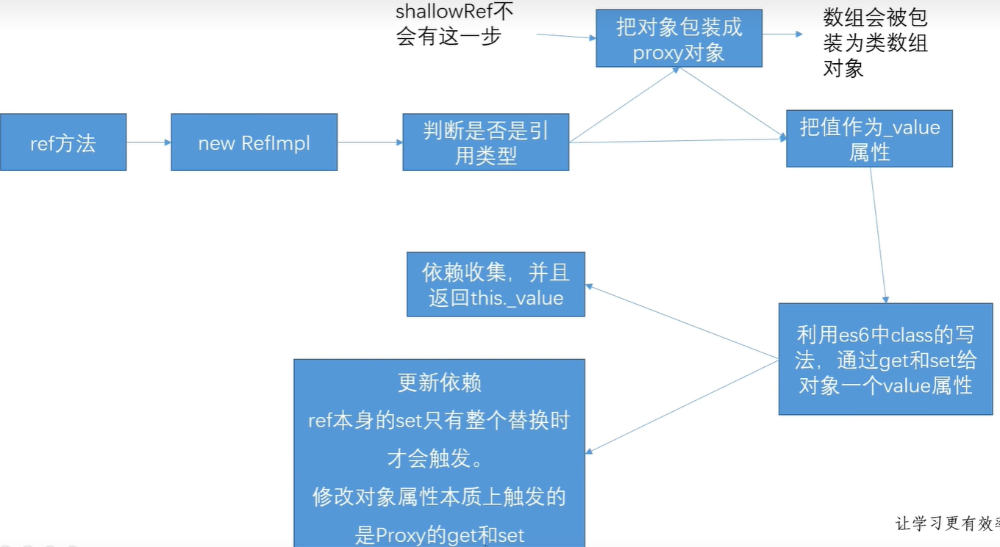
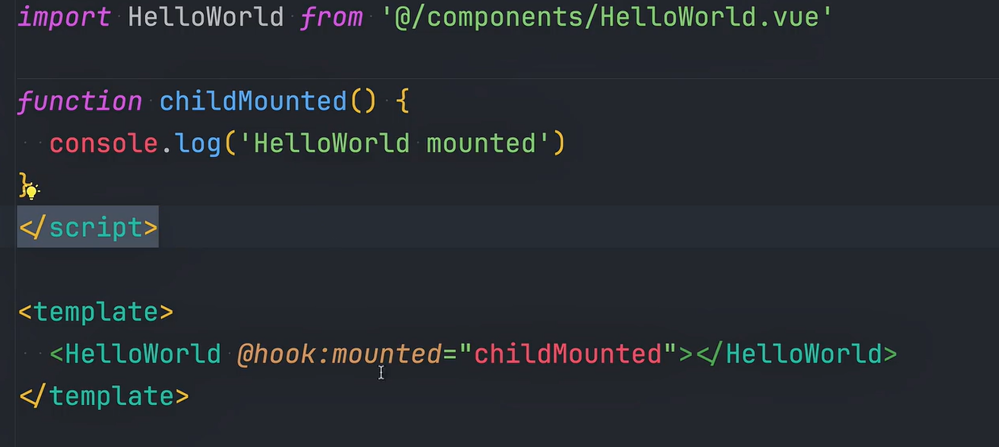

## computed原理

在Vue.js中，`computed`属性（计算属性）提供了一种声明式的方法来基于其依赖数据来计算和缓存属性值。当依赖数据发生变化时，`computed`属性会自动更新。其设计思想是提高性能，通过在依赖没有发生变化时避免不必要的计算。

### Vue.js `computed` 属性的原理

理解Vue.js `computed`属性的原理需要从以下几个方面来看：

1. **依赖追踪**
2. **缓存机制**
3. **响应式更新**

#### 1. 依赖追踪

Vue.js 使用依赖追踪的方式来实现响应式数据绑定。当你在定义一个`computed`属性时，Vue 会在首次访问时执行这个函数，并记录这个函数内部所依赖的响应式数据。

```javascript
new Vue({
  data() {
    return {
      firstName: 'John',
      lastName: 'Doe'
    }
  },
  computed: {
    fullName() {
      return this.firstName + ' ' + this.lastName;
    }
  }
});
```

首次访问`fullName`时，Vue会执行`fullName`函数，记录其依赖的`firstName`和`lastName`。

#### 2. 缓存机制

一旦`computed`属性的依赖数据没有变更，Vue会缓存上次计算的结果，避免重复计算。这就是`computed`属性比`methods`更高效的原因。

缓存的实现是通过getter和setter来完成的。当依赖的数据变更时，Vue会使缓存失效，并在下次访问`computed`属性时重新计算。

计算属性的缓存机制是通过内部的**Watcher**实现的，一个`computed`属性对应一个Watcher实例。Watcher会订阅其依赖的数据，当这些数据发生变化时，会通知Watcher刷新缓存。

#### 3. 响应式更新

当依赖的数据发生变化时，视图部分会被自动更新。这是通过Vue的响应式系统实现的。Vue会为所有响应式的数据添加getter和setter，内部使用Dep（Dependency，依赖）来管理依赖关系。

具体流程如下：

1. **首次访问**：
    - 第一次读取`computed`属性时，Vue会创建一个Watcher实例，并进行依赖收集。
    - 在计算期间，所有访问到的响应式数据都会记录在Watcher的依赖列表中。

2. **依赖数据更新**：
    - 当依赖的数据发生变化时，这些数据的setter会通知Watcher，标记该计算属性为“需要重新计算”。
    - 缓存会被置为无效状态。

3. **重新访问**：
    - 再次读取该`computed`属性时，如果缓存无效，Vue会重新计算属性值并更新缓存。

### 例子及解析

以下是一个例子，以及关键的原理解析：

```javascript
new Vue({
  el: '#app',
  data() {
    return {
      num1: 1,
      num2: 2
    }
  },
  computed: {
    sum() {
      console.log('computed sum');
      return this.num1 + this.num2;
    }
  }
});
```

- **首次访问`sum`**：
    - Vue创建一个`sum`的Watcher。
    - 访问`sum`时，会调用`sum`函数并记录依赖`num1`和`num2`。
    - `sum`计算结果被缓存。

- **依赖数据更新**：
    - 当`num1`或`num2`发生变化时，会触发它们的setter。
    - setter通知`sum`的Watcher，使其缓存无效。

- **重新访问`sum`**：
    - 由于缓存无效，重新计算`sum`，并更新缓存。

### 总结

- **依赖追踪**使得`computed`属性能绑定在响应式数据上。
- **缓存机制**确保了在数据未变化是缓存结果，避免不必要的计算。
- **响应式更新**利用Vue的响应式系统，实现数据变化时自动更新视图。

## Watch和Computed的区别

`Watch` 和 `Computed` 是 Vue.js 中两个非常重要和强大的特性，用于处理响应式数据。但它们在使用场景和功能上有明显的区别。以下是对它们的详细深入讲解：

### Computed（计算属性）

#### 概念
`Computed` 属性是基于依赖性的缓存属性。在 Vue.js 中，`Computed` 属性是用来计算值的，并且只有当其依赖的属性发生变化时，它才会重新计算。

#### 特性
- **缓存**：`Computed` 属性的结果是基于它的依赖缓存起来的，只有当依赖发生变化时才重新计算。这使得多次访问同一个 `Computed` 属性的开销较低，因为它不会每次都重新计算。
- **依赖追踪**：`Computed` 属性会自动追踪它所依赖的属性，当这些依赖属性的值变化时，`Computed` 属性会被标记为需要重新计算。
  
#### 适用场景
`Computed` 属性通常用于需要根据现有数据动态生成相应数据，并且希望这些生成的数据能够自动更新以响应其依赖数据的变化。常见的场景包括：
- 处理复杂的逻辑来生成新的数据。
- 通过组合或处理多个响应式属性生成一个新的属性。

#### 示例
```javascript
new Vue({
  el: '#app',
  data: {
    firstName: 'John',
    lastName: 'Doe'
  },
  computed: {
    fullName: function() {
      return this.firstName + ' ' + this.lastName;
    }
  }
});
```

在这个例子中，当 `firstName` 或 `lastName` 变化时，`fullName` 会自动更新，并且在连续访问 `fullName` 时，它会从缓存中取值。

### Watch（侦听器）

#### 概念
`Watch` 侦听器允许我们在响应式数据变化时执行特定的操作。它能够对单个数据属性的变化进行监听，并在数据变化时执行回调函数。

#### 特性
- **异步操作**：`Watch` 更加适合进行异步操作，例如在数据变化时向后端发送请求。
- **复杂逻辑**：`Watch` 也适用于当数据变化时需要执行复杂的逻辑操作的情况。

#### 适用场景
`Watch` 更适用于需要在数据变化时执行某些副作用操作的情况，例如：
- 异步数据请求。
- 当一个数据变化时引发一系列复杂操作。
- 对某些属性进行深度监听（deep watch）以监听对象内部的变化。

#### 示例
```javascript
new Vue({
  el: '#app',
  data: {
    amount: 0
  },
  watch: {
    amount: function(newAmount, oldAmount) {
      console.log(`Amount changed from ${oldAmount} to ${newAmount}`);
      // 进行其他复杂操作，例如发送请求
    }
  }
});
```

在这个例子中，每当 `amount` 变化时，都会触发 `watch` 侦听器，并执行回调函数中的逻辑。

### 总结

- **功能**：
  - `Computed`：用于计算和返回值，具备缓存特性。
  - `Watch`：用于侦听数据变化并执行回调函数。

- **适用场景**：
  - `Computed`：生成基于多个属性的值，通常用在需要对数据进行简单处理和合成的情况。
  - `Watch`：需要在数据变化时执行异步操作或复杂逻辑。

- **特性**：
  - `Computed`：依赖缓存，性能更高。
  - `Watch`：支持异步操作，适合处理副作用。

具体选择哪一个，要根据实际的需求来决定。理解这两者的区别和各自的应用场景，能够帮助我们更高效地开发 Vue.js 应用。

## 了解webpack和vite吗

Webpack 和 Vite 都是用于前端开发的构建工具，但它们在设计理念、工作机制以及适用场景上有显著的区别。以下是对它们的详细深入讲解：

### Webpack

#### 概念
Webpack 是一个现代 JavaScript 应用程序的静态模块打包器，当 Webpack 处理应用程序时，它会从入口点递归地构建依赖图(dependency graph)，包含应用程序需要的每一个模块，然后将这些模块打包成一个或多个 bundle。

#### 特性
1. **模块打包**: 将各种类型的资源（JavaScript、CSS、图片等）视为模块来处理，可以通过不同的 loader 来处理这些不同类型的模块。
2. **代码拆分**: 支持代码拆分(Code Splitting)，通过 SplitChunksPlugin 在多个 bundle 之间共享相同的代码。
3. **插件机制**: 拥有丰富的插件系统，可以在构建过程中执行各种任务，如热替换、压缩、优化等。
4. **Tree Shaking**: 通过静态分析模块之间的依赖关系，删除未使用的代码，从而减小打包后的文件大小。
5. **热模块替换（HMR）**: 在开发过程中无需刷新页面即加载最新的模块，提升开发效率。

#### 适用场景
Webpack 通常用于需要复杂配置和打包逻辑的大型项目。它在处理复杂的依赖关系、需要高定制化、需要多种优化策略的项目中表现优秀。

#### 示例配置
一个简单的 Webpack 配置文件可能如下：
```javascript
const path = require('path');

module.exports = {
  entry: './src/index.js',  // 入口文件
  output: {
    filename: 'bundle.js',  // 输出文件名
    path: path.resolve(__dirname, 'dist')  // 输出路径
  },
  module: {
    rules: [  // 模块加载规则
      {
        test: /\.css$/,
        use: ['style-loader', 'css-loader']
      },
      {
        test: /\.(png|svg|jpg|jpeg|gif)$/i,
        type: 'asset/resource'
      }
    ]
  },
  plugins: [
    new HtmlWebpackPlugin({
      title: 'My App',
      template: './src/index.html'
    })
  ],
  devServer: {
    contentBase: './dist',
    hot: true
  }
};
```

### Vite

#### 概念
Vite 是一个新型前端构建工具，主要由 Vue.js 的创建者尤雨溪开发。与传统的构建工具相比，Vite 利用现代浏览器原生支持的 ES 模块（ESM）特性以及构建工具的改进以提升开发体验和构建速度。

#### 特性
1. **极速启动**: 利用浏览器原生的 ES 模块支持在开发时直接加载未打包的模块，而无需预先打包，提高开发启动速度。
2. **即时热更新**: 使用 HMR（热模块替换）实现即时更新，修改代码后可立即在浏览器中看到更新效果。
3. **高效构建**: 生产环境下，Vite 使用 Rollup 打包工具进行高效构建，同时支持 Tree Shaking 和代码拆分等优化。
4. **现代特性支持**: 开箱即用支持 TypeScript, JSX, CSS 模块等现代前端开发特性。

#### 适用场景
Vite 非常适合中小型项目、新创项目以及追求快速开发体验的项目。它也非常适合使用 Vue.js 和 React 的开发者，因其对这些框架提供了一流的支持。

#### 示例配置
一个简单的 Vite 项目配置文件通常如下：
```javascript
// vite.config.js
import { defineConfig } from 'vite'
import vue from '@vitejs/plugin-vue'

export default defineConfig({
  plugins: [vue()],
  server: {
    open: true,  // 开发服务器启动时自动在浏览器中打开
    port: 3000   // 制定开发服务器端口
  },
  build: {
    outDir: 'dist',  // 生产环境构建输出目录
    sourcemap: true  // 是否生成 sourcemap 文件
  }
})
```

### 对比总结

#### 构建速度
- **Webpack**: 构建速度较慢，特别是在大型项目中，初次打包时间较长。
- **Vite**: 构建速度非常快，利用 ES 模块特性来提升开发时的启动速度和更新速度。

#### 热更新
- **Webpack**: 需要依赖 Webpack Dev Server 和 HMR 插件，配置相对复杂。
- **Vite**: 内置高效的 HMR，开箱即用，而且响应速度更快。

#### 配置简便性
- **Webpack**: 配置相对复杂，需要配置 loaders 和 plugins 来处理各种类型的文件。
- **Vite**: 配置相对简洁，主要通过插件来扩展功能，许多常用功能默认即支持。

#### 生产构建
- **Webpack**: 功能强大，适合复杂的打包需求，有多种优化策略，例如代码拆分、Tree Shaking、缓存等。
- **Vite**: 使用 Rollup 进行生产环境构建，适合中小型项目，构建速度快，内置优化策略。

#### 社区和生态
- **Webpack**: 社区成熟，生态系统广泛，支持各种插件和 loader，几乎可以应对所有前端构建需求。
- **Vite**: 生态系统正在快速发展，社区活跃，尤其在 Vue.js 和 React 开发者中受到欢迎。

### 总结

- **Webpack**: 更适合需要高定制化、复杂配置和优化的大型项目，以及需要处理复杂依赖关系的应用。
- **Vite**: 更适合中小型项目、新创项目以及开发体验要求高的应用，提供极速开发和构建体验。

理解 Webpack 和 Vite 的各自特性和适用场景，可以帮助你在不同项目中做出最佳选择。

## 为什么data属性是一个函数而不是一个对象


- 根实例对象`data`可以是对象也可以是函数（根实例是单例），不会产生数据污染情况

- 组件实例对象`data`必须为函数，目的是为了`防止多个组件实例对象之间共用`一个`data`，产生`数据污染`。采用函数的形式，`initData`时会将其作为`工厂函数都会返回全`新`data`对象

- `vue`组件可能会有很多个实例，采用函数返回一个全新`data`形式，使每个实例对象的数据不会受到其他实例对象数据的污染

- 当`data`是一个对象时，这个对象直接作为根组件的状态，并且在全局范围内只有一份该状态的拷贝。由于不存在复用根实例的情况，所以不同组件之间不会因为引用同一个`data`对象而导致数据污染。

- 而当`data`是一个函数时，Vue.js会调用这个函数来获取初始数据对象，这样每次创建新的组件实例时（对于非根实例而言），都会通过调用函数得到一个新的数据对象副本，确保各个组件实例的数据隔离

- 根实例作为整个应用的顶级组件，其`data`属性既可以是对象也可以是函数，这是因为根实例在整个应用中只有一个实例，即它是单例模式。由于根实例在整个应用程序中是独一无二的，因此不会存在多个根实例之间的数据共享问题。

- 在我们定义好一个组件的时候，`vue`最终都会通过`Vue.extend()`构成组件实例

  这里我们模仿组件构造函数，定义`data`属性，采用对象的形式

## `v-for`与`v-if`一同使用在vue2和vue3中的区别

在 Vue 2 和 Vue 3 中，`v-for` 和 `v-if` 一同使用时确实存在一些重要的区别。让我们详细探讨这些差异：

Vue 2:

1. 优先级：
   - 在 Vue 2 中，当 `v-for` 和 `v-if` 同时出现在一个元素上时，`v-for` 的优先级高于 `v-if`。

2. 执行顺序：
   - Vue 2 会先执行 `v-for` 循环，然后对每个生成的元素执行 `v-if` 条件。

3. 性能影响：
   - 这种方式可能导致性能问题，因为即使最终不渲染，也会为每个元素执行 `v-if` 检查。

4. 示例代码：
   ```html
   <ul>
     <li v-for="user in users" v-if="user.isActive">
       {{ user.name }}
     </li>
   </ul>
   ```

5. 推荐做法：
   - Vue 2 官方文档建议避免在同一元素上同时使用 `v-for` 和 `v-if`。
   - 推荐使用计算属性来预先过滤列表，或者将 `v-if` 移到外层元素。

Vue 3:

1. 优先级：
   - 在 Vue 3 中，`v-if` 的优先级高于 `v-for`。

2. 执行顺序：
   - Vue 3 会先执行 `v-if` 条件，只有当条件为真时才会执行 `v-for`。

3. 性能影响：
   - 这种改变通常会带来性能提升，因为它避免了对不需要渲染的元素执行不必要的循环。

4. 示例代码：
   ```html
   <ul>
     <li v-for="user in users" v-if="user.isActive">
       {{ user.name }}
     </li>
   </ul>
   ```
   在 Vue 3 中，这段代码的行为类似于：
   ```html
   <ul>
     <template v-if="user.isActive">
       <li v-for="user in users">
         {{ user.name }}
       </li>
     </template>
   </ul>
   ```

5. 使用建议：
   - 尽管 Vue 3 改变了优先级，但仍然建议避免在同一元素上同时使用 `v-for` 和 `v-if`。
   - 对于复杂的条件渲染和列表渲染，使用计算属性或方法来处理逻辑仍然是更清晰和可维护的做法。

总结：
- Vue 2 中 `v-for` 优先级高于 `v-if`，可能导致性能问题。
- Vue 3 中 `v-if` 优先级高于 `v-for`，通常能提高性能。
- 无论是 Vue 2 还是 Vue 3，最佳实践都是避免在同一元素上同时使用这两个指令，而是通过计算属性或将逻辑分离到不同层级来处理。

这种变化反映了 Vue 团队对性能优化的持续关注，以及他们如何在新版本中改进框架的行为以提供更好的默认性能。

## 动态给vue的data添加一个新的属性时会发生什么？怎样解决？

在Vue 2中，Vue的响应式系统是基于`Object.defineProperty`实现的，这导致了一个限制：当你动态向`data`对象添加一个新的根级属性时，这个属性将不会是响应式的。这是因为`Object.defineProperty`只能为对象已经存在的属性定义getter和setter，动态添加的属性不会被Vue所侦听。

### 问题描述

假设你在一个Vue实例中有如下代码：

```javascript
new Vue({
  data: {
    myData: {}
  }
});
```

如果你想动态添加一个新的属性，比如说：

```javascript
this.myData.newProperty = '新值';
```

在Vue 2中，这个新属性`newProperty`是非响应式的。也就是说，如果在模板中使用它，UI不会自动更新。

### 解决方案

为了确保新添加的属性是响应式的，Vue 2中提供了`Vue.set`方法，以及`this.$set`实例方法，用于向对象中添加新属性，并保证其响应性。

```javascript
// 使用Vue.set
Vue.set(this.myData, 'newProperty', '新值');

// 或者使用 this.$set
this.$set(this.myData, 'newProperty', '新值');
```

这两种方法会为新属性创建getter和setter，从而启用 Vue 的响应式系统。

### 在Vue 3中的变化

在Vue 3中，响应式系统的底层实现基于Proxy，这使得该问题得到了很好的解决。Proxy可以直接监听对象上所有的动态变化，因此在Vue 3中，你可以直接向`data`对象添加属性，且这些属性自然是响应式的。

举例来说，在Vue 3中，你可以直接使用：

```javascript
this.myData.newProperty = '新值';
```

Vue 3会自动处理这个新属性的响应式，使得UI会根据此变化而更新。

### 结论

- 在Vue 2中，当需要动态地向`data`添加新的根级属性时，使用`Vue.set`或`this.$set`。
- 在Vue 3中，直接添加属性就可以，因为Proxy支持使得这一过程变得无缝且自动。

无论使用哪个版本的Vue，了解响应式系统的工作原理有助于做出最优的设计决策。

## vue2重写了哪些数组方法

在Vue 2中，为了使数组能响应式地更新，Vue重写（拦截）了一部分数组的原型方法。这些方法主要涉及直接修改数组内容的方法，包括：

1. `push()`
2. `pop()`
3. `shift()`
4. `unshift()`
5. `splice()`
6. `sort()`
7. `reverse()`

### 数组方法的重写

这些方法被重写为能够在修改数组后通知观察者（watchers）进行界面更新。这是通过以下几步实现的：

1. **获取数组原型**：
   Vue首先保存了原始数组原型对象，通常为`Array.prototype`。

2. **创建一个新的原型对象**：
   新的原型对象`arrayMethods`继承自原始的数组原型对象，通过`Object.create(Array.prototype)`实现。这允许Vue重写某些方法而不影响原始原型。

3. **重写方法**：
   对于每个需要劫持的方法，Vue定义一个新的方法来替代。这些重写的方法在调用完原始的数组方法后，还会额外执行响应式更新逻辑，比如：

    ```javascript
    const arrayProto = Array.prototype;
    const arrayMethods = Object.create(arrayProto);
   
    const methodsToPatch = [
      'push',
      'pop',
      'shift',
      'unshift',
      'splice',
      'sort',
      'reverse'
    ];
   
    methodsToPatch.forEach(function (method) {
      const original = arrayProto[method];
      Object.defineProperty(arrayMethods, method, {
        value: function mutator(...args) {
          const result = original.apply(this, args);
          const ob = this.__ob__;
          let inserted;
          switch (method) {
            case 'push':
            case 'unshift':
              inserted = args;
              break;
            case 'splice':
              inserted = args.slice(2);
              break;
          }
          if (inserted) ob.observeArray(inserted);
          ob.dep.notify();
          return result;
        },
        enumerable: false,
        writable: true,
        configurable: true
      });
    });
    ```

在以上代码中，可以看到`mutator`函数首先调用原始的方法，然后进行必要的观察，并通过`ob.dep.notify()`通知依赖进行更新。

### `Vue.set`实现机制

`Vue.set`（或`this.$set`）是用于向对象或数组添加新的属性以确保其响应性的一种方式。它的实现逻辑可以概括如下：

1. **对象处理**：
   - 如果目标是对象且目标属性还不存在，使用`Object.defineProperty`为该属性设置getter和setter以追踪变化。
   - 更新依赖（通过观察者通知，`dep.notify()`）以更新视图。

2. **数组处理**：
   - 如果目标是数组，并且属性号是一个有效的数组索引，使用数组的splice方法来触发更新。这是因为在数组中使用splice能够被Vue的数组方法劫持所捕捉，从而自动触发响应式更新。

具体实现的简化版本如下：

```javascript
function set(target, key, val) {
  if (Array.isArray(target) && typeof key === 'number') {
    target.splice(key, 1, val);
    return val;
  }
  if (key in target && !(key in Object.prototype)) {
    target[key] = val;
    return val;
  }
  const ob = target.__ob__;
  if (!ob) {
    target[key] = val;
    return val;
  }
  defineReactive(ob.value, key, val);
  ob.dep.notify();
  return val;
}
```

### 总结

- Vue 2通过劫持数组修改方法来确保修改后的数组是响应式的。
- `Vue.set`提供了一种为对象添加新属性的功能，同时也通过重用现有的劫持机制以确保新属性的响应性。
- 这些机制是Vue响应式系统的重要组成部分，通过这些方法，Vue能有效感知数据变化并自动更新视图。

## Vue中组件和插件有什么区别

Vue组件和插件是Vue.js框架中两种不同的扩展机制，它们用于不同的目的并以不同的方式实现和使用。下面详细对比和分析组件和插件的区别。

### Vue组件

#### 定义与作用

- **组件**是Vue应用的一个核心概念，旨在实现视图的复用，是一个拥有独立视图和逻辑的一部分UI模块。
- 组件可以是简单的，展示数据和内容的元素，也可以是复杂的，包含逻辑和交互的整个视图。
- Vue组件有状态，并可以包含自己的模板、数据、方法、生命周期钩子等。

#### 实现与使用

- **定义**：组件通常在Vue应用中通过`Vue.component`全局注册或局部注册在某个Vue实例中。
  
  ```javascript
  // 全局注册
  Vue.component('my-component', {
    template: '<div>A custom component!</div>'
  });
  ```

- **组成部分**：典型的Vue组件包括：
  - `template`：定义组件的HTML结构。
  - `script`：定义组件的逻辑，如数据和方法。
  - `style`：定义组件的CSS样式。

- **通信**：组件之间通过`props`和`events`进行通信，父组件通过`props`向子组件传递数据，子组件通过事件向父组件发送消息。

#### 生命周期

- 组件具有完整的生命周期，从创建、更新到销毁，与之对应有各自的生命周期钩子如`created`、`mounted`、`updated`、`destroyed`等。

### Vue插件

#### 定义与作用

- **插件**是用于为Vue应用添加全局功能的机制。
- 插件可以为Vue添加全局方法或资源，注入选项，添加全局指令、过滤器，以及混入等。
- 插件的目的是扩展Vue自身，增强其功能，以在应用中实现更复杂的场景和要求。

#### 实现与使用

- **定义**：插件通常是一个有`install`方法的对象，该方法接受Vue构造函数为第一个参数。

  ```javascript
  MyPlugin.install = function (Vue, options) {
    // 添加全局方法或属性
    Vue.myGlobalMethod = function () {}

    // 添加全局资源，如指令，过滤器等
    Vue.directive('my-directive', {})

    // 通过注入组件选项, 扩展组件功能
    Vue.mixin({})

    // 更多...
  };
  ```

- **使用**：插件可以在Vue应用初始化前通过`Vue.use()`方法注册。

  ```javascript
  Vue.use(MyPlugin);
  ```

#### 应用场景

- 插件适用于那些需要在多个Vue实例或整个应用范围内共享的功能，比如路由（Vue Router）、状态管理（Vuex）、国际化（Vue I18n）等。

### 主要区别

1. **目标与目的**：
   - 组件的主要目标是结构化、模块化地构建UI。
   - 插件的主要目标是扩展Vue的功能和提供全局级的特性。

2. **作用范围**：
   - 组件作用于特定的部分UI。
   - 插件通常作用于整个Vue应用程序。

3. **实现方式**：
   - 组件通过`Vue.component`或局部注册定义。
   - 插件通过`install`方法和`Vue.use()`注册。

4. **使用途径**：
   - 组件多用于实现视图和逻辑。
   - 插件多用于提供全局功能和资源。

### 总结

Vue组件和插件各自解决不同的问题。在开发Vue应用时，视情况选择合适的扩展方式，组件负责UI模块化，而插件则用于扩展框架功能，全局增强应用。两者的结合使用使得Vue.js能够支持复杂的应用场景，保持代码的简洁和组织性。

## Vue的双向数据绑定怎么实现的

### Vue的双向数据绑定

Vue 的双向数据绑定是其响应式系统中的核心概念之一。它允许开发者在视图与数据模型之间实现自动同步，简化了数据处理的工作。Vue 使用了多种技术来实现这一功能，具体实现方式因 Vue 版本不同而有所差异。

以下内容分为 Vue 2 和 Vue 3 两个主要版本进行解释，并深入探讨其实现原理。

### Vue 2 中的双向数据绑定

#### 核心技术

1. **Object.defineProperty**:
   - Vue 2 使用 `Object.defineProperty` 方法来劫持对象属性的访问和赋值操作，为每个属性添加 getter 和 setter。

2. **Watcher**:
   - 收集数据依赖（订阅），当数据变更时通知相关依赖更新（发布）。

3. **Dep**:
   - 一个依赖管理器，处理依赖关系和触发更新。

#### 实现原理

1. **初始化数据，并将数据转换为响应式**。

通过遍历 `data` 对象的属性，使用 `Object.defineProperty` 为每个属性添加 getter 和 setter。

```javascript
function defineReactive(obj, key, value) {
  const dep = new Dep();

  Object.defineProperty(obj, key, {
    get() {
      if (Dep.target) {
        dep.depend();
      }
      return value;
    },
    set(newValue) {
      value = newValue;
      dep.notify();
    }
  });
}

function observe(data) {
  if (!data || typeof data !== 'object') {
    return;
  }
  
  Object.keys(data).forEach(key => {
    defineReactive(data, key, data[key]);
  });
}

class Dep {
  constructor() {
    this.subs = [];
  }

  addSub(sub) {
    this.subs.push(sub);
  }

  depend() {
    if (Dep.target) {
      Dep.target.addDep(this);
    }
  }

  notify() {
    this.subs.forEach(sub => sub.update());
  }
}

Dep.target = null;

class Watcher {
  constructor(vm, expOrFn, cb) {
    this.vm = vm;
    this.cb = cb;
    this.expOrFn = expOrFn;
    this.depIds = {};

    this.getter = parsePath(expOrFn);
    this.value = this.get();
  }

  get() {
    Dep.target = this;
    let value = this.getter.call(this.vm, this.vm);
    Dep.target = null;
    return value;
  }

  addDep(dep) {
    if (!this.depIds.hasOwnProperty(dep.id)) {
      dep.addSub(this);
      this.depIds[dep.id] = dep;
    }
  }

  update() {
    const value = this.get();
    if (this.value !== value) {
      this.value = value;
      this.cb.call(this.vm, value);
    }
  }
}

function parsePath(path) {
  const segments = path.split('.');
  return function(obj) {
    for (let i = 0; i < segments.length; i++) {
      if (!obj) return;
      obj = obj[segments[i]];
    }
    return obj;
  }
}
```

2. **模板编译**：

Vue 将模板编译为渲染函数，在渲染过程中触发数据的 getter，以便收集依赖。

```javascript
// 简单的编译过程示例 (实际编译过程更复杂)
function compile(template) {
  // 简单示例：将模板编译为渲染函数
  return function render() {
    let innerHTML = '';
    // 遍历模板并生成 HTML
    // 如果遇到插值 {{ message }}，替换为当前组件实例的 data 中的 message 的值
    innerHTML = template.replace(/\{\{(.+?)\}\}/g, (match, p1) => {
      const value = this[p1.trim()];
      new Watcher(this, p1.trim(), () => {
        // 触发重新渲染
        this.$forceUpdate();
      });
      return value;
    });
    return innerHTML;
  }
}
```

3. **视图更新**：

当数据发生变化时，触发 setter，通知依赖更新。依赖更新会调用 Watcher 的 `update` 方法，最终触发视图重新渲染。

```javascript
class Vue {
  constructor(options) {
    this._data = options.data;

    // 将 data 转换为响应式
    observe(this._data);

    // 创建 render 函数
    this.render = compile(options.template).bind(this._data);

    // 初次渲染
    this.$mount(options.el);
  }

  $mount(el) {
    this.$el = document.querySelector(el);
    this.$forceUpdate();
  }

  $forceUpdate() {
    this.$el.innerHTML = this.render();
  }
}
```

### Vue 3 中的双向数据绑定

#### 核心技术

1. **Proxy**:
   - Vue 3 使用 `Proxy` 对象来替代 `Object.defineProperty`，从而可以直接劫持整个对象，而不仅仅是某个属性。

2. **Reactive 和 Ref**：
   - 使用 `reactive` 和 `ref` 创建响应式对象和单独的响应式值。

3. **Effect 和 Track/Trigger**：
   - 用于收集依赖和触发更新。

#### 实现原理

1. **创建响应式对象**：

利用 `Proxy` 实现响应式对象。

```javascript
function reactive(target) {
  return new Proxy(target, {
    get(target, key, receiver) {
      const result = Reflect.get(target, key, receiver);
      // 收集依赖
      track(target, key);
      return result;
    },
    set(target, key, value, receiver) {
      const oldValue = target[key];
      const result = Reflect.set(target, key, value, receiver);
      if (oldValue !== value) {
        // 触发更新
        trigger(target, key);
      }
      return result;
    }
  });
}

const targetMap = new WeakMap();
let activeEffect;

function track(target, key) {
  if (activeEffect) {
    let depsMap = targetMap.get(target);
    if (!depsMap) {
      targetMap.set(target, (depsMap = new Map()));
    }
    let dep = depsMap.get(key);
    if (!dep) {
      depsMap.set(key, (dep = new Set()));
    }
    dep.add(activeEffect);
  }
}

function trigger(target, key) {
  const depsMap = targetMap.get(target);
  if (depsMap) {
    const deps = depsMap.get(key);
    if (deps) {
      deps.forEach(effect => {
        effect();
      });
    }
  }
}

function effect(fn) {
  const effectFn = () => {
    activeEffect = effectFn;
    fn();
    activeEffect = null;
  }
  effectFn();
}
```

2. **watchEffect**：

Vue 3 提供了 `watchEffect` 来处理副作用，并进行依赖追踪。

```javascript
const state = reactive({ count: 0 });

watchEffect(() => {
  console.log(`Count is: ${state.count}`);
});

state.count++;
```

3. **结合 Vue 渲染函数**：

使用响应式对象实现视图自动更新。

```javascript
const { reactive, effect } = VueReactivity;

const state = reactive({
  message: 'Hello Vue 3!'
});

effect(() => {
  document.querySelector('#app').innerHTML = state.message;
});

// 改变数据，视图会自动更新
state.message = 'Hello World!';
```

### 区别与总结

- **Vue 2**：
  - 使用 `Object.defineProperty`。
  - 每个属性都需要单独处理 getter 和 setter。
  - 响应式系统较为复杂，需要手动处理数组、对象的处理。
  
- **Vue 3**：
  - 使用 `Proxy`，可以简化整个对象的响应式处理。
  - 更加高效和灵活，适用于更复杂的数据结构。
  - 新增组合式 API，使得逻辑更集中更易维护。

Vue 的双向数据绑定使得开发者可以专注于业务逻辑而无需关心 DOM 操作。Vue 3 的响应式系统进一步优化了性能和开发体验，使得开发更加简便和高效。了解这些实现原理有助于更深入地理解 Vue 的核心机制，更好地使用它进行开发。

## 组件通信

在 Vue.js 中，组件通信是一个非常重要且常见的需求，尤其是在构建大型应用时。Vue 提供了多种方式来实现组件之间的数据和事件通信。以下是详细介绍 Vue 中常见的组件通信方式包括：

1. **Props 和 $emit**
2. **自定义事件**
3. **事件总线 (Event Bus)**
4. **Vuex**
5. **$parent 和 $children**
6. **Provide 和 Inject**
7. **Ref 引用**
8. **Slot 插槽**

### 1. Props 和 $emit

#### Props

`Props` 是父组件向子组件传递数据的基本方式。子组件通过 `props` 选项声明它期望接收的属性。

示例：

**ParentComponent.vue**
```vue
<template>
  <child-component :message="parentMessage"></child-component>
</template>

<script>
import ChildComponent from './ChildComponent.vue';

export default {
  components: {
    ChildComponent
  },
  data() {
    return {
      parentMessage: "Hello from parent"
    }
  }
}
</script>
```

**ChildComponent.vue**
```vue
<template>
  <div>{{ message }}</div>
</template>

<script>
export default {
  props: {
    message: String
  }
}
</script>
```

#### $emit

子组件通过 `$emit` 向父组件发送事件和数据。

示例：

**ParentComponent.vue**
```vue
<template>
  <child-component @message-event="handleMessageEvent"></child-component>
</template>

<script>
import ChildComponent from './ChildComponent.vue';

export default {
  components: {
    ChildComponent
  },
  methods: {
    handleMessageEvent(message) {
      console.log(message);
    }
  }
}
</script>
```

**ChildComponent.vue**
```vue
<template>
  <button @click="sendMessage">Send Message</button>
</template>

<script>
export default {
  methods: {
    sendMessage() {
      this.$emit('message-event', 'Hello from child');
    }
  }
}
</script>
```

### 2. 自定义事件

除了使用 `props` 和 `$emit`，还可以在父组件和子组件之间创建自定义事件来处理更复杂的通信需求。

示例：

**ParentComponent.vue**
```vue
<template>
  <child-component></child-component>
</template>

<script>
import Vue from 'vue';
import ChildComponent from './ChildComponent.vue';

export const eventBus = new Vue();

export default {
  components: {
    ChildComponent
  },
  created() {
    eventBus.$on('custom-event', this.handleCustomEvent);
  },
  beforeDestroy() {
    eventBus.$off('custom-event', this.handleCustomEvent);
  },
  methods: {
    handleCustomEvent(data) {
      console.log(data);
    }
  }
}
</script>
```

**ChildComponent.vue**
```vue
<template>
  <button @click="triggerCustomEvent">Trigger Event</button>
</template>

<script>
import { eventBus } from './ParentComponent.vue';

export default {
  methods: {
    triggerCustomEvent() {
      eventBus.$emit('custom-event', 'Hello from child');
    }
  }
}
</script>
```

### 3. 事件总线 (Event Bus)

事件总线是一种简单的发布/订阅模式，可以用于兄弟组件之间的通信。尽管 Vue 3 中不再推荐这种做法，但它在 Vue 2 中仍然较为常见。

示例：

**EventBus.js**
```javascript
import Vue from 'vue';
export const EventBus = new Vue();
```

**ComponentA.vue**
```vue
<template>
  <button @click="sendMessage">Send Message</button>
</template>

<script>
import { EventBus } from './EventBus';

export default {
  methods: {
    sendMessage() {
      EventBus.$emit('message', 'Hello from ComponentA');
    }
  }
}
</script>
```

**ComponentB.vue**
```vue
<template>
  <div>{{ message }}</div>
</template>

<script>
import { EventBus } from './EventBus';

export default {
  data() {
    return {
      message: ''
    }
  },
  created() {
    EventBus.$on('message', (data) => {
      this.message = data;
    });
  },
  beforeDestroy() {
    EventBus.$off('message');
  }
}
</script>
```

### 4. Vuex

Vuex 是 Vue.js 的状态管理模式。它实现了一个集中式存储，可以在整个应用中共享状态，是解决复杂数据流和组件通信的高级工具。

示例：

**store.js**
```javascript
import Vue from 'vue';
import Vuex from 'vuex';

Vue.use(Vuex);

export default new Vuex.Store({
  state: {
    message: ''
  },
  mutations: {
    setMessage(state, message) {
      state.message = message;
    }
  },
  actions: {
    updateMessage({ commit }, message) {
      commit('setMessage', message);
    }
  },
  getters: {
    message: state => state.message
  }
});
```

**ComponentA.vue**
```vue
<template>
  <button @click="sendMessage">Send Message</button>
</template>

<script>
import { mapActions } from 'vuex';

export default {
  methods: {
    ...mapActions(['updateMessage']),
    sendMessage() {
      this.updateMessage('Hello from ComponentA');
    }
  }
}
</script>
```

**ComponentB.vue**
```vue
<template>
  <div>{{ message }}</div>
</template>

<script>
import { mapGetters } from 'vuex';

export default {
  computed: {
    ...mapGetters(['message'])
  }
}
</script>
```

### 5. $parent 和 $children

`$parent` 和 `$children` 可以在组件实例间直接访问父组件或子组件实例。尽管这种方式可以快速访问层次结构中的其他组件，但并不推荐广泛使用，因为它会使组件之间紧密耦合，难以维护。

示例：

**ParentComponent.vue**
```vue
<template>
  <child-component></child-component>
</template>

<script>
import ChildComponent from './ChildComponent.vue';

export default {
  components: {
    ChildComponent
  },
  data() {
    return {
      parentMessage: "Hello from parent"
    }
  },
  methods: {
    receiveMessage(message) {
      console.log(message);
    }
  }
}
</script>
```

**ChildComponent.vue**
```vue
<template>
  <button @click="sendMessageToParent">Send Message to Parent</button>
</template>

<script>
export default {
  methods: {
    sendMessageToParent() {
      this.$parent.receiveMessage('Hello from child');
    }
  }
}
</script>
```

### 6. Provide 和 Inject

`Provide` 和 `Inject` 是在祖先组件与后代组件间共享数据的方式。祖先组件使用 `provide` 选项来提供数据，后代组件使用 `inject` 选项来注入数据。

示例：

**GrandParent.vue**
```vue
<template>
  <parent-component></parent-component>
</template>

<script>
import ParentComponent from './ParentComponent.vue';

export default {
  components: {
    ParentComponent
  },
  provide() {
    return {
      message: this.message
    };
  },
  data() {
    return {
      message: "Hello from grandparent"
    }
  }
}
</script>
```

**ChildComponent.vue**
```vue
<template>
  <div>{{ message }}</div>
</template>

<script>
export default {
  inject: ['message']
}
</script>
```

### 7. Ref 引用

`ref` 属性可以为子组件或 DOM 元素分配一个引用名称，然后通过 `$refs` 访问这些引用。

示例：

**ParentComponent.vue**
```vue
<template>
  <child-component ref="childComponent"></child-component>
  <button @click="callChildMethod">Call Child Method</button>
</template>

<script>
import ChildComponent from './ChildComponent.vue';

export default {
  components: {
    ChildComponent
  },
  methods: {
    callChildMethod() {
      this.$refs.childComponent.childMethod();
    }
  }
}
</script>
```

**ChildComponent.vue**
```vue
<template>
  <div>Child Component</div>
</template>

<script>
export default {
  methods: {
    childMethod() {
      console.log('Child method called');
    }
  }
}
</script>
```

### 8. Slot 插槽

插槽是一种在组件内容中使用占位符的方式，以便将外部内容传递到组件内部的特定位置。插槽可以实现动态内容传递，非常适合构建灵活的组件。

#### 基础插槽 (默认插槽)

示例：

**ParentComponent.vue**
```vue
<template>
  <child-component>
    <template #default>
      <p>This is slot content from parent</p>
    </template>
  </child-component>
</template>

<script>
import ChildComponent from './ChildComponent.vue';

export default {
  components: {
    ChildComponent
  }
}
</script>
```

**ChildComponent.vue**
```vue
<template>
  <div>
    <slot></slot>
  </div>
</template>

<script>
export default {
}
</script>
```

#### 具名插槽

父组件可以使用具名插槽将内容传递给子组件。

示例：

**ParentComponent.vue**
```vue
<template>
  <child-component>
    <template #header>
      <h1>Header from Parent</h1>
    </template>
    <template #footer>
      <p>Footer from Parent</p>
    </template>
  </child-component>
</template>

<script>
import ChildComponent from './ChildComponent.vue';

export default {
  components: {
    ChildComponent
  }
}
</script>
```

**ChildComponent.vue**
```vue
<template>
  <div>
    <slot name="header"></slot>
    <slot></slot> <!-- default slot -->
    <slot name="footer"></slot>
  </div>
</template>

<script>
export default {
}
</script>
```

#### 作用域插槽

父组件可以将数据传递到插槽中，使得子组件中的数据可以被父组件使用。

示例：

**ParentComponent.vue**
```vue
<template>
  <child-component>
    <template #default="slotProps">
      <p>{{ slotProps.message }}</p>
    </template>
  </child-component>
</template>

<script>
import ChildComponent from './ChildComponent.vue';

export default {
  components: {
    ChildComponent
  }
}
</script>
```

**ChildComponent.vue**
```vue
<template>
  <div>
    <slot :message="message"></slot>
  </div>
</template>

<script>
export default {
  data() {
    return {
      message: 'Hello from child'
    }
  }
}
</script>
```

### 总结

Vue 提供了多种灵活的组件通信方式，包括简单的 `props` 和 `$emit`，中级的 `事件总线` 和 `Provide/Inject`，以及高级的 `Vuex`。选择哪种方式取决于组件之间的层级关系和数据流复杂度。通过合理使用这些方法，可以实现高效、清晰、可维护的组件通信。

## Vue双向绑定的原理

### 什么是双向绑定

##### MVVM

- `数据变化后更新视图`
- `视图变化后更新数据`
- `数据层`（Model）：`应用的数据及业务逻辑`
- `视图层`（View）：`应用的展示效果`，`各类UI组件`
- 业务逻辑层（ViewModel）：`框架封装的核心`，它`负责将数据与视图关联起来`

而上面的这个分层的架构方案，可以用一个专业术语进行称呼：`MVVM`这里的控制层的核心功能便是 “数据双向绑定” 。

##### **双向绑定是指视图和数据之间的同步更新机制**

##### 双向绑定主要依赖于**数据劫持**和**观察者模式**的**结合**

### Vue 双向绑定的原理

#### 1.数据劫持

**`数据劫持`**：Vue 使用 ES5 的 `Object.defineProperty` 方法来劫持（或拦截）数据对象的属性。这意味着为每个属性定义 getter 和 setter。当属性的值发生变化时，Vue 可以检测到这种变化。

- **初始化数据**：
  - 当 Vue 实例初始化时，Vue 会遍历数据对象的每一个属性，通过 `Object.defineProperty` 将这些属性转换为 getter/setter。
  - 这中间 Vue 会**为每一个属性**创建**一个**“订阅者”列表，用于**跟踪所有依赖于该属性的视图组件**。
- **Getter 和 Setter**：
  - **Getter**：在**访问属性时被调用**，Vue 可以在这个阶段**追踪依赖该数据的组件**。
  - **Setter**：在**修改属性时被调用**，Vue 可以在这个阶段**触发更新操作**。

#### 2.依赖收集

- **依赖管理**：Vue 中有一个 `Dep` 对象，每个响应式属性都有一个对应的 `Dep` 实例，用于存**放所有依赖于这个属性的观察者**（watcher）。
- **观察者（Watcher）**：每个渲染组件都有一个关联的观察者。初始化组件时，这些**观察者会去“依赖收集”**，即**观察所有它所需数据的 getter**，从而为这些数据注册自己。
- **依赖收集过程**：当组件渲染时，相关数据的 getter 被调用，数据的 `Dep` 就会把当前的 `Watcher` 收集到其订阅者列表中。**(理解:把依赖于数据的watcher添加到订阅者列表,数据更新时通知这些订阅者更新试图)**

#### 3.**变更通知**

- 当数据发生变化，setter 会被触发，Vue 会通知所有在 `Dep` 中注册过的 `Watcher` 执行更新操作。
- 每个 `Watcher` 会触发相应组件的 `update` 方法，从而引发组件重新渲染。


#### v-model的双向绑定

- 指令处理：双向绑定主要通过指令

  ```
  v-model
  ```

  实现，它将用户的输入与数据属性绑定在一起：

  - `v-model` 会监听用户的输入事件，当用户输入数据时会触发数据属性的更新。
  - 数据属性更新后，通过观察者机制，视图会自动重渲染，并以最新的数据值显示给用户

`v-model` 在表单中的双向绑定：通过使用监听输入事件（如 `input`、`change`）, 实现从视图到模型的单向绑定。

- 结合 Vue 数据监听和更新机制，实现从模型到视图的单向绑定。
- 双向绑定实质上是这两个方向绑定的结合，使得开发者的代码更简洁。


Vue 的双向数据绑定通过数据劫持来观察数据变化，通过依赖收集来追踪数据依赖项，结合模板编译和指令处理，实现了视图和数据的自动同步。通过这种机制，Vue 在保持高效更新视图的同时，为开发者提供了简洁易用的编程模型。

## vue的依赖收集

Vue.js 的依赖收集是其响应式系统的核心机制之一，通过这个机制，Vue 能够追踪哪些组件依赖于哪些数据，从而在数据变化时，精准高效地更新相关的视图。理解依赖收集的过程对优化应用性能和解决更新问题至关重要。

### 工作原理

依赖收集主要与 Vue 的Observer，Dep（依赖管理器），以及 Watcher（观察者）这几个核心概念有关。

1. **Observer**：
   - 当一个对象被初始化为响应式对象时，Vue 使用 `Object.defineProperty` 方法将其属性转为“getter”和“setter”。
   - 这些属性的“getter”和“setter”会用来做依赖收集和派发更新。

2. **Dep（Dependency）**：
   - 每个响应式属性都有一个 Dep 实例与之关联。这个 Dep 负责存储所有依赖于该属性的 Watcher 列表。
   - 当属性被访问时，比如在模板中渲染时，Dep 会将当前正在计算的 Watcher 添加到自身的订阅者列表中，这一过程也就是依赖收集。

3. **Watcher**：
   - Watcher 是 Vue 中的观察者，组件渲染的时候会为组件实例化一个 Render Watcher。
   - 在属性的 getter 被触发时，当前正在被计算的 Watcher（通常是一个渲染 Watcher）会被记录到相应属性的 Dep 实例中。

### 依赖收集过程

1. **访问属性**：
   - 在组件初始化渲染时，模板中的数据会被访问，从而触发这些数据的 getter 方法。

2. **记录依赖**：
   - 每次一个响应式属性的 getter 被调用时，当前的 Watcher 会被添加到这个属性的 Dep 的订阅列表中。

3. **更新视图**：
   - 当某个响应式属性的值被修改时，setter 方法被触发。此时，Dep 会通知所有依赖于这个属性的 Watcher 执行更新操作，从而触发视图重新渲染。

### 示例

```javascript
let data = { message: 'Hello World' };
new Vue({
  data,
  template: '<div>{{ message }}</div>'
});
```

- 初始化时，`message` 属性的值被访问，触发其 getter。
- 一个新的 Watcher 被创建并添加到 `message` 的 Dep 中。
- 当 `message` 改变时，触发其 setter，Dep 通知 Watcher 更新视图。

### 注意事项和优化

- **响应式系统的局限**：Vue 不能检测对象属性的直接添加或删除。因此，可以使用 `Vue.set` 和 `Vue.delete` 来进行操作，以保持响应性。

- **避免不必要的绑定**：在复杂应用中，尽量减少数据与组件之间的绑定数，可以考虑使用计算属性和其他性能优化手段。

Vue 的依赖收集机制让开发者无需手动更新 DOM，与此同时也呈现了Vue响应式系统的高效和便利，但在复杂应用中理解依赖收集的细节依然是实现性能优化的重要步骤。

## NextTick

用于在下次 DOM 更新循环结束之后执行延迟回调。在修改数据之后立即使用这个方法，可以获取更新后的 DOM。

Vue的nextTick是一个非常有用的功能,它允许我们`在DOM更新循环结束之后执行延迟回调`。简单来说,当你修改数据后,想要立即使用js操作新的DOM元素,就需要使用nextTick。

`Vue在更新DOM时是异步执行的`。当你`修改响应式状态时`,Vue将`开启一个队列`,并`缓冲在同一事件循环中发生的所有数据改变`。如果同`一个watcher被多次触发`,`只会被推入到队列中一次`。这种`缓冲和去重的机制可以有效的提升性能`。==nextTick会在队列中的所有数据变更完成之后立即调用==。

#### NextTick 的内部实现

Vue 内部使用了微任务和宏任务来实现 nextTick。具体来说，它会优先使用 Promise（微任务），如果环境不支持 Promise，则降级到 MutationObserver（仍是微任务）。如果这两者都不支持，就会使用 setImmediate（宏任务，仅 IE 和 Node.js 支持）或 setTimeout（宏任务）。

下面是一些具体的示例:

1. 基本用法:

```javascript
export default {
  methods: {
    updateMessage() {
      this.message = 'Updated'
      console.log(this.$el.textContent) // 仍然是 'Not updated'
      this.$nextTick(() => {
        console.log(this.$el.textContent) // 'Updated'
      })
    }
  }
}
```

#### 为什么要有nexttick

举个例子

```js
{{num}}
for(let i=0; i<100000; i++){
    num = i
}
```

如果没有 `nextTick` 更新机制，那么 `num` 每次更新值都会触发视图更新

有了`nextTick`机制，只需要更新一次，所以`nextTick`本质是一种优化策略


如果想要在修改数据后立刻得到更新后的`DOM`结构，可以使用`Vue.nextTick()`

原理:

- 能力检测：优先使用微任务（Promise），如果不支持则使用宏任务（ setTimeout）。
- 回调队列：存储需要执行的回调函数。
- 异步执行：通过微任务或宏任务异步延迟调用回调函数。

## nestTick为什么是微任务

`Vue.nextTick` 是作为微任务实现的，这样做有以下几个原因，主要是为了确保在当前事件循环结束之前处理数据变更后的 DOM 更新，同时不影响性能。

### 背景知识

在 JavaScript 的事件循环中，任务分为两种：**宏任务（macro-tasks）** 和 **微任务（micro-tasks）**。了解这两者的区别对于理解 `nextTick` 的实现机制至关重要。

- **宏任务**：包括 `setTimeout`, `setInterval`, `I/O`, `UI rendering` 等。
- **微任务**：包括 `Promise.then`, `MutationObserver`, `process.nextTick(在 Node.js 中)`。

微任务的执行优先级高于宏任务，即当前宏任务完成后，微任务队列会立即执行完所有的微任务，然后才会执行下一个宏任务。这保證了微任务可以尽可能快速地完成。

### 为什么 `nextTick` 被实现为微任务

1. **性能优化**：
   - Vue 通过批量更新机制将多次数据变更合并在一次 DOM 更新中，这样可以减少 DOM 操作的频率，提升性能。如果多个数据变更都各自触发 DOM 更新，性能会非常低下。因此，Vue 将这些变更推迟到事件循环的最后（微任务队列），确保一次性完成所有的 DOM 更新。
2. **保证 DOM 完成更新**：
   - 由于微任务在当前宏任务结束后立即执行，这意味着当你在 `nextTick` 中执行代码时，所有的同步代码已经执行完毕，所有的数据变更已经被处理，DOM 更新也已经被放入微任务队列，可以确保你获取到的是最新的 DOM 状态。
3. **一致性**：
   - 将 `nextTick` 实现为微任务可以提供一种一致的编程模型，让开发者可以确保在回调中操作最新的 DOM。开发者不需要考虑浏览器的异步更新机制，因为 `nextTick` 会在最适当的时机执行回调。

### 总结

- **Vue.nextTick 是微任务**，因为它确保了回调在事件循环的当前宏任务完成后立即执行。
- **优点**：性能优化、确保 DOM 更新完成、一致的编程模型。
- **实现**：基于 `Promise.then` 或其他微任务实现，如 `MutationObserver`。

## mounted里不是也可以获取更新后的dom吗，为什么需要nexttick

当你对一个已经挂载的组件的数据进行更新时，`mounted` 钩子不会重新触发，此时组件将根据数据变化进行重新渲染。在这种情况下，`Vue.nextTick()` 可以发挥作用

### `mounted` vs `nextTick`

1. **`mounted` 钩子**：
   - 这是在组件初次被挂载到 DOM 后立即执行的。
   - 适合用于组件初始化时的 DOM 操作。
2. **数据变化后的 DOM 更新**：
   - 当组件的数据发生变化时，Vue 会重新渲染虚拟 DOM，然后同步更新到实际 DOM。
   - 这并不会触发 `mounted` 钩子，需通过其他手段来得知 DOM 已经更新。
3. **使用 `nextTick`**：
   - 如果某个操作需要在数据引发的 DOM 更新后运行，你需要用 `Vue.nextTick()` 来确保操作发生在 DOM 更新完成之后。
   - 适合用在需要知道数据变化后 DOM 状态的操作中。

### 举例说明

假设你在一个组件内有如下情境：

```javascript
methods: {
  updateData() {
    this.someData = 'new value';
    // 想要在 DOM 更新之后计算高度
    this.$nextTick(() => {
      const newHeight = this.$refs.someElement.offsetHeight;
      console.log('Updated height:', newHeight);
    });
  }
}
```

- 在 `updateData` 中修改数据 `someData` 后，Vue 会异步更新 DOM。
- `this.$nextTick()` 确保 `console.log` 在 DOM 更新后执行，你可以安全地访问更新后的 DOM 元素。

总结来说，`mounted` 钩子有其特定的使用场景（初次渲染后的 DOM 操作），而 `nextTick` 是一个多用途工具，尤其是在复杂的场景中（如响应式数据变化后的 DOM 操作）

##### 例2

假设你有一个列表，当点击按钮时向列表中添加一项，并且希望在添加项之后自动滚动到列表的底部

## minxmin

**混入 (mixin)** 是一种非常灵活的方式，用于`分发可复用的功能`到多个组件中。通过混入，你可以将一些公共逻辑或配置提取出来，然后在需要的组件中混入这部分功能。

- **混入是什么**：
  - 混入是一个`对象`，包含了一些组件选项。
  - 当组件使用混入对象时，混入对象的选项会被“混合”到组件自身的选项中。
- **为什么使用混入**：
  - `减少代码冗余`：将公共逻辑或配置提取出来，避免在多个组件中重复编写相同的代码。
  - `更易维护`：将`公共功能集中管理`，后期维护更方便。

## slot

在 Vue.js 中，插槽（slot）是组件编写的一项功能，用于构建灵活且可复用的组件，让开发者可以在组件的使用过程中动态地插入内容。插槽提供了一种贴近原生 HTML 的方式来填充组件结构。

### 插槽的种类

Vue 提供了几种类型的插槽：

1. **默认插槽**：
   - 默认插槽用于传递未命名的内容。它是最简单的插槽方式。
   ```html
   <!-- 父组件 -->
   <base-button>
     Click me!
   </base-button>
   
   <!-- 子组件 -->
   <template>
     <button>
       <slot>Default Content</slot> <!-- 如果没有插入内容，将显示 "Default Content" -->
     </button>
   </template>
   ```

2. **具名插槽**：
   - 具名插槽允许你为插入内容命名，从而在一个组件内多处插入内容。
   ```html
   <!-- 父组件 -->
   <base-layout>
     <template v-slot:header>
       <h1>Here might be a page title</h1>
     </template>
     <template v-slot:footer>
       <p>Here's some contact info</p>
     </template>
   </base-layout>
   
   <!-- 子组件 -->
   <template>
     <div>
       <header>
         <slot name="header"></slot>
       </header>
       <main>
         <slot></slot>
       </main>
       <footer>
         <slot name="footer"></slot>
       </footer>
     </div>
   </template>
   ```

3. **作用域插槽**：
   - 作用域插槽（Scoped Slots）用于子组件向父组件传递数据。这种插槽可以让插槽内可以访问子组件的数据。
   ```html
   <!-- 子组件 -->
   <template>
     <ul>
       <li v-for="item in items" :key="item.id">
         <slot :item="item">{{ item.text }}</slot>
       </li>
     </ul>
   </template>
   
   <!-- 父组件 -->
   <my-list :items="items">
     <template v-slot:default="slotProps">
       <span>{{ slotProps.item.text }} - Customized</span>
     </template>
   </my-list>
   ```

### 使用场景

- **模板内容替换**：
  插槽允许父组件自定义其子组件的模板内容，是组件化开发的重要特性。
  
- **创建灵活的布局组件**：
  使用具名插槽，你可以构建复杂的布局组件，让调用者指定具体内容的位置和样式。

- **数据传递**：
  作用域插槽不仅提供了插入内容的位置，还可以在插槽内容中使用子组件提供的数据和方法。

### 注意事项

- 插槽内容会出现在与子组件模板内的 `<slot>` 标签相对应的位置。
- 具名插槽需使用 `v-slot` 指令，并且名字要对应。
- Vue 2.6 之后，引入的语法糖 `v-slot` 取代了之前使用 `slot-scope` 且更加简洁统一。
- 在 Vue 3 中，插槽的功能和概念基本保持不变，同时进一步提升了灵活性和一致性。

### 使用场景

1. **布局组件**：
   - 在创建可复用的布局组件时，插槽允许你定义布局结构，同时`让使用者决定具体内容的填充`。
2. **列表组件**：
   - 当你创建一个列表组件时，使用插槽可以`让父组件控制每个列表项的渲染`，甚至可以插入额外的内容或操作按钮。

## Vue.observable()

`Vue.observable` 是 Vue.js 提供的一个全局 API，用于创建一个响应式对象。这个对象可以在不同组件之间共享数据，从而实现跨组件的数据同步。虽然 Vue 3 引入了 Composition API 并且推荐使用 Reactivity API（例如 `reactive` 和 `ref`），但在 Vue 2.x 中，`Vue.observable` 依然是实用的工具。

### 使用方式

以下是一个使用 `Vue.observable` 实现跨组件状态共享的简单示例：

#### 创建一个共享的状态

可以在一个单独的文件中创建一个全局的响应式状态对象：

```javascript
// store.js
import Vue from 'vue';

export const store = Vue.observable({
  count: 0
});

export const mutations = {
  increment() {
    store.count++;
  },
  decrement() {
    store.count--;
  }
};
```

在这个示例中，我们创建了一个包含 `count` 属性的响应式对象 `store`，以及两个简单的变更函数 `increment` 和 `decrement`。

#### 在组件中使用这个共享状态

现在我们可以在不同的组件中使用这个共享状态。

##### 组件A.vue

```vue
<template>
  <div>
    <p>Count: {{ store.count }}</p>
    <button @click="increment">Increment</button>
  </div>
</template>

<script>
import { store, mutations } from './store';

export default {
  name: 'ComponentA',
  data() {
    return {
      store
    };
  },
  methods: {
    increment() {
      mutations.increment();
    }
  }
};
</script>
```

##### 组件B.vue

```vue
<template>
  <div>
    <p>Count: {{ store.count }}</p>
    <button @click="decrement">Decrement</button>
  </div>
</template>

<script>
import { store, mutations } from './store';

export default {
  name: 'ComponentB',
  data() {
    return {
      store
    };
  },
  methods: {
    decrement() {
      mutations.decrement();
    }
  }
};
</script>
```

#### 根组件 App.vue

```vue
<template>
  <div>
    <ComponentA />
    <ComponentB />
  </div>
</template>

<script>
import ComponentA from './ComponentA.vue';
import ComponentB from './ComponentB.vue';

export default {
  name: 'App',
  components: {
    ComponentA,
    ComponentB
  }
};
</script>
```

### 说明

- **共享状态**：我们在 `store.js` 文件中创建了一个全球共享的状态对象 `store`，并通过 `Vue.observable` 使其成为响应式对象。
- **状态变更**：我们通过 `mutations` 对象来定义一些变更方法，这些方法可以在任何需要的地方调用，从而修改共享状态。
- **响应式性**：由于 `store` 是通过 `Vue.observable` 创建的，它是响应式的，因此所有使用它的组件都会在状态变化时自动更新。

### `Vue.observable` 和 Vuex

虽然 `Vue.observable` 可以用来实现简单的状态管理，但它并不能完全替代 Vuex：

- **模块化**：Vuex 支持模块化结构，适用于大型应用中的复杂状态管理。
- **开发工具支持**：Vuex 集成了 Vue DevTools，可以方便地进行调试和时间旅行。
- **插件扩展**：Vuex 支持插件系统，可以用来进行持久化状态、插件扩展等高级功能。

### 何时使用 `Vue.observable`

- 在简单的应用或小型组件库中，不需要完全引入 Vuex 的时候。
- 在局部状态管理场景下，例如共享某个组件或相邻层级组件的状态。

### 结论

`Vue.observable` 提供了一种简单、轻量级的方式来实现跨组件状态共享，特别适合于小型应用或局部组件状态管理。然而，对于大型应用或复杂状态管理场景，使用 Vuex 仍然是推荐的方式。希望这个解释能帮助你更好地理解和应用 `Vue.observable`。

## Vue中的key

`key` 属性是 Vue.js 中一个重要的特殊属性，主要用于标识列表中的每个节点，使 Vue.js 在更新真实 DOM 时具有更高的效率和准确性。深入理解 `key` 属性的作用和最佳实践，可以帮助我们编写更高效、稳定的 Vue.js 应用。

### `key` 的主要作用

- **唯一性识别**：在虚拟 DOM（Virtual DOM）中的每个节点需要一个唯一的 `key`。Vue.js 使用这个 `key` 来比较新旧节点，从而判断节点是否发生变化以及是否需要重新渲染。
- **提升性能**：合适地使用 `key` 可以显著提升渲染性能，减少不必要的 DOM 操作。
- **保持组件状态**：当列表重新排序或更新时，`key` 保证了组件的状态能够正确地保留下来，而不会因为节点位置变化导致状态丢失或混乱。

### 在列表中使用 `key`

通常在使用 `v-for` 指令渲染列表时，应该为每个列表项提供一个唯一的 `key` 属性。具体示例如下：

```vue
<template>
  <ul>
    <li v-for="item in items" :key="item.id">
      {{ item.text }}
    </li>
  </ul>
</template>

<script>
export default {
  data() {
    return {
      items: [
        { id: 1, text: 'Item 1' },
        { id: 2, text: 'Item 2' },
        { id: 3, text: 'Item 3' },
      ]
    };
  }
};
</script>
```

这里，每个 `item` 对象都有一个 `id` 属性，我们将它用作 `key` 的值。这保证了每个列表项在虚拟 DOM 中有唯一的标识。

### 为什么需要 `key`

#### 1. 保持组件状态

当列表顺序发生变化时，`key` 确保组件的状态保持不变。例如，假设我们有一个表单组件，其状态（如输入框的内容）与组件实例绑定。如果没有 `key` 属性，当列表项重新排序时，表单状态可能会混乱。

```vue
<template>
  <ul>
    <li v-for="user in users" :key="user.id">
      <UserForm :user="user" />
    </li>
  </ul>
</template>
```

#### 2. 高效的 DOM 更新

Vue.js 使用 `diff` 算法来比较并更新虚拟 DOM。当 `key` 存在时，Vue.js 可以在对比新旧节点时快速识别哪些节点发生了变化，哪些节点可以复用，从而进行最小化的 DOM 更新。

### `key` 的最佳实践

1. **使用唯一标识**：尽量使用唯一标识作为 `key` 的值，例如数据库中的主键或者唯一 ID。避免使用数组索引（`index`）作为 `key`，因为它在列表项重新排序或删除时可能会导致问题。
2. **避免重复 `key`**：确保每个列表项的 `key` 是唯一的。如果多个节点具有相同的 `key`，Vue.js 可能会出现渲染错误。
3. **保持稳定的 `key`**：即使在数据更新或重新排序时，`key` 也应该保持稳定。例如，如果列表项的数据源发生变化，但每个项的唯一标识保持不变，则使用这些唯一标识作为 `key` 有助于 Vue.js 正确处理更新。

#### 错误示例：使用索引作为 `key`

```vue
<template>
  <ul>
    <li v-for="(item, index) in items" :key="index">
      {{ item.text }}
    </li>
  </ul>
</template>
```

如上示例中使用索引作为 `key`，当列表项的顺序变化或某个项被删除或添加时，新的索引值可能会导致 Vue.js 误以为某些节点需要更新，从而错误地复用或更新 DOM 节点，导致渲染问题。

#### 正确示例：使用唯一标识作为 `key`

```vue
<template>
  <ul>
    <li v-for="item in items" :key="item.id">
      {{ item.text }}
    </li>
  </ul>
</template>
```

### 特殊情况下的 `key`

虽然大部分情况下 `key` 被用在 `v-for` 列表渲染中，但在某些特殊情况下，你也可以在普通节点上使用 `key` 来强制 Vue.js 重新渲染该节点。例如，当你希望在条件渲染（`v-if`）情况下强制组件重新渲染时，可以使用 `key`：

```vue
<template>
  <div v-if="isRed" key="red">Red</div>
  <div v-else key="blue">Blue</div>
</template>
```

在这个示例中，切换 `isRed` 会强制 Vue.js 销毁旧节点并创建新节点，因为两个 `div` 元素的 `key` 不同。

### 总结

- **唯一标识**：为列表中的每个节点提供唯一的 `key` 属性，以便 Vue.js 能够进行高效的 DOM 更新。
- **避免索引**：尽量避免使用数组索引作为 `key`，而应使用独特且稳定的标识。
- **性能优化**：正确使用 `key` 能够显著提高渲染性能，减少不必要的 DOM 更新和重新渲染。
- **状态维护**：确保组件在列表重新排序或更新时状态的一致性。

## KeepAlive

`<keep-alive>` 是 Vue.js 提供的一个内置组件，主要用于在动态组件切换过程中缓存不活动的组件实例。它通常用于优化性能，以及在组件切换时保留组件状态或避免重复渲染。

### 何时使用 `<keep-alive>`

`<keep-alive>` 通常用于有动态组件切换需求的场景，比如多个视图组件需要频繁切换而希望保留其渲染状态和数据状态：

1. **路由视图**：在单页应用中，用于缓存路由组件，避免每次进入新的路由时重新创建组件实例。
2. **动态组件**：当使用 `<component :is="currentComponent">` 的时候，通过 `<keep-alive>` 可以排除需要频繁切换的子组件进行缓存。

### 基本用法

下面是 `<keep-alive>` 在 Vue.js 中的基本用法示例：

```html
<template>
  <div>
    <button @click="currentTab = 'Tab1'">Tab 1</button>
    <button @click="currentTab = 'Tab2'">Tab 2</button>
    
    <keep-alive>
      <component :is="currentTabComponent"></component>
    </keep-alive>
  </div>
</template>

<script>
export default {
  data() {
    return {
      currentTab: 'Tab1'
    };
  },
  computed: {
    currentTabComponent() {
      return this.currentTab;
    }
  }
};
</script>
```

在这个例子中，`<keep-alive>` 用于缓存当前显示的动态组件，当我们在不同的 `Tab` 之间切换时，之前的组件实例将被保留，不会被销毁，从而保持各个 `Tab` 之间的状态。

### 属性

- **include**: 允许缓存的组件，支持字符串或正则表达式来过滤组件。
- **exclude**: 排除缓存的组件，同样支持字符串或正则表达式。
- **max**: 缓存组件的最大实例数。当缓存的实例数量超过这个数字时，最久没有被访问的实例将被销毁。

```html
<keep-alive include="Tab1,Tab2" exclude="Tab3" :max="10">
  <!-- 动态组件或路由视图 -->
</keep-alive>
```

### 生命周期钩子

- **activated**: 当组件实例被激活时调用。这意味着该组件在缓存中已可见。
- **deactivated**: 当组件实例被移入缓存时调用。它仍然保留在内存中，但已不可见。

这些生命周期钩子与正常的生命周期钩子（如 `created` 和 `destroyed`）同时工作，但专为缓存管理和与用户交互的情况设计。

### 注意事项

- **项目复杂性**: 在使用 `<keep-alive>` 时，仍需注意项目的复杂性和状态同步问题，特别是在组件的`activated` 和 `deactivated` 钩子中进行数据或状态恢复操作。
- **缓存失效策略**: 需谨慎规划何时允许缓存失效，以防止用户界面出现意外的失控或数据过期问题。
- **资源占用**: 缓存会占用内存资源，在设备性能有限的场景下需要斟酌使用。

通过合理使用 `<keep-alive>` 可以显著提升 Vue 应用在用户体验和性能方面的表现，尤其在重度组件切换和数据访问场景下。

## Vue常用的修饰符有哪些有什么应用场景

1. **事件修饰符**：
   - **`.stop`**：阻止事件冒泡，相当于 `event.stopPropagation()`。适用于防止事件继续向上传播。
   - **`.prevent`**：阻止事件的默认行为，相当于 `event.preventDefault()`。常用于阻止表单提交或链接跳转。
   - **`.self`**：只在事件目标是当前元素自身时触发处理函数。适用于限定事件处理范围。
   - **`.once`**：只触发一次，适用于只需要执行一次的操作。
2. **鼠标按钮修饰符**：
   - **`.left`**：左键点击。
   - **`.right`**：右键点击。
   - **`.middle`**：中键点击。
3. **键盘修饰符**：
   - 用于修饰键盘事件（如 `keyup`、`keydown`）。
   - 可以使用别名，如 `enter`、`tab`、`delete` 等。
   - 也可以使用键码，例如 `13` 表示回车键。
4. **表单修饰符**：
   - **`.lazy`**：在光标离开输入框时才同步数据，适用于减少频繁的数据更新。
   - **`.trim`**：自动过滤用户输入的首尾空格，但保留中间空格。
   - **`.number`**：自动将用户输入的值转为数值类型。
5. **`v-bind` 修饰符**：
   - **`.sync`**：用于实现父子组件之间的双向绑定。适用于将子组件的修改反馈到父组件。

## 自定义指令

##### ai平台项目中的自定义指令，鉴权，focus， directive.js

在 Vue.js 中，自定义指令（Custom Directives）是用于特定 DOM 元素的操作的特殊钩子。虽然 Vue 提供了一些内置指令（如 `v-model`、`v-if` 等），有时我们需要根据特定需求创建自定义指令来操作 DOM。

### 自定义指令的基本概念

自定义指令通常用于封装复杂的 DOM 操作，从而减少代码冗余并提升代码可读性和可维护性。自定义指令可以被应用于任意 DOM 元素，类似于内置指令。

### 注册自定义指令

Vue.js 中可以全局和局部注册自定义指令。

#### 全局注册

要全局注册一个自定义指令，可以使用 `Vue.directive` 方法：

```javascript
// main.js
import Vue from 'vue';

Vue.directive('focus', {
  inserted: function (el) {
    el.focus();
  }
});
```

在上述例子中，我们全局注册了一个名为 `v-focus` 的自定义指令，当这个指令被绑定到某个输入框时，它会自动获得焦点。

#### 局部注册

在局部组件中注册自定义指令：

```javascript
export default {
  directives: {
    focus: {
      inserted: function (el) {
        el.focus();
      }
    }
  }
};
```

可以在模板中使用这个指令：

```vue
<template>
  <input v-focus>
</template>
```

### 钩子函数

自定义指令提供了一些生命周期钩子，用于在特定时机执行代码：

- `bind(el, binding, vnode)`：只调用一次，指令第一次绑定到元素时调用。在这里可以进行一次性的初始化设置。
- `inserted(el, binding, vnode)`：被绑定元素插入父节点时调用。（父节点存在时会调用）
- `update(el, binding, vnode, oldVnode)`：所在组件的 VNode 更新时调用，但是可能发生在其子 VNode 更新之前。指令的值可能发生了改变，也可能没有。
- `componentUpdated(el, binding, vnode, oldVnode)`：指令所在组件的 VNode 及其子 VNode 全部更新后调用。
- `unbind(el, binding, vnode)`：只调用一次，指令与元素解绑时调用。

### 完整示例

下面是一个更加完整的示例，展示了自定义指令的各种生命周期钩子：

```javascript
Vue.directive('demo', {
  // 当指令第一次绑定到元素时调用
  bind(el, binding, vnode) {
    console.log('bind');
    console.log(binding.value); // 获取指令的值
  },
  // 当绑定的元素插入到父节点时调用
  inserted(el, binding, vnode) {
    console.log('inserted');
  },
  // 当组件的 VNode 更新时调用
  update(el, binding, vnode, oldVnode) {
    console.log('update');
  },
  // 当组件的 VNode 及其子 VNode 全部更新后调用
  componentUpdated(el, binding, vnode, oldVnode) {
    console.log('componentUpdated');
  },
  // 当指令与元素解绑时调用
  unbind(el, binding, vnode) {
    console.log('unbind');
  }
});
```

### 传递参数

自定义指令也可以接受传递的参数，通过 `binding` 对象获得：

```javascript
Vue.directive('color', {
  bind(el, binding) {
    el.style.color = binding.value;
  }
});
```

在模板中使用并传递参数：

```vue
<template>
  <div v-color="'red'">This text should be red</div>
</template>
```

### 修饰符

可以在自定义指令中处理修饰符：

```javascript
Vue.directive('demo', {
  bind(el, binding) {
    if (binding.modifiers.bold) {
      el.style.fontWeight = 'bold';
    }
    if (binding.modifiers.red) {
      el.style.color = 'red';
    }
  }
});
```

在模板中使用带有修饰符的自定义指令：

```vue
<template>
  <div v-demo.bold.red>This text is bold and red</div>
</template>
```

### 自定义指令示例：自动聚焦和外部点击检测

下面是一个自动聚焦和检测点击外部的示例，展示了如何实现这些功能：

#### 自动聚焦

```javascript
Vue.directive('focus', {
  inserted(el) {
    el.focus();
  }
});
```

模板中使用：

```vue
<template>
  <input v-focus>
</template>
```

#### 外部点击检测

你可以创建一个自定义指令来检测用户是否点击了元素外部：

```javascript
Vue.directive('click-outside', {
  bind(el, binding, vnode) {
    el.clickOutsideEvent = function(event) {
      // 检查点击是否发生在元素外部
      if (!(el === event.target || el.contains(event.target))) {
        binding.value(event);
      }
    };
    document.body.addEventListener('click', el.clickOutsideEvent);
  },
  unbind(el) {
    document.body.removeEventListener('click', el.clickOutsideEvent);
  }
});
```

模板中使用：

```vue
<template>
  <div v-click-outside="handleClickOutside">
    Click outside this element
  </div>
</template>

<script>
export default {
  methods: {
    handleClickOutside(event) {
      console.log('Clicked outside', event);
    }
  }
};
</script>
```

### 总结

- **全局和局部注册**：自定义指令可以全局或在组件内注册。
- **钩子函数**：自定义指令提供了一些钩子函数用于特定时机执行 DOM 操作。
- **传递参数**：可以通过 `binding` 对象传递参数。
- **修饰符**：可以通过 `binding.modifiers` 处理修饰符。

自定义指令是 Vue.js 中强大的特性之一，它们允许我们封装和重用复杂的 DOM 操作，增强了应用的灵活性和可维护性。希望通过本文的详细讲解，你能更好地理解和使用 Vue.js 中的自定义指令。

## 过滤器

##### vue已移除

用于对即将显示的数据进行进一步的筛选处理

- 过滤器可以用在两个地方：
  - 双花括号插值（`{{ expression | filter }}`）
  - `v-bind` 表达式（`<div v-bind:id="rawId | formatId"></div>`）

### 过滤器的应用场景

1. **格式化日期和时间**：
   - 将日期或时间字符串转换为特定格式，例如 `2023-07-30` 转为 `July 30, 2023`。
2. **数字格式化**：
   - 添加千位分隔符，例如将 `30000` 转为 `30,000`。
3. **文本处理**：
   - 将文本转为大写、小写或首字母大写。
4. **单位转换**：
   - 将单位从英寸转为厘米、从美元转为欧元等。
5. **自定义文本处理**：
   - 根据业务需求，自定义一些文本处理逻辑，例如添加前缀、后缀等。

## 虚拟DOM

### 什么是虚拟DOM

虚拟DOM（Virtual DOM）是一个轻量级的JavaScript对象，它是对真实DOM的一种抽象表示。虚拟DOM的核心思想是：用JavaScript对象来模拟DOM树的结构，进行高效的DOM操作。每当需要对界面进行更新时，通过对比新旧虚拟DOM的差异，来最小化对真实DOM的修改。

在Vue.js中，虚拟DOM是一个由JavaScript对象表示的树，节点树结构与HTML DOM树结构相似。这些对象被称为“VNode”。虚拟DOM允许Vue在内存中准确高效地计算UI的变化并将变化集中地、批量地反映到真实DOM中。

### 为什么需要虚拟DOM

#### 1. 性能优化

真实DOM操作（创建、更新、删除）通常是昂贵的，尤其是在高级别的更新频繁导致浏览器重新渲染的情况下。虚拟DOM通过以下方式提升了性能：

- **Batching**: 将多次DOM操作进行批处理，只生成一次批量更新。也就是说，虚拟DOM会积累多次的状态改变，最后统一执行一次真实DOM的变更。
- **最小化DOM变更**: 通过diff算法比较新旧虚拟DOM树的不同之处，仅对必要的部分更新真实DOM。

#### 2. 提高跨平台能力

虚拟DOM能够脱离浏览器平台，提供一种抽象层，使得框架可以运行在不同平台之上。例如，Vue.js和React.js不仅可以用于Web开发，还能与其他技术结合用于移动端或是桌面端应用程序开发。

#### 3. 简化开发流程

使用虚拟DOM，开发者不再需要手动操作真实DOM，避免了直接操作过程中可能出现的错误。同时，框架保证了在更新UI时拥有一致性和良好的性能表现，开发者可以安心地专注于应用功能而不是DOM操作。


虚拟 DOM（Virtual DOM）是 Vue.js 和其他现代前端框架（如 React）中一个重要的概念。它对 DOM 操作进行抽象，使得框架能够更高效地更新和渲染视图。

### 什么是虚拟 DOM？

虚拟 DOM 是在内存中一棵以 JavaScript 对象形式表示的虚拟节点树（Virtual Node Tree）。它是实际 DOM 的一个抽象表示。虚拟 DOM 提供了一种在不直接操作浏览器 DOM 的情况下，可以动态更新视图的方式。

### 为什么需要虚拟 DOM？

理解为什么需要虚拟 DOM 需要知道以下几点：

1. **直接操作真实 DOM 的性能问题**：
   - 浏览器 DOM 是一个相对复杂且庞大的结构，直接操作 DOM 是比较耗时的，因为每次操作都会引起浏览器重新渲染（reflow）和重绘（repaint）。
   - 高频率地操作 DOM 会导致性能瓶颈，因为浏览器需要不断地计算和更新页面上的视觉变化。
2. **高效的差异比较和更新**：
   - 使用虚拟 DOM 技术，可以高效地比较新旧两棵虚拟 DOM 树之间的差异（Diff 算法），只对需要更新的地方进行最小化的实际 DOM 操作。

### 虚拟 DOM 的工作原理

虚拟 DOM 的实现分为以下几个步骤：

1. **创建虚拟 DOM**：

   - 当组件状态（state）或属性（props）发生变化时，框架会根据新的状态或属性来重新创建一棵新的虚拟 DOM 树。

   ```javascript
   const vnode = {
     tag: 'div',
     props: { id: 'app' },
     children: [
       { tag: 'h1', children: 'Hello World' },
       { tag: 'p', children: 'This is a virtual DOM example.' }
     ]
   };
   ```

2. **Diff 算法**：

   - 当新的虚拟 DOM 树生成后，框架会将新的虚拟 DOM 树与旧的虚拟 DOM 树进行比较，找出两棵树之间的差异。
   - Vue.js 使用一种高效的 O(n) 复杂度的 Diff 算法来比较两棵树。

3. **更新真实 DOM**：

   - 根据 Diff 算法的比较结果，计算出最小的变化，然后一次性地应用到真实 DOM 上。
   - 例如，添加节点、移除节点、更新节点的属性和内容等。

#### 假设有下面的旧虚拟 DOM 树和新的虚拟 DOM 树：

```javascript
const oldVNode = {
  tag: 'div',
  props: { id: 'app' },
  children: [
    { tag: 'h1', children: 'Hello World' },
    { tag: 'p', children: 'This is a virtual DOM example.' }
  ]
};

const newVNode = {
  tag: 'div',
  props: { id: 'app' },
  children: [
    { tag: 'h1', children: 'Hello Vue.js' },
    { tag: 'p', children: 'This is a modified example.' }
  ]
};
```

Diff 算法会比较 `oldVNode` 和 `newVNode`，发现 **`h1` 标签的文本内容和 `p` 标签的文本内容发生了变化**，于是只更新这两个地方。

### 举个小例子

假设有如下的 Vue 组件代码：

```vue
<template>
  <div>
    <p>{{ message }}</p>
    <button @click="updateMessage">Update Message</button>
  </div>
</template>

<script>
export default {
  data() {
    return {
      message: 'Hello Vue.js!'
    };
  },
  methods: {
    updateMessage() {
      this.message = 'Hello Virtual DOM!';
    }
  }
};
</script>
```

当你点击按钮调用 `updateMessage` 方法时，以下事情会发生：

1. **状态更新**：
   - `message` 状态从 `'Hello Vue.js!'` 更新为 `'Hello Virtual DOM!'`。
2. **新的虚拟 DOM 树生成**：
   - Vue 会生成一个新的虚拟 DOM 树，根据 `message` 的新值构建。
3. **Diff 算法比较**：
   - Vue 将新的虚拟 DOM 树与旧的虚拟 DOM 树进行比较，发现只有 `<p>` 标签的文本内容发生了变化。
4. **更新真实 DOM**：
   - Vue 只会更新实际 DOM 中的 `<p>` 标签的文本内容，而其他部分保持不变。

## vue的diff算法

Vue.js 的 Diff 算法是其高效更新视图的核心，该算法用于比较新旧两棵虚拟 DOM 树之间的差异，并最小化地将这些差异反映在实际 DOM 上。理解 Vue 的 Diff 算法的工作原理能够帮助开发者更好地掌握 Vue.js 的性能优化技巧。

### 1. 什么是 Diff 算法？

Diff（差异）算法的概念来源于文本编辑器中对两段文本的比较。前端框架中的 Diff 算法用于比较两个树结构之间的差异，并得出如何将旧树转换为新树所需的变更操作。

对于虚拟 DOM 树，Diff 算法会：

- 比较新旧两棵虚拟 DOM 树
- 识别出需要更新、添加和删除的节点
- 最小化地对实际 DOM 进行操作

### 2. Vue 的 Diff 算法特点

Vue 的 Diff 算法遵循以下几个基本原则和优化策略：

1. **逐层比较**：只会比较相同层级的节点，不会跨层级比较。
2. **同类节点**：如果比较的两个节点是同类节点（相同的标签节点），则会深入比较其属性和子节点。
3. **Key 属性优化**：通过为列表中的节点设置 `key` 属性，提高算法的性能和正确性。

### 3. Diff 算法的详细步骤

#### 3.1 初始状态

假设我们有一个旧的虚拟 DOM 树和一个新的虚拟 DOM 树：

**旧虚拟 DOM 树：**

```javascript
const oldVNode = {
  tag: 'div',
  props: { id: 'app' },
  children: [
    { tag: 'h1', children: 'Hello World' },
    { tag: 'p', children: 'This is a virtual DOM example.' }
  ]
};
```

**新虚拟 DOM 树：**

```javascript
const newVNode = {
  tag: 'div',
  props: { id: 'app' },
  children: [
    { tag: 'h1', children: 'Hello Vue.js' },
    { tag: 'p', children: 'This is a modified example.' },
    { tag: 'span', children: 'Additional element.' }
  ]
};
```

#### 3.2 比较根节点

首先，Diff 算法会比较根节点：

- 它们的 `tag` 相同，为 `div`。
- 它们的 `props` 相同，为 `{ id: 'app' }`。
- 但是其 `children` 数组不同，所以需要进一步比较。

#### 3.3 比较子节点（逐个比较）

接下来，Diff 算法会逐个比较子节点：

**第一组子节点：** 旧子节点：`{ tag: 'h1', children: 'Hello World' }` 新子节点：`{ tag: 'h1', children: 'Hello Vue.js' }`

- 他们的 `tag` 相同，为 `h1`。
- 但是 `children` 不同，一个是 `'Hello World'` 另一个是 `'Hello Vue.js'`。
- 因此需要更新实际 DOM 中的 `h1` 标签的文本内容。

**第二组子节点：** 旧子节点：`{ tag: 'p', children: 'This is a virtual DOM example.' }` 新子节点：`{ tag: 'p', children: 'This is a modified example.' }`

- 他们的 `tag` 相同，为 `p`。
- 但是 `children` 不同，一个是 `'This is a virtual DOM example.'` 另一个是 `'This is a modified example.'`。
- 因此需要更新实际 DOM 中的 `p` 标签的文本内容。

**第三组子节点：** 旧子节点：不存在 新子节点：`{ tag: 'span', children: 'Additional element.' }`

- 旧虚拟 DOM 树中没有对应的节点。
- 因此需要在实际 DOM 中添加一个新的 `span` 标签，内容为 `'Additional element.'`。

### 3.4 Key 属性的作用

当在列表中对节点进行添加、删除或重排序时，使用 `key` 属性可以提高 Diff 算法的性能和正确性。`key` 可以用一个唯一标识符来标识每个节点：

```vue
<template>
  <div>
    <ul>
      <li v-for="item in items" :key="item.id">{{ item.text }}</li>
    </ul>
  </div>
</template>

<script>
export default {
  data() {
    return {
      items: [
        { id: 1, text: 'Item 1' },
        { id: 2, text: 'Item 2' },
        { id: 3, text: 'Item 3' }
      ]
    };
  }
};
</script>
```

通过 `key` 属性，Vue 可以更高效地跟踪每个列表项的变动。如果不使用 `key` 属性，Diff 算法必须对每个位置上的节点进行逐个比较，从而导致更低的性能。

### 4. Diff 算法的时间复杂度

Vue 的 Diff 算法优化得十分高效，通常是 O(n) 的复杂度，其中 `n` 为需要比较的节点数。这种线性复杂度使得 Vue 在处理大量 DOM 变化时表现出色。

## diff算法为什么是O（n）

Vue 的 Diff 算法之所以能优化得十分高效，通常达到 O(n) 的复杂度，主要是因为它采用了一些精心设计的策略和简明的假设条件。下面将逐步深入讲解这些优化策略以及它们是如何工作的。

### 1. 逐层比较

Vue 的 Diff 算法采取逐层比较的方式，而非逐节点递归。这意味着它只会比较相同层级的节点，而不进行跨层级的比较。

- **层级优先**：通过逐层比较，可以避免很多不必要的比较操作。例如，如果一个父节点被替换了，其所有子节点自动被认为需要重新渲染，无需逐个比较每个子节点。
- **剪枝优化**：逐层比较有助于减少搜索空间，当发现某分支不需要更新时，可以立即停止对该分支的比较。

### 2. 相同节点的比较（SameVNode）

Vue 通过对节点类型（tag）和 `key` 属性的比较来判断两个节点是否为相同节点。

示例：

```javascript
function sameVNode(a, b) {
  return a.tag === b.tag && a.key === b.key;
}
```

- **类型匹配**：比如 `div` 与 `span` 是不同类型节点，无需深入比较。
- **`key` 属性匹配**：通过唯一的 `key` 属性可以准确定位到每个节点在变化前后的对应关系，这对列表节点操作（如重新排序、插入、删除）来说尤为重要。

### 3. 基于序列的最小化更新策略

当节点列表发生变更时（新增、删除或重新排序），Vue 使用一种高效的算法来比较新旧两组子节点，通常是采用双端比较的方法（双指针法），以实现线性复杂度的节点对比。

### 4. 双端比较策略

#### 1. 什么是双端比较？

双端比较指的是同时从列表的头部和尾部进行比较。具体来说，当对两个列表进行比较时，通常有以下四种情况：

1. **头对头比较**：即比较新旧列表的头部节点。
2. **尾对尾比较**：即比较新旧列表的尾部节点。
3. **头对尾比较**：即比较旧列表的头部节点和新列表的尾部节点。
4. **尾对头比较**：即比较旧列表的尾部节点和新列表的头部节点。

#### 2. 工作原理

假设我们有两组虚拟 DOM 子节点 `oldCh` 和 `newCh`，并且它们的初始索引分别为 `oldStartIdx` 和 `oldEndIdx`（旧节点数组的开始和结束索引），以及 `newStartIdx` 和 `newEndIdx`（新节点数组的开始和结束索引）。

通过双端比较，可以同时从头尾两个方向进行比较而不仅仅是从单一方向比较，这样能够更快地找到匹配的节点并进行处理。

```javascript
let oldStartIdx = 0, newStartIdx = 0;
let oldEndIdx = oldCh.length - 1;
let newEndIdx = newCh.length - 1;

let oldStartVNode = oldCh[oldStartIdx];
let oldEndVNode = oldCh[oldEndIdx];
let newStartVNode = newCh[newStartIdx];
let newEndVNode = newCh[newEndIdx];
```

在一个循环中进行以下比较：

1. **头对头比较**：

   ```javascript
   if (sameVNode(oldStartVNode, newStartVNode)) {
     patchVNode(oldStartVNode, newStartVNode);
     oldStartVNode = oldCh[++oldStartIdx];
     newStartVNode = newCh[++newStartIdx];
   }
   ```

2. **尾对尾比较**：

   ```javascript
   else if (sameVNode(oldEndVNode, newEndVNode)) {
     patchVNode(oldEndVNode, newEndVNode);
     oldEndVNode = oldCh[--oldEndIdx];
     newEndVNode = newCh[--newEndIdx];
   }
   ```

3. **头对尾比较**：

   ```javascript
   else if (sameVNode(oldStartVNode, newEndVNode)) {
     patchVNode(oldStartVNode, newEndVNode);
     // 将旧节点从头部移到尾部
     insertBefore(parentElm, oldStartVNode.el, oldEndVNode.el.nextSibling);
     oldStartVNode = oldCh[++oldStartIdx];
     newEndVNode = newCh[--newEndIdx];
   }
   ```

4. **尾对头比较**：

   ```javascript
   else if (sameVNode(oldEndVNode, newStartVNode)) {
     patchVNode(oldEndVNode, newStartVNode);
     // 将旧节点从尾部移到头部
     insertBefore(parentElm, oldEndVNode.el, oldStartVNode.el);
     oldEndVNode = oldCh[--oldEndIdx];
     newStartVNode = newCh[++newStartIdx];
   }
   ```

#### 3. 为什么双端比较更好？

1. **更快找到匹配节点**：通过同时从头部和尾部进行比较，可以更快速地找到匹配的节点。某些操作如节点向前移或向后移，这种方法能更快地检测到并处理。
2. **减少遍历次数**：传统的从头部单向遍历方法可能每次只能匹配一个节点，而双端比较一次可以处理多个节点，因此能够减少整体的遍历次数，优化了性能。
3. **提高复杂情况下的性能**：列表节点的复杂操作（新增、删除、重排）在双端比较策略下能够更高效地进行处理。例如，当头部和尾部同时发生变化时，双端比较能比单端比较更快完成这些处理。
4. **保持线性复杂度**：双端比较仍然能够保持整体算法的线性时间复杂度（O(n)），这是因为在最坏情况下，每个节点也最多只会被访问和比较一次。

#### 4. 实际例子

假设我们有以下两个列表：

旧列表 `oldCh`：`[a, b, c, d]` 新列表 `newCh`：`[d, a, b, c]`

使用双端比较的算法流程如下：

- 头对头比较

  ：

  - 比较 `a` 和 `d`，它们不相同。

- 尾对尾比较

  ：

  - 比较 `d` 和 `c`，它们不相同。

- 头对尾比较

  ：

  - 比较 `a` 和 `c`，它们不相同。

- 尾对头比较

  ：

  - 比较 `d` 和 `a`，它们相同，处理匹配节点。
  - 按上述策略处理 `d`，然后分别移动指针。

- 当前状态：[a, b, c] 和 [a, b, c]

- 继续下一轮比较，逐步完成更新。

### 5. Key 的重要性

使用 `key` 标识独特的节点，特别是在列表中，能够显著提升 Diff 算法的效率。在缺少 `key` 的情况下，算法无法准确跟踪节点的变化，比较过程将变得复杂并且可能出错。

例如，如果没有 `key`，则列表顺序改变时算法无法轻松跟踪节点，必须进行更多的比较操作，无形中增加了复杂度。

```vue
<li v-for="item in items" :key="item.id">{{ item.text }}</li>
```

## Vue项目中有封装过axios吗？主要是封装哪方面的？

在 Vue 项目中封装 Axios 是一种常见实践，旨在提高代码的可维护性、可复用性以及对网络请求的管理。下面是一些典型的封装方向：

### 1. **基础配置封装**

- **统一的基础URL**：为所有请求设置一个默认的基础URL（baseURL），方便管理和切换不同环境（开发、测试、生产）。
  
- **超时设置**：为所有请求设置默认超时时间，防止请求无限制地挂起。

```javascript
import axios from 'axios';

const axiosInstance = axios.create({
  baseURL: 'https://api.example.com',
  timeout: 10000, // 10秒超时
});
```

### 2. **请求拦截器**

请求拦截器可以用来在请求发送前做一些通用处理，例如：

- **添加认证信息**：可以在所有请求的头部自动添加认证令牌。
- **参数处理**：对GET请求的参数进行统一处理或序列化。

```javascript
axiosInstance.interceptors.request.use(config => {
  // 在发送请求之前做某事，比如加token
  const token = localStorage.getItem('token');
  if (token) {
    config.headers.Authorization = `Bearer ${token}`;
  }
  return config;
}, error => {
  // 请求错误时
  return Promise.reject(error);
});
```

### 3. **响应拦截器**

响应拦截器用于统一处理响应结果和错误：

- **错误处理**：可以在响应拦截器中统一处理错误，比如全局弹出错误信息提示。
- **数据转换**：如果服务器返回的数据需要统一转换，可以在这里处理。

```javascript
axiosInstance.interceptors.response.use(response => {
  // 对响应数据做处理，比如统一格式化数据
  return response.data;
}, error => {
  // 对响应错误做处理，比如弹出错误提示
  alert('请求出错：' + error.message);
  return Promise.reject(error);
});
```

### 4. **封装通用的请求方法**

为了避免每次都写相同的请求逻辑，可以将常用的请求封装成方法。这使得发起请求变得更加简洁并能在应用中重用。

```javascript
const api = {
  getUser(id) {
    return axiosInstance.get(`/users/${id}`);
  },
  createUser(userData) {
    return axiosInstance.post('/users', userData);
  },
  updateUser(id, userData) {
    return axiosInstance.put(`/users/${id}`, userData);
  },
  deleteUser(id) {
    return axiosInstance.delete(`/users/${id}`);
  },
};
```

### 5. **错误重试与请求取消**

- **错误重试**：对于某些特殊请求，可以实现自动重试机制。
- **请求取消**：结合 Axios 的 `CancelToken` 实现请求的取消，特别适用于对同一个资源可能发起多个请求的情况。

### 6. **配置全局默认值**

对 Axios 的一些配置，设置通用的默认值，例如 `headers`，可以减少在每个请求中重复设置：

```javascript
axios.defaults.headers.common['Content-Type'] = 'application/json';
```

通过这一系列的封装，Axios 能够非常高效地管理 HTTP 请求，为 Vue 项目提供简洁灵活的 API 访问方式，确保代码清晰、解耦并易于维护和扩展。

## 前端如何判断用户的登录状态

1. 使用 Token

这是最常用的方法之一：

- 用户登录成功后，服务器返回一个 token（通常是 JWT）
- 前端将 token 存储在 localStorage 或 sessionStorage 中
- 每次请求时在请求头中携带这个 token
- 服务器验证 token 的有效性

示例代码：

```javascript
// 登录成功后保存 token
localStorage.setItem('token', response.data.token);

// 判断是否登录
function isLoggedIn() {
  return !!localStorage.getItem('token');
}

// 在请求拦截器中添加 token
axios.interceptors.request.use(config => {
  const token = localStorage.getItem('token');
  if (token) {
    config.headers.Authorization = `Bearer ${token}`;
  }
  return config;
});
```

1. 使用 Cookie

- 服务器在用户登录成功后设置一个 HTTP-only 的 cookie
- 浏览器会自动在每次请求中携带这个 cookie
- 服务器通过验证 cookie 来确认用户状态

前端可以通过检查特定 cookie 是否存在来判断登录状态：

```javascript
function isLoggedIn() {
  return document.cookie.split(';').some((item) => item.trim().startsWith('logged_in='));
}
```

1. 服务器端 Session

- 服务器在用户登录后创建一个 session，并将 session ID 存储在 cookie 中
- 前端可以发送一个专门的请求来检查 session 状态

1. 前端路由守卫

在使用 Vue Router 或类似的前端路由系统时，可以使用路由守卫来控制页面访问：

```javascript
router.beforeEach((to, from, next) => {
  if (to.matched.some(record => record.meta.requiresAuth)) {
    if (!isLoggedIn()) {
      next({
        path: '/login',
        query: { redirect: to.fullPath }
      })
    } else {
      next()
    }
  } else {
    next()
  }
})
```

1. 定期检查

可以定期发送请求到服务器检查登录状态：

```javascript
setInterval(() => {
  axios.get('/api/check-auth')
    .then(response => {
      if (!response.data.isLoggedIn) {
        // 处理登出逻辑
      }
    })
    .catch(error => {
      console.error('Auth check failed', error);
    });
}, 5 * 60 * 1000); // 每5分钟检查一次
```

1. 响应拦截器

在 Axios 或其他 HTTP 客户端的响应拦截器中处理未授权的响应：

```javascript
axios.interceptors.response.use(
  response => response,
  error => {
    if (error.response.status === 401) {
      // 清除本地存储的登录信息
      localStorage.removeItem('token');
      // 重定向到登录页
      router.push('/login');
    }
    return Promise.reject(error);
  }
);
```

1. 使用 Vuex 或 Redux 等状态管理库

将用户的登录状态保存在全局状态中：

```javascript
// Vuex store
const store = new Vuex.Store({
  state: {
    isLoggedIn: false
  },
  mutations: {
    setLoginState(state, isLoggedIn) {
      state.isLoggedIn = isLoggedIn;
    }
  }
});

// 组件中使用
computed: {
  isLoggedIn() {
    return this.$store.state.isLoggedIn;
  }
}
```

1. 使用浏览器的 Web Storage 事件

当用户在另一个标签页登出时，可以通过监听 storage 事件来同步登录状态：

```javascript
window.addEventListener('storage', (event) => {
  if (event.key === 'token' && !event.newValue) {
    // token 被删除，用户已登出
    handleLogout();
  }
});
```

最佳实践：

- 结合使用多种方法，如 Token + 路由守卫 + 响应拦截器
- 注意安全性，避免将敏感信息存储在客户端
- 考虑 token 过期的情况，实现 token 刷新机制
- 在退出登录时，清除所有相关的本地存储和 cookie
- 对于重要操作，即使前端显示用户已登录，也应在后端再次验证

## http-only

HTTP-only 是一个设置在 Cookie 上的标记，它是一个安全特性，用于帮助防止跨站脚本攻击（XSS）。当一个 Cookie 被标记为 HTTP-only 时，它具有以下特性：

1. 限制访问：
   - JavaScript 无法通过 document.cookie 访问这个 Cookie。
   - 这个 Cookie 只能被服务器访问，不能被客户端脚本读取。

2. 安全性提升：
   - 即使网站存在 XSS 漏洞，攻击者也无法通过 JavaScript 窃取这个 Cookie。
   - 特别适合存储敏感信息，如身份验证令牌。

3. 设置方法：
   - 服务器在设置 Cookie 时，通过添加 HttpOnly 标志来创建 HTTP-only Cookie。
   
   例如，在 HTTP 响应头中：
   ```
   Set-Cookie: id=a3fWa; Expires=Wed, 21 Oct 2015 07:28:00 GMT; HttpOnly
   ```

4. 兼容性：
   - 大多数现代浏览器都支持 HTTP-only Cookie。

5. 限制：
   - HTTP-only Cookie 不能通过客户端 JavaScript 设置，只能由服务器设置。

6. 用途：
   - 通常用于存储 session ID、认证令牌等敏感信息。
   - 不适用于需要在客户端 JavaScript 中访问的数据。

7. 注意事项：
   - 虽然增加了安全性，但不应该被视为唯一的安全措施。
   - 应该与其他安全实践（如 HTTPS、适当的 CORS 策略等）结合使用。

8. 验证：
   - 可以通过浏览器的开发者工具查看 Cookie 是否设置了 HTTP-only 标志。

示例（Node.js 中设置 HTTP-only Cookie）:

```javascript
res.cookie('session_id', '1234567890', {
    httpOnly: true,
    secure: true, // 仅在 HTTPS 连接中发送
    sameSite: 'strict' // 防止 CSRF 攻击
});
```

总之，HTTP-only Cookie 是一种重要的安全机制，特别是在处理用户认证和会话管理时。它通过限制客户端脚本对 Cookie 的访问，显著降低了某些类型的攻击风险，尤其是跨站脚本攻击（XSS）。

## SSR

SSR（Server-Side Rendering）即服务器端渲染，是一种在服务器上生成完整页面HTML的技术。与客户端渲染（CSR，即在用户浏览器中通过JavaScript生成页面）不同，SSR在服务器上渲染页面并将生成的HTML直接发送到客户端，这样可以更快地显示页面的初始内容。以下是关于SSR的一些详细信息：

### SSR的优点

1. **更快的首屏渲染**：因为服务器直接发送完整的HTML到客户端，浏览器能够更快地解析和展示内容，提升首屏加载速度。

2. **SEO友好**：搜索引擎爬虫在抓取内容时可以直接获取完整的HTML，有利于搜索引擎优化（SEO），特别对动态内容显示尤为重要。

3. **预渲染内容**：SSR可以在用户请求页面之前就渲染内容，这尤其适合于内容管理系统（CMS）、博客、电商等需要频繁更新内容的场景。

### SSR的缺点

1. **服务器负载增加**：因为渲染工作转移到服务器，它需要更多的计算资源，并可能导致响应时间增加。

2. **复杂的缓存机制**：为提升性能与减轻服务器负担，SSR需要设计复杂的缓存机制来存储静态资源和预渲染的部分页面。

3. **开发复杂性**：SSR涉及服务器与客户端的双重渲染逻辑，需要开发团队对两者有深入理解，增加了开发难度。

### 常用的SSR框架

- **Next.js（React）**：Next.js是一个为React应用提供SSR支持的流行框架，容易上手并集成了很多现代Web开发功能，如静态生成、API路由等。

- **Nuxt.js（Vue.js）**：Nuxt.js是Vue.js的一个高层框架，提供了与Next.js类似的功能和便利性，使得在Vue项目中实现SSR变得简单。

- **Angular Universal**：这是Angular框架的SSR解决方案，帮助开发人员为Angular应用提供SEO支持和更快的加载速度。

### SSR的实现原理

1. **请求和响应**：用户请求时，服务器加载应用程序代码，渲染出整个页面HTML。
   
2. **模板引擎**：使用模板引擎或直接通过JavaScript渲染HTML输出。

3. **数据获取**：在服务器渲染期间，从数据源获取数据，并将数据注入到模板中。

4. **同构（Isomorphic/Universal）代码**：编写可以在客户端和服务器端同时运行的代码，以降低重复工作和简化逻辑控制。

5. **Hydration（复水）**：在客户端接收从服务器返回的完全渲染的HTML页面后，执行再一次的React/Vue等框架的“挂载”过程，使其能够接管DOM的事件处理和动态更新能力。

### 什么时候选用SSR

- **SEO重要的网页**：新闻、博客、产品详情页面等需要被搜索引擎爬虫有效抓取的场合。

- **首屏优化需求高**：尽快向用户呈现内容非常关键的场合，如媒体、金融信息平台等。

- **大型复杂应用**：当应用非常复杂并且访问量很大时，SSR结合缓存能够提供更好的性能和可扩展性。

SSR可以与客户端渲染结合使用，通过策略选择适合的页面进行服务器端渲染，以优化性能和增强SEO效果。这种灵活的方式能够兼顾应用的多种需求。


### 混合渲染模式

现代的前端开发中，很多应用采用了 **混合渲染** 模式（Hybrid Rendering），结合了 SSR 和 CSR 的优点：

#### 首屏使用 SSR：

提高首屏加载速度和 SEO 效果。

1. SSR 可以显著减少首次内容绘制的时间，因为浏览器接收到的是已经渲染好的 HTML。
2. 初始HTML包含完整内容，有利于搜索引擎索引
3. SSR提供快速的首次内容呈现（First Contentful Paint）
4. 用户可以迅速看到页面内容，提升体验

#### **后续页面使用 CSR**：

1. 初始加载后，大部分渲染工作转移到客户端，减少服务器压力
2. 用户交互:事件处理和UI更新直接在浏览器中进行,无需与服务器通信,响应更迅速
3. 页面切换:不需要重新加载整个页面,只需更新变化的部分。这通过JavaScript操作DOM来实现,比服务器返回新页面快得多。
4. CSR有利于实现PWA和离线功能，离线缓存:可以缓存应用shell和关键资源,实现离线访问。
5. 推送通知:即使应用未打开也可接收更新。
6. 后台同步:在线时可以更新缓存数据。

## vue项目的目录结构，大型项目怎么划分结构和划分组件

在进行大型 Vue 项目的开发时，一个清晰合理的目录结构和组件划分方案非常重要。这样不仅有助于代码的维护和扩展，还能提高开发效率。下面是一个典型的大型 Vue 项目的目录结构示例：

### 典型的大型 Vue 项目目录结构

```
my-vue-project/
├── public/                    # 静态资源（不经过 Webpack 打包）
│   ├── index.html             # HTML 模板
│   └── ...
├── src/                       # 源代码目录
│   ├── assets/                # 静态资源（经过 Webpack 打包）
│   │   ├── images/            # 图片
│   │   └── styles/            # 样式
│   ├── components/            # 公共组件
│   │   └── Button.vue         # 按钮组件示例
│   ├── views/                 # 路由视图组件
│   │   ├── Home.vue           # 首页组件
│   │   ├── About.vue          # 关于页面组件
│   │   └── ...                # 其他路由页面组件
│   ├── store/                 # Vuex 状态管理
│   │   ├── index.js           # Vuex 入口文件
│   │   └── modules/           # Vuex 模块
│   │       ├── user.js        # 用户模块
│   │       ├── product.js     # 产品模块
│   │       └── ...            # 其他模块
│   ├── router/                # 路由配置
│   │   └── index.js           # 路由入口文件
│   ├── plugins/               # 插件
│   │   └── axios.js           # Axios 插件示例
│   ├── utils/                 # 工具函数
│   │   └── index.js           # 工具函数入口文件
│   ├── mixins/                # 全局混入
│   │   └── commonMixin.js     # 通用混入示例
│   ├── App.vue                # 根组件
│   └── main.js                # 入口文件
├── tests/                     # 测试文件
│   ├── unit/                  # 单元测试
│   └── e2e/                   # 端到端测试
├── .env                       # 环境变量文件
├── babel.config.js            # Babel 配置
├── jest.config.js             # Jest 配置
├── package.json               # 项目依赖和脚本
└── vue.config.js              # Vue CLI 配置
```

### 组件划分策略

在大型项目中，组件划分对于维护和开发效率至关重要。以下是一些常见的组件划分策略：

#### 1. 公共组件（Shared Components）

对项目中多个地方都会用到的组件应放在 `src/components/` 目录中。这些组件通常是无状态的、通用的，如按钮组件、输入框组件、表单组件等。

```plaintext
src/
└── components/
    ├── Button.vue
    ├── Input.vue
    ├── Modal.vue
    └── ...
```

#### 2. 页面组件（Views）

每个路由对应的页面应该有自己独立的组件，这些组件通常放在 `src/views/` 目录中。页面组件可以包含业务逻辑和状态管理（如 Vuex）。

```plaintext
src/
└── views/
    ├── Home.vue
    ├── About.vue
    └── ...
```

#### 3. 模块组件

对于特定功能模块中的组件，可以将它们划分到各自的功能模块目录中。这些组件通常与具体业务相关，如用户管理、产品管理等。

```plaintext
src/
└── modules/
    ├── user/
    │   ├── UserList.vue
    │   ├── UserDetail.vue
    │   └── ...
    └── product/
        ├── ProductList.vue
        ├── ProductDetail.vue
        └── ...
```

#### 4. 容器组件与展示组件

按照容器组件（Container Components）和展示组件（Presentational Components）的设计模式划分：

- **展示组件**：主要负责显示，不包含业务逻辑。通常只有 props 和事件，不依赖于应用状态。应尽可能具有重用性。
- **容器组件**：包含业务逻辑，处理数据获取和状态管理。依赖于 Vuex 或其他全局状态。

```plaintext
src/
└── components/
    ├── presentational/
    │   ├── Button.vue
    │   ├── Card.vue
    │   └── ...
    └── container/
        ├── UserContainer.vue
        └── ...
```

### 实际应用中的切分策略

#### 1. Vuex 状态管理
对于大型项目，建议将 Vuex 模块化管理，即按照不同的功能模块将状态管理拆分到不同的模块中。

**目录结构**

```plaintext
src/
└── store/
    ├── index.js        // Vuex 入口文件
    └── modules/
        ├── user.js     // 用户模块
        ├── product.js  // 产品模块
        └── ...
```

**示例代码**

```javascript
// src/store/modules/user.js
const state = {
    userInfo: {}
};

const mutations = {
    SET_USER_INFO(state, payload) {
        state.userInfo = payload;
    }
};

const actions = {
    fetchUserInfo({ commit }) {
        // 模拟 API 请求
        const data = { name: 'John Doe' };
        commit('SET_USER_INFO', data);
    }
};

export default {
    namespaced: true,
    state,
    mutations,
    actions
};
```

```javascript
// src/store/index.js
import Vue from 'vue';
import Vuex from 'vuex';
import user from './modules/user';
import product from './modules/product';

Vue.use(Vuex);

export default new Vuex.Store({
    modules: {
        user,
        product
    }
});
```

#### 2. 路由管理

按照功能模块对路由进行划分，以便于维护和扩展。

**目录结构**

```plaintext
src/
└── router/
    ├── index.js        // 路由入口文件
    └── modules/
        ├── user.js     // 用户模块路由
        ├── product.js  // 产品模块路由
        └── ...
```

**示例代码**

```javascript
// src/router/modules/user.js
import UserList from '@/views/UserList.vue';
import UserDetail from '@/views/UserDetail.vue';

export default [
    {
        path: '/users',
        component: UserList
    },
    {
        path: '/users/:id',
        component: UserDetail
    }
];
```

```javascript
// src/router/index.js
import Vue from 'vue';
import Router from 'vue-router';
import userRoutes from './modules/user';
import productRoutes from './modules/product';

Vue.use(Router);

export default new Router({
    mode: 'history',
    routes: [
        ...userRoutes,
        ...productRoutes,
        // 其他路由
    ]
});
```

### 总结

在大型 Vue 项目中，合理的目录结构和组件划分非常重要。有助于提高代码的维护和扩展能力，同时也能提高开发效率。结合 Vuex、Vue Router 等工具进行状态管理和路由管理，可以使项目更具可维护性和可扩展性。根据实际需求灵活调整和优化目录结构和组件划分策略，才能真正满足业务需求，提高开发效率。

## vue要做权限管理该怎么做？如果控制到按钮级别的权限怎么做？

在Vue项目中进行权限管理是一个常见的需求，特别是在企业级项目中。权限管理不仅可以控制路由访问，还可以精细到页面的具体操作，如按钮的显示与隐藏。以下是实现权限管理的几种策略以及一个详细的示例。

### 关键步骤

1. **定义权限模型**：明确权限的粒度（如路由权限、页面权限、按钮级别权限）。
2. **用户权限存储**：用户登录时将权限信息存储在前端（Vuex 或 localStorage）。
3. **路由权限控制**：根据权限配置路由守卫，控制用户对某些页面的访问。
4. **组件级别权限控制**：在组件中动态显示或隐藏特定的操作按钮。

### 一、定义权限模型

假设我们有如下权限模型：

```json
{
  "role": "admin",
  "permissions": {
    "view_dashboard": true,
    "edit_user": true,
    "delete_user": false,
    "edit_product": true
  }
}
```

### 二、用户权限存储

假设用户的权限信息通过 API 获取，并存储在 Vuex 中：

**src/store/modules/user.js**

```javascript
const state = {
  permissions: {}
};

const mutations = {
  SET_PERMISSIONS(state, permissions) {
    state.permissions = permissions;
  }
};

const actions = {
  fetchPermissions({ commit }) {
    // Simulating an API call here
    const permissions = {
      view_dashboard: true,
      edit_user: true,
      delete_user: false,
      edit_product: true
    };
    commit('SET_PERMISSIONS', permissions);
  }
};

const getters = {
  hasPermission: (state) => (permission) => {
    return !!state.permissions[permission];
  }
};

export default {
  namespaced: true,
  state,
  mutations,
  actions,
  getters
};
```

### 三、路由权限控制

在 Vue Router 的路由守卫中进行权限控制：

**src/router/index.js**

```javascript
import Vue from 'vue';
import Router from 'vue-router';
import store from '@/store';
import Dashboard from '@/views/Dashboard.vue';
import UserManagement from '@/views/UserManagement.vue';

Vue.use(Router);

const router = new Router({
  mode: 'history',
  routes: [
    {
      path: '/dashboard',
      component: Dashboard,
      meta: { permission: 'view_dashboard' }
    },
    {
      path: '/users',
      component: UserManagement,
      meta: { permission: 'edit_user' }
    },
    // other routes
  ]
});

router.beforeEach((to, from, next) => {
  const permission = to.meta.permission;
  if (permission && !store.getters['user/hasPermission'](permission)) {
    return next('/unauthorized'); // 或者其他处理方式，如重定向到 403 页面
  }
  next();
});

export default router;
```

### 四、组件级别权限控制

可以通过自定义指令或权限组件来控制按钮级别的权限。

#### 方法一：使用自定义指令

**src/directives/permission.js**

```javascript
export default {
  inserted(el, binding, vnode) {
    const { value } = binding;
    const hasPermission = vnode.context.$store.getters['user/hasPermission'](value);
    if (!hasPermission) {
      el.parentNode && el.parentNode.removeChild(el);
    }
  }
};
```

**src/main.js**

```javascript
import Vue from 'vue';
import store from './store';
import router from './router';
import App from './App.vue';
import permission from '@/directives/permission';

Vue.config.productionTip = false;

Vue.directive('permission', permission);

new Vue({
  store,
  router,
  render: h => h(App)
}).$mount('#app');
```

**Usage in Component**

```html
<template>
  <div>
    <button v-permission="'edit_user'">Edit User</button>
    <button v-permission="'delete_user'">Delete User</button>
  </div>
</template>
```

#### 方法二：使用权限组件

**src/components/Permission.vue**

```javascript
<template>
  <div v-if="hasPermission">
    <slot></slot>
  </div>
</template>

<script>
export default {
  props: {
    permission: {
      type: String,
      required: true
    }
  },
  computed: {
    hasPermission() {
      return this.$store.getters['user/hasPermission'](this.permission);
    }
  }
};
</script>
```

**Usage in Component**

```html
<template>
  <div>
    <Permission permission="edit_user">
      <button>Edit User</button>
    </Permission>
    <Permission permission="delete_user">
      <button>Delete User</button>
    </Permission>
  </div>
</template>

<script>
import Permission from '@/components/Permission.vue';

export default {
  components: {
    Permission
  }
};
</script>
```

### 总结

通过以上步骤，你可以实现 Vue 项目的权限管理，并能控制到按钮级别的权限。根据实际项目需求，你可以选择自定义指令或者权限组件的方法进行细粒度的权限控制。结合 Vuex 进行全局状态管理，有助于权限的集中管理和使用。

以上示例为简化版的权限管理方案，实际项目中还需考虑更多细节和边界情况，确保应用的安全性和稳定性。

## Vue3和Vue2区别

### 主要区别：

1. 性能提升：
   - Vue3 采用了基于 Proxy 的响应式系统，性能更好，内存占用更低。
   - 优化了虚拟 DOM 的实现，渲染速度更快。
   - 优化了编译器，生成的代码更简洁高效。
2. Composition API：
   - Vue3 引入了 Composition API，提供了更灵活的逻辑组织和复用方式。
   - 可以更好地处理复杂组件，提高代码可读性和可维护性。
3. TypeScript 支持：
   - Vue3 是用 TypeScript 重写的，对 TypeScript 的支持更好。
   - 提供了更完善的类型推断和类型检查。
4. 更小的包体积：
   - Vue3 支持树摇（Tree-shaking），可以更好地优化打包大小。
   - 核心库被分成了多个包，可以按需引入。
5. Fragment、Teleport、Suspense：
   - Fragment：**允许组件有多个根节点**。
   - Teleport：可以将组件内部的一部分模板"传送"到组件外的 DOM 中。
   - Suspense：可以等待异步组件加载完成，并在加载时显示占位内容。
6. 生命周期钩子的变化：
   - beforeCreate 和 created 被 setup 函数替代。
   - 其他生命周期钩子需要手动导入（如 onMounted、onUpdated 等）。

### 如何优化了虚拟DOM

Vue 3 对虚拟 DOM 的实现做了一些显著的优化，以提高整体性能和效率。下面是一些关键的改进点：

#### 1. Monomorphic 节点处理

- **单态节点**：Vue 3 通过对节点类型的静态分析和优化，将同类型的节点进行统一处理，从而减少了编译时和运行时的开销。

#### 2. 编译时优化

- **静态提升**：Vue 3 在编译阶段识别模板中的静态内容，并将其提升到渲染函数之外，这样可以避免在每次组件更新时重新创建相同的节点。
  
- **缓存事件处理函数**：在编译阶段，Vue 3 可以检测到事件处理函数是否可以被缓存，从而减少重新创建函数导致的开销。

#### 3. Block 树

- **按需追踪变化**：Vue 3 引入了 Block 树的概念，通过将动态变化的部分标记为 Block，并且只对这些 Block 进行变化追踪。这可以减少对不变部分的追踪，提高整体更新效率。

#### 4. 使用 Proxy

- **更高效的响应性系统**：Vue 3 使用 ES6 的 Proxy 代替 Vue 2 中 `Object.defineProperty` 来实现响应性。这不仅让响应性系统的实现更加简洁，而且能有效支持数组、对象新增属性等变化，避免了 Vue 2 中的许多限制。

#### 5. 渲染函数的变化检测

- **更新优化**：Vue 3 更高效的检测渲染函数中使用的响应式数据，以便于在变化发生时精准更新组件。

#### 6. 编译优化

- **模板表达式优化**：在编译阶段，Vue 3 尽量将模板中的表达式预先优化为运行时更高效的形式，以减少计算量。

#### 7. 静态节点标记

- **VNode 的静态标记**：在 Vue 3 中，虚拟 DOM 节点（VNode）会被标记为静态或动态。静态节点在初次渲染后不参与后续的更新过程，这大大减少了 diff 运算的数量。

这些改进的组合使得 Vue 3 的虚拟 DOM 在常见的应用场景中能够实现更高的性能和更低的内存占用，同时确保框架的灵活性和功能强大。整体来说，这些优化使 Vue 3 在处理复杂 UI 的更新时更高效，这是一个重要的技术演进。

## Proxy API ------ Object.defineProperty API 

Proxy API 和 Object.defineProperty API 都是用于拦截和自定义对象操作的 JavaScript 特性，但它们有一些重要的区别。让我们深入比较这两个 API：

1. Object.defineProperty API

Object.defineProperty 允许你在一个对象上定义新属性或修改现有属性，并返回这个对象。

语法：
```javascript
Object.defineProperty(obj, prop, descriptor)
```

特点：
- 只能劫持对象的属性，需要遍历对象的每个属性
- 不能监听数组的变化，需要重写数组方法
- 不能监听新增属性，需要使用 Vue.set 或 this.$set
- 性能问题：每个属性都有一个独立的 getter/setter

示例：
```javascript
let obj = {};
let value = 'hello';
Object.defineProperty(obj, 'prop', {
  get: function() {
    console.log('Getting value');
    return value;
  },
  set: function(newValue) {
    console.log('Setting value');
    value = newValue;
  }
});

console.log(obj.prop); // 输出: Getting value, hello
obj.prop = 'world';    // 输出: Setting value
```

2. Proxy API

Proxy 对象用于创建一个对象的代理，从而实现基本操作的拦截和自定义（如属性查找、赋值、枚举、函数调用等）。

语法：
```javascript
let p = new Proxy(target, handler);
```

特点：
- 可以劫持整个对象，不需要遍历
- 可以监听数组的变化
- 可以监听新增属性
- 对象的属性本身不需要单独设置 getter/setter
- 提供了更多的拦截方法（如 has, deleteProperty, ownKeys 等）

示例：
```javascript
let obj = {
  a: 1,
  b: 2
};

let handler = {
  get: function(target, property) {
    console.log(`Getting ${property}`);
    return Reflect.get(target, property);
  },
  set: function(target, property, value) {
    console.log(`Setting ${property} = ${value}`);
    return Reflect.set(target, property, value);
  }
};

let proxy = new Proxy(obj, handler);

console.log(proxy.a);  // 输出: Getting a, 1
proxy.b = 3;           // 输出: Setting b = 3
proxy.c = 4;           // 输出: Setting c = 4 (新增属性也能被拦截)
```

比较：

1. 功能范围：
   - Object.defineProperty: 只能劫持对象的属性
   - Proxy: 可以劫持整个对象，并且有更多的拦截方法

2. 数组变化：
   - Object.defineProperty: 不能原生监听数组变化
   - Proxy: 可以原生监听数组变化

3. 新增属性：
   - Object.defineProperty: 不能监听新增属性
   - Proxy: 可以监听新增属性

4. 性能：
   - Object.defineProperty: 需要遍历对象的每个属性，可能影响性能
   - Proxy: 不需要遍历，性能更好

5. 浏览器支持：
   - Object.defineProperty: IE9及以上
   - Proxy: 不支持 IE，但现代浏览器都支持

6. 撤销操作：
   - Object.defineProperty: 无内置撤销功能
   - Proxy: 提供 Proxy.revocable 创建可撤销的 Proxy

总的来说，Proxy 提供了更强大、更灵活的能力来拦截和自定义对象操作，这也是 Vue3 选择使用 Proxy 来重写响应式系统的主要原因。然而，Proxy 的浏览器兼容性不如 Object.defineProperty，这是在选择使用哪个 API 时需要考虑的因素。

## Composition Api 与 Options Api

- 在逻辑组织和逻辑复用方面，`Composition API`是优于`Options API`
- 因为`Composition API`几乎是函数，会有更好的类型推断, TS支持更好。
- `Composition API`对 `tree-shaking` 友好，代码也更容易压缩
- `Composition API`中见不到`this`的使用，减少了`this`指向不明的情况

## 说说Vue 3.0中Treeshaking特性

Vue 3.0 中的 Tree shaking 是一个非常重要的特性，它能够显著减少最终bundle的大小。让我们深入了解一下这个特性：

1. Tree shaking 概念：

Tree shaking 是一种通过消除最终文件中未使用的代码来优化打包结果的技术。它的名字来源于这样一个比喻：把代码看作一棵树，摇动这棵树，没用的叶子（dead code）就会掉下来。

2. Vue 3.0 中的 Tree shaking 实现：

Vue 3.0 在设计时就考虑到了 Tree shaking，它的核心库被重构为一组支持 Tree shaking 的 ES 模块。这意味着：

- 核心库被分割成多个小模块
- 每个模块都可以单独引入
- 未使用的模块不会被打包到最终的代码中

3. 主要优势：

a. 更小的打包体积：
   只有实际使用的功能会被打包，大大减少了最终的文件大小。

b. 按需引入：
   开发者可以只导入需要的功能，而不是整个 Vue 库。

c. 更好的性能：
   减少了不必要的代码，可能带来运行时性能的小幅提升。

4. 具体例子：

在 Vue 2.x 中：
```javascript
import Vue from 'vue'
// 即使你没有使用某些功能，它们也会被打包
```

在 Vue 3.0 中：
```javascript
import { ref, computed } from 'vue'
// 只有 ref 和 computed 会被打包
```

5. 支持 Tree shaking 的 API：

Vue 3.0 中大部分 API 都支持 Tree shaking，包括但不限于：

- 大多数全局 API（如 nextTick, observable 等）
- 大多数内置组件（如 transition, keep-alive 等）
- 大多数指令（如 v-model, v-show 等）

6. 注意事项：

- Tree shaking 主要在生产环境构建中生效
- 需要使用支持 ES modules 的打包工具（如 webpack, Rollup 等）
- 某些 API 可能因为副作用而无法被 Tree shake 掉

7. 对开发者的影响：

- 鼓励更模块化的代码组织方式
- 需要更明确地导入所需的功能
- 可能需要调整构建配置以充分利用 Tree shaking

8. 与 Composition API 的协同：

Composition API 的设计非常契合 Tree shaking，因为它允许开发者只导入他们需要的特定功能。

总结：
Vue 3.0 的 Tree shaking 特性是其性能优化的重要组成部分。它允许开发者构建更小、更高效的应用，同时也鼓励了更模块化和精确的代码组织方式。这个特性充分体现了 Vue 3.0 在设计时对性能和灵活性的重视。

## 组件懒加载

Vue 的组件懒加载是一种优化策略，旨在延迟加载非必要的组件，直到它们实际需要显示时才加载。这对于提高应用的初始加载性能尤其重要，因为它可以减少初次加载时需要下载的 JavaScript 代码量。

### 为什么需要懒加载？

- **提升初次加载速度**：懒加载减少了首次加载时需要包含的 JavaScript 代码量，从而提升了页面的初始加载性能。
- **节省带宽**：只有用户实际访问到的组件才会被加载，降低未使用组件的下载和解析，节省带宽消耗。
- **提高响应速度**：对于大型单页应用（SPA），懒加载可以显著提高用户的交互时的响应速度。

### Vue 中的组件懒加载用法

在 Vue 中，可以通过使用动态 `import()` 语法和 `Vue.component` 来实现组件的懒加载，以下是几种常用的方法。

#### 使用 `Vue.defineAsyncComponent`

在 Vue 3 中，你可以使用 `Vue.defineAsyncComponent` 来定义一个异步组件：

```javascript
import { defineAsyncComponent } from 'vue';

const AsyncComponent = defineAsyncComponent(() =>
  import('./MyComponent.vue')
);
```

在 Vue 模板中使用这个组件时，Vue 会自动处理组件的懒加载。

#### 使用动态 `import()`

在 Vue Router 中，可以通过动态 `import()` 配置路由组件的懒加载。当用户导航到某个路由时，相关的组件才会被加载：

```javascript
import { createRouter, createWebHistory } from 'vue-router';

const routes = [
  {
    path: '/home',
    name: 'Home',
    component: () => import('./views/Home.vue') // 懒加载 Home 组件
  }
];

const router = createRouter({
  history: createWebHistory(),
  routes
});
```

#### 使用异步组件语法

在 Vue 2 中，你可以使用异步组件的语法来实现懒加载：

```javascript
Vue.component('AsyncComponent', function (resolve) {
  // 这个特殊的 `require` 语法告诉 Webpack
  // 自动将我们的代码分割成多个包
  require(['./MyComponent.vue'], resolve); 
});
```

或者使用现代的 `import()`：

```javascript
Vue.component('AsyncComponent', () => import('./MyComponent.vue'));
```

#### Webpack 的代码分割功能：

```javascript
const AsyncComponent = resolve => {
  require.ensure(['./AsyncComponent.vue'], () => {
    resolve(require('./AsyncComponent.vue'))
  })
}
```

### 过渡状态和错误处理

通过懒加载，组件的加载可能需要时间，因此可以设置加载过渡状态和错误处理来提高用户体验：

- **加载指示器**：在组件加载的过程中显示一个加载指示器。
- **错误处理**：在加载失败时，给出错误提示或者重试机制。

在 Vue 3 中，`defineAsyncComponent` 支持提供选项来处理这些情况：

```javascript
const AsyncComponent = defineAsyncComponent({
  loader: () => import('./MyComponent.vue'),
  loadingComponent: LoadingComponent,
  errorComponent: ErrorComponent,
  delay: 200, // 延迟显示加载指示器
  timeout: 3000 // 超时时间
});
```

### 总结

Vue 的组件懒加载是优化单页面应用程序性能的关键策略，尤其适用于大型应用程序。在用户需要时才加载组件可以显著降低初始加载时间，提升总体用户体验。通过结合使用 Vue Router 和动态 `import()` 语法，可以简化懒加载的实现，并在需要时为用户提供过渡和错误处理机制。


## vuex


## 处理Token过期或失效

1. ```
   清除本地token（本地存储），让用户回到登录页，获取最新的token
   ```

## 脚手架目录结构


- **node_modules**：存放项目依赖的第三方包。这些是通过npm或yarn等包管理工具安装的。
- **public**：通常包含静态资源如HTML文件、图片、和直接被浏览器访问的其他文件。
- **src**：源代码目录，包含项目的主要开发文件，如JavaScript、Vue组件、CSS等。
- **.gitignore**：Git版本控制系统中指定忽略跟踪的文件和文件夹。
- **.gitlab-ci.yml**：为GitLab CI/CD提供配置，定义如何自动构建、测试和部署项目。
- **babel.config.js**：配置Babel，帮助将ES6+代码转换为向后兼容的JavaScript代码。
- **default.conf**：通常用于Web服务器的配置文件，如Nginx或Apache的服务器配置。
- **Dockerfile**：用于创建Docker容器的脚本，定义了构建Docker镜像所需的步骤。
- **DockerfileCache**：可能是自定义的用于优化Docker构建过程的特定Dockerfile，以利用缓存机制提高构建效率。
- **env.prod.js**：包含生产环境的环境变量配置。
- **jsconfig.json**：为JavaScript项目提供编辑器和IDE的代码感知能力，指定根文件和JavaScript语言选项。
- **package-lock.json** 和 **pnpm-lock.yaml**：这两个文件都是包依赖管理文件。分别用于npm和pnpm包管理器，确保依赖的一致安装。
- **package.json**：定义了项目的元数据和管理项目所需的依赖、脚本、版本等信息。
- **postcss.config.js**：配置PostCSS，一个用于CSS转换的工具，比如自动添加浏览器前缀。
- **README.md**：项目的README文件，提供项目说明、使用方法、贡献指南等信息。
- **tailwind.config.js**：Tailwind CSS的配置文件，用于自定义Tailwind的主题、变种和插件等。
- **vue.config.js**：Vue CLI项目的配置文件，用于调整Webpack配置、开发服务器设置等。

## 权限控制-自定义指令

```javascript
 Vue.directive("check", {
  inserted: function (el, binding, vnode) {
    const user = localStorage.user;
    console.log(user, binding.value);
    if (binding.value !== user) {
      el.hidden = true;
    }
  },
}); 
```

Vue.js指令的定义，该指令名为 `check`。这个指令的目的是用来检查`localStorage`中的`user`值与绑定值（`binding.value`）是否匹配，如果不匹配，则隐藏该元素。这种类型的指令可以用来在Vue应用中实现简单的权限控制或条件显示逻辑。

让我们详细解析这段代码：

1. **指令名称**: `check` - 这是您定义的自定义Vue指令的名称。

2. **指令钩子函数**: `inserted` - 这是Vue指令的一个生命周期钩子。`inserted` 钩子函数在绑定元素被插入到DOM中时调用。这意味着在这个时刻，您可以访问元素本身，并且可以确保它已经被插入文档。

3. **钩子函数参数**:
   - `el`: 指令绑定的DOM元素。
   - `binding`: 一个对象，包含绑定的值、表达式等信息。在此例中，`binding.value`代表绑定到指令的值。
   - `vnode`: Vue编译生成的虚拟节点。

4. **功能实现**:
   - 代码首先从`localStorage`读取`user`值。
   - 使用`console.log`输出当前的用户和绑定值，这有助于调试和查看当前的对比值。
   - 如果`binding.value`（可能代表某种权限级别或特定用户标识）与`localStorage`中存储的`user`值不同，则将元素设置为隐藏 (`el.hidden = true`)。

**用法**:
要使用这个指令，您可以在Vue模板中直接将它应用到任何DOM元素上，如下所示：

```html
<div v-check="'admin'">只有admin用户可以看到这段文字</div>
```

在上面的例子中，如果`localStorage`中的`user`值不是`'admin'`，则`<div>`元素将被隐藏。

**注意事项**:

- 确保在使用此自定义指令之前已将其全局注册到Vue实例中。
- 处理敏感的权限检查时要格外注意，可能需要考虑更复杂的安全措施来防止潜在的前端数据篡改。
- 这种权限控制的实现依赖于客户端存储的数据，不应视为安全的认证机制，更多的是为了`用户体验或轻量级的页面控制`。

## 组件通信-`透传`（transparently pass）

Vue.js 中，`v-on="$listeners"` 是一种常见的模式，主要用于组件开发中，它允许组件实现透传（transparently pass）事件监听器。这样的功能对于实现一个透明的包装组件或高阶组件非常有用。下面我详细解释一下 `$listeners` 和 `v-on="$listeners"` 的用途和原理。

### 什么是 `$listeners`？

在 Vue.js 中，`$listeners` 是一个包含了父级在该组件上设置的所有监听器（不含 `.native` 修饰符的）的对象。它使得组件可以访问由父组件绑定的所有事件监听器，而不必明确地声明每一个事件传递。这在创建可复用和配置灵活的组件时特别有用。

### 如何使用 `v-on="$listeners"`？

当你在组件中使用 `v-on="$listeners"` 时，你实际上是在告诉 Vue 将父组件中绑定到当前组件实例上的所有事件监听器动态绑定到子组件的根元素上。这使得子组件不需要知道具体的事件处理逻辑，而可以将事件处理透传到父组件。

### 示例场景

想象你正在创建一个按钮组件，这个组件在不同的地方被用来执行不同的动作。一种方法是为每种动作创建不同的事件处理器，但这会使得组件难以维护和扩展。使用 `v-on="$listeners"`，你可以简化这一过程：

```vue
<!-- BaseButton.vue -->
<template>
  <button v-on="$listeners">
    <slot></slot> <!-- 使按钮内容也可定制 -->
  </button>
</template>

<!-- ParentComponent.vue -->
<template>
  <BaseButton @click="handleClick">Click Me</BaseButton>
</template>

<script>
export default {
  methods: {
    handleClick() {
      console.log('Button clicked');
    }
  }
}
</script>
```

在这个例子中，`BaseButton` 组件不需要明确知道它需要处理哪些事件。它只需要通过 `v-on="$listeners"` 将任何在它上面声明的监听器绑定到其根元素，即 `<button>` 元素。

### 结论

使用 `v-on="$listeners"` 可以让你的 Vue 组件更加灵活和可复用，尤其是当处理那些需要响应外部事件但又不想直接管理这些事件的组件时。在构建大型应用或者库和框架的时候，这种模式特别有用。

## created生命周期钩子

1. **数据初始化**：`created` 钩子在`实例创建后`、`挂载开始之前`被调用。这是一个`适合将数据`、`计算属性`等`设置或修改`的阶段，因为在`这时候`，`所有的响应式数据`已经`准备好了`。
2. **执行方法**：如果需要`在组件加载时立即执行`某些方法（如`API请求`），`created` 是一个好时机，因为它保证这些方法可以访问到响应式数据。例如，从服务器获取数据填充到组件的数据属性中。
3. **事件监听**：在 ``created`` 钩子中添加`事件监听器`是合适的，尤其是当这些监听器不依赖于DOM或只与数据交互时。
4. **条件判断**：`created` 钩子可以用来根据初始数据做出一些逻辑判断，改变组件的行为或选择不同的展示路线。

然而，也有一些情况下不适合在 `created` 钩子中操作:

- **访问或操作DOM**：由于 `created` 钩子触发时，`组件的DOM还未生成`，所以`不能`在 `created` 中`直接操作DOM`。这种情况下应该使用 `mounted` 钩子。
- **依赖于子组件的数据**：由于`子组件尚未挂载`，`任何依赖于子组件数据的操作都不应在` `created` 中进行。

## 在组件页面刷新为什么触发不了组件的生命周期销毁钩子

当在前端开发中遇到组件页面刷新时，无法触发组件生命周期的销毁钩子（如 Vue 的 `beforeDestroy`/`destroyed` 或 React 的 `componentWillUnmount`），通常有以下几种情况或原因：

1. **`页面刷新`的本质**：当浏览器页面执行刷新（例如按下F5或点击浏览器刷新按钮）时，整个页面会进行重新加载。此过程实际上是在结束当前页面的所有活动，包括JavaScript的执行，然后重新加载资源并重新运行JavaScript代码。这个过程并不会触发组件的正常生命周期销毁钩子，因为这是一种`“硬”终止，不会走正常的组件卸载流程`。

2. **设计问题**：组件销毁钩子主要用于处理组件在被正常替换或移除时的清理工作，如移除事件监听器、停止定时器等。当进行页面刷新时，这些操作通常由浏览器自动处理（如清除内存中的变量等），因此`不需要组件自身显式触发销毁钩子`。

3. **其他方法处理**：如果你需要在页面刷新时执行一些操作（例如保存状态到`localStorage`或进行数据的清理等），你可能需要依赖于浏览器提供的一些事件，比如 `beforeunload` 或 `unload`。这些事件可以在页面即将卸载时触发，允许你执行一些清理或保存工作：

   ```javascript
   window.addEventListener('beforeunload', function (event) {
     // 执行清理操作
     console.log('页面刷新或关闭');
     // 可以在这里保存一些数据
   });
   ```

4. **环境因素**：在某些特定的应用或框架中，可能有自己的方式来管理组件的生命期。如果你使用的是如Next.js这类服务端渲染或静态站点生成的框架，组件的生命周期可能会有所不同，或者有特定的API来处理类似场景。

5. **调试与测试**：如果你确信组件的销毁钩子应该在某个操作时被触发，但实际上没有发生，可能需要检查代码实现是否正确，或是否有其他代码或错误阻止了这一过程。

总之，页面刷新不会触发组件的正常销毁钩子，因为页面刷新意味着整个页面的销毁和重新加载，这是一个浏览器级的操作，不是单个组件或应用的生命周期管理。如果需要在`页面刷新时进行特定操作`，应该考虑使用浏览器提供的事件如 `beforeunload`。

## NavigationDuplicated

这个错误信息显示的是 `NavigationDuplicated` 错误，也就是说，在 Vue.js 使用 vue-router 时，应用试图导航到一个与当前已经是激活状态的路由相同的新路由上，从而触发了这个错误。在实际应用中，这通常发生在你试图通过 `vue-router` 的 `push` 或者 `replace` 方法重复跳转到相同的路由地址上。

### 报错原因

具体来说，在你的这条错误信息中：

```
Avoided redundant navigation to current location: "/publicApiHub?cateName=%E5%85%A8%E9%83%A8%E5%88%86%E7%B1%BB"
```

这表明应用试图再次导航到同一个路径和查询参数（`/publicApiHub?cateName=%E5%85%A8%E9%83%A8%E5%88%86%E7%B1%BB`），这与当前页面相同。

### 解决办法

1. **检查触发导航的条件**：你需要检查为什么你的应用尝试执行这样的导航。可能是因为有某些代码（例如在组件的 `created`、`mounted` 钩子或响应式的计算属性中）错误地触发了多次导航到相同路由的行为。

2. **使用 `push` 或 `replace` 前进行检验**：在调用 `router.push` 或 `router.replace` 之前，你可以添加一个检查，确认即将导航的目标路由是否与当前路由相同。如果相同，则不进行导航。

   ```javascript
   if (this.$route.path !== newPath || this.$route.fullPath !== newFullPath) {
       this.$router.push(newPath);
   }
   ```

3. **捕捉并忽略这个错误**：Vue Router 在 3.1.0 之后的版本中，默认行为是当路由跳转到相同路径时会产生一个 Promise 错误。你可以通过捕捉并忽略这个错误来处理它：

   ```javascript
   this.$router.push(path).catch(err => {
       if (err.name !== 'NavigationDuplicated') {
           // 只处理 NavigationDuplicated 以外的错误
           throw err;
       }
   });
   ```

   ```javascript
   //业务中示例
   beforeCreate(){
       this.$router.push({
             path: "/publicApiHub",
             query: { cateName: "全部分类" },
           })
           .catch(err => {
             if (err.name === 'NavigationDuplicated') {
               console.log("NavigationDuplicated");
           }
         });
     },
   ```

   

4. **升级 Vue Router 的使用方式**：如果你确认需要重复导航到同一个路由（例如刷新视图），可以考虑使用 `router.go(0)` 来强制刷新当前页面，或者根据业务逻辑使用其他方式重置或更新页面内容。

## Vue的SetUp函数

在Vue 3中，引入了一个名为 `setup` 的新函数，它是使用组合式API时的一个主要功能。`setup` 函数是组件的入口点，它在组件创建之前执行，允许你定义组件的响应式状态、计算属性、侦听器和其他函数。这标志着Vue对于更具函数风格编程的支持，旨在促进更大程度的代码复用和更清晰的逻辑分离。

### setup函数的基本使用：

`setup` 函数的特点是：

1. 它执行的时机在组件的 `beforeCreate` 和 `created` 生命周期钩子之前。

2. 接收两个参数：

   - `props`：父组件传递的属性，是一个响应式的代理（reactive proxy）。

   - ```
     context
     ```

     ：一个普通的JavaScript对象，包含以下属性：

     - `attrs`：包含未注册的`props`属性，它们也是响应式的。
     - `slots`：父组件传递的插槽。
     - `emit`：用于触发事件的方法。

3. 应该返回一个对象。该对象的属性和方法将被暴露给组件的其他部分（例如模板或其他选项API），或者返回一个渲染函数。

### 示例代码：

```javascript
<template>
  <div>
    <p>{{ message }}</p>
    <button @click="changeMessage">Change Message</button>
  </div>
</template>

<script>
import { ref } from 'vue';

export default {
  setup(props, { emit }) {
    const message = ref("Hello Vue 3!");

    function changeMessage() {
      message.value = "Message changed.";
    }

    return {
      message,
      changeMessage
    };
  }
}
</script>
```

### 在上述示例中：

- 定义了一个响应性的数据 `message` 使用 `ref`，这使得在模板中可以响应该数据的变化。
- 定义了一个方法 `changeMessage`，用于改变`message`的值。
- `setup` 函数返回一个对象，包含 `message` 和 `changeMessage`，这些属性和方法在模板中被使用。

### 注意事项：

- 在`setup`中无法访问到组件的`this`上下文，因为`setup`调用时，组件实例尚未创建。
- 所有Composition API函数（如`ref`, `computed`等）都应该在`setup`内部使用。

通过使用 `setup` 函数，Vue 3的组合式API提供了一种更灵活和模块化的方式来组织代码，同时也保留了对旧有选项API的支持。这使得开发者可以根据具体情况选择最适合的方式编写组件。

## 数据请求在created和mouted的区别

`created`是在组件实例一旦创建完成的时候立刻调用，这时候页面`dom`节点并未生成；`mounted`是在页面`dom`节点渲染完毕之后就立刻执行的。触发时机上`created`是比`mounted`要更早的，两者的相同点：都能拿到实例对象的属性和方法。 讨论这个问题本质就是触发的时机，放在`mounted`中的请求有可能导致页面闪动（因为此时页面`dom`结构已经生成），但如果在页面加载前完成请求，则不会出现此情况。建议对页面内容的改动放在`created`生命周期当中。

## vue中响应式是怎么实现的

1. 数据劫持：
   - Vue 2: 使用Object.defineProperty遍历对象的每个属性，将其转换为getter/setter。
   - Vue 3: 使用Proxy创建一个对象的代理，拦截并处理对该对象的各种操作。
2. 依赖收集： 当访问数据时（例如在渲染过程中），系统会记录谁在使用这个数据（即收集依赖）。
3. 数据更新： 当数据变化时，系统会通知所有依赖该数据的地方进行更新。
4. 虚拟DOM： Vue使用虚拟DOM来最小化实际DOM操作，提高性能。
5. 异步更新队列： Vue将数据变化后的视图更新操作推入一个队列中，在下一个事件循环中批量执行，以避免不必要的计算和DOM操作。

## 如何让一个值失去响应式

1. 使用 toRaw()

toRaw() 函数可以返回一个响应式对象的原始版本，这个版本不再是响应式的。

```javascript
import { ref, toRaw } from 'vue'

const reactiveValue = ref({ count: 0 })
const rawValue = toRaw(reactiveValue.value)

// rawValue 不再是响应式的
```

1. 使用 markRaw()

markRaw() 函数可以标记一个对象，使其永远不会转换为响应式对象。

```javascript
import { markRaw, reactive } from 'vue'

const originalObject = { count: 0 }
const rawObject = markRaw(originalObject)

// 即使将 rawObject 传递给 reactive，它也不会变成响应式
const stillRaw = reactive(rawObject)
// stillRaw 仍然是非响应式的
```

1. 创建一个普通的副本

对于简单的值或对象，你可以创建一个普通的副本：

```javascript
import { ref } from 'vue'

const reactiveValue = ref({ count: 0 })
const nonReactiveValue = { ...reactiveValue.value }

// nonReactiveValue 是一个普通对象，不是响应式的
```

1. 使用 Object.freeze()

Object.freeze() 可以冻结一个对象，使其属性不可修改，这也会阻止 Vue 将其转换为响应式。

```javascript
import { reactive } from 'vue'

const originalObject = { count: 0 }
const frozenObject = Object.freeze(originalObject)

// 即使将 frozenObject 传递给 reactive，它也不会变成响应式
const stillFrozen = reactive(frozenObject)
// stillFrozen 仍然是非响应式的
```

1. 使用普通变量替代 ref 或 reactive

如果你不再需要响应式，可以将值赋给一个普通变量：

```javascript
import { ref } from 'vue'

const reactiveValue = ref(0)
let nonReactiveValue = reactiveValue.value

// nonReactiveValue 现在是一个普通变量，不再是响应式的
```

1. 解构响应式对象

当你解构一个响应式对象时，解构出来的属性会失去响应式：

```javascript
import { reactive } from 'vue'

const reactiveObject = reactive({ count: 0, text: 'hello' })
const { count, text } = reactiveObject

// count 和 text 现在是非响应式的普通变量
```

## vue生命周期特点，什么时候做什么事

Vue 的生命周期可以分为几个主要阶段，每个阶段都有其特点和适合执行的操作。下面我们详细介绍每个阶段的特点和可以执行的操作：

1. 初始化阶段

   beforeCreate:
   - 特点：实例刚被创建，组件选项对象还未处理
   - 数据观测和事件配置都未初始化
   - 可以做：设置一些全局的配置，但基本很少使用

   created:
   - 特点：实例创建完成，数据观测、计算属性、方法、侦听器已设置
   - 还未挂载到 DOM，$el 属性不可用
   - 可以做：
     - 进行数据初始化
     - 发送 API 请求
     - 设置定时器或订阅事件

2. 挂载阶段

   beforeMount:
   - 特点：模板编译完成，虚拟 DOM 已生成，但还未挂载到实际 DOM
   - 可以做：
     - 最后一次修改数据而不触发重新渲染
     - 访问未挂载的 $refs

   mounted:
   - 特点：组件已挂载到 DOM，可以访问 $el 和 $refs
   - 可以做：
     - 访问和操作 DOM
     - 初始化需要 DOM 的库（如图表库）
     - 添加事件监听器
     - 集成第三方插件

3. 更新阶段

   beforeUpdate:
   - 特点：数据更新后，DOM 更新之前
   - 可以做：
     - 访问更新前的 DOM 状态
     - 在 DOM 更新前进行额外的状态更改

   updated:
   - 特点：DOM 已经更新完成
   - 可以做：
     - 执行依赖于更新后 DOM 的操作
     - 但要避免在这里更改状态，可能导致无限循环

4. 卸载阶段

   beforeUnmount (Vue 3) / beforeDestroy (Vue 2):
   - 特点：组件即将被卸载
   - 可以做：
     - 清理定时器
     - 取消网络请求
     - 移除事件监听器

   unmounted (Vue 3) / destroyed (Vue 2):
   - 特点：组件已被卸载
   - 可以做：
     - 最后的清理工作
     - 移除全局事件监听器或订阅

5. 特殊情况

   activated (keep-alive):
   - 特点：被缓存的组件激活时调用
   - 可以做：
     - 重新获取数据
     - 更新组件状态

   deactivated (keep-alive):
   - 特点：被缓存的组件停用时调用
   - 可以做：
     - 暂停或清理一些操作
     - 保存组件状态

   errorCaptured:
   - 特点：捕获来自后代组件的错误
   - 可以做：
     - 错误处理和日志记录
     - 展示错误信息给用户

注意事项：
1. 在 created 中可以访问数据，但不建议进行 DOM 操作。
2. mounted 不保证所有子组件也都已经挂载完成，如果需要等待整个视图都渲染完毕，可以使用 $nextTick。
3. updated 钩子不保证所有子组件也都重新渲染完毕，同样可以使用 $nextTick。
4. 避免在 updated 中更改数据，可能导致无限循环。
   1. 在 `updated` 钩子中更改状态可能导致无限循环的原因：
      1. 触发机制： `updated` 钩子在 DOM 更新完成后被调用。
      2. 状态改变引发更新： 当你在 `updated` 中改变组件的响应式数据（状态）时，Vue 会检测到这个变化。
      3. 重新渲染： 数据变化会触发组件的重新渲染。
      4. 再次调用 `updated`： 重新渲染完成后，`updated` 钩子会再次被调用。
      5. 循环开始： 如果在新的 `updated` 调用中又改变了状态，这个过程会不断重复。

5. 在 beforeUnmount 和 unmounted 中进行清理工作，避免内存泄漏。

理解这些生命周期钩子的特点和适用场景，可以帮助你更好地组织 Vue 应用的逻辑，提高性能和可维护性。

## vue项目的代码目录结构，什么目录做什么事

一个典型的 Vue 项目的代码目录结构通常如下所示，我会解释每个目录的用途：

```js
project-root/
│
├── public/
│   ├── index.html
│   └── favicon.ico
│
├── src/
│   ├── assets/
│   ├── components/
│   ├── views/
│   ├── router/
│   ├── store/
│   ├── services/
│   ├── utils/
│   ├── styles/
│   ├── App.vue
│   └── main.js
│
├── tests/
│
├── node_modules/
│
├── package.json
├── vue.config.js
└── README.md
```

让我们详细解释每个目录的作用：

1. public/
   - 存放不需要通过 Webpack 处理的静态资源
   - index.html 是应用的入口 HTML 文件
   - favicon.ico 是网站图标

2. src/
   这是主要的源代码目录，包含以下子目录：

   - assets/: 存放图片、字体等静态资源
   - components/: 存放可复用的 Vue 组件
   - views/: 存放页面级的 Vue 组件
   - router/: 存放路由配置文件
   - store/: 存放 Vuex 相关文件（状态管理）
   - services/: 存放 API 调用相关的服务
   - utils/: 存放通用的工具函数
   - styles/: 存放全局样式文件
   - App.vue: 根组件
   - main.js: 应用的入口文件，用于创建 Vue 实例并挂载

3. tests/
   - 存放单元测试和集成测试文件

4. node_modules/
   - 存放项目依赖的 npm 包

5. package.json
   - 定义项目的依赖和脚本

6. vue.config.js
   - Vue CLI 的配置文件，用于自定义构建配置

7. README.md
   - 项目说明文档

其他可能的目录或文件：

8. dist/
   - 构建后的生产环境文件，通常被 .gitignore 忽略

9. .env files (.env, .env.development, .env.production)
   - 环境变量配置文件

10. jsconfig.json 或 tsconfig.json
    - JavaScript 或 TypeScript 配置文件

11. .eslintrc.js 和 .prettierrc
    - ESLint 和 Prettier 配置文件

12. babel.config.js
    - Babel 配置文件

这种结构有助于组织和管理代码，使项目更加清晰和可维护。根据项目的具体需求，你可能需要添加或修改一些目录。例如，对于大型项目，你可能会在 src/ 下添加 modules/ 目录来组织不同的功能模块。

记住，好的目录结构应该是直观的、一致的，并且能够随着项目的增长而轻松扩展。

## vue-router原理

### Vue Router 的原理

Vue Router 是 Vue.js 的官方路由管理工具，主要用于在单页面应用（SPA）中实现不同视图组件的切换和管理。它基于浏览器的历史记录（History API）或 URL 的哈希（Hash）部分来管理 URL。以下将详细介绍 Vue Router 的工作原理，包括其初始化、导航过程、模式、导航守卫等关键部分。

### 核心工作原理

#### 1. 初始化

Vue Router 初始化过程中完成以下几项关键任务：

1. **创建 Router 实例**：
   当你创建一个 VueRouter 实例时，会将路由配置传入实例中，包括路径与组件之间的映射关系。

   ```javascript
   const router = new VueRouter({
       routes: [
           { path: '/', component: Home },
           { path: '/about', component: About }
       ]
   });
   ```

2. **记录初始路由**：
   Router 实例会记录当前的初始路由，以便在后续操作中进行路由匹配。

3. **设置路由模式**：
   Router 支持两种模式：`history` 模式和 `hash` 模式。可以通过传递 `mode` 参数来指定：
   - `history` 模式：基于 HTML5 History API。
   - `hash` 模式：基于 URL 的哈希部分。

   ```javascript
   const router = new VueRouter({
       mode: 'history', // 或者 'hash'
       routes: [...]
   });
   ```

#### 2. 路由匹配

当路由发生变化时，Vue Router 会根据已配置的路由表进行路径匹配。这个过程通常包括以下几步：

1. **解析路径**：
   从浏览器的 URL 中解析出路径信息。

2. **匹配路由**：
   遍历路由配置表，找到与当前路径匹配的路由记录。这些路由记录可以是静态路径，也可以是动态路径（如 `/user/:id`）。

3. **加载组件**：
   根据匹配的路由记录加载相应的 Vue 组件，并将其渲染到 `<router-view>` 中。

#### 3. 路由模式

##### Hash模式
- **原理**：基于 URL 的哈希（#）部分，它不会被浏览器发送到服务器。
- **实现**：使用 `window.onhashchange` 监听 URL 的变化。

##### History模式
- **原理**：利用 HTML5 自带的 History API（pushState, replaceState, popstate）。
- **实现**：通过调用 `history.pushState` 和 `history.replaceState` 方法来设置 URL，并使用 `window.onpopstate` 事件监听回退和前进操作。
  - pushState: 将新的状态推入（push）历史堆栈。
  - replaceState: 替换（replace）历史堆栈中的当前状态。
  - pushState: 增加浏览器历史的长度。
  - replaceState: 不改变浏览器历史的长度。
  - pushState: 允许用户通过后退按钮逐步回到之前的状态。
  - replaceState: 用户无法通过后退按钮回到被替换的状态。


#### 4. 导航过程

1. **导航触发**：
   导航可以通过点击 `<router-link>` 或调用 `router.push`、`router.replace` 等方法触发。

2. **确认导航**：
   触发导航后，Vue Router 会先确认当前路由的离开，并解析目标路由。

3. **执行导航守卫**：
   在确认导航之前，Vue Router 会执行各级导航守卫（全局守卫、路由独享守卫、组件内守卫），用于验证权限、异步数据加载等。

4. **更新路由视图**：
   当所有导航守卫执行完毕且通过验证后，Vue Router 会更新 `<router-view>`，将新的组件渲染到视图中。

#### 5. 导航守卫

导航守卫用于控制路由跳转的逻辑，主要包括以下几类：

1. **全局守卫**：
   - `router.beforeEach`：在每次导航前触发。
   - `router.afterEach`：在每次导航后触发。

   ```javascript
   router.beforeEach((to, from, next) => {
       // 如果用户未登录，则跳转到登录页
       if (!isAuthenticated() && to.path !== '/login') {
           next('/login');
       } else {
           next();
       }
   });
   ```

2. **路由独享守卫**：
   定义在路由配置中的守卫。

   ```javascript
   const routes = [
       {
           path: '/dashboard',
           component: Dashboard,
           beforeEnter: (to, from, next) => {
               if (hasPermission()) {
                   next();
               } else {
                   next('/');
               }
           }
       }
   ];
   ```

3. **组件内守卫**：
   包括 `beforeRouteEnter`、`beforeRouteUpdate` 和 `beforeRouteLeave`。

   ```javascript
   export default {
       beforeRouteEnter(to, from, next) {
           // 在路由进入之前，调用组件的进入钩子
           next(vm => {
               // 这里的 vm 是页面实例，可以调用其方法
               vm.initialize();
           });
       },
       beforeRouteUpdate(to, from, next) {
           // 在路由状态更新时调用
           next();
       },
       beforeRouteLeave(to, from, next) {
           // 在离开路由之前调用，可以用于清理工作
           next();
       }
   };
   ```

### 总结

Vue Router 是 Vue.js 中用于管理单页面应用路由的工具。它通过路径匹配和导航守卫，使得开发者可以方便地管理不同 URL 与组件之间的关系，并对导航进行控制。了解其核心原理，有助于我们开发出功能丰富且安全可靠的前端应用。

## 路由的history和hash模式

History 模式和 Hash 模式是 Vue Router（以及其他前端路由系统）中两种主要的路由实现方式。它们各有特点和使用场景，让我们详细比较一下：

1. URL 格式
   - History 模式: `http://example.com/user/123`
   - Hash 模式: `http://example.com/#/user/123`
2. 实现原理
   - History 模式:  使用 HTML5 History API，主要是 `pushState()` 和 `replaceState()` 方法来改变 URL， 并通过 `popstate` 事件来监听 URL 的变化。
   - Hash 模式:  使用 URL 的哈希部分（即 # 后面的部分）来模拟路径， 通过 `hashchange` 事件来监听 URL 的变化。
3. 浏览器支持
   - History 模式: 需要 HTML5 History API 支持，不支持较老的浏览器。
   - Hash 模式: 支持所有浏览器，包括较老的浏览器。
4. 服务器配置
   - History 模式:  需要服务器配置。因为当用户直接访问 `http://example.com/user/123` 时，服务器需要返回应用的 index.html 文件， 而不是试图寻找一个 `/user/123` 文件。
   - Hash 模式:  不需要特殊的服务器配置。因为 hash 部分不会被发送到服务器。
5. SEO 友好性
   - History 模式: 更友好。URL 看起来像普通的路径，更有利于 SEO。
   - Hash 模式: 较差。搜索引擎通常会忽略 URL 中 # 后面的内容。
6. 美观度
   - History 模式: URL 更加简洁美观。
   - Hash 模式: URL 中包含 #，不太美观。
7. 刷新页面的行为
   - History 模式:  刷新页面时，如果服务器没有正确配置，可能会返回 404 错误。
   - Hash 模式:  刷新页面总是没问题的，因为服务器不会解析 hash 部分。

## ref和reactive

### `ref`



`ref` 用于处理基于单个值的响应性数据。它通常用于包装原始数据类型（如布尔值、数值、字符串）或非嵌套的对象。`ref` 返回一个包含 `.value` 属性的响应式对象，通过 `.value` 可以访问或修改其值。

- 数组会被包装成类数组对象，如：{0：1，1：2，2：3}
- 触发get时会返回 _value

#### 何时使用 `ref`

1. **基础数据类型**：当你需要单独追踪基本类型的响应式数据，如数字、字符串、布尔值时使用 `ref`。
2. **非嵌套对象**：当你需要一个响应式的非嵌套对象或数组时也可以使用 `ref`。

### `reactive`

`reactive` 是用来处理复杂的嵌套对象和数组的响应式数据。它创建一个深层次的响应式对象，可以统一处理复杂结构，内部的每个属性都是响应式的。

#### 何时使用 `reactive`

1. **复杂对象或嵌套对象**：当你需要处理复杂或嵌套的对象时使用 `reactive` 会更方便，高效地管理响应式属性。

2. **数组**：当你需要对数组进行复杂操作（如嵌套对象集合等）是要用 `reactive`。

   1. ```javascript
      const todos = reactive([
        { id: 1, text: 'Learn Vue 3' },
        { id: 2, text: 'Build a project' }
      ]);
      ```

### 区别总结

1. **数据类型**: `ref` 适用于基本类型值；`reactive` 适用于复杂对象。
2. **访问方式**: `ref` 包装的值通过 `.value` 访问；`reactive` 直接访问属性就像普通对象一样。
3. **深层响应性**: `reactive` 提供深层响应性，嵌套属性的变化也能响应；`ref` 提供的是浅层响应性。
4. **直接赋值对象或数组时使用ref**：当对reactive对象赋值新的数组时，指向的引用会变，reactive会监测不到变化响应式不会更新，ref会更新

## 展开操作符为什么能确保响应性系统能够捕捉到数据变化

展开操作符（...）之所以能够确保响应式系统捕捉到数据变化,主要是因为它遵循了不可变性原则,创建了新的引用。让我们深入探讨这个问题:

1. 引用比较与响应式系统

大多数响应式系统(如React、Vue等)在检测状态变化时,采用的是浅比较(shallow comparison)。这意味着它们比较的是对象或数组的引用,而不是深层次的内容。

例如:

```javascript
const obj1 = { a: 1, b: 2 };
const obj2 = { a: 1, b: 2 };

console.log(obj1 === obj2); // false
```

尽管obj1和obj2的内容完全相同,但它们是两个不同的对象引用,因此比较结果为false。

2. 展开操作符的作用

展开操作符创建了一个新的对象或数组,而不是修改原有的。这就产生了一个新的引用。

```javascript
const originalObj = { a: 1, b: 2 };
const newObj = { ...originalObj, c: 3 };

console.log(originalObj === newObj); // false
```

3. 响应式系统中的应用

在React等框架中,当我们更新状态时,如果返回的是同一个引用,框架会认为状态没有变化,从而不触发重新渲染。

使用展开操作符:

```javascript
setState(prevState => ({ ...prevState, newProp: value }));
```

这里创建了一个新对象,包含了之前状态的所有属性,并添加/更新了newProp。由于是新对象,React能检测到变化。

4. 避免直接修改

如果直接修改对象:

```javascript
// 错误示范
setState(prevState => {
  prevState.newProp = value;
  return prevState;
});
```

这样不会创建新引用,React可能检测不到变化。

5. 性能考虑

虽然创建新对象可能看起来效率较低,但现代JavaScript引擎对此进行了优化。相比之下,深层比较所有属性会更耗费性能。

6. 嵌套对象的处理

展开操作符只进行浅拷贝。对于嵌套对象,需要递归应用:

```javascript
const newState = {
  ...oldState,
  nestedObj: {
    ...oldState.nestedObj,
    updatedProp: newValue
  }
};
```

7. 数组操作

展开操作符同样适用于数组:

```javascript
const newArray = [...oldArray, newItem];
```

这创建了一个新数组,而不是修改原数组。

8. 函数式编程范式

使用展开操作符符合函数式编程的原则,特别是不可变性(Immutability)原则,这有助于代码的可预测性和可测试性。

9. 调试便利性

由于每次更新都创建新对象,使用开发者工具可以更容易地追踪状态变化的历史。

10. 并发模式的支持

在React的并发模式中,不可变更新变得更加重要,因为React可能需要回滚或重复应用某些更新。

总结:
展开操作符之所以能确保响应式系统捕捉到数据变化,是因为它创建了新的对象引用,而不是修改现有对象。这符合大多数响应式系统基于引用比较的检测机制,同时也带来了更好的性能、可预测性和调试体验。正确使用展开操作符,能够有效地管理状态更新,确保UI与数据保持同步。

## 前端框架,像vue和react的生命周期和html页面的生命周期有关系吗

当然可以！前端框架如 Vue 和 React 都有自己的生命周期，这些生命周期钩子是帮助开发者在应用的不同阶段注入逻辑和控制行为的强大工具。理解这些概念对开发稳健和性能优化的单页应用（SPA）非常重要。

### Vue.js 的生命周期

Vue.js 是一个渐进式 JavaScript 框架，它的生命周期可以分为以下几个关键阶段：

1. **创建阶段（Creation Phase）**：
   - `beforeCreate`: 实例刚被创建，数据观测和事件机制尚未初始化。
   - `created`: 实例创建完成，实例已经具有响应式数据，但尚未编译模板和挂载 DOM。

2. **挂载阶段（Mounting Phase）**：
   - `beforeMount`: 模板编译和挂载在实际 DOM 之前调用。
   - `mounted`: 实例被挂载，`this.$el` 可以访问到真实的 DOM 元素。

3. **更新阶段（Updating Phase）**：
   - `beforeUpdate`: 响应式数据更新触发重新渲染前调用。
   - `updated`: 完成 DOM 更新后调用。

4. **销毁阶段（Destruction Phase）**：
   - `beforeDestroy`: 实例销毁之前调用，可以在这里清理实例相关的内容。
   - `destroyed`: 实例销毁后调用。

### React 的生命周期

React 是一个用于构建用户界面的库，它的生命周期方法在不同组件类型（如类组件和函数组件）之间有些许区别。我们先讨论类组件的生命周期，然后简要提及函数组件的生命周期（通过 React Hooks 实现）。

**类组件生命周期**

1. **初始化（Initialization）**：
   - `constructor`: 构造函数，用于初始化状态和绑定事件处理器。

2. **挂载（Mounting）**：
   - `componentWillMount`（已废弃，在 React 16.3 后不推荐使用）: 组件即将挂载到 DOM 中。
   - `componentDidMount`: 组件已经挂载到 DOM 中，可以在这里执行异步操作（例如数据获取）。

3. **更新（Updating）**：
   - `componentWillReceiveProps`（已废弃，在 React 16.3 后推荐用 `getDerivedStateFromProps` 替代）: 在老的 props 改变之前调用。
   - `shouldComponentUpdate`: 返回值决定组件是否重新渲染。
   - `componentWillUpdate`（已废弃，在 React 16.3 后不推荐使用）: 组件即将重新渲染前调用。
   - `componentDidUpdate`: 组件更新后调用。

4. **卸载（Unloading/Unmounting）**：
   - `componentWillUnmount`: 组件即将卸载和销毁前调用。

**函数组件生命周期（通过 Hooks 实现）**

函数组件没有类组件的生命周期方法，但可以通过 React Hooks 实现类似的生命周期管理：

- `useEffect`: 可以看作是 `componentDidMount`、`componentDidUpdate` 和 `componentWillUnmount` 的结合。依赖数组可以控制 `useEffect` 的调用时刻。
- `useState`: 用来管理组件状态，类似于类组件中的 `this.state` 和 `this.setState`。

### HTML 页面生命周期

HTML 页面没有像 Vue 和 React 那样明确的生命周期钩子，但浏览器确实有一些事件可以表示 HTML 页面从加载到卸载的不同状态：

1. **DOMContentLoaded**: 当 HTML 文档被完全加载和解析时，但不一定完成了样式表、图片等资源的加载。
2. **load**: 当整个页面，包括所有依赖资源如样式表和图片都已完全加载。
3. **beforeunload**: 用户即将离开页面时触发，通常用于弹出确认对话框。
4. **unload**: 页面完全卸载时触发，可以执行一些清理操作。

### 生命周期之间的关系

Vue 和 React 的生命周期是用于控制组件行为和状态，而 HTML 页面生命周期与页面的加载、解析和卸载过程相关。

它们之间没有直接的关系，但是在实际应用开发中，Vue 和 React 的生命周期方法可以与 HTML 页面生命周期事件相结合。例如，可以在 Vue 的 `mounted` 或 React 的 `componentDidMount` 方法中注册 `DOMContentLoaded` 或 `load` 事件，以确保在整个页面及其资源完全加载后执行某些操作。如此结合可确保应用在合适的时机执行关键逻辑，提升用户交互体验。

理解和适时利用这些生命周期钩子和事件，可以帮助开发更稳定、高效的前端应用。

## vue组件开启keep alive之后会经历哪些生命周期，缓存了什么东西

当你在 Vue 应用中使用 `<keep-alive>` 组件来缓存动态组件时，被缓存的组件将保存其状态，并在切换回来时恢复。这个行为改变了组件的生命周期钩子函数的顺序和执行，与正常的 Vue 组件生命周期有所不同。本文将详细解释 Vue 组件在开启 `keep-alive` 后会经历的生命周期，并缓存哪些内容。

### 组件生命周期

在 Vue 组件中，正常的生命周期顺序如下：
1. `beforeCreate`
2. `created`
3. `beforeMount`
4. `mounted`
5. `beforeUpdate` (更新过程)
6. `updated` (更新过程)
7. `beforeDestroy`
8. `destroyed`

### 在使用 `<keep-alive>` 后，组件的生命周期行为

当 `<keep-alive>` 启用时，组件并不会在每次显示时被完全重新创建，而是被缓存起来：

#### 首次渲染
1. `beforeCreate`
2. `created`
3. `beforeMount`
4. `mounted`

#### 激活（如从缓存中恢复）
1. `activated`

#### 失活（如被缓存）
1. `deactivated`

#### 更新
1. `beforeUpdate`
2. `updated`

### 示例代码

以下是一个使用 `<keep-alive>` 的简单示例：

```html
<template>
  <div id="app">
    <button @click="currentView = 'A'">Show A</button>
    <button @click="currentView = 'B'">Show B</button>
    <keep-alive>
      <component :is="currentView"></component>
    </keep-alive>
  </div>
</template>

<script>
export default {
  data() {
    return {
      currentView: 'A'
    }
  },
  components: {
    A: {
      template: '<div>Component A</div>',
      created() { console.log('A created') },
      mounted() { console.log('A mounted') },
      activated() { console.log('A activated') },
      deactivated() { console.log('A deactivated') }
    },
    B: {
      template: '<div>Component B</div>',
      created() { console.log('B created') },
      mounted() { console.log('B mounted') },
      activated() { console.log('B activated') },
      deactivated() { console.log('B deactivated') }
    }
  }
}
</script>
```

在这个示例中，当你在不同组件之间切换时，控制台将输出这些生命周期钩子的调用顺序。

### 缓存了什么内容

#### 状态
- 组件的本地状态（即 `data` 中的数据）、计算属性（computed properties）和方法（methods）会被保留在缓存中。当组件被重新激活时，这些状态将恢复到缓存时的状态。

#### DOM 结构
- `<keep-alive>` 会缓存整个组件的 DOM 结构。这意味着当组件被恢复时，它的 DOM 结构会依照缓存时的样子重新渲染，而不需要进行完全的重新构造和计算。这对性能有很大帮助，尤其是对于需要频繁切换的大型组件。

#### Vue 实例
- 组件的 Vue 实例被缓存，包括实例的所有属性和方法。这确保了在激活时，组件的内部逻辑不需要重新初始化。

### 实际应用中的注意事项

1. **内存管理**：长期缓存过多组件可能导致内存占用过高。使用 `<keep-alive>` 的 `include` 和 `exclude` 属性，可以控制哪些组件需要被缓存。例如：
    ```html
    <keep-alive include="A,B">
      <component :is="currentView"></component>
    </keep-alive>
    ```
    或者使用正则表达式：
    ```html
    <keep-alive :include="/^Component[A-B]$/">
      <component :is="currentView"></component>
    </keep-alive>
    ```

2. **外部状态管理**：在使用 Vuex 或其他状态管理工具时，确保缓存的组件与全局状态保持一致。如果需要在组件缓存时重置某些状态，可以利用 `activated` 和 `deactivated` 钩子。

3. **非 Vue 资源的管理**：如果组件中使用了第三方库或全局对象（如计时器、WebSocket 等），需要在 `activated` 和 `deactivated` 钩子中进行相应的管理，以确保这些资源的正确初始化和释放。

### 总结

使用 `<keep-alive>` 组件，可以有效地提高 Vue 应用的性能，通过缓存并恢复组件状态来减少不必要的重新渲染和初始化。然而，合理使用和控制缓存也非常重要，需要结合具体应用场景，确保内存和状态管理的有效性。通过理解并关注 `activated` 和 `deactivated` 生命周期钩子，开发者可以更好地管理和优化这些缓存逻辑。

## 为什么vue2不建议用箭头函数

在 Vue 2 中，不建议在某些情况下使用箭头函数，尤其是在定义组件的选项（如 `methods`、`computed` 中）。主要原因涉及到箭头函数的 `this` 绑定行为。

### 箭头函数的 `this` 绑定行为

箭头函数中的 `this` 是在定义函数的时候静态绑定的，而不是在运行时动态绑定的。这和普通函数不同。普通函数的 `this` 是在调用时根据调用的上下文动态绑定的。

这是一个简化的例子，展示了箭头函数和普通函数的 `this` 绑定差异：

```javascript
const obj = {
    value: 10,
    regularFunction: function() {
        console.log(this.value); // 正常工作, 输出 10
    },
    arrowFunction: () => {
        console.log(this.value); // 输出 undefined, 因为这里的 `this` 不是指向 obj
    }
};

obj.regularFunction(); // 正常输出 10
obj.arrowFunction();   // 输出 undefined
```

### Vue 2 的 `methods` 和组件选项中使用箭头函数的问题

当你在 Vue 2 组件的 `methods`、`computed` 属性中使用箭头函数时，箭头函数的固定 `this` 指向问题会导致你无法正确访问 Vue 实例的其他属性和方法。

#### 示例

```javascript
const vm = new Vue({
    el: '#app',
    data: {
        a: 1
    },
    methods: {
        // 正常使用普通函数
        regularMethod: function () {
            console.log(this.a); // 正常输出 1
        },
        // 使用箭头函数（不推荐）
        arrowMethod: () => {
            console.log(this.a); // 输出 undefined, 这里 `this` 不是指向 Vue 实例
        }
    }
});
```

在上面的例子中，`regularMethod` 可以正确访问 Vue 实例的 `data` 属性 `a`，而 `arrowMethod` 则不能，因为箭头函数的 `this` 绑定不会指向 Vue 实例。

### 总结

在 Vue 2 中，建议在 `methods` 和其他组件选项中使用普通函数，而不是箭头函数，主要原因如下：

1. **动态绑定 `this`**：普通函数的 `this` 自动绑定到当前的 Vue 实例，而箭头函数的 `this` 是静态绑定的，很多情况下会指向意料之外的对象（例如全局对象或 undefined）。
2. **访问实例属性和方法**：使用普通函数，你可以正确地访问和调用 Vue 实例的其它属性和方法。在箭头函数中，这种访问可能会失败，因为 `this` 绑定不正确。

通过遵循这一推荐原则，可以避免许多由于 `this` 绑定错误引起的常见问题，确保你的 Vue 组件能够正常运行和维护。

## vuex的属性 mutation和action有什么不同

Vuex 是 Vue.js 的集中式状态管理库，用于管理应用中共享状态。它的设计灵感源自 Flux 和 Redux，适用于复杂应用中的状态管理。在 Vuex 中，`mutation` 和 `action` 都是用于改变状态的机制，但它们的工作方式和用途有所不同。以下是对它们的详细比较：

### Mutation

- **同步性**: Mutation 操作必须是同步的。这是因为 Vuex 使用一个严格的规则，即所有状态的变更必须是明显的，这样调试工具才能准确地捕捉状态变化。当你需要修改 Vuex state 中的状态时，你会在 mutation 中执行。
  
- **唯一方法**: Mutation 是唯一允许直接修改 Vuex store 中 state 的入口。你只能通过提交（commit）mutation 来改变状态。

- **触发方式**: 使用 `commit` 方法来触发 mutation。

- **代码结构**:
  ```javascript
  const store = new Vuex.Store({
    state: {
      count: 0
    },
    mutations: {
      increment(state) {
        state.count++;
      }
    }
  });
  
  // 使用
  store.commit('increment');
  ```

- **目的**: 由于 mutation 必须同步执行，所有的状态变化在一个特定的时间点都是可以被追踪的。这使得状态变更更具可预测性和透明度。
  
### Action

- **异步支持**: Action 可以包含异步操作。这是 action 的主要用途之一：处理异步逻辑，如 API 调用，然后在异步操作完成后提交 mutation 去修改状态。

- **触发方式**: 使用 `dispatch` 方法来触发 action。

- **不能直接修改状态**: 必须通过提交 mutation 来间接修改状态，而不是直接对 state 进行变更。

- **参数**: `context` 对象，它包含了 `state`、`commit`、`dispatch` 等，可以让 action 执行复杂的逻辑。

- **代码结构**:
  ```javascript
  const store = new Vuex.Store({
    state: {
      count: 0
    },
    mutations: {
      increment(state) {
        state.count++;
      }
    },
    actions: {
      incrementAsync({ commit }) {
        setTimeout(() => {
          commit('increment');
        }, 1000);
      }
    }
  });
  
  // 使用
  store.dispatch('incrementAsync');
  ```

- **目的**: 将异步操作和业务逻辑与直接的状态变更分开，从而保持状态更改的明确性和日志记录的完整性。

### 主要区别总结

1. **同步 vs 异步**: Mutation 必须是同步的，而 Action 可以执行异步操作。
2. **状态变更**: Mutation 是直接负责状态的修改，而 Action 负责处理业务逻辑，如异步任务，然后通过提交 mutation 来最终改变状态。
3. **触发方式**: Mutation 通过 `commit` 触发，而 Action 通过 `dispatch` 触发。

在 Vuex 中，Action 是处理复杂业务逻辑和异步操作的地方，而 Mutation 则是用于真正改变状态的地方。将两者分开，可以使应用状态的变化轨迹更容易追踪，也使得业务逻辑和状态改变过程更加清晰和可管理。

## vue的process.nextTick()

`process.nextTick()` 是 Node.js 中用于在当前操作结束后和下一次事件循环开始之前执行回调函数的方法。在 Vue.js 中，`Vue.nextTick()` 提供了类似的功能，允许我们在下一个DOM更新周期之后执行代码。

### Vue.nextTick()

#### 作用

在 Vue 中，DOM的更新是异步的。这意味着当数据发生变化后，Vue并不会立即更新DOM，而是将更新操作推入一个异步队列，以便在同一个事件循环结束后一次性进行批量更新。`Vue.nextTick()` 方法的作用是确保在DOM更新完成之后执行一段代码。这在需要在数据更新后立即访问更新后的DOM元素时特别有用。

#### 使用场景

- **确保在数据变化引发的DOM更新完成后执行代码**：例如，当你需要在数据更新同时需要操作DOM元素时，就可以使用`Vue.nextTick()`来确保DOM已经完成更新。
- **与UI更新同步**：某些情况下，你可能需要在更新的UI上做出反应，比如初始化某种插件，这时候使用`nextTick`能够确保插件能在最新的DOM上初始化。

#### 用法

```javascript
// 在一个 Vue 组件中
data() {
  return {
    message: 'Hello'
  };
},
methods: {
  updateMessage() {
    this.message = 'Hello Vue';
    
    // 在 DOM 更新完成后执行某个操作
    this.$nextTick(() => {
      // 在这里可以安全地操作更新后的 DOM
      console.log(this.$refs.messageRef.textContent); // 假设有一个 ref="messageRef"
    });
  }
}
```

- **函数式调用**

  ```javascript
  Vue.nextTick(() => {
    // DOM 更新完成后的操作
  });
  ```

- **与 `async/await` 结合**

  `Vue.nextTick()` 也返回一个 Promise，因此可以与 `async/await` 一起使用：

  ```javascript
  async function someMethod() {
    this.someData = 'new value';
    await this.$nextTick();
    // 现在可以操作更新后的 DOM
  }
  ```

通过使用 `Vue.nextTick()`，我们能够更好地控制代码执行时的DOM状态，从而避免数据变化和DOM状态不一致的问题。

## 为啥响应式数据要用ref包一层

在Vue 3中，响应式数据可以通过`ref`和`reactive`来创建。你提到的"用`ref`包一层"主要是指使用`ref`来处理简单的数据类型（如字符串、数字、布尔值等）。那么为什么需要用`ref`来包一层呢？原因如下：

### 1. 什么是`ref`

`ref`是Vue 3中用于创建可变的响应式数据的一个API。它适用于基本数据类型（如字符串、数字、布尔值）和需要简单引用的场合。

### 2. 基本数据类型的局限性

基本数据类型如字符串、数字和布尔值是**不可变的**。这就是说，当你改变一个字符串的值时，实际上是创建了一个新的字符串。如果需要使这些基本类型响应式，那么必须通过某种方式捕捉这些值的变化，以通知Vue进行组件更新。

### 3. `ref`的工作原理

- **将值进行封装**：通过将基本数据类型封装在一个对象里的方式，使它们变得可变。这个对象提供了一个`value`属性，通过该属性来访问或修改实际的值。
- **自动追踪和反应**：当你访问或修改该`value`属性时，Vue会自动追踪这个依赖。当它发生变化时，Vue会收集并触发相关的视图更新。

### 4. 使用`ref`的好处

- **让基本数据类型响应化**：通过`ref`，我们可以像处理复杂对象一样响应化地处理基本数据类型。
- **代码的一致性和简化**：不需要专门为基本类型创建一些机制去检测和触发变化，使用`ref`可以和`reactive`一样直观和一致。
  
### 示例

```javascript
import { ref } from 'vue';

export default {
  setup() {
    // 使用 ref 声明一个响应式字符串
    const message = ref('Hello, Vue!');

    //修改其值时，Vue会自动检测到变化并更新DOM
    function changeMessage() {
      message.value = 'Hello, World!';
    }

    return {
      message,
      changeMessage
    };
  }
};
```

在这个示例中，字符串`message`被`ref`包裹。通过`message.value`访问和修改内容时，Vue能捕获到任何更改并据此自动更新UI。

### 总结

`ref`通过对基本类型包一层，使得这些类型能参与Vue的响应式系统。这不仅使处理基本数据类型更为简单和统一，还简化了代码的维护和开发者的心智模型。而对于需要进行多层结构和复杂操作的对象类型，`reactive`是更合适的选择。

## 什么时候用ref，reactive

proxy不能代理基础类型

## vue如何监听子组件的生命周期

子组件生命周期执行时调用回调

vue官方文档中没有说的私有api

- vue2      @hook:mounted

- vue3 @vue:mounted

## vue2中的数组通过下标来修改为什么不能触发响应式

在 Vue 2 中，通过数组索引直接修改数组元素确实不能触发响应式更新。这是 Vue 2 响应式系统的一个限制，主要原因如下：

1. Object.defineProperty 的限制：
   Vue 2 使用 Object.defineProperty 来实现响应式系统。这个方法可以很好地处理对象属性的添加和修改，但对于数组，它无法检测到通过索引直接设置元素的操作。

2. 性能考虑：
   如果为数组的每个可能的索引都设置 getter/setter，会导致`性能问题`，特别是对于大型数组。

3. JavaScript 数组的特性：
   JavaScript 数组本质上是对象，其索引实际上是字符串键。动态添加的属性（如新的索引）不会自动触发 Vue 的响应式系统。

为了解决这个问题，Vue 2 提供了以下几种方法来确保数组修改能够触发响应式更新：

1. 使用 Vue.set 或 this.$set：
   ```javascript
   Vue.set(this.items, indexOfItem, newValue)
   // 或
   this.$set(this.items, indexOfItem, newValue)
   ```

2. 使用数组变异方法：
   Vue 重写了数组的一些方法，如 push(), pop(), shift(), unshift(), splice(), sort() 和 reverse()。使用这些方法可以触发视图更新。

3. 替换整个数组：
   ```javascript
   this.items = [...this.items]
   ```

4. 使用 computed 属性或 methods：
   通过计算属性或方法返回新的数组。

在 Vue 3 中，这个问题得到了解决。Vue 3 使用 Proxy 来实现响应式系统，可以检测到通过索引修改数组的操作，因此不再有这个限制。

总之，这是 Vue 2 响应式系统的一个已知限制，需要使用特定的方法来确保数组修改能够正确触发视图更新。

## beforecreate钩子

`beforeCreate` 是 Vue.js 中的一个生命周期钩子函数，它在组件实例被创建之前调用。由于组件实例还没有被完全初始化（例如，无法访问 `this.$el` 或者数据观察和 DOM 渲染都还没有完成），`beforeCreate` 钩子通常用于进行一些在组件初始化之前的逻辑操作，以下是一些常见的使用场景：

1. **初始化外部依赖**：
   如果你的组件依赖某些外部的资源或服务，比如全局的事件总线、Vuex store，或者是 API 服务实例，可以在 `beforeCreate` 钩子中做这些初始化工作。

2. **依赖注入**：
   如果使用的是依赖注入模式（例如 Vue 2 中的 `provide` 和 `inject`），可以在 `beforeCreate` 中进行某些依赖的初始化。

3. **检查配置**：
   可以在 `beforeCreate` 钩子中检查传入的 `props` 或组件配置项的合法性，提前做一些设置或者处理。

4. **插件初始化**：
   如果你的组件需要使用某些 Vue 插件或工具库，可以在这个阶段进行配置和初始化。

### 注意：
- 在 `beforeCreate` 钩子中，`this` 仅能访问到组件实例的初始状态，还无法使用 `data`、`computed` 等数据属性，无法与 DOM 进行交互。
- 大多数情况下，实际逻辑会放在 `created` 钩子内，因为这时组件实例已经被完全创建，数据已经被初始化。

总的来说，`beforeCreate` 钩子主要用于执行一些非常早期的初始化工作，或者需要在组件实例数据和 DOM 渲染之前执行的操作。

## vue的内部是如何收集依赖的

在Vue.js中，依赖收集是响应式系统的核心部分，它允许Vue自动追踪组件状态的变化，并在依赖的数据发生变化时自动更新视图。依赖收集的实现主要围绕以下几个关键概念和组件：`Observer`，`Dep`，和 `Watcher`。

以下是Vue内部收集依赖的基本流程：

1. **Observer：**
   - 每一个响应式对象（如Vue实例的数据对象）在初始化时都会被包装成一个`Observer`对象。`Observer`会遍历数据对象上的每一个属性，并使用`Object.defineProperty`为每一个属性添加getter和setter。
   - 当getter被调用时（比如访问某个属性值）就会进行依赖收集。
   - 当setter被调用时（比如设置某个属性值）就会通知依赖这些数据的所有`Watcher`进行更新。

2. **Dep：**
   - `Dep`是一个依赖管理器，它维护着一组`Watcher`实例。每一个响应式属性都有一个`Dep`实例，当属性被访问（getter）时，`Dep`会负责收集依赖（在当前上下文中注册的`Watcher`）。
   - 而当属性被修改（setter）时，`Dep`会负责触发依赖通知，调用所有相关的`Watcher`的更新方法。

3. **Watcher：**
   - `Watcher`实例化时，通常会计算一次监听的表达式或函数，以触发一次getter，从而在`Dep`中注册自己。
   - `Watcher`会被添加到作用域内正在使用的全局对象上，这样getter在执行时就能访问到它。
   - 每次属性的值改变时，`Dep`会通知所有的`Watcher`，调用它们的更新方法，从而触发相应的回调（通常是重新渲染）。

### 依赖收集的具体过程

1. **创建响应式数据：**
   - Vue在初始化数据对象时使用`Observer`对它进行数据劫持。通过`Object.defineProperty`为对象每一个属性（包括嵌套对象）添加getter和setter。

2. **访问数据属性 (getter)：**
   - 当组件渲染过程中访问某个数据属性时，会触发该属性的getter。
   - 在getter内部，有一个全局的`Dep.target`指向当前正在执行的`Watcher`，如果存在，就将这个`Watcher`添加到属性对应的`Dep`中以进行依赖收集。

3. **数据属性改变 (setter)：**
   - 当修改某个数据属性时，会触发该属性的setter。
   - setter会在修改属性值后，调用`Dep`的`notify`方法，通知所有依赖了该属性的`Watcher`进行更新。

4. **Watcher的更新：**
   - 已注册的`Watcher`会在被通知后调用自身的更新方法。这个方法会重新计算表达式或函数的值，并触发相关的回调（通常是重新渲染组件）。

### 简单示例代码流程

```js
class Dep {
  constructor() {
    this.subscribers = new Set();
  }

  depend() {
    if (Dep.target) {
      this.subscribers.add(Dep.target);
    }
  }

  notify() {
    this.subscribers.forEach(sub => sub.update());
  }
}

Dep.target = null;

class Watcher {
  constructor(updateFunc) {
    this.updateFunc = updateFunc;
    this.get();
  }

  get() {
    Dep.target = this;
    this.updateFunc();
    Dep.target = null;
  }

  update() {
    this.updateFunc();
  }
}

function defineReactive(obj, key, val) {
  const dep = new Dep();

  Object.defineProperty(obj, key, {
    get() {
      dep.depend();
      return val;
    },
    set(newVal) {
      val = newVal;
      dep.notify();
    }
  });
}

// 使用示例
const data = { price: 5, quantity: 2 };
defineReactive(data, 'price', data.price);
defineReactive(data, 'quantity', data.quantity);

function updateTotal() {
  data.total = data.price * data.quantity;
  console.log('Total:', data.total);
}

new Watcher(updateTotal);

data.price = 10;  // 触发依赖，调用updateTotal，输出新total: 20
data.quantity = 3;  // 触发依赖，输出新total: 30
```

这个简单的例子展示了Vue依赖收集的基本原理

