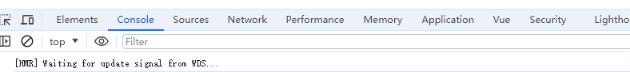
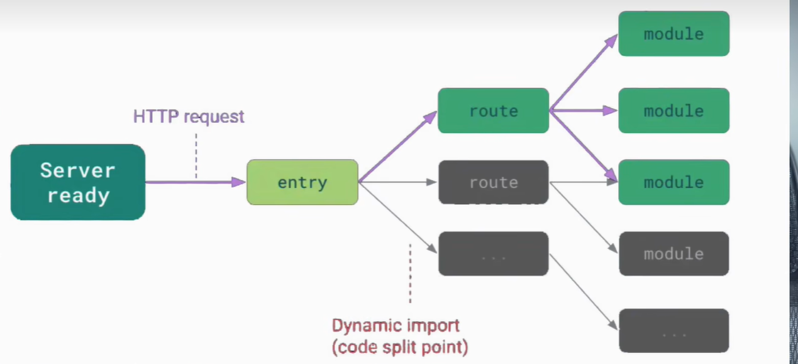
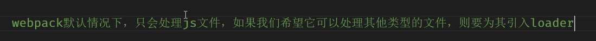

## [HMR] Waiting for update signal from WDS...

1. **HMR**：全称为 Hot Module Replacement（热模块替换）。这是一种技术，允许开发者在应用运行时替换、添加或删除模块，而无需完全重新加载页面。这大大提高了开发效率，因为你可以实时看到更改的效果。
2. **WDS**：全称为 Webpack Dev Server（Webpack  开发服务器）。这是一个小型的 Express 服务器，它使用 webpack 与浏览器进行通信，并且利用 sockjs  提供实时重载功能。它主要用于在开发期间提供 assets（由 webpack 构建）。



## Vite为什么比webpack快

webpack的devserve在启动的时候会把所有的文件构建一遍,从入口文件索引所有的项目文件,编译成1个或多个单独的js文件,不管模块是否执行,都会编译和打包到bundle中,随着项目复杂,模块变多,打包的bundle也越来越大,速度也就越来越慢

vite在启动的时候不需要打包,不需要拆分模块的依赖和编译,所以启动速度非常快,当浏览器请求某个模块的时候,再根据需要对对应模块的内容进行编译, 现代浏览器本身支持ESmoudule,会自动请求所依赖的esmoudule的资源, 就是按需编译,项目越复杂,模块越多,vite的优势就越明显, 热更新方面,当改动了一个模块之后,仅需让浏览器重新请求对应的模块即可,不会像webpack再重新编译一遍,在底层实现上,vite是基于esbuild预构建的,es build采用go编写,esbuild 能够充分利用多核 CPU 进行并行处理,比js写的打包器速度更快

- ESModules 是静态的，这意味着模块依赖关系在编译时就能确定。这允许现代 JavaScript 引擎进行更多优化，比如 tree shaking，即移除未使用的代码。




## Go 语言相较于 JavaScript（通常用于编写传统打包工具）更高效的几个原因：

1. **编译型语言**:
   - Go 是一种编译型语言，代码在执行之前会被编译成目标机器的机器码。相比之下，JavaScript 是一种解释型语言，通常需要在运行时由引擎逐行翻译，这增加了额外的开销。
2. **高效的并发**:
   - Go 原生支持强大的并发处理，通过 goroutines 和 channels，使得许多操作可以并行处理。构建和编译任务可以有效分配到多个 CPU 核心上进行，从而大幅减少总的执行时间。
3. **静态类型和简单的内存管理**:
   - Go 是静态类型语言，这可以在编译时进行许多优化和错误检查。再加上自动垃圾回收机制，使得内存管理更加高效和安全。
4. **轻量级和简洁的设计**:
   - Go 语言的设计哲学是简单和高效，标准库和语言特性的选择都经过精心设计以促进性能。
5. **低启动延迟**:
   - Go 程序通常在启动时会比使用大型 JavaScript 运行时的程序花费更少的时间，因此，对于需要快速反应的开发服务器来说优势明显。
6. **内存使用效率**:
   - 由于是编译型语言，Go 的程序在执行时通常会有预估的内存使用模型，可以减少不必要的内存分配和释放。

## Webpack

#### 介绍

Webpack 是一个模块打包工具，能够将项目中的各种资源（JavaScript, CSS, 图片等）作为模块进行处理，并生成优化后的静态资源文件。Webpack 广泛应用于现代前端开发中，并支持丰富的插件和配置。

webpack是js写的

#### Webpack 选择用 JavaScript 编写有几个原因：

1. **生态系统**：JavaScript 作为前端开发的主流语言，有着丰富的生态系统和社区支持。使用 JavaScript 编写不仅可以利用现有的工具和库，还能方便地吸引更多的开发者参与。
2. **一致性**：很多前端开发者都熟悉 JavaScript，在使用 Webpack 时能更快上手，无需学习另一种编程语言。
3. **Node.js 环境**：Node.js 提供了良好的服务端 JavaScript 运行时，可以高效处理文件I/O操作，适合用于编写构建工具。

#### 工作原理

1. **入口（Entry）**：Webpack 从一个或多个入口点开始构建依赖图。默认入口文件通常是 `src/index.js`。

2. **模块解析（Module Resolution）**：Webpack 使用加载器（loaders）将各类文件（如 JavaScript、CSS、图像）转换为可以直接使用的模块（通常是 JavaScript）。

3. **依赖图（Dependency Graph）**：通过解析入口文件中的导入语句，Webpack 构建一个包含所有依赖的图表，递归查找每个依赖模块。

4. **插件（Plugins）**：Webpack 使用插件系统执行各种任务，如压缩代码、提取CSS、构建分析等。

5. **输出（Output）**：Webpack 将处理和优化后的文件输出到配置的目标文件夹（通常是 `dist/`）。

#### 性能瓶颈

- **初始构建时间长**：Webpack 会解析整个依赖图，处理大量的模块，这会使初始构建时间变长。
- **热更新延迟**：即使是开发过程中的小改动，Webpack 也可能需要重新打包较大的代码块，导致热更新速度较慢。

## Vite

#### 介绍

Vite 是一个基于 ES 模块的新一代前端构建工具，它的优点在于快速的热更新和即时的开发环境。Vite 是由 Vue.js 的作者尤雨溪（Evan You）创建的，旨在解决 Webpack 等传统打包工具的性能问题。

#### 工作原理

1. **开发模式下的即时服务器**：Vite 在开发模式下使用原生 ES 模块（ESM）和浏览器支持的 HTTP 提供即时模块解析和热更新。这意味着只有被修改的模块会被重新请求，无需重新打包整个项目。

2. **轻量化的初始加载**：Vite 通过预构建常用依赖（例如 React、Vue）来加速冷启动时间。它使用 esbuild，一个用 Go 编写并高度优化的编译器来处理预构建任务。

3. **按需加载**：在开发模式下，Vite 按需加载模块。只有被真实引用的模块才会被请求和处理，从而显著减少不必要的工作量。

4. **生产模式下的 Rollup 打包**：尽管 Vite 在开发模式下不使用传统的打包工具，但在生产模式下，Vite 使用 Rollup 进行优化打包。这使得 Vite 能够生成高效、优化的生产环境代码。

#### Vite 为什么更快

1. **即时模块服务**：Vite 不需要对整个项目进行提前打包，而是即时提供模块，这避免了大量的初始构建开销。

2. **依赖预构建**：Vite 使用 esbuild 预构建非 ES 模块化的依赖，这显著加快了依赖解析和模块转换的速度。esbuild 极其高效，通常比 JavaScript 实现的打包器（如 Webpack、Rollup）快 10 到 100 倍。

3. **按需转换**：在开发模式下，只有第一次请求特定模块时，Vite 才会进行转换并缓存结果。这可避免无效代码被频繁地重新构建。

4. **Hot Module Replacement (HMR)**：Vite 的 HMR 实现更加细粒度，只重加载被修改的部分模块。而 Webpack 的 HMR 在大型项目中容易拖慢开发效率，因为它可能需要重新打包较大的模块。

### 性能对比总结

- **初始启动时间**：Vite 的依赖预构建和即时模块服务策略使得初始启动时间大幅缩减，而 Webpack 需要解析构建整个依赖图，初始启动时间较长。

- **热更新速度**：Vite 的 HMR 速度非常快，因为它仅重新加载修改的模块。而 Webpack 的热更新机制在大型项目中变得相对缓慢。

- **构建产物优化**：尽管在开发模式下 Vite 更快，但在生产模式下，两者在构建产物优化上可能效果相似，因为 Vite 使用 Rollup 进行最终的生产构建。

### 总结

- **Webpack** 是一个功能强大的模块打包工具，广泛适用于各种前端项目，但其初始构建和热更新性能在大型项目中不如意。

- **Vite** 是一个新一代的前端开发工具，利用浏览器原生支持的 ES 模块和高速的 esbuild，在开发模式下显著提升了速度和效率。针对依赖预构建、按需加载和更快速的 HMR，使 Vite 比 Webpack 更快。

## webpack打包构建流程；为什么要进行打包

### 为什么要进行打包

在现代Web开发中，前端工程化已经成为标配，而打包工具（如Webpack）在其中扮演着至关重要的角色。核心原因如下：

1. **模块化开发**：打包工具允许开发者使用模块化开发模式（如ES6模块或CommonJS），这使得代码更加清晰、可维护。
2. **依赖管理**：自动管理依赖关系，确保正确的模块依赖顺序和加载方式。
3. **代码优化**：通过压缩、合并、删除未使用代码等多种优化手段，减少文件大小，提高加载速度。
4. **提升性能**：使用代码分割（Code Splitting）、懒加载（Lazy Loading）等技术，优化性能和用户体验。
5. **兼容性处理**：处理不同浏览器的兼容性问题，如通过Babel将ES6+的代码转换为ES5，以兼容老旧浏览器。
6. **方便调试**：通过Source Map支持，将编译后的代码映射回源代码，帮助开发者更容易地进行调试。

### Webpack打包构建流程

Webpack的打包流程可以用以下几个步骤来描述：

1. **初始化**：读取配置文件 `webpack.config.js`，创建一个 `compiler` 实例，并初始化一系列插件和配置参数。
2. **解析入口**：从配置的 `entry` 入口文件开始，递归地解析出项目依赖的所有模块。
3. **模块编译**：根据模块类型（如JavaScript、CSS、图片等），使用相应的Loader对模块内容进行转换和解析，将其编译为浏览器可以识别的代码。
4. **模块打包**：将编译后的模块按照配置的规则（如代码分割、Chunk处理等）进行合并打包，生成一个或多个输出文件。
5. **输出**：将打包好的文件输出到指定的 `output` 目录，并生成相应的Source Map以便调试。
6. **完成**：执行一些优化操作（如代码压缩、文件哈希命名等），整个打包过程完成。

#### 示例配置和流程细节

以下是一个简单的 Webpack 配置文件（`webpack.config.js`）示例：

```javascript
const path = require('path');
const HtmlWebpackPlugin = require('html-webpack-plugin');
const { CleanWebpackPlugin } = require('clean-webpack-plugin');

module.exports = {
    // 入口
    entry: './src/index.js',  
    // 输出
    output: {
        filename: 'bundle.[contenthash].js',
        path: path.resolve(__dirname, 'dist')
    },
    // 模块和加载器
    module: {
        rules: [
            {
                test: /\.js$/,
                exclude: /node_modules/,
                use: 'babel-loader'
            },
            {
                test: /\.css$/,
                use: ['style-loader', 'css-loader']
            },
            {
                test: /\.(png|svg|jpg|gif)$/,
                use: ['file-loader']
            }
        ]
    },
    // 插件
    plugins: [
        new CleanWebpackPlugin(),
        new HtmlWebpackPlugin({
            template: './src/index.html'
        })
    ],
    // 开发工具
    devtool: 'source-map',
    // 模式
    mode: 'development'
};
```

### 详细流程

1. **初始化**：
   - Webpack 读取配置文件 `webpack.config.js`，初始化参数（包括 Entry、Output、Loaders、Plugins 等）。
   - 创建 `Compiler` 实例并初始化插件（Plugins）。

2. **解析入口**：
   - 从配置的 `entry` 入口文件（如 `./src/index.js`）开始解析，构建模块依赖图（Dependency Graph）。

3. **模块编译**：
   - 对于每个模块，确定其需要使用的加载器（Loader），并依次应用这些加载器进行代码转换。例如，`babel-loader` 会将 ES6+ 代码转换为 ES5。
   - 加载器的配置在 `rules` 中定义，如处理 JavaScript 文件的 `babel-loader` 和处理 CSS 文件的 `style-loader` 和 `css-loader`。

4. **模块打包**：
   - 根据依赖图确定各个模块的依赖关系和加载顺序，将模块打包成一个或多个 `chunk`。
   - 生成打包后的输出文件（Output），如 `bundle.[contenthash].js`。

5. **输出**：
   - 将打包好的文件输出到指定的目录（如 `dist`）。
   - 生成对应的 Source Map 文件以便调试（如果配置了 `devtool`）。

6. **完成**：
   - Webpack 会触发 `emit` 事件，执行一些后续处理，如插件的 cleanup 或文件压缩等。

### 总结

Webpack 通过一系列的配置和插件机制，将复杂的前端开发环境变得可以高效管理和维护。打包过程不仅优化了代码量和加载速度，还提高了开发和调试的便利性。因此，通过Webpack进行打包构建，促使Web应用更具性能和可维护性。

## bundle，chunk，loader这些在整个打包构建流程中的作用是啥

在 Webpack 的打包构建流程中，bundle、chunk 和 loader 都扮演着重要的角色。让我们逐一解释它们的作用：

1. Loader

作用：



- Loader 是 Webpack 的核心概念之一，它的主要作用是将不同类型的文件转换为 Webpack 可以处理的模块。处理各种文件的功能.
- Loader 可以将各种类型的资源（如 CSS、图片、TypeScript 等）转换为 JavaScript 模块。

在构建流程中的位置：

- Loader 在模块编译阶段发挥作用。
- 当 Webpack 遇到非 JavaScript 文件时，它会使用配置的 Loader 来处理这些文件。

示例：

- css-loader：将 CSS 转换为 CommonJS 模块
- babel-loader：将 ES6+ 代码转换为 ES5
- file-loader：处理文件导入，返回文件的 URL

2. Chunk

作用：

- Chunk 是 Webpack 打包过程中的中间产物。
- 它表示一组模块的集合，这些模块通常具有某种内在关联。

在构建流程中的位置：

- Chunk 在模块依赖分析之后、生成 bundle 之前产生。
- Webpack 会根据配置和模块依赖关系将模块组合成 Chunk。

Chunk 的类型：

- 入口 Chunk：包含入口模块及其依赖
- 异步 Chunk：通过动态导入（如 import()）生成的 Chunk
- 通过 SplitChunksPlugin 分离的公共 Chunk

3. Bundle

作用：

- Bundle 是 Webpack 打包的最终产物，是最终输出的文件。
- 一个 bundle 文件通常包含了多个模块的合并和处理后的版本。

在构建流程中的位置：

- Bundle 是整个构建过程的最终输出。
- 它是在所有模块被处理、Chunk 被创建之后生成的。

Bundle 与 Chunk 的关系：

- 通常情况下，一个 Chunk 会生成一个 Bundle。
- 但是，通过某些插件（如 MiniCssExtractPlugin），一个 Chunk 可能会生成多个 Bundle（如分离的 CSS 文件）。

在整个打包构建流程中的作用总结：

1. Loader（加载器）:
   - 在模块编译阶段工作。
   - 将各种类型的文件转换为 Webpack 可以处理的模块。
   - 使得 Webpack 能够处理非 JavaScript 文件。

2. Chunk（代码块）:
   - 在依赖关系解析后形成。
   - 是多个模块的集合，基于入口点和代码分割配置生成。
   - 帮助 Webpack 更好地组织和优化输出。

3. Bundle（包）:
   - 是最终的输出文件。
   - 包含了处理后的源码、运行时代码等。
   - 是浏览器最终加载的资源。

这三个概念在 Webpack 的构建流程中紧密相连：Loader 处理各种源文件，Webpack 根据依赖关系和配置将处理后的模块组合成 Chunk，最后将 Chunk 转换为最终的 Bundle 文件。这个过程使得开发者可以使用现代化的开发技术和工具，同时确保最终产出的代码能够高效地在浏览器中运行。

## npm执行原理

npm 脚本是一种便捷的机制，用于在 Node.js 环境中定义和运行各种任务。通过在 `package.json` 文件中定义的脚本命令，你可以轻松地执行诸如构建、测试、启动服务器等任务。理解 npm 脚本的执行原理有助于更有效地利用它们：

### 执行原理

1. **定义脚本**：

   - 在 `package.json` 中，脚本定义在 `"scripts"` 字段下。每个键值对中的键是脚本的名称，值是指令/命令。比如：

     ```json
     {
       "scripts": {
         "start": "node app.js",
         "test": "echo \"Error: no test specified\" && exit 1",
         "build": "webpack --config webpack.config.js"
       }
     }
     ```

2. **执行脚本**：

   - 使用 `npm run <script-name>` 命令来执行定义的脚本。例如，运行 `npm run start` 将执行 `node app.js`。
   - 有特殊的命令如 `npm start`、`npm test`、`npm restart` 可以直接运行对应定义的脚本而不需要加 `run`。

3. **生命周期脚本**：

   - npm 支持一些特殊的生命周期脚本，允许在安装、发布等生命周期钩子的特定时刻执行脚本。例如，`preinstall`、`postinstall`、`prepublish` 等。

4. **路径管理**：

   - 在 npm 脚本中运行的命令，会自动将 `node_modules/.bin` 加入到路径中。这意味着你可以直接使用项目本地安装的 CLI 工具，而不需提供其完整路径。例如，使用 `webpack` 命令时，无需配置其绝对路径，只要它被安装在 `node_modules` 下。

5. **shell 命令**：

   - npm 脚本中可以直接运行 shell 命令，如 `echo`、`&&`、`||` 等，这使得在不同的命令之间进行组合变得容易。

6. **跨平台支持**：

   - 由于操作系统之间存在差异（如 Windows 和 Unix 系统），在编写复杂的脚本时，可以使用 `npm-run-all` 或 `cross-env` 等工具来保证跨平台的兼容性。

### 执行流程

- 当你运行 `npm run <script>` 时，npm 会首先检查 `package.json` 中的 `scripts` 字段。
- npm 查找与脚本名称对应的命令，然后在 shell 中执行它。
- 在执行环境中，npm 会自动将 `node_modules/.bin` 目录加入到环境变量 PATH 中，从而能直接调用项目本地安装的命令行工具。
- 执行完成后，npm 返回控制权给当前环境，并提供执行结果的输出。

通过 npm 脚本机制，你可以在项目中定义各种自动化任务，并使用 Node.js 环境中已有的工具，以一种结构化的方式执行它们。这极大地方便了前端及全栈开发流程中的各种任务管理。

## commonjs和esmoudle的区别

### 一、语法区别

#### CommonJS

CommonJS模块使用`require`和`module.exports`进行导入和导出，主要应用在Node.js环境中。

```javascript
// 导出模块
// moduleA.js
const data = 'CommonJS Module';
module.exports = data;

// 导入模块
// main.js
const moduleA = require('./moduleA');
console.log(moduleA);  // 输出: CommonJS Module
```

#### ESModule (ESM)

ESM使用`import`和`export`关键字进行导入和导出，广泛用于浏览器和现代JavaScript环境（包括Node.js的ESM支持）。

```javascript
// 导出模块
// moduleA.mjs
export const data = 'ESModule';

// 或者使用默认导出
//export default data;

// 导入模块
// main.mjs
import { data } from './moduleA.mjs';
console.log(data);  // 输出: ESModule

// 或者导入默认导出
//import data from './moduleA.mjs';
//console.log(data);
```

### 二、模块加载机制

#### CommonJS

1. **同步加载**：CommonJS模块是同步加载的，这意味着模块在加载时会立即执行，主要适用于服务器端环境。
2. **单一导出对象**：CommonJS模块导出的是一个对象，`module.exports`和`exports`指向同一个对象。
3. **缓存机制**：加载的模块会被缓存起来，后续的加载会从缓存中读取。

#### ESModule (ESM)

1. **异步加载**：ESM模块是异步加载的，这意味着模块的加载和解析是非阻塞的，更适用于浏览器环境。
2. **静态结构**：ESM模块的依赖关系在编译时就能确定，这使得静态分析和优化成为可能，如Tree Shaking。
3. **顶层作用域**：ESM模块具有顶层作用域，`import`和`export`必须在模块的顶层使用。

### 三、语法约束与特性

#### CommonJS

- **动态加载**：CommonJS允许在代码的任意位置动态地使用`require`导入模块。
- **模块导入是值的拷贝**：导入的变量是模块导出的值的一个拷贝。
- **重赋值**：可以重赋值给`module.exports`来改变导出对象。

```javascript
const moduleName = './moduleA';
const moduleA = require(moduleName);  // 动态加载
module.exports = { newFeature: 'new feature' };  // 重赋值导出对象
```

#### ESModule (ESM)

- **静态导入**：`import`语句只能在模块的顶层作用域中使用，不能在函数或代码块中使用，也不能动态改变被导入的模块路径。
- **模块导入是引用**：导入的变量是模块导出值的引用，因此导入的数据会实时更新。
- **导出文件类型**：可以使用`.js`或者`.mjs`文件后缀来表明是ES模块，在较新的Node.js中可以通过指明`type: "module"`来使用ES模块。

```javascript
//import moduleName from './moduleA';  // 不允许动态导入
import * as moduleA from './moduleA.js';  // 静态导入
```

### 总结

- **CommonJS**：传统上用于 Node.js 后端开发，导入同步，在首次调用时加载并执行。适合服务器端环境。
- **ES Module（ESM）**：现代标准，支持静态分析、实时绑定和异步导入，原生支持于浏览器，逐渐成为 Node.js 的首选模块格式。

在选择使用哪种模块化标准时，一般考虑项目的执行环境及兼容性需求，前端通常使用 ESM，而后端（尤其是现代项目）也逐渐转向 ESM。

## webpack前端工程化时的优化手段

在使用 Webpack 进行前端工程化时，有多种优化手段可以帮助提升构建速度和产出包的性能。以下是一些常见的优化策略：

### 1. 代码拆分（Code Splitting）

代码拆分能帮助我们将应用程序中的代码分成更小的块，这样当某一部分变动时，只会影响到它及其依赖的部分。Webpack 提供了多种代码拆分的方法：

- **动态 `import()`**：
  使用动态 `import()` 可以进行按需加载，适用于路由切换时加载特定模块。

- **`optimization.splitChunks`**：
  配置 `splitChunks` 可以提取公共依赖，生成单独的 vendor 文件，减少重复打包。

```javascript
module.exports = {
  optimization: {
    splitChunks: {
      chunks: 'all'
    }
  }
};
```

### 2. 缓存 (Caching)

缓存能够提升二次打包后的性能，Webpack 通过内容哈希和持久缓存可以实现：

- **使用 `filename` 中的 [contenthash]**：
  为输出文件名添加 `contenthash`，确保文件变化时其名称才会变化。

```javascript
output: {
  filename: '[name].[contenthash].js',
}
```

- **持久缓存**：
  使用 `webpack.cache` 选项启用持久缓存，以加速重新编译。

### 3. 压缩 (Minification)

对于 JavaScript 和 CSS 文件，使用压缩工具可以有效降低文件大小。

- **`TerserPlugin`**：
  Webpack 5 及以上版本默认使用 TerserPlugin 来压缩生产环境下的 JavaScript 代码。

- **CSS 压缩**：
  使用 `css-minimizer-webpack-plugin` 插件压缩 CSS 代码。

### 4. Tree Shaking

Tree Shaking 是通过消除 JS 中无用的死代码来减小打包体积的技术。

- **确保使用 ES6 模块**：
  Tree Shaking 依赖于 ESM（ES6 模块语法），所以构建时避免使用 CommonJS 模块。

- **生产模式**：
  Tree Shaking 通常在生产模式下自动开启。

### 5. 图片和资源优化

- **图片压缩**：
  使用插件如 `image-webpack-loader` 来减小图片文件体积。

- **Lazy Loading**：
  对于图片和其他资源，使用懒加载技术按需加载。

### 6. 使用更快的编译工具

- **Thread Loader** 和 **HappyPack**：
  使用这些工具可以将代码编译并行化，利用多核 CPU 提升构建速度。

- **`babel-loader` 配置缓存**：
  启用缓存以加快 Babel 转译。

```javascript
{
  loader: 'babel-loader',
  options: {
    cacheDirectory: true,
  },
}
```

### 7. 开发环境优化

- **Source Map**：
  在开发环境中启用 Source Maps 以便于错误定位，但在生产环境中禁用以提升性能。

- **`webpack-dev-server` 和 HMR**：
  使用 `webpack-dev-server` 和热模块替换（HMR）来提升开发体验。

## webpack的缓存,文件名hash

在前端工程化过程中，缓存管理是提升应用加载速度和用户体验的关键之一。通过 Webpack 的内容哈希（`[contenthash]`）功能，我们可以更有效地利用浏览器缓存，减少不必要的文件下载。下面详细讲述如何使用 `[contenthash]` 及其优势。

### `contenthash` 的作用

`contenthash` 是一种将文件内容生成 hash 值并将其作为输出文件名一部分的技术。具体来说：

- **唯一性**：每个输出文件的 `contenthash` 都是基于其内容生成的。当文件内容不变时，生成的 hash 值也是不变的。
- **缓存控制**：由于文件名包括 `contenthash`，只要文件内容不变，更新部署后文件名也不变，浏览器会缓存已存在的文件而不是重复下载。这意味着，如果某个文件（如库文件或模块）没有在更新版本中更改，浏览器将不会重新获取它。

### 实现步骤

在 Webpack 配置中使用 `contenthash` 最主要的步骤就是调整输出文件的命名格式：

```javascript
module.exports = {
  output: {
    filename: '[name].[contenthash].js', // 为输出文件名添加contenthash
    path: path.resolve(__dirname, 'dist')
  },
  // 其他相关配置
};
```

### 优势分析

1. **缓存效益最大化**：由于文件名的唯一性，即使某个小模块或样式文件发生改变，只有这个文件及其依赖链条会被重新获取，其他的文件即使被打包在同一 Bundle 中也不会影响其缓存。

2. **网络负载减少**：通过减少重复下载保持和缓存更多的静态资源，最终减少用户请求服务器的次数，达到减轻服务器负载的作用。

3. **用户体验提高**：用户的加载时间减少，尤其在更新时，用户只需加载更改的部分而非整个应用程序。

4. **代码分离优化**：与代码分离（Code Splitting）结合使用，可以更精确控制和优化加载的资源块。

### 实际场景应用

在实际的项目中，尤其是大型应用如 SPA（单页应用）中，使用 `contenthash` 非常有效。它可以与其他优化技术结合使用，譬如：

- **结合 `splitChunks`**：同时使用 `splitChunks` 可以将共享的库（如 React、Lodash）抽离出来，这样即使应用业务代码改变，只要这些库版本不变，它们的 `contenthash` 也不会变。
  
- **使用 `mini-css-extract-plugin` 配合样式文件**：对于 CSS 文件，同样在输出中使用 `[contenthash]`。

```javascript
const MiniCssExtractPlugin = require("mini-css-extract-plugin");

module.exports = {
  plugins: [
    new MiniCssExtractPlugin({
      filename: "[name].[contenthash].css"
    })
  ]
};
```

实现合理的缓存策略需要开发者充分理解和结合项目实际需求进行配置调整。总体来看，文件的版本化与缓存绑定不仅提升了用户侧的加载体验，也是线上版本管理与版本控制的一种有效手段。

## webpack中的plugin，用过哪些plugin 

在 Webpack 中，插件（Plugins）是扩展其功能的关键机制。它们可以访问 Webpack 的核心机制，并在编译过程中执行各种任务。以下是一些我在项目中经常使用到的 Webpack 插件：

**代码优化 & 构建分析**

* **`TerserWebpackPlugin`**:  用于压缩 JavaScript 代码，减小文件体积。 它是 Webpack 4 默认的压缩插件，但在 Webpack 5 中需要手动安装和配置。

  ```javascript
  const TerserPlugin = require("terser-webpack-plugin");
  
  module.exports = {
    optimization: {
      minimize: true,
      minimizer: [new TerserPlugin()],
    },
  };
  ```

* **`HtmlWebpackPlugin`**:  自动生成 HTML 文件，并将打包后的 JavaScript 和 CSS 文件引入其中。

  ```javascript
  const HtmlWebpackPlugin = require('html-webpack-plugin'); 
  
  module.exports = {
    plugins: [
      new HtmlWebpackPlugin({
        template: './src/index.html', 
        filename: 'index.html'
      })
    ]
  };
  ```

* **`MiniCssExtractPlugin`**:  将 CSS 代码从 JavaScript 文件中提取出来，生成独立的 CSS 文件。 这有助于浏览器更快地加载和渲染样式。

  ```javascript
  const MiniCssExtractPlugin = require("mini-css-extract-plugin");
  
  module.exports = {
    plugins: [new MiniCssExtractPlugin()],
    module: {
      rules: [
        {
          test: /\.css$/,
          use: [MiniCssExtractPlugin.loader, "css-loader"],
        },
      ],
    },
  };
  ```

* **`BundleAnalyzerPlugin`**:  可视化 Webpack 打包后的文件结构和大小，帮助你分析和优化代码。

  ```javascript
  const { BundleAnalyzerPlugin } = require('webpack-bundle-analyzer');
  
  module.exports = {
    plugins: [
      new BundleAnalyzerPlugin()
    ]
  };
  ```

**开发体验提升**

* **`webpack-dev-server`**:   启动一个本地开发服务器，并支持热模块替换（HMR），方便开发调试。
* **`HotModuleReplacementPlugin`**:  实现模块热更新，无需刷新整个页面即可看到代码修改后的效果，提升开发效率。
* **`ReactRefreshWebpackPlugin`**:  专门针对 React 应用的热更新插件，提供更快速和可靠的组件级热更新体验。

**其他常用插件**

* **`CopyWebpackPlugin`**:  将指定的文件或目录复制到构建目录中。
* **`CleanWebpackPlugin`**:  在每次构建之前清空构建目录。
* **`DefinePlugin`**:  定义全局变量，可以在代码中使用。
* **`ProvidePlugin`**:  自动加载模块，无需手动 `require` 或 `import`。

**选择合适插件的建议：**

* **明确需求:**  首先要明确你需要解决什么问题，例如优化代码体积、提升开发体验、处理特定类型的文件等。
* **参考官方文档:**  查阅 Webpack 官方文档或插件的 Github 页面，了解插件的功能、用法和配置选项。
* **社区资源:**  搜索网络上的博客文章、教程和 Stack Overflow 上的问答，学习其他人如何使用这些插件。


这只是一些常用的 Webpack 插件，还有很多其他的插件可以根据项目需求选择使用。

希望这些信息对你有所帮助！

## SourceMap

Source Map 是一个用于调试的功能，它在编译后的代码和源代码之间建立了映射关系，使得开发者能够查看编译、打包或压缩后的 JavaScript 对应的源代码行。这对于调试复杂的 Web 应用程序尤其有用，因为直接查看经过转换的代码（如 Babel 转译后的代码）会变得非常困难。

### Source Map 的作用

1. **调试更简单**：开发者可以直接在浏览器的开发者工具中查看源代码，而不是难以阅读的打包及压缩代码。
   
2. **错误追踪**：错误和异常可以被更准确地追踪到源代码的具体行和文件中。

3. **提高开发效率**：通过调试工具快速定位和修复代码问题，减少排查时间。

### Source Map 的基本原理

在 Webpack 或其他工具生成的 Source Map 中，它通过一个映射文件使打包后文件与源文件对应。典型的 Source Map 文件是一个 JSON 文件，它描述了:

- 转换后的代码位置
- 对应的源代码位置
- 具体每行代码如何映射到源代码位置

### 在 Webpack 中配置 Source Map

在 Webpack 中，通过配置 `devtool` 选项来生成 Source Map。不同的配置提供了不同的构建速度和调试质量。常见的选项有：

- **`eval`**：最快的构建速度，生成每个模块的 Source Map，适用于开发，但不适合生产环境。
  
- **`source-map`**：生成独立文件的完整 Source Map，适合生产环境，但构建速度较慢。
  
- **`cheap-module-source-map`**：生成较快的 Source Map，能逐行映射源代码，不包含列信息。
  
- **`inline-source-map`**：将 Source Map 作为 Data URL 内联，以便更快地用于开发调试。

示例配置：

```javascript
module.exports = {
  // 在开发环境使用更快的 map 模式
  devtool: 'eval-source-map',  
  // 或者在生产环境使用更详细的 map 模式
  // devtool: 'source-map',

  // 其他配置...
};
```

### 生产环境中的 Source Map

在生产环境中，通常会生成 Source Map，以便当应用在用户端发生错误时，你可以用工具来帮助诊断问题。但为了安全，生产环境下不应将 Source Map 直接暴露给用户。常见的做法是：

1. **将 Source Map 文件上传到错误监控平台**：例如 Sentry，这样通过处理后的错误信息反向追踪到源代码。

2. **确保服务端控制访问**：通过服务端来控制 Source Map 存放和访问，或配置不允许浏览器直接看到它。

### 权衡考虑

尽管 Source Map 带来了显著的调试便利，但在开发环境和生产环境中有不同的实现考量：

- **开发环境**：使用更快速和方便调试的配置，降低构建时间，如 `eval-source-map`。

- **生产环境**：使用更全面的 Source Map，但不要直接公开或在不必要的情况下禁用它们，比如不需要时可以改为 `hidden-source-map`。

使用 Source Map，可以显著提升开发调试效率和应用的可维护性。尽管如此，开发者仍需根据应用场景和需求选择合适的 Source Map 方案。

## npm幽灵依赖

在Node.js的包管理中，"幽灵依赖"指的是这样一种情况：在你的项目中，你能使用某个包，但该包没有在你的`package.json`文件中明确列为依赖。这通常是因为这些包是间接依赖被其他明确安装的包引入的。虽然你能使用这些包，但如果那些直接引入它们的包更新或移除对它们的依赖，就可能导致你的项目中断。

**幽灵依赖可能带来的问题：**

1. **不可预测性**：
   - 因为幽灵依赖不是显式声明在你的`package.json`中，所以当直接依赖升级或更改其依赖结构时，一些未被记录的依赖可能会丢失，这可能导致你的项目无法正常运行。

2. **难以维护**：
   - 当团队中不同的开发人员对项目进行开发时，幽灵依赖可能会导致混淆，因为不同的人可能不知道某个模块是如何被引入的。

3. **版本控制问题**：
   - 由于没有在`package.json`中进行版本控制，幽灵依赖的版本可能会在不同机器上或不同时间的安装中不一致，这进而会导致“它在我的机器上工作”的问题。

**如何防止幽灵依赖的影响：**

1. **明确声明依赖**：
   - 在项目中显式声明所有需要的依赖，即使它们是间接依赖。使用npm install某个包时，确保使用`--save`或`--save-dev`标记来将其写入到`package.json`中。

2. **使用`npm ls`**：
   - 这个命令可以列出当前项目中的所有依赖和子依赖，帮助识别哪些包是间接依赖引入的。

3. **锁定依赖版本**：
   - 使用`package-lock.json`或`yarn.lock`文件来锁定项目使用的确切版本，以确保在不同环境中安装时一致。

4. **定期审查和更新依赖**：
   - 定期检查和更新项目中的依赖，确保所有引用的包都是必要的并尽量保持最新。

通过谨慎管理并显式声明项目的所有依赖，你可以减少幽灵依赖带来的问题，确保项目的稳定性和可维护性。

## 按需引入需要配置什么 为什么 与什么有关

按需引入（on-demand loading or importing）是一种优化技术，旨在减少初始加载体积，提升应用性能。通过按需引入，你能确保只在需要时才加载特定的模块或组件，而不是一次性加载所有可能用到的模块。这种技术在现代前端开发中非常常见，特别是在使用模块打包工具和JavaScript框架时。以下是按需引入需要配置的内容、原理以及相关技术。

### 需要配置什么？

按需引入的配置主要涉及以下几个方面：

#### 1. JavaScript模块打包工具（如Webpack、Rollup等）

打包工具需要进行配置，以便能识别和处理按需引入的语法。例如：

**Webpack配置示例（以 Babel 为例）：**

首先，你需要安装必要的依赖项：

```bash
npm install --save-dev @babel/core @babel/preset-env babel-loader
```

然后在 `webpack.config.js` 中配置 Babel：

```javascript
module.exports = {
    entry: './src/index.js',
    output: {
        filename: 'bundle.js',
        path: __dirname + '/dist'
    },
    module: {
        rules: [
            {
                test: /\.js$/,
                exclude: /node_modules/,
                use: {
                    loader: 'babel-loader',
                    options: {
                        presets: ['@babel/preset-env'],
                        plugins: ['@babel/plugin-syntax-dynamic-import']
                    }
                }
            }
        ]
    }
};
```

#### 2. JavaScript框架（如React、Vue等）

对于使用框架开发的项目，按需引入通常还需框架的特定配置或工具：

**例如，在 Vue 项目中：**

首先安装 `babel-plugin-import`：

```bash
npm install babel-plugin-import --save-dev
```

在 `.babelrc` 中添加配置：

```json
{
  "plugins": [
    [
      "import",
      {
        "libraryName": "ant-design-vue",
        "libraryDirectory": "es",
        "style": true
      }
    ]
  ]
}
```

对于 React，假设使用 Material-UI，可以这样配置按需引入：

```bash
npm install babel-plugin-import --save-dev
```

然后在 `.babelrc` 中配置：

```json
{
  "plugins": [
    [
      "import",
      {
        "libraryName": "@material-ui/core",
        "libraryDirectory": "",
        "camel2DashComponentName": false
      },
      "core"
    ],
    [
      "import",
      {
        "libraryName": "@material-ui/icons",
        "libraryDirectory": "",
        "camel2DashComponentName": false
      },
      "icons"
    ]
  ]
}
```

### 为什么需要按需引入？

按需引入的主要目的是优化性能，具体原因如下：

1. **减少初始加载时间**：对于大型应用，加载所有模块和资源会导致初始加载时间变长。按需引入可以显著减少初始加载的体积，从而提升用户体验。

2. **节省带宽**：用户不需要下载那些当前页面不需要的资源，这不仅加快了加载时间，还能节省用户的带宽。

3. **提升响应速度**：由于减少了需要解析和执行的 JavaScript 代码，浏览器可以更快速地渲染页面。

### 与什么有关？

按需引入主要与以下几个技术和概念相关：

1. **模块化**：JavaScript 的模块化机制 (如 ES6 模块 `import()` 语法) 是实现按需引入的基础。

2. **Tree Shaking**：这是一个优化技术，主要用于移除未使用的代码，以减小打包后的文件体积。通常与按需引入结合使用，效果更佳。

3. **代码分割 (Code Splitting)**：通过代码分割，可以将应用程序拆分成多个小的包，以便可以按需加载这些代码包。

4. **动态导入 (Dynamic Import)**：`import()` 语法允许在运行时按需加载模块，这对于实现动态组件加载非常有用。

5. **前端框架配置**：不同的前端框架（如 React、Vue、Angular）通常提供自己的按需引入方案，且可能需要特定的配置。

**示例：动态导入**

```javascript
// 仅在需要时才加载模块
import('./someModule').then(module => {
    module.someFunction();
}).catch(err => {
    console.error("Failed to load module: ", err);
});
```

### 小结

按需引入对于提升应用性能、优化用户体验至关重要，通过适当的配置和技术实现按需引入，能够有效减少初始加载时间和带宽消耗。如果你正在开发一个较大的前端项目，了解并使用按需引入是非常值得的。

## pnpm

PNPM（Performant Node Package Manager）是一个快速、高效的Node.js包管理工具，与其他包管理工具如npm和yarn相比，PNPM在性能和磁盘空间利用方面更具优势。以下是对PNPM的一些关键理解：

### 主要特点

1. **高效的磁盘利用**：
   - PNPM通过使用全局的内容地址存储（Content Addressable Store）来存储包的所有版本。这个存储库中的包被硬链接到项目的node_modules目录中。因此，无论一个包在多少个项目中使用，只会在硬盘上存储一次。

2. **高速的安装速度**：
   - 由于PNPM不复制包，而是使用硬链接，它能显著加快安装速度，特别是在处理大项目或复杂依赖关系时。

3. **严格的依赖解析**：
   - PNPM采用更严格的方式管理Node.js项目中的依赖关系。它要求所有的依赖关系在安装时明确说明，确保项目的层次结构完整且清晰，这也避免了“魔法式”的依赖解析。

4. **一致的依赖树**：
   - PNPM在不同的环境中确保一致的依赖树结构，使团队成员可以有相同的开发环境，减少了“在我机器上可以工作”的问题。

5. **独立的根本包**：
   - 与npm或yarn不同，pnpm通过软链接或硬链接将依赖项链接到项目中，并且项目有自己的包装符号链接，这意味着即使多个项目有不同版本的依赖项它们也不会相互影响。

### 优势

- **磁盘空间节约**：由于采用了全局缓存和硬链接，PNPM可以节省大量磁盘空间。
- **速度优势**：PNPM的包管理速度快，安装过程通过缓存提高效率，并利用并行操作进一步加快了包安装速度。
- **模块隔离**：有助于避免由于版本冲突导致的问题，由于包是独立的，它们的需求不会被其他包轻易篡改。
- **透明度和安全性**：通过清晰的依赖关系管理，降低了因错误或未管理的依赖关系而导致错误和安全风险的机会。

### 使用

使用PNPM的基本命令与npm类似，这使得npm用户可以很快速地上手。常见命令包括：

- `pnpm install package-name`：安装包
- `pnpm uninstall package-name`：卸载包
- `pnpm update`：更新包
- `pnpm list`：列出安装的包

### 总结

PNPM尤其适合需要管理大型项目或多项目依赖的开发团队，提供了性能和一致性方面的强大优势。使用PNPM可以大大提高Node.js项目的开发效率和项目的依赖管理能力。与传统的npm和yarn相比，它为开发者提供了一种更为创新和高效的解决方案。