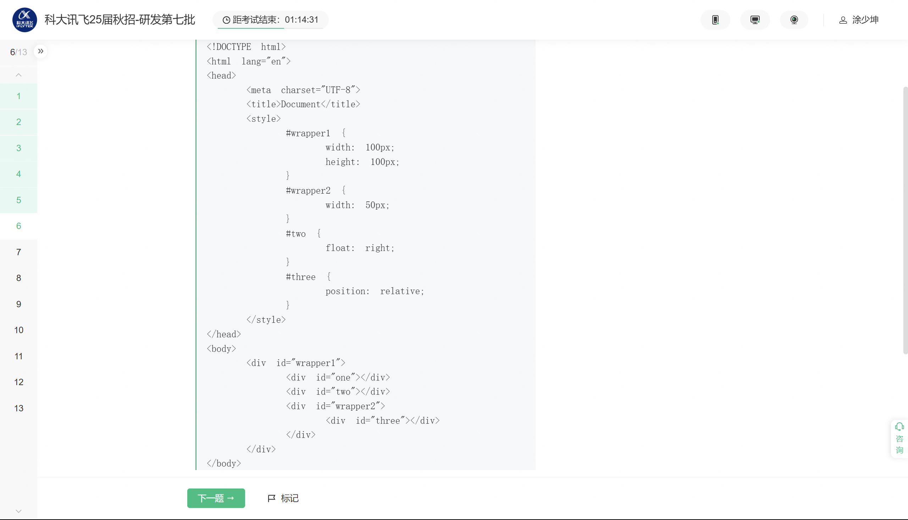
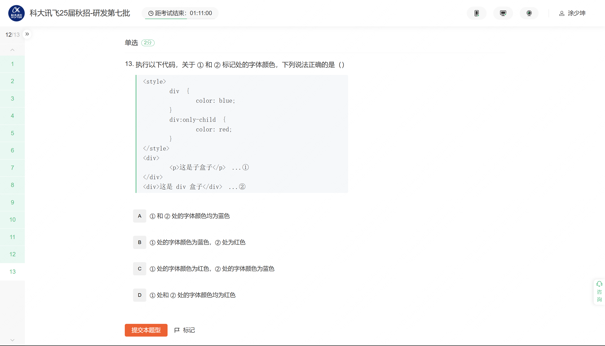
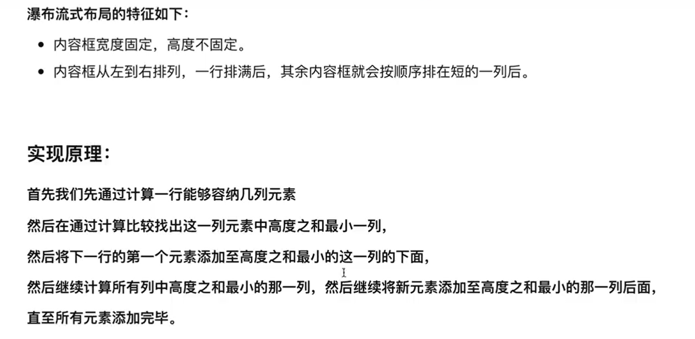

## 如何做元素的垂直居中

垂直居中对齐网页元素是一个常见的布局需求，根据具体情况，可以采用不同的方法来实现。以下是几种常用的方法：

### 1. 使用 Flexbox

Flexbox 是一种强大的布局模块，可以很容易实现垂直居中。

```html
<div class="container">
  <div class="content">
    这是要居中的内容
  </div>
</div>
```

```css
.container {
  display: flex;
  justify-content: center;  /* 水平居中 */
  align-items: center;      /* 垂直居中 */
  height: 300px;            /* 确保容器有高度 */
}
```

### 2. 使用 Grid 布局

Grid 布局也非常灵活，可以用于居中对齐。

```css
.container {
  display: grid;
  place-items: center;      /* 水平和垂直居中 */
  height: 300px;            /* 确保容器有高度 */
}
```

### 3. 使用 `margin` 和 `position` 属性

对于已知高度的元素，可以使用 `absolute` 和负 `margin` 实现垂直居中。

```html
<div class="container">
  <div class="content">
    这是要居中的内容
  </div>
</div>
```

```css
.container {
  position: relative;
  height: 300px;            /* 确保容器有高度 */
}

.content {
  position: absolute;
  top: 50%;
  left: 50%;
  transform: translate(-50%, -50%);
}
```

### 4. 使用内联元素或单行文本

对于单行文本，或者内联元素（如图标等），可以使用 `line-height` 方法：

```html
<div class="container">
  <span class="content">居中文本</span>
</div>
```

```css
.container {
  height: 300px;               /* 确保容器有高度 */
  line-height: 300px;          /* 行高设置为与高度一样 */
  text-align: center;          /* 水平居中 */
}

.content {
  display: inline-block;       /* 当内容是 inline 或 inline-block 时才有效 */
  vertical-align: middle;      /* 垂直对齐于容器中心 */
  line-height: normal;         /* 重置内容的行高 */
}
```

### 选择方法依据

- **Flexbox 和 Grid** 适用于更多场合，适合动态内容或者不确定高度的容器。
- **`margin` 和 `transform`** 适合高度比较固定的情况。
- **`line-height`** 适用于简单文本或固定高度的行级元素。

选择合适的方法取决于具体的布局结构和需求。在现代开发中，Flexbox 是最常用且易于维护的方法。

## link和@import的区别

在网页开发中，`<link>` 标签和 `@import` 语句都是用于在 HTML 中引入 CSS 样式表的方法。然而，它们之间存在一些显著的区别：

### 1. 加载过程

- **`<link>` 标签**：
  - 是 HTML 标准的标签，用于在文档中引用外部资源。
  - 浏览器在解析 HTML 时，会立即处理 `<link>` 标签借此加载相关的 CSS 文件。
  - 由于 `<link>` 是属于 HTML 解析过程的一部分，CSS 文件会被并行加载，有助于提高页面的加载速度。

- **`@import` 语句**：
  - 是 CSS 提供的语法，通常用于在样式表中导入其他样式表。
  - 由于 `@import` 是 CSS 规则，在解析 CSS 时才会处理它。
  - 样式表中的 CSS 规则是按顺序解析的，这样可能导致较慢的加载速度，因为依赖的样式表加载会被阻塞。

### 2. 位置

- **`<link>` 标签**：
  - 通常放置在 HTML 文档的 `<head>` 部分。
  
- **`@import` 语句**：
  - 必须写在 CSS 文件的开头或其他 `@import` 语句之后。

### 3. 浏览器兼容性

- **`<link>` 标签**：
  - 被所有现代浏览器，包括旧版本浏览器普遍支持。

- **`@import` 语句**：
  - 老版本浏览器（如 Netscape 4 和 IE4 等）对 `@import` 的支持较差。
  
### 4. 用法和灵活性

- **`<link>` 标签**：
  - 由于 `<link>` 是一个 HTML 标签，它不仅能引入 CSS 资源，也可以用来添加其他资源（如 `rel="icon"` 用于网站图标）。
  - 可以使用媒体属性指定在哪些情况下启用外部样式，例如：`<link rel="stylesheet" href="style.css" media="screen and (max-width: 600px)">`

- **`@import` 语句**：
  - 仅用于引入 CSS 文件。
  - 允许通过指定媒体查询进行条件样式导入，例如：`@import url("print.css") print;`

### 综合影响

- **性能方面**：使用 `<link>` 标签通常比 `@import` 更优，因为 `<link>` 提供并行加载能力，不阻塞后续样式表。

- **使用场景**：如果需要保证最大化的兼容性和性能，优先选择 `<link>` 标签。但 `@import` 可能在一些情况下提供额外的灵活性，尤其是在动态加载需求中或是通过 CSS 自身间接引入其他样式。

总的来说，尽管在某些情况下 `@import` 提供了便捷性，但 `<link>` 标签由于其较佳的性能和广泛的兼容性，是通常推荐的引入样式的方法。

## 中间有间距，两边没有间距，怎么设置

如果你想在两端没有间距，但元素间有间距的布局情况，可以通过多种方式实现，具体取决于应用场景和布局要求。常见的方法包括使用 CSS 的 `margin` 配合灵活的布局技巧。例如，你有一个水平布局的多个项（如按钮或图片），希望中间的项目之间有间距，而两端没有间距。以下是一些常见的方法：

### 1. Flexbox 布局

使用 flexbox 可以很方便地控制间距：

```html
<div class="container">
  <div class="item">Item 1</div>
  <div class="item">Item 2</div>
  <div class="item">Item 3</div>
</div>
```

```css
.container {
  display: flex;
  justify-content: space-between;
}

.item {
  /* 设置所有子元素之间的默认间距 */
  margin: 0;
}

.item:not(:last-child) {
  /* 除了最后一个元素，其他元素之间添加右侧间距 */
  margin-right: 16px; /* 根据需求调整间距宽度 */
}
```

### 2. Grid 布局

CSS Grid 提供了对间距的良好控制：

```html
<div class="grid-container">
  <div class="grid-item">Item 1</div>
  <div class="grid-item">Item 2</div>
  <div class="grid-item">Item 3</div>
</div>
```

```css
.grid-container {
  display: grid;
  grid-template-columns: repeat(3, 1fr); /* 根据需求调整列数 */
  column-gap: 16px; /* 设置列间距 */
}

.grid-item {
  /* 可以设置必要的样式 */
}
```

### 3. 使用 CSS Margin

针对简单不需要响应式的情况：

```html
<div class="wrapper">
  <div class="item">Item 1</div>
  <div class="item">Item 2</div>
  <div class="item">Item 3</div>
</div>
```

```css
.wrapper {
  display: flex;
}

.item {
  margin-left: 0;  /* 移除左侧间距 */
}

.item + .item {
  margin-left: 16px; /* 为除第一个外的所有元素添加左侧间距 */
}
```

### 4. 使用伪元素

对于某些情形，伪元素也是一种灵活的选择，但通常需要更加复杂的布局和效果，建议在非必要情况下优先使用前面的方法。

以上每种方法的选择遵循具体需求和项目需求与可维护性。`flexbox` 和 `grid` 方法优点是对响应式和复杂布局友好，而改变 `margin` 的方法最适用于简单布局。根据项目实际需要选择最适合的方法来实现间距控制。

##  css做动画有哪些方案

在 CSS 中，为元素创建动画有多种方案，主要包括以下几种：

1. **CSS Transition**：
   - **简介**：CSS 过渡（transition）允许在属性变化时，平滑地进行从一个状态到另一个状态的动画效果。
   - **适用场景**：适用于响应用户交互的简单动画，比如鼠标悬停或者焦点变化。
   - **示例使用**：
     ```css
     .box {
       width: 100px;
       height: 100px;
       background-color: blue;
       transition: background-color 0.5s ease;
     }
     .box:hover {
       background-color: red;
     }
     ```
   - **特点**：只在元素状态改变时触发。

2. **CSS Animation**：
   - **简介**：CSS 动画（animation）使用关键帧（@keyframes），定义元素从一种样式变化到另一种样式的一系列关键步骤。
   - **适用场景**：适合更复杂的、需要精细控制的动画，比如循环动画、独立于用户交互的动画。
   - **示例使用**：
     ```css
     @keyframes slide {
       from { transform: translateX(0); }
       to { transform: translateX(100px); }
     }
     .box {
       width: 100px;
       height: 100px;
       background-color: blue;
       animation: slide 2s infinite alternate;
     }
     ```
   - **特点**：可以脱离状态变化独立运行，支持更多控制如延迟、重复、方向等。

3. **Background Position Animation**：
   - **简介**：背景位置动画通过改变背景图像的位置来实现简单的动画效果，比如循环帧图像。
   - **特点**：主要用于背景精灵图，实现帧动画。

4. **CSS Transforms with Animation/Transition**：
   - **简介**：结合 transform 属性（如 `translate`, `rotate`, `scale` 等）可以通过 transitions 或 animations，提供平滑的几何动画效果。
   - **适用场景**：适合需要元素位置、大小、旋转改变的动画。

这些 CSS 动画技术各有优劣，其中 `transition` 更加适用于简单的触发性动画，而 `animation` 更灵活，适用于更复杂和动态的动画效果。在创建较复杂动画时，使用 CSS Animation 通常是最佳选择，因为它提供了更高的控制能力

## 场景：一个表很多数据、很多图标，怎么优化。

说实话我答了分页，不给分页就虚拟滚动、图片懒加载，他说还有呢，我心想还有什么呀？

webworkers

## 下面这段代码会执行几次回流

   

```css
div.style.width = 10;
div.style.height = 10;
console.log(div.offsetWidth);
console.log(div.offsetHeight);
```

在这段代码中，我们首先通过直接修改元素 `div` 的样式属性 `width` 和 `height`，然后访问元素的 `offsetWidth` 和 `offsetHeight`。这将引发回流的发生。让我们分析一下具体的回流次数。

### 回流（重排）发生的原因

- **设置 `style` 属性**：
  - `div.style.width = 10` 和 `div.style.height = 10` 实际上并不会立即引发回流。仅仅是将新的样式应用到对应的 CSSOM 树上。

- **读取布局属性**：
  - 当我们访问 `div.offsetWidth` 和 `div.offsetHeight` 时，这些属于“读取布局属性”的操作，会引发浏览器进行一次回流，以确保该元素的最新样式应用到它的布局上，并返回准确的值。

### 这段代码中的回流次数

在你的代码中，有两个布局属性的读取（`offsetWidth` 和 `offsetHeight`）。默认来说，访问任何一个布局属性都会强制浏览器进行一次回流以计算最新的尺寸和位置。因此在这个具体例子中，该段代码会触发**一次回流**。

### 为什么不是两次回流？

当 `div.offsetWidth` 被访问时，会触发一次回流，浏览器已经计算了所有需要更新的布局信息。随后访问 `div.offsetHeight` 时，浏览器会使用已经计算好的布局信息，因此不会再次触发回流。

### 总结

最终，这段代码触发的回流次数是**一次**。这是一种浏览器优化行为，旨在尽量减少回流的频率以增强性能。为了避免不必要的回流，可以考虑将多次布局属性读取合并在一起，减少回流的触发。

## 不同设备的适配如何做

不同设备的适配是指在开发网页或应用时，确保其在不同屏幕尺寸、分辨率和设备类型（如手机、平板、桌面电脑等）上都能正常显示和使用。适配不同设备的主要方法包括响应式设计、媒体查询、弹性布局、视口设置等。以下是一些常用的适配方法：

### 1. 响应式设计（Responsive Design）

响应式设计是一种设计理念，旨在使网页或应用能够根据设备的屏幕尺寸和分辨率自动调整布局和样式。响应式设计通常包括以下几个方面：

- **流体网格布局**：使用百分比或 `flexbox` 布局，使页面元素能够根据屏幕尺寸自动调整大小。
- **弹性图片和媒体**：使用 `max-width: 100%` 确保图片和视频不会超出容器宽度。
- **媒体查询**：根据设备的屏幕尺寸应用不同的样式。

#### 示例

```css
/* 基本样式 */
body {
    font-size: 16px;
}

/* 小屏幕设备 */
@media (max-width: 600px) {
    body {
        font-size: 14px;
    }
}

/* 大屏幕设备 */
@media (min-width: 1200px) {
    body {
        font-size: 18px;
    }
}
```

### 2. 媒体查询（Media Queries）

媒体查询是 CSS3 引入的功能，允许开发者根据设备的特性（如屏幕宽度、高度、方向等）应用不同的样式。媒体查询通常与响应式设计结合使用。

#### 示例

```css
/* 小屏幕设备 */
@media (max-width: 600px) {
    .container {
        width: 100%;
    }
}

/* 大屏幕设备 */
@media (min-width: 1200px) {
    .container {
        width: 1170px;
    }
}
```

### 3. 视口设置（Viewport Settings）

视口设置是指在 HTML 中设置 `<meta>` 标签，以控制网页在移动设备上的显示方式。视口设置通常包括设置视口的宽度、缩放比例等。

#### 示例

```html
<meta name="viewport" content="width=device-width, initial-scale=1.0">
```

### 4. 弹性布局（Flexbox）

Flexbox 是一种 CSS 布局模型，允许开发者创建灵活的布局，使页面元素能够根据屏幕尺寸自动调整大小和位置。Flexbox 特别适合用于响应式设计。

#### 示例

```css
.container {
    display: flex;
    flex-wrap: wrap;
}

.item {
    flex: 1 1 200px; /* 每个项目至少 200px 宽，自动扩展 */
}
```

### 5. 网格布局（CSS Grid）

CSS Grid 是一种二维布局系统，允许开发者创建复杂的网格布局。CSS Grid 特别适合用于创建复杂的响应式布局。

#### 示例

```css
.container {
    display: grid;
    grid-template-columns: repeat(auto-fit, minmax(200px, 1fr));
}
```

### 6. 图片和媒体适配

为了确保图片和视频在不同设备上都能正常显示，可以使用以下方法：

- **使用 `max-width: 100%`**：确保图片和视频不会超出容器宽度。
- **使用 `srcset` 和 `sizes` 属性**：为不同屏幕尺寸提供不同分辨率的图片。

#### 示例

```html

```

### 7. 移动优先设计（Mobile-First Design）

移动优先设计是一种设计理念，先为移动设备设计样式，然后逐步扩展到更大的屏幕。这种方法可以确保移动设备上的用户体验优先，同时减少不必要的代码。

#### 示例

```css
/* 移动设备样式 */
body {
    font-size: 14px;
}

/* 平板设备样式 */
@media (min-width: 600px) {
    body {
        font-size: 16px;
    }
}

/* 桌面设备样式 */
@media (min-width: 1200px) {
    body {
        font-size: 18px;
    }
}
```

### 总结

- **响应式设计**：使用流体网格布局、弹性图片和媒体、媒体查询等方法，使页面能够根据设备屏幕尺寸自动调整。
- **媒体查询**：根据设备的特性应用不同的样式。
- **视口设置**：控制网页在移动设备上的显示方式。
- **弹性布局**：使用 Flexbox 创建灵活的布局。
- **网格布局**：使用 CSS Grid 创建复杂的响应式布局。
- **图片和媒体适配**：确保图片和视频在不同设备上都能正常显示。
- **移动优先设计**：先为移动设备设计样式，然后逐步扩展到更大的屏幕。

## 移动优先设计原因:

移动优先设计（Mobile-First Design）是一种设计理念，强调在设计和开发过程中优先考虑移动设备的用户体验。这种设计方法有以下几个主要原因和优势：

### 1. 移动设备用户基数大

移动设备用户基数大。

### 2. 移动设备资源有限

移动设备资源有限，需要高效运行。

### 3. 简化设计

移动设备**屏幕尺寸较小**，**内容和功能需要更加简洁和集中**。移动优先设计鼓励开发者专注于核心功能和内容，**避免不必要的复杂性**。这种**简化设计不仅提高了移动设备的用户体验，也有助于桌面设备的用户体验**。

### 4. 提高性能

移动优先设计通常会优先考虑性能优化。由于**移动设备的网络条件可能不稳定**，移动优先设计会尽量减少资源加载，优化代码和图片，从而提高页面加载速度和响应速度。

### 5. 适应未来趋势

随着移动设备的不断发展和普及，移动优先设计可以更好地适应未来的技术趋势。例如，随着 5G 网络的普及和移动设备的性能提升，移动优先设计可以更好地利用这些新技术，提供更丰富的用户体验。

### 6. 响应式设计的基础

移动优先设计是响应式设计的基础。通过先为移动设备设计样式，然后逐步扩展到更大的屏幕，可以确保在不同设备上都能提供一致的用户体验。这种方法可以减少不必要的代码和样式，提高开发效率。

### 7. 用户体验优先

移动优先设计强调**用户体验优先**。通过先为移动设备设计，可以确保核心功能和内容在所有设备上都能正常使用。这种方法可以避免在桌面设备上过度设计和功能冗余，从而提高整体用户体验。

### 8. 减少开发和维护成本

移动优先设计可以减少开发和维护成本。通过先为移动设备设计，可以避免在桌面设备上进行不必要的复杂设计和开发。这种方法可以减少代码量和样式复杂性，从而降低维护成本。

## 多个div如何实现一行三个div的布局

在网页布局中，如果你希望多个 `div` 元素在一行中每行显示三个，可以使用多种不同的方法。以下有几个不同的实现方法，分别利用了 CSS 的 `flexbox`、`grid` 以及经典的浮动布局。

### 1. 使用 Flexbox

Flexbox 是现代 CSS 中非常强大且灵活的布局模型，适合用于各种页面布局需求。

```html
<!DOCTYPE html>
<html lang="en">
<head>
    <meta charset="UTF-8">
    <meta name="viewport" content="width=device-width, initial-scale=1.0">
    <title>Flexbox Layout</title>
    <style>
        .container {
            display: flex;
            flex-wrap: wrap;
            gap: 10px; /* 用于增加间距，可选 */
        }

        .container .item {
            flex: 1 1 calc(33.33% - 10px);
            box-sizing: border-box;
            height: 100px; /* 示例高度 */
            background-color: lightblue;
        }
    </style>
</head>
<body>
    <div class="container">
        <div class="item">1</div>
        <div class="item">2</div>
        <div class="item">3</div>
        <div class="item">4</div>
        <div class="item">5</div>
        <div class="item">6</div>
        <div class="item">7</div>
        <div class="item">8</div>
        <div class="item">9</div>
    </div>
</body>
</html>
```

### 2. 使用 CSS Grid

CSS Grid 是另一种现代布局方法，适合用于二维布局，非常适合这种情况下的列排布。

```html
<!DOCTYPE html>
<html lang="en">
<head>
    <meta charset="UTF-8">
    <meta name="viewport" content="width=device-width, initial-scale=1.0">
    <title>Grid Layout</title>
    <style>
        .container {
            display: grid;
            grid-template-columns: repeat(3, 1fr);
            gap: 10px; /* 用于增加间距，可选 */
        }

        .container .item {
            height: 100px; /* 示例高度 */
            background-color: lightcoral;
        }
    </style>
</head>
<body>
    <div class="container">
        <div class="item">1</div>
        <div class="item">2</div>
        <div class="item">3</div>
        <div class="item">4</div>
        <div class="item">5</div>
        <div class="item">6</div>
        <div class="item">7</div>
        <div class="item">8</div>
        <div class="item">9</div>
    </div>
</body>
</html>
```

### 3. 使用浮动布局

这种方法使用经典的 CSS 浮动技术，适用于兼容性非常高的问题，但需要注意清除浮动。

```html
<!DOCTYPE html>
<html lang="en">
<head>
    <meta charset="UTF-8">
    <meta name="viewport" content="width=device-width, initial-scale=1.0">
    <title>Float Layout</title>
    <style>
        .container {
            overflow: hidden;
        }

        .container .item {
            float: left;
            width: calc(33.33% - 10px);
            margin-right: 10px;
            box-sizing: border-box;
            height: 100px; /* 示例高度 */
            background-color: lightgreen;
        }

        .container .item:nth-child(3n) {
            margin-right: 0; /* 去掉每行最后一个元素右侧的边距 */
        }
    </style>
</head>
<body>
    <div class="container">
        <div class="item">1</div>
        <div class="item">2</div>
        <div class="item">3</div>
        <div class="item">4</div>
        <div class="item">5</div>
        <div class="item">6</div>
        <div class="item">7</div>
        <div class="item">8</div>
        <div class="item">9</div>
    </div>
</body>
</html>
```

### 结论

- **Flexbox** 适合用于一维布局，简单灵活。
- **Grid** 能实现更复杂的布局而无需嵌套，适合二维布局。
- **浮动** 是传统方法，适用于需要支持老旧浏览器或特定情况下。

选择合适的方式主要依据项目需求及需要支持的浏览器环境。

## 做一个可拖拽的div要监听哪些事件

在实现一个可拖拽的 `div` 时，需要监听一系列的鼠标或者触摸事件。这些事件帮助你跟踪拖拽的开始、进行和结束过程。以下是实现可拖拽功能时通常需要监听的事件，以及一个简单的实现示例。

### 事件列表

#### 对于鼠标拖拽：
1. **`mousedown`**: 当用户按下鼠标按钮时触发，此时可以开始监听拖拽。
2. **`mousemove`**: 当用户移动鼠标时触发，用于更新拖拽中的元素的位置。
3. **`mouseup`**: 当用户松开鼠标按钮时触发，用于结束拖拽。

#### 对于触摸拖拽（可选，当想支持移动设备时）：
1. **`touchstart`**: 类似于 `mousedown`，在触摸屏上开始拖拽。
2. **`touchmove`**: 类似于 `mousemove`，用于更新拖拽中的元素在触摸屏上的位置。
3. **`touchend`**: 类似于 `mouseup`，在触摸屏上结束拖拽。

### 实现示例

以下是一个简单的可拖拽 `div` 的实现：

```html
<!DOCTYPE html>
<html lang="en">
<head>
    <meta charset="UTF-8">
    <meta name="viewport" content="width=device-width, initial-scale=1.0">
    <style>
        #draggable {
            width: 100px;
            height: 100px;
            background-color: steelblue;
            position: absolute;
            cursor: move;
        }
    </style>
    <title>Draggable DIV</title>
</head>
<body>
    <div id="draggable"></div>
    <script>
        const draggable = document.getElementById('draggable');

        let isDragging = false;
        let startX, startY, initialX, initialY;

        // Mouse events
        draggable.addEventListener('mousedown', (e) => {
            isDragging = true;
            startX = e.clientX;
            startY = e.clientY;
            initialX = draggable.offsetLeft;
            initialY = draggable.offsetTop;
            document.addEventListener('mousemove', onMouseMove);
            document.addEventListener('mouseup', onMouseUp);
        });

        function onMouseMove(e) {
            if (!isDragging) return;
            const dx = e.clientX - startX;
            const dy = e.clientY - startY;
            draggable.style.left = `${initialX + dx}px`;
            draggable.style.top = `${initialY + dy}px`;
        }

        function onMouseUp() {
            isDragging = false;
            document.removeEventListener('mousemove', onMouseMove);
            document.removeEventListener('mouseup', onMouseUp);
        }

        // Optional: Touch events for mobile
        draggable.addEventListener('touchstart', (e) => {
            isDragging = true;
            const touch = e.touches[0];
            startX = touch.clientX;
            startY = touch.clientY;
            initialX = draggable.offsetLeft;
            initialY = draggable.offsetTop;
            document.addEventListener('touchmove', onTouchMove);
            document.addEventListener('touchend', onTouchEnd);
        });

        function onTouchMove(e) {
            if (!isDragging) return;
            const touch = e.touches[0];
            const dx = touch.clientX - startX;
            const dy = touch.clientY - startY;
            draggable.style.left = `${initialX + dx}px`;
            draggable.style.top = `${initialY + dy}px`;
        }

        function onTouchEnd() {
            isDragging = false;
            document.removeEventListener('touchmove', onTouchMove);
            document.removeEventListener('touchend', onTouchEnd);
        }
    </script>
</body>
</html>
```

### 说明

- 通过在 `mousedown` 和 `touchstart` 事件中初始化参数并设置 `isDragging` 可以开始拖拽。
- 在 `mousemove` 和 `touchmove` 事件中更新 `div` 的位置。
- 在 `mouseup` 和 `touchend` 事件中清除侦听器，停止拖拽。
- 通过 `position: absolute;` 让 `div` 处于绝对定位模式，从而使其在页面上自由移动。

这段代码基本实现了一个简单的可拖拽 `div`，可以根据需要进行更复杂的功能扩展。

## 怎么拖拽到别的元素里面，具体怎么做

实现将一个可拖拽的元素拖放到其他元素中去，一般需要监听拖放相关的事件，并处理目标接收元素的拖拽状态。以下是一个实现拖放功能的基本步骤和一个具体的示例：

### 实现步骤

1. **拖拽元素:**
   - 为拖拽元素添加 `dragstart` 和 `dragend` 事件监听。
   - 设置必要的拖拽数据。

2. **目标元素:**
   - 为接受元素添加 `dragover` 和 `drop` 事件监听。
   - 在 `dragover` 中阻止默认行为，以允许放置。
   - 在 `drop` 中处理元素的放置逻辑。

### 示例代码

以下是一个实现将一个方块拖放到一个目标容器中的简单实现：

```html
<!DOCTYPE html>
<html lang="en">
<head>
    <meta charset="UTF-8">
    <meta name="viewport" content="width=device-width, initial-scale=1.0">
    <style>
        #draggable {
            width: 100px;
            height: 100px;
            background-color: steelblue;
            cursor: move;
            margin: 10px;
        }
        
        #target {
            width: 300px;
            height: 200px;
            border: 2px dashed steelblue;
            margin: 10px;
        }
    </style>
    <title>Drag and Drop</title>
</head>
<body>
    <div id="draggable" draggable="true">Drag me</div>
    <div id="target">Drop here</div>

    <script>
        const draggable = document.getElementById('draggable');
        const target = document.getElementById('target');

        // Handling the drag start event
        draggable.addEventListener('dragstart', (e) => {
            e.dataTransfer.setData('text/plain', e.target.id);
            e.target.style.opacity = 0.5;
        });

        // Handling the drag end event
        draggable.addEventListener('dragend', (e) => {
            e.target.style.opacity = '';
        });

        // Allowing drop by preventing default behavior
        target.addEventListener('dragover', (e) => {
            e.preventDefault();
        });

        // Handling the drop event
        target.addEventListener('drop', (e) => {
            e.preventDefault();
            const data = e.dataTransfer.getData('text/plain');
            const draggedElement = document.getElementById(data);
            target.appendChild(draggedElement);  // Move the element to the target
        });
    </script>
</body>
</html>
```

### 关键要点

- **`draggable="true"`**: 使 `div` 元素可拖动。
  
- **`dragstart` 事件**: 
  - 使用 `e.dataTransfer.setData` 方法设置拖拽的数据。通常，我们传递元素的 ID 来识别和访问元素。
  - 改变元素的样式，如透明度，以给用户反馈。

- **`dragend` 事件**: 
  - 清除样式或执行拖放结束时需要进行的操作。

- **`dragover` 事件**: 
  - 在目标接收元素上调用 `e.preventDefault()`，以指示可以放置元素。

- **`drop` 事件**: 
  - 阻止默认行为。
  - 使用 `e.dataTransfer.getData` 获取被拖元素的数据。
  - 通过 `appendChild` 将元素移动到目标接收区域。

### 结论

这个示例展示了一个基本的拖放框架。根据实际应用需求，你可能需要更复杂的逻辑，例如限制某些元素的接收，更新元素的位置或样式等。有时，你可能需要额外的拖拽视觉反馈，例如高亮显示目标区域，提示用户可以放置元素。

## css实现0.5px下划线

在CSS中要实现一个0.5px的下划线，其实会遇到一些挑战，因为很多浏览器不支持子像素（sub-pixel）渲染，对于0.5px这样的值通常会四舍五入为1px或者忽略。

然而，可以通过一些技巧和替代方案实现接近0.5px下划线效果。以下这几种方法可以尝试：

### 方法1：使用 `box-shadow`

```html
<p class="underline">This is an underlined text with 0.5px.</p>

<style>
.underline {
    display: inline-block;
    box-shadow: inset 0 -0.25px 0 0 #000; /* Create a 0.5px (0.25px on either side) shadow to simulate the underline */
}
</style>
```

### 方法2：使用 `transform: scaleY()`

这个方法通过缩放变换，将1px的线条缩放至0.5px。

```html
<p class="underline">This is an underlined text with 0.5px.</p>

<style>
.underline {
    display: inline-block;
    position: relative;
}

.underline::after {
    content: '';
    position: absolute;
    left: 0;
    bottom: 0;
    width: 100%;
    border-bottom: 1px solid #000;
    transform: scaleY(0.5); /* Scale down the height of the border to simulate 0.5px */
    transform-origin: bottom;
}
</style>
```

### 方法3：使用 background-image

使用渐变模拟半像素线条。

```html
<p class="underline">This is an underlined text with 0.5px.</p>

<style>
.underline {
    display: inline;
    background-image: linear-gradient(to right, currentColor 50%, transparent 50%);
    background-size: 100% 1px;
    background-repeat: no-repeat;
    background-position-y: 100%;
}
</style>
```

### 方法4：使用 `::after` 和 `transform: scaleY()`

类似方法2，但将下划线放在伪元素中，然后缩放伪元素。

```html
<p class="underline">This is an underlined text with 0.5px.</p>

<style>
.underline {
    display: inline;
    position: relative;
}

.underline::after {
    content: '';
    display: block;
    position: absolute;
    bottom: 0;
    left: 0;
    right: 0;
    border-bottom: 1px solid #000;
    transform: scaleY(0.5);
    transform-origin: bottom;
}
</style>
```

### 方法5：SVG使用

使用SVG来得到精确控制的线条宽度。

```html
<p class="underline">This is an underlined text with 0.5px.</p>
<svg width="100" height="2" style="display:block;">
  <line x1="0" y1="1" x2="100" y2="1" stroke="black" stroke-width="0.5" />
</svg>
```

### 浏览器支持和注意事项
- 子像素渲染的效果在不同的设备、浏览器和显示特性下可能会有所不同，尤其是在1x DPI屏幕上。
- 较新的浏览器对子像素渲染支持更好，但在一些较旧的浏览器中可能存在渲染差异。
- 测试显示效果时需要在多种设备上进行验证，以确保一致性。

### 总结
尽管CSS并未对0.5px的线条提供直接支持，可以通过上述各种方法和技巧，达到近似的效果。具体方法的选择，依赖于实际项目的需求和浏览器支持情况。

## h5新特性

HTML5（H5）引入了许多新特性，旨在增强Web应用的功能和用户体验。以下是HTML5的一些重要新特性：

### 1. 语义标签
引入了新的语义标签，以提供更清晰的文档结构：

- `<header>`：定义文档或节的头部。
- `<footer>`：定义文档或节的页脚。
- `<section>`：定义文档中的一个节。
- `<article>`：定义独立的内容块。
- `<aside>`：定义其内容在文档中属于侧边栏的内容。
- `<nav>`：定义导航链接的部分。
- `<main>`：定义文档的主内容区。

### 2. 增强的表单
新类型的输入和表单属性，使表单验证和用户输入体验更加良好：

- 新的输入类型：`<input type="email">`, `<input type="url">`, `<input type="number">`, `<input type="date">`, `<input type="time">`，等等。
- 新的属性：`placeholder`, `required`, `pattern`, `min`, `max`, `step`，等等。
- `<datalist>`：定义选项列表，可以与 `<input>` 元素配合使用。

```html
<form>
  <label for="email">Email:</label>
  <input type="email" id="email" name="email" placeholder="Enter your email" required>
</form>
```

### 3. 多媒体元素
内置了对音频和视频的支持：

- `<audio>`：用于嵌入音频内容。
- `<video>`：用于嵌入视频内容。

```html
<audio controls>
  <source src="audiofile.mp3" type="audio/mpeg">
  Your browser does not support the audio element.
</audio>

<video controls>
  <source src="videofile.mp4" type="video/mp4">
  Your browser does not support the video element.
</video>
```

### 4. 画布元素
`<canvas>` 元素及其API允许动态、脚本化地在网页上绘图。

```html
<canvas id="myCanvas" width="200" height="200"></canvas>
<script>
  const canvas = document.getElementById('myCanvas');
  const ctx = canvas.getContext('2d');
  ctx.fillStyle = 'green';
  ctx.fillRect(10, 10, 150, 100);
</script>
```

### 5. 本地存储
提供了客户端存储数据的能力，无需服务器端协助：

- `localStorage`：存储没有过期时间的数据。
- `sessionStorage`：存储在浏览器会话期间的数据。

```javascript
localStorage.setItem('key', 'value');
const value = localStorage.getItem('key');

sessionStorage.setItem('sessionKey', 'sessionValue');
const sessionValue = sessionStorage.getItem('sessionKey');
```

### 6. 地理定位
通过Geolocation API获取用户的地理位置。

```javascript
if (navigator.geolocation) {
  navigator.geolocation.getCurrentPosition(function(position) {
    console.log('Latitude: ' + position.coords.latitude);
    console.log('Longitude: ' + position.coords.longitude);
  });
} else {
  console.log('Geolocation is not supported by this browser.');
}
```

### 7. 拖放API
支持更直观的拖放操作，增强用户交互体验。

```html
<div id="dragElement" draggable="true">Drag me!</div>
<script>
  document.getElementById('dragElement').addEventListener('dragstart', function(event) {
    event.dataTransfer.setData('text/plain', event.target.id);
  });
</script>
```

### 8. Web Workers
允许在后台运行脚本，避免阻塞UI线程。

```javascript
const worker = new Worker('worker.js');
worker.postMessage('Hello World');

worker.onmessage = function(event) {
  console.log('Worker says: ' + event.data);
};
```
`worker.js`：
```javascript
self.onmessage = function(event) {
  self.postMessage('Hello from Worker!');
};
```

### 9. WebSocket
提供了全双工的通讯通道，在客户端和服务器之间进行数据交换。

```javascript
const socket = new WebSocket('ws://example.com/socket');
socket.onopen = function(event) {
  socket.send('Hello Server!');
};
socket.onmessage = function(event) {
  console.log('Server says: ' + event.data);
};
```

### 10. 自定义数据属性
允许在元素中嵌入自定义数据。

```html
<div data-custom="value">Content</div>
<script>
  const div = document.querySelector('div');
  console.log(div.dataset.custom); // 输出 "value"
</script>
```

### 11. 其他API
- History API：允许脚本管理浏览历史。
- File API：允许通过 JavaScript 处理文件。
- Web Storage API：允许存储不同于之前的cookie更多的数据。
- Fullscreen API：允许网页进入全屏显示模式。

HTML5加强了对语义化、可访问性、多媒体、本地存储和丰富用户体验的支持，使得Web应用的开发更加强大和灵活。

## 行内元素,块级元素,行内块级元素

HTML中的元素可以根据其显示特性分为三大类：行内元素、块级元素和行内块级元素。理解这些元素的显示行为对于网页布局和样式的控制非常重要。以下是对这三类元素的详细介绍：

### 1. 块级元素（Block-level Elements）
#### 特性：
- 每个块级元素都会从新的一行开始显示。
- 宽度默认填满其父容器宽度。
- 可以设置宽度、高度、内边距（padding）和外边距（margin）。
- 可以包含其他块级元素或行内元素。

#### 常见的块级元素：
- `<div>`
- `<p>`
- `<h1>` 至 `<h6>`
- `<ul>` 和 `<ol>`
- `<li>`
- `<blockquote>`
- `<section>`
- `<article>`
- `<header>`
- `<footer>`
- `<nav>`
- `<aside>`

#### 示例：
```html
<div>
  <p>This is a paragraph.</p>
  <h1>Heading</h1>
  <div>Another block-level element</div>
</div>
```

### 2. 行内元素（Inline Elements）
#### 特性：
- 不会从新的一行开始，多个行内元素可以在一行显示。
- 宽度和高度由内容决定，不能设置宽度和高度。
- 可以设置水平的内边距（padding）和外边距（margin），但垂直的内边距和外边距通常无效。
- 只能包含其他行内元素或文本。

#### 常见的行内元素：
- `<span>`
- `<a>`
- `<strong>`
- `<em>`
- ``
- `<code>`
- `<br>`
- `<small>`

#### 示例：
```html
<p>This is a <span>span element</span> inside a paragraph.</p>
<a href="#">This is a link</a>
```

### 3. 行内块级元素（Inline-block Elements）
#### 特性：
- 像行内元素一样，不会从新的一行开始，多个行内块级元素可以在一行显示。
- 像块级元素一样，可以设置宽度和高度。
- 可以设置内边距和外边距，且有效。
- 通常用于需要内联排列的具有块级特性的内容。

#### 常见的行内块级元素：
有些HTML元素天然地具有行内块级元素的特性，例如 ``。然而，我们可以通过CSS将任何元素设置为行内块级元素：

```css
display: inline-block;
```

#### 示例：
```html
<style>
.inline-block {
    display: inline-block;
    width: 100px;
    height: 50px;
    border: 1px solid #000;
    margin: 5px;
}
</style>

<div class="inline-block">Block 1</div>
<div class="inline-block">Block 2</div>
<div class="inline-block">Block 3</div>
```

### 总结
- **块级元素**占据其父容器的整个宽度，默认情况下元素前后会有换行，适用于大块内容和布局。
- **行内元素**只占据其内容的空间，不会换行，适用于装饰和格式化文本。
- **行内块级元素**结合了两者的优点，可以在一行内排布但具有块级元素的属性，适用于需要布局控制但要保持内联排列的场景。

## display:inline和inline-block的区别

在CSS中， inline 、 block 和 inline-block 是三种不同的元素显示模式，它们决定了元素在页面上的布局方式。下面是它们的主要区别：

1.  inline （内联元素）:
    内联元素不会以新行开始，而是与前后的元素排列在同一行。
    内联元素的宽度和高度是由其内容决定的，不能设置宽度和高度。
    内联元素的行高（ line-height ）和字间距（ letter-spacing ）等属性会影响其布局。
    内联元素不能设置外边距（ margin ）和内边距（ padding ）的垂直值，但可以设置水平值。
    常见的内联元素包括 <span> 、 <a> 、  、 <input> 等。
2.  block （块级元素）:
    块级元素会以新行开始，并且占据一整行的空间。
    块级元素可以设置宽度和高度。
    块级元素的宽度默认是容器的100%，除非指定了宽度。
    块级元素可以设置所有的外边距（ margin ）和内边距（ padding ）。
    常见的块级元素包括 <div> 、 <h1> - <h6> 、 <p> 、 <ul> 、 <ol> 、 <li> 等。
3.  inline-block （内联块级元素）:
    内联块级元素结合了内联元素和块级元素的特点。
    内联块级元素不会以新行开始，可以与其他元素排列在同一行，但可以设置宽度和高度。
    内联块级元素可以设置所有的外边距（ margin ）和内边距（ padding ）。
    内联块级元素的宽度和高度由内容或指定的值决定。
    内联块级元素可以很好地用于水平布局，例如导航菜单或图片画廊。
    总结来说， inline 元素主要用于文本和其他内联元素的布局， block 元素用于创建页面的结构和布局，而 inline-block 则提供了更多的灵活性，可以在不换行的情况下设置元素的尺寸和外边距。

### 什么时候使用

- **`inline`**：
  - 适合用于小的、简单的文本或图标元素，它们无需明确设置尺寸，且不影响块级布局。

- **`inline-block`**：
  - 当你需要元素像 `inline` 元素一样排成一行，但又需要设置宽高，或需要在行间上下居中时，这是一个好选择。它常用于创建导航栏、按钮等UI元素。

这两者各自提供了不同的布局特性，选择它们要根据具体的设计需求和布局方式。

## CSS 会阻塞页面解析吗

在网页加载过程中，CSS 文件的解析会影响页面的渲染，但它不会阻塞 HTML 的解析。具体行为可以通过以下几点进行阐述：

1. **HTML 解析与 CSS 下载**：
   - 浏览器在解析 HTML 的过程中会遇到 `<link>` 标签或 `<style>` 标签时，启动一个并行的请求来获取这些外部样式表。
   - HTML 解析和 CSS 下载是并行进行的，这意味着 CSS 的下载并不会直接阻塞 HTML 的解析。

2. **渲染阻塞**：
   - 虽然 CSS 下载不会阻塞 HTML 的解析，但它会阻塞浏览器的渲染。浏览器在 CSS 完全加载并解析完成之前不会渲染任何节点，这样确保元素在初次渲染时具有正确的样式。
   - 因此，缓慢加载的 CSS 可能会导致白屏现象，用户可能看到页面加载延迟，因为浏览器正在等待 CSS 完全加载。

3. **JavaScript 和 CSS**：
   - 如果 JavaScript 代码依赖于 CSS 完全加载后才能执行（例如，涉及到 DOM 操作或计算元素的几何属性如 `offsetWidth` 或 `offsetHeight`），此时 CSS 的加载会间接影响 JavaScript 的执行。
   - 如果 JavaScript 在 CSS 之前加载并执行，而该 JavaScript 依赖某些计算后的样式，可能造成布局抖动或不正确的样式计算。

### 最佳实践

为了优化页面加载性能和用户体验，可以采用以下实践：

- **CSS 放头部**：将 CSS 链接放在 `<head>` 标签内，以确保 CSS 尽早开始下载。
- **最小化和压缩 CSS**：减少 CSS 文件大小，以加快下载速度。
- **CSS 内联**：对于关键渲染路径，将关键 CSS 内联到 HTML 中，这可以减少首次渲染时间。
- **异步 JavaScript**：将不依赖 CSS 的 JavaScript 文件放在页面底部，或使用如 `async` 或 `defer` 属性，这样可以避免阻塞页面的初步渲染。

通过理解和优化这些方面，可以确保页面更快地加载和显示，提高用户的整体体验。

## 了解requestAnimationFrame吗？它的使用场景是什么

`requestAnimationFrame` 是浏览器提供的一种用于优化动画效果的方法。它是一种更高效的方式来执行网页动画，相比于传统的 `setTimeout` 或 `setInterval` 方法，`requestAnimationFrame` 提供了更流畅和性能更佳的动画更新。

### 使用场景

1. **动画实现**：
   - 主要用于执行平滑的动画，例如在网页上移动元素、变换图形等场景。因为`requestAnimationFrame`与屏幕刷新率同步，可以使动画更加流畅。

2. **游戏开发**：
   - 在浏览器中开发游戏时，通常需要频繁地更新画面。`requestAnimationFrame`可以帮助确保帧更新与屏幕刷新周期一致，提供更流畅的游戏体验。

3. **视觉效果**：
   - 实现滚动视差效果、CSS 过渡和变换等视觉效果时，可以使用`requestAnimationFrame`来提高效率和流畅度。

4. **节省资源**：
   - 当标签页处于后台或者浏览器窗口被最小化时，`requestAnimationFrame`会暂停调用，以便节省CPU资源。这与传统的`setTimeout`和`setInterval`不同，后者会继续执行，即使页面不可见。

### 使用方法

基本的使用方法如下：

```javascript
function animate() {
  // 更新动画状态，如移动元素
  // ...

  // 请求下一帧动画
  requestAnimationFrame(animate);
}

// 开始动画
requestAnimationFrame(animate);
```

### 优势

- **性能优化**：`requestAnimationFrame`由浏览器优化，而不是用户手动画帧时间，因此提供了更好的性能。
- **与刷新率同步**：它与浏览器的刷新率自动同步，通常是每秒60帧，从而减少卡顿。
- **节能**：在页面不活跃时自动暂停调用，以节省系统资源。

总结来说，`requestAnimationFrame`非常适合于需要频繁更新的动画和游戏开发场景，因为它能充分利用浏览器的优化策略来提供高效而顺畅的动画效果。

## display有什么属性值，flex简写属性的具体含义

### `display` 属性的属性值

`display` 属性用于定义元素的显示行为，它可以接受多种属性值，每个值会影响元素在页面中的布局方式。以下是一些常见的 `display` 属性值：

1. **`none`**：隐藏元素，不占据任何空间。
2. **`block`**：元素在页面中以块级元素的方式展现，独占一行。
3. **`inline`**：元素以行内元素的方式展现，仅占据它包含的内容所需的宽度。
4. **`inline-block`**：类似于 `inline`，但可以设置宽高。
5. **`flex`**：将元素作为弹性容器（Flexbox），允许子元素自动排列。
6. **`inline-flex`**：类似于 `flex`，但元素本身以行内方式显示。
7. **`grid`**：将元素作为网格容器（CSS Grid），允许子元素在网格中排列。
8. **`inline-grid`**：类似于 `grid`，但元素本身以行内方式显示。
9. **`table`**：将元素显示为一个块级表格。
10. **`inline-table`**：将元素显示为一个行内表格。
11. **`table-row`、`table-cell`** 等：用于定义表格行、单元格等内部分特定的显示样式。

### `flex` 简写属性的具体含义

`flex` 属性是一个简写属性，用于设置或检索弹性容器内灵活长度的三个属性值：`flex-grow`、`flex-shrink` 和 `flex-basis`。

#### 语法

```css
flex: [flex-grow] [flex-shrink] [flex-basis];
```

#### 具体含义：

1. **`flex-grow`**：定义项目的放大比例，默认为 `0`（即如果存在剩余空间，也不放大）。

2. **`flex-shrink`**：定义项目的缩小比例，默认为 `1`（即如果空间不足，则缩小项目）。

3. **`flex-basis`**：定义在分配多余空间之前，项目占据的主轴空间。默认为 `auto`（即项目的本身大小）。

## 浏览器重排和重绘什么时候会发生

在浏览器的渲染过程中，“重排”（Reflow 或 Layout）和“重绘”（Repaint）是两种关键的操作，它们会影响页面的性能和用户体验。理解它们的触发条件和影响，对于开发高效的 Web 应用非常重要。

### 重绘（Repaint）

重绘是指元素外观的改变（例如颜色变化）且不影响布局的情况下，浏览器对元素进行重新绘制。

#### 触发条件：

1. **颜色变化**：如背景色、文字颜色等 CSS 属性的变化。
2. **边框样式的变化**：改变元素的边框样式。
3. **可见性变化**：例如通过 `visibility` 属性设置元素的可见性。

##### 重绘不会改变元素的几何属性（位置、大小等），只是改变元素的外观样式，因此开销相对较小。

### 重排（Reflow 或 Layout）

重排是指元素的几何属性（如位置、大小）的变化，浏览器需要重新计算元素的位置和尺寸，并重新渲染。

#### 触发条件：

1. **元素几何属性的变化**：
   - 添加或移除元素。
   - 改变元素的高度、宽度、边距、边框、填充等。
   - 使用 `position` 属性改变元素的定位方式。

2. **内容变化**：
   - 内部文本内容的改变。
   - 浏览器窗口大小的变化。

3. **CSS 属性的改变**：
   - 影响布局的 CSS 属性变化，例如 `display`、`width`、`height`、`padding`、`margin` 等。
   - 改变字体大小、行高等文字属性也会触发重排。

4. **DOM 操作**：
   - 通过 JavaScript 动态修改 DOM 结构，例如增删节点、改变节点属性等。
   - 通过 `style` 属性直接对样式的修改（影响几何属性）。

##### 重排开销较大，因为它不仅需要重新计算元素的几何属性，还可能会导致整个页面或部分页面的重绘。

### 优化策略

为了避免频繁的重排和重绘，提升页面性能，可以采取以下优化策略：

1. **合并操作**：
   - 将多次 DOM 及样式修改合并为一次操作。例如，通过使用 DocumentFragment 来批量操作 DOM 元素。
   - 使用 `class` 而不是逐个改变样式属性，利用 CSS 类来切换样式。

2. **离线操作**：
   - 对 DOM 进行多次操作时，可以把这些操作集中在一个不可见的节点或者一个文档片段（DocumentFragment）中，操作完成后再一次性插入 DOM。
   - 使用 `display: none` 隐藏元素后再进行多次操作，操作完成以后再显示出来。注意 `display: none` 本身会触发一次重排，但接下来的操作不会再触发重排，直到重新显示。

3. **减少不必要的 DOM 读取**：
   - 多次读取会造成页面的多次重排。可以先保存需要读取的值，然后进行操作。

4. **优化动画和过渡**：
   - 使用 CSS 动画和过渡（Transitions）替代 JavaScript 动画。
   - 尽量使用动画和过渡对 `transform`、`opacity` 这些只会触发重绘而不会触发重排的属性。

### 示例

以下是一个会引起频繁重排的例子：

```javascript
for (let i = 0; i < 100; i++) {
    let div = document.createElement('div');
    div.style.width = '100px';
    div.style.height = '100px';
    document.body.appendChild(div);
}
```

可以通过 DocumentFragment 优化：

```javascript
let fragment = document.createDocumentFragment();
for (let i = 0; i < 100; i++) {
    let div = document.createElement('div');
    div.style.width = '100px';
    div.style.height = '100px';
    fragment.appendChild(div);
}
document.body.appendChild(fragment);
```

通过理解和优化重排与重绘，可以显著提升页面的性能和用户体验。

## CSS 三栏布局

CSS 三栏布局是 Web 开发中很常见的一个布局模式，通常用于设计页面的头部、内容区和侧边栏。实现三栏布局的方法有很多，包括：

1. **使用浮动（Float）**
2. **使用 Flexbox**
3. **使用 CSS Grid**
4. **使用定位（Positioning）**

以下是这些方法的详细示例：

### 方法一：使用浮动（Float）

```html
<!DOCTYPE html>
<html lang="en">
<head>
    <meta charset="UTF-8">
    <meta name="viewport" content="width=device-width, initial-scale=1.0">
    <title>三栏布局 - Float</title>
    <style>
        * {
            box-sizing: border-box;
        }
        .container {
            width: 100%;
            overflow: hidden;
        }
        .left, .right {
            width: 20%;
            background-color: lightgray;
        }
        .left {
            float: left;
        }
        .right {
            float: right;
        }
        .center {
            width: 60%;
            float: left;
            background-color: lightblue;
        }
    </style>
</head>
<body>
    <div class="container">
        <div class="left">左侧栏</div>
        <div class="center">中间内容区域</div>
        <div class="right">右侧栏</div>
    </div>
</body>
</html>
```

### 方法二：使用 Flexbox

```html
<!DOCTYPE html>
<html lang="en">
<head>
    <meta charset="UTF-8">
    <meta name="viewport" content="width=device-width, initial-scale=1.0">
    <title>三栏布局 - Flexbox</title>
    <style>
        .container {
            display: flex;
        }
        .left, .right {
            width: 20%;
            background-color: lightgray;
        }
        .center {
            width: 60%;
            background-color: lightblue;
        }
    </style>
</head>
<body>
    <div class="container">
        <div class="left">左侧栏</div>
        <div class="center">中间内容区域</div>
        <div class="right">右侧栏</div>
    </div>
</body>
</html>
```

### 方法三：使用 CSS Grid

##### grid-template-columns: 20% 60% 20%;

```html
<!DOCTYPE html>
<html lang="en">
<head>
    <meta charset="UTF-8">
    <meta name="viewport" content="width=device-width, initial-scale=1.0">
    <title>三栏布局 - CSS Grid</title>
    <style>
        .container {
            display: grid;
            grid-template-columns: 20% 60% 20%;
            height: 100vh;
        }
        .left {
            background-color: lightgray;
        }
        .center {
            background-color: lightblue;
        }
        .right {
            background-color: lightgray;
        }
    </style>
</head>
<body>
    <div class="container">
        <div class="left">左侧栏</div>
        <div class="center">中间内容区域</div>
        <div class="right">右侧栏</div>
    </div>
</body>
</html>
```

### 方法四：使用定位（Positioning）

使用绝对定位的方法在实际开发中较少使用，但也可以实现三栏布局。

```html
<!DOCTYPE html>
<html lang="en">
<head>
    <meta charset="UTF-8">
    <meta name="viewport" content="width=device-width, initial-scale=1.0">
    <title>三栏布局 - Positioning</title>
    <style>
        .container {
            position: relative;
            width: 100%;
            height: 100vh;
        }
        .left {
            position: absolute;
            left: 0;
            top: 0;
            bottom: 0;
            width: 20%;
            background-color: lightgray;
        }
        .center {
            position: absolute;
            left: 20%;
            top: 0;
            bottom: 0;
            width: 60%;
            background-color: lightblue;
        }
        .right {
            position: absolute;
            right: 0;
            top: 0;
            bottom: 0;
            width: 20%;
            background-color: lightgray;
        }
    </style>
</head>
<body>
    <div class="container">
        <div class="left">左侧栏</div>
        <div class="center">中间内容区域</div>
        <div class="right">右侧栏</div>
    </div>
</body>
</html>
```

## tailwind css和普通css的区别，优势，什么时候不用tailwind

Tailwind CSS 是一种实用优先的 CSS 框架，它与传统的 CSS 编写方式有一些显著的区别和优势。以下是一些主要的区别、优势以及何时可能不适用 Tailwind CSS 的场景。

### 1. 区别

#### 编写方式

- **普通 CSS**：

  - 传统的 CSS 使用选择器（类、ID、标签等）定义样式，然后这些样式应用到 HTML 元素上。
  - 样式定义在 CSS 文件中，这种方式可能会导致样式隔离性差或者样式冲突的问题。
  - 样式通常是全局的，容易出现命名冲突。

  ```css
  /* 普通 CSS */
  .btn {
    background-color: blue;
    color: white;
    padding: 10px 20px;
    border-radius: 5px;
  }
  ```

- **Tailwind CSS**：

  - Tailwind CSS 使用大量的小工具类（Utility Class）直接在 HTML 中定义样式。
  - 鼓励在 HTML 中直接使用类名来应用样式，几乎不需要写自定义的 CSS。

  ```html
  <!-- Tailwind CSS -->
  <button class="bg-blue-500 text-white py-2 px-4 rounded">Button</button>
  ```

#### 风格维护

- **普通 CSS**：
  - 需要手动创造和管理 CSS 类，容易出现样式冲突、命名难题以及冗余的 CSS。
  - 样式可能随着项目的复杂度增长变得难以维护。

- **Tailwind CSS**：
  - 提供大量即用的类，减少了手动编写 CSS 的需求，避免了样式冲突问题。
  - 通过配置 Tailwind 的 `config` 文件，可以很方便地定制整个项目的设计系统。

### 2. 优势

#### Tailwind CSS 优势

1. **快速开发**：
   - 能够直接在 HTML 中应用样式，减少了在 CSS 和 HTML 文件之间来回切换的时间。
   - 使用 Tailwind 的助手类，可以快速应用常见的设计模式，而无需重复编写常见的样式规则。

2. **减小文件大小**：
   - 通过启用 PurgeCSS（Tailwind 内置的剔除未使用 CSS 类的工具），可以显著减小最终生成的 CSS 文件大小。

3. **一致性**：
   - 使用配置文件统一管理项目的设计系统，确保整个项目的设计语言和样式一致。

4. **无需命名**：
   - 由于使用助手类，避免了手动命名 CSS 类的困难和潜在的命名冲突。

5. **实用性高**：
   - 提供足够的实用类，极大地减少手写 CSS 的需求，鼓励使用单一职责的类。

#### 普通 CSS 优势

1. **灵活性**：
   - 没有框架的限制，可以自由选择编写和组织样式的方式。
   - 更易于实现复杂的动画和高级样式。

2. **独立性**：
   - 不依赖外部框架，本质上符合所有浏览器的标准。
   - 适用于项目中已经使用了其他 CSS 框架或方法的情形，比如 BEM、OOCSS 等。

### 3. 什么时候不用 Tailwind

1. **已有样式库的项目**：
   - 如果项目已经使用了其他 CSS 框架（如 Bootstrap、Foundation）、预处理器（如 SASS、LESS）或 BEM、OOCSS 等方法，再引入 Tailwind 可能会增加额外的复杂性和冲突风险。

2. **需要高级 CSS 特性的项目**：
   - 如果项目需要大量的高级 CSS 特性（如复杂的动画、伪元素、媒体查询），手动编写 CSS 可能会更直观和可控。

3. **小型项目或一次性项目**：
   - 对于小型项目或一次性项目，直接编写 CSS 可能更加简洁明了，避免了学习和配置 Tailwind 的成本。

4. **团队不熟悉 Tailwind**：
   - 如果团队成员对传统的 CSS 写法更熟悉，而对 Tailwind 了解不足，那么直接使用传统的 CSS 可能会更高效，减少学习成本。

5. **重度定制化设计**：
   - 如果项目的设计需求非常独特和高度定制化，使用一个通用的 CSS 框架可能不太合适，手动管理样式文件会更灵活。

### 总结

- **Tailwind CSS**：适合快速、重复性高、一致性要求高的项目，能极大地提高开发效率。
- **普通 CSS**：适合对样式有复杂需求、大量定制化需求或团队习惯于传统方法的项目，更具灵活性。

选择使用哪种方法应当视具体项目需求和团队情况而定，无论选择哪种方法，目标都是提高开发效率和代码质量。

## 页面中点击div，使其从左边移到右边，可以用css动画效果，还有transform修改，还有margin。从性能的角度来看，用哪一个好一点

从性能的角度来看，**使用 `transform` 最好**，尤其是使用 `translate` 进行位置调整。这是因为 `transform` 属性不直接影响布局流，只会触发合成层的变化，从而减少重排和重绘的开销。

让我们依次分析一下这几种方法的性能：

### 1. 使用 CSS 动画 (`@keyframes`) 和 `left`/`right`

使用 `left` 或 `right` 属性改变位置会导致页面布局的重新计算（即重排）。这对性能的影响较大，尤其是在复杂布局中。

#### 示例

```html
<style>
  @keyframes move {
    from {
      left: 0;
    }
    to {
      left: 100px;
    }
  }
  
  .animate {
    position: absolute;
    animation: move 1s forwards;
  }
</style>

<div class="animate"></div>
```

### 2. 使用 `transform` 和 `translateX`

`transform: translateX` 是性能最好的选择。它只会触发合成层的变化，不会导致重排和重绘，因此对性能影响最小。

#### 示例

```html
<style>
  @keyframes move {
    from {
      transform: translateX(0);
    }
    to {
      transform: translateX(100px);
    }
  }
  
  .animate {
    animation: move 1s forwards;
  }
</style>

<div class="animate"></div>
```

### 3. 使用 `margin` 属性

使用 `margin` 属性也会影响布局，从而导致重排和重绘。虽然在某些简单布局中，性能影响可能不大，但总体上不如 `transform` 高效。

#### 示例

```html
<style>
  @keyframes move {
    from {
      margin-left: 0;
    }
    to {
      margin-left: 100px;
    }
  }
  
  .animate {
    animation: move 1s forwards;
  }
</style>

<div class="animate"></div>
```

### 4. 使用纯 JavaScript 和 `transform`

最后，如果希望更细粒度地控制动画，可以使用 JavaScript，结合 `requestAnimationFrame` 和 `transform`，仍然保持高性能。

#### 示例

```html
<div id="animate" style="position: absolute; width: 50px; height: 50px; background: red;"></div>

<script>
  const element = document.getElementById('animate');
  let start = null;
  const duration = 1000; // 1 second

  function step(timestamp) {
    if (!start) start = timestamp;
    const progress = timestamp - start;
    const percent = Math.min(progress / duration, 1); // Ensure it doesn't exceed 1

    element.style.transform = `translateX(${percent * 100}px)`;

    if (progress < duration) {
      requestAnimationFrame(step);
    }
  }

  element.addEventListener('click', () => {
    requestAnimationFrame(step);
  });
</script>
```

### 总结

- **最佳选择**：`transform: translateX`，无论是通过纯 CSS 还是结合 JavaScript，它几乎不会涉及重排和重绘，性能最佳。
- **次优选择**：使用纯 CSS 动画，但要避免频繁更改布局属性（如 `left`、`right`、`margin`），因为这些会导致重排和重绘，影响性能。

因此，建议尽可能使用 `transform` 来实现动画，尤其在需要性能优化的网页或应用程序中。

## 怎么修改到三方UI框架里面的样式？

假如说我现在有一个业务，要在业务代码里面去修改Ant-Design的某一个组件里面的classname的某些样式，我应该怎么写才能操作到其内部

要修改第三方UI框架（例如Ant Design、Material-UI等）中的样式，你通常会遵循以下几种策略，具体选择视需求而定：

### 1. CSS 覆盖

#### 步骤：

1. **检查默认样式和类名**：使用浏览器开发者工具查找第三方组件生成的类名和结构。

2. **创建自定义CSS**：

   - 编写覆盖样式的CSS代码，确保选择器优先级足够高。
   - 可以使用更多具体的选择器，或者在绝对必要时使用`!important`来覆盖。

3. **引入自定义CSS文件**：

   在项目中引入你的自定义CSS文件。例如：

   ```javascript
   import './custom-overrides.css';
   ```

#### 举例：

```css
/* custom-overrides.css */
.some-library .component-class {
  background-color: #4CAF50 !important;
  color: white;
}
```

### 2. CSS-in-JS 覆盖

如果你使用CSS-in-JS库，如`styled-components`或`emotion`，可以为第三方组件创建新的样式包装。

#### Styled Components 示例：

```javascript
import styled from 'styled-components';
import { Button } from 'some-ui-library';

const CustomStyledButton = styled(Button)`
  && {
    background-color: #4CAF50;
    color: white;

    &:hover {
      background-color: #45a049;
    }
  }
`;

export default CustomStyledButton;
```

### 3. Theme API

许多UI框架提供主题定制功能，可以直接修改组件的颜色、字体和其他样式变量。

#### 1. Material-UI 示例：

Material-UI 使用主题提供器来覆盖样式：

```javascript
import { createTheme, ThemeProvider } from '@mui/material/styles';

const theme = createTheme({
  palette: {
    primary: {
      main: '#4CAF50',
    },
  },
});

function App() {
  return (
    <ThemeProvider theme={theme}>
      {/* 组件 */}
    </ThemeProvider>
  );
}
```

#### 2. Ant Design 示例：

Ant Design使用Less变量来定制样式：

- 在Webpack环境中使用`less-loader`修改主题变量：

```javascript
// webpack.config.js
module.exports = {
  // ...
  module: {
    rules: [
      {
        test: /\.less$/,
        use: [
          'style-loader',
          'css-loader',
          {
            loader: 'less-loader',
            options: {
              lessOptions: {
                modifyVars: {
                  'primary-color': '#4CAF50', // 自定义主题色
                },
                javascriptEnabled: true,
              },
            },
          },
        ],
      },
    ],
  },
};
```

### 4. 使用框架的自定义样式API

一些UI框架提供了特定的API或props来定制组件样式。例如，很多现代框架组件允许通过`style`或`className`传递自定义样式。

### 选择合适的方法

- **CSS 覆盖**：快速、有时候是最简单的解决方案，适合局部修改。
- **CSS-in-JS**：如果项目中已经使用CSS-in-JS，它是更方便而一致的方法，适合组件级的定制。
- **Theme API**：适合全局应用主题调整。
- **框架自定义API**：利用框架原生支持的方式，通常最为简洁和安全。

总的来说，根据项目的架构和具体的需求选择合适的方法进行样式覆盖，可以确保在不破坏现有功能的情况下实现UI定制。

## Sass的优点, TailwindCSS说一说原子化CSS, 原子化CSS的问题是什么

### Sass 的优点

Sass（Syntactically Awesome Style Sheets）是一个 CSS 预处理器，它为编写 CSS 提供了更大的灵活性和扩展性。以下是 Sass 的一些主要优点：

1. **嵌套规则**：
   - Sass 允许在 CSS 中使用嵌套规则，使得样式层级关系更加直观和简洁。

2. **变量**：
   - 可以使用变量来存储常用值（如颜色、字体大小等），提高了代码的可复用性和一致性。

3. **Mixin（混入）**：
   - 允许定义可重复使用的 CSS 代码块，用于减少冗余。

4. **Partials（片段）和 Import**：
   - 允许将 CSS 拆分成小的模块化文件，提高了代码管理和组织的效率。

5. **继承**：
   - `@extend` 允许选择器继承另一组规则，简化了样式的复用。

6. **内置函数和操作符**：
   - 支持使用数学运算、颜色函数、字符串处理等内置功能，增加样式逻辑的动态能力。

### Tailwind CSS 和原子化 CSS

Tailwind CSS 是一种实用优先的 CSS 框架，强调“原子化 CSS”的概念。

#### 原子化 CSS

原子化 CSS 是指使用一系列单一功能的小 CSS 类来构建页面样式，每个类通常实现一个非常具体的样式功能（如颜色、边距、字体大小等）。以下是原子化 CSS 的一些特点：

1. **细粒度控制**：
   - 每个类实现一个功能，开发者可以灵活地组合这些类来实现复杂的设计。

2. **样式复用**：
   - 由于每个类都是小而专一的，可以在不同的元素上重复使用，从而减少样式重复。

3. **减少命名冲突**：
   - 因为类名是与样式直接相关的，避免了传统 CSS 中常见的命名冲突问题。

4. **降低样式层级**：
   - 原子化类通常不涉及层级嵌套，使得样式代码更平面化。

#### 原子化 CSS 的问题

尽管有很多优点，原子化 CSS 也有一些问题和挑战：

1. **类名过长**：
   - 使用多个小类组合实现样式，可能导致 HTML 结构中类名过长且臃肿，影响可读性。

2. **学习曲线**：
   - 需要开发者适应这种新的开发模式，理解怎么转换设计意图为一系列类的组合。

3. **不易维护的 HTML**：
   - 由于样式紧密嵌入到 HTML 中，修改样式可能导致对结构的直接更改，使得大规模项目的维护变得更加复杂。

4. **缺乏抽象**：
   - 原子化 CSS 缺少传统 CSS 中的样式分离和逻辑抽象能力，可能会使得更改设计风格需大规模搜索和替换类名。

5. **响应式设计**：
   - 虽然 Tailwind 有很好支持响应式设计的工具，但需要注意规模庞大的类定义以及潜在的冗余。

针对这些挑战，Tailwind CSS 提供了一些工具和方法来优化操作，如 PurgeCSS 去除未使用的类、配置文件自定义主题，从而平衡使用原子化 CSS 带来的开发效率和维护可控性。

## 文本和icon的高度不一样, 应该怎样对齐

在网页设计中，文本和图标的高度经常不一致，为了确保页面视觉效果整齐一致，需要正确地对齐文本和图标。以下是几种常用的方法：

### 1. **使用 Flexbox 对齐**

Flexbox 是一款强大的 CSS 布局模型，非常适合用于垂直和水平对齐。

```html
<div style="display: flex; align-items: center;">
  <i class="icon"></i>
  <span>Text</span>
</div>
```

- `align-items: center;` 会在垂直方向上居中对齐图标和文本。

### 2. **使用 Vertical-align 对齐**

对于 inline 或 inline-block 元素，`vertical-align` 属性可以帮助对齐。

```html
<span style="vertical-align: middle;">
  <i class="icon"></i>
  <span>Text</span>
</span>
```

- 将图标和文本都设置成 inline 或 inline-block 元素，然后可以使用 `vertical-align: middle;` 来对齐它们。

### 3. **调整图标和文本的样式**

有时候，调整图标和文本的样式本身也可以达到对齐的效果。例如：

- **基线对齐**：通过确保文本和图标的基线对齐。
- **使用相同的 font-size**：确保图标和文本的字体大小一致，特别是当图标是图标字体（如 Font Awesome）时。
- **调整 line-height**：适当调整文本的行高以匹配图标的大小。

### 4. **设置 Margin 或 Padding**

通过手动设置 `margin` 或 `padding` 来使文本和图标在视觉上对齐。

```html
<i class="icon" style="margin-right: 5px; vertical-align: middle;"></i>
<span>Text</span>
```

- 可以根据需要为图标设置 `margin`，也可以为文本设置 `margin` 或 `padding`，来微调它们之间的对齐关系。

### 5. **使用 Grid 布局**

如果你有复杂的布局，CSS Grid 也能提供灵活的对齐能力。

```html
<div style="display: grid; grid-template-columns: auto 1fr; align-items: center;">
  <i class="icon"></i>
  <span>Text</span>
</div>
```

- 格栅布局允许很好地控制对齐和布局结构。

选择合适的方法需根据具体的设计需求和已有的 CSS 代码框架来决定。Flexbox 通常是最通用和简便的解决方案，而其他方法可以在特定情况下提供更精细的控制。

## 元素宽度问题



## 元素颜色问题



## 瀑布流



## 页面需要展示多张图片，如何优化显示效果

展示多张图片时，为了优化显示效果，可以考虑以下几个方面：

1. **图片压缩**：
   - 在不影响图片质量的前提下，对图片进行压缩，减少图片文件的大小，加快加载速度。

2. **使用图片懒加载**：
   - 当用户滚动到页面的某个部分时，才加载该部分的图片，这样可以减少初次加载时的资源请求量。

3. **响应式图片**：
   - 根据设备的屏幕大小和分辨率，提供不同尺寸的图片，确保在不同设备上都能获得良好的显示效果。

4. **图片懒加载库**：
   - 使用成熟的懒加载库，如Lozad.js、Intersection Observer API等，可以简化实现懒加载的代码。

5. **图片占位符**：
   - 在图片加载过程中，显示一个占位符（如加载动画或低分辨率图片），提升用户体验。

6. **预加载关键图片**：
   - 对于用户可能会查看的图片，可以在页面加载初期就预加载，确保在用户需要时能够快速显示。

7. **图片懒加载占位符**：
   - 使用图片的模糊版本作为占位符，加载完成后替换为高清图片，这种技术称为“渐进式图片”。

8. **图片懒加载阈值**：
   - 设置一个阈值，当图片进入视口的一定范围内时才开始加载，这样可以减少不必要的加载。

9. **图片懒加载防抖**：
   - 当用户快速滚动页面时，避免频繁触发图片加载，可以通过防抖技术减少请求次数。

10. **图片懒加载优先级**：
    - 根据图片的重要性和用户的预期，设置加载优先级，确保关键图片优先加载。

11. **使用CDN**：
    - 将图片托管在CDN上，可以加快图片的加载速度，减少服务器的负载。

12. **图片格式选择**：
    - 选择合适的图片格式，如WebP格式通常比JPEG和PNG更小，但兼容性需要考虑。

13. **图片压缩算法**：
    - 使用更高效的图片压缩算法，减少图片文件大小。

14. **图片懒加载动画**：
    - 在图片加载过程中，可以添加动画效果，如渐变、缩放等，提升用户体验。

15. **图片懒加载错误处理**：
    - 对于无法加载的图片，提供错误处理机制，比如显示备用图片或错误信息。

16. **图片懒加载内存管理**：
    - 对于大量图片，需要注意内存管理，避免内存泄漏。

17. **图片懒加载SEO优化**：
    - 确保懒加载的图片可以被搜索引擎索引，通过添加`alt`属性等。

18. **图片懒加载测试**：
    - 在不同的设备和网络条件下测试图片懒加载的效果，确保在各种情况下都能正常工作。

通过上述方法，可以有效提升页面展示多张图片时的用户体验和性能。

## 脱离文档流的元素尺寸改变会导致DOM的重排吗

脱离文档流的元素尺寸改变确实可能导致DOM的重排（Reflow）。在Web开发中，重排是指浏览器重新计算元素的位置和尺寸的过程，这通常发生在以下几种情况下：

1. **尺寸改变**：当元素的宽度、高度、边距、边框等属性发生变化时，浏览器需要重新计算元素及其子元素的位置和尺寸。

2. **内容改变**：当元素的内部内容（如文本、图片等）发生变化时，可能会导致元素的大小和位置发生变化，从而触发重排。

3. **DOM结构改变**：当DOM树发生变化，如添加、删除或移动元素时，浏览器需要重新计算元素的位置和尺寸。

4. **样式改变**：当元素的样式发生变化，尤其是影响布局的样式（如`display`、`position`、`float`等）时，也可能导致重排。

5. **窗口大小改变**：当浏览器窗口大小改变时，页面上的元素可能需要重新计算尺寸和位置。

6. **伪元素和伪类**：当伪元素（如`::before`、`::after`）或伪类（如`:hover`）的样式发生变化时，也可能导致重排。

### 如何避免不必要的重排
为了减少重排对性能的影响，可以采取以下措施：

1. **减少DOM操作**：尽量减少DOM操作次数，尤其是在循环中操作DOM。

2. **使用文档片段**：在批量操作DOM时，可以使用`DocumentFragment`来减少重排次数。

3. **优化CSS**：避免使用会引起重排的CSS属性，如`float`、`position`等。

4. **使用`transform`和`opacity`**：对于动画和过渡效果，使用`transform`和`opacity`属性，因为它们不会引起重排。

5. **使用`will-change`属性**：通过设置`will-change`属性，可以告诉浏览器哪些属性可能会改变，从而提前进行优化。

6. **批量处理样式**：在需要改变多个样式时，尽量一次性处理，而不是逐个改变。

## 如何避免引发回流

### 1. 减少DOM操作
- **批量DOM操作**：尽量减少DOM操作次数，尤其是在循环中。如果需要批量修改DOM，可以使用`DocumentFragment`或`Document.createDocumentFragment()`来先构建DOM树，然后一次性插入到文档中。
- **避免频繁的DOM查询**：频繁地查询DOM（如使用`getElementById`或`querySelector`）会增加回流的风险。尽量将DOM元素的引用存储在变量中，以便重复使用。

### 2. 优化CSS
- **避免使用会引起回流的CSS属性**：某些CSS属性（如`width`、`height`、`margin`、`padding`、`border`、`left`、`top`、`position`等）的改变会导致回流。尽量避免在运行时动态改变这些属性。
- **使用CSS类**：通过修改元素的CSS类而不是直接修改样式属性来应用样式更改，可以减少回流。

### 3. 使用CSS硬件加速
- **使用`transform`和`opacity`**：对于动画和过渡效果，使用`transform`和`opacity`属性，因为它们不会引起回流，而是利用GPU加速渲染。

### 4. 使用`will-change`属性
- **预先告知浏览器**：通过设置`will-change`属性，可以告诉浏览器哪些属性可能会改变，从而提前进行优化。例如，`will-change: transform;`告诉浏览器该元素可能会进行变换操作。

### 5. 使用虚拟DOM
- **前端框架**：使用如React、Vue等现代前端框架，这些框架内部使用虚拟DOM来最小化实际的DOM操作，从而减少回流。

### 6. 延迟加载和异步处理
- **延迟执行**：对于非关键任务，可以考虑使用`requestAnimationFrame`或`setTimeout`/`setInterval`来延迟执行，这样可以避免在主线程上立即执行，减少回流的机会。

### 7. 优化动画和过渡
- **避免使用`top`、`left`属性**：在动画中使用`top`、`left`属性会导致回流。改用`transform`属性，它不会引起回流。

### 8. 使用`display: none`
- **临时隐藏元素**：如果需要对元素进行复杂的样式更改，可以先将元素设置为`display: none`，完成更改后再重新显示，这样可以避免在显示过程中引发回流。

### 9. 避免复杂的CSS选择器
- **简化选择器**：复杂的CSS选择器会增加浏览器的计算负担。尽量简化选择器，减少浏览器的计算量。

## 激活伪类会引发回流吗

激活伪类（如 `:hover`、`:active`、`:focus`）通常不会直接引发回流（Reflow），但它们可能会间接导致回流，具体**取决于伪类的样式变化以及这些变化对布局的影响**。

### 1. 直接引发回流的情况

如果激活伪类的样式变化**涉及到元素的几何属性**（如位置、大小等），那么这些变化会直接引发回流。例如：

```css
.element:hover {
  width: 200px; /* 改变宽度 */
  height: 200px; /* 改变高度 */
  margin-left: 20px; /* 改变外边距 */
}
```

### 2. 不直接引发回流的情况

如果激活伪类的样式变化不涉及元素的几何属性，而是**只涉及非几何属性**（如颜色、背景、透明度等），那么这些变化通常只会引发重绘（Repaint），而不会引发回流。例如：

```css
.element:hover {
  color: red; /* 改变文字颜色 */
  background-color: yellow; /* 改变背景颜色 */
  opacity: 0.5; /* 改变透明度 */
}
```

### 3. 间接引发回流的情况

有时，激活伪类的样式变化可能会间接导致回流。例如，如果伪类的样式变化导致其他元素的布局受到影响，那么这些变化可能会引发回流。例如：

```css
.element:hover {
  display: none; /* 隐藏元素 */
}
```

在这种情况下，当用户将鼠标悬停在元素上时，元素会被隐藏，这将导致其他元素的布局发生变化，从而引发回流。

## 网页全局主题切换

### 1. CSS 滤镜

使用 CSS 的 `filter` 属性可以很方便地将整个页面的颜色变为灰度（黑白）。这种方法适用于现代浏览器。

```css
body {
  -webkit-filter: grayscale(100%); /* Safari 6.0 - 9.0 */
  filter: grayscale(100%);
}
```

### 2. JavaScript 动态切换样式

你可以通过 JavaScript 来动态添加或移除一个类，这个类包含了上面提到的 CSS 样式。

### 3. 使用图片覆盖

对于某些复杂的布局或者包含大量图片的页面，可能直接应用滤镜会导致一些视觉上的问题。在这种情况下，可以考虑创建一个**全屏的半透明黑色层**，并将其**放在页面顶部**。

### 4. 服务器端渲染（SSR）

如果你使用的是服务器端渲染（如 Next.js、Nuxt.js 等），可以在服务器端动态生成包含灰度样式的页面。

## 水印

### 1. 使用 CSS 实现 HTML 水印
如果你需要在网页的背景上添加一个简单的文本水印，可以使用 CSS 来实现。

#### 示例代码

```html
<!DOCTYPE html>
<html lang="en">
<head>
  <meta charset="UTF-8">
  <meta name="viewport" content="width=device-width, initial-scale=1.0">
  <title>Watermark Example</title>
  <style>
    body {
      position: relative;
      min-height: 100vh;
      margin: 0;
      padding: 20px;
      box-sizing: border-box;
    }

    .watermark {
      position: absolute;
      top: 0;
      left: 0;
      width: 100%;
      height: 100%;
      pointer-events: none; /* 使水印不影响鼠标事件 */
      z-index: -1; /* 确保水印在内容之下 */
      opacity: 0.5; /* 设置透明度 */
      background: url('data:image/svg+xml;utf8,<svg xmlns="http://www.w3.org/2000/svg" width="100%" height="100%"><text x="50%" y="50%" font-size="100px" fill="rgba(0,0,0,0.5)" dominant-baseline="middle" text-anchor="middle">WATERMARK</text></svg>') no-repeat center center;
    }
  </style>
</head>
<body>
  <div class="watermark"></div>
  <h1>页面内容</h1>
  <p>这是一个带有水印的示例页面。</p>
</body>
</html>
```

### 解释

1. **HTML 结构**：
   - 创建一个 `div` 元素，类名为 `watermark`，用于放置水印。
   - 页面的其他内容正常放置。

2. **CSS 样式**：
   - `body` 设置为相对定位，并确保内容区域有足够的高度。
   - `.watermark` 设置为绝对定位，覆盖整个页面。
   - `pointer-events: none` 使水印不影响鼠标事件。
   - `z-index: -1` 确保水印在内容之下。
   - `opacity: 0.5` 设置水印的透明度。
   - `background` 使用内联 SVG 图像来创建水印文本。

### 2. 使用 JavaScript 动态添加水印
#### 示例代码

```html
<!DOCTYPE html>
<html lang="en">
<head>
  <meta charset="UTF-8">
  <meta name="viewport" content="width=device-width, initial-scale=1.0">
  <title>Dynamic Watermark Example</title>
  <style>
    .watermark {
      position: absolute;
      top: 0;
      left: 0;
      width: 100%;
      height: 100%;
      pointer-events: none;
      z-index: -1;
      opacity: 0.5;
      display: flex;
      align-items: center;
      justify-content: center;
      font-size: 100px;
      color: rgba(0, 0, 0, 0.5);
    }
  </style>
</head>
<body>
  <h1>页面内容</h1>
  <p>这是一个带有动态水印的示例页面。</p>

  <script>
    function addWatermark(text) {
      const watermark = document.createElement('div');
      watermark.className = 'watermark';
      watermark.textContent = text;
      document.body.appendChild(watermark);
    }

    // 在页面加载完成后添加水印
    document.addEventListener('DOMContentLoaded', () => {
      addWatermark('WATERMARK');
    });
  </script>
</body>
</html>
```

### 解释

1. **HTML 结构**：
   - 页面的其他内容正常放置。

2. **CSS 样式**：
   - `.watermark` 设置为绝对定位，覆盖整个页面。
   - `pointer-events: none` 使水印不影响鼠标事件。
   - `z-index: -1` 确保水印在内容之下。
   - `opacity: 0.5` 设置水印的透明度。
   - `display: flex` 和 `align-items: center`、`justify-content: center` 使水印文本居中显示。
   - `font-size` 和 `color` 设置水印文本的样式。

3. **JavaScript 代码**：
   - 定义 `addWatermark` 函数，用于创建并添加水印元素到页面上。
   - 在 `DOMContentLoaded` 事件触发时调用 `addWatermark` 函数，添加水印。

### 3. 在图片上添加水印
#### 使用 Canvas API 的示例

```html
<!DOCTYPE html>
<html lang="en">
<head>
  <meta charset="UTF-8">
  <meta name="viewport" content="width=device-width, initial-scale=1.0">
  <title>Image Watermark Example</title>
</head>
<body>
  <canvas id="watermarkCanvas" width="600" height="400"></canvas>

  <script>
    async function addWatermarkToImage(imageUrl, watermarkText) {
      const canvas = document.getElementById('watermarkCanvas');
      const ctx = canvas.getContext('2d');

      const image = new Image();
      image.src = imageUrl;

      image.onload = () => {
        // 绘制原始图像
        ctx.drawImage(image, 0, 0, canvas.width, canvas.height);

        // 设置水印样式
        ctx.font = '30px Arial';
        ctx.fillStyle = 'rgba(0, 0, 0, 0.5)';
        ctx.textAlign = 'center';
        ctx.textBaseline = 'middle';

        // 计算水印位置
        const centerX = canvas.width / 2;
        const centerY = canvas.height / 2;

        // 绘制水印文本
        ctx.fillText(watermarkText, centerX, centerY);
      };
    }

    // 在页面加载完成后添加水印
    document.addEventListener('DOMContentLoaded', () => {
      addWatermarkToImage('https://via.placeholder.com/600x400', 'WATERMARK');
    });
  </script>
</body>
</html>
```

### 解释

1. **HTML 结构**：
   - 创建一个 `canvas` 元素，用于绘制图像和水印。

2. **JavaScript 代码**：
   - 定义 `addWatermarkToImage` 函数，接受图像 URL 和水印文本作为参数。
   - 创建一个新的 `Image` 对象，并设置其 `src` 属性。
   - 在图像加载完成后，使用 `drawImage` 方法绘制原始图像。
   - 设置水印文本的样式（字体、颜色、对齐方式等）。
   - 计算水印文本的位置，并使用 `fillText` 方法绘制水印文本。
   - 在 `DOMContentLoaded` 事件触发时调用 `addWatermarkToImage` 函数，添加水印。

### 总结

- **CSS**：适用于简单的文本水印，可以直接在页面背景上添加。
- **JavaScript**：适用于更复杂的水印效果，可以根据需要动态添加。
- **Canvas API**：适用于在图片上添加水印，可以绘制图像和文本。

## 点击穿透

#### 使用 `pointer-events: none` 和 `pointer-events: auto`

你可以通过设置 `pointer-events: none` 来阻止点击事件在延迟期间传递到下面的元素，然后在延迟结束后恢复 `pointer-events: auto`。

### 使用 `touch-action: none`

在移动端，可以使用 `touch-action: none` 来阻止默认的触摸行为，从而防止点击穿透。

事件完成后恢复`tocch-action: auto`

## 骨架屏

骨架屏是一种在页面数据加载完成前，先给用户展示出页面的大致结构的加载效果，它可以提升用户体验，减少用户在等待页面加载时的焦虑。以下是实现骨架屏的一些常见方法：

### 1. 手动编写骨架屏代码
这是最直接的方法，通过 HTML 和 CSS 手动创建页面的骨架结构。这种方法简单快速，但需要针对每个页面单独设计和维护，工作量较大，且在视觉设计改版时需要同步更新。

### 2. 使用图片作为骨架屏
有些项目可能会选择使用 Base64 编码的图片作为骨架屏，这种方法简单暴力，但同样需要设计师介入，为每个页面设计合适的骨架屏图片。

### 3. 使用 Vue 或 React 组件实现骨架屏
在 Vue 或 React 项目中，可以创建专门的骨架屏组件，并在数据加载时显示这些组件。一旦数据加载完成，就替换掉骨架屏组件，显示实际内容。这种方法可以利用前端框架的状态管理来控制骨架屏的显示和隐藏。

### 4. 自动生成骨架屏
一些现代的解决方案可以自动生成骨架屏。这些工具通常使用服务器端渲染（SSR）或静态站点生成（SSG）技术，在构建时渲染写好的骨架屏组件，将预渲染生成的 DOM 节点和相关样式插入到最终输出的 HTML 中。

### 5. 基于 Puppeteer 自动生成骨架屏
Puppeteer 是一个 Node 库，它提供了一个高级的 API 来控制 Chrome 或 Chromium。通过 Puppeteer，可以模拟浏览器行为，获取页面截图或生成骨架屏。这种方法可以自动从真实页面生成骨架屏，然后将其注入到项目源码中。

### 6. CSS 动画增强骨架屏效果
为了使骨架屏看起来更有活力，可以添加 CSS 动画效果，如流动的光影，以模拟数据加载的动态过程。

### 7. 非侵入式骨架屏自动生成方案
这种方案通过 npm 包的形式提供，支持命令行和 Node 调用，可以灵活配置页面地址、输出路径等参数，并以 Base64 图片或 HTML+样式代码的形式输出骨架屏，以最小的性能影响实现骨架屏功能。

## 父级盒子bottom-top 8px和子级盒子bottom-top16px，父级和子级之间间隔是多少？

在CSS中，当父级盒子和子级盒子都设置了垂直方向的外边距（`margin-top` 和 `margin-bottom`）时，它们之间的外边距会发生合并（margin collapsing）。外边距合并是指相邻的两个或多个外边距会合并成一个单一的外边距，合并后的外边距的值是这些外边距中最大的一个。

### 具体情况分析

假设父级盒子和子级盒子的垂直外边距设置如下：

- **父级盒子**：
  - `margin-top: 8px`
  - `margin-bottom: 8px`

- **子级盒子**：
  - `margin-top: 16px`
  - `margin-bottom: 16px`

### 外边距合并规则

1. **父级和子级之间的上外边距**：
   - 父级盒子的 `margin-top` 是 8px。
   - 子级盒子的 `margin-top` 是 16px。
   - 由于父级和子级之间的上外边距会发生合并，合并后的外边距是 16px（取最大值）。

2. **父级和子级之间的下外边距**：
   - 父级盒子的 `margin-bottom` 是 8px。
   - 子级盒子的 `margin-bottom` 是 16px。
   - 由于父级和子级之间的下外边距会发生合并，合并后的外边距是 16px（取最大值）。

### 结论

- **父级和子级之间的上间隔**：16px
- **父级和子级之间的下间隔**：16px

因此，父级和子级之间的总间隔是 16px（上间隔） + 16px（下间隔） = 32px。

### 示例代码

```html
<!DOCTYPE html>
<html lang="en">
<head>
    <meta charset="UTF-8">
    <meta name="viewport" content="width=device-width, initial-scale=1.0">
    <title>Margin Collapsing Example</title>
    <style>
        .parent {
            margin-top: 8px;
            margin-bottom: 8px;
            background-color: lightblue;
            padding: 10px;
        }
        .child {
            margin-top: 16px;
            margin-bottom: 16px;
            background-color: lightcoral;
            padding: 10px;
        }
    </style>
</head>
<body>
    <div class="parent">
        Parent Box
        <div class="child">
            Child Box
        </div>
    </div>
</body>
</html>
```

在这个示例中，父级盒子和子级盒子之间的上间隔和下间隔都是 16px，总间隔是 32px。

### 防止外边距合并

如果你不希望外边距发生合并，可以采取以下措施：

1. **给父级盒子添加 `border` 或 `padding`**：
   ```css
   .parent {
       padding-top: 1px; /* 或者 border-top: 1px solid transparent; */
   }
   ```

2. **给父级盒子设置 `overflow: hidden`**：
   ```css
   .parent {
       overflow: hidden;
   }
   ```

3. **使用 `display: flex` 或 `display: grid`**：
   ```css
   .parent {
       display: flex;
       flex-direction: column;
   }
   ```

通过这些方法，可以防止外边距合并，确保父级和子级之间的间隔符合预期。

## 前端transform等属性使用GPU的优点在哪里

- 当使用 `transform` 和 `opacity` 等属性时，浏览器会创建一个新的 **合成层**（compositing layer）。合成层是由 GPU 处理的，不会阻塞主线程。
- GPU 在处理图形数据时，可以直接访问显存（VRAM），减少了数据传输的开销。
- 优点：
  - **减少内存带宽压力**：数据直接在 GPU 和显存之间传输，减少了对系统内存的依赖，降低了内存带宽压力。
  - **更高效的内存使用**：GPU 优化了内存使用，减少了内存占用。

## 为什么gpu处理图像比cpu好

### 1. 并行处理能力

**GPU 设计**：

- **并行架构**：GPU 专为并行处理设计，拥有数千个较小的内核，可以同时处理大量数据。
- **SIMD 架构**：GPU 采用**单指令多数据流**（SIMD）架构，**可以同时对多个数据点执行相同的操作**，非常适合图像处理中的像素级操作。

**CPU 设计**：

- **串行架构**：CPU 通常有少量的高性能内核（例如4到16个），适合处理复杂的逻辑和顺序任务。
- **MIMD 架构**：CPU 采用**多指令多数据流**（MIMD）架构，**每个内核可以执行不同的指令，适合多任务处理。**

**优点**：

- **高效处理大量数据**：GPU 可以同时处理图像中的所有像素，而 CPU 需要逐个处理，效率较低。
- **并行计算**：在图像处理中，很多操作（如滤镜、卷积、颜色转换等）可以并行执行，GPU 的并行架构使其在这方面具有明显优势。

### 2. 专用硬件

**GPU 特性**：

- **纹理单元**：GPU 专门设计了纹理单元，用于处理纹理映射和采样，这对于图像处理非常重要。
- **光栅化器**：GPU 包含**光栅化器，可以将几何图形转换为像素**，适用于渲染和图像合成。
- **缓存和内存带宽**：GPU 通常**配备高速缓存和高带宽显存**（VRAM），可以快速访问和处理大量数据。

**CPU 特性**：

- **通用性强**：CPU 是通用处理器，虽然也可以处理图像，但缺乏专门的硬件支持，效率较低。
- **内存带宽**：CPU 的**内存带宽通常低于 GPU**，处理大量图像数据时可能会成为瓶颈。

**优点**：

- **专用硬件加速**：GPU 的专用硬件可以显著加速图像处理任务，提高性能。
- **高带宽**：GPU 的高带宽显存可以快速读取和写入大量图像数据，减少数据传输延迟。

## rgba和opacity区别

- `rgba`：只影响元素的背景颜色，不会影响元素的内容（如文本、子元素等）。
- `opacity`：影响元素及其所有子元素的整体透明度，包括文本、背景、边框等。
