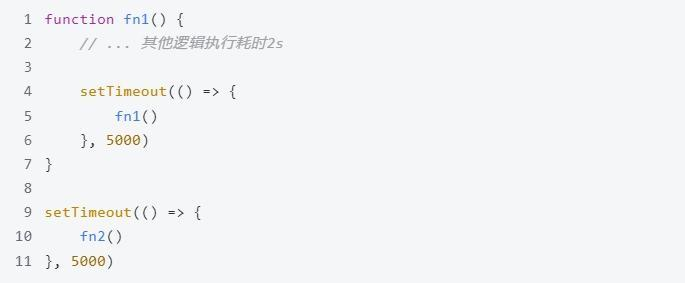
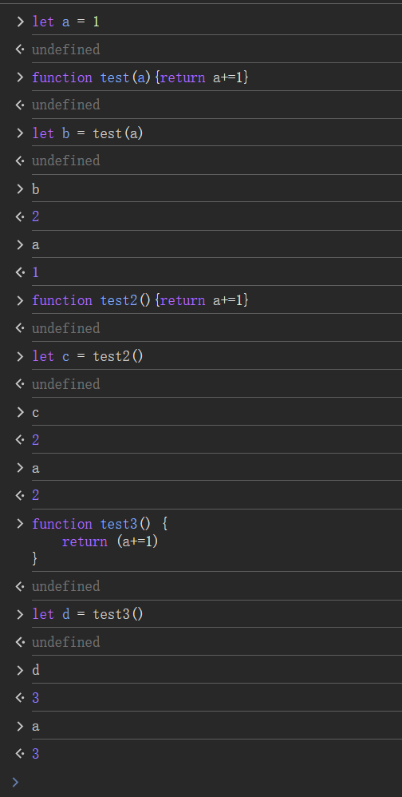

## 函数是如何生成的

在 JavaScript 中，函数是一等公民，并且可以用多种方式创建和生成。以下是生成函数的主要方式：

1. **函数声明（Function Declaration）**：

   这是最常见的定义函数的方式，通过 `function` 关键字定义。在解析 JavaScript 代码时，函数声明会被提升（hoisting）到作用域的顶部。

   ```javascript
   function add(a, b) {
       return a + b;
   }
   ```

2. **函数表达式（Function Expression）**：

   函数表达式将函数作为表达式的一部分，通常赋值给一个变量。与函数声明不同，**函数表达式不会被提升**，需要在**定义之后才能使用**。

   ```javascript
   const multiply = function(a, b) {
       return a * b;
   };
   ```

3. **箭头函数（Arrow Function）**：

   箭头函数是 ES6 引入的简化函数定义的新语法。箭头函数没有自己的 `this`、`arguments`、`super` 或 `new.target`，适合用于那些不需要这些特性的函数。

   ```javascript
   const subtract = (a, b) => a - b;
   ```

4. **构造函数（Function Constructor）**：

   JavaScript 提供了一种不太常用的方式，通过 `Function` 构造函数创建函数。这种方式把函数体作为字符串传入构造函数中，最终返回一个新的函数对象。

   ```javascript
   const divide = new Function('a', 'b', 'return a / b');
   ```

   需要注意，使用 `Function` 构造函数生成的函数是在全局作用域内执行，因此它不能访问定义它的上下文中的局部变量。这种方式也被认为是不安全的，因为它类似于 `eval`，可能导致安全和性能问题。

   `Function` 构造函数创建的函数**在其自身的全局作用域中执行**，**而不是在当前作用域中执行**。

   所以只能访问到挂在window下的变量

   demo

   ```javascript
   // Demo to experiment with Function constructor
   const divide = new Function('a', 'b', 'return a / b');
   
   console.log(divide(6, 3)); // Output: 2
   
   // Attempt to access a local variable
   var a = 10;
   const multiply = new Function('b', 'return a * b');
   try {
   	console.log(multiply(2)); // Error: a is not defined
   } catch (e) {
   	console.error(e.message); // Output: a is not defined
   }
   ```

5. **匿名函数（Anonymous Function）**：

   匿名函数是一种定义时没有命名的函数，通常以函数表达式的形式存在。这类函数尤其常见于事件处理器、回调函数和立即调用的函数表达式（IIFE）。

   ```javascript
   // IIFE 示例
   (function() {
       console.log('This is an IIFE');
   })();
   ```

### 函数生成背后的机制

- **解析和执行**：JavaScript **引擎解析代码时**，会**构建函数对象**。**函数声明被提升到作用域顶部**，可在声明之前使用；而**函数表达式只有在解析到赋值语句之后才可用**。

- **闭包（Closure）**：JavaScript **函数根据其创建的上下文形成闭包**，这意味着函数可以**“记住”其定义时的词法环境**。

- **上下文和作用域**：每个函数都**有自己的执行上下文和作用域链**。在**调用函数时**，JavaScript **创建一个新的执行上下文**，**管理函数的参数、变量和外部引用**。

## JavaScript 函数是对象吗

在 JavaScript 中，函数是一种特殊类型的对象。因为函数是对象，所以它们可以拥有属性和方法，并且可以像对象一样被操作。

### 函数作为对象的特性

1. **属性和方法**：

   - 函数**可以有自己的属性**。例如，你可以给函数添加新的属性，或者使用内建属性如 `name` 和 `length`，分别表示函数的名字和参数的个数。
   - 函数也有一些内置方法，比如 `call()`、`apply()` 和 `bind()`，这些方法允许控制函数执行的上下文（`this` 值）和参数。

2. **可以赋值给变量**：

   - 因为函数是对象，你可以将它们赋值给变量、存储在数组或对象中，甚至可以作为参数传递给其他函数（高阶函数）。

3. **可动态添加属性**：

   - 与其他对象类似，您可以在函数中动态添加和修改属性。例如：

     ```javascript
     function exampleFunction() {}
     exampleFunction.customProperty = "Hello, World!";
     console.log(exampleFunction.customProperty); // 输出: Hello, World!
     ```

4. **构造函数**：

   - 函数可以用作构造函数来创建新的对象实例，使用 `new` 关键字调用函数即可。这是原型继承的基础。

## 函数与对象之间的关系是什么？请解释原型链

在 JavaScript 中，函数与对象之间的关系主要体现在以下几个方面：

1. **函数是对象**：如前所述，函数本质上是对象，这意味着函数可以拥有属性，并且可以被操作，传递和存储。

2. **构造函数**：函数可以被用作构造函数来创建对象。当以 `new` 关键字调用一个函数时，该函数就成为一个构造函数，创建并返回一个新的对象实例。

3. **原型(prototype)**：每个函数在创建时，JavaScript 引擎会为其自动添加一个 `prototype` 属性，这个属性指向一个对象，即该构造函数的原型对象。**新的对象实例会继承这个原型对象中的属性和方法**。

### 原型链

原型链是 JavaScript 中一个强大的继承机制，用于实现对象属性的共享和方法的继承。它的工作原理如下：

1. **新对象的 `__proto__`**：当你使用 `new` 关键字创建一个对象时，Javascript 引擎会将这个新对象的 `__proto__` 属性指向构造函数的 `prototype` 对象。

2. **原型对象的构成**：若在对象中查找某属性时，找不到该属性，JavaScript 会沿着 `__proto__` 链向上查找，直到找到该属性或到达链的末尾（即 `null`）。

3. **顶层原型**：所有对象通过原型链最终都指向 `Object.prototype`，而 `Object.prototype.__proto__` 是 `null`，标志着原型链的终点。

4. **继承的实现**：通过原型链，JavaScript 实现了简单的继承机制。比如你可以定义一个构造函数的原型对象来共享方法，然后所有这个构造函数创建的实例都可以使用这些方法。

### 示例

```javascript
function Person(name) {
    this.name = name;
}

Person.prototype.greet = function() {
    console.log('Hello, ' + this.name);
};

const alice = new Person('Alice');
alice.greet();  // 输出："Hello, Alice"

// `alice`.__proto__ 指向 `Person.prototype`
console.log(alice.__proto__ === Person.prototype);  // true

// `Person.prototype`.__proto__ 指向 `Object.prototype`
console.log(Person.prototype.__proto__ === Object.prototype);  // true

// 原型链的终点是 null
console.log(Object.prototype.__proto__ === null);  // true
```

### 总结

- 函数在 JavaScript 中既是对象又是可执行代码，因此可以用作构造函数来创建对象。
- 原型链是一种基于原型的继承机制，通过它可以实现对象的方法和属性的共享。
- 每个对象都有一个内置的 `__proto__` 属性（尽管不推荐直接使用），用于访问和链接其原型对象。
- JavaScript 的灵活性和动态特性使得原型链成为一种非常强大和常用的继承模式。

## 函数如何访问原型对象

在 JavaScript 中，函数可以通过其 `prototype` 属性访问原型对象。这个 `prototype` 属性只存在于函数对象上（因为函数可以用于创建对象实例），并且它是实现 JavaScript 原型继承的关键。

### 访问原型对象的方法

以下是函数如何访问和使用其原型对象的一些示例和说明：

1. **直接访问 `prototype` 属性**：
   当你定义一个函数时，JavaScript 自动为这个函数创建一个 `prototype` 属性，默认指向一个对象。这个对象最初只有一个名为 `constructor` 的属性，该属性指向函数本身。可以直接通过函数的 `prototype` 属性来添加或修改原型对象。

   ```javascript
   function MyFunction() {}
   
   // 访问和修改 MyFunction 的原型对象
   MyFunction.prototype.sayHello = function() {
       console.log('Hello!');
   };
   
   const instance = new MyFunction();
   instance.sayHello(); // 输出: Hello!
   ```

2. **实例通过 `__proto__` 访问原型**（不推荐直接使用，仅为说明）：
   虽然 JavaScript 的实例对象会通过原型链获取原型上的属性，但它们并不会直接从构造函数中访问 `prototype`。然而，每个对象都有一个隐式的 `__proto__` 属性，指向创建该对象的构造函数的 `prototype` 对象。

   ```javascript
   const instance = new MyFunction();
   console.log(instance.__proto__ === MyFunction.prototype); // true
   ```

   这里需要注意：尽管 `__proto__` 在很多环境中可用，但它属于非标准内容。在现代 JavaScript 中，推荐使用 `Object.getPrototypeOf()` 函数来获取对象的原型。

3. **使用 `Object.getPrototypeOf()`**：
   你可以使用 `Object.getPrototypeOf(instance)` 来获取一个对象实例的原型对象，而不是直接使用 `__proto__`。

   ```javascript
   const instance = new MyFunction();
   console.log(Object.getPrototypeOf(instance) === MyFunction.prototype); // true
   ```

### 总结

- 函数的 `prototype` 属性是访问和修改原型对象的主要途径。
- 通过修改函数的 `prototype` 属性，你可以为该函数创建的所有实例共享方法和属性。
- 虽然可以使用 `__proto__` 访问实例的原型，但推荐使用更标准和安全的 `Object.getPrototypeOf()` 方法。

## Function.prototype 和 Object 之间的关系是什么

在 JavaScript 中，`Function.prototype` 和 `Object` 之间的关系涉及到 JavaScript 的原型链机制和内置对象继承结构。理解它们之间的关系有助于更好地掌握 JavaScript 的继承模型。以下是对它们之间关系的详细解释：

1. **`Function` 和 `Object` 都是构造函数**：

   - `Object` 是所有对象的原型对象，几乎所有对象（包括函数）都从 `Object.prototype` 继承。
   - `Function` 是 JavaScript 内置的构造函数，用来创建函数对象。

2. **`Function.prototype`**：

   - `Function.prototype` 是一个函数的原型对象。
   - 所有的函数（包括构造函数 `Object` 本身）都是由 `Function` 构造的，因此它们都从 `Function.prototype` 继承。这意味着所有函数都可以访问 `Function.prototype` 中定义的属性和方法（比如 `apply`、`call`、`bind` 等）。

3. **对象和函数的原型链**：

   - 函数 `Function` 本身是一个特殊的对象，因此，它也是通过 `Function` 构造的。而它的原型链向上追溯时，也指向 `Object.prototype`。
   - `Function.prototype` 是一个对象，类似于其他普通对象，它的原型（`[[Prototype]]`）也指向 `Object.prototype`。

4. **关系总结**：

   - `Object.prototype` 是 JavaScript 中原型链的顶端。所有对象最终都会在其原型链上跨过这一个原型。
   - `Function.prototype` 是构造所有函数（包括构造函数如 `Object`、`Array` 等）对象的原型。所有函数都共享 `Function.prototype` 上的方法。
   - `Function` 作为一个对象，它的原型链是这样的：
     - `Function.__proto__`（也就是 `Function.prototype`）
     - `Function.prototype.__proto__` === `Object.prototype`

这形成了一个循环自洽的关系，展示了 JavaScript 如何在原型链的顶端架构其原型继承机制。

### 举例

```javascript
console.log(Function.__proto__ === Function.prototype); // true
console.log(Object.__proto__ === Function.prototype);   // true
console.log(Function.prototype.__proto__ === Object.prototype); // true
```

这些语句印证了上述关系，说明：

- `Function` 是一个函数，它是由自身构造，因此 `Function.__proto__` 是 `Function.prototype`。
- 所有的构造函数（如 `Object`、`Array`）实际上是 `Function` 的实例。因此，`Object.__proto__ === Function.prototype`。
- `Function.prototype` 是一个普通对象，所以其原型指向 `Object.prototype`。

通过这种方式，JavaScript 实现了强大的对象和函数继承机制，使得在 ECMAScript 语言中几乎一切（包括函数）都可视为对象，并活用灵活的原型亲缘体系。

## 使用 new 一个 Class 时，如何访问它的原型对象

在 JavaScript 中，当你使用 `new` 关键字创建一个类的实例时，该实例会自动链接到类的原型对象。你可以通过实例的 `__proto__` 属性（虽然不推荐在生产中使用这个属性，因为它是非标准的）来访问实例的原型对象。此外，你还可以通过类的 `prototype` 属性直接访问类的原型对象。

以下是如何访问类的原型对象的几种方法：

### 使用 `__proto__`

这是直接从实例对象访问其内部原型链的方法：

```javascript
class MyClass {
    constructor(name) {
        this.name = name;
    }
    
    greet() {
        console.log(`Hello, ${this.name}`);
    }
}

const myInstance = new MyClass('Alice');

// 通过实例的 `__proto__` 属性访问原型对象
console.log(myInstance.__proto__ === MyClass.prototype); // true
console.log(myInstance.__proto__.greet === MyClass.prototype.greet); // true
```

### 使用 `Object.getPrototypeOf()`

推荐使用 `Object.getPrototypeOf()` 函数，因为它是标准接口，适用于获取对象的原型：

```javascript
// 更加推荐的做法
const proto = Object.getPrototypeOf(myInstance);
console.log(proto === MyClass.prototype); // true
```

### 通过类访问其原型

类定义时创建的原型对象，可以直接通过类名的 `prototype` 属性访问：

```javascript
console.log(MyClass.prototype === proto); // true
console.log(MyClass.prototype.greet); // function reference to greet
```

### 重要说明

1. **`prototype` 属性**：每个构造函数（包括类）都有一个 `prototype` 属性。这个属性指向该构造函数的原型对象。因此，类的所有实例都可以共享这个原型对象中的属性和方法。

2. **实例的原型链**：实例对象通过其内部的 `[[Prototype]]` 字段（通常被表现为 `__proto__`）指向构造该实例的函数的原型对象。这使得实例可以继承并访问构造函数原型对象中的属性和方法。

3. **`__proto__` 属性**：JS 引擎通常会在对象中拥有一个名为 `__proto__` 的属性，可以用来获取或设置对象的原型，但因为它并不是语言规范的一部分，所以不推荐在代码中直接使用。

通过以上方法，你可以在使用 `new` 关键字创建类的实例时，访问和操作类的原型对象，这通常用于理解继承、类方法共享，以及动态修改类的方法和属性等。

## for in 会遍历到原型链上的方法吗

是的，`for...in`循环**会遍历对象自身的可枚举属性以及其原型链上的可枚举属性**。这意味着在使用`for...in`循环的时候，不仅会遍历对象自身的属性，还会遍历所有继承自其原型链的可枚举属性。

### 示例：

```javascript
function Parent() {
  this.parentProp = 'parent';
}

Parent.prototype.parentMethod = function() {};

function Child() {
  this.childProp = 'child';
}

Child.prototype = new Parent();

const childInstance = new Child();

for (let key in childInstance) {
  console.log(key);
}
```

在这个示例中，`for...in`循环将输出：

```
childProp
parentProp
parentMethod
```

### 注意事项：

1. **可枚举性**：

   - 默认情况下，使用对象字面量创建的对象上的属性是可枚举的。
   - 使用`Object.defineProperty()`方法添加的属性默认是不可枚举的，除非显式将可枚举性设置为`true`。

2. **过滤原型属性**：

   - 如果只想遍历对象自身的属性，可以使用`Object.hasOwnProperty()`方法来过滤掉原型链上的属性。

     ```javascript
     for (let key in childInstance) {
       if (childInstance.hasOwnProperty(key)) {
         console.log(key);
       }
     }
     ```

   在这个修改后的循环中，只会输出：

   ```
   childProp
   ```

3. **性能与准确性**：

   - 遍历原型链上的属性，有时可能会引入不必要的属性，特别是在大型应用中，因此建议谨慎使用`for...in`循环。对于只需遍历对象自身属性的情境，`Object.keys()`或`Object.entries()`加上`forEach`循环可能是更好的选择。

## new Function创建函数和普通创建函数的区别？

### 1. 创建方式

- **`new Function` 构造器**：

  - 语法：`new Function(arg1, arg2, ..., body)`

  - 它创建一个匿名函数，当你用 `new Function` 创建函数时，你**传入的参数字符串是函数的参数列表**，**最后一个参数字符串是函数体**。

    ```javascript
    const sum = new Function('a', 'b', 'return a + b');
    console.log(sum(2, 3)); // 输出 5
    ```
  
- **普通函数声明或表达式**：

  - 语法有两种：`function name(params) { ... }`，或 `const name = function(params) { ... }`，以及箭头函数 `const name = (params) => { ... }`

    ```javascript
    function sum(a, b) {
      return a + b;
    }
    console.log(sum(2, 3)); // 输出 5
    ```

### 2. 词法环境

- **`new Function` 构造器**：

  - 使用 `new Function` 创建的函数**不在当前的词法作用域内**，它们是在全局作用域内被创建的。

  - 这意味着 `new Function` 创建的函数**无法访问外部环境中的局部变量**，**只能访问全局变量**和**传入给它的参数**。

    ```javascript
    const a = 10;
    function createFunction() {
      const b = 20;
      return new Function('return a + b'); // 不能访问b
    }
    const fn = createFunction();
    console.log(fn()); // 抛出 ReferenceError: b is not defined
    ```
  
- **普通函数声明或表达式**：

  - 函数是**在当前词法作用域内创建的**，因此**可以访问声明它们时所在作用域的变量**。

    ```javascript
    const a = 10;
    function createFunction() {
      const b = 20;
      return function() {
        return a + b; // 可以访问b
      };
    }
    const fn = createFunction();
    console.log(fn()); // 输出 30
    ```

### 3. 性能和安全

- **性能**：
  - 使用 `new Function` 对性能有一些负面影响，因为它**需要在运行时解析字符串并生成函数**。

- **安全**：
  - 使用 `new Function` 可能引入安全隐患，因为它**直接执行字符串形式的代码**，这就像 `eval` 那样，**容易受到代码注入攻击**，尤其是在处理不受信任的输入时。

### 总结

- `new Function` 主要用于在一些动态、可配置的场景中生成函数，但其不在当前的词法作用域内。
- 普通的函数创建方式更安全，性能更好，适合大多数常规编程任务。
- 尽量避免使用 `new Function` 和 `eval`，除非有特定需求和经过严格的输入控制。

## JSX和JS的区别

### JSX

1. **定义**：
   
   - JSX（JavaScript XML）是一种 JavaScript 的**语法扩展**。
   
2. **特性**：
   - **类 XML/HTML 的语法**：JSX 看起来很像 HTML 或 XML。这使得在 JavaScript 文件中编写用户界面布局变得直观。
   - **更加直观的 UI 构建**：用 JSX 可以直接在 JavaScript 中**描述 UI 组件树**，使得 UI 与逻辑紧密结合。
   - **转译阶段**：JSX 并不是原生支持的 JavaScript 代码。它**需要通过 Babel 等工具转译成标准的 JavaScript 代码**。这是因为浏览器不能直接理解 JSX 语法。
   - **表达式**：在 JSX 中可以嵌入 JavaScript 表达式，通过大括号 `{}` 包裹。
   - **组件树**：在 React 中，JSX 被用来描述组件树，利用类似 HTML 的语法定义 React 组件结构。

3. **示例**：
   ```jsx
   const element = <h1>Hello, world!</h1>;
   ```
   上面的 JSX 代码将被转译成类似如下的 JavaScript：
   ```js
   const element = React.createElement('h1', null, 'Hello, world!');
   ```

### JavaScript (JS)

1. **定义**：
   - JavaScript 是一种常规的编程语言，用于 web 开发，也适用于服务器端和桌面应用程序开发。

2. **特性**：
   - **基础语言**：它是现代 Web 浏览器中本地支持的脚本语言，用于实现动态功能。
   - **全面性**：JavaScript 拥有各种语法和特性，比如变量、条件语句、循环、函数、对象等等。
   - **与 DOM 交互**：JavaScript 可以直接操作 DOM，处理用户交互，做出动态响应。
   - **面向对象编程**：它支持原型继承和面向对象编程。
   - **无语法扩展限制**：它没有 XHTML/HTML 那样的嵌套语法限制。

3. **示例**：
   ```js
   const greeting = 'Hello, world!';
   console.log(greeting);
   ```

### 总结

- **用途**：JSX 专门用于 React 中用来描述 UI，提供了一种编写直观且紧密结合用户界面的方式。而 JavaScript 是通用编程语言，广泛应用于 web 开发。
  
- **执行**：JSX 需要转译为 JavaScript 才能被浏览器执行，而 JavaScript 可以直接运行在浏览器之中。

- **语法**：JSX 引入了类 HTML/XML 的结构到 JavaScript 中，而 JavaScript 本身则不具备这种结构。

## babel处理JSX的原理

1. **解析（Parsing）**：
   - Babel 首先使用一个解析器（如 `@babel/parser`）**将输入的 JSX 代码解析成抽象语法树**（Abstract Syntax Tree，AST）。AST 是一种树状结构，表示代码的语法结构。
   - 例如，JSX 代码 `<div>Hello, world!</div>` 会被解析成一个 AST 节点，表示一个包含文本内容的 `<div>` 元素。
2. **转换（Transforming）**：
   - Babel 使用插件（如 `@babel/preset-react`）来**遍历和修改 AST**。对于 JSX 代码，`@babel/preset-react` 插件会将 JSX 表达式转换为 `React.createElement` 调用。
   - 例如，`<div>Hello, world!</div>` 会被转换为 `React.createElement("div", null, "Hello, world!")`。
3. **生成（Generating）**：
   - 最后，Babel 使用生成器（如 `@babel/generator`）**将修改后的 AST 转换回 JavaScript 代码**。
   - 生成的代码将是标准的 JavaScript，可以在任何支持 ES5 的环境中运行。

## HTML解析过程中它里面的什么操作脚本文件会阻塞DOM的树的渲染

在 HTML 解析过程中，内嵌在 `<script>` 标签中的脚本文件会阻塞 DOM 树的渲染。具体的机制如下：

1. **解析过程**：浏览器从上到下顺序解析 HTML 文档。当遇到 `<script>` 标签时，默认情况下会暂停解析，先下载并执行脚本，然后再继续解析后续内容。

2. **阻塞原因**：因为 JavaScript 可以通过操控 DOM 来改动页面结构，浏览器需要先执行这些脚本以确保页面按预期展示。比如，脚本可能会插入新的元素或者修改现有元素的属性。

3. **同步（默认）脚本**：没有任何属性标记的普通 `<script>` 标签会导致阻塞行为，因为浏览器必须等待脚本执行完毕。

为了解决脚本阻塞的问题，可以考虑以下优化方案：

- **`defer` 属性**：对于 `<script>` 标签，添加 `defer` 属性，意味着脚本会在文档解析完毕后执行，而顺序执行多个含 `defer` 的脚本。`defer` 适用于不依赖 DOM 内容就绪的脚本。

- **`async` 属性**：添加 `async` 属性让脚本异步加载和执行。它表示脚本与文档的解析是并行进行的，适用独立于其他脚本的脚本任务。然而，脚本的执行顺序不固定。

通过合理使用 `defer` 和 `async`，可以减少脚本对页面渲染的阻塞影响，从而提升页面加载性能。

## typeof底层原理、instanceof原理

### `typeof`

它的底层原理是通过**检查值的内部标签来确定其类型**。以下是 `typeof` 操作符返回的可能值：

- `"undefined"`: 如果值未定义。
- `"boolean"`: 如果值是布尔类型。
- `"number"`: 如果值是数字类型。
- `"string"`: 如果值是字符串类型。
- `"object"`: 如果值是对象类型或 `null`。
- `"function"`: 如果值是函数类型。
- `"symbol"`: 如果值是符号类型。
- `"bigint"`: 如果值是大整数类型。
  - `BigInt` 可以表示任意精度的整数，但不能表示任意精度的浮点数

**特殊情况**：对于 `null`，`typeof` 返回 `"object"`。这是历史遗留问题，是因为在 JavaScript 初期的实现中，使用了固定大小的标签存储对象类型，而 `null` 被认为是零标签对象。

### `instanceof`

用于检查一个对象是否是某个构造函数的实例。它的底层原理是通过检查对象的原型链来确定的。

具体来说，`instanceof` 操作符会检查对象的原型链，看是否有一个原型与构造函数的 `prototype` 属性相同。如果找到匹配的原型，则返回 `true`，否则返回 `false`。

**基本原理**：

- 当 `instanceof` 被用在表达式中，首先会获取构造函数的 `prototype` 属性。
- 然后，顺着对象的原型链（通过 `Object.getPrototypeOf` 或 `__proto__`），对比每一层对象的原型是否等于 `Constructor.prototype`。
- 如果匹配成功，则返回 `true`，否则继续向上查找直到原型链的末端。
- 如果到达 `null` 仍未匹配到，则返回 `false`。

**特殊情况**：如果用于检测非对象类型，比如基本数据类型数字、字符串等，`instanceof` 会返回 `false`，因为这些类型没有原型链。

## 前端性能分析有哪些指标

### 1. 首屏时间（First Contentful Paint, FCP）
- **含义**：用户**首次看到页面内容的时间**。
- **衡量**：从页面开始加载到页面内容元素（如文本、图片）首次出现在屏幕上的时间。

### 2. 首字节时间（Time to First Byte, TTFB）
- **含义**：浏览器在发送请求后，从**服务器接收第一个字节的时间**。
- **衡量**：从浏览器请求发出到接收第一个字节响应的时间。

### 3. 首次绘制（First Paint, FP）
- **含义**：**浏览器在屏幕上绘制任何像素的时间点**。
- **衡量**：从导航开始到浏览器首次在屏幕上绘制任何视觉变化的时间。

### 4. 交互时间（Time to Interactive, TTI）
- **含义**：**页面变得完全可交互的时间点**。
- **衡量**：从导航开始到页面可可靠地响应用户输入的时间。

### 5. 完全加载时间（Load Time）
- **含义**：页面所有资源（包括图像、样式表、JavaScript）完全加载的时间。
- **衡量**：从导航开始到页面中的所有资源加载完毕的时间。

### 6. 首次意义性绘制时间（Largest Contentful Paint, LCP）
- **含义**：**页面主内容展示所需的加载时间**。
- **衡量**：从页面开始加载到最大的内容元素（如大型图像或块级文本）的渲染时间。

### 7. 持续阻塞时间（Total Blocking Time, TBT）
- **含义**：从 FCP**（首次内容绘制）到 TTI（可交互）的时间之间，阻塞主线程的时间总和**。
- **衡量**：这段时间中超过 50 毫秒的所有长任务的时间总和。

### 8. 累积布局偏移（Cumulative Layout Shift, CLS）
- **含义**：页面**加载期间视觉内容的稳定性**。
- **衡量**：在页面加载过程中，任何未预期页面布局变化的总和。

### 9. JavaScript 执行时间
- **含义**：关键 JavaScript 文件加载和执行所需的时间。
- **衡量**：解析和执行 JavaScript 的时间。

### 10. 资源大小和数量
- **含义**：页面加载的所有资源的总大小和请求数量。
- **衡量**：页面加载的总字节数和请求的总数。

### 11. 缓存利用率
- **含义**：利用浏览器缓存加载页面资源的比例。
- **衡量**：缓存命中率和缓存资源加载的性能影响。

### 12. DOM 解析时间（DOM Content Loaded, DCL）
- **含义**：浏览器完全解析 HTML 文档并构建 DOM 树的时间。
- **衡量**：从导航开始到 DOMContentLoaded 事件触发的时间。

### 13. CSS 解析时间
- **含义**：样式表（CSS）加载和解析所花费的时间。
- **衡量**：CSS 文件完全加载和解析完成的时间。

### 14. 链接和脚本阻塞时间
- **含义**：阻塞浏览器渲染的外部脚本和链接加载时间。
- **衡量**：阻塞资源的总加载和执行时间。

### 15. 网络请求时间（Network Request Time）
- **含义**：个别网络请求的时间，包括 DNS 查找、连接时间、TLS 握手时间等。
- **衡量**：总请求时间以及各部分的具体时间。

### 16. 图片和媒体加载时间
- **含义**：页面中所有图片和其他媒体文件的加载时间。
- **衡量**：各个图像和媒体资源加载完成所需的总时间。

### 17. 脚本错误率
- **含义**：前端脚本执行期间发生错误的比例。
- **衡量**：脚本错误的总数和错误率。

### 18. 用户交互延迟（Input Delay）
- **含义**：用户进行输入或点击操作到页面实际响应的时间。
- **衡量**：用户交互和页面响应之间的时间差。

### 19. 渲染帧率（Frames Per Second, FPS）
- **含义**：页面在浏览器中渲染帧的速率。
- **衡量**：每秒钟渲染的帧数，通常期望保持在 60 FPS 以上以确保流畅的用户体验。

### 20. 内存使用（Memory Usage）
- **含义**：浏览器在加载和运行页面时使用的内存数量。
- **衡量**：总内存使用量和峰值内存使用量。

全面的前端性能分析需要结合多个指标，通过工具如 Google 的 Lighthouse、WebPageTest、Chrome DevTools、Performance 很多监控服务和工具来获得这些指标，并不断优化和改进，以提供最佳的用户体验。

## js的变长数组在内存里是怎么做的

### 内存管理和变长数组实现

JavaScript 数组在底层通常由动态数组或哈希表实现，取决于浏览器的 JavaScript 引擎（例如，Google Chrome 的 V8 引擎、Mozilla Firefox 的 SpiderMonkey 引擎等）。以下是变长数组内存管理的一般思路：

1. **初始分配和扩展策略**
   - 数组在首次创建时，JavaScript 引擎通常为其分配一个初始容量。这可能是某个固定值，或者根据初始元素的数量设定。
   - 当数组的**元素数量超过当前分配的容量时**，JavaScript 引擎通常会以某种增长因子来扩展数组的容量。**常见的策略是容量翻倍**，这样可以减少频繁的内存重新分配。

2. **内存重新分配**
   - 当需要**扩展数组容量时**，JavaScript 引擎会**分配一块新的、更大的内存区域，并将现有元素复制到新区域中**。旧的内存区域则可能会被释放或留下备用。
   - 这种方式保证了数组的连续性，但会涉及一定的内存复制操作。

3. **稀疏数组和哈希表**
   - 对于稀疏数组（即大多数元素为空的数组），JavaScript 引擎可能会使用哈希表或其他非线性结构来存储元素，以提高内存使用效率。
   - 哈希表实现允许在不连续的情况下高效存储和查找元素，但这会牺牲一些顺序操作的性能。

### JavaScript 数组的底层优化

不同的 JavaScript 引擎对数组的优化策略有所不同，但通常有以下几种：

1. **元素类型优化**
   - 如果数组中的元素类型一致（如全是整数），引擎可能会使用更高效的存储方式。这称为“紧凑（packed）”数组。
   - 一旦数组中出现不同类型的元素，引擎可能会将数组转换为“松散（unpacked）”数组，允许任意类型的元素混合存储，但会消耗更多内存和降低访问速度。

2. **数组模式识别**
   - 引擎会根据数组的使用模式进行优化。比如，如果数组只用于添加和遍历，可能会采用连续内存块存储。如果频繁进行删除或随机访问，可能会选择哈希表等非连续存储方式。

### 示例和内存变化

假设有一个简单的 JavaScript 程序：

```javascript
let arr = [];
for (let i = 0; i < 100; i++) {
    arr.push(i);
}
```

这种情况下，JavaScript 引擎可能采取以下步骤：

1. 初始化 `arr`，分配一个初始容量（比如 4 个元素）。
2. 随着元素不断 `push` 进数组，当元素数量超过容量时（如第 5 个元素），引擎会分配一个更大的内存块（通常容量翻倍，如扩展到 8 个元素），并将现有元素复制到新的内存块中。
3. 继续 `push` 时，如第 9 个元素，容量再次扩充至 16 个元素，以此类推。

总结而言，JavaScript 的变长数组在内存中的处理涉及动态分配、扩展策略和优化存储。尽管不同的引擎实现细节可能有所不同，但总体思路一致：通过动态分配和优化策略，提供高效且灵活的数组实现。

## 前端性能优化方式

### 1. 代码优化

**1.1 减少HTTP请求**
- 合并CSS和JavaScript文件。
- 使用CSS Sprites，将多个小图片合并成一张图片，通过背景定位展示不同的部分。

**1.2 压缩和最小化资源文件**
- 使用工具（如UglifyJS、Terser、cssnano等）压缩和最小化CSS、JavaScript和HTML文件。

**1.3 移除不必要的代码**
- 删除未使用的CSS样式和JavaScript代码。

**1.4 使用异步和延迟加载**
- 对于非关键资源（如第三方脚本、广告等），使用`async`或`defer`属性延迟加载JavaScript文件。
- 对于图片、视频等资源，使用懒加载技术（Lazy Loading）。

### 2. 资源优化

**2.1 图片优化**
- 使用合适的图片格式（如WebP、JPEG、PNG等），根据具体场景选择适当的格式。
- 使用工具（如ImageOptim、TinyPNG等）对图片进行压缩。
- 使用响应式图片技术，为不同设备提供合适尺寸的图片（使用``和`<picture>`标签）。

**2.2 使用字体优化**
- 合理选择和使用Web字体（Web Fonts），避免加载过多字体文件。
- 使用`font-display`属性优化字体加载策略，例如使用`swap`或`optional`。

### 3. 网络优化

**3.1 启用内容分发网络（CDN）**
- 使用 CDN 加速静态资源（CSS、JavaScript、图片等）的加载，缩短资源加载时间。

**3.2 启用HTTP/2**
- 使用HTTP/2协议，使多路复用和服务器推送等功能，提高传输效率。

**3.3 使用缓存**

- 设置适当的缓存策略（如使用`Cache-Control`、`Etag`、`Last-Modified`等头部），避免重复加载资源。
- 使用服务工作者（Service Worker）实现离线缓存和预缓存。

### 4. 渲染优化

**4.1 优化关键渲染路径**
- 将关键CSS放在页面顶部（`<head>`），防止重绘和重排阻塞。
- 将非关键的JS文件放置在页面的底部或使用`async`/`defer`属性。

**4.2 减少DOM操作**
- 合理使用虚拟DOM（如React）或最小化真实DOM操作，以减少渲染时间。

**4.3 使用CSS3过渡和动画**
- 使用CSS3硬件加速过渡和动画（如`transform`和`opacity`），减少对主线程的压力。

**4.4 避免大型复杂布局**
- 将复杂的CSS和JavaScript计算移到GPU或专用的线程。

### 5. 服务器优化

**5.1 启用压缩**

- 使用Gzip或Brotli等压缩传输文件，减少传输数据量。

**5.2 优化服务器响应时间**

- 优化服务器端性能，减少请求响应时间（TTFB，Time to First Byte）。

### 6. 数据优化

**6.1 减少和优化数据请求**
- 对于需要与服务器频繁通信的页面，使用WebSocket、Server-Sent Events等技术代替轮询。
- 合理使用GraphQL或适当的API接口，减少数据传输冗余。

### 7. 加载顺序和预加载

**7.1 预加载关键资源**
- 使用`<link rel="preload">`、`<link rel="prefetch">`标签预加载或预获取关键资源。

**7.2 使用DNS预解析**
- 使用`<link rel="dns-prefetch">`提前解析第三方资源域名，减少DNS查找时间。

### 工具和监测

**7.1 使用性能工具**
- 使用工具（如Google Lighthouse、WebPageTest、GTmetrix等）分析和监测页面性能。
- 使用浏览器开发者工具（如Chrome DevTools）实时监测页面性能。

**7.2 实时性能监控**
- 部署实时性能监控工具（如New Relic、Pingdom等），监控和记录用户实际访问情况。

### 示例代码：懒加载图片

```html
<!-- HTML5内置的懒加载属性 -->

```

### 示例代码：CSS压缩和最小化

使用`cssnano`压缩CSS：

```bash
npx cssnano src/styles.css dist/styles.min.css
```

## try...catch可以捕获promise的异常吗

不能

###  捕获异步操作中的异常

对于异步代码，例如 Promise，`try...catch` 需要与 `async`/`await` 关键字结合使用：

#### 使用 async/await 捕获 Promise 异常

通过将异步操作放在 `async` 函数中，可以使用 `try...catch` 捕获其中的异常。

```javascript
async function asyncFunction() {
  try {
    let result = await someAsyncFunction();
  } catch (error) {
    console.error("Error caught:", error);
  }
}
```

####  使用 .catch() 方法捕获 Promise 异常

对于不使用`async`/`await` 的场景，可以使用 Promise 本身提供的 `.catch()` 方法来捕获异常。

```javascript
someAsyncFunction()
  .then(result => {
    // 处理结果
  })
  .catch(error => {
    console.error("Error caught:", error);
  });
```

## 中null和undefined的区别

#### `undefined`

- **类型**：`undefined` 是一个原始数据类型。
- **含义**：表示变量已被声明但尚未被赋值。
- **默认值**：当函数没有返回值时，默认返回 `undefined`。当对象属性不存在时，默认值也是 `undefined`。
- **自动赋值**：声明但未初始化的变量会自动被赋予 `undefined`。

#### `null`

- **类型**：`null` 也是一个原始数据类型。
- **含义**：表示一个有意为之的空值或不存在的对象。
- **显式赋值**：通常由程序员显式地赋值给变量，表示该变量没有值或不应该有值。

#### 相等性比较

- `null == undefined` 返回 `true`，因为它们在松散相等（`==`）比较中被视为相等。
- `null === undefined` 返回 `false`，因为它们在严格相等（`===`）比较中被视为不同的值。

## null和空对象的区别

在内存层面理解，在**声明为一个空对象的时候**，照样会在**堆内存中开辟一个内存空间**，**声明为null的时候**，这个**引用会指向一个0x0的内存位置**，**不会在堆内存中创建一个内存空间**。

在**转换为布尔值的时候**，**空对象会转换为true**，而**null会转换为false**

## 解析html时遇到script脚本会怎么处理

### 基本文档解析过程

1. **暂停解析**：
   当浏览器解析 HTML 文档并遇到 `<script>` 标签时，它会**暂停进一步解析当前的 HTML 文档**，**直到脚本执行完毕**。这是**为了确保脚本能够及时修改 DOM 结构**。

2. **下载脚本内容**：
   - 若 `<script>` 标签**包含** `src` 属性，则浏览器需要**先下载外部脚本文件**。
   - 若 `<script>` 标签**没有** `src` 属性，而是**内联脚本代码**，则**直接解析和执行其中包含的 JavaScript 代码**。

3. **执行脚本**：
   **下载完成或遇到内联 JavaScript** 时，**浏览器会将代码传递给 JavaScript 引擎**（如 V8、SpiderMonkey 等）并**立即执行**。

### 处理顺序和封锁行为

关于脚本的下载和执行，会有以下几种情况：

1. **同步脚本（默认行为）**：
   ```html
   <script src="example.js"></script>
   ```
   - 单独且逐个下载和执行脚本。
   - 当前解析行为会暂停，直至脚本下载和执行结束。

2. **异步脚本 (`async` 属性)**：
   ```html
   <script src="example.js" async></script>
   ```
   - 脚本内容会异步下载，不会阻塞后续文档解析。
   - 下载完成后会立即执行，但并不保证顺序。

3. **延迟脚本 (`defer` 属性)**：
   ```html
   <script src="example.js" defer></script>
   ```
   - 脚本内容异步下载，文档解析不会被阻塞。
   - 全部 HTML 解析完成后，按原标签顺序执行脚本。

### 特殊情况和合并下载

1. **内联脚本**：
   ```html
   <script>
     console.log('This is an inline script.');
   </script>
   ```
   - 无需下载，直接传递给 JavaScript 引擎执行。

2. **外部和内联的组合**：
   同时存在外部和内联的情况，浏览器会分别处理，外部下载后执行，内联的立即执行。

3. **使用动态脚本加载**：
   - 动态脚本创建可以通过 JavaScript 内部创建 `<script>` 标签并加入 DOM 树。
   ```javascript
   let script = document.createElement('script');
   script.src = 'dynamic.js';
   document.body.appendChild(script);
   ```
   - **这种方式加载的脚本通常异步执行，不会封阻文档解析**。

### 特别注意点

1. **文档解析暂停**：
   若脚本执行耗时长或依赖外部资源时，会直接影响用户体验。
2. **DOM Ready 和脚本顺序**：
   同步脚本在 DOM 构建前执行，`defer` 确保顺序而 `async` 则随时执行。

## script标签中不用defer或async，想不阻塞DOM的解析该怎么做

### 1. 将脚本放在文档底部
将 `<script>` 标签放在文档的底部，即 `</body>` 标签之前。这样可以确保在脚本执行之前，大部分的 DOM 已经被解析和渲染。

### 2. 使用 `DOMContentLoaded` 事件
在脚本中监听 `DOMContentLoaded` 事件，确保脚本在 DOM 完全加载后再执行。

```html
<!DOCTYPE html>
<html lang="en">
<head>
    <meta charset="UTF-8">
    <meta name="viewport" content="width=device-width, initial-scale=1.0">
    <title>Document</title>
</head>
<body>
    <!-- 页面内容 -->
    <script>
        document.addEventListener('DOMContentLoaded', function() {
            // 你的脚本逻辑
            console.log('DOM fully loaded and parsed');
        });
    </script>
</body>
</html>
```

### 3. 动态创建脚本元素
通过 JavaScript 动态创建并插入 `<script>` 元素，这样可以控制脚本的加载时机，不会阻塞 DOM 解析。

```html
<!DOCTYPE html>
<html lang="en">
<head>
    <meta charset="UTF-8">
    <meta name="viewport" content="width=device-width, initial-scale=1.0">
    <title>Document</title>
</head>
<body>
    <!-- 页面内容 -->
    <script>
        function loadScript(url) {
            const script = document.createElement('script');
            script.src = url;
            document.body.appendChild(script);
        }

        document.addEventListener('DOMContentLoaded', function() {
            loadScript('script.js');
        });
    </script>
</body>
</html>
```

### 4. 使用 `window.onload` 事件
虽然 `window.onload` 事件会在所有资源（包括图片、样式表等）加载完成后才触发，但它可以确保脚本在页面完全加载后再执行。

### 5. 使用 `requestAnimationFrame`
`requestAnimationFrame` 可以确保脚本在下一个重绘周期之前执行，不会阻塞 DOM 解析。

## script标签中带defer或async属性一般会在什么情况下使用

### `defer` 属性

#### 用途和效果

- **异步加载脚本**：指定了 `defer` 属性的脚本会异步下载，不会阻塞 HTML 的解析。
- **顺序执行**：虽然脚本是异步加载的，但在所有 `defer` 脚本下载完成后，按照它们在 DOM 中的顺序执行。
- **执行时机**：`defer` 脚本会在 HTML 解析完成后、“DOMContentLoaded”事件触发前执行。

#### 适用场景

1. **依赖 DOM 内容的脚本**：
   - 适用于需要操作 DOM 但不急于立即执行的脚本。
   - 例如：初始化界面元素、设置事件监听器等。

2. **多个脚本依赖顺序**：
   - 如果有多个脚本，它们的执行顺序非常重要。
   - 例如：库文件（如 jQuery）+ 自定义脚本，确保库文件先被执行。

#### 示例

```html
<!DOCTYPE html>
<html lang="en">
<head>
  <meta charset="UTF-8">
  <meta name="viewport" content="width=device-width, initial-scale=1.0">
  <title>Defer Example</title>
  <script src="library.js" defer></script>
  <script src="main.js" defer></script>
</head>
<body>
  <h1>Hello, World!</h1>
</body>
</html>
```

在上例中，`library.js` 会先于 `main.js` 执行，尽管它们是异步加载的。

### `async` 属性

#### 用途和效果

- **异步加载脚本**：指定了 `async` 属性的脚本也会异步下载，不会阻塞 HTML 的解析。
- **即时执行**：脚本下载完成后立即执行，不考虑它在 DOM 中的顺序。
- **适用于独立脚本**：由于执行顺序不保证，因此适用于无需依赖其他脚本或 DOM 的独立脚本。

#### 适用场景

1. **独立的、无需依赖的脚本**：
   - 例如：广告、分析工具、社交媒体按钮等。
   - 这些脚本通常与其他脚本无依赖关系，立即执行即可。

2. **提高页面加载速度**：
   - 在确保脚本独立的前提下使用 `async` 属性，可以显著提高页面加载速度。

#### 示例

```html
<!DOCTYPE html>
<html lang="en">
<head>
  <meta charset="UTF-8">
  <meta name="viewport" content="width=device-width, initial-scale=1.0">
  <title>Async Example</title>
  <script src="analytics.js" async></script>
  <script src="ads.js" async></script>
</head>
<body>
  <h1>Hello, World!</h1>
</body>
</html>
```

在这个例子中，`analytics.js` 和 `ads.js` 会尽快加载和执行，以便尽早获取用户数据和展示广告，不会彼此或与其他脚本互相阻塞。

### `defer` vs `async`

| 属性    | 加载方式 | 执行时机               | 适用场景                                  |
| ------- | -------- | ---------------------- | ----------------------------------------- |
| `defer` | 异步下载 | 文档解析完毕后，按顺序 | 需要操作 DOM，确保脚本顺序的操作          |
| `async` | 异步下载 | 下载完成后立即执行     | 独立的脚本，无需依赖其他脚本或者 DOM 结构 |

### 总结

- **`defer`**：适用于需要等待完整的 HTML 解析后但又需要按顺序执行的脚本。
- **`async`**：适用于独立、无依赖性，且无需等待全部 HTML 解析的脚本。

## 事件委托能够解决什么问题

事件委托是一种常用的高级事件处理机制，利用事件冒泡的特性来管理事件。通过**将子元素的事件处理绑定到父元素上**，而不是为每个子元素单独绑定，可以解决许多性能和代码维护性的问题。以下是事件委托能够解决和优化的一些问题：

### 1. **性能优化**

- **减少内存消耗**: 为大量子元素单独添加事件监听器可能会占用更多的内存，事件委托通过减少事件监听器的数量来优化内存使用。
- **提升页面加载速度和运行效率**: 通过减少事件监听器的绑定数量，可以提高页面的加载速度和响应效率。

### 2. **动态元素处理**

- **处理新添加的元素**: 如果在 DOM 中动态添加元素，事件委托可以自动处理这些新元素的事件，而不需要重新绑定事件监听器。
- **适应 DOM 结构的变化**: 由于事件委托使用父元素来监听事件，即使子元素被删除或重新创建，父元素的事件处理依然有效。

### 3. **代码简化和可维护性**

- **简化代码**: 通过将事件处理聚合到父元素上，代码结构更加简单、清晰，易于管理。
- **增强可维护性**: 当需要更改事件处理逻辑时，只需修改父元素的事件处理器，无需逐一修改每个子元素。

### 4. **解决事件绑定** 

- **减少绑定错误**: 在大型复杂 DOM 结构中，通过事件委托可以避免对每个元素错误地绑定或重复绑定事件。
- **避免内存泄漏**: 在频繁增删 DOM 元素的情况下，事件委托可以帮助减少内存泄漏，因为父元素只需一个事件监听器。

### 5. **事件冒泡处理**

- **统一事件处理逻辑**: 在冒泡阶段处理事件，父元素可以通过分析事件目标(`event.target`)来识别哪个具体的子元素触发了事件，从而执行特定的逻辑。
- **提高用户交互体验**: 由于事件委托减少了绑定事件的数量，交互响应可以更为迅速和平滑。

### 示例用法

```javascript
// 假设有一个包含多个按钮的列表，我们希望对每个按钮的点击事件进行处理
document.querySelector('#parentElement').addEventListener('click', function(event) {
    if (event.target && event.target.nodeName === 'BUTTON') {
        // 处理按钮点击事件
        console.log('Button clicked:', event.target);
    }
});
```

在这个例子中，我们只在父元素上绑定了一次点击事件处理器，通过检查 `event.target` 来确定实际触发事件的元素，而不需要在每个按钮上单独绑定事件处理器。

## map和foreach的区别

**map()** 和 **forEach()** 都是 JavaScript 数组方法，用于迭代数组元素，但它们在功能和返回值方面有所不同。

**1. 返回值：**

- **map()** 返回一个**新数组**，其中包含对原始数组中每个元素执行回调函数后的结果。
- **forEach()** **不返回值**（返回 `undefined`），它只是对数组中的每个元素执行回调函数。

**2. 用途：**

- **map()** 用于**转换**数组，创建一个新数组，其中包含原始数组元素的修改版本。
- **forEach()** 用于对数组中的每个元素执行**副作用**操作，例如打印、修改外部变量或进行 API 调用。

**3. 可链接性：**

- **map()** 是**可链接的**，因为它返回一个新数组，可以在其上调用其他数组方法。
- **forEach()** **不可链接**，因为它不返回值。

**总结：**

| 特性     | map()    | forEach()  |
| -------- | -------- | ---------- |
| 返回值   | 新数组   | undefined  |
| 用途     | 转换数组 | 执行副作用 |
| 可链接性 | 可链接   | 不可链接   |

## 字节面经

先是个人介绍，这个面试官比较直接，在我介绍到第一个项目的时候就开始问问题了，后面就直接开始拷打项目了，没让我接着往下讲。不得不说，这个面试官的风格就是极具侵略性，会对着你的一个失误猛攻，有些人可能会慌，我的经验就是平常心对待，反正我就是个正常人，我又不是超人，犯错是很正常的事情罢了。

1. Vue-Router的几种路由方式
   1. hash模式和history模式
2. SPA是什么，和MPA的区别，有什么缺点？怎么优化？
   1. 单页面应用/切功能不需要跳页面/首屏速度慢/SSR
3. 为什么SSR可以优化，别的不可以吗？
   1. SPA慢是因为渲染需要js参与，SSR通过服务器直接渲染拿到html，从而加速了访问
   2. SSR是针对SPA做的优化，别的当然也可以，比如CDN/减少静态资源大小/雪碧图/减少CSS和JS对DOM构建的阻塞
4. 还有什么优化的释放，比如我首屏不需要的东西可以不可以异步加载？
   1. 懒加载，Vue-Router 直接在component后面写箭头回调import；React直接用一个lazy包一个import回调
5. 你提到了尽可能减少对DOM的阻塞，什么会阻塞DOM构建？
   1. CSS 和没有 defer/async 标签的 JS
6. 向后端发请求的时候，经常会遇到先选一个选项发请求，这个请求可能有一段时间才能相应，然后又选了另一个选项，你怎么保证我的数据是正确的？
   1. 请求是可以打断的，比如fetch可以通过AbortController中断请求，然后去发最新的请求就行了
7. 有了解过他是怎么实现的吗？
   1. 就是跟拿到timeoutId去clearTiemout类似，拿到一个句柄，就可以给他发信号让他切断
   2. **"`AbortController` 的工作原理是通过创建一个控制器和信号 (`AbortSignal`) 来实现。你可以将这个信号传递给 `fetch` 请求或其他支持中断的异步操作。当你调用 `AbortController.abort()` 时，传递的 `AbortSignal` 会触发中断信号，导致异步操作立即停止，并通常会抛出一个 `AbortError` 异常。"**
8. 如果不用 axios，只让你用HTTP Request，你如何实现？
   1. 用 Promise 封装一下，http request正常返回的时候就resolve，然后有异常就reject
9. 看到你移动端布局使用了tailwindCSS，为什么要用这个？
   1. 写起来比较简单，不用想类名，然后写起来读起来都比较清晰，开发效率会更高
10. 没有缺点吗？
    1. 从性能上，他最坏不会坏过原生的 CSS，加上他本身是一个 css 的预处理器，可以获得很多预处理器带来的性能提升，比如自动移除未使用的类，打包后更小的css文件体积等
    2. 从人为因素上来讲，tailwindCSS 可能会间接地让部分开发者写很长的classname，从而降低代码的可读性
11. 你的布局里用了flex和grid，为什么用这些？
    1. grid 主要用来实现一些异形卡片布局，比如我可能要1*2,2*1,2*2的卡片，这样的布局用grid写起来会非常方便
    2. flex 作为现代的弹性布局方式，在对齐、多列布局方面非常方便
    3. 配合css的媒体查询去做移动端的响应式布局
12. 有没有了解过其他的响应式布局方式？
    1. 还可以通过UA来判断用户设备，然后返回不同的布局
13. 那这个布局是如何转换的？
    1. 聊了一些vw、vh、rem之类的方式
14. 下面是无聊的八股部分
    1. css如何局中一个元素
    2. 定位/浮动/BFC
15. 为什么从今年的1月份到现在做了这么多项目？
    1. 因为要学习，要找工作😅
16. CDN解决什么问题？
    1. 静态资源加载缓慢
17. 浏览器渲染网页的过程
    1. 八股复读
18. js的代码输出题，常规的宏任务/微任务事件循环考察
19. async await 背后的具体实现有了解过吗？
    1. 就是Promise的语法糖，可以等价的转化为Promise.then之类的，但是面试官对这个答案不是很满意，说你这个是用法，不是原理
    2. **我猜他想听：`async` 函数是返回一个 `Promise` 的函数。即使函数内部没有显式地返回 `Promise`，也会自动将返回值包装成 `Promise` ；`await` 会暂停 `async` 函数的执行，直到 `Promise` 被解析（即变为成功或失败），然后恢复函数的执行，并返回 `Promise` 的结果。如果 `Promise` 被拒绝，`await` 表达式会抛出异常，这可以通过 `try/catch` 块来捕获。**
20. 手撕：最长公共前缀
21. 继续八股：
    1. 常见的数据结构/特性/用法/场景
    2. js里的数据类型/复杂类型和简单类型的区别
    3. 值传递和引用传递的区别
    4. 事件冒泡/可以用这个机制实现什么？（事件代理）
22. 看你这里手写了一个进度条，如果需要你将其封装成一个通用的组件，你怎么写？
    1. 一开始说了自定义hooks，后来聊下来发现其实介绍一个prop作为百分比然后更新就行了
23. 然后面试官就开始拷打，说你为什么一上来就说自定义hooks？
    1. 我就花了不到3s思考这个问题，难免有不周到的地方，实际开发过程中肯定有更充足的思考时间（这个面试官问的非常有侵略性，但我还是努力在反驳，我觉得几秒钟的考虑时间有点失误也很正常吧）
24. 继续延伸，如果你想让这个组件支持自定义样式，你该如何实现？
    1. 拿一个属性去接受className就行了
25. 然后又开始跟我纠结为什么不是style而是className，我怎么知道用户一定就用tailwindCSS？
    1. 反正你拿两个属性都接受不就完了吗，支持tailwindCSS是个额外的feature，大不了你不用呗
26. 当你封装一个组件的时候，最重要的是什么？
    1. 高内聚，低耦合（面试官觉得太虚了，让我细说）根据Vue官方文档的推荐，你的组件应该提供详细的props的类型定义甚至validator，因为你的props的定义其实就是你的组件的使用文档
27. 你的项目上提了一些性能指标，都是什么意思，什么问题会导致某个指标高，如何优化？
    1. 八股复读
28. 那这些优化你有实现过吗？
    1. 我写的这些网页都比较简单，所以没有做过具体的性能优化
29. 那你为什么要写这个性能指标？
    1. 因为我care性能
30. 你care性能为什么不去优化他，那你关心他干嘛？
    1. 因为我不去优化是因为我认为他足够好，而不是我不知道性能可以优化
31. 你如何做性能分析？
    1. lighthouse/performace
32. JS 里捕获异常的方式有哪些呢？
    1. try/catch Promise.catch之类的
33. 你说的都是局部的，我不可能每个地方都try/catch吧
    1. 我一开始说的高阶组件，面试官又问说那我不用框架呢
    2. 那你最上层try/catch呗
    3. **可以用一些全局异常捕获的api，比如window.onerror, window.onunhandledrejection**

## async await 背后的具体实现有了解过吗？

`async/await` 是 JavaScript 中用于处理异步操作的语法糖，它们基于 `Promise`，使得异步代码看起来像同步代码，增强了代码的可读性和可维护性。为了更好地理解`async/await`的具体实现，我们需要深入了解它的工作原理和底层机制。

### 背景知识

#### Promise
在了解 `async/await` 之前，需要熟悉 `Promise`，它是一种用于处理异步操作的模式，包含三个状态：
- **Pending**（进行中）：初始状态，既不是成功也不是失败。
- **Fulfilled**（已成功）：操作成功完成。
- **Rejected**（已失败）：操作失败。

#### Generator 函数
`async/await` 的实现与 ES6 中的 Generator 函数密切相关。Generator 函数是一个`可以在执行过程中暂停和恢复的函数`形式。它使用 `function*` 语法定义和 `yield` 关键字控制执行。

```javascript
function* generatorFunction() {
  console.log('Start');
  yield 'paused at first yield';
  console.log('Resume');
  yield 'paused at second yield';
  console.log('Finish');
}

const gen = generatorFunction();
console.log(gen.next());
console.log(gen.next());
console.log(gen.next());
```

### async/await 的具体实现

在 JavaScript 引擎内部，`async/await` 通过生成器和 Promise 实现。以下是一个简化的解释：

1. **将 `async` 函数转换为一个内置 Generator 函数**：当 JavaScript 遇到 `async` 关键字时，它会将函数转换为一个生成器函数，这个生成器函数在内部使用 `try-catch` 语句来处理错误，并在需要等待的地方使用 `yield` 语句。

2. **自动调用生成器**：每次 `await` 遇到 `Promise`，JavaScript 引擎会暂停生成器的执行，直到 `Promise` 解决（fulfilled 或 rejected）。`await` 关键字会暂停函数的执行并返回 Promise 的结果。

3. **处理 Promise 的结果或错误**：通过内部机制捕获生成器的值并推进到下一个 `yield`，直到生成器完成。对于未完成的 Promise，它将继续等待，直到状态变为 fulfilled 或 rejected。

### 用 Generator 模拟 async/await

为了更深入地理解 `async/await` 的实现，我们可以使用 Generator 函数和 Promise 来模拟其行为。下面我们通过一个例子来展示：

```javascript
// 普通的async函数
async function asyncFunction() {
  const value1 = await new Promise((resolve) => setTimeout(() => resolve(1), 1000));
  console.log(value1); // 1
  
  const value2 = await new Promise((resolve) => setTimeout(() => resolve(2), 1000));
  console.log(value2); // 2

  return 'done';
}

// 使用 generator 函数和 promise 手动实现
function generatorFunction() {
  return new Promise((resolve, reject) => {
    const gen = function* () {
      try {
        const value1 = yield new Promise((resolve) => setTimeout(() => resolve(1), 1000));
        console.log(value1); // 1

        const value2 = yield new Promise((resolve) => setTimeout(() => resolve(2), 1000));
        console.log(value2); // 2

        resolve('done');
      } catch (err) {
        reject(err);
      }
    }();

    function step(result) {
      if (result.done) return;

      result.value
        .then(res => step(gen.next(res)))
        .catch(err => gen.throw(err));
    }

    step(gen.next());
  });
}

asyncFunction().then(console.log); // done
generatorFunction().then(console.log); // done
```

### 解释代码

#### asyncFunction
一个简单的异步函数使用 `await` 关键字等待两个 `Promise` 完成，并打印其结果。

#### generatorFunction
通过 Generator 函数和 Promise 实现相同逻辑：
1. 定义一个生成器函数 `gen`，内部使用 `yield` 关键字暂停执行。
2. 使用 Promise 包装生成器函数的执行逻辑。
3. 定义一个 `step` 函数来推进生成器的执行，每次通过 `result.value.then` 推动生成器，并将下一个值传入 `gen.next()`。
4. 捕获并处理可能的错误。

### 其他实现细节

#### try-catch 处理
`async/await` 引擎内部会使用 `try-catch` 语句来捕获错误：
```javascript
async function errorHandlingAsyncFunction() {
  try {
    const value = await Promise.reject('error');
  } catch (e) {
    console.error('Caught:', e);
  }
}
errorHandlingAsyncFunction();
```
类似地，用生成器模拟：
```javascript
function errorHandlingGeneratorFunction() {
  return new Promise((resolve, reject) => {
    const gen = function* () {
      try {
        const value = yield Promise.reject('error');
      } catch (e) {
        console.error('Caught:', e);
      }
    }();

    function step(result) {
      if (result.done) return;

      result.value
        .then(res => step(gen.next(res)))
        .catch(err => step(gen.throw(err)));
    }

    step(gen.next());
  });
}
errorHandlingGeneratorFunction();
```

### 结论

通过生成器和 Promise，我们可以了解 `async/await` 是如何在幕后工作的。实际上，异步函数被转换成生成器，在遇到 `await` 时暂停执行，并通过 Promise 处理结果或错误。通过这种机制，我们得以在 JavaScript 中编写更清晰、更易读的异步代码。

## JS 里捕获异常的方式有哪些呢

在 JavaScript 中，您可以使用以下几种方式捕获异常：

**1. `try...catch` 语句**

这是 JavaScript 中最常见的异常处理机制。它允许您在 `try` 代码块中运行代码，并在发生错误时捕获并处理异常。

```javascript
try {
  // 可能会抛出异常的代码
  throw new Error('这是一个错误！');
} catch (error) {
  // 处理异常
  console.error('发生错误：', error.message); 
}
```

* `try` 代码块：包含可能抛出异常的代码。
* `catch` 代码块：在 `try` 代码块中发生异常时执行，并接收一个包含异常信息的 `error` 对象。

**2. `finally` 代码块 (可选)**

您可以添加一个可选的 `finally` 代码块，无论是否抛出异常，都会在 `try...catch` 语句执行完毕后执行。这对于清理资源（如关闭文件或数据库连接）非常有用。

```javascript
try {
  // 可能会抛出异常的代码
} catch (error) {
  // 处理异常
} finally {
  // 无论是否发生异常都会执行的代码
}
```

**3.  `Promise` 的 `catch` 方法**

处理 Promise 中的错误可以使用 `catch` 方法。

```javascript
somePromise()
  .then(result => {
    // 处理成功的结果
  })
  .catch(error => {
    // 处理 Promise 链中发生的错误
  });
```

**4.  `async/await`  中的  `try...catch`**

在使用  `async/await`  语法时，您仍然可以使用  `try...catch`  来处理异步操作中抛出的异常。

```javascript
async function myFunction() {
  try {
    const result = await someAsyncFunction();
    // 处理结果
  } catch (error) {
    // 处理异步操作中发生的错误
  }
}
```

**5. `window.onerror` 事件处理程序 (全局)**

您可以使用 `window.onerror` 事件处理程序捕获未被其他 `try...catch` 块捕获的全局错误。

```javascript
window.onerror = function(message, source, lineno, colno, error) {
  // 处理错误
  console.error('全局错误:', message, source, lineno, colno, error);
};
```

**一些额外的注意事项:**

* 在选择异常处理机制时，请考虑代码的结构和异步操作的使用情况。
* 尽可能在靠近异常发生的地方处理异常，以便更精确地控制程序流程。
* 记录错误信息对于调试和解决问题至关重要。
* 不要吞咽异常！ 捕捉到异常后，如果没有进行适当的处理，可能会导致更难以调试的问题。 

## 移动端项目的响应式怎么做

在移动端项目中，响应式设计至关重要，它能使网页在不同设备和屏幕尺寸上都能良好显示。下面是一些常用的方法和工具来实现响应式设计：

### 1. 使用视口 (Viewport) Meta 标签

首先，在HTML的 `<head>` 部分中添加 `viewport` meta 标签，这是让浏览器正确缩放页面的关键。

```html
<head>
    <meta name="viewport" content="width=device-width, initial-scale=1.0">
</head>
```

### 2. 媒体查询 (Media Queries)

CSS中的媒体查询可以根据设备的屏幕尺寸、分辨率等条件应用不同的样式。

```css
/* 针对所有设备的通用样式 */
body {
    font-size: 16px;
}

/* 针对屏幕宽度不超过 600px 的设备 */
@media (max-width: 600px) {
    body {
        font-size: 14px;
    }
}

/* 针对屏幕宽度在 600px 至 1200px 之间的设备 */
@media (min-width: 600px) and (max-width: 1200px) {
    body {
        font-size: 15px;
    }
}

/* 针对屏幕宽度超过 1200px 的设备 */
@media (min-width: 1200px) {
    body {
        font-size: 18px;
    }
}
```

### 3. 使用百分比和视图单位

减少绝对单位的使用，多使用百分比、vw（视口宽度）和vh（视口高度）单位，使布局更加灵活。

```css
.container {
    width: 100%;  /* 相对于父元素的宽度 */
    padding: 5%;  /* 相对于父元素宽度的5% */
}

.text {
    font-size: 2vw;  /* 视口宽度的2% */
}
```

### 4. 灵活的网格系统

很多CSS框架（如Bootstrap和Foundation）提供了灵活的网格系统，可以帮助你快速创建响应式布局。

#### 使用Bootstrap示例：

```html
<link rel="stylesheet" href="https://stackpath.bootstrapcdn.com/bootstrap/4.3.1/css/bootstrap.min.css">

<div class="container">
    <div class="row">
        <div class="col-12 col-md-6">左侧列</div>
        <div class="col-12 col-md-6">右侧列</div>
    </div>
</div>
```

在小屏幕设备（如手机）上，`.col-12` 类会使每列占据全部宽度，而在中等及更大屏幕尺寸设备（如平板电脑和桌面）上，`.col-md-6` 类会使每列占据一半的宽度。

### 5. Flexbox 和 CSS Grid

使用CSS的Flexbox和Grid布局，可以更容易地创建复杂的响应式布局。

#### Flexbox示例：

```css
.container {
    display: flex;
    flex-wrap: wrap;
}

.item {
    flex: 1 1 100px;  /* Grow, shrink, basis */
}
```

#### Grid示例：

```css
.container {
    display: grid;
    grid-template-columns: repeat(auto-fill, minmax(200px, 1fr));
    gap: 10px;
}
```

### 6. 响应式图片

使用 `srcset` 属性和 `picture` 元素，加载适合当前设备分辨率的图片。

```html
<!-- 使用 srcset 响应式图片 -->


<!-- 使用 picture 元素 -->
<picture>
    <source media="(max-width: 799px)" srcset="image-small.jpg">
    <source media="(min-width: 800px)" srcset="image-large.jpg">
    
</picture>
```

### 7. 针对特定设备优化

有时候你可能需要根据特定设备特性进行额外的优化，这通常可以通过JavaScript实现。

#### 使用JavaScript检测设备

```javascript
if (window.innerWidth <= 600) {
    // 针对小于或等于600px的设备进行优化
} else {
    // 针对大于600px的设备进行优化
}
```

你也可以使用库如 `Modernizr` 来检测特定的设备特性，并根据这些特性加载不同的资源或启用不同的功能。

### 8. 测试和调试工具

- **浏览器开发工具**：大多数现代浏览器都提供了强大的开发者工具，可以模拟不同的设备和屏幕尺寸，快速测试响应式设计效果。
- **在线工具**：如 [Responsinator](http://www.responsinator.com/)、[BrowserStack](https://www.browserstack.com/) 等，可以在多种设备上测试你的网页。

### 总结

通过结合使用视口 `meta` 标签、媒体查询、灵活单位、CSS框架、Flexbox/Grid布局、响应式图片和针对设备优化的JavaScript，你可以创建一个在各种设备和屏幕尺寸上都能良好显示的响应式网站。同时，使用浏览器开发工具和在线测试工具，可以帮助你验证和调试你的响应式设计。

## pc端的响应式怎么做

在PC端实现响应式设计与在移动端的响应式设计非常相似，遵循许多相同的原则。以下是一些关键步骤和方法，帮助你在PC端实现响应式设计：

### 1. 使用视口 (Viewport) Meta 标签

虽然视口标签主要用于移动设备，但在一些混合设备上也是有用的，可以**确保页面正确缩放**：

```html
<meta name="viewport" content="width=device-width, initial-scale=1.0">
```

### 2. 媒体查询 (Media Queries)

媒体查询允许你根据设备和浏览器的特性应用不同的CSS规则。以下是一些常见的使用场景：

```css
/* 针对所有设备的通用样式 */
body {
    font-size: 16px;
}

/* 针对宽度不超过 1200px 的设备（大型桌面电脑） */
@media (max-width: 1200px) {
    body {
        font-size: 15px;
    }
}

/* 针对宽度不超过 992px 的设备（中型台式机和小型笔记本） */
@media (max-width: 992px) {
    body {
        font-size: 14px;
    }
}

/* 针对宽度不超过 768px 的设备（平板电脑） */
@media (max-width: 768px) {
    body {
        font-size: 13px;
    }
}

/* 针对宽度不超过 576px 的设备（大部分智能手机） */
@media (max-width: 576px) {
    body {
        font-size: 12px;
    }
}
```

### 3. 使用百分比和视图单位

针对不同屏幕尺寸使用相对单位（如百分比、vw、vh）来让布局更具适应性。

```css
.container {
    width: 80%;  /* 相对于父元素或视口的宽度 */
    margin: 0 auto;  /* 居中 */
}

.text {
    font-size: 2vw;  /* 视口宽度的2% */
}
```

### 4. 灵活的网格系统

使用CSS框架如Bootstrap、Foundation或CSS Grid布局，以创建响应式网格布局。

#### 使用Bootstrap示例：

```html
<link rel="stylesheet" href="https://stackpath.bootstrapcdn.com/bootstrap/4.3.1/css/bootstrap.min.css">

<div class="container">
    <div class="row">
        <div class="col-12 col-sm-6 col-md-4">Column 1</div>
        <div class="col-12 col-sm-6 col-md-4">Column 2</div>
        <div class="col-12 col-sm-12 col-md-4">Column 3</div>
    </div>
</div>
```

### 5. Flexbox 和 CSS Grid

使用更现代的布局系统如Flexbox和CSS Grid，使响应式设计更高效和灵活。

#### 使用Flexbox示例：

```css
.container {
    display: flex;
    flex-wrap: wrap;
}

.item {
    flex: 1 1 200px;  /* Grow, shrink, basis */
}
```

#### 使用Grid示例：

```css
.container {
    display: grid;
    grid-template-columns: repeat(auto-fill, minmax(200px, 1fr));
    gap: 10px;
}
```

### 6. 响应式图片

使用 `srcset` 和 `picture` 元素，为不同屏幕尺寸加载适当的图片资源。

```html
<!-- 使用 srcset 响应式图片 -->


<!-- 使用 picture 元素 -->
<picture>
    <source media="(max-width: 799px)" srcset="image-small.jpg">
    <source media="(min-width: 800px)" srcset="image-large.jpg">
    
</picture>
```

### 7. 针对特定设备优化

你可以使用JavaScript来进一步优化用户体验，加载特定设备的资源或启用特定功能。

```javascript
if (window.innerWidth <= 992) {
    // 针对小于或等于992px的设备进行优化
} else {
    // 针对大于992px的设备进行优化
}
```

### 8. 重用CSS变量和混合函数

使用CSS变量和预处理器（如Sass或LESS）中的混合函数来简化和复用样式。

#### 使用CSS变量：

```css
:root {
    --main-font-size: 16px;
}

body {
    font-size: var(--main-font-size);
}
```

#### 使用Sass示例：

```scss
@mixin respond-to($breakpoint) {
    @if $breakpoint == mobile {
        @media (max-width: 576px) { @content; }
    }
    @else if $breakpoint == tablet {
        @media (max-width: 768px) { @content; }
    }
    // 其他断点...
}

.container {
    @include respond-to(mobile) {
        background-color: blue;
    }
    @include respond-to(tablet) {
        background-color: green;
    }
}
```

### 9. 测试和调试工具

利用浏览器提供的开发者工具模拟各种设备，并进行调试。

#### 使用Chrome开发者工具：

在Chrome浏览器中，按 `F12` 或 `Ctrl + Shift + I` 打开开发者工具，点击左上角的设备图标可以模拟不同设备的屏幕尺寸和分辨率。

#### 在线工具：

在线工具如 [Responsinator](http://www.responsinator.com/)，[Am I Responsive?](http://ami.responsivedesign.is/) 和 [BrowserStack](https://www.browserstack.com/) 也能帮助检测和验证响应式设计效果。

## 0.1+0.2=0.3吗，为啥

在 JavaScript 中，`0.1 + 0.2`  并不等于 `0.3`。

```javascript
console.log(0.1 + 0.2 === 0.3); // 输出：false
console.log(0.1 + 0.2); // 输出：0.30000000000000004
```

**原因:**

这是因为 JavaScript 使用 IEEE 754 标准来表示数字，而该标准使用二进制浮点数来存储十进制小数。问题在于，一些十进制小数无法用二进制精确表示，就像十进制无法精确表示分数 1/3 一样。

当您在 JavaScript 中执行 `0.1 + 0.2` 时，实际上是在对两个近似于 0.1 和 0.2 的二进制数进行加法运算。由于这种近似，结果也会是一个近似于 0.3 的二进制数，而不是精确的 0.3。 

#### 1. 二进制浮点表示

计算机内部使用二进制来表示数值。像 0.1 和 0.2 这样的十进制小数，在二进制表示中是一个无限循环小数。这意味着它们不能被精确地表示成二进制浮点数，而是被近似表示。

- **0.1** 的二进制表示大约是 `0.00011001100110011001100110011001100110011001100110011...` （无限循环）
- **0.2** 的二进制表示大约是 `0.00110011001100110011001100110011001100110011001100110...` （无限循环）

这些无限循环的小数在存储时被截断，从而引入了精度误差。

#### 2. 加法运算引入的误差

当你在 JavaScript 中进行 `0.1 + 0.2` 的加法运算时，这些已近似表示的二进制数相加会进一步积累误差。二进制加法结果将是：

```plaintext
0.000110011001100110011...
+ 0.001100110011001100110...
------------------------
  0.01001100110011001101...（实际值为 0.30000000000000004）
```

在最终的计算结果中，由于二进制浮点数的精度限制，得到的是 `0.30000000000000004`，而不是我们期望的 `0.3`。

### 解决方法

为了避免这些误差，可以使用一些技巧，例如：

#### 1. 误差容限判断

在比较浮点数时，不直接使用 `===`，而是判断它们之差是否在一个极小的范围内：

```javascript
const epsilon = 1e-10;
if (Math.abs(0.1 + 0.2 - 0.3) < epsilon) {
    console.log("0.1 + 0.2 is approximately equal to 0.3");
}
```

#### 2. 转换为整数进行计算

通过将小数转换为整数来计算，然后再转换回小数：

```javascript
const result = (0.1 * 10 + 0.2 * 10) / 10;
console.log(result); // 输出 0.3
```

## 为什么小数在二进制中是无限循环

有些小数在二进制中会被表示为无限循环小数，这归因于二进制和十进制数系统的本质区别。

### 背景知识

#### 十进制 vs 二进制

在十进制（基数 10）系统中，我们使用 10 个数字（0 到 9）来表示所有的数字。可以用有限的小数位数精确表示的一些常见小数有 0.1、0.5 等。

在二进制（基数 2）系统中，我们仅使用 2 个数字（0 和 1）来表示所有数字。类似地，有些小数也可以被精确表示，如 0.5（0.1 在二进制）。

### 为什么有些小数在二进制中是无限循环的？

小数在二进制中经常出现无限循环的现象，这是由于二进制和十进制数系统的本质差异造成的。让我们深入探讨一下原因：

1. 二进制的本质

   二进制是以2为基数的数系统，每一位只能是0或1。小数部分的每一位代表2的负幂次：2^(-1), 2^(-2), 2^(-3)等。

2. 有限小数vs无限小数

   - 在十进制中，一些分数可以表示为有限小数（如0.5），而另一些则是无限循环小数（如1/3 = 0.3333...）。
   - 同样，在二进制中，一些小数可以精确表示（如0.5 = 0.1在二进制中），而另一些则不能。

3. 为什么会循环？

   当我们尝试将一个十进制小数转换为二进制时，我们重复以下步骤：

   - 将小数部分乘以2
   - 取整数部分作为二进制的一位
   - 对小数部分重复此过程

   如果在这个过程中，我们得到了一个之前出现过的小数，那么后续的二进制位就会开始循环。

4. 实例说明

   以0.1（十进制）为例： 0.1 * 2 = 0.2 （0） 0.2 * 2 = 0.4 （0） 0.4 * 2 = 0.8 （0） 0.8 * 2 = 1.6 （1） 0.6 * 2 = 1.2 （1） 0.2 * 2 = 0.4 （0） ...循环开始

   因此，0.1在二进制中表示为：0.0001100110011...（无限循环）

5. 为什么很多小数都循环？

   - 在十进制中，只有可以表示为分母是2和5的因子的分数才能表示为有限小数。
   - 在二进制中，只有分母是2的幂的分数才能表示为有限小数。
   - 这意味着大多数十进制小数在二进制中都是无限循环的。

6. 计算机中的影响

   由于计算机使用固定位数来存储浮点数，这种无限循环必须在某处截断，导致精度损失。这就是为什么在计算机中进行浮点数运算时常常会出现微小的误差。

## 浏览器渲染机制

浏览器渲染机制是将HTML、CSS和JavaScript等资源转化为可以互动的网页呈现给用户的过程。理解这个机制可以帮助开发者优化性能、解决布局问题并改进用户体验。以下是浏览器渲染过程的详细步骤：

### 1. 解析HTML生成DOM树

浏览器接收到HTML文件后，首先会开始解析HTML，生成DOM（Document Object Model）树。DOM树是一个由HTML标记构成的树结构，其中每一个标记都是一个节点。

### 2. 解析CSS生成CSSOM树

同时，浏览器还会解析CSS文件，生成CSSOM（CSS Object Model）树。CSSOM树是一个由CSS规则构成的树结构，它描述了页面上元素的样式。

### 3. 合成渲染树（Render Tree）

接下来，浏览器会将DOM树和CSSOM树结合起来，生成渲染树（Render Tree）。渲染树包含了每个即将绘制在屏幕上的节点，但它不包括不可见的元素（比如`display:none`的元素）。

### 4. 布局（Layout）

浏览器会进行布局计算，也称为重排（Reflow），确定每个渲染树节点的位置和尺寸。这个过程会考虑诸如盒模型、百分比计算、浮动和定位等因素。

### 5. 绘制（Paint）

布局完成后，浏览器会把各个节点绘制在屏幕上，绘制过程会涉及到多个图层的绘制。每个图层包含不同的内容，比如背景图像、文字、边框等。

### 6. 合成（Compositing）

对于**复杂的页面，浏览器会生成多个图层**，然后将这些图层合成为一个图像，这个过程称为合成（Compositing）。在某些浏览器中，合成是由GPU（图形处理单元）加速的，以提高渲染性能。

### 流程图示例

下面的流程图示范了大致的渲染机制：

```plaintext
HTML Parsing    +---------+          +---------+
     ---------> | DOM Tree|          | CSSOM Tree|
                +----+----+          +-----+-----+ 
                     |                     |       
                     +---------------------+      
                                |               
                                v    
                          +-----+-----+  
                          | Render Tree|
                          +-----+-----+
                                |               
                          Layout (Reflow)                
                                |               
                                v                                            
                            Painting                             
                                |
                                v
                          Compositing                 
```

### JavaScript的作用

JavaScript会影响上面的多个阶段：

1. **阻塞DOM解析**：如果HTML中包含了`<script>`标签,且没有`async`或`defer`属性，JavaScript解析会阻塞DOM解析。
2. **修改DOM/CSSOM**：JavaScript可以动态修改DOM树或CSSOM树，从而影响渲染树，导致重排或重绘。
3. **事件处理**：JavaScript可以处理用户输入、动画和其他事件，这些操作也可能触发重排或重绘。

### 优化渲染的建议

为了优化渲染性能和提高用户体验，可以考虑以下几点：

1. **最小化重排和重绘**：尽量减少对DOM和CSSOM的修改，可以通过`class`批量修改样式，避免逐项修改。
2. **压缩和合并资源**：合并CSS和JavaScript文件，压缩文件体积，降低网络请求数量。
3. **异步加载脚本**：使用`async`或`defer`加载外部JavaScript，避免阻塞DOM解析。
4. **使用GPU加速**：利用CSS的`transform`、`opacity`等属性进行动画，这些属性可以利用GPU加速渲染。

## DOM树和CSSOM树是同步渲染的吗？

在浏览器的渲染过程中，DOM 树和 CSSOM 树的构建是**相互依赖但并非完全同步的过程**。让我们深入了解一下它们的构建和与渲染的关系：

### DOM 树构建

- **DOM 树**是从 HTML 文档中解析并构建出来的结构。这是解析 HTML 的过程，浏览器顺序地读取 HTML，逐步生成 DOM 节点。

### CSSOM 树构建

- **CSSOM 树**则是通过解析 CSS 来生成的。浏览器解析所有的 CSS，包括外部样式表和嵌入式样式，然后构建 CSSOM 树。

### 是否同步？

1. **解析顺序**：
   - DOM 树和 CSSOM 树的解析**并不是完全同步**的。DOM 树的解析开始于**浏览器接收到 HTML 时**，而 CSSOM 的构建需要**等待所有相关的 CSS 样式被下载和解析**。

2. **渲染依赖**：
   - 页面渲染确实需要完整的 CSSOM，因为需要应用样式才能正确地布局元素并渲染页面。但浏览器通常会尽快地开始呈现页面内容以提高响应速度，所以会尽量并行处理。

3. **阻塞渲染**：
   - 当浏览器遇到 `<link>` 引用的 CSS 样式表时，通常会阻塞 DOM 树的解析，直到该样式表被下载和解析。目前大多数现代浏览器可以进行**流式解析**，但为了确保首次内容绘制不出错，还是会等待 CSSOM 准备好。

4. **JavaScript 的影响**：
   - 如果 HTML 中包含 `<script>` 标签，且脚本没有 `async` 或 `defer` 属性，它会暂停 DOM 的解析，而完成此脚本的执行。因此，JavaScript 也可能影响 DOM 和 CSSOM 的及时构建。

### 优化建议

- **使用 `async` 和 `defer`**：在脚本标签上设置这两个属性可以防止 JavaScript 阻塞 DOM 的解析和 CSSOM 的构建。
- **关键 CSS 内联**：为了加快首次渲染，可将关键 CSS 内联到 HTML 中，以便在页面加载时立即可用。
- **可延迟的 CSS**：对于不重要的 CSS，可以延迟加载，从而减少首次渲染时的阻塞。

总体而言，DOM 树和 CSSOM 树的构建是与页面渲染高度相关的过程。虽然它们不是完全同步进行的，但它们之间的关系密切，会共同决定最终的渲染时机和性能表现。

## DOM、CSS和JS的相互阻塞关系

### 1. DOM和CSS的关系

#### CSS阻塞DOM解析

- **外部CSS文件：** 当浏览器遇到一个外部CSS文件（通过`<link>`标签加载），它会继续进行HTML的解析，但不会进行渲染树的生成。因此，尽管DOM树和CSSOM树可以并行构建，但浏览器在生成渲染树之前需要等待关键CSS文件的加载和解析。这是因为CSS会影响元素的样式和布局。
- **内嵌CSS：** 如果CSS是内嵌在HTML中的（例如使用`<style>`标签），浏览器会立即解析这个CSS块，然后继续HTML的解析。

### 2. DOM和JavaScript的关系

#### JavaScript阻塞DOM解析

- **JavaScript的执行：** 当浏览器遇到一个内联`<script>`标签或外部JavaScript文件时，默认情况下它会立即停止HTML的解析，直到JavaScript文件被加载并执行完毕。这可以阻塞DOM解析，特别是当JavaScript需要操作DOM时。
- `defer`和`async`属性：
  - `defer`: 如果在`<script>`标签上使用`defer`属性，浏览器会继续解析DOM，同时异步加载JavaScript文件。JavaScript文件会在DOM解析完成后执行，但执行顺序是按在HTML中出现的顺序。
  - `async`: 如果在`<script>`标签上使用`async`属性，浏览器会继续解析DOM，同时异步加载JavaScript文件。JavaScript文件一旦加载完毕就立即执行，可能会在DOM解析完成之前执行，执行顺序不固定。

### 3. CSS和JavaScript的关系

#### CSS阻塞JavaScript执行

- 当浏览器遇到一个JavaScript文件时，如果上面有未完成的CSS文件加载（例如通过`<link>`标签指向的外部CSS文件），浏览器会等待CSS文件加载和解析完毕后再执行JavaScript。这是因为JavaScript可能依赖于CSS规则来计算元素的布局和样式。

### 优化建议

1. **使用`defer`和`async`属性**：对于JavaScript文件，可以使用这两个属性来避免阻塞HTML的解析。
2. **最小化关键路径**：减少关键CSS，让浏览器尽快生成渲染树。
3. **非阻塞资源**：将某些不需要渲染时就加载的资源设为非阻塞，例如将不关键的CSS放到页面底部加载。
4. **CSS在`<head>`**：将关键CSS文件尽早放在`<head>`部分。
5. **JavaScript在底部或使用异步加载**：将JavaScript文件放在页面底部，或者使用异步加载技术，以避免阻塞HTML解析和CSS加载。

## 监听窗口大小变化的事件

在JavaScript中，你可以使用 `window.resize` 事件来监听浏览器窗口大小的变化。要添加一个事件监听器，可以使用 `addEventListener` 方法。以下是如何实现这一点的示例：

```javascript
window.addEventListener('resize', function(event) {
    // 在这里编写处理窗口调整大小的代码
    console.log('窗口大小发生变化');
    console.log('新的宽度: ' + window.innerWidth);
    console.log('新的高度: ' + window.innerHeight);
});
```

在这个示例中，当浏览器窗口的大小发生变化时，注册的回调函数会被调用。函数内部，通过 `window.innerWidth` 和 `window.innerHeight` 可以获得窗口的新宽高值。

### 注意事项

1. **性能问题**：
   - 如果在 `resize` 事件中执行大量计算或DOM操作，可能会导致性能问题，尤其是在窗口调整大小的过程中。可以考虑使用防抖（debounce）或节流（throttle）技巧来优化性能。以下是使用简易防抖函数的例子：

     ```javascript
     function debounce(func, wait) {
         let timeout;
         return function(...args) {
             clearTimeout(timeout);
             timeout = setTimeout(() => func.apply(this, args), wait);
         }
     }
     
     const handleResize = debounce(function(event) {
         console.log('窗口大小发生变化');
         console.log('新的宽度: ' + window.innerWidth);
         console.log('新的高度: ' + window.innerHeight);
     }, 250);
     
     window.addEventListener('resize', handleResize);
     ```

   这个 `handleResize` 函数会在窗口大小停止变化后250毫秒内只执行一次。

2. **兼容性**：
   - `addEventListener` 是现代浏览器标准的API。如果需要支持非常旧的浏览器（如IE8及更早版本），可以使用 `attachEvent`（这个API已经过时，通常现代开发中不再考虑这些旧载体）。

使用这些方法，你可以在浏览器窗口大小变化时动态调整页面布局或实现其他相应的功能。

## 如果不用try catch，怎么捕获异常，防止浏览器报错

### 3. 全局错误处理

对于未捕获的异常，可以使用以下事件处理程序来统一处理：

- **`window.onerror`**：捕获全局范围内的错误。

  ```javascript
  window.onerror = function(message, source, lineno, colno, error) {
    console.error("Global Error Caught by window.onerror:", error);
    return true; // 返回true，以防止默认行为（即浏览器控制台日志记录）
  };
  ```

- **`window.addEventListener('unhandledrejection', handler)`**：专门捕获未处理的Promise拒绝。

  ```javascript
  window.addEventListener('unhandledrejection', event => {
    console.error("Unhandled promise rejection caught:", event.reason);
  });
  ```

### 1. 使用Promise的`.catch()`

对于异步代码，`Promise`提供了一种内置的方式来捕获错误，那就是使用`.catch()`方法。在Promise链中，如果遇到异常或Rejected状态，`.catch()`会被调用。

### 2. 使用`async/await`结合`.catch()`

尽管`async/await`通常与`try...catch`一起使用，但也可以使用`.catch()`来处理异常。

### 4. 使用库或框架

可以使用一些流行的JavaScript库或框架，它们可能内置了更复杂的错误处理机制。例如，RxJS能够处理流中的错误，以及Sentry、LogRocket等专门的日志记录和错误监控服务。

## for in 和 for of区别

### `for...in` 循环

`for...in` 用于**遍历对象的可枚举属性**。它适用于对象，当你需要迭代一个对象的所有属性（包括继承的可枚举属性）时使用。

#### 对象的键（属性）是使用哈希表（或称为哈希映射）来存储的

- 哈希表的本质是无序的。哈希表通过哈希函数将键映射到数组中的索引位置，这个过程是基于哈希函数的计算结果，而不是键的自然顺序。
- 因此，哈希表中的键值对在存储时是没有固定顺序的

#### map不是也用哈希表吗,为什么map是有序的

- 虽然 `Map` 对象使用哈希表来存储键值对，但它还维护了一个额外的数据结构（如链表或数组）来记录插入顺序。
- 这个额外的数据结构使得 `Map` 对象能够在遍历时按照插入顺序返回键值对

#### 特点：
1. **对象迭代**：主要用于**遍历对象的所有可枚举属性**，**包括从原型链继承的属性**。
2. **返回键**：`for...in` 循环**返回的是对象的键**（字符串或 Symbol），而不是值。
3. **适用于对象**：虽然可以用来遍历数组的索引，但不推荐这样使用，因为数组是有序的，而 `for...in` **无法保证顺序**。

#### 示例：
```javascript
const obj = { a: 1, b: 2, c: 3 };

for (let key in obj) {
  console.log(key); // 输出 'a', 'b', 'c'
  console.log(obj[key]); // 输出 1, 2, 3
}
```

### `for...of` 循环

`for...of` 用于**遍历可迭代对象**（包括数组、字符串、Maps、Sets等）。它**不能被用来遍历普通对象**，因为普通对象不是可迭代的。

#### 特点：
1. **可迭代对象**：主要用于遍历 iterable 对象（如 `Array`、`String`、`Set`、`Map`、`TypedArray`）。
2. **返回值**：`for...of` 循环返回的是集合元素的值。
3. **适用于数组和其他可迭代对象**：更适合于遍历数组等结构，保持顺序。

#### 示例：
```javascript
const array = [10, 20, 30];

for (let value of array) {
  console.log(value); // 输出 10, 20, 30
}
```

### 关键区别

1. **适用场景**：
   - `for...in`：适合用于遍历对象的所有可枚举属性。
   - `for...of`：适合用于遍历数组和其他可迭代对象的元素值。

2. **返回内容**：
   - `for...in`：返回对象属性的键名。
   - `for...of`：返回可迭代对象的每个元素的值。

3. **原型链**：
   - `for...in` 会遍历对象及其原型链上的可枚举属性。
   - `for...of` 仅遍历集合对象中的元素，不关心对象的原型链。

## 原型链在js中做些什么

在JavaScript中，原型链（prototype chain）是**实现继承和共享属性的一种机制**。它在JavaScript的对象模型中扮演着关键角色，**使得对象能够访问和共享其他对象的属性和方法**。以下是原型链在JavaScript中的一些主要作用：

1. **属性和方法的继承**：
   - JavaScript使用原型链来实现对象之间的继承。每个对象都有一个指向其原型对象的内部链接（可以通过`__proto__`属性访问，尽管这并不是标准的而仅用于调试），这个原型对象可能还有自己的原型，形成一个原型链。
   - 当试图访问一个对象的属性或方法时，JavaScript引擎会首先在对象自身的属性中查找，如果未找到，就沿着原型链向上查找直到`null`（即链的末尾）。这种机制使得对象可以继承并共享其原型链中的属性和方法。

2. **对象方法的共享**：
   - 通过原型链，多组对象可以共享方法，这样不仅节省内存，还使得方法的定义和更新变得更加便捷。例如，所有数组对象共享`Array.prototype`上的方法如`push()`、`pop()`等。

3. **内置类型的扩展**：
   - JavaScript允许程序员通过修改原型对象来扩展或者修改内置类型，比如可以向`Array.prototype`添加自定义的新方法，这些方法会立即对所有数组实例生效。不过，实际使用中应该谨慎以防止破坏已有代码的预期功能。

4. **实现类继承的基础**：
   - 在ES6（ECMAScript 2015）引入`class`语法之前，JavaScript是通过原型链来实力化继承的，即通过构造函数和`prototype`属性来实现。即使在`class`语法引入之后，底层依然是通过原型机制运作的，`class`只是提供了一种更直观的语法糖而已。

5. **原型链的性能考虑**：
   - 由于原型链可能非常长，因此在原型链上访问深层次继承的属性时候，查找性能会下降，因为每一次都要遍历整个链条。这也是为什么重用模块化代码时需要小心管理和设计对象结构。

总的来说，原型链是JavaScript中实现对象继承的重要机制，与闭包一样，是理解JavaScript面向对象编程的重要部分。通过原型链的有效使用，开发者可以实现高效代码重用、模块化开发，并维护良好的代码组织结构。

## 箭头函数有哪些好处

箭头函数是ES6（ECMAScript 2015）中引入的一种函数定义方式，提供了几种显著的好处和特性，使JavaScript编程更加简洁和直观。以下是箭头函数的一些主要好处：

1. **语法简洁**：
   - 箭头函数的定义方式更加简洁，尤其对于小型函数而言，省去了`function`关键字和`return`语句（如果函数体只有一个表达式）。
   
2. **自动绑定`this`**：
   - 箭头函数不会创建自己的`this`上下文，而是继承自定义作用域链中的父上下文。这对于需要在回调函数中使用`this`的情境特别有用，因为它避免了需要显式地绑定`this`。
   - 例如，在事件处理和定时器回调中可以简化代码。
     ```javascript
     function Timer() {
       this.seconds = 0;
       setInterval(() => {
         this.seconds++;
       }, 1000);
     }
     ```
   - 如果使用普通函数，必须使用`bind`或者一个外部变量来保存`this`的引用，以便正确使用。

3. **简化回调函数**：
   - 箭头函数特别适合定义简单的回调函数，因为它使得代码更具可读性。
   - 例如，使用数组的`map`方法时：
     ```javascript
     const numbers = [1, 2, 3];
     const squares = numbers.map(x => x * x);
     ```

4. **与高阶函数结合更自然**：
   - 高阶函数通常接收函数作为参数或返回一个函数。箭头函数让这些操作更简便自然。
   - 例如，使用`filter`函数：
     ```javascript
     const evens = numbers.filter(x => x % 2 === 0);
     ```

5. **没有`arguments`对象**：
   - 箭头函数没有自己的`arguments`对象，而是可以使用正常变量处理其他参数。这鼓励使用ES6更现代的特性，如参数解构或REST参数。
   - 例如：
     ```javascript
     const concatenate = (...args) => args.join('');
     ```

需要注意的是，箭头函数并不适合所有用途，尤其是**不能用作构造函数**（即不能使用`new`关键字实例化）和需要动态`this`上下文的场景。在这些情况下，常规的函数定义方式可能更加合适。总体而言，箭头函数简化了许多常见用例，且提高了代码的书写效率和可读性。

## function作为构造函数和class的区别

在 JavaScript 中，`function` 作为构造函数和 `class` 的主要区别在于语法、继承、以及原型链的处理方式。虽然两者都可以用来创建对象，并提供了相似的功能，但 `class` 是**更现代的写法，语法更简洁**，并且更**贴近面向对象编程的概念**。以下是它们的主要区别：

### 1. 语法
使用 `class` 定义对象的结构更简洁和清晰，并且在 ES6 中被引入，以便于面向对象编程的表达。

- 使用 `function` 构造函数：

  ```javascript
  function Person(name, age) {
      this.name = name;
      this.age = age;
  }

  Person.prototype.sayHello = function() {
      console.log(`Hello, my name is ${this.name}`);
  };

  const person1 = new Person("Alice", 25);
  person1.sayHello();
  ```

- 使用 `class`：

  ```javascript
  class Person {
      constructor(name, age) {
          this.name = name;
          this.age = age;
      }
  
      sayHello() {
          console.log(`Hello, my name is ${this.name}`);
      }
  }
  
  const person1 = new Person("Alice", 25);
  person1.sayHello();
  ```

### 2. 继承
`class` 使用 `extends` 关键字实现继承，比 `function` 构造函数的继承方式更加简洁。

- 使用 `function` 构造函数继承：

  ```javascript
  function Person(name) {
      this.name = name;
  }

  Person.prototype.sayHello = function() {
      console.log(`Hello, my name is ${this.name}`);
  };

  function Student(name, grade) {
      Person.call(this, name); // 调用父类构造函数
      this.grade = grade;
  }

  Student.prototype = Object.create(Person.prototype); // 继承父类的原型
  Student.prototype.constructor = Student;

  Student.prototype.study = function() {
      console.log(`${this.name} is studying.`);
  };

  const student1 = new Student("Bob", "A");
  student1.sayHello();
  student1.study();
  ```

- 使用 `class` 实现继承：

  ```javascript
  class Person {
      constructor(name) {
          this.name = name;
      }
  
      sayHello() {
          console.log(`Hello, my name is ${this.name}`);
      }
  }
  
  class Student extends Person {
      constructor(name, grade) {
          super(name); // 调用父类构造函数
          this.grade = grade;
      }
  
      study() {
          console.log(`${this.name} is studying.`);
      }
  }
  
  const student1 = new Student("Bob", "A");
  student1.sayHello();
  student1.study();
  ```

### 3. `class` 的语法限制
- `class` 声明不会被提升（hoisting）。这意味着在定义 `class` 之前不能使用它，而 `function` 构造函数可以在定义前调用。
- `class` 中的所有方法（包括构造函数）都是不可枚举的，而 `function` 的原型方法默认是可枚举的。
- `class` 的方法会自动使用严格模式（`use strict`），而 `function` 构造函数中可以选择是否使用严格模式。

### 4. `class` 是语法糖
`class` 只是一个语法糖，实际上仍然使用原型链来实现继承机制。本质上，`class` 是对 `function` 构造函数的封装，使得代码更加易读，语法更加符合面向对象编程的习惯。

### 5. 静态方法和私有字段
`class` 支持定义静态方法和私有字段，构造函数则需要手动实现类似功能。

- 静态方法：

  ```javascript
  class Person {
      static species = "Homo sapiens";
      static describeSpecies() {
          console.log("Humans belong to the species:", Person.species);
      }
  }

  Person.describeSpecies();
  ```

- 私有字段（用 `#` 定义）：

  ```javascript
  class Person {
      #age;
      constructor(name, age) {
          this.name = name;
          this.#age = age;
      }
  
      getAge() {
          return this.#age;
      }
  }
  
  const person = new Person("Alice", 25);
  console.log(person.getAge()); // 25
  console.log(person.#age); // Error: 私有字段不可直接访问
  ```

### 总结
- `class` 提供更简洁和现代的语法，适合面向对象编程。
- `function` 构造函数提供了相同功能，但在继承和代码可读性方面略显复杂。
- `class` 支持静态方法和私有字段，且自动严格模式。

## class的静态属性能不能被赋值

在JavaScript中，`class`的静态属性是可以赋值的。静态属性用于表示与具体实例无关的类级别的属性。静态属性需要使用`static`关键字定义，并且可以直接在类上进行访问和修改，而不是通过类的实例。

可以通过两种方式为类的静态属性赋值：

### 1. 直接在类内部定义并赋值

可以在类的定义内部使用`static`关键字直接声明并初始化静态属性。

```javascript
class MyClass {
  static staticProperty = 'Initial Value';
}

// 访问静态属性
console.log(MyClass.staticProperty); // 输出: 'Initial Value'
```

### 2. 在类定义外部进行赋值

你也可以在类定义完之后，通过类名直接为静态属性赋值。这有助于在类声明后动态地添加或修改静态属性。

```javascript
class MyClass {}

// 为静态属性赋值
MyClass.staticProperty = 'Initial Value';

// 访问静态属性
console.log(MyClass.staticProperty); // 输出: 'Initial Value'
```

### 修改静态属性

静态属性可以随时修改，方式与普通对象属性类似。无需创建类的实例即可修改这些属性。

```javascript
class MyClass {
  static staticProperty = 'Initial Value';
}

// 修改静态属性
MyClass.staticProperty = 'New Value';

// 访问修改后的静态属性
console.log(MyClass.staticProperty); // 输出: 'New Value'
```

### 注意事项

- 静态属性使用`class`名称进行访问和修改，而非实例。
- 静态属性适合用来存储与实例无关的共享数据或工具方法。

总体来说，JavaScript中的静态属性提供了一种有效的方法来定义类级别的数据，使得类的设计更加灵活和模块化。

## 解释一下解构赋值

解构赋值是一种方便的方法，可以从数组或对象中提取值，并将它们赋值给变量。通过解构，您可以在更简洁的语法下提取多个属性或元素。

### 数组解构赋值

通过数组解构赋值，可以按照数组元素的顺序，将对应的值赋给变量。

```javascript
const array = [1, 2, 3];

// 用数组解构赋值提取值
const [first, second, third] = array;

console.log(first);  // 输出: 1
console.log(second); // 输出: 2
console.log(third);  // 输出: 3
```

#### 跳过元素

可以通过在逗号之间留空来跳过不需要的元素。

```javascript
const array = [1, 2, 3, 4];

const [first, , third] = array;

console.log(first);  // 输出: 1
console.log(third);  // 输出: 3
```

#### 默认值

如果解构的数组中元素不存在，可以为变量提供默认值。

```javascript
const array = [1, 2];

const [first, second, third = 3] = array;

console.log(third);  // 输出: 3 (使用默认值)
```

### 对象解构赋值

通过对象解构赋值，可以根据对象的属性名将值赋给变量。

```javascript
const person = {
  name: 'Alice',
  age: 30
};

// 用对象解构赋值提取值
const { name, age } = person;

console.log(name); // 输出: 'Alice'
console.log(age);  // 输出: 30
```

#### 重命名变量

可以在解构时对变量进行重命名。

```javascript
const person = {
  name: 'Alice',
  age: 30
};

// 重命名变量
const { name: personName, age: personAge } = person;

console.log(personName); // 输出: 'Alice'
console.log(personAge);  // 输出: 30
```

#### 默认值

同样，可以为对象解构赋值中的变量提供默认值。

```javascript
const person = {
  name: 'Alice'
};

// 提供默认值
const { name, age = 30 } = person;

console.log(age); // 输出: 30 (使用默认值)
```

#### 嵌套解构

可以对嵌套在数组或对象中的结构进行解构赋值。

```javascript
const person = {
  name: 'Alice',
  address: {
    city: 'Wonderland',
    zip: '12345'
  }
};

// 嵌套对象解构
const { address: { city, zip } } = person;

console.log(city); // 输出: 'Wonderland'
console.log(zip);  // 输出: '12345'
```

### 结合使用（数组与对象）

可以将数组和对象解构赋值结合使用，来解构更复杂的数据结构。

```javascript
const data = {
  title: 'Developer',
  name: 'Alice',
  skills: ['JavaScript', 'HTML', 'CSS']
};

// 解构对象和数组
const { title, skills: [skill1, skill2] } = data;

console.log(title); // 输出: 'Developer'
console.log(skill1); // 输出: 'JavaScript'
console.log(skill2); // 输出: 'HTML'
```

解构赋值提供了一种方便而强大的方式来从数组和对象中提取数据，这样可以使代码看起来更加简洁和易读。

## 解构赋值和concat哪个性能好

解构赋值和`concat`方法是用于处理不同类型操作的两种工具，因此在性能方面的比较需要具体到使用场景来看。

### 解构赋值

解构赋值主要用于从数组或对象中提取元素或属性并赋值给变量。它的目的是让代码更简洁和可读，减少多次手动获取属性或数组元素的繁琐。

**优点:**
- 简洁清晰，容易读写。
- 可以同时获取多个值并支持默认值。
- 用于提取和处理数据，操作简单，灵活性高。

**性能考虑:**
- 解构赋值的性能通常非常好，尤其是在处理相对较小的对象或数组时，因为它是在解析时由引擎内部优化的。
- 对于非常复杂或深层次的解构，性能可能略有影响，但现代JavaScript引擎一般能很好地优化这种操作。

### `concat` 方法

`concat`方法用于合并数组，不改变现有数组，而是返回一个新数组。它通常用于组合数据集合。

**优点:**
- 不会改变原数组，保证数据的不变性。
- 使用简单直观。

**性能考虑:**
- `concat`会返回一个新数组，因此需要分配新内存空间。这对于处理大规模数据集的情况下，内存上的开销会比较大。
- 当需要合并大量元素时，性能可能有所下降，因为它涉及数组复制和新数组的内存分配。

### 性能比较与选择

选择使用解构赋值或者`concat`，不应该仅仅基于性能考虑，而更应该考虑代码的可读性、可维护性和具体任务的适用性。

- **如果任务是提取数据：** 使用解构赋值是理想的选择，它使代码更清晰，并且很高效。
  
- **如果任务是合并数据：** 使用`concat`是一种自然的选择，虽然对于非常大的数组，可能会存在一定的性能开销。

在绝大多数用例中，性能差异是微乎其微的，JavaScript引擎已经对这些操作进行了大量优化。除非在非常大的数组或者深层嵌套对象的操作中，否则不太可能因为这些操作而显著影响应用性能。在这种情况下，通常建议是关注代码的可读性和逻辑清晰性。

## 浏览器中计算1-10000000000的加和思路

直接在浏览器中计算 1 到 100 亿的加和，会遇到以下问题：

1. **性能问题:**  JavaScript 是单线程的，如此庞大的计算量会阻塞主线程，导致浏览器卡死。
2. **数值精度问题:** JavaScript 使用 IEEE 754 标准表示数字，对于超大整数的计算可能会导致精度丢失。

为了解决这些问题，可以采用以下思路：

**1. 使用 Web Worker**

Web Worker 允许 JavaScript 在后台线程中运行脚本，不会阻塞主线程。可以将计算任务放到 Web Worker 中执行，并将结果返回给主线程。

```javascript
// 主线程代码
const worker = new Worker('worker.js');

worker.onmessage = function(e) {
  console.log('计算结果:', e.data);
};

worker.postMessage(10000000000); // 将计算范围传递给 worker

// worker.js
onmessage = function(e) {
  let sum = 0;
  const n = e.data;
  for (let i = 1; i <= n; i++) {
    sum += i;
  }
  postMessage(sum); // 将结果返回给主线程
};
```

**2. 使用分段计算**

可以将计算任务分解成多个小任务，分别计算每个小任务的结果，最后将所有结果汇总。例如，将 1 到 100 亿分成 100 个任务，每个任务计算 1 亿个数的和。

```javascript
function calculateSum(start, end) {
  let sum = 0;
  for (let i = start; i <= end; i++) {
    sum += i;
  }
  return sum;
}

const range = 100000000; // 每个任务计算的范围
const promises = [];

for (let i = 0; i < 100; i++) {
  const start = i * range + 1;
  const end = (i + 1) * range;
  promises.push(Promise.resolve(calculateSum(start, end)));
}

Promise.all(promises).then(results => {
  const totalSum = results.reduce((acc, cur) => acc + cur, 0);
  console.log('计算结果:', totalSum);
});
```

**3. 使用 BigInt**

如果需要更高的精度，可以使用 BigInt 类型来表示超大整数。BigInt 可以表示任意精度的整数，不会出现精度丢失问题。

```javascript
function calculateSum(n) {
  let sum = BigInt(0);
  for (let i = BigInt(1); i <= n; i++) {
    sum += i;
  }
  return sum;
}

const result = calculateSum(BigInt(10000000000));
console.log('计算结果:', result.toString());
```

**注意:** 

* 以上代码仅供参考，实际应用中需要根据具体情况进行调整。
* 使用 Web Worker 和 BigInt 需要浏览器支持。

## localStorage 及其应用，有没有其他类似的

`localStorage` 是浏览器提供的一种客户端存储机制，用于在用户浏览器中持久存储键值对数据。它的内容不会在浏览器会话结束时清除，除非明确地删除。而且`localStorage`的数据可以被同一网站下所有页面访问。

### localStorage 的应用

1. **状态持久化**：
   - 在用户浏览器中持久保存用户界面设置（如主题选择、语言偏好等）。
   
2. **缓存数据**：
   - 可以缓存一些不频繁更新的数据以减少网络请求次数，如应用的静态配置文件。

3. **客户端存储和恢复**：
   - 在用户刷新页面或暂时关闭浏览器的情况下保存并恢复输入表单数据或购物车状态。

4. **用户会话管理**：
   - 一般用于简单的用户会话状态管理，例如保存是否已登录过某个网站（不能用于敏感信息）。

### 类似的客户端存储机制

1. **sessionStorage**：
   - 与`localStorage`功能相似，不同的是`sessionStorage`仅在页面会话存在时可用（即页面关闭后将被清除）。
   - 每个页面会在打开一个新窗口或选项卡时，创建新的`sessionStorage`。

2. **IndexedDB**：
   - 一种结构化的、高性能的浏览器数据库，可以存储大量数据。
   - 支持事务、索引等高级特性，更适合复杂的数据持久化需求。
   - 适用于需要在客户端处理大量数据或实现接近本地数据库功能的场景。

3. **Web SQL**（已经废弃）：
   - 低级持久化机制，通过 SQL 数据库规范进行存储。
   - 大多数现代浏览器不再支持或发展 Web SQL。

4. **Cookies**：
   - 最早的客户端存储机制，用于存储少量数据。
   - 请求中自动携带发送到服务器，可以用于会话状态管理。
   - 常用来存储用户认证信息（有安全及大小限制）。

5. **Service Workers 和 Cache API**：
   - 强大的浏览器特性，允许应用在离线环境中也能工作。
   - `Cache API`允许将网络请求及其响应缓存下来，用于提高性能或离线访问。

## instanceof原理

`instanceof` 操作符是 JavaScript 中用于检测对象的原型链上是否存在某构造函数的 `prototype` 属性的一个关键字。理解 `instanceof` 操作符的工作原理需要了解其底层机制，尤其是 JavaScript 中的原型链（prototype chain）。

### `instanceof` 操作符的基本语法

```javascript
object instanceof constructor
```

- `object`：需要检测的对象。
- `constructor`：检测的构造函数。

### `instanceof` 的执行过程

`instanceof` 操作符通过检查对象的原型链（prototype chain），来判断该对象是否是某一个构造函数的实例。具体来说，它检查对象的原型是否能在构造函数的原型链（Prototype chain）中找到，这个过程可以抽象为以下步骤：

1. 首先获取 `constructor` 的 `prototype` 属性，即 `constructor.prototype`。
2. 然后获取 `object` 的原型，即 `object.__proto__`（通常通过 `Object.getPrototypeOf(object)` 来获取）。
3. 一直沿着 `object` 的原型链向上查找，直到找到与 `constructor.prototype` 相同的原型为止。
4. 如果在原型链中找到了匹配的原型，则返回 `true`；否则，如果到达原型链顶端（`null`），仍然没有找到匹配的原型，则返回 `false`。

### 代码示例

下面是一个简单的示例来演示 `instanceof` 操作符的工作原理：

```javascript
function Person() {}
function Car() {}

var person = new Person();

console.log(person instanceof Person); // true
console.log(person instanceof Car); // false
console.log(person instanceof Object); // true
```

### 复杂情况

1. **跨框架或上下文环境**

   在浏览器环境中，如果你在不同的 iframe 或窗口中创建对象和构造函数，`instanceof` 可能不会如预期地工作，因为每个 iframe 有自己独立的 JavaScript 全局环境和不同的 `Object` 原型。

2. **手动更改原型**

   如果直接更改对象的原型，可能会影响 `instanceof` 的结果。

   ```javascript
   function Animal() {}
   const animal = new Animal();
   
   console.log(animal instanceof Animal); // true
   Object.setPrototypeOf(animal, {});
   console.log(animal instanceof Animal); // false
   ```

3. **自定义 `Symbol.hasInstance`**

   ES6 引入了 `Symbol.hasInstance`，允许自定义 `instanceof` 的行为：

   ```javascript
   class MyClass {
       static [Symbol.hasInstance](instance) {
           return false;
       }
   }
   
   const obj = new MyClass();
   console.log(obj instanceof MyClass); // false
   ```

在这段代码中，`MyClass` 自定义了 `Symbol.hasInstance` 方法，该方法会使所有 `MyClass` 的实例表现出 `instanceof` 检查返回 `false` 的现象。

## 简单讲讲reflect,他是做什么的,为什么需要他,用它有什么好处

`Reflect` 是一个在 ECMAScript 2015（ES6）引入的内置对象，提供了一组静态方法，用于更直接和一致地操作 JavaScript 对象。以下是对 `Reflect` 的简单介绍、其用途和优点。

### `Reflect` 是做什么的？

`Reflect` 主要提供了一系列操作对象的静态方法。这些方法大致分为几类：
- **对象属性的操作**：获取、设置和删除对象属性。
- **对象的元数据操作**：比如获取对象的属性描述符、判断对象是否可扩展等。
- **函数调用和构造**：调用函数或构造新的实例。

例如：
```javascript
const obj = { a: 1 };

// 使用 Reflect.get() 获取属性值
console.log(Reflect.get(obj, 'a')); // 输出: 1

// 使用 Reflect.set() 设置属性值
Reflect.set(obj, 'a', 2);
console.log(obj.a); // 输出: 2

// 使用 Reflect.has() 检查属性是否存在
console.log(Reflect.has(obj, 'a')); // 输出: true

// 使用 Reflect.deleteProperty() 删除属性
Reflect.deleteProperty(obj, 'a');
console.log(obj); // 输出: {}
```

### 为什么需要 `Reflect`？

在 `Reflect` 引入之前，JavaScript 提供了一些类似的对对象操作的方法，但它们分散在不同的地方，不够统一。例如，获取属性值可以直接通过点操作符（`obj.prop`）或方括号操作符（`obj['prop']`），而删除属性则通过 `delete` 操作符。引入 `Reflect` 统一了这些操作，使得代码更具一致性和可预测性。

此外，`Reflect` 与 `Proxy` 对象协同工作，提供一致的行为。当使用 `Proxy` interceptor 挡住某些操作时，`Reflect` 方法可以作为对这些操作的默认实现，使得 `Proxy` 的使用变得更加便捷和直观。

### 用 `Reflect` 有什么好处？

1. **一致性和可读性**：`Reflect` 提供了一组统一的方法，使代码更具一致性和可读性。例如，不再需要混合使用 `delete` 和 `Object.defineProperty` 等操作，`Reflect` 方法提供了一致的接口。

2. **函数化的设计**：`Reflect` 方法都是函数，这与大多数函数式编程的原则一致，使得代码更易于组合和测试。

3. **与 Proxy 协同工作**：`Reflect` 方法经常与 `Proxy` 对象一起使用，在代理对象上执行默认操作。例如，在` Proxy` 的 `get` trap 中，可以使用 `Reflect.get` 来执行默认的属性获取操作：
   ```javascript
   const handler = {
     get(target, prop, receiver) {
       console.log(`Getting ${prop}`);
       return Reflect.get(target, prop, receiver);
     }
   };
   
   const target = { a: 1 };
   const proxy = new Proxy(target, handler);
   console.log(proxy.a); // 输出: Getting a 1
   ```

4. **避免意外错误**：`Reflect` 方法在失败时返回 `false` 或 `undefined`，而不是抛出错误。这可以减少需要的错误处理代码，使代码更加简洁和健壮。

总结来说，`Reflect` 提供了一组统一、函数化且与 `Proxy` 对象良好协同工作的对象操作方法，这不仅增加了代码的可读性和一致性，还减少了错误处理的复杂度，提升了代码的健壮性。

## webworker如何跟主线程通信

Web Worker 是一个在后台运行的JavaScript，允许在独立线程中执行脚本。它不能直接操作 DOM，也不能直接访问主线程的变量或函数。为了与主线程通信，Web Worker 主要依赖于消息传递机制。

### 主线程与 Web Worker 通信的基本步骤

1. **在主线程中创建 Web Worker**
2. **使用 `postMessage` 发送消息**
3. **监听 `message` 事件接收消息**

### 创建 Web Worker

首先，在主线程中创建一个 Web Worker：

```javascript
// 创建一个新的 Worker 实例，并传入 Worker 脚本的 URL
const worker = new Worker('worker.js');
```

### 主线程发送消息到 Web Worker

在主线程中使用 `postMessage` 方法发送消息到 Worker：

```javascript
// 向 Worker 发送消息
worker.postMessage('Hello, Worker!');
```

### Web Worker 接收消息并响应

在 Worker 脚本 (如 `worker.js`) 中，可以通过监听 `onmessage` 事件接收来自主线程的消息，并使用 `postMessage` 方法发送消息回主线程：

```javascript
// 监听来自主线程的消息
self.onmessage = function(event) {
  console.log('Message received from main thread:', event.data);

  // 做一些处理，然后发送消息回主线程
  self.postMessage('Hello, Main Thread!');
};
```

### 主线程接收 Web Worker 的响应

在主线程中，通过监听 Worker's `onmessage` 事件来接收 Worker 发回的消息：

```javascript
// 监听来自 Worker 的消息
worker.onmessage = function(event) {
  console.log('Message received from worker:', event.data);
};
```

### 完整示例

#### 主线程代码 (main.js)

```javascript
// 创建 Worker 实例
const worker = new Worker('worker.js');

// 向 Worker 发送消息
worker.postMessage('Hello, Worker!');

// 监听来自 Worker 的消息
worker.onmessage = function(event) {
  console.log('Message received from worker:', event.data);
};

// 处理 Worker 出错事件
worker.onerror = function(event) {
  console.error('Error in worker:', event.message);
};
```

#### Worker 代码 (worker.js)

```javascript
// 监听来自主线程的消息
self.onmessage = function(event) {
  console.log('Message received from main thread:', event.data);

  // 做一些处理，然后发送消息回主线程
  self.postMessage('Hello, Main Thread!');
};
```

### 注意事项

1. **数据类型**：`postMessage` 传递的数据必须是可序列化的。这意味着不能直接传递包含函数、DOM 节点等非序列化对象的数据。不过，ArrayBuffer、Blob 和 StructuredClone (甚至是 Transferrable objects) 可以直接发送。
2. **错误处理**：主线程和 Worker 都应设置错误处理回调，以便在通信或脚本错误时进行处理。
3. **CORS 限制**：加载 Worker 脚本时需要注意同源策略。如果 Worker 脚本和主线程脚本不在同一源，会受到 CORS 限制。

通过以上步骤，主线程和 Worker 可以实现双向通信，从而允许更复杂的数据处理和后台任务执行，而不阻塞主线程的 UI 操作。

## typeof和instanceof的区别

- **typeof**主要用于检查**原始数据类型**（如number, string, boolean等）
- **instanceof**主要用于检查**对象类型和继承关系**

### `typeof`

- **用途**：用于检测基本数据类型（primitive types）。返回一个字符串表示数据类型。

- **返回值**：返回一个表示数据类型名称的字符串，比如 `"string"`, `"number"`, `"boolean"`, `"object"`, `"undefined"`, `"function"` 和 `"symbol"` （ES6中加入）。

- **适用范围**：适用于检测基本数据类型（number, string, boolean, function, undefined, symbol）和一些特殊对象类型（如`null`和普通对象）。

- 注意事项：

  - 对于基本数据类型来说，`typeof`很直观。
  - `typeof null` 返回 `"object"`，这被认为是JavaScript的一个历史性错误。
  - 对于数组，`typeof` 会返回 `"object"`，因为在JavaScript中数组是对象。
  - 对于未定义的变量使用`typeof`不会抛出错误，而是返回 `"undefined"`。

### `instanceof`

- **用途**：用于检测对象的类型，判断一个对象是否是某个构造函数的实例。

- **返回值**：返回一个布尔值，表示对象是否为特定构造函数的实例。

- **适用范围**：适用于复杂数据类型，特别是对象和类实例。

- **工作机制**：检查对象的原型链，看是否某个特定构造函数的原型存在于该原型链上。

- 注意事项：

  - `instanceof`只能用于对象，不能用于原始值（比如字符串、数字等），否则会抛出错误。
  - 可以检测自定义类的实例。
  - 在不同的JavaScript环境或框架中，可能会由于不同的原型链而导致`instanceof`判断失效。

## vue怎么控制子组件的刷新

在Vue中，控制子组件的刷新可以通过几种常见的方法来实现，主要是基于Vue的响应式机制和组件的生命周期钩子。以下是一些常见的方式来控制子组件的刷新或重新渲染：

### 1. 通过Props更新

当父组件传递给子组件的`props`发生变化时，子组件会自动重新渲染。你可以通过改变传递给子组件的`props`值来触发更新。

### 2. 使用`key`属性重置组件

通过改变组件的`key`来强制其完全重新渲染。`key`属性的变化会使Vue认为这是一个全新的组件实例，从而完全卸载之前的实例并挂载一个新的。

### 3. 使用事件和方法

父组件可以通过事件机制和子组件的方法来控制子组件的状态或数据，从而触发重新渲染。


### 4. 使用Vuex或其他状态管理工具

在Vuex或类似的状态管理工具中管理数据，可以在状态变化时自动更新组件。子组件只需监听或映射所需的状态。


这些方法都依赖于Vue的响应式系统，可以根据具体的需求和场景选择最合适的方案来控制子组件的刷新。

## 讲讲什么是原型，这个原型对象指向谁，有什么一样的属性

在 JavaScript 中，原型（prototype）是一个**用于创建对象的共享属性和方法的机制**。原型在 JavaScript 中的所有对象和构造函数中都发挥着关键作用。

### 什么是原型

1. **原型对象**：这是一个对象，用于存储特定类或构造函数的共享属性和方法。任何通过该构造函数创建的实例对象都可以访问其原型对象上的属性和方法。
2. **`prototype`属性**：在函数对象中，`prototype`是一个特殊的对象，所有由该函数创建的对象实例将共享这个原型对象。注意，`prototype`属性**仅存在于函数对象上**。
3. **`__proto__`属性**：每个JavaScript对象都有一个名为`__proto__`的内部属性（现代浏览器中实现为可以访问的属性），指向它的原型对象，即`[[Prototype]]`。这个属性是通过`Object.create()`或构造函数生成的。

### 原型链

JavaScript中的继承机制依赖于原型链。当访问一个对象的属性时，如果在对象自身中没有找到那个属性，JavaScript会沿着原型链向上查找直到找到该属性或原型链的末端为止。

### 原型对象指向谁

- **函数对象的`prototype`属性**：指向一个对象（原型对象），这个对象上有`constructor`属性指回这个函数本身。
- **实例对象的`__proto__`属性**：当通过`new`关键字使用构造函数创建对象时，实例对象的`__proto__`属性会被设置为构造函数的`prototype`属性所指向的对象。


### 什么是原型

每个 JavaScript 对象都具有一个内部属性 `[[Prototype]]`（通常以 `__proto__` 访问），**该属性指向另一个对象**，这个对象就是**原型对象**（prototype）。当试图**访问对象的某个属性或方法时**，**如果对象本身不存在该属性或方法**，**JavaScript 就会沿着原型链向上查找**，**直到找到或达到原型链的顶端**（即 `null`）。

### 构造函数与原型对象

在 JavaScript 中，任何函数都可以作为构造函数。当使用 `new` 关键字调用构造函数时，JavaScript 会创建一个新对象，并将该新对象的 `[[Prototype]]` 指向该构造函数的 `prototype` 属性。

示例如下：

```javascript
function Person(name) {
  this.name = name;
}

Person.prototype.sayHello = function() {
  console.log('Hello, my name is ' + this.name);
};

const alice = new Person('Alice');
const bob = new Person('Bob');

alice.sayHello(); // Hello, my name is Alice
bob.sayHello();   // Hello, my name is Bob
```

在上面的例子中：

1. `Person` 是一个构造函数。
2. `Person.prototype` 是 `Person` 的原型对象，所有由 `Person` 构造函数创建的对象都会共享这个原型对象。
3. `alice` 和 `bob` 是由 `Person` 构造函数创建的实例，这些实例的 `__proto__` 属性指向 `Person.prototype`。
4. `sayHello` 方法被添加到 `Person.prototype`，因此 `alice` 和 `bob` 实例都可以访问这个方法。

### 原型对象指向谁

- **构造函数的 `prototype` 指向其原型对象**。
- **实例对象的 `[[Prototype]]` 指向其构造函数的 `prototype` 属性**。

```javascript
console.log(alice.__proto__ === Person.prototype); // true
console.log(Person.prototype.constructor === Person); // true
```

### 核心属性和方法

- **constructor 属性**：每个原型对象都有一个 `constructor` 属性，指向其关联的构造函数。

```javascript
console.log(Person.prototype.constructor === Person); // true
```

- **__proto__ 属性**：用于访问对象的内部 `[[Prototype]]` 属性，指向其构造函数的 `prototype`。`__proto__` 是非标准但广泛使用的访问方式。

```javascript
console.log(alice.__proto__ === Person.prototype); // true
```

- **isPrototypeOf 方法**：用于判断一个对象是否存在于另一个对象的原型链上。

```javascript
console.log(Person.prototype.isPrototypeOf(alice)); // true
```

- **Object.getPrototypeOf 方法**：标准方法，用于获取对象的原型。

```javascript
console.log(Object.getPrototypeOf(alice) === Person.prototype); // true
```

### 原型链

原型链是通过原型（prototype）实现的属性和方法查找机制。一个对象通过 `[[Prototype]]` 属性指向其原型，依次向上查找，直到 `null` 为止。

```javascript
function Animal() {}
Animal.prototype.eat = function() {
  console.log('Eating');
};

function Dog() {}
Dog.prototype = Object.create(Animal.prototype);
Dog.prototype.constructor = Dog;

const dog = new Dog();
dog.eat(); // Eating

console.log(dog.__proto__ === Dog.prototype); // true
console.log(Dog.prototype.__proto__ === Animal.prototype); // true
```

在这个例子中：

1. `Dog.prototype` 通过 `Object.create` 方法继承自 `Animal.prototype`。
2. 所有 `Dog` 的实例将会继承 `Animal` 的方法，形成这样一条原型链 `dog -> Dog.prototype -> Animal.prototype -> Object.prototype -> null`。

### 总结

- **原型** 是用于在 JavaScript 对象间共享属性和方法的机制。
- **构造函数的 `prototype` 属性** 是其原型对象，实例对象的 `[[Prototype]]` 指向该原型对象。
- **核心属性和方法**包括 `constructor`、`__proto__`、`Object.getPrototypeOf` 和 `isPrototypeOf` 等。
- **原型链** 定义了对象属性和方法的查找机制，通过原型指向逐级向上查找，直到 `null` 为止。

通过理解原型和原型链，能更好地掌握 JavaScript 的继承机制和代码重用方式。

## document.write和innerHTML区别

`document.write` 和 `innerHTML` 均可以用于在网页中插入HTML内容，但它们之间有显著的区别。以下是它们的主要区别以及适用场景：

### `document.write`

#### 概述
`document.write` 是浏览器中最早期的操作 DOM 元素的方式之一。它用于将文本直接写入到HTML文档中。

#### 使用示例
```javascript
document.write("<p>Hello, World!</p>");
```

#### 主要特点
1. **即时性**：
   - `document.write` 会立即执行，可以在 HTML 文档正在加载时写入内容。
  
2. **重写文档**：
   - 如果在文档加载完成之后使用 `document.write`，它会清空整个文档并替换为新写入的内容。
   - 示例（会清空所有内容）：
     ```javascript
     window.onload = function() {
       document.write("<p>This will replace the entire document content!</p>");
     };
     ```

3. **阻塞文档解析**：
   - 使用 `document.write` 会阻塞页面的解析和渲染，因为它在执行时会暂停页面的加载。

#### 适用场景
- **动态脚本加载**：
  - `document.write` 有时用于在页面加载时动态插入 `<script>` 标签以加载外部脚本，但这种用法已逐渐被其他技术（例如异步或延迟加载脚本）所取代。

### `innerHTML`

#### 概述
`innerHTML` 是HTML元素的属性，可以用于获取或设置元素的HTML内容。它是一种更现代的操作DOM的方式。

#### 使用示例
```javascript
document.getElementById("myDiv").innerHTML = "<p>Hello, World!</p>";
```

#### 主要特点
1. **灵活性**：
   - `innerHTML` 可以在任何时候重写元素的内容，而不会影响整个文档。
  
2. **安全性和性能**：
   - 设置 `innerHTML` 会重新解析并重绘整个元素的内容，可能导致性能问题，特别是在处理大量数据时。
   - 容易受到跨站脚本（XSS）攻击，需要注意避免直接插入未经处理的用户输入。

3. **标准支持**：
   - `innerHTML` 被所有现代浏览器广泛支持，并且在处理的灵活性上优于 `document.write`。

#### 适用场景
- **动态内容更新**：
  - `innerHTML` 常用于在运行时动态更新网页元素的内容，例如从服务器获取的数据。

### 总结

| 特点                    | `document.write`     | `innerHTML`                |
| ----------------------- | -------------------- | -------------------------- |
| **即时执行**            | 是                   | 否                         |
| **影响文档结构**        | 重写整个文档         | 仅更新目标元素             |
| **阻塞文档解析**        | 是                   | 否                         |
| **适用场景**            | 动态脚本加载（过时） | 动态内容更新               |
| **跨站脚本（XSS）风险** | 较低                 | 较高（需注意处理用户输入） |
| **现代性和普及性**      | 过时                 | 现代和普及                 |

### 总体建议
- **避免使用 `document.write`**：除非在非常特定的情况下（如在页面加载时插入脚本），否则不推荐使用，因为它会有潜在的性能和可维护性问题。
- **推荐使用 `innerHTML`**：但一定要注意安全性，避免直接插入用户提供的数据，必要时可以使用 `textContent` 等其他方法来处理文本内容。

## 为什么xss风险innerhtml更高

跨站脚本（XSS，Cross-Site Scripting）是一种常见的Web安全漏洞，允许攻击者将恶意代码注入到可信的网站中。`innerHTML` 操作在处理页面内容时会解析并执行注入的HTML和JavaScript，因此如果用户输入未经过滤直接插入，XSS风险会更高。以下是更详细的原因：

### 1. `innerHTML` 解析和执行HTML内容

`innerHTML` 设置时，会解析字符串中的所有HTML标记，并将其作为网页内容的一部分进行渲染。这意味着任何包含的脚本代码也可能会被执行。

#### 示例
假设我们有一个输入框和一个按钮，当用户点击按钮时，通过 `innerHTML` 将输入框的内容插入到页面中：

```html
<input type="text" id="userInput">
<button onclick="updateContent()">Submit</button>
<div id="content"></div>

<script>
function updateContent() {
  const input = document.getElementById("userInput").value;
  document.getElementById("content").innerHTML = input;
}
</script>
```

在上面的例子中，如果用户输入以下内容：

```html
<script>alert('XSS Attack');</script>
```

点击按钮后，这段恶意代码会被直接插入到页面并执行，触发一个弹窗警告。这就是典型的XSS攻击。

### 2. XSS 攻击示例
```html
<input type="text" id="userInput">
<button onclick="updateContent()">Submit</button>
<div id="content"></div>

<script>
function updateContent() {
  const input = document.getElementById("userInput").value;
  document.getElementById("content").innerHTML = input;
}
</script>
```

上面的代码有严重的安全漏洞。如果一个恶意用户在输入框中输入：

```html
<script>alert('XSS');</script>
```

然后点击按钮，这段恶意脚本就会被执行，触发一个弹框。

### 3. 如何防止XSS攻击
为了防止XSS攻击，应避免直接将用户输入作为HTML内容插入到页面中。以下是一些防范XSS的建议和方法：

#### 1. **使用 `textContent` 或 `innerText`**
`textContent` 和 `innerText` 只会插入纯文本而不解析为HTML，因此避免了脚本执行。

```javascript
function updateContent() {
  const input = document.getElementById("userInput").value;
  document.getElementById("content").textContent = input;
}
```

#### 2. **字符转义**
在将用户输入插入到HTML中之前，对特殊字符进行转义，这些逃逸字符包括 `<`, `>`, `&`, `"` 等。

```javascript
function escapeHTML(input) {
  return input.replace(/&/g, '&amp;')
              .replace(/</g, '&lt;')
              .replace(/>/g, '&gt;')
              .replace(/"/g, '&quot;')
              .replace(/'/g, '&#039;');
}

function updateContent() {
  const input = document.getElementById("userInput").value;
  const safeInput = escapeHTML(input);
  document.getElementById("content").innerHTML = safeInput;
}
```

#### 3. **使用安全的HTML模板库**
现代前端框架（如React, Vue.js, Angular）提供了模板渲染功能，自动处理转义以防止XSS攻击。例如，在React中，默认情况下，所有数据插入到DOM时都会被转义。

```jsx
function updateContent() {
  const input = document.getElementById("userInput").value;
  ReactDOM.render(<div>{input}</div>, document.getElementById('content'));
}
```

#### 4. **内容安全策略（CSP）**
配置内容安全策略（CSP），规定加载外部资源的方式及来源，来防止内联脚本执行。

```html
<meta http-equiv="Content-Security-Policy" content="default-src 'self'; script-src 'self'">
```

### 结论
`innerHTML` 高XSS风险主要因为其会解析并执行被插入的HTML内容。因此，在使用 `innerHTML` 时要格外小心，特别是在处理用户输入时。推荐使用 `textContent` 而不是 `innerHTML` 来避免这种风险，或者通过转义用户输入和使用现代前端框架来安全地操作DOM。

## js常用的继承方式和优缺点

在 JavaScript 中，实现继承的方法有多种，以下是几种常用的继承方式及其优缺点：

### 1. 原型链继承

#### 实现方式

原型链继承是通过**将子类的原型指向父类的实例**来实现的。

```javascript
function Parent() {
  this.name = 'parent';
}

Parent.prototype.sayHello = function() {
  console.log('Hello from Parent');
};

function Child() {
  this.childName = 'child';
}

Child.prototype = new Parent();
Child.prototype.constructor = Child;

const child = new Child();
console.log(child.name); // "parent"
child.sayHello(); // "Hello from Parent"
```

#### 优点

- 实现简单，易于理解。
- 子类可以访问父类的所有属性和方法。

#### 缺点

- 所有实例共享父类原型上的引用属性。
- 无法向父类构造函数传递参数。
- 子类实例**一旦改变原型上的对象属性(数组或对象)，其他实例的该属性也会被改变**。

### 2. 借用构造函数（经典继承）

#### 实现方式

通过在子类构造函数中调用父类构造函数，借用父类构造函数的属性和方法。

```javascript
function Parent(name) {
  this.name = name;
}

function Child(name, age) {
  Parent.call(this, name);
  this.age = age;
}

const child = new Child('child', 12);
console.log(child.name); // "child"
console.log(child.age); // 12
```

#### 优点

- 每个实例都有自己的属性，不会共享引用类型的属性。
- 可以在子类构造函数中向父类构造函数传递参数。

#### 缺点

- 不能继承父类原型上的方法。
- 每次创建子类实例都会重新执行父类构造函数，造成性能浪费。

### 3. 组合继承（原型链继承 + 借用构造函数）

#### 实现方式

结合原型链继承和借用构造函数的方法，既可以继承实例属性，又可以继承原型属性。

```javascript
function Parent(name) {
  this.name = name;
}

Parent.prototype.sayHello = function() {
  console.log('Hello from Parent');
};

function Child(name, age) {
  Parent.call(this, name); // 借用构造函数继承
  this.age = age;
}

Child.prototype = new Parent(); // 原型链继承
Child.prototype.constructor = Child;

const child = new Child('child', 12);
console.log(child.name); // "child"
console.log(child.age); // 12
child.sayHello(); // "Hello from Parent"
```

#### 优点

- 既能继承父类实例属性，又能继承父类原型属性。
- 每个实例都有自己的属性，不会共享引用类型的属性。

#### 缺点

- 会调用两次父类构造函数，多占用了内存。
- 若父类中的某些属性为对象，会在 Parent.call 和 new Parent 两次创建。

### 4. 寄生组合继承

#### 实现方式

为了避免组合继承中调用两次父类构造函数的问题，寄生组合继承对组合继承进行了优化。

```javascript
function Parent(name) {
  this.name = name;
}

Parent.prototype.sayHello = function() {
  console.log('Hello from Parent');
};

function Child(name, age) {
  Parent.call(this, name);
  this.age = age;
}

function inheritPrototype(child, parent) {
  const prototype = Object.create(parent.prototype); // 创建父类原型的副本
  prototype.constructor = child; // 设置构造函数指向子类
  child.prototype = prototype; // 子类原型指向副本
}

inheritPrototype(Child, Parent);

const child = new Child('child', 12);
console.log(child.name); // "child"
console.log(child.age); // 12
child.sayHello(); // "Hello from Parent"
```

#### 优点

- 只调用一次父类构造函数，避免了组合继承的效率问题。
- 子类可以继承父类的实例属性和方法，以及原型属性和方法。

#### 缺点

- 实现稍微复杂一点，但大大优化了性能和内存占用。

### 5. ES6 类继承

#### 实现方式

ES6 引入了 `class` 语法和 `extends` 关键字，使得继承变得更加直观和简洁。

```javascript
class Parent {
  constructor(name) {
    this.name = name;
  }

  sayHello() {
    console.log('Hello from Parent');
  }
}

class Child extends Parent {
  constructor(name, age) {
    super(name); // 调用父类构造函数
    this.age = age;
  }
}

const child = new Child('child', 12);
console.log(child.name); // "child"
console.log(child.age); // 12
child.sayHello(); // "Hello from Parent"
```

#### 优点

- 语法简洁，易于理解。
- 继承机制更符合面向对象编程思想。
- 可以使用 `super` 关键字调用父类方法和构造函数。

#### 缺点

- 需要使用较新的 JavaScript 环境或 Babel 等转换工具。
- 基于 `class` 的继承在某些情况下无法完全替代基于原型的继承（如动态扩展）。

### 总结

每种继承方式都有其优缺点，选择哪种方式取决于具体的应用场景和需求。对于现代的 JavaScript 开发，ES6 类继承通常是首选，因为它语法简单、清晰且符合现代编程习惯。但在某些特殊情况下（如性能优化或动态原型链扩展），也可以考虑使用其他继承方式。

## async和await怎么通过同步方式实现异步

在 JavaScript 中，`async` 和 `await` 提供了一种便捷的方式来书写异步代码，使其看起来像是同步代码。然而，它们本质上是基于 Promises 和生成器(generator)的，无法真正把异步操作变为同步操作，而是通过语法糖提升代码的可读性和可维护性。

要“模拟” `async`/`await` 的行为而不使用它们，你可以使用 Promise 和生成器来实现相似的效果。生成器是 JavaScript 的一种函数类型，可以在执行过程中通过 `yield` 暂停和恢复执行。在结合一个运行器函数时，可以用它来处理异步操作。

以下是如何用生成器和 Promise 来模仿 `async`/`await` 语法的一个示例：

### 模拟 `async`/`await` 的实现步骤

1. **使用生成器 (Generator) 函数定义异步流程**:
   生成器函数在执行 `yield` 时会暂停并返回一个迭代器，该迭代器可以用于逐步执行流程。

2. **使用一个执行器函数 (Runner) 来顺序执行异步流程**:
   这个函数负责处理生成器返回的迭代器（iterator），并通过 `next` 方法驱动生成器继续执行。

3. **处理返回的 Promise**:
   在每次执行 `yield` 时，生成器会返回一个 Promise，执行器需要处理这个 Promise，等待其 resolve，然后继续执行生成器。

### 模拟代码实现

```javascript
// 模拟一个异步操作
function asyncOperation(value, delay) {
  return new Promise((resolve) => {
    setTimeout(() => {
      resolve(value);
    }, delay);
  });
}

// 使用生成器定义异步流程
function* genExample() {
  const result1 = yield asyncOperation("First value", 1000);
  console.log(result1);
  
  const result2 = yield asyncOperation("Second value", 1000);
  console.log(result2);

  return "Final result!";
}

// 执行器函数（Runner）
function runGenerator(genFunc) {
  const generator = genFunc();

  function handle(result) {
    if (result.done) return Promise.resolve(result.value);

    return Promise.resolve(result.value).then(
      (value) => handle(generator.next(value)),
      (error) => handle(generator.throw(error))
    );
  }

  try {
    return handle(generator.next());
  } catch (error) {
    return Promise.reject(error);
  }
}

// 使用执行器函数运行生成器
runGenerator(genExample).then((finalResult) => {
  console.log(finalResult); // "Final result!"
});
```

### 解释

- `asyncOperation` 模拟异步任务，它返回一个在指定延迟后 resolved 的 Promise。

- `genExample` 是一个生成器函数，包含了要执行的异步任务。`yield` 用于等待每个任务完成，就像 `await` 一样。

- `runGenerator` 函数是执行器，负责执行生成器函数并处理其返回的 Promise：

  - `generator.next(value)` 驱动生成器继续执行，`value` 是前一个 Promise resolved 的结果。
  
  - `Promise.resolve(result.value).then(...)` 确保每个生成器的 `yield` 返回的是一个 Promise，并通过 `.then` 处理异步结果。

通过这种方式，虽然还是异步执行的，但我们可以使用同步的方式逐步实现异步流程控制。这种手工实现的 `async`/`await` 可能不如直接使用 `async`/`await` 语法直观和简单，但这展示了它们背后的机制。

## js为什么使用事件循环模式

JavaScript 选择使用事件循环（Event Loop）模式主要是为了处理异步操作，同时简化编程模型。以下是为什么 JavaScript 采用事件循环模式的一些关键原因：

### 1. 单线程模型

- **简化复杂性**: JavaScript 的执行环境（如浏览器和 Node.js）是单线程的，这意味着同一时间只能执行一个任务。单线程避免了多线程编程中常见的并发问题，如死锁和资源竞争。

- **UI 协作**: 在浏览器中，JavaScript 必须与用户界面的渲染共用一个线程，这样就能在修改 DOM 元素后立即更新界面，使得它非常适合处理用户交互。

### 2. 异步编程的需求

- **非阻塞 I/O**: 在服务器端（如 Node.js），处理 I/O 操作（如网络请求、文件读写）需要一定时间，所以需要一种方法来在这些操作执行时继续处理其他任务。通过异步回调机制，JavaScript 可以启动 I/O 操作，并在稍后通过事件循环处理其结果。

- **响应迅捷**: 在客户端，JavaScript 不能因为某些操作（如数据获取）而阻塞，因为这会使得页面无法响应用户的操作。通过事件循环，可以在等待资源的同时继续响应用户和其他事件。

### 3. 自然的事件驱动环境

- **用户输入处理**: 浏览器中许多操作是事件驱动的，诸如点击、滚动、按键都是作为事件进入事件循环等待被处理。这符合大多数交互场景的需求。

- **异步 API 设计**: JavaScript 中的大量 API（如 `setTimeout`、网络请求、DOM 事件）都是基于事件驱动的，事件循环模式与这些 API 自然契合，简化了事件处理的逻辑。

### 4. 提高性能和效率

- **高效资源使用**: 通过事件循环，可以在单个主线程中并发执行多个异步操作，避免了线程创建和上下文切换的开销。

- **简化错误处理**: 在异步模型中，错误可以通过统一的回调或 Promise 机制进行处理，简化了复杂性。

### 5. 支持现代异步编程模式

- **Promise 和 async/await**: 事件循环为 Promise 等现代异步编程模式的实现提供了基础支持，通过结合事件队列，Promise 可以以一种更简洁和易于理解的方式编写异步代码。

- **微任务队列**: 通过事件循环机制，JavaScript 能够支持微任务（如 Promise 的 `then` 回调）的执行，这确保了在事件循环的一个迭代内，微任务能够在下一个宏任务之前执行完成。

总结来说，JavaScript 使用事件循环模式是因为它提供了一种运行在单线程中的高效方式来处理异步事件和用户交互。这使得 JavaScript 能够在客户端和服务器端都表现出色，充分利用资源，同时为开发者提供了简单直观的编程模型。

## 异步事件是js来处理还是浏览器来处理

在 JavaScript 编程中，异步事件的处理是浏览器和 JavaScript 运行时环境共同协作完成的。具体来说，可以将责任划分为以下几个方面：

### JavaScript 执行的部分

1. **事件循环（Event Loop）**:
   - 事件循环是 JavaScript 执行环境（如浏览器或 Node.js）的一部分。它负责将异步事件（比如回调函数）从事件队列中取出并执行。
   - JavaScript 本身是单线程并且运行在一个执行环境中，这种环境使用事件循环机制来管理异步任务和事件。

2. **回调函数和 Promise**:
   - JavaScript 提供了回调函数和 Promise 等机制来写异步代码。这些机制让开发者可以指定当异步操作完成时要执行的操作。
   - 这部分代码是由开发者编写，并在合适的时机由事件循环执行。

### 浏览器（或运行时环境）处理的部分

1. **异步操作的触发**:
   - 当进行异步操作时（例如 AJAX 请求、`setTimeout`、事件监听），这些操作请求会发送到浏览器或 Node.js 的其余部分处理。
   - 浏览器会执行这些耗时操作（比如通过 Web API 发起网络请求、设定一个定时器等），通常是在后台线程进行，因此不会阻塞 JavaScript 的主线程。

2. **事件的管理和调度**:
   - 浏览器在适当的时候（例如网络请求返回数据时、定时器到期时）会把相应的回调函数放入事件队列中。
   - 事件队列中的任务在事件循环的主线程空闲时被提取出来并执行。

### 共同协作

- **协作机制**: 一旦浏览器完成某个异步任务，它会将事件（回调、Promise 的 `then` 方法等）放入事件队列或微任务队列，等待 JavaScript 的事件循环来处理。
  
- **执行时机**: 当主线程中的调用栈为空时，事件循环会检查事件队列和微任务队列，按顺序执行其中的任务。

因此，异步事件的实际执行是 JavaScript 执行环境（包括浏览器或 Node.js）的事件循环机制负责调度的，而浏览器（或其他运行时环境）负责处理异步操作的具体实现。这种分工确保了异步任务能够高效执行，同时还为开发者提供了一种简化的异步编程模型。

## js class私有属性 两种实现方法

在JavaScript中，您可以通过两种主要方法来实现类的私有属性：使用私有字段和通过闭包实现。以下是详细的解释和示例代码：

### 方法一：私有字段（Private Fields）

ECMAScript 2019（ES10）引入了私有字段语法，使得实现类的私有属性变得简单和直观。私有字段以`#`开头，表示该字段是私有的，只有在类内部可以访问。

#### 示例代码：

```javascript
class ExampleClass {
  // 私有字段
  #privateField;
  
  constructor(value) {
    this.#privateField = value;
  }
  
  getPrivateField() {
    return this.#privateField;
  }
  
  setPrivateField(value) {
    this.#privateField = value;
  }
}

const instance = new ExampleClass('Hello, Private Fields!');
console.log(instance.getPrivateField());  // 输出：Hello, Private Fields!
// 以下行会抛出语法错误，因为私有字段不能在类外部访问
// console.log(instance.#privateField);    
```

### 方法二：闭包

在JavaScript中，通过IIFE（立即调用函数表达式）和闭包也可以实现类的私有属性。闭包使得在类外无法访问和修改私有属性。

#### 示例代码：

```javascript
const ExampleClass = (function() {
  // 构造函数
  function ExampleClass(value) {
    // 私有变量
    let privateField = value;
    
    // 公共方法
    this.getPrivateField = function() {
      return privateField;
    };
    
    this.setPrivateField = function(value) {
      privateField = value;
    };
  }
  
  return ExampleClass;
})();

const instance = new ExampleClass('Hello, Private Fields using Closures!');
console.log(instance.getPrivateField());  // 输出：Hello, Private Fields using Closures!
// 不直接暴露私有变量，因此无法访问
// console.log(instance.privateField);      // 输出：undefined
```

### 比较和选择

1. **私有字段（Private Fields）**：
   - **优点**：
     - 语法简洁直接，易于理解和使用。
     - 内建于JavaScript标准中，语法错误可以在编译阶段捕获。
   - **缺点**：
     - 支持性相对闭包较新，可能在较旧的环境中不受支持（例如，旧版浏览器）。
     - 无法与非类函数或其它非Class形式的代码共享私有字段。

2. **闭包**：
   - **优点**：
     - 适用于任何JavaScript环境，包括较老的环境。
     - 可以实现更为复杂的私有逻辑和共享私有状态。
   - **缺点**：
     - 语法稍微复杂，需要理解闭包的概念。
     - 为每个实例创建新的函数，可能导致更大的内存使用和性能开销。

### 总结

- **使用私有字段**：如果您的开发环境支持ECMAScript 2019，并且您希望使用更为现代和简洁的语法，私有字段是首选。
- **使用闭包**：如果需要兼容旧的环境或者需要更复杂的私有逻辑，闭包是一个灵活的解决方案。

根据您的具体需求和开发环境，选择合适的方法来实现JavaScript类的私有属性。

## try catch能捕获then中的错误码,.catch呢？

在JavaScript中，`try...catch` 语句和 `.catch` 方法用于捕获和处理错误。它们在捕获错误方面有所不同，尤其是当涉及到Promises时。

### `try...catch`

`try...catch` 只能同步地捕获错误，这意味着如果错误在异步代码（例如，Promise中的`.then`处理程序）中发生，无法通过 `try...catch` 捕获。

```javascript
try {
    Promise.resolve().then(() => {
        throw new Error('Error in then');
    });
} catch (err) {
    // 这个catch块不会执行，因为错误是在异步代码中抛出的
    console.log('Caught by try...catch:', err);
}
```

在上面的代码中，`try...catch` 无法捕获 `Promise` 中 `.then` 处理程序中抛出的错误，因为 `Promise` 本质上是异步的。

### `.catch`

`.catch` 方法可以用来处理Promise链中任何地方抛出的错误。

```javascript
Promise.resolve().then(() => {
    throw new Error('Error in then');
}).catch(err => {
    // 这个.catch块会执行，因为它捕获了Promise链中的错误
    console.log('Caught by .catch:', err);
});
```

在上面的代码中，`.catch` 方法捕获了 `.then` 中抛出的错误。

### 示例对比

```javascript
// 示例一：try...catch 无法捕获异步代码中的错误
try {
    Promise.resolve().then(() => {
        throw new Error('Error in then');
    });
} catch (err) {
    console.log('Caught by try...catch:', err); // 不会执行
}

// 示例二：.catch 捕获异步代码中的错误
Promise.resolve().then(() => {
    throw new Error('Error in then');
}).catch(err => {
    console.log('Caught by .catch:', err); // 输出：Caught by .catch: Error in then
});
```

### 如何处理Promise中的错误

如果希望在异步代码中也能捕获错误，可以将 `try...catch` 与 `async/await` 结合使用：

```javascript
(async function() {
    try {
        await Promise.resolve().then(() => {
            throw new Error('Error in then');
        });
    } catch (err) {
        console.log('Caught by async/await try...catch:', err); // 输出：Caught by async/await try...catch: Error in then
    }
})();
```

在上面的代码中，异步函数内的 `try...catch` 可以捕获 `await` 表达式中的任何错误，包括Promise链中的错误。

### 总结

- **`try...catch`** 只能同步地捕获错误，不能捕获异步代码（如Promise）的错误。
- **`.catch`** 方法用于捕获Promise链中任何地方抛出的错误。
- 可以使用 `async/await` 结合 `try...catch` 来捕获异步代码中的错误。

## 什么是js的上下文 函数执行上下文的执行时确认还是编译时确认

在JavaScript中，上下文（context）主要指执行上下文（Execution Context）。执行上下文是JavaScript代码被解析和执行时所处的环境。每当JavaScript代码在运行的时候，都在某个执行上下文中。

### 执行上下文的类型
1. **全局执行上下文**：这是默认的、最基础的上下文。任何不在函数内部的代码都在全局执行上下文中。它在浏览器中被挂载到 `window` 对象。
   
2. **函数执行上下文**：每次调用函数时都会创建一个新的执行上下文。每个函数都有自己的执行上下文。

3. **Eval 函数执行上下文**：执行在 `eval` 函数中的代码也有它自己的执行上下文。

### 执行上下文的生命周期
执行上下文的生命周期可以分为以下几个阶段：
1. **创建阶段**：
   - **变量对象（Variable Object, VO）**：存储函数的参数、内部变量和函数声明。
   - **词法环境（Lexical Environment）**：一个单链表结构，用于存储标识符和特定变量的映射关系。
   - **This绑定**：确定 `this` 值指向。

2. **执行阶段**：
   - 变量赋值、函数引用、执行代码。

#### 函数执行上下文的创建是在函数调用时运行时确定，而不是在编译阶段。

### 本质上，上下文的转换
JavaScript采用的是词法作用域（Lexical Scoping），也就是说函数的作用域在函数定义的时候就已经确定了，因此执行上下文的环境是在运行时根据代码的执行顺序动态创建的，而不是在编译时就确定。

这就是为什么，即使在同一个代码块中定义了多个函数，它们的上下文在执行时仍然会有不同的表现：因为它们的具体上下文是在函数被调用时才生成。

## 如果想要串行处理一个异步请求有哪些处理方式

在JavaScript中，当你需要串行处理异步请求时，有几种常见的方式可以实现这一点。以下是几种常用的方法：

1. **使用Promise链**：
   Promise提供了`then()`方法，可以允许你以链式结构组织多个异步操作，从而按顺序执行。

   ```javascript
   function asyncOperation1() {
     return new Promise((resolve, reject) => {
       // 模拟异步操作
       setTimeout(() => {
         console.log("Operation 1");
         resolve();
       }, 1000);
     });
   }
   
   function asyncOperation2() {
     return new Promise((resolve, reject) => {
       // 模拟异步操作
       setTimeout(() => {
         console.log("Operation 2");
         resolve();
       }, 1000);
     });
   }
   
   asyncOperation1()
     .then(() => asyncOperation2())
     .then(() => {
       console.log("All operations done");
     })
     .catch((error) => {
       console.error("Error:", error);
     });
   ```

2. **使用Async/Await**：
   Async/Await是基于Promise的语法糖，它使得异步代码像同步代码一样更加直观和易读。

   ```javascript
   async function serialAsyncOperations() {
     try {
       await asyncOperation1();
       await asyncOperation2();
       console.log("All operations done");
     } catch (error) {
       console.error("Error:", error);
     }
   }
   
   serialAsyncOperations();
   ```

3. **使用生成器（Generators）和协程库（如co）**：
   虽然这不是最常见的方法，但在引入`async/await`之前，生成器被用于模拟同步流程控制。

   ```javascript
   const co = require('co');
   
   function asyncOperation1() {
     return new Promise((resolve, reject) => {
       setTimeout(() => {
         console.log("Operation 1");
         resolve();
       }, 1000);
     });
   }
   
   function asyncOperation2() {
     return new Promise((resolve, reject) => {
       setTimeout(() => {
         console.log("Operation 2");
         resolve();
       }, 1000);
     });
   }
   
   co(function* () {
     yield asyncOperation1();
     yield asyncOperation2();
     console.log("All operations done");
   }).catch(error => {
     console.error("Error:", error);
   });
   ```

4. **回调函数（Callback）**：
   回调是最传统的方法，但由于回调地狱（回调嵌套过多）的问题，可读性和可维护性较差。

   ```javascript
   function asyncOperation1(callback) {
     setTimeout(() => {
       console.log("Operation 1");
       callback();
     }, 1000);
   }
   
   function asyncOperation2(callback) {
     setTimeout(() => {
       console.log("Operation 2");
       callback();
     }, 1000);
   }
   
   asyncOperation1(() => {
     asyncOperation2(() => {
       console.log("All operations done");
     });
   });
   ```

以上方法都有其适用的场合，现代的实践中，`async/await`因为其简洁和可读性而被广泛采纳。

## 箭头函数不能作为构造函数的原因

箭头函数不能作为构造函数的原因主要来自于它们的语法和设计目的。以下是具体原因：

1. **没有自己的`this`绑定**：
   - 箭头函数没有自己的`this`值。它的`this`是封闭词法环境中的`this`值（也就是定义这个箭头函数时外围上下文的`this`），而不是在调用时根据调用方式动态绑定的`this`。这与构造函数不同，构造函数在实例化时会创建一个新的对象，并将`this`绑定到新创建的对象上。

2. **没有`prototype`属性**：
   - 普通的函数（可以通过 `function` 关键字定义的）都有一个`prototype`属性，而箭头函数则没有这个属性。`prototype`属性对于构造函数非常重要，因为它是用来共享方法给所有实例的。在实例化过程中，`new`关键字会将构造函数的`prototype`赋值给新对象的`__proto__`属性，这也是对象方法继承的基础。

3. **语法限制**：
   - 由于箭头函数缺失以上这些核心特性，在JavaScript中，尝试使用`new`关键字调用箭头函数会导致抛出错误，例如 `TypeError: X is not a constructor`。

这些特性使得箭头函数非常适合作为回调函数和简单的功能使用，但不适合用作构造函数。设计箭头函数的初衷是提供一种更加简洁的功能表达，不是为了替代传统的函数声明或函数表达式的所有用例。

## 白屏性能优化

白屏是指用户打开网页后长时间看到空白页面，这是一个非常不好的用户体验。优化白屏时间可以显著提升网页的加载速度和用户体验。这里提供一些常见的白屏性能优化方法：

### 1. 服务器端优化
#### a. 启用 Gzip 压缩
Gzip 压缩可以显著减少静态资源的大小，使浏览器能够更快地下载页面内容。
```plaintext
# 在 nginx 配置文件中添加
gzip on;
gzip_types text/plain text/css application/json application/javascript text/xml application/xml application/xml+rss text/javascript;
```

#### b. 使用 CDN
将静态资源（如 CSS, JS, 图片）托管到内容分发网络（CDN），提升资源加载速度。

#### c. 服务端渲染（SSR）
SSR 可以在服务器上渲染完整的 HTML 页面并返回给客户端，减少客户端的渲染时间。

### 2. 前端优化
#### a. 关键 CSS 和 JS 内联
将关键的 CSS 和 JavaScript 直接内联放在 HTML 里面，减少外部资源请求。
```html
<style>
  /* 关键CSS  */
</style>
<script>
  // 关键JavaScript代码
</script>
```

#### b. 代码拆分与懒加载
使用代码拆分技术（如 Webpack 的代码拆分功能）和懒加载来优化资源加载。

#### c. 使用异步和延迟加载
将非关键的 JavaScript 代码使用 `async` 或 `defer` 特性加载，避免阻塞页面渲染。
```html
<script src="script.js" async></script>
<script src="script.js" defer></script>
```

#### d. 优化图片和字体
- 使用现代图片格式如 WebP，减少图片体积。
- 只加载用户视口内需要的图片，即懒加载图片。
- 使用字体加载优化技术（如 font-display: swap），避免字体阻塞渲染。

### 3. 资源预加载和预连接
#### a. 预加载
使用 `<link rel="preload">` 提前加载需要的资源。
```html
<link rel="preload" href="style.css" as="style">
<link rel="preload" href="main.js" as="script">
```

#### b. 预连接
使用 `<link rel="dns-prefetch">` 和 `<link rel="preconnect">` 提前建立网络连接。
```html
<link rel="dns-prefetch" href="//example.com">
<link rel="preconnect" href="//example.com">
```

### 4. 缓存优化
#### a. 缓存静态资源
设置合理的缓存头，提高资源的复用率。
```plaintext
# 在 nginx 配置文件中添加
location ~* \.(js|css|png|jpg|jpeg|gif|ico|woff2)$ {
    expires 1y;
    add_header Cache-Control "public";
}
```

#### b. HTTP/2
开启 HTTP/2，支持多路复用，提高资源加载效率。

#### c. 缓存 HTML
对于不频繁更新的页面，可以考虑缓存 HTML。

### 5. 渲染优化
#### a. 首屏内容优先加载
优先加载首屏展示内容，减少用户等待时间。

#### b. 使用骨架屏
在数据请求加载时显示一个简单的骨架屏，减少用户感受到的白屏时间。

以下是一个简单骨架屏的示例：

```html
<div id="skeleton">
  <div class="skeleton-item"></div>
  <div class="skeleton-item"></div>
  <div class="skeleton-item"></div>
</div>

<style>
  #skeleton .skeleton-item {
    width: 100%;
    height: 20px;
    background: #eee;
    margin-top: 10px;
  }
</style>
```

总的来说，白屏性能优化需要从多个方面入手，从服务器到客户端，从资源加载到渲染流程，都是可以优化的方向。优化白屏需要持续关注、测试和改进，以确保用户获得最佳的体验。

## 构造函数中写数组，new两个对象，一个对象更改数组，另一个会改吗

在 JavaScript 中，如果你在构造函数中定义一个数组作为实例属性，那么每个实例都会拥有自己的独立数组。也就是说，修改一个实例的数组不会影响另一个实例的数组。这是因为每次通过构造函数创建新对象时，数组都会作为该对象的一个独立实例属性被创建。

下面我们通过一个示例来验证这个结论：

### 示例代码

```javascript
// 定义构造函数
function MyObject() {
  // 在构造函数中定义数组属性
  this.myArray = [];
}

// 创建两个实例
let obj1 = new MyObject();
let obj2 = new MyObject();

// 修改第一个实例的数组
obj1.myArray.push('item1');

console.log('obj1.myArray:', obj1.myArray);  // 输出: ['item1']
console.log('obj2.myArray:', obj2.myArray);  // 输出: []
```

### 分析

1. **定义构造函数**：
   ```javascript
   function MyObject() {
     this.myArray = [];
   }
   ```
   在构造函数中，我们定义了`this.myArray = []`，也就是说每个通过这个构造函数创建的新对象都会有一个独立的 `myArray` 数组属性。

2. **创建实例**：
   ```javascript
   let obj1 = new MyObject();
   let obj2 = new MyObject();
   ```
   调用 `new MyObject()` 创建了两个实例。此时 `obj1` 和 `obj2` 各自拥有自己的 `myArray` 属性。

3. **修改实例的数组**：
   ```javascript
   obj1.myArray.push('item1');
   ```
   我们向 `obj1` 的 `myArray` 中添加了一个值 `'item1'`。由于 `obj1` 和 `obj2` 的 `myArray` 是独立的，所以修改 `obj1` 的 `myArray` 不会影响 `obj2` 的 `myArray`。

4. **验证**：
   ```javascript
   console.log('obj1.myArray:', obj1.myArray);  // 输出: ['item1']
   console.log('obj2.myArray:', obj2.myArray);  // 输出: []
   ```
   输出结果显示 `obj1` 的 `myArray` 为 `['item1']`，而 `obj2` 的 `myArray` 仍然是空数组 `[]`。这验证了修改一个实例的数组不会影响另一个实例的数组。

### 结论

在 JavaScript 中，当你在构造函数中定义一个数组作为实例属性时，每个通过该构造函数创建的对象实例都会拥有一个独立的数组。因此，修改一个实例的数组不会影响到其他实例的数组。这是因为每次使用构造函数创建新对象时，这个数组都会被重新创建，成为该对象的局部属性。

## null存在堆还是栈

在计算机科学和编程语言的内存管理中，关于`null`的内存位置需要从一个稍微深入的角度来讨论。

### 什么是`null`

`null`是一个特殊的标记，表明一个变量没有引用任何对象或没有值。在不同的编程语言中，`null`的实现和处理方式可能有所不同。例如，在JavaScript中，`null`是一个原始值，而在Java中，`null`表示一个对象引用没有指向任何实例。

### 堆和栈的区别

- **栈（Stack）**：栈是一个临时的、线性的数据结构，主要用于函数调用、参数传递和局部变量等。栈的特点是快速分配和释放内存。
  
- **堆（Heap）**：堆是一块更大的内存区域，用于动态分配内存。堆适合用于对象和数组等需要长期存储的数据结构。

### `null`的具体存储位置

尽管`null`可以被认为是一个内存地址，但它的表示方式在底层是特定的。例如，在JavaScript和Java中，`null`本质上是一个特殊的标记，通常实现为一个固定的、编译时确定的地址或直接作为虚拟机的一部分内置到语言的实现中。因此，`null`并不实际占据堆或栈上的特定位置。

### 不同编程语言的处理

1. **JavaScript**：
   - 在JavaScript中，`null`是一个原始类型的值，其表示为空或无对象。因为JavaScript是动态类型语言，变量可以在栈和堆中存储不同类型的值。`null`本身不会占据内存位置，而是作为一个特殊值来处理。

2. **Java**：
   - 在Java中，`null`可以赋值给任何对象引用类型。`null`本身表示的是一个无效的内存地址，不会占据实际的内存位置。

3. **C/C++**：
   - 在C/C++中，`NULL`（通常在C中使用）和`nullptr`（C++11引入）表示空指针。这些值也不实际占据内存位置，而是用来指示变量不指向任何有效的内存地址。

### 结论

简而言之，`null`这个值本身不会占据堆或栈上的实际内存位置。在不同的编程语言中，`null`作为一个特殊的标记或值，用来指示变量或引用没有指向任何有效的内存地址。因此，我们不能简单地说`null`存在于堆或者栈中，它更多的是一种在程序运行时由编译器或解释器处理的特殊情况。

## js如果对象循环引用该如何去清除他们

在 JavaScript 中，循环引用是指对象之间相互引用，使得直接引用链形成一个“循环”。这种结构可能影响垃圾回收机制，因为垃圾回收器通常无法确定这些对象是否可以安全删除。如果未能手动断开这些引用，可能会导致内存泄漏。

要手动清除循环引用，你需要设置其中至少一个引用为 `null` 或其他不再指向对方的对象。这可以允许垃圾回收器回收不再使用的对象。以下是几种处理循环引用的通用方法：

### 1. 手动解除引用

```javascript
function createCircularReference() {
    const objA = {};
    const objB = {};
    
    objA.anotherObject = objB;
    objB.anotherObject = objA; // 循环引用
    
    // 清除循环引用
    objA.anotherObject = null;
    objB.anotherObject = null;
    // 现在两个对象都没有互相引用
}
```

### 2. 使用弱引用

JavaScript 中的 `WeakMap` 和 `WeakSet` 可以用于处理对象引用而不妨碍垃圾回收。使用 `WeakMap` 或 `WeakSet`，对象可以被垃圾回收器自动回收，即使在存在引用的情况下：

```javascript
const weakMap = new WeakMap();
let objA = {};
let objB = {};

objA.anotherObject = objB;
objB.anotherObject = objA;

weakMap.set(objA, objB);
weakMap.set(objB, objA);

// objA 和 objB 离开作用域或被设置为 null 后可以被回收
objA = null;
objB = null;
```

### 3. 使用库工具

如果你在大型项目中出现复杂的循环引用，可以考虑使用专门用于检测和清理循环引用的工具或库。这些工具能自动化检测和解除循环的工作。

### 4. 垃圾回收的自动优化

现代的 JavaScript 引擎在垃圾回收方面已经有了很多优化，对于简单的循环引用通常能被自动回收。但在某些老旧的环境（例如很旧版本的浏览器）中，这可能不是那么可靠。

总之，为了确保好内存管理，如果你创建了循环引用，应该尽量在不再需要这些对象时手动清除引用。尤其是在执行复杂的长时间运行任务或者服务器端代码时，合理管理内存可以避免不必要的内存泄漏。

## 说一下cookie和storage能不能跨域，如何解决

### Cookie 和 Storage 的跨域问题

#### 1. Cookie 跨域

Cookie 的跨域问题主要涉及到同源策略 (Same-Origin Policy)。默认情况下，浏览器只允许同源（即协议、主机和端口都相同）的Cookie被访问。Cookie的跨域访问受到这些限制：

1. **Domain 属性**：可以在设置Cookie时指定`Domain`属性，以允许不同子域名共享Cookie。例如，如果一个Cookie的Domain被设置为`.example.com`，那么`sub.example.com`和`another.example.com`都可以访问这个Cookie。
   
2. **Secure 属性**：如果设置了`Secure`属性，Cookie将只在HTTPS连接中被发送，进一步限制了Cookie的访问范围。

3. **HttpOnly 属性**：设置了`HttpOnly`属性的Cookie不能被JavaScript访问，但可以在HTTP请求中传送。

4. **SameSite 属性**：`SameSite`属性进一步限制了Cookie的跨站点请求。它可以设定为`Strict`、`Lax`或`None`。

##### 如何解决 Cookie 跨域

为了解决Cookie的跨域问题，可以采取以下措施：

- **设置适当的 `Domain` 属性**：例如，把`Domain`设置为`.example.com`可以允许`sub.example.com`访问该Cookie。

- **使用代理服务器**：通过一个代理服务器，将跨域请求转换为同域请求。

- **CORS 配置**：为了确保跨域请求时Cookie可以被发送，需要在服务器端配置CORS（跨域资源共享）。同时在客户端请求中，需要设置`withCredentials`为`true`。

  服务器端 CORS 配置示例：
  ```http
  Access-Control-Allow-Origin: http://example.com
  Access-Control-Allow-Credentials: true
  ```

  客户端请求示例：
  ```javascript
  fetch('http://api.example.com/data', {
    method: 'GET',
    credentials: 'include', // 必须设置为“include”或“same-origin”
  });
  ```

#### 2. Storage 跨域

Storage包括LocalStorage和SessionStorage，它们同样受到同源策略限制，每个源（Origin）的Storage是独立的，无法直接跨域访问。

##### 如何解决 Storage 跨域

与Cookie不同，没有直接的方式允许Storage跨域访问。然而，可以采用以下间接方法：

- **通过 `postMessage` 进行通信**：可以使用`postMessage`方法在不同源的窗口之间进行通信，传递需要存储的数据。

  例子：
  ```javascript
  // 在iframe或另一个Window中
  window.parent.postMessage({ key: 'value' }, 'http://origin.com')
  ```

  在接收端：
  ```javascript
  window.addEventListener('message', function(event) {
    if (event.origin === 'http://origin.com') {
      // 处理接收到的数据
      localStorage.setItem(event.data.key, event.data.value);
    }
  });
  ```

- **使用跨域的iframe和共享数据**：通过在iframe中加载不同域的资源，并通过父窗口和iframe窗口之间的通信来共享数据。

  例子：
  ```html
  <!-- 主页面 -->
  <iframe id="dataFrame" src="http://another-domain.com"></iframe>
  ```

  在iframe中：
  ```javascript
  window.parent.postMessage({ key: 'value' }, '*');
  ```

  在主页面中接收消息：
  ```javascript
  window.addEventListener('message', function(event) {
    if (event.origin === 'http://another-domain.com') {
      localStorage.setItem(event.data.key, event.data.value);
    }
  });
  ```

- **服务器中转**：通过服务器端中转来存储和获取数据，此方法可以绕过浏览器的同源策略，但需要服务器端处理数据存储和转发工作。

### 结论

Cookie和Storage虽然受同源策略限制，但可以通过配置和间接方法实现跨域访问。Cookie可以通过设置`Domain`属性和配置CORS等方式实现跨域共享，而Storage通常需要使用`postMessage`和iframe通信等技术来间接实现跨域数据共享。

## storage能跨域通信吗？

### Storage的跨域通信

如前面所述，Web Storage（例如LocalStorage和SessionStorage）是以同源策略为基础的，这意味着每个源（Origin：包括协议、主机名和端口）的Storage是独立的，不能直接跨域访问。但是，Storage可能需要在不同源的窗口之间共享数据，虽然Storage本身无法跨域，但可以利用其他技术实现跨域通信。

以下是一些常用的方法来实现Storage的跨域通信：

#### 1. 使用 `postMessage`

`postMessage` 是一个安全的通信方法，可以用来在不同源的窗口（如iframe或新窗口）之间传递消息。

##### 示例：

在主页面上创建一个Iframe：
```html
<iframe id="crossDomainIframe" src="http://another-domain.com"></iframe>
```

在iframe或新窗口中使用`postMessage`发送数据：
```javascript
// 在 http://another-domain.com 中
window.parent.postMessage({ key: 'username', value: 'john_doe' }, 'http://main-domain.com');
```

在主页面接收数据并存储在LocalStorage中：
```javascript
window.addEventListener('message', function(event) {
  if (event.origin === 'http://another-domain.com') {
    // 检查事件的来源和内容
    localStorage.setItem(event.data.key, event.data.value);
  }
});
```

#### 2. 使用同源的 iframe 轮询方法

这种方法需要在同源的 iframe 内部设置定时轮询 (polling)，从Storage读取数据并通过`postMessage`传递给主页面。

主页面添加同源 iframe：
```html
<iframe id="sameOriginIframe" src="/same-origin-helper.html"></iframe>
```

iframe中的轮询脚本：
```javascript
// /same-origin-helper.html
function sendDataToLocal() {
  const storedData = localStorage.getItem('sharedData');
  if (storedData) {
    window.parent.postMessage({ key: 'sharedData', value: storedData }, '*');
  }
}

// 定时轮询
setInterval(sendDataToLocal, 1000);
```

主页面接收并处理数据：
```javascript
window.addEventListener('message', function(event) {
  // 假设来自可信的同源页
  localStorage.setItem(event.data.key, event.data.value);
});
```

#### 3. 通过服务器中转

你可以使用服务器端来中转数据，从而绕过浏览器的同源限制。客户端与服务器通信，再由服务器转发数据给目标域。

客户端从Storage获取数据并发送到服务器：
```javascript
// 发送数据到服务器中转
fetch('https://your-server.com/storeData', {
  method: 'POST',
  body: JSON.stringify({ key: 'username', value: 'john_doe' }),
  headers: {
    'Content-Type': 'application/json'
  }
});
```

在另一个域名中，客户端从服务器获取数据：
```javascript
// 从服务器获取数据
fetch('https://your-server.com/getData')
  .then(response => response.json())
  .then(data => {
    localStorage.setItem(data.key, data.value);
  });
```

### 总结

虽然Storage (LocalStorage 和 SessionStorage) 本身受到同源策略的限制，无法直接进行跨域访问，但通过使用`postMessage`、轮询和服务器中转等技术，可以实现跨域数据通信。这些方法利用了浏览器提供的安全通信手段和服务器端逻辑，实现了在跨域环境下的数据共享。

## 实现一个函数对对象的get和set进行代理

在JavaScript中，我们可以使用`Proxy`对象来代理对其他对象的`get`和`set`操作。`Proxy`允许你定义自定义行为，以在对目标对象属性进行基本操作时拦截并重新定义这些操作，如获取属性值、设置属性值等。

以下是一个示例，实现一个函数来代理对象的`get`和`set`操作：

```javascript
function createProxy(target) {
    return new Proxy(target, {
        get(target, property, receiver) {
            // 在这里自定义获取属性时的行为
            console.log(`Getting property ${property.toString()}`);
            return Reflect.get(target, property, receiver);
        },
        set(target, property, value, receiver) {
            // 在这里自定义设置属性时的行为
            console.log(`Setting property ${property.toString()} to ${value}`);
            return Reflect.set(target, property, value, receiver);
        }
    });
}

// 使用例子
const obj = { a: 1, b: 2 };
const proxyObj = createProxy(obj);

console.log(proxyObj.a);    // 获取属性 'a'，然后输出：Getting property a, 1
proxyObj.b = 10;            // 设置属性 'b' 为 10，输出：Setting property b to 10
console.log(proxyObj.b);    // 获取属性 'b'，然后输出：Getting property b, 10
console.log(obj.b);         // 直接输出原对象的属性，值也更新为了10
```

### 说明

1. **`Proxy`定义**：`new Proxy(target, handler)`创建一个代理对象：
   - `target`：要代理的目标对象。
   - `handler`：定义被代理对象的行为的对象，包含若干方法用于自定义捕获。

2. **`get`捕获器**：拦截属性读取操作，允许在读取属性之前执行附加的逻辑。在示例中，我们简单地打印出正在访问的属性。

3. **`set`捕获器**：拦截属性设置操作，允许在写入属性之前执行附加的逻辑。在此示例中，我们也打印出正在设置的属性和它的新值。

4. **`Reflect`对象**：`Reflect`提供一些传统的JavaScript操作的反映性方法。在`get`和`set`的实现中使用`Reflect`是为了保证操作的正常完成, 并返回其真实的结果。

通过这种方式，你可以在代理对象中监听和修改访问和修改对象属性的行为。在开发中这通常用于调试、验证数据或实现特定的业务逻辑。

## 闭包通常用在什么场景？

闭包是指在函数内部定义并返回的一个函数，该函数可以访问其所在环境中的变量，即使在该环境已经销毁时。闭包强大的特性使其在许多编程场景中都非常有用。以下是一些常见的闭包使用场景：

1. **数据封装**：

   - 闭包可以用于创建私有变量和方法，从而实现数据封装。在JavaScript中，没有传统语言中的访问控制符（如public, private），闭包提供了一种实现私有数据的方式。

   ```javascript
   function createCounter() {
       let count = 0;
       return {
           increment: function() {
               count++;
               return count;
           },
           decrement: function() {
               count--;
               return count;
           }
       };
   }
   const counter = createCounter();
   console.log(counter.increment()); // 1
   console.log(counter.decrement()); // 0
   ```

2. **函数工厂**：

   - 闭包可以用于创建函数工厂，生成特定行为的函数。通过闭包，可以为返回的函数预设特定的参数或环境。

   ```javascript
   function createMultiplier(factor) {
       return function(number) {
           return number * factor;
       };
   }
   const double = createMultiplier(2);
   console.log(double(5)); // 10
   ```

3. **循环处理与事件绑定**：

   - 在封闭的循环中创建带有事件处理程序的元素时使用闭包，以确保每个元素的事件处理程序访问正确的索引。

   ```javascript
   for (var i = 0; i < 5; i++) {
       (function(i) {  // 使用闭包来捕获当前的i值
           setTimeout(() => {
               console.log(i);  // 输出0 1 2 3 4
           }, i * 1000);
       })(i);
   }
   ```

4. **保持局部状态**：

   - 在异步编程中，保持异步操作的上下文或局部状态。

   ```javascript
   function fetchData(url) {
       fetch(url).then((response) => {
           // 在这里，闭包保持了url的上下文
           console.log(`Fetched data from ${url}`);
       });
   }
   ```

5. **记忆化**：

   - 将函数的计算结果缓存起来，提高性能。通过闭包保存先前的计算结果，避免重复计算。

   ```javascript
   function memoize(fn) {
       const cache = {};
       return function(...args) {
           const key = JSON.stringify(args);
           if (cache[key]) {
               return cache[key];
           }
           const result = fn(...args);
           cache[key] = result;
           return result;
       };
   }
   const factorial = memoize(function(n) {
       return n <= 1 ? 1 : n * factorial(n - 1);
   });
   ```

闭包能够捕获并存储函数创建时的词法环境，使得函数即使在创建环境之外也能访问这些变量。这种强大的功能在提高代码封装性、保持状态以及优化性能等方面特别有用。

## 箭头函数可以作为构造函数吗

箭头函数不能被用作构造函数。在JavaScript中，构造函数是用来创建对象的函数，通过关键字`new`来调用。常规的函数声明和函数表达式可以用作构造函数，但箭头函数不行。

以下是一些关键点和示例：

1. **语法特点**：

   - 箭头函数没有`prototype`属性，而构造函数会为创建的对象设置原型链。因此，无法通过`new`调用箭头函数来创建对象。

2. **箭头函数没有`this`绑定**：

   - 箭头函数不绑定`this`，它的`this`取决于他所在的词法作用域（即定义它时所在的上下文）。这与构造函数的行为不同，后者会在实例化时绑定`this`到新创建的对象。

3. **错误示例**：

   - 使用`new`调用箭头函数会抛出错误：

   ```javascript
   const ArrowFunction = () => {};
   const instance = new ArrowFunction(); // TypeError: ArrowFunction is not a constructor
   ```

由于这些特性，如果需要使用一个函数作为构造函数，你应该使用传统的函数声明或函数表达式，例如：

```javascript
function TraditionalFunction() {
    this.someProperty = 'value';
}

const instance = new TraditionalFunction();
console.log(instance.someProperty); // 输出: 'value'
```

总的来说，箭头函数的设计不是为了用作构造函数，而是为了提供简洁的、语法糖式的函数表达方式，特别适合于非构造用途的场合，如回调和高阶函数。

## 当 HTML 数据量过大时，浏览器是如何渲染的？是逐步解析还是等全部数据接收完再解析

当浏览器加载一个包含大量数据的 HTML 文档时，它并不是等到所有数据都接收完毕后才开始解析和渲染。相反，现代浏览器通常采取**逐步解析**和渲染的方式。以下是浏览器处理大型 HTML 文档的基本流程：

1. **流式解析**：
   - 浏览器下载 HTML 文档时，会**一边接收字节数据，一边进行解析**。这种方式被称为流式（或增量）解析。
   - 由于 HTML 被视为流，这意味着浏览器可以在接收文档的同时逐步构建 DOM 树。

2. **增量构建和渲染**：
   - 在解析 HTML 的同时，浏览器会同步更新 DOM 树。
   - 在 DOM 树解析和构建的过程中，浏览器会逐步渲染已经解析的部分。
   - 这种增量渲染使得用户在页面完全加载之前就能看到页面的一部分内容，改善了用户体验。

3. **CSS 和 JavaScript 的处理**：
   - 如果在解析过程中遇到 CSS 文件，浏览器会并行下载，但可能会阻止后续 DOM 的渲染以确保样式的正确应用。
   - 遇到同步 JavaScript 文件（例如没有 `async` 或 `defer` 的 `<script>` 标签）时，通常会暂停 DOM 的解析，等待脚本下载和执行，因为脚本可能会修改 DOM 结构。

4. **逐步更新渲染树**：
   - 浏览器在解析成新的可视节点时会更新渲染树，绘制这些部分到屏幕上。
   - 因此，在加载大文档时，用户会逐渐看到页面的各个部分出现。

## JavaScript 会阻塞页面渲染吗

是的，JavaScript 可以阻塞页面的渲染，但情况取决于脚本的加载和执行方式。以下是一些详细说明：

1. **同步脚本**：
   - 当浏览器遇到不带 `async` 或 `defer` 属性的 `<script>` 标签时，它会暂停 HTML 的解析和页面的渲染，直到脚本下载完成并执行。
   - 这种阻塞行为是因为脚本可能会修改页面的结构，因此浏览器需要确保脚本对 DOM 的任何潜在更改在继续解析和渲染之前都已完成。

2. **异步加载脚本**：
   - 使用 `async` 属性的脚本是异步加载的，但一旦加载完成就会立刻执行，这可能会依旧打断 HTML 解析和渲染过程。
   - `async` 脚本适合那些不依赖于其他脚本且不需要保证执行顺序的场景。

3. **延迟执行脚本**：
   - 使用 `defer` 属性的脚本也是异步加载的，但它们的执行会被延迟到 HTML 文档完全解析之后。这样可以避免阻塞 HTML 解析和页面渲染。
   - `defer` 脚本的执行顺序是按它们在文档中出现的顺序，因此适合需要按顺序执行但又不想阻塞页面解析的脚本。

### 最佳实践

- **将脚本放在页面的底部**：如果不能用 `async` 或 `defer`（例如，旧式浏览器中不支持），可以将 `<script>` 标签放在页面底部，以避免对上方内容的快速渲染造成阻塞。
- **使用 `async` 或 `defer`**：根据脚本的依赖性和顺序需求选择合适的属性，尤其是在复杂页面中加载多个脚本资源。
- **拆分和最小化脚本**：将大型脚本拆分为更小的模块，根据需要异步加载，减少每次单个脚本下载和执行时间。

通过合理地管理 JavaScript 的加载和执行，可以显著提高网页加载的性能和用户体验。

## js为什么会阻塞浏览器渲染

JavaScript 会阻塞浏览器渲染的原因主要与其单线程执行模型和 DOM 访问机制相关。以下是详细的解释：

### 1. **单线程模型**

JavaScript 在浏览器中是单线程运行的，这意味着在任何给定的时间内，只有一个任务可以执行。JavaScript 引擎处理的任务不仅包括 JavaScript 代码的执行，还有页面的渲染、事件的处理等。因此，当 JavaScript 代码在运行时，其它任务（如页面渲染）都会被阻塞，直到 JavaScript 代码执行完成。

### 2. **DOM 访问与修改**

JavaScript 通常用于动态操作 DOM。当运行 JavaScript 代码影响到 DOM 时，浏览器会必须重新计算页面布局（reflow）和重绘（repaint）。为了确保 DOM 的一致性及渲染的准确性，浏览器往往在 JavaScript 执行期间暂停渲染。

### 3. **同步任务**

JavaScript 的许多操作是同步的，比如大多数 DOM 操作和某些 I/O 操作（如同步的 XMLHttpRequest）。在这些操作执行期间，JavaScript 引擎必须等待其完成，整个执行线程因此被阻塞。

### 4. **事件循环与任务队列**

浏览器的事件循环机制决定了任务的执行顺序。在 JavaScript 执行过程中，浏览器会将其它任务（如页面渲染、用户交互、动画）的操作排入队列，等待当前调用栈清空。长时间运行的 JavaScript 任务会导致这些任务的调度被推迟，从而导致页面卡顿或用户界面冻结。

### 如何解决 JavaScript 阻塞渲染的问题？

- **异步操作**：使用 `setTimeout`、`setInterval`、Promise、async/await 来进行异步编程，避免在主线程中执行长时间的 JavaScript 操作。

- **Web Workers**：将耗时的计算任务移到 Web Worker 中执行，因为 Web Worker 运行在独立的线程，不会阻塞主线程的 UI 渲染。

- **请求合并与批处理**：减少对 DOM 的频繁修改，将多次 DOM 操作合并为一次，或者使用 `requestAnimationFrame` 来调度更高效的动画和 UI 更新。

- **代码拆分（Code Splitting）和延迟加载**：将 JavaScript 进行模块化，按需加载减少初始加载的阻塞时间。

- **避免长任务**：将长任务分割成更小的任务，以便将其他渲染和交互任务插入中间，这可通过使用 `requestIdleCallback` 或分批执行一组操作来实现。

通过适当地管理 JavaScript 代码，优化对 DOM 的操作，以及利用异步编程技术，可以显著提高页面的响应速度和用户体验。

## Nodejs的nextTick在什么时候执行

在 Node.js 中，`process.nextTick()` 是一个特殊的异步函数，属于 Node.js 事件循环模型的一部分。它的设计初衷是让开发者能够在当前操作结束后，但在事件循环的下一次迭代之前执行回调函数。

### 执行时机

`process.nextTick()` 的回调被添加到当前事件循环（Event Loop）“滴答”的末尾，即当前操作完成后立即执行，但在进入下一次事件循环之前。所以，这些回调比其他异步任务（例如 I/O callbacks, Promise callbacks, `setTimeout`, setInterval`, `setImmediate` 等）的回调执行得更早。

### 具体执行顺序 

在 Node.js 的事件循环中，任务会按以下顺序执行：

1. 执行同步代码，这属于主`模块`代码。
2. 执行`process.nextTick()`的回调。
3. 执行微任务队列中的其他任务，例如 Promise 的回调。
4. 处理 I/O 事件的回调。
5. 执行`setImmediate()`的回调。
6. 各种闭包的回调，比如`setTimeout()` 和 `setInterval()`。

### 示例代码

以下是一个简单的例子，说明 `process.nextTick()` 的执行顺序与其他异步操作的关系：

```javascript
console.log('Start');

process.nextTick(() => {
  console.log('Next Tick 1');
});

Promise.resolve().then(() => {
  console.log('Promise 1');
});

setTimeout(() => {
  console.log('Timeout');
}, 0);

setImmediate(() => {
  console.log('Immediate');
});

process.nextTick(() => {
  console.log('Next Tick 2');
});

Promise.resolve().then(() => {
  console.log('Promise 2');
});

console.log('End');
```

### 控制台输出

```
Start
End
Next Tick 1
Next Tick 2
Promise 1
Promise 2
Timeout
Immediate
```

### 解释

- `Start` 和 `End` 是同步执行的。
- `process.nextTick()` 的回调（`Next Tick 1` 和 `Next Tick 2`）紧接着同步代码执行。
- 紧跟着的是微任务队列中的 Promise 回调（`Promise 1` 和 `Promise 2`）。
- 随后，事件循环开始处理轮询阶段的任务，其中 `Timeout` 被执行。
- 最后，进入检查阶段，执行 `setImmediate()` 回调。

### 注意事项

由于 `process.nextTick()` 在当前执行栈中非常抢先地运行，滥用 `process.nextTick()` 可能会导致事件循环延迟，从而影响系统性能。因此，建议在需要快速响应而无任何 I/O 操作的情况下小心使用。

## 浏览器获取js之后，怎么处理

当浏览器获取到 JavaScript 文件后，它会按照以下步骤进行处理：

1. **下载**: 浏览器发起网络请求去获取 JavaScript 文件，这通常是通过在 HTML 中包含 `<script>` 标签的方式触发的。当浏览器解析到 `<script>` 标签时，它会暂停 HTML 解析，并开始下载和执行 JavaScript 文件。

2. **解析**: 一旦 JavaScript 文件下载完成，浏览器会开始解析它的内容。解析指的是浏览器读取 JavaScript 源代码，并转换成它能够理解的内部结构，通常是抽象语法树（AST）。

3. **编译和优化**: 在现代浏览器中，JavaScript 是通过即时编译（JIT compilation）的方式执行的。浏览器的 JavaScript 引擎会在必要时刻将代码编译成机器码，而不是使用传统的解释器执行每行代码。这种编译过程包括优化步骤，以增加代码执行效率。

4. **执行**: 经过编译后的 JavaScript 代码会被执行，这通常意味着：
   - 全局代码会立即执行；
   - 任何定义的函数会被存储，以便将来调用；
   - 如果代码中包含立即执行函数表达式（IIFE）或者其他立即执行代码块，它们也会被执行。

5. **处理异步操作**: JavaScript 是单线程的，但通过事件循环（Event Loop）和回调机制，它可以处理异步操作。当一个异步操作（如 `setTimeout`、`fetch` 请求等）完成后，相关的回调函数会被放入任务队列中，等待主线程空闲以便执行。

6. **管理内存**: 浏览器会管理 JavaScript 应用的内存使用，包括垃圾回收。当不再有引用指向某个对象时，该对象占用的内存就会被标记为垃圾，使得垃圾收集器可以回收这部分内存。

7. **错误处理**: 如果在解析或执行过程中发生错误，浏览器会中断 JavaScript 的执行，并在开发者工具控制台中报告错误信息。这可以包含语法错误、运行时错误等。

这些步骤共同确保 JavaScript 能够有效运行在浏览器中，驱动动态网页内容和交互。现代浏览器中的 JavaScript 引擎（如 Chrome 的 V8、Firefox 的 SpiderMonkey 等）还会持续优化代码的性能，以提升整体的用户体验。

## 说一些web component吗？什么场景下你会用它？

Web Components 是一套可以让开发者创建可复用、封装良好的用户界面的技术规范。它由四个主要技术组成：

1. **Custom Elements**：允许开发者定义自己的 HTML 元素及其行为。
2. **Shadow DOM**：提供封装的 DOM 树和样式，以确保组件的私密性和模块化。
3. **HTML Templates**：提供在浏览器中声明可重用的 HTML 模板内容。
4. **ES Modules**：用于将 JavaScript 模块化，引入其他模块（尽管 ES Modules 并不是 Web Components 专有的技术，它在整个现代 Web 开发中都非常重要）。

### 什么时候使用 Web Components

尽管框架如 Vue、React 和 Angular 提供了丰富的组件化开发体验，有些场景下使用 Web Components 可能更为合适：

1. **框架无关的组件**：当需要创建能在任何前端框架甚至纯 HTML 环境中运行的组件时，Web Components 是非常好的选择。它可以确保组件在不同技术栈中的兼容性。

2. **设计系统和 UI 库**：Web Components 非常适合用于构建设计系统和 UI 组件库，可以在不同的项目中重用这些组件，无需依赖特定框架。

3. **封装和样式隔离**：当需要确保组件的样式和结构不被外部页面影响时，Shadow DOM 提供的样式隔离特性非常有用。

4. **渐进增强**：如果需要在现有项目的基础上，逐步引入现代化的组件，而不希望引入全新的框架或库，Web Components 是不错的选择。

5. **性能优化**：由于 Web Components 是原生浏览器 API，某些场景下可以比框架组件性能更高，尤其在需要极高性能的组件时。

### 如何创建 Web Components

以下是一个简单的例子，展示如何创建一个 Web Component。

#### 1. 使用 Custom Elements 定义一个自定义元素

```javascript
class MyComponent extends HTMLElement {
  constructor() {
    super();
    this.attachShadow({ mode: 'open' }); // Attach Shadow DOM
  }

  connectedCallback() {
    this.shadowRoot.innerHTML = `
      <style>
        p {
          color: blue;
        }
      </style>
      <p>Hello, Web Components!</p>
    `;
  }
}

customElements.define('my-component', MyComponent);
```

#### 2. 在 HTML 中使用该自定义元素

```html
<!DOCTYPE html>
<html lang="en">
<head>
  <meta charset="UTF-8">
  <title>Web Components Example</title>
</head>
<body>
  <my-component></my-component>

  <script src="my-component.js"></script>
</body>
</html>
```

通过以上代码，我们定义了一个名为 `<my-component>` 的自定义元素，并在 HTML 中使用它。当这个元素被插入到 DOM 中时，它的 `connectedCallback` 方法会被调用，并将一段包含样式和内容的模板插入它的 Shadow DOM。

### 总结

Web Components 提供了一个在浏览器原生支持下创建可复用、模块化组件的方法。它们适用于需要框架无关、封装良好的组件，以及需要跨项目、跨技术栈复用的场景。尽管现代框架在许多方面提供了更高层次的抽象和更多的功能，但 Web Components 的原生特性和普遍兼容性使它们在特定场景下非常有价值。

## 它的一些关键的技术点是什么？了解吗

Web Components 是一个强大且灵活的前端技术，通过一系列标准 API 让开发者可以创建可重用和封装良好的组件。要掌握 Web Components，需要了解以下几个关键技术点：

### 1. **Custom Elements（自定义元素）**

`Custom Elements` API 允许你定义自己的 HTML 标签及其行为，通过扩展原生 HTML 元素的功能。

- **定义自定义元素**：使用 `customElements.define` 方法来注册一个自定义元素。可以继承 `HTMLElement` 或其他内置元素，例如 `HTMLButtonElement`。

```javascript
// 从基础 HTMLElement 创建自定义元素
class MyComponent extends HTMLElement {
  constructor() {
    super();
    // 元素初始化逻辑
  }

  connectedCallback() {
    // 元素被插入 DOM 后自动调用
    this.innerHTML = `<p>Hello, World!</p>`;
  }

  // 属性变化时自动调用
  attributeChangedCallback(name, oldValue, newValue) {
    console.log(`Attribute: ${name} changed from ${oldValue} to ${newValue}`);
  }

  static get observedAttributes() {
    return ['my-attribute'];
  }
}

// 注册自定义元素
customElements.define('my-component', MyComponent);
```

### 2. **Shadow DOM（影子 DOM）**

`Shadow DOM` 提供了 DOM 和样式的封装，使组件的内部实现细节不受外界影响。

- **创建 Shadow DOM**：使用 `this.attachShadow({ mode: 'open' })` 方法为元素创建影子 DOM。`mode` 为 `open` 表示可以通过 JavaScript 访问影子 DOM，`closed` 表示不可访问。

```javascript
class MyComponent extends HTMLElement {
  constructor() {
    super();
    // 创建影子 DOM
    this.attachShadow({ mode: 'open' });
  }

  connectedCallback() {
    this.shadowRoot.innerHTML = `
      <style>
        p { color: blue; }
      </style>
      <p>Shadow DOM encapsulated content</p>
    `;
  }
}

customElements.define('my-component', MyComponent);
```

### 3. **HTML Templates（HTML 模板）**

`<template>` 元素允许你定义一段可重用的 HTML 结构和内容，只有在明确实例化时才会被渲染在页面上。

- **使用模板**：在 HTML 中定义一个 `<template>` 标签。可以使用 JavaScript 从模板中克隆内容，并插入到文档中。

```html
<template id="my-template">
  <style>
    p { color: green; }
  </style>
  <p>Template content</p>
</template>

<script>
  const template = document.getElementById('my-template');
  const clone = document.importNode(template.content, true);
  document.body.appendChild(clone);
</script>
```

### 4. **ES Modules（ES 模块）**

`ES Modules` 允许你通过 `import` 和 `export` 语法将 JavaScript 文件模块化管理。尽管这不是 Web Components 独有的技术，但它对于代码组织和依赖管理非常重要。

- **使用模块**：将组件定义放在单独的文件中，并通过模块系统导入和导出。

```javascript
// my-component.js
export class MyComponent extends HTMLElement {
  constructor() {
    super();
    this.attachShadow({ mode: 'open' });
  }

  connectedCallback() {
    this.shadowRoot.innerHTML = `
      <style>
        p { color: red; }
      </style>
      <p>ES Module based component</p>
    `;
  }
}

customElements.define('my-component', MyComponent);
```

```html
<!-- index.html -->
<script type="module">
  import { MyComponent } from './my-component.js';
</script>

<my-component></my-component>
```

### 5. **属性和事件**

自定义元素可以通过 `attributes` 和 `props` 来接收外部数据，并通过自定义事件与外部进行通信。

- **设置和监听属性**：

```javascript
class MyComponent extends HTMLElement {
  static get observedAttributes() {
    return ['data-name'];
  }

  attributeChangedCallback(name, oldValue, newValue) {
    if (name === 'data-name') {
      this.shadowRoot.querySelector('p').textContent = `Hello, ${newValue}`;
    }
  }

  connectedCallback() {
    this.attachShadow({ mode: 'open' });
    this.shadowRoot.innerHTML = `<p>Hello, World!</p>`;
  }
}

customElements.define('my-component', MyComponent);
```

- **分发自定义事件**：

```javascript
class MyComponent extends HTMLElement {
  connectedCallback() {
    this.attachShadow({ mode: 'open' });
    this.shadowRoot.innerHTML = `<button>Click me</button>`;
    this.shadowRoot.querySelector('button').addEventListener('click', () => {
      this.dispatchEvent(new CustomEvent('my-event', {
        detail: { message: 'Button clicked!' }
      }));
    });
  }
}

customElements.define('my-component', MyComponent);
```

在 HTML 中使用并监听事件：

```html
<my-component></my-component>

<script>
  document.querySelector('my-component').addEventListener('my-event', (event) => {
    console.log(event.detail.message);
  });
</script>
```

### 总结

Web Components 的确提供了一套强大的工具，使得创建可重用、封装良好的组件成为可能。通过理解并正确使用 Custom Elements、Shadow DOM、HTML Templates 和 ES Modules 等关键技术点，开发者可以构建出具有高可维护性和跨平台兼容性的前端组件。

## 业界上的小程序跨段框架，你都了解哪些

在当前业界，随着移动应用和小程序的需求不断增长，跨平台框架变得越来越受欢迎。这类框架允许开发者使用单一代码库在多个平台（如 iOS、Android、Web）和不同的小程序生态系统（如微信小程序、支付宝小程序等）上运行应用程序。以下是一些著名的小程序跨端框架：

### 1. **Taro**

[Taro](https://taro.jd.com/) 是由京东开发和维护的多端统一开发框架。它允许开发者使用 React 语法编写代码，并生成在微信小程序、支付宝小程序、百度智能小程序、字节跳动小程序、快应用、H5 和 React Native 等多端运行的代码。

- **特点**：
  - 使用 React 语法编写代码，学习曲线较低。
  - 支持多端适配，保证多平台的开发效率。
  - 丰富的社区插件和生态。

```javascript
import Taro from '@tarojs/taro';
import { View, Text } from '@tarojs/components';

const App = () => {
  return (
    <View className="container">
      <Text>Hello, Taro!</Text>
    </View>
  );
};

export default App;
```

### 2. **Uni-app**

[Uni-app](https://uniapp.dcloud.io/) 是由 DCloud 开发的跨平台应用框架，支持一次开发，兼容包括微信小程序、支付宝小程序、百度智能小程序、字节跳动小程序、快应用、H5、App（iOS 和 Android）等多个平台。

- **特点**：
  - 使用 Vue.js 语法编写代码，简单易学。
  - 支持快速构建高性能应用。
  - 拥有大量的组件和插件支持，丰富的生态。

```javascript
<template>
  <view class="container">
    <text>Hello, Uni-app!</text>
  </view>
</template>

<script>
export default {
  data() {
    return {
      message: 'Hello, Uni-app!'
    };
  }
};
</script>

<style>
.container {
  padding: 20px;
}
</style>
```

### 3. **mpvue**

[mpvue](http://mpvue.com/) 是美团开源的一款基于 Vue.js 的小程序开发框架，以 Vue.js 语法为基础，可以使用 Vue 的生态进行小程序开发。

- **特点**：
  - 基于 Vue.js 语法，开发者容易上手。
  - 支持 Vue 的大部分特性。
  - 美团的长期维护和支持，但最新资料显示 mpvue 已停止维护，建议转向其他解决方案。

### 4. **WePY**

[WePY](https://wepyjs.github.io/wepy-docs/) 是腾讯开源的一个小程序框架，旨在简化小程序的开发。使用类似 Vue.js 的语法，可以更高效地开发微信小程序。

- **特点**：
  - 类 Vue.js 语法，上手方便。
  - 支持性能优化和插件扩展。
  - 适用于微信小程序，生态系统丰富。

```javascript
<template>
  <div class="container">
    <text>Hello, WePY!</text>
  </div>
</template>

<script>
import wepy from 'wepy';

export default class HelloWorld extends wepy.page {
}
</script>
```

### 5. **QuickApp**

[QuickApp](https://doc.quickapp.cn/) 是由快应用联盟推出的一种全新的应用形态，旨在为用户、开发者和设备厂商提供快速便捷的用户体验。支持一次开发，跨多个国产手机厂商的设备运行。

- **特点**：
  - 使用 JavaScript 和 CSS 编写代码。
  - 提供丰富的原生组件和 API 支持。
  - 支持多设备、多品牌的快应用生态。

```javascript
<template>
  <div class="container">
    <text>Hello, QuickApp!</text>
  </div>
</template>

<style>
.container {
  padding: 20px;
}
</style>

<script>
export default {
  data: {
    message: 'Hello, QuickApp!'
  }
};
</script>
```

### 6. **Flutter**

[Flutter](https://flutter.dev/) 是 Google 推出的开源跨平台 UI 框架，主要用于构建 natively compiled 应用，可以在 iOS 和 Android 上运行。虽然 Flutter 主要面向移动端，但也有一些社区尝试将 Flutter 应用于小程序开发上。

- **特点**：
  - 使用 Dart 语言。
  - 高性能渲染引擎，提供原生般的用户体验。
  - 一次开发，多平台支持，包括 Web 和桌面。

```dart
import 'package:flutter/material.dart';

void main() => runApp(MyApp());

class MyApp extends StatelessWidget {
  @override
  Widget build(BuildContext context) {
    return MaterialApp(
      home: Scaffold(
        appBar: AppBar(title: Text('Hello, Flutter!')),
        body: Center(child: Text('Hello, Flutter!')),
      ),
    );
  }
}
```

### 7. **React Native**

[React Native](https://reactnative.dev/) 是 Facebook 推出的开源框架，允许开发者使用 React 和 JavaScript 构建原生移动应用。虽然 React Native 主要用于移动应用开发，但也有一些社区项目（如 [remax](https://remaxjs.org/)）尝试将其扩展到小程序开发。

- **特点**：
  - 使用 React 语法，Component-based。
  - 高性能，原生体验。
  - 支持多平台，如 iOS、Android 和 Web。

### 总结

这些跨平台框架各有优劣，选择适合的框架需要考虑多个因素如项目需求、团队技术栈和社区支持等。Taro 和 Uni-app 是目前比较成熟和流行的多端框架，适合需要同时开发多个小程序和移动端应用的项目。对于已有 Vue 或 React 技术栈的团队，可以更快速地上手这些框架。同时，QuickApp 和 Flutter 为更高性能需求的项目提供了另一种选择。

## 解构赋值

（1）解构一下const a = [1,2,3]，如何拿到第一个元素
const [first,second,third] = a; console.log(first)
（2）解构一下const a = [1,.....]，后面有多少个元素我并不知道
const [first,...rest] = a; console.log(...rest)

## js对象的合并

在 JavaScript 中，合并对象是一项常见的操作，可能会用到各种场景，比如合并多个配置对象、更新状态对象等。以下是一些常见的方法来实现对象合并：

### 1. 使用 `Object.assign`

`Object.assign` 是一个内置方法，可以将一个或多个源对象的属性拷贝到目标对象。

#### 示例

```javascript
const obj1 = { a: 1, b: 2 };
const obj2 = { b: 3, c: 4 };

const mergedObj = Object.assign({}, obj1, obj2);

console.log(mergedObj); // { a: 1, b: 3, c: 4 }
```

### 2. 使用展开运算符（`...`）

展开运算符是一种非常简洁的方式来合并对象，它是 ES6 语法的一部分。

#### 示例

```javascript
const obj1 = { a: 1, b: 2 };
const obj2 = { b: 3, c: 4 };

const mergedObj = { ...obj1, ...obj2 };

console.log(mergedObj); // { a: 1, b: 3, c: 4 }
```

### 3. 使用 `lodash` 的 `merge` 方法

`lodash` 是一个非常流行的实用工具库，提供了丰富的对象操作函数。`_.merge` 可以深度合并对象。

#### 示例

```javascript
const _ = require('lodash');

const obj1 = { a: 1, b: { x: 10 } };
const obj2 = { b: { y: 20 }, c: 3 };

const mergedObj = _.merge({}, obj1, obj2);

console.log(mergedObj); // { a: 1, b: { x: 10, y: 20 }, c: 3 }
```

### 4. 深度合并的手动实现

如果你不想依赖于外部库，可以手动实现一个简单的深度合并方法。

#### 示例

```javascript
function deepMerge(target, ...sources) {
  sources.forEach(source => {
    for (let key in source) {
      if (source.hasOwnProperty(key)) {
        if (typeof source[key] === 'object' && source[key] !== null) {
          if (!target[key]) {
            target[key] = {};
          }
          deepMerge(target[key], source[key]);
        } else {
          target[key] = source[key];
        }
      }
    }
  });
  return target;
}

const obj1 = { a: 1, b: { x: 10 } };
const obj2 = { b: { y: 20 }, c: 3 };

const mergedObj = deepMerge({}, obj1, obj2);

console.log(mergedObj); // { a: 1, b: { x: 10, y: 20 }, c: 3 }
```

### 总结

以上方法各有优劣，可以根据具体需求选择：

- **`Object.assign`** 和 **展开运算符**：适合简单的浅拷贝合并。
- **`lodash`**：提供了强大的深度合并功能，可以处理复杂的对象结构。
- **手动实现**：适合不想依赖外部库，但需要深度合并功能的场景。
- **`jQuery.extend`**：适用于已经引入 jQuery 的项目。

选择合适的方法以满足项目需求，并确保代码的可读性和维护性。

## indexDB的优缺点

1. IndexedDB 是一种低级 API，用于客户端存储大量结构化数据。它是一个强大的 Web 存储解决方案，但像所有技术一样，它有其优点和缺点。让我们来看看：

   ### 优点：

   1. 存储大量数据：可以存储大量数据，远超 localStorage 的限制。

   2. 支持结构化数据：可以存储 JavaScript 对象，而不仅仅是字符串。

   3. 异步操作：使用异步 API，不会阻塞主线程，提高了性能。

   4. 事务支持：提供事务处理能力，确保数据完整性。

   5. 键范围和索引：支持高效的数据检索和查询。

   6. 持久化存储：数据保存在用户的硬盘上，浏览器关闭后仍然存在。

   7. 同源策略：遵循同源策略，提高了安全性。

   8. 版本控制：支持数据库版本控制，便于升级和维护。

   ### 缺点：

   1. 复杂性：相比 localStorage，API 更复杂，学习曲线较陡。

   2. 异步特性：虽然是优点，但也可能导致代码更难理解和维护。

   3. 浏览器支持：虽然大多数现代浏览器支持，但老版本浏览器可能不支持。

   4. 存储限制：虽然比 localStorage 大，但仍有限制（通常是可用磁盘空间的一定比例）。

   5. 同步问题：在多个标签页或窗口间同步数据可能比较复杂。

   6. 调试困难：由于其异步性质，调试可能比同步存储方案更困难。

   7. 隐私问题：用户可能会清除 IndexedDB 数据，导致数据丢失。

   8. 缺乏内置搜索功能：不支持全文搜索，需要自行实现。

   9. 性能问题：对于非常大的数据集，性能可能会下降。

   总的来说，IndexedDB 是一个强大的工具，特别适合需要存储大量结构化数据的 Web 应用。但是，它的复杂性意味着对于简单的存储需求，可能会显得过于复杂。选择使用 IndexedDB 时，需要权衡其优缺点，并根据具体的应用需求来决定。

## cookie多大？localstorage多大？

在 Web 开发中，Cookie 和 LocalStorage 是常用的客户端存储机制，它们有不同的存储限制和使用场景。

### Cookie

1. **存储大小限制**：每个 Cookie 大小限制通常为 4KB（包括名称、值和其他元数据）。
2. **数量限制**：每个域名通常最多可以保存 20 到 50 个 Cookie，总存储容量通常在 4KB 到 40KB 之间。
3. **用途**：Cookie 常用于存储会话信息如登录状态、用户偏好等，通常会发送到服务器进行验证。
4. **有效期**：可以设置有效期，如果未设置，默认是会话 Cookie，会在浏览器关闭时删除。

### LocalStorage (Web Storage API)

1. **存储大小限制**：每个域名的 LocalStorage 通常有 5MB 的存储限制（具体限制视浏览器而定，有些浏览器可能提供更大的空间）。
2. **持久性**：LocalStorage 是持久存储，在浏览器关闭后数据仍然保留，直到通过代码显式删除。
3. **用途**：LocalStorage 常用于存储较大的数据集合，如应用配置、用户自定义设置等，不会自动发送到服务器。
4. **可操作性**：提供简单的 API，`localStorage.setItem(key, value)` 和 `localStorage.getItem(key)` 用于数据存储和读取。

### 其他存储机制

1. **SessionStorage**：
   - **存储大小限制**：每个域名 SessionStorage 通常也有 5MB 的存储限制。
   - **持久性**：SessionStorage 仅在页面会话期间有效，浏览器或页面关闭时数据即被清除。
   - **用途**：适合存储临时数据，如表单状态、分页数据等。

2. **IndexedDB**：
   - **存储大小限制**：存储容量通常比较大（数百MB甚至更多），具体取决于浏览器。
   - **用途**：适合存储大型结构化数据，如文件、数据库信息等。
   - **特性**：提供复杂查询、事务等高级功能。

### 使用时的注意事项

1. **隐私和安全**：存储敏感信息时要特别小心，避免将敏感信息直接存储在客户端，应使用加密技术保护数据。
2. **浏览器兼容性**：不同浏览器对存储容量和特性的支持可能有差异，需要进行兼容性测试。
3. **性能影响**：虽然 LocalStorage 和 IndexedDB 提供了较大的存储空间，但不应滥用，特别是在有限的移动设备资源上进行大量读写操作可能会影响性能。

### 总结表

| 存储机制       | 大小限制                   | 持久性       | 用途                         |
| -------------- | -------------------------- | ------------ | ---------------------------- |
| Cookie         | 每个约4KB，总量约4KB到40KB | 可设置有效期 | 会话信息、用户偏好等         |
| LocalStorage   | 每个域名约5MB              | 持久         | 应用配置、用户自定义设置等   |
| SessionStorage | 每个域名约5MB              | 会话期间     | 临时数据、表单状态等         |
| IndexedDB      | 数百MB甚至更多             | 持久         | 大型结构化数据、数据库信息等 |

理解和合理使用这些存储机制，可以帮助开发者更好地管理客户端数据，提升用户体验。

## localstorage能跨域吗？和sessionstorage有什么区别

`localStorage` 和 `sessionStorage` 都是 HTML5 提供的 Web Storage API，用于在客户端存储数据。它们采取不同的策略来存储数据，从而在使用场景和特性上有一些区别。以下是关于它们能否跨域以及相互之间的主要区别的详细说明。

### `localStorage` 和 `sessionStorage` 跨域问题

**简短回答：不能跨域。**

#### 详细说明：

1. **`localStorage`和跨域**
   - `localStorage` 是基于**同源政策**（Same-Origin Policy）的，即只能在同一域名下访问。不同域名间即使都属于同一顶级域，也不能共享 `localStorage` 数据。
   - 同源包括协议（http 与 https 的区别）、域名（比如 example.com 与 www.example.com 的区别）和端口（如 80 与 8080 的区别）必须完全相同。

2. **`sessionStorage`和跨域**
   - `sessionStorage` 同样基于**同源政策**。
   - `sessionStorage` 具备更严格的限制：不仅需要同源，还要求数据只能在同一个浏览器窗口或标签页（session）中访问。一旦关闭窗口或标签页，数据即被清除。

### `localStorage` 和 `sessionStorage` 的区别

1. **数据存储周期**
   - **`localStorage`：** 持久存储，数据会一直保留在浏览器中，直到显式地被删除，即使浏览器关闭也不会影响。
   - **`sessionStorage`：** 会话存储，数据仅在当前会话（即浏览器窗口或标签页）中有效。浏览器窗口或标签页关闭后，数据会被清除。

2. **数据存储大小**
   - 一般情况下，两者的存储限制相似，通常为每个源约 5MB，但这可能会因浏览器而异。

3. **作用域**
   - **`localStorage`：** 数据可以在同源的所有窗口和标签页之间共享。
   - **`sessionStorage`：** 数据仅在同一窗口或标签页的同源页面之间共享，不跨窗口或标签页。

4. **API**
   - 两者的 API 设计几乎一致：
     - `setItem(key, value)`：存储键值对。
     - `getItem(key)`：获取指定键的值。
     - `removeItem(key)`：移除指定键的值。
     - `clear()`：清空所有存储的数据。

### 总结对比表

| 特性       | localStorage                 | sessionStorage                      |
| ---------- | ---------------------------- | ----------------------------------- |
| 跨域访问   | 不允许（需同源）             | 不允许（需同源）                    |
| 数据持久性 | 持久存储（直到显式删除）     | 仅会话存储（窗口/标签页关闭后删除） |
| 存储大小   | 通常约每源5MB                | 通常约每源5MB                       |
| 作用范围   | 共享到同源的所有窗口和标签页 | 仅限当前窗口或标签页                |
| 常用场景   | 保存用户设置、持久数据存储   | 临时数据存储，如表单状态            |

### 使用示例

#### `localStorage`

```javascript
// 存储数据
localStorage.setItem('username', 'JohnDoe');

// 获取数据
const username = localStorage.getItem('username');

// 删除数据
localStorage.removeItem('username');

// 清空所有数据
localStorage.clear();
```

#### `sessionStorage`

```javascript
// 存储数据
sessionStorage.setItem('session_id', '12345');

// 获取数据
const sessionId = sessionStorage.getItem('session_id');

// 删除数据
sessionStorage.removeItem('session_id');

// 清空所有数据
sessionStorage.clear();
```

### 注意事项

1. **安全性**：虽然 `localStorage` 和 `sessionStorage` 在浏览器端安全保存，但不应存储敏感的用户数据（如密码、个人信息）以防止潜在的跨站脚本（XSS）攻击。对于敏感数据，应使用加密技术或更安全的存储解决方案（如服务器端存储）。
2. **浏览器兼容性**：大部分现代浏览器都支持 Web Storage API，但在开发前还是需要确认目标用户群使用的浏览器是否完全支持该 API。
3. **容量限制**：虽然两者通常支持每源约 5MB 的存储，但浏览器间可能有差异，开发中需要注意检查相关限制。

理解这些概念和区别将帮助你在 Web 开发中更有效地使用客户端存储机制。

## localstorage内存有限制，到限制了怎么办？

`localStorage` 确实有存储大小限制。一般来说，主流浏览器为每个域名分配大约 5MB 的存储空间。不过，这个限制可能会根据浏览器和具体版本的不同而有所变化。

### 如何处理 `localStorage` 达到存储限制的问题

如果 `localStorage` 达到存储限制，会抛出 `QuotaExceededError` 异常。为了处理这种情况，你可以采取以下措施：

1. **检测并处理异常**：
   当存储操作抛出 `QuotaExceededError` 时，可以捕获异常并进行相应处理。例如，清除一些不重要的数据或提示用户存储已经满了。

   ```javascript
   try {
       localStorage.setItem('key', 'value');
   } catch (e) {
       if (e.name === 'QuotaExceededError') {
           console.log('LocalStorage 已达到其存储限制。');
           // 处理存储满的情况，如清理旧数据或提示用户
       }
   }
   ```

2. **清理过期数据**：
   针对一些不需要长时间保存的数据，可以实现一个简单的过期机制，在每次存储新数据之前清理过期的数据。

   ```javascript
   function setItemWithExpiry(key, value, expiryTime) {
       const item = {
           value: value,
           expiry: new Date().getTime() + expiryTime
       };
       localStorage.setItem(key, JSON.stringify(item));
   }
   
   function getItemWithExpiry(key) {
       const itemStr = localStorage.getItem(key);
       if (!itemStr) {
           return null;
       }
       const item = JSON.parse(itemStr);
       const now = new Date().getTime();
       if (now >= item.expiry) {
           localStorage.removeItem(key);
           return null;
       }
       return item.value;
   }
   ```

3. **数据压缩**：
   对一些文本数据，可以采用压缩算法（如 LZString），将数据压缩后存储，从而节省存储空间。

   ```javascript
   // 压缩数据存储
   const compressed = LZString.compress(JSON.stringify(yourData));
   localStorage.setItem('key', compressed);
   
   // 解压缩数据取回
   const storedData = LZString.decompress(localStorage.getItem('key'));
   const yourData = JSON.parse(storedData);
   ```

4. **数据迁移到服务器**：
   如果数据量较大，可以考虑将一部分数据定期迁移到服务器存储，必要时再取回来。

5. **分片存储**：
   将大数据分割成多个小段分别存储，可以在必要时只加载或清理其中的一部分。

   ```javascript
   function setLargeItem(key, value) {
       const chunkSize = 1024 * 1024; // 每个分片1MB
       const chunks = Math.ceil(value.length / chunkSize);
       localStorage.setItem(`${key}_chunks`, chunks);
   
       for (let i = 0; i < chunks; i++) {
           localStorage.setItem(`${key}_chunk_${i}`, value.slice(i * chunkSize, (i + 1) * chunkSize));
       }
   }
   
   function getLargeItem(key) {
       const chunks = parseInt(localStorage.getItem(`${key}_chunks`));
       let value = '';
   
       for (let i = 0; i < chunks; i++) {
           value += localStorage.getItem(`${key}_chunk_${i}`);
       }
       return value;
   }
   ```

6. **使用其他存储机制**：
   如果 `localStorage` 不能满足需求，可以参考其他存储机制如 IndexedDB，它提供更大的存储空间和更灵活的数据查询能力。

### 总结

当 `localStorage` 达到存储限制时，可以采取的措施包括：

1. 捕获和处理 `QuotaExceededError` 异常。
2. 清理过期数据。
3. 使用数据压缩技术。
4. 将冗余的数据迁移到服务器。
5. 使用分片存储。
6. 考虑使用其他存储机制如 IndexedDB。

通过采取这些措施，可以更高效地管理和利用客户端的存储空间，确保用户体验的平稳和稳定。

## 不同窗口数据共享场景题

### 打开两个相同的页面，例如： 页面1：https://space.bilibili.com/8692067 页面2：https://space.bilibili.com/8692067 你在页面1中点击关注，我们希望第二个页面的未关注变为已关注，也就是第二个页面同步第一个页面的状态，有哪些方法可以做到？

要实现在同一浏览器中打开的两个相同页面之间同步状态（如关注状态），有多种方法可以实现。以下是一些常用的方法，我们将详细讨论每种方法的原理、优缺点和实现方式：

#### LocalStorage 和 StorageEvent

原理：

- 使用 localStorage 存储关注状态。
- 利用 StorageEvent 在不同标签页之间通信。

实现：

```javascript
// 在页面1中：
localStorage.setItem('followStatus', 'followed');

// 在页面2中：
window.addEventListener('storage', (event) => {
  if (event.key === 'followStatus' && event.newValue === 'followed') {
    updateFollowUI();
  }
});

function updateFollowUI() {
  // 更新关注按钮UI
}
```

优点：

- 简单易实现, 不需要服务器参与, 适用于同源页面

缺点：

- 仅适用于同源页面, 数据存储在客户端，可能不安全, 存储容量有限

#### Broadcast Channel API

原理：

- 创建一个命名的通道，允许同源的不同浏览上下文（如窗口、标签页、iframe）之间相互通信。

实现：

```javascript
// 创建或连接到一个通道
const channel = new BroadcastChannel('follow_status');

// 在页面1中：
channel.postMessage('followed');

// 在页面2中：
channel.onmessage = (event) => {
  if (event.data === 'followed') {
    updateFollowUI();
  }
};
```

优点：

- 专门为跨标签页通信设计, 使用简单，API直观, 性能较好

缺点：

- 仅适用于同源页面, 旧版浏览器可能不支持

#### SharedWorker

原理：

- SharedWorker 是一种可以被多个浏览器上下文共享的 Web Worker。

实现：

```javascript
// shared-worker.js
let ports = [];
onconnect = (e) => {
  const port = e.ports[0];
  ports.push(port);
  port.onmessage = (event) => {
    ports.forEach(p => p.postMessage(event.data));
  };
};

// 在两个页面中：
const worker = new SharedWorker('shared-worker.js');
worker.port.onmessage = (event) => {
  if (event.data === 'followed') {
    updateFollowUI();
  }
};

// 在页面1中点击关注时：
worker.port.postMessage('followed');
```

优点：

- 可以在多个标签页之间共享状态
- 性能好，不会阻塞主线程

缺点：

- 实现相对复杂
- 需要额外的文件
- 浏览器支持可能不够广泛

#### 服务器端同步 + 轮询

原理：

- 将关注状态保存在服务器端
- 客户端定期轮询服务器获取最新状态

实现：

```javascript
// 在页面1中点击关注时：
fetch('/api/follow', { method: 'POST', body: JSON.stringify({ userId: '8692067' }) })
  .then(response => response.json())
  .then(data => {
    if (data.success) {
      updateFollowUI();
    }
  });

// 在两个页面中定期轮询：
setInterval(() => {
  fetch('/api/follow-status?userId=8692067')
    .then(response => response.json())
    .then(data => {
      if (data.followed) {
        updateFollowUI();
      }
    });
}, 5000); // 每5秒轮询一次
```

优点：

- 可靠，状态由服务器控制
- 适用于不同源的页面
- 可以跨设备同步

缺点：

- 增加服务器负载
- 可能存在延迟
- 频繁的网络请求可能影响性能

#### WebSocket

原理：

- 使用 WebSocket 建立客户端和服务器之间的持久连接
- 服务器可以主动推送状态更新

实现：

```javascript
const socket = new WebSocket('wss://your-websocket-server.com');

// 在页面1中点击关注时：
socket.send(JSON.stringify({ action: 'follow', userId: '8692067' }));

// 在两个页面中：
socket.onmessage = (event) => {
  const data = JSON.parse(event.data);
  if (data.action === 'follow' && data.userId === '8692067') {
    updateFollowUI();
  }
};
```

优点：

- 实时更新，延迟低
- 服务器可以主动推送
- 适用于不同源的页面

缺点：

- 需要服务器支持 WebSocket
- 实现相对复杂
- 需要处理连接断开和重连

#### IndexedDB 和 ServiceWorker

原理：

- 使用 IndexedDB 存储关注状态
- 使用 ServiceWorker 在后台同步数据

实现：

```javascript
// 在 ServiceWorker 中：
self.addEventListener('sync', (event) => {
  if (event.tag === 'follow-sync') {
    event.waitUntil(
      fetch('/api/follow-status')
        .then(response => response.json())
        .then(data => {
          return updateIndexedDB(data);
        })
    );
  }
});

// 在页面中：
navigator.serviceWorker.ready.then((registration) => {
  registration.sync.register('follow-sync');
});

// 监听 IndexedDB 变化
// (需要通过 IndexedDB 观察者模式或轮询实现)
```

优点：

- 可以在离线状态下工作
- 后台同步，不影响页面性能
- 可以处理复杂的同步逻辑

缺点：

- 实现复杂
- 需要考虑兼容性问题
- 调试可能比较困难

7. 跨域消息传递 (postMessage)

原理：

#### 利用 window.postMessage() 在不同源的页面间传递消息

实现：

```javascript
// 在页面1中：
const otherWindow = window.open('https://other-domain.com/page2');
otherWindow.postMessage({ action: 'follow', userId: '8692067' }, 'https://other-domain.com');

// 在页面2中：
window.addEventListener('message', (event) => {
  if (event.origin !== 'https://original-domain.com') return;
  if (event.data.action === 'follow' && event.data.userId === '8692067') {
    updateFollowUI();
  }
});
```

优点：

- 可以在不同源的页面间通信
- 相对安全，可以验证消息来源

缺点：

- 需要知道其他窗口的引用
- 实现可能比较复杂

总结：
选择哪种方法取决于具体的需求和约束：

- 如果是同源页面，LocalStorage 或 Broadcast Channel API 是简单有效的选择。
- 对于需要实时性的场景，WebSocket 是很好的选择。
- 如果需要在不同源的页面间同步，可以考虑服务器端同步或 postMessage。
- 对于复杂的离线同步需求，IndexedDB 和 ServiceWorker 的组合可能是更好的选择。

在实际应用中，可能需要结合多种方法来实现最佳的用户体验和性能。同时，还需要考虑安全性、兼容性和可维护性等因素。

## 定时器轮询区别

### 两种轮询的方式，下面这个每隔5秒它会去执行这个fn2，上面fn1里边它会启动一个定时器，5秒后再次执行这个fn1。这两种轮询的方式有什么区别呢？



这两种轮询方式在 JavaScript 中的主要区别在于它们的执行机制和时序。让我们逐一分析它们：

### 第一种方式：递归定时器调用

```javascript
function fn1() {
  // ... 其他逻辑执行耗时2s
  
  setTimeout(() => {
    fn1();
  }, 5000);
}
```

#### 特点和分析：

1. **函数执行完再去排队：**
   - `fn1` 执行后，会设置一个5秒的定时器，之后函数结束。
   - 5秒后定时器触发，`fn1` 再次被调用。
   - 注意，**这里的5秒是从`setTimeout`被调用时开始算起**，而不是从`fn1`开始执行到再执行之间的总时间。

2. **包括执行时间：**
   - 如果`fn1`中的逻辑（假设包括耗时2秒的其他逻辑）需要花费大量时间，这会导致每次间隔可能会比预期的5秒长。
   - 实际上，下一次`fn1` 的调用是上一次执行结束后5秒。

3. **适用场景：**
   - 适用于需要等待前一次操作完成后再进行下一次操作的情况。
   - 通常用于递归操作或需要依赖于前一次操作结果的任务调度。

### 第二种方式：独立定时器调用

```javascript
setTimeout(() => {
  fn2();
}, 5000);
```

#### 特点和分析：

1. **独立运行：**
   - 定时器设置后，不管`fn2`执行需要多久，每隔5秒定时器都会触发。
   - 这里的5秒是严格意义上的，每隔5秒触发一次，不受到`fn2`执行时间的影响。

2. **并行执行：**
   - 如果`fn2`执行时间超过5秒，比如`fn2`又花费2秒来完成任务，同时又有下一个定时器在等待，这可能会导致执行的重叠或并行。

3. **适用场景：**
   - 适用于需要严格固定间隔时间进行触发的任务，例如轮询服务器状态、定时刷新数据等。
   - 在任务不依赖于前一次执行的结果时效果最佳。

### 实际效果差异

假设`fn1`及其逻辑执行时间是2秒：

1. **递归定时器：**
   - 总时间 = 执行时间(2秒) + 间隔时间(5秒) = 每7秒执行一次新的`fn1`。
   - 充分保证每个定时器间隔5秒是在前一个`fn1`完成后开始。

2. **独立定时器：**
   - 每隔5秒`fn2`执行一次，不考虑上一次`fn2`执行时间。
   - 如果执行时间 + 下一次定时器触发间隔时间超过5秒，`fn2`会重叠执行。

### 总结

- 第一种递归定时器更适合需要逐次操作完成后继续下一次的场景，间隔时间和执行时间加总决定了轮询频率。
- 第二种独立定时器方式适合需要固定时间段内反复执行的操作，不考虑操作本身的执行时间，从而使得操作具有更严格的时间间隔。

选择使用哪种方式应该依赖于具体的使用场景和对时间间隔的严格性要函数覆盖声明输出

### 代码分析

首先，来看完整的代码：

```javascript
let a = 1;

function foo(a) {
  return a = a + 1;
} // 2

var b = foo(a); // 2

function foo(a) {
  return a = a + 2;
} // 4

const c = foo(a); // 4

function foo(a) {
  return a = a + 3;
}

console.log(a, b, c);
```

### 关键点

1. **变量声明提升**：`var` 声明的变量会被提升到其作用域的顶部。
2. **函数声明提升**：函数声明会被提升到其作用域的顶部，并覆盖之前已经提升的函数。
3. **顺序执行**：代码执行会按照从上到下顺序执行。

### 详细执行流程

1. **提升阶段**：

   - 所有变量声明和函数声明都会提升到顶部。
   - 变量声明 `var b` 会被提升，但不会被初始化为`undefined`。
   - 函数声明 `foo` 会被提升，最初定义的 `foo` 会被后来的定义覆盖。因此，最终的 `foo` 会是 `function foo(a) { return a = a + 3; }`。

   提升后的代码块实质上看起来像这样：

   ```javascript
   let a;
   var b;
   const c; // 注意这里 const 变量不会在声明前被初始化为 undefined
   function foo(a) { return a = a + 3; }
   ```

   原因

   

   

### 最终结果

所以，输出结果为：

```
1 4 4
```

### 小结

由于函数声明会提升并覆盖之前的声明，因此最终的 `foo` 函数是 `function foo(a) { return a = a + 3; }`。这解释了为什么调用 `foo` 的结果都是 `4`。通过理解提升（Hoisting）、变量和函数的声明覆盖，能准确地解读这段代码的执行流程。

## 你用 localStorage 做过什么缓存

我个人确实使用过 localStorage 来实现一些简单的客户端缓存策略。以下是我曾经使用 localStorage 进行缓存的一些具体场景和实现方式：

### 缓存 API 响应数据：

对于一些不经常变化的数据，我会将 API 的响应缓存到 localStorage 中，以减少不必要的网络请求。

```javascript
function fetchData(url) {
  const cachedData = localStorage.getItem(url);
  if (cachedData) {
    return Promise.resolve(JSON.parse(cachedData));
  }
  
  return fetch(url)
    .then(response => response.json())
    .then(data => {
      localStorage.setItem(url, JSON.stringify(data));
      return data;
    });
}
```

### 用户偏好设置：

保存用户的主题选择、语言偏好等设置。

```javascript
// 保存主题设置
function setTheme(theme) {
  localStorage.setItem('userTheme', theme);
  applyTheme(theme);
}

// 应用保存的主题
function applyStoredTheme() {
  const storedTheme = localStorage.getItem('userTheme');
  if (storedTheme) {
    applyTheme(storedTheme);
  }
}
```

### 表单数据的自动保存：

为了防止用户意外关闭页面导致表单数据丢失，我会周期性地将表单数据保存到 localStorage。

```javascript
function autoSaveForm() {
  const formData = getFormData();
  localStorage.setItem('formDraft', JSON.stringify(formData));
}

// 每30秒自动保存一次
setInterval(autoSaveForm, 30000);

// 页面加载时恢复表单数据
function restoreFormData() {
  const savedData = localStorage.getItem('formDraft');
  if (savedData) {
    const formData = JSON.parse(savedData);
    populateForm(formData);
  }
}
```

### 实现简单的离线功能：

对于一些简单的应用，我会使用 localStorage 来存储关键数据，使得即使在离线状态下也能访问部分功能。

```javascript
function saveArticleForOffline(article) {
  const offlineArticles = JSON.parse(localStorage.getItem('offlineArticles') || '[]');
  offlineArticles.push(article);
  localStorage.setItem('offlineArticles', JSON.stringify(offlineArticles));
}

function getOfflineArticles() {
  return JSON.parse(localStorage.getItem('offlineArticles') || '[]');
}
```

### 缓存控制：

为了确保缓存的数据不会过期，我会在存储数据时加入时间戳，并在读取时检查是否过期。

```javascript
function setWithExpiry(key, value, ttl) {
  const now = new Date();
  const item = {
    value: value,
    expiry: now.getTime() + ttl,
  }
  localStorage.setItem(key, JSON.stringify(item));
}

function getWithExpiry(key) {
  const itemStr = localStorage.getItem(key);
  if (!itemStr) {
    return null;
  }
  const item = JSON.parse(itemStr);
  const now = new Date();
  if (now.getTime() > item.expiry) {
    localStorage.removeItem(key);
    return null;
  }
  return item.value;
}
```

使用 localStorage 进行缓存时，需要注意以下几点：

1. localStorage 的存储容量有限（通常为 5MB 左右）。
2. localStorage 中存储的数据是明文的，不要存储敏感信息。
3. localStorage 是同步操作，对大量数据的读写可能会影响性能。
4. 要考虑数据的时效性，适时清理或更新缓存。

这些是我个人在使用 localStorage 进行缓存时的一些经验和实践。根据具体的应用场景和需求，可能还会有其他更复杂或更优化的使用方式。

## setInterval准确吗

setInterval **并不是完全准确**的，它存在一些固有的限制和不精确性：

1. 最小延迟：
   浏览器通常有**最小的计时器延迟**（通常为4毫秒），这意味着即使你设置了更短的间隔，实际执行也可能会被延迟。

2. 单线程执行：
   JavaScript 是单线程的，**如果主线程被长时间运行的任务阻塞**，**定时器的执行会被延迟**。

3. 嵌套定时器限制：
   **为了防止 CPU 过度使用**，还有旁路攻击,嵌套的定时器（例如在 setInterval 回调中再次使用 setInterval）可能会被浏览器限制最小间隔为 4ms。

4. 后台标签页：
   在某些浏览器中，**非活动标签页的定时器可能会被限制或暂停以节省资源**。

5. 系统负载：
   **系统负载过高时**，可能会**影响定时器的精确性**。

6. 时间漂移：
   **长时间运行可能会导致累积误差**，使定时器越来越不准确。

如果需要更精确的定时，可以考虑以下替代方案：

1. 使用 requestAnimationFrame：
   对于与动画相关的定时任务，这通常是更好的选择。

2. Web Workers：
   可以在后台线程中运行定时器，减少主线程阻塞的影响。

3. 递归的 setTimeout：
   虽然不能完全解决问题，但可以减少累积误差。

```javascript
function moreAccurateInterval(func, interval) {
  let expected = Date.now() + interval;
  setTimeout(function step() {
    func();
    let drift = Date.now() - expected;
    expected += interval;
    setTimeout(step, Math.max(0, interval - drift));
  }, interval);
}
```

4. 使用第三方库：
   一些专门的计时库可能提供更精确的定时功能。


`setInterval` 是 JavaScript 中用于周期性执行某些代码的函数。尽管它非常方便，但它并不总是非常准确，尤其是当需要精确的时间间隔时。这是因为 `setInterval` 的执行时间受以下几个因素影响：

### 1. JavaScript 运行时的单线程模型

JavaScript 是单线程的，浏览器环境中所有的任务都在一个线程中执行，包括定时器回调、事件处理、渲染等。当主线程被占用时（例如执行长时间的脚本或者处理复杂的 DOM 操作），`setInterval` 的回调函数可能不会按预期时间执行。

### 2. 任务队列和事件循环

每个 `setInterval` 的回调都是一个任务，会被放入任务队列并等待事件循环处理。如果事件循环正在处理其他任务，定时器的回调可能会被延迟，而不是在预定的时间间隔触发。

### 3. 回调执行时间

如果 `setInterval` 的回调函数执行时间较长，超过了设定的间隔时间，那么实际间隔将大于设定的时间。例如，如果你设定了一个 10 毫秒的间隔，而回调实际执行花费了 50 毫秒，那么两次回调之间的实际间隔时间将至少是 50 毫秒。

### 示例

```javascript
const interval = 1000; // 1秒
let startTime = Date.now();

const id = setInterval(() => {
  const currentTime = Date.now();
  const delta = currentTime - startTime;

  console.log(`Elapsed time: ${delta} ms`);

  if (delta >= 10000) { // 10 秒后停止
    clearInterval(id);
  }
  startTime = currentTime;
}, interval);
```

在上述示例中，每次回调的实际时间间隔可能会比设定的 1000 毫秒长。

### 改善方法

虽然 `setInterval` 本身无法完美地解决这些问题，但我们可以使用一些方法来提高定时功能的准确性。

#### 1. 使用 `setTimeout` 校正间隔

通过嵌套使用 `setTimeout`，可以计算下次调用的实际时间，从而更精确地控制调用时间间隔：

```javascript
const interval = 1000; // 1秒
let startTime = Date.now();

function scheduleNext() {
  const currentTime = Date.now();
  const delta = currentTime - startTime;

  console.log(`Elapsed time: ${delta} ms`);

  startTime = currentTime;

  // 计算实际间隔
  const nextInterval = interval - (delta % interval);
  setTimeout(scheduleNext, nextInterval);
}

setTimeout(scheduleNext, interval);
```

这种方法可以校正时间偏差，使间隔时间更接近于设定的值。

#### 2. 使用 requestAnimationFrame（适用于动画）

如果你需要在浏览器环境中执行高精度的动画或操作 `CSS` 渲染，可以考虑使用 `requestAnimationFrame`，它会在浏览器每一帧刷新时调用回调函数。

```javascript
let startTime = null;

function step(timestamp) {
  if (!startTime) startTime = timestamp;
  const progress = timestamp - startTime;

  console.log(`Elapsed time: ${progress} ms`);

  if (progress < 10000) { // 10 秒后停止
    requestAnimationFrame(step);
  }
}

requestAnimationFrame(step);
```

`requestAnimationFrame` 更适合用于动画，因为它会在浏览器的帧刷新周期内调用回调函数，使动画更加平滑、同步和高效。

### 总结

- `setInterval` 并不适用于高精度的任务。
- 任务队列、事件循环和执行回调函数的时间都会影响 `setInterval` 的准确性。
- 可以使用嵌套 `setTimeout` 或 `requestAnimationFrame` 来提高时间间隔的准确性。

具体选择哪种方法，取决于你的应用场景和对时间精度的需求。

## new Set()方法的作用是什么，new Set([{a:'1'},{a:'1'}])的返回值是什么

`new Set()` 是 JavaScript 中 `Set` 对象的一个构造函数，它用于创建一个 Set 集合。Set 集合是一种新的数据结构，它类似于数组，但是成员的值都是唯一的，没有重复的值。

`Set` 对象允许你存储任何类型的唯一值，无论是原始值或者是对象引用。

当你使用 `new Set()` 并传入一个数组时，它会创建一个新的 Set 集合，该集合中的元素是数组中的唯一值。如果数组中有重复的值，它们会被自动移除，只保留一个。

例如：

```javascript
const mySet = new Set([1, 2, 3, 2, 4]);
console.log(mySet); // 输出 Set(4) {1, 2, 3, 4}
```

在这个例子中，尽管数组中有两个 `2`，但是 Set 集合中只包含一个 `2`。

对于你提到的 `new Set([{a:'1'},{a:'1'}])` 的情况，由于 Set 集合中的元素必须是唯一的，即使对象 `{a:'1'}` 看起来相同，但它们是不同的对象实例，因此它们都会被添加到 Set 集合中。所以，这个 Set 集合将包含两个不同的对象。

```javascript
const mySet = new Set([{a:'1'}, {a:'1'}]);
console.log(mySet); // 输出 Set(2) {{a: '1'}, {a: '1'}}
```

这里，尽管两个对象的属性 `a` 的值都是 `'1'`，但它们是不同的对象，所以 Set 集合会包含两个不同的对象。如果你希望根据对象的属性来判断唯一性，你需要使用一个自定义的函数来比较对象的属性，或者使用 `Map` 对象来存储键值对。

## 什么样的情况下会导致内存无法回收

根据搜索结果，导致内存无法回收的常见原因包括：

1. **意外的全局变量**：由于 JavaScript 对未声明变量的处理方式是在全局对象上创建该变量的引用，如果在浏览器中，全局对象就是 `window` 对象。变量在窗口关闭或重新刷新页面之前都不会被释放，如果未声明的变量缓存大量的数据，就会导致内存泄露。

2. **闭包引起的内存泄漏**：闭包可以读取函数内部的变量，然后让这些变量始终保存在内存中。如果在使用结束后没有将局部变量清除，就可能导致内存泄露。

3. **全局变量造成的内存泄露**：声明的全局变量在切换页面的时候没有清空。

4. **监听在 window/body 等事件没有解绑**：特别注意 `window.addEventListener` 之类的时间监听。

5. **绑在 EventBus 的事件没有解绑**：在页面卸载的时候也可以考虑解除引用。

6. **Echarts 等图表库**：每一个图例在没有数据的时候它会创建一个定时器去渲染气泡，页面切换后，图表库图例是销毁了，但是这个图表库实例还在内存当中，同时它的气泡渲染定时器还在运行。这就导致图表库占用 CPU 高，导致浏览器卡顿，当数据量比较大时甚至浏览器崩溃。

7. **v-if 指令产生的内存泄露**：v-if 绑定到 false 的值，但是实际上 dom 元素在隐藏的时候没有被真实的释放掉。

8. **静态集合类引起内存泄漏**：使用 HashMap、Vector 等集合时，最容易出现内存泄露，这些静态变量的生命周期和应用程序一致，则容器中的对象在程序结束之前将不能被释放，从而造成内存泄漏。

9. **资源未关闭或释放导致内存泄露**：当我们在程序中创建或者打开一个流或者是新建一个网络连接的时候，JVM 都会为这些资源类分配内存做缓存，常见的资源类有网络连接，数据库连接以及 IO 流。如果忘记关闭这些资源，会阻塞内存，从而导致 GC 无法进行清理。

10. **不正确的 equals() 和 hashCode()**：在HashMap和HashSet这种集合中，常常用到equal()和hashCode()来比较对象，如果重写不合理，将会成为潜在的内存泄露问题。

11. **使用 ThreadLocal 造成内存泄露**：ThreadLocal 提供了线程本地变量，它可以保证访问到的变量属于当前线程，每个线程都保存有一个变量副本，每个线程的变量都不同。ThreadLocal 相当于提供了一种线程隔离，将变量与线程相绑定，从而实现线程的安全，但是使用不当，就会引起内存泄露。

12. **循环引用**：

13. **未释放的定时器**


## 页面滚动到哪了有些什么样的方式去获取

在前端JavaScript项目中，获取当前页面的滚动位置主要可以通过以下几种方法实现：

1. 使用 `window.scrollX` 和 `window.scrollY` 属性获取页面的水平和垂直滚动位置。这两个属性分别表示页面在水平和垂直方向上已滚动的像素值，是获取滚动位置的最直接和常用的方法。

2. 使用 `document.documentElement.scrollLeft` 和 `document.documentElement.scrollTop` 属性也可以获取页面的水平和垂直滚动位置。这种方法在较旧的浏览器或某些特殊情况下可能更为适用。

3. 通过监听 `scroll` 事件，可以实时获取页面的滚动位置。当页面发生滚动时，该事件将被触发，并通过 `window.scrollX` 和 `window.scrollY` 属性来获得当前的滚动位置。

4. 对于需要获取相对于某个元素的滚动位置的情况，可以通过获取该元素的 `scrollLeft` 和 `scrollTop` 属性来实现。这在处理具有滚动功能的容器元素时非常有用。

5. 为了确保跨浏览器的兼容性，通常会组合使用上述方法，并添加适当的兼容性判断。一种常见的实践是，首先尝试使用 `window.scrollX` 和 `window.scrollY` 获取滚动位置。如果这些属性不可用，则回退到使用 `document.documentElement.scrollLeft` 和 `document.documentElement.scrollTop`。

## 如果说页面宽度高度变化了，像传统的使用offsetTop、scrollTop这种去做懒加载的，如何去动态改变

针对页面滚动位置获取的问题，可以采用以下几种方式来动态调整懒加载：

1. **使用`window.scrollX`和`window.scrollY`属性**：
   这两个属性分别获取页面在水平和垂直方向上的滚动距离，可以用来判断元素是否进入了视口。
2. **使用`Intersection Observer API`**：
   这是一个现代浏览器提供的API，可以异步观察目标元素与其祖先元素或顶级文档视窗(`viewport`)的交叉状态。当元素进入或离开视口时，可以执行相应的懒加载逻辑。
3. **监听`scroll`事件**：
   通过监听`scroll`事件，可以实时计算元素相对于视口的位置，从而判断是否需要进行懒加载。
4. **使用`getBoundingClientRect`方法**：
   该方法返回元素的大小及其相对于视口的位置，可以用来判断元素是否可见。
5. **使用`requestAnimationFrame`优化滚动监听**：
   为了避免滚动事件频繁触发导致的性能问题，可以使用`requestAnimationFrame`来优化滚动监听逻辑。
6. **使用CSS的`loading="lazy"`属性**：
   对于图片和框架等，可以使用HTML5的`loading="lazy"`属性来实现简单的懒加载。
7. **动态计算元素位置**：
   当页面尺寸或元素尺寸发生变化时，可以通过JavaScript动态计算元素的位置，并据此判断是否需要加载元素。

## 哪些事件会导致浏览器宽高变化(除了跳转窗口大小、放大缩小、开一个开发者工具窗口占用了这些之外还有哪些操作会导致

除了窗口大小变化、放大缩小、开启开发者工具窗口等操作外，还有一些其他操作可能导致浏览器窗口尺寸变化，进而触发`resize`事件。例如：

1. **移动设备上的地址栏显示和隐藏**：在移动设备上，地址栏的显示和隐藏会导致浏览器窗口尺寸的变化。

2. **折叠或展开浏览器侧边栏**：某些浏览器允许用户通过快捷键或手势来折叠或展开侧边栏，这也会导致浏览器窗口尺寸的变化。

3. **使用某些浏览器插件或扩展**：一些浏览器插件或扩展可能会改变浏览器窗口的尺寸，例如，某些广告拦截器或屏幕截图工具。

4. **某些操作系统级别的窗口调整**：例如，在Windows系统中，用户可以通过拖动窗口边缘来调整窗口大小，这同样会触发`resize`事件。

5. **使用JavaScript动态调整浏览器窗口尺寸**：通过`window.resizeTo()`和`window.resizeBy()`方法，可以在JavaScript中动态调整浏览器窗口的尺寸。

6. **移动设备上的虚拟键盘**：在移动设备上，当用户点击输入框弹出虚拟键盘时，浏览器窗口的尺寸可能会发生变化，因为虚拟键盘可能会占据一部分屏幕空间。

7. **某些浏览器全屏模式**：进入或退出浏览器的全屏模式（如按F11键）也会导致浏览器窗口尺寸的变化。

8. **使用`ResizeObserver API`**：这个API可以监测元素的大小和位置变化，当监测的元素尺寸发生变化时，可以触发回调函数。

通过监听`resize`事件，可以实时获取浏览器窗口的尺寸变化，从而对页面布局或元素尺寸进行调整。同时，为了避免性能问题，可以采用防抖(debounce)或节流(throttle)技术来处理频繁的`resize`事件触发。

## 有什么监听浏览器事件行为的API，不光是resize这类事件监听，比如切换标签页这种

1. **Touch Events API** ：
   用于处理触摸屏幕上的触摸事件，如 `touchstart`, `touchend`, `touchmove` 等。

2. **Keyboard Events API** ：
   用于监听键盘事件，如 `keydown`, `keypress`, `keyup` 等。

3. **Page Visibility API** ：
   用于监听文档的可见性变化，如当用户切换到另一个标签页或最小化浏览器窗口时。

4. **EventTarget.addEventListener** ：
   用于在 `EventTarget` 上注册事件监听器，以便在触发指定事件时执行回调函数。

5. **Tabs API** ：
   在浏览器扩展中使用，用于与浏览器的标签页进行交互，如创建、复制、移动、更新、重新加载和删除标签页。

6. **Mouse Events API** ：
   用于处理鼠标事件，如 `click`, `dblclick`, `mouseup`, `mousedown` 等。

7. **Wheel Events API** ：
   用于处理鼠标滚轮事件，如 `wheel`。

8. **MutationObserver API** ：
   用于监测DOM树的变化，如元素的添加、删除、属性变化等。

9. **Resize Observer API**：
   用于监测元素尺寸的变化。

10. **Intersection Observer API**：
    用于异步观察目标元素与其祖先元素或顶级文档视窗(`viewport`)的交叉状态。

## js for 循环大量数据怎么处理

在 JavaScript 中，当你需要循环**大量数据**时，直接使用同步的 `for` 循环可能会导致**性能问题**，比如页面卡顿或浏览器无响应。为了优化性能，可以采用以下几种策略，具体方案取决于你的具体需求和应用场景。  

---

### **1. 使用 `setTimeout` / `setImmediate` 分批处理**  
- **原理**：将数据分批处理，每批之间给浏览器一些时间来更新页面或响应用户操作，避免长时间的阻塞。

**示例代码：**

```javascript
function processLargeDataInChunks(data, chunkSize = 1000) {
  let index = 0;

  function processChunk() {
    const end = Math.min(index + chunkSize, data.length);
    for (let i = index; i < end; i++) {
      // 处理数据
      console.log(data[i]);
    }

    index = end;
    if (index < data.length) {
      // 延迟调用下一批处理
      setTimeout(processChunk, 0);  
    }
  }

  processChunk();  // 启动第一次处理
}

// 示例数据
const largeArray = Array.from({ length: 100000 }, (_, i) => i);
processLargeDataInChunks(largeArray);
```

#### **优点：**
- 避免页面卡死，让浏览器有机会处理其他任务。
- 易于实现。

#### **缺点：**
- 批次之间有些微延迟，会增加总处理时间。

---

### **2. 使用 `requestIdleCallback`（适用于非关键任务）**  
- **原理**：`requestIdleCallback` 允许在浏览器空闲时执行任务，不会影响页面渲染。

**示例代码：**

```javascript
function processLargeDataWithIdle(data) {
  let index = 0;

  function processChunk(deadline) {
    while (index < data.length && deadline.timeRemaining() > 0) {
      console.log(data[index]);
      index++;
    }

    if (index < data.length) {
      requestIdleCallback(processChunk);  // 调度下一批
    }
  }

  requestIdleCallback(processChunk);  // 启动第一次处理
}

const largeArray = Array.from({ length: 100000 }, (_, i) => i);
processLargeDataWithIdle(largeArray);
```

#### **优点：**
- 更平滑的性能，不会阻塞页面渲染。
- 适用于非关键任务（如日志处理或后台计算）。

#### **缺点：**
- 不是所有浏览器都支持（如 Safari）。

---

### **3. 使用 `Web Worker`（多线程）**  
- **原理**：将大量计算任务放到**Web Worker**中，在后台线程中处理，避免阻塞主线程。

**示例代码：**

**`worker.js`（Web Worker 文件）：**
```javascript
self.onmessage = function (e) {
  const data = e.data;
  const result = data.map(x => x * 2);  // 处理数据
  self.postMessage(result);  // 发送回主线程
};
```

**主线程：**
```javascript
const worker = new Worker('worker.js');
const largeArray = Array.from({ length: 100000 }, (_, i) => i);

worker.postMessage(largeArray);  // 将数据发送给 Worker

worker.onmessage = function (e) {
  console.log('处理结果:', e.data);
};
```

#### **优点：**
- 完全避免主线程阻塞，适用于复杂计算任务。

#### **缺点：**
- 需要单独的 Worker 脚本文件。
- 数据传递有开销。

---

### **4. 使用 `for...of` + 异步生成器**  
- **原理**：通过异步生成器和 `for...of` 循环，可以实现渐进式的数据处理。

**示例代码：**

```javascript
async function* generateLargeData(data) {
  for (let item of data) {
    yield item;  // 每次返回一个数据项
  }
}

async function processLargeData(data) {
  for await (let item of generateLargeData(data)) {
    console.log(item);
    await new Promise(resolve => setTimeout(resolve, 0));  // 控制节奏
  }
}

const largeArray = Array.from({ length: 100000 }, (_, i) => i);
processLargeData(largeArray);
```

#### **优点：**
- 控制节奏，避免阻塞。
- 简洁且易于阅读。

#### **缺点：**
- 会增加总处理时间。

---

### **5. 虚拟列表（Virtual Scrolling）**  
- **适用于：**前端展示大量数据时（如表格、列表）。
- **原理**：只渲染可见部分的数据，其他部分在需要时动态加载。

**示例代码（使用 Vue Virtual Scroller）：**

```bash
npm install vue-virtual-scroller
```

```javascript
<template>
  <virtual-scroller :items="items" :item-height="50">
    <template #default="{ item }">
      <div class="item">{{ item }}</div>
    </template>
  </virtual-scroller>
</template>

<script>
import { VirtualScroller } from 'vue-virtual-scroller';
export default {
  components: { VirtualScroller },
  data() {
    return {
      items: Array.from({ length: 100000 }, (_, i) => `Item ${i}`),
    };
  },
};
</script>

<style>
.item {
  height: 50px;
  border-bottom: 1px solid #ccc;
}
</style>
```

#### **优点：**
- 高效渲染，即使数据量巨大也不会卡顿。
- 用户体验良好。

#### **缺点：**
- 仅适用于展示大量数据的场景。

---

### **总结：**
- **分批处理**：适用于轻量级计算或需要响应用户交互的场景。
- **Web Worker**：适用于复杂计算或后台任务。
- **虚拟列表**：用于展示大量数据时，避免页面卡顿。
- **`requestIdleCallback`**：适合非关键任务的渐进式处理。

根据你的场景选择合适的方案，确保性能和用户体验之间的平衡。如果你能描述一下你的具体需求，我可以为你推荐最佳方案。 😊

## 宏队列细分为哪些队列

1. **setTimeout** 和 **setInterval**：

   - 用于延迟执行或周期性执行某个函数。
   - `setTimeout` 在指定的时间后执行一次，而 `setInterval` 则会每隔指定时间重复执行。

2. **setImmediate**（Node.js 环境）：

   - 类似于 `setTimeout(fn, 0)`，但它会在当前任务结束后的下一个事件循环迭代中尽快执行。
   - 主要用于 Node.js 环境中，浏览器环境中不支持。

3. **I/O 操作**：

   - 包括文件读写、网络请求等。
   - 这些操作通常是异步的，并且当它们完成时会将回调函数放入宏任务队列。

4. **UI 渲染**：

   - 在浏览器环境中，每次 DOM 更新和页面重绘都是一个宏任务。
   - 浏览器会在所有微任务完成后进行 UI 渲染。

5. **交互**：

   - 用户交互事件（如点击、滚动等）的回调函数也会被放入宏任务队列。

6. **`postMessage`**


## 访问量特别大的网站,前端性能优化

### 1. **性能优化**

#### 1.1 **减少 HTTP 请求**

- **合并文件**：将多个 CSS 或 JavaScript 文件合并成一个文件，减少 HTTP 请求次数。
- **使用雪碧图**：将多个小图标合并成一张大图，减少图片请求次数。

#### 1.2 **压缩资源**

- **压缩 CSS 和 JavaScript**：使用工具（如 UglifyJS、Terser、CSSNano）压缩 CSS 和 JavaScript 文件，减少文件大小。
- **压缩图片**：使用工具（如 ImageOptim、TinyPNG）压缩图片，减少图片大小。

#### 1.3 **使用 CDN**

- **内容分发网络（CDN）**：使用 CDN 分发静态资源，减少用户访问时的延迟。

#### 1.4 **缓存策略**

- **浏览器缓存**：设置适当的缓存头（如 `Cache-Control`、`Expires`），使浏览器缓存静态资源。
- **Service Worker**：使用 Service Worker 实现离线缓存和资源预加载。

#### 1.5 **代码分割**

- **动态导入**：使用动态导入（`import()`）按需加载 JavaScript 模块，减少首屏加载时间。
- **懒加载**：使用懒加载（Lazy Loading）延迟加载非关键资源（如图片、视频）。

### 2. **用户体验优化**

#### 2.1 **优化首屏加载**

- **关键路径渲染**：确保首屏所需的 CSS 和 JavaScript 尽快加载，避免阻塞渲染。
- **骨架屏**：使用骨架屏（Skeleton Screen）在内容加载前显示占位符，提升用户体验。

#### 2.2 **减少重绘和重排**

- **避免强制同步布局**：避免在 JavaScript 中频繁读取和修改 DOM 属性，减少重绘和重排。
- **使用 `transform` 和 `opacity`**：使用 `transform` 和 `opacity` 属性进行动画，避免触发重排。

#### 2.3 **优化表单**

- **自动填充**：使用浏览器自动填充功能，减少用户输入。
- **实时验证**：在用户输入时进行实时验证，减少提交时的错误。

## 后端传过来的数据加载需要三秒，这三秒是拿数据的时间还是渲染页面的时间，怎么辨别

#### 1. **使用浏览器开发者工具**

浏览器开发者工具（如 Chrome DevTools）可以帮助你分析网络请求和页面渲染的时间。

- **网络请求时间**：
  - 打开 Chrome DevTools（按 `F12` 或右键选择“检查”）。
  - 切换到“Network”标签。
  - 刷新页面，查看网络请求的时间线。
  - 找到对应的请求，查看“Time”列，可以看到请求的总时间。

- **客户端渲染时间**：
  - 切换到“**Performance**”标签。
  - 点击“Record”按钮开始记录页面加载过程。
  - 刷新页面，等待页面加载完成。
  - 停止记录，查看时间线，可以看到页面渲染的时间。

#### 2. **使用服务器日志**

服务器日志可以帮助你分析服务器处理请求的时间。

- **服务器处理时间**：
  - 查看服务器日志，找到对应的请求。
  - 查看请求的开始时间和结束时间，计算服务器处理请求的时间。

#### 3. **使用性能分析工具**

使用性能分析工具（如 Lighthouse、WebPageTest）可以帮助你分析页面加载的各个阶段的时间。

- **Lighthouse**：
  - 打开 Chrome DevTools，切换到“Lighthouse”标签。
  - 点击“Generate report”按钮，生成性能报告。
  - 查看报告中的“**Time to Interactive”（TTI）**和“**First Contentful Paint”（FCP）**等指标，分析页面加载时间。

- **WebPageTest**：
  - 访问 [WebPageTest](https://www.webpagetest.org/)。
  - 输入页面 URL，选择测试配置。
  - 运行测试，查看测试结果，分析页面加载时间。

## iframe通信方法

`iframe` 通信是指在网页中嵌入一个 `iframe`，并通过某种方式与 `iframe` 中的内容进行通信。常见的 `iframe` 通信方法包括以下几种：

### 1. `window.postMessage`

`window.postMessage` 是一种安全的跨文档通信方法，允许不同源的文档之间进行通信。

#### 父页面发送消息到 `iframe`：

```javascript
// 父页面
const iframe = document.getElementById('myIframe');
iframe.contentWindow.postMessage('Hello from parent', '*');
```

#### `iframe` 接收消息：

```javascript
// iframe 页面
window.addEventListener('message', function(event) {
    console.log('Received message:', event.data);
    // 检查消息来源是否可信
    if (event.origin !== 'http://example.com') return;
    // 处理消息
    // ...
});
```

#### `iframe` 发送消息到父页面：

```javascript
// iframe 页面
window.parent.postMessage('Hello from iframe', '*');
```

#### 父页面接收消息：

```javascript
// 父页面
window.addEventListener('message', function(event) {
    console.log('Received message:', event.data);
    // 检查消息来源是否可信
    if (event.origin !== 'http://example.com') return;
    // 处理消息
    // ...
});
```

### 2. `document.domain`

如果 `iframe` 和父页面在同一个域下，可以通过设置 `document.domain` 来实现通信。

#### 父页面和 `iframe` 页面：

```javascript
// 父页面和 iframe 页面
document.domain = 'example.com';
```

#### 父页面访问 `iframe` 中的内容：

```javascript
// 父页面
const iframe = document.getElementById('myIframe');
const iframeDocument = iframe.contentDocument || iframe.contentWindow.document;
console.log(iframeDocument.body.innerHTML);
```

#### `iframe` 访问父页面的内容：

```javascript
// iframe 页面
console.log(window.parent.document.body.innerHTML);
```

### 3. `window.name`

`window.name` 属性可以在不同页面之间传递数据，但这种方法不太常用，且有一定的局限性。

#### 父页面设置 `window.name`：

```javascript
// 父页面
window.name = 'Hello from parent';
```

#### `iframe` 读取 `window.name`：

```javascript
// iframe 页面
console.log(window.name); // 输出 "Hello from parent"
```

### 4. `location.hash`

通过修改 `location.hash` 可以在父页面和 `iframe` 之间传递数据。

#### 父页面修改 `location.hash`：

```javascript
// 父页面
window.location.hash = 'message=Hello from parent';
```

#### `iframe` 读取 `location.hash`：

```javascript
// iframe 页面
window.addEventListener('hashchange', function() {
    const message = window.location.hash.substring(1); // 去掉 '#'
    console.log('Received message:', message);
});
```

### 5. `window.frames`

通过 `window.frames` 可以访问 `iframe` 中的内容。

#### 父页面访问 `iframe`：

```javascript
// 父页面
const iframe = window.frames['myIframe'];
console.log(iframe.document.body.innerHTML);
```

#### `iframe` 访问父页面：

```javascript
// iframe 页面
console.log(window.parent.document.body.innerHTML);
```

### 总结

- **`window.postMessage`**：最常用且安全的跨文档通信方法。
- **`document.domain`**：适用于同域下的通信。
- **`window.name`**：不太常用，有一定的局限性。
- **`location.hash`**：通过修改 URL 的 `hash` 部分传递数据。
- **`window.frames`**：访问 `iframe` 中的内容。

根据具体需求和场景选择合适的通信方法。通常情况下，`window.postMessage` 是最推荐的方法，因为它安全且功能强大。

## 获取对象所有属性

- **`Object.keys`**：获取对象自身的所有可枚举属性。
- **`Object.getOwnPropertyNames`**：获取对象自身的所有属性（包括不可枚举属性）。
- **`Object.getOwnPropertySymbols`**：获取对象自身的所有符号属性。
- **`Reflect.ownKeys`**：获取对象自身的所有属性（包括可枚举属性、不可枚举属性和符号属性）。

### 1. `Object.keys`
`Object.keys` 返回一个包含对象自身所有可枚举属性的数组。

```javascript
const obj = {
    a: 1,
    b: 2,
    c: 3
};

const keys = Object.keys(obj);
console.log(keys); // 输出: ['a', 'b', 'c']
```

### 2. `Object.getOwnPropertyNames`
`Object.getOwnPropertyNames` 返回一个包含对象自身所有属性（包括不可枚举属性）的数组。

```javascript
const obj = {
    a: 1,
    b: 2
};

Object.defineProperty(obj, 'c', {
    value: 3,
    enumerable: false // 不可枚举
});

const allKeys = Object.getOwnPropertyNames(obj);
console.log(allKeys); // 输出: ['a', 'b', 'c']
```

### 3. `Object.getOwnPropertySymbols`
`Object.getOwnPropertySymbols` 返回一个包含对象自身所有符号属性的数组。

```javascript
const sym1 = Symbol('sym1');
const sym2 = Symbol('sym2');

const obj = {
    [sym1]: 1,
    [sym2]: 2
};

const symbols = Object.getOwnPropertySymbols(obj);
console.log(symbols); // 输出: [Symbol(sym1), Symbol(sym2)]
```

### 4. `Reflect.ownKeys`
`Reflect.ownKeys` 返回一个包含对象自身所有属性（包括可枚举属性、不可枚举属性和符号属性）的数组。

```javascript
const sym1 = Symbol('sym1');
const sym2 = Symbol('sym2');

const obj = {
    a: 1,
    b: 2,
    [sym1]: 3
};

Object.defineProperty(obj, 'c', {
    value: 4,
    enumerable: false // 不可枚举
});

obj[sym2] = 5;

const allKeys = Reflect.ownKeys(obj);
console.log(allKeys); // 输出: ['a', 'b', 'c', Symbol(sym1), Symbol(sym2)]
```

## localstorage能不能存储对象和数组，怎么存储

- **存储对象和数组**：使用 `JSON.stringify` 将对象和数组转换为字符串，然后使用 `localStorage.setItem` 存储。
- **读取对象和数组**：使用 `localStorage.getItem` 读取字符串，然后使用 `JSON.parse` 将字符串转换回对象和数组。

## 求数组交集

求两个数组的交集是一个常见的编程任务。在 JavaScript 中，有多种方法可以实现这一功能。以下是几种常见的方法：

### 方法一：使用 `filter` 和 `includes`

```javascript
function getIntersection(arr1, arr2) {
    return arr1.filter(item => arr2.includes(item));
}

const array1 = [1, 2, 3, 4, 5];
const array2 = [3, 4, 5, 6, 7];

const intersection = getIntersection(array1, array2);
console.log(intersection); // 输出: [3, 4, 5]
```

### 方法二：使用 `Set`

使用 `Set` 可以提高查找效率，特别是在数组较大的情况下。

```javascript
function getIntersection(arr1, arr2) {
    const set1 = new Set(arr1);
    const set2 = new Set(arr2);
    const intersection = new Set([...set1].filter(x => set2.has(x)));
    return Array.from(intersection);
}

const array1 = [1, 2, 3, 4, 5];
const array2 = [3, 4, 5, 6, 7];

const intersection = getIntersection(array1, array2);
console.log(intersection); // 输出: [3, 4, 5]
```

### 方法三：使用 `reduce` 和 `includes`

```javascript
function getIntersection(arr1, arr2) {
    return arr1.reduce((acc, item) => {
        if (arr2.includes(item) && !acc.includes(item)) {
            acc.push(item);
        }
        return acc;
    }, []);
}

const array1 = [1, 2, 3, 4, 5];
const array2 = [3, 4, 5, 6, 7];

const intersection = getIntersection(array1, array2);
console.log(intersection); // 输出: [3, 4, 5]
```

### 方法四：使用 `Set` 和 `filter`

另一种使用 `Set` 的方法，结合 `filter` 来提高效率。

```javascript
function getIntersection(arr1, arr2) {
    const set2 = new Set(arr2);
    return arr1.filter(item => set2.has(item));
}

const array1 = [1, 2, 3, 4, 5];
const array2 = [3, 4, 5, 6, 7];

const intersection = getIntersection(array1, array2);
console.log(intersection); // 输出: [3, 4, 5]
```

### 方法五：使用 `for` 循环和 `Set`

对于非常大的数组，使用 `for` 循环和 `Set` 可以进一步优化性能。

```javascript
function getIntersection(arr1, arr2) {
    const set1 = new Set(arr1);
    const intersection = [];
    for (const item of arr2) {
        if (set1.has(item)) {
            intersection.push(item);
        }
    }
    return intersection;
}

const array1 = [1, 2, 3, 4, 5];
const array2 = [3, 4, 5, 6, 7];

const intersection = getIntersection(array1, array2);
console.log(intersection); // 输出: [3, 4, 5]
```

### 总结

- **`filter` 和 `includes`**：简单直接，但效率较低，适用于较小的数组。
- **`Set`**：使用 `Set` 可以提高查找效率，特别是在数组较大的情况下。
- **`reduce` 和 `includes`**：结合 `reduce` 和 `includes`，适用于需要更多控制的场景。
- **`for` 循环和 `Set`**：适用于非常大的数组，进一步优化性能。

## 如何判断一个对象是不是promise实例

判断一个对象是否是 Promise 实例有几种方法。以下是几种常见的方法：

### 1. 使用 `instanceof` 操作符

最直接的方法是使用 `instanceof` 操作符来检查对象是否是 `Promise` 的实例。

```javascript
const obj = new Promise((resolve, reject) => {});

if (obj instanceof Promise) {
  console.log('obj is a Promise instance');
} else {
  console.log('obj is not a Promise instance');
}
```

### 2. 检查 `then` 和 `catch` 方法

虽然 `instanceof` 是最直接的方法，但有时你可能需要在更广泛的环境中判断一个对象是否像一个 Promise。可以通过检查对象是否有 `then` 和 `catch` 方法来实现这一点。

```javascript
function isPromise(obj) {
  return (
    typeof obj === 'object' &&
    obj !== null &&
    typeof obj.then === 'function' &&
    typeof obj.catch === 'function'
  );
}

const obj = new Promise((resolve, reject) => {});

if (isPromise(obj)) {
  console.log('obj is a Promise-like object');
} else {
  console.log('obj is not a Promise-like object');
}
```

### 3. 使用 `Promise.resolve` 的 `then` 方法

`Promise.resolve` 可以将任何值转换为一个 Promise。如果传入的是一个 Promise，它会原样返回。因此，可以通过调用 `then` 方法来判断。

```javascript
function isPromise(obj) {
  try {
    Promise.resolve(obj).then(() => true);
    return true;
  } catch (e) {
    return false;
  }
}

const obj = new Promise((resolve, reject) => {});

if (isPromise(obj)) {
  console.log('obj is a Promise-like object');
} else {
  console.log('obj is not a Promise-like object');
}
```

### 4. 使用 `Symbol.toStringTag`

ES6 引入了 `Symbol.toStringTag`，可以用来标识对象的类型。Promise 对象的 `toStringTag` 是 `'Promise'`。

```javascript
function isPromise(obj) {
  return obj && obj[Symbol.toStringTag] === 'Promise';
}

const obj = new Promise((resolve, reject) => {});

if (isPromise(obj)) {
  console.log('obj is a Promise instance');
} else {
  console.log('obj is not a Promise instance');
}
```

### 总结

- **`instanceof` 操作符**：最直接和可靠的方法，适用于大多数情况。
- **检查 `then` 和 `catch` 方法**：适用于更广泛的环境，可以判断 Promise-like 对象。
- **使用 `Promise.resolve` 的 `then` 方法**：通过尝试将对象转换为 Promise 来判断。
- **使用 `Symbol.toStringTag`**：适用于 ES6 环境，通过检查对象的 `toStringTag` 属性来判断。

## ssr过程中的水合是什么原因产生的

在 Server-Side Rendering (SSR) 过程中，水合（Hydration）是一个关键步骤，它的产生有多个原因。下面详细解释这些原因及其重要性：

### 1. 提高性能

#### 1.1 初始加载速度
- **服务器渲染**：服务器预先生成静态 HTML 并发送到客户端，这可以显著减少首次内容绘制（First Contentful Paint, FCP）的时间。用户可以更快地看到页面内容，提高用户的感知性能。
- **避免白屏**：在客户端渲染（Client-Side Rendering, CSR）中，用户可能需要等待 JavaScript 下载和执行完毕才能看到页面内容，这可能导致白屏。而 SSR 可以立即显示静态内容，提高用户体验。

### 2. 保持一致性

#### 2.1 状态同步
- **初始状态**：服务器在生成 HTML 时，会将应用的初始状态（如 Redux store 的状态）嵌入到 HTML 中。客户端在水合过程中可以读取这些状态，确保客户端应用与服务器渲染的内容一致。
- **避免内容闪烁**：如果客户端生成的内容与服务器渲染的内容不一致，可能会导致页面内容的“闪烁”现象。水合过程通过匹配服务器生成的静态 HTML 和客户端生成的虚拟 DOM，确保内容的一致性。

### 3. 使页面可交互

#### 3.1 事件绑定
- **添加事件监听器**：静态 HTML 本身是不可交互的，客户端需要为这些静态元素添加事件监听器，使其具备交互能力。水合过程会遍历服务器生成的 DOM 树，并为每个需要交互的元素绑定事件处理函数。
- **恢复状态**：客户端框架（如 React、Vue）在水合过程中会恢复组件的状态，确保组件可以正常响应用户交互。

### 4. SEO 友好

#### 4.1 搜索引擎爬虫
- **静态内容**：搜索引擎爬虫主要依赖于静态 HTML 内容来索引页面。服务器渲染的静态 HTML 可以被搜索引擎爬虫更容易地抓取和索引，提高页面的 SEO 效果。
- **动态内容**：虽然现代搜索引擎爬虫也可以执行 JavaScript，但静态内容仍然是更可靠的选择，特别是对于复杂的单页应用（SPA）。

### 5. 优化用户体验

#### 5.1 渐进增强
- **渐进增强**：通过 SSR 和水合，可以实现渐进增强的效果。用户首先看到的是静态内容，然后客户端接管并使其可交互。这种渐进增强的方式可以提供更好的用户体验。
- **可访问性**：静态内容对辅助技术（如屏幕阅读器）更友好，提高应用的可访问性。

### 水合的具体实现

#### 5.1 React 水合
- **ReactDOM.hydrate**：React 提供了 `ReactDOM.hydrate` 方法来水合服务器渲染的 HTML。
  ```javascript
  import React from 'react';
  import ReactDOM from 'react-dom';
  import App from './App';
  
  ReactDOM.hydrate(<App />, document.getElementById('root'));
  ```

#### 5.2 Vue 水合
- **Vue 水合**：Vue 也有类似的水合机制，使用 `createApp` 和 `hydrate` 方法。
  ```javascript
  import { createApp } from 'vue';
  import App from './App.vue';
  
  const app = createApp(App);
  app.mount('#app', true); // 第二个参数为 true 表示水合
  ```

### 水合中的常见问题

#### 5.3 内容不一致
- **原因**：服务器渲染的 HTML 和客户端生成的 HTML 不一致。
- **解决方案**：确保服务器和客户端使用相同的数据和逻辑生成 HTML。

#### 5.4 性能问题
- **原因**：水合过程可能会消耗较多资源，特别是在大型应用中。
- **解决方案**：优化应用的结构，减少不必要的水合操作，使用代码分割和懒加载等技术。

## 深拷贝如何处理函数类型

在 JavaScript 中，深拷贝（Deep Copy）是指创建一个对象的副本，副本中的所有嵌套对象和数组也是全新的，而不是引用原始对象的嵌套部分。然而，处理函数的深拷贝是一个比较复杂的问题，因为函数在 JavaScript 中是第一类对象，它们可以包含闭包、上下文等复杂结构。

### 处理函数的深拷贝

在深拷贝中处理函数时，通常有两种策略：

1. **忽略函数**：在深拷贝过程中，直接忽略函数，不进行拷贝。
2. **拷贝函数**：尝试拷贝函数，但这可能会导致一些问题，比如丢失闭包中的上下文。

### 处理函数的深拷贝（可选）

如果你确实需要拷贝函数，可以考虑使用 `Function.prototype.bind` 或 `eval` 来创建一个新的函数实例。但这可能会导致一些问题，比如丢失闭包中的上下文。

```javascript
function deepCopy(obj) {
    if (obj === null || typeof obj !== 'object') {
        return obj;
    }

    if (typeof obj === 'function') {
        // 使用 bind 创建一个新的函数实例
        return obj.bind({});
    }

    if (Array.isArray(obj)) {
        const copy = [];
        for (let i = 0; i < obj.length; i++) {
            copy[i] = deepCopy(obj[i]);
        }
        return copy;
    }

    const copy = {};
    for (let key in obj) {
        if (obj.hasOwnProperty(key)) {
            copy[key] = deepCopy(obj[key]);
        }
    }
    return copy;
}

// 示例对象
const original = {
    a: 1,
    b: {
        c: 2,
        d: [3, 4, 5],
        e: function() {
            console.log('Function e');
        }
    },
    f: function() {
        console.log('Function f');
    }
};

const copied = deepCopy(original);

console.log(copied);
// 输出:
// {
//   a: 1,
//   b: {
//     c: 2,
//     d: [3, 4, 5],
//     e: [Function: bound e]
//   },
//   f: [Function: bound f]
// }

// 验证深拷贝
original.b.c = 100;
console.log(copied.b.c); // 输出: 2 (未受影响)
```

## iframe通信方法

iframe通信是指在父页面和嵌入的iframe子页面之间进行数据交换和方法调用的过程。根据页面是否同源（即协议、域名和端口是否相同），通信方式有所不同。以下是几种常见的iframe通信方法：

### 1. 同源通信

#### 1.1 父页面调用子页面的方法
当父页面和子页面同源时，可以通过直接访问iframe的`contentWindow`对象来调用子页面的方法。

**父页面代码：**
```html
<!-- 父页面 -->
<iframe id="myIframe" src="child.html"></iframe>
<script>
    window.onload = function() {
        var iframe = document.getElementById('myIframe');
        iframe.onload = function() {
            var data = 'Hello from parent';
            iframe.contentWindow.childMethod(data); // 调用子页面的方法
        };
    };
</script>
```

**子页面代码：**
```html
<!-- 子页面 -->
<script>
    function childMethod(data) {
        console.log(data); // 输出: Hello from parent
    }
</script>
```

#### 1.2 子页面调用父页面的方法
子页面可以通过`window.parent`或`window.top`对象来调用父页面的方法。

**子页面代码：**
```html
<!-- 子页面 -->
<script>
    window.onload = function() {
        var data = 'Hello from child';
        window.parent.parentMethod(data); // 调用父页面的方法
    };
</script>
```

**父页面代码：**
```html
<!-- 父页面 -->
<script>
    function parentMethod(data) {
        console.log(data); // 输出: Hello from child
    }
</script>
```

### 2. 跨域通信

#### 2.1 使用 `postMessage` 和 `message` 事件
`postMessage` 方法允许不同源的窗口之间进行通信。父页面和子页面可以通过 `postMessage` 发送消息，并通过监听 `message` 事件来接收消息。

**父页面代码：**
```html
<!-- 父页面 -->
<iframe id="myIframe" src="http://example.com/child.html"></iframe>
<script>
    window.onload = function() {
        var iframe = document.getElementById('myIframe');
        iframe.onload = function() {
            var data = 'Hello from parent';
            iframe.contentWindow.postMessage(data, 'http://example.com'); // 发送消息
        };

        window.addEventListener('message', function(event) {
            if (event.origin !== 'http://example.com') return; // 安全检查
            console.log('Received from child:', event.data); // 输出: Received from child: Hello from child
        });
    };
</script>
```

**子页面代码：**
```html
<!-- 子页面 -->
<script>
    window.onload = function() {
        var data = 'Hello from child';
        window.parent.postMessage(data, 'http://parentdomain.com'); // 发送消息
    };

    window.addEventListener('message', function(event) {
        if (event.origin !== 'http://parentdomain.com') return; // 安全检查
        console.log('Received from parent:', event.data); // 输出: Received from parent: Hello from parent
    });
</script>
```

### 3. 通过URL传参

#### 3.1 父页面向子页面传递参数
父页面可以通过在iframe的`src`属性中附加查询参数来向子页面传递数据。

**父页面代码：**
```html
<!-- 父页面 -->
<iframe id="myIframe" src="child.html?id=123&name=John"></iframe>
```

**子页面代码：**
```html
<!-- 子页面 -->
<script>
    function getQueryParams(url) {
        var params = {};
        var parser = document.createElement('a');
        parser.href = url;
        var query = parser.search.substring(1);
        var vars = query.split('&');
        for (var i = 0; i < vars.length; i++) {
            var pair = vars[i].split('=');
            params[pair[0]] = decodeURIComponent(pair[1]);
        }
        return params;
    }

    window.onload = function() {
        var params = getQueryParams(window.location.href);
        console.log(params.id); // 输出: 123
        console.log(params.name); // 输出: John
    };
</script>
```

### 4. 使用全局变量

#### 4.1 子页面向父页面传递数据
子页面可以通过设置全局变量的方式向父页面传递数据，但这只适用于同源的情况。

**子页面代码：**
```html
<!-- 子页面 -->
<script>
    window.parent.sharedData = 'Hello from child';
</script>
```

**父页面代码：**
```html
<!-- 父页面 -->
<iframe id="myIframe" src="child.html"></iframe>
<script>
    window.onload = function() {
        var iframe = document.getElementById('myIframe');
        iframe.onload = function() {
            console.log(window.sharedData); // 输出: Hello from child
        };
    };
</script>
```

### 总结

- **同源通信**：可以通过直接访问`contentWindow`对象来调用方法或访问DOM。
- **跨域通信**：使用`postMessage`和`message`事件来实现安全的跨域通信。
- **通过URL传参**：父页面可以通过在iframe的`src`属性中附加查询参数来向子页面传递数据。
- **使用全局变量**：子页面可以通过设置父页面的全局变量来传递数据，但仅限于同源情况。

这些方法各有优缺点，选择合适的通信方式取决于具体的应用场景和需求。

## js变量放在栈和堆是由谁决定的，什么时候决定的

在 JavaScript 中，变量的存储位置（栈或堆）是由 JavaScript 引擎自动管理的，程序员不需要显式地指定。了解这些机制有助于更好地理解内存管理和性能优化。以下是详细的解释：

### 栈（Stack）

- **特点**:
  - 固定大小的数据结构。
  - 存储基本数据类型（如 `number`, `string`, `boolean`, `null`, `undefined`）和函数引用。
  - 数据存取速度快，因为遵循后进先出（LIFO）原则。
  - 每个函数调用都会创建一个新的栈帧，函数执行完毕后栈帧会被销毁。

- **何时使用**:
  - 当变量是基本数据类型时。
  - 当变量是局部变量且生命周期较短时。

### 堆（Heap）

- **特点**:
  - 动态分配内存空间。
  - 存储复杂数据类型（如对象、数组、函数等）。
  - 数据存取速度相对较慢。
  - 内存由垃圾回收器自动管理，释放不再使用的内存。

- **何时使用**:
  - 当变量是对象、数组或其他复杂数据类型时。
  - 当变量的生命周期较长时。

### 决定因素

1. **数据类型**:
   - **基本数据类型**（`number`, `string`, `boolean`, `null`, `undefined`）通常存储在栈上。
   - **复杂数据类型**（对象、数组、函数）通常存储在堆上。

2. **变量声明**:
   - 局部变量（在函数内部声明的变量）通常存储在栈上。
   - 全局变量和函数本身也存储在全局上下文中，具体实现可能因引擎而异。

3. **引用**:
   - 对象和数组在堆上存储，但在栈上存储的是指向堆中实际数据的指针。

### 示例代码

```javascript
// 基本数据类型存储在栈上
let num = 42; // 栈上存储数字 42
let str = "Hello"; // 栈上存储字符串 "Hello"

// 复杂数据类型存储在堆上
let obj = { name: "Alice" }; // 对象存储在堆上，obj 在栈上存储指向堆的指针
let arr = [1, 2, 3]; // 数组存储在堆上，arr 在栈上存储指向堆的指针

function exampleFunction() {
  let localVar = "Local"; // localVar 存储在栈上的当前函数栈帧中
  let localObj = { key: "value" }; // localObj 存储在堆上，localObj 在栈上存储指向堆的指针
}

exampleFunction(); // 调用函数时创建新的栈帧，函数执行完毕后栈帧被销毁
```

### 总结

- **JavaScript 引擎**负责决定变量存储在栈还是堆上。
- **基本数据类型**通常存储在栈上，因为它们占用的空间较小且访问速度快。
- **复杂数据类型**存储在堆上，因为它们占用的空间较大且需要动态管理。
- **函数调用**时会在栈上创建新的栈帧，函数执行完毕后栈帧会被销毁。

## 为什么一个 const 数组可以调用 push

- **引用不变性**: 当你使用 `const` 声明一个数组时，实际上是在声明一个对数组对象的引用。这个引用是固定的，不能指向其他对象，但数组对象本身是可以被修改的。
- **方法操作**: 数组的方法（如 `push`, `pop`, `shift`, `unshift`, `splice` 等）都是直接在原数组上进行操作，不会创建新的数组对象。
- **内存管理**: 修改数组内容而不是重新创建数组对象更高效，因为不需要分配额外的内存空间。

## 如何禁止push

1. **浅层冻结**:
   - `Object.freeze()` 只会对对象的第一层进行冻结。如果数组包含嵌套的对象或数组，这些嵌套的对象或数组仍然是可变的。
   - 如果需要深层冻结，可以递归地应用 `Object.freeze()`。
2. **不可扩展对象**:
   - 使用 `Object.preventExtensions()` 可以防止添加新属性，但允许修改和删除现有属性。
   - 使用 `Object.seal()` 可以防止添加和删除属性，但允许修改现有属性。
3. proxy

```javascript
const originalArray = [1, 2, 3];

const handler = {
  get(target, prop, receiver) {
    if (prop === 'push') {
      return function() {
        throw new Error('Cannot call push on this array');
      };
    }
    return Reflect.get(target, prop, receiver);
  }
};

const proxyArray = new Proxy(originalArray, handler);

// 示例使用
console.log(proxyArray); // 输出: [1, 2, 3]

try {
  proxyArray.push(4); // 这会报错: Cannot call push on this array
} catch (error) {
  console.error(error.message);
}

console.log(proxyArray); // 输出: [1, 2, 3]
```
## 如何快速区分宏任务和微任务

- **宏任务的应用**：当你希望某个操作延迟执行，或者需要等待当前操作完成后再执行某些任务时，可以使用宏任务。例如，使用`setTimeout`来实现延迟执行，或者使用`setInterval`来定期执行某个任务。

- **微任务的应用**：当你希望某个操作尽可能快地执行，同时又不想阻塞当前任务的执行时，可以使用微任务。例如，使用`Promise`来处理异步操作的回调，或者使用`MutationObserver`来监听DOM的变化。

## 内存泄漏

### 前端内存泄漏的常见场景

1. **意外的全局变量(未声名变量挂在window上)**
   
   - **场景**：由于 JavaScript 对未声明变量的处理方式是在全局对象上创建该变量的引用。如果在浏览器中，全局对象就是 `window` 对象。变量在窗口关闭或重新刷新页面之前都不会被释放，如果未声明的变量缓存了大量的数据，就会导致内存泄露。
   - **示例**：
     ```javascript
     function fn() {
       a = 'global variable'; // 未声明变量
     }
     fn();
     ```
   - **解决方法**：避免创建全局变量，使用严格模式（`use strict`）来防止未声明的变量。
   
2. **闭包引起的内存泄漏**
   
   - **场景**：闭包可以读取函数内部的变量，然后让这些变量始终保存在内存中。如果在使用结束后没有将局部变量清除，就可能导致内存泄露。
   - **示例**：
     ```javascript
     function fn() {
       var a = "I'm a";
       return function() {
         console.log(a);
       };
     }
     ```
   - **解决方法**：将事件处理函数定义在外部，解除闭包，或者在定义事件处理函数的外部函数中将其置为 `null`。
   
3. **未清理的 DOM 元素引用**
   - **场景**：虽然别的地方删除了，但是**对象中还存在对 DOM 的引用**。即使 DOM 元素被从文档中移除，如果 JavaScript 仍然持有对它的引用，那么它就不会被垃圾回收器回收。
   - **示例**：
     ```javascript
     var elements = {
       btn: document.getElementById('btn')
     };
     
     function removeBtn() {
       document.body.removeChild(document.getElementById('button'));
       // 但是此时全局变量 elements 还保留了对 btn 的引用
     }
     ```
   - **解决方法**：手动删除引用，例如 `elements.btn = null`。

4. **被遗忘的定时器或者回调**
   - **场景**：**定时器中有 DOM 的引用**，即使 DOM 删除了，但是定时器还在，所以内存中还是有这个 DOM。
   - **示例**：
     ```javascript
     var serverData = loadData();
     setInterval(function() {
       var renderer = document.getElementById('renderer');
       if (renderer) {
         renderer.innerHTML = JSON.stringify(serverData);
       }
     }, 5000);
     ```
   - **解决方法**：手动删除定时器和 DOM，例如 `clearInterval(timer)` 和 `document.body.removeChild(renderer)`。

5. **Vue 中容易出现内存泄漏的情况**
   - **场景**：在 Vue SPA 开发应用中，用户使用它时是不需要刷新浏览器的，所以 JavaScript 应用需要自行清理组件来确保垃圾回收以预期的方式生效。常见的内存泄漏场景包括全局变量造成的内存泄露、监听在 `window` 或 `body` 上的事件没有解绑、绑在 `EventBus` 的事件没有解绑等。
   - **解决方法**：在页面卸载时解除引用，例如在 `destroyed` 生命周期钩子中将全局变量置为 `null`。

### 如何定位内存泄漏

1. **使用开发者工具进行内存快照**
   - **工具**：Chrome DevTools 提供了强大的内存分析功能，可以通过多次快照对比，查看内存的分配和释放情况，从而找出内存泄漏的具体位置。
   
2. **分析垃圾回收机制**
   - **概念**：了解垃圾回收的工作原理对排查和预防内存泄漏很有帮助。在 JavaScript 中，垃圾回收器会定期扫描不再引用的对象，并将它们从内存中清除。
   - **工具**：Chrome DevTools 的 Performance 面板可以用来观察垃圾回收的时机和频率。

3. **监控内存使用情况**
   - **工具**：可以使用 `performance.memory` API 来监控内存使用情况，例如 `usedJSHeapSize` 表示当前使用的堆内存大小。
   - **示例**：
     ```javascript
     console.log(performance.memory.usedJSHeapSize);
     ```

4. **使用第三方工具**
   
   - **工具**：例如 `heapdump` 可以生成快照文件，导入至 Chrome DevTools 中的 Memory 进行快照对比。
   - **步骤**：
     1. 安装 `heapdump` 包。
     2. 在代码中调用 `heapdump.writeSnapshot` 生成快照文件。
     3. 将生成的快照文件导入 Chrome DevTools 进行分析。

## var let 编译时如何进行转换的

### JavaScript 中 `var` 与 `let` 的编译时转换

在 JavaScript 中，`var` 和 `let` 是两种不同的变量声明方式，它们在作用域、变量提升（hoisting）、重复声明等方面存在显著差异。随着 ES6 的引入，`let` 和 `const` 成为了更推荐的变量声明方式，以解决 `var` 带来的一些问题。然而，在一些环境中，尤其是需要支持旧版浏览器的场景下，可能需要将使用 `let` 和 `const` 的代码转换为使用 `var` 的代码。这种转换通常通过工具如 Babel 来实现。

#### 1. `let` 和 `const` 的作用域和提升

- **作用域**:
  - `let` 和 `const` 具有块级作用域，即它们仅在声明它们的代码块内可见。
  - `var` 具有函数作用域，即它在整个函数内都可见，即使声明在某个块内也是如此。

- **变量提升**:
  - `let` 和 `const` 会进行变量提升，但不会初始化，这意味着在声明之前访问它们会导致 `ReferenceError`。
  - `var` 也会进行变量提升，并且会被初始化为 `undefined`，因此可以在声明之前访问它们，但值为 `undefined`。

#### 2. Babel 的转换机制

Babel 是一个广泛使用的 JavaScript 编译器，它可以将 ES6+ 代码转换为向后兼容的 ES5 代码。在转换 `let` 和 `const` 时，Babel 采用了多种策略来模拟块级作用域和变量提升的行为。

##### 2.1 基本转换

对于简单的变量声明，Babel 会直接将 `let` 和 `const` 转换为 `var`。例如：

```javascript
// ES6 代码
let x = 10;
const y = 20;

// Babel 编译后的 ES5 代码
var x = 10;
var y = 20;
```

##### 2.2 块级作用域的模拟

由于 `let` 和 `const` 具有块级作用域，而 `var` 只有函数作用域，Babel 需要采取额外措施来模拟块级作用域。常见的方法是使用立即执行函数表达式（IIFE）来创建一个新的作用域。例如：

```javascript
// ES6 代码
if (true) {
  let x = 10;
  console.log(x); // 10
}
console.log(x); // ReferenceError: x is not defined

// Babel 编译后的 ES5 代码
if (true) {
  (function() {
    var _x = 10;
    console.log(_x); // 10
  })();
}
console.log(_x); // ReferenceError: _x is not defined
```

在编译后的代码中，`_x` 是一个新的变量名，通过 IIFE 创建了一个新的作用域，从而模拟了块级作用域。

##### 2.3 循环中的变量

在循环中，`let` 和 `const` 的行为与 `var` 也有显著差异。`let` 和 `const` 在每次迭代中都会创建一个新的变量实例，而 `var` 只会创建一个变量实例。Babel 通过 IIFE 来模拟这种行为。例如：

```javascript
// ES6 代码
for (let i = 0; i < 3; i++) {
  setTimeout(() => {
    console.log(i); // 0, 1, 2
  }, 1000);
}

// Babel 编译后的 ES5 代码
for (var _i = 0; _i < 3; _i++) {
  (function(i) {
    setTimeout(function() {
      console.log(i); // 0, 1, 2
    }, 1000);
  })(_i);
}
```

在编译后的代码中，每次迭代都会调用一个 IIFE，并将当前的 `_i` 作为参数传递给 IIFE，从而确保每次迭代中的 `i` 是独立的。

##### 2.4 `const` 的不可变性

`const` 声明的变量在编译时会被转换为 `var`，但 Babel 会通过其他手段来模拟 `const` 的不可变性。例如：

```javascript
// ES6 代码
const x = 10;
x = 20; // TypeError: Assignment to constant variable.

// Babel 编译后的 ES5 代码
var x = 10;
Object.defineProperty(window, "x", {
  get: function() {
    return x;
  },
  set: function() {
    throw new TypeError("Assignment to constant variable.");
  }
});
```

在编译后的代码中，`Object.defineProperty` 用于创建一个只读的属性，从而模拟 `const` 的不可变性。

#### 3. 实际应用中的注意事项

- **变量名冲突**:
  - 在转换过程中，Babel 会生成新的变量名（如 `_x`），以避免与现有变量名冲突。开发者需要注意这些生成的变量名，以防止意外的副作用。

- **性能影响**:
  - 使用 IIFE 和 `Object.defineProperty` 等技术来模拟块级作用域和不可变性，可能会对性能产生一定的影响。在性能敏感的应用中，需要权衡这些转换带来的好处和潜在的性能开销。

- **调试难度**:
  - 转换后的代码可能与原始代码在结构上有较大差异，这可能会增加调试的难度。开发者可以使用源映射（source maps）来帮助调试转换后的代码。
