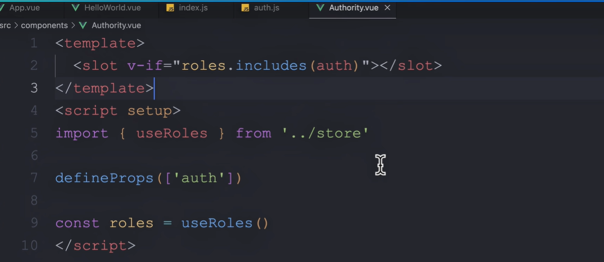

## vue的响应式原理

## template和render有什么区别

在前端开发中，特别是使用 JavaScript 框架（如 Vue、React 等）时，"template" 和 "render" 是两个经常出现的概念，它们都与如何构建用户界面有关，但承担的角色和方式有所不同。

**1. Template (模板)**

* **本质:**  HTML 代码片段，用于描述 UI 的结构和内容。
* **特点:**
    * 语法接近标准 HTML，易于理解和编写。
    * 通常是声明式的，描述最终想要的结果，而不是如何实现。
    * 框架负责将模板编译成可执行的 JavaScript 代码。
* **优点:**
    * 直观易懂，对新手友好。
    * 提高开发效率，专注于 UI 结构和数据绑定。
* **缺点:**
    * 灵活性相对较低，难以实现复杂的逻辑处理。

**示例 (Vue 模板):**

```html
<template>
  <div>
    <h1>{{ title }}</h1>
    <p v-if="showContent">{{ message }}</p>
  </div>
</template>
```

**2. Render (渲染函数)**

* **本质:**  JavaScript 函数，用于生成 Virtual DOM (虚拟 DOM) 结构。
* **特点:**
    * 使用 JavaScript 的语法和逻辑来描述 UI。
    * 完全控制 UI 渲染过程，更加灵活。
* **优点:**
    * 灵活强大，可以实现复杂的 UI 逻辑和动态渲染。
    * 性能优化空间更大。
* **缺点:**
    * 相对来说更难理解和编写，需要更强的 JavaScript 技能。

**示例 (Vue 渲染函数):**

```javascript
render: function (h) {
  return h('div', [
    h('h1', this.title),
    this.showContent ? h('p', this.message) : null
  ])
}
```

**总结：**

| 特性     | Template | Render     |
| -------- | -------- | ---------- |
| 语法     | HTML     | JavaScript |
| 方式     | 声明式   | 命令式     |
| 灵活性   | 较低     | 较高       |
| 学习成本 | 较低     | 较高       |

**何时选择:**

* **Template:**  适合大部分场景，特别是 UI 结构相对简单，逻辑不复杂的情况下。
* **Render:**  需要更精细的控制 UI 渲染过程，实现复杂逻辑和动态效果时。

**一些框架的差异：**

* **Vue:**  同时支持模板和渲染函数，可以根据项目需要选择。
* **React:**  主要使用 JSX 语法，更接近于渲染函数的思想。

希望这能帮助你更好地理解 "template" 和 "render" 之间的区别。

## history api/Vue-Router的history模式和#模式

## 深入理解 History API、Vue Router 的 history 模式和 hash 模式

在单页面应用 (SPA) 中，路由管理是至关重要的。 Vue Router 作为 Vue.js 官方路由管理器，提供了两种模式来实现前端路由：hash 模式和 history 模式。这两种模式都依赖于浏览器机制，但实现方式和优缺点有所不同。

### 1.  History API 

在深入探讨 Vue Router 路由模式之前，先了解一下 `History API`。它是 HTML5 引入的一组 API，允许开发者直接操作浏览器历史记录，而无需刷新页面。 

**History API 主要方法：**

* `pushState(state, title, url)`: 向浏览器历史栈添加一个新的状态和 URL，不会触发页面刷新。
* `replaceState(state, title, url)`: 用新的状态和 URL 替换当前历史记录，也不会刷新页面。
* `onpopstate`: 监听浏览器历史记录的变化，例如点击浏览器前进后退按钮。

### 2. Hash 模式

#### 2.1 原理：

* 使用 URL 中的 hash 符号 (`#`) 来模拟路由。
* hash 符号后面的内容不会发送到服务器，而是由浏览器解析，改变页面视图。
* 通过监听 `hashchange` 事件，根据不同的 hash 值来渲染对应的组件。

#### 2.2 示例：

```
https://www.example.com/#/home
https://www.example.com/#/about
```

#### 2.3 优点：

* **兼容性好**: 兼容所有浏览器，包括旧版本的浏览器。
* **配置简单**: 无需服务器端配置。

#### 2.4 缺点：

* **URL 不美观**:  hash 符号的存在使得 URL 看起来不够简洁。
* **SEO 不友好**:  由于 hash 值不会发送到服务器，搜索引擎无法抓取到相应的页面内容。


### 3. History 模式

#### 3.1 原理：

* 利用 HTML5 History API，通过 `pushState` 和 `replaceState` 方法来改变 URL，不刷新页面。
* 需要服务器端配合，将所有路由请求指向应用首页，由前端路由管理。

#### 3.2 示例：

```
https://www.example.com/home
https://www.example.com/about
```

#### 3.3 优点：

* **URL 美观**: URL 看起来更像传统的网页链接。
* **SEO 友好**:  搜索引擎可以抓取到完整的 URL，有利于 SEO。

#### 3.4 缺点：

* **兼容性**: 不兼容 IE9 及以下版本浏览器。
* **需要服务器配置**: 当用户直接访问非首页路由时，服务器需要返回首页 HTML，否则会出现 404 错误。

### 4. Vue Router 中的两种模式

在 Vue Router 中，可以通过 `mode` 选项来配置路由模式：

```javascript
const router = createRouter({
  history: createWebHistory(), // history 模式
  // history: createWebHashHistory(), // hash 模式
  routes: [...]
})
```

* `createWebHistory()`:  使用 history 模式。
* `createWebHashHistory()`: 使用 hash 模式。


### 5.  如何选择

* **优先考虑 history 模式**： 如果不需要支持 IE9 及以下版本浏览器，并且可以配置服务器，建议使用 history 模式，因为它更美观，对 SEO 更友好。
* **特殊情况使用 hash 模式**： 如果需要兼容旧版浏览器，或者无法配置服务器，则只能使用 hash 模式。


### 6. 总结

| 特性       | Hash 模式             | History 模式        |
| ---------- | --------------------- | ------------------- |
| 原理       | hash 值变化           | History API         |
| URL 示例   | `example.com/#/about` | `example.com/about` |
| 兼容性     | 所有浏览器            | 现代浏览器 (IE10+)  |
| SEO        | 不友好                | 友好                |
| 服务器配置 | 不需要                | 需要                |

希望这篇文章能够帮助你更深入地理解 History API、Vue Router 的 history 模式和 hash 模式，并在实际项目中做出最佳选择。

## 什么时候用vuex，有什么用

Vuex 是一个专为 Vue.js 应用程序开发的状态管理模式和库。它通过**集中式存储管理应用的所有组件的状态**，提供规则以确保状态以一种可预测的方式发生变化。以下是一些关于何时使用 Vuex 以及它的用途的解释：

### 何时使用 Vuex

1. **大型单页应用程序（SPA）**：
   - 当你的**项目规模变大，组件之间共享的状态增多**时，使用 Vuex 可以更好地管理复杂的状态逻辑。

2. **多个组件需要共享状态**：
   - 如果**多个组件需要共享同一个状态**，而这些组件并没有直接的父子关系，使用 Vuex 可以避免传递大量的 props 和事件。

3. **需要记录组件状态变化**：
   - Vuex **能够通过插件或者自带的热重载支持来进行状态调试和修改跟踪**，这对于需要在开发中仔细调试的应用尤为重要。

4. **频繁的组件间通信**：
   - 当应用中需要**频繁的组件间通信时**，Vuex 可以作为一个**更清晰的通信渠道**，避免子母组件之间复杂的事件传递。

### Vuex 的用途和好处

1. **集中式状态管理**：
   - 所有的共享状态被存储在一个集中式的 store 中，这使得状态变化的追踪、调试和测试变得更加简单。

2. **单向数据流**：
   - Vuex 强制采用单向数据流：组件触发 actions，actions 调用 mutations，mutations 同步更新 state，state 的更新会触发 Vue 组件更新。这种单向数据流有助于约束代码中不同部分的交互，避免难以调试的数据流动。

3. **调试和时间旅行**：
   - **Vuex 与 Vue Devtools 工具紧密结合**，支持调试和“时间旅行”功能，这让开发者可以使用时间旅行在不同状态间切换，追踪应用中发生的每一个状态改变。

4. **模块化管理**：
   - Vuex 支持模块化设计，可以将状态管理逻辑划分为多个模块，这非常适合在大型项目中将业务逻辑分解，同时避免全局命名空间的拥塞。

5. **插件系统**：
   - 自带的插件机制允许对状态树进行监控和持久化操作，比如结合 `vuex-persist` 可以将 Vuex 的状态同步到本地存储中。

### Vuex 的替代

值得注意的是，在 Vue 3 及以后的版本中，Vue 提供了更强大的组合式 API（Composition API），同时也有其他状态管理库（如 Pinia）可以作为 Vuex 的替代品。这些可能在某些情况下提供比 Vuex 更轻量的解决方案，特别是对于较小的项目或组件间通信不复杂的应用。

总体来说，如果你的应用程序足够复杂，且需要可靠的状态管理工具来简化状态管理和调试过程，Vuex 是一个非常强大的选择。然而，在简单的应用中，你可能不需要如此复杂的工具，直接使用 Vue 组件本身的状态管理机制可能更为合适。

## 更新vuex中的一个状态全局都会刷新嘛？

在 Vuex 中，当你更新一个状态（state）时，所有依赖该状态的组件都会重新渲染。这是因为 Vue 的响应式系统会追踪到该状态的变化，并通知所有使用该状态的组件进行更新。然而，这并不意味着整个应用的所有组件都会刷新，而是仅限于那些真正依赖（即访问）了变化状态的组件。

### 原理

1. **响应式依赖追踪**：
   - Vue 的响应系统会追踪组件中使用的每一个状态属性。因此，当 Vuex 中的某个状态更新时，只有那些计算属性或直接在模板中引用了该状态的组件实例会重新渲染。
2. **局部更新**：
   - Vue 的虚拟 DOM 确保了尽可能高效的更新机制。即使一个状态的变化导致某个组件重新渲染，Vue 也只会在 DOM 中更新有变化的部分。
3. **优化更新**：
   - 如果需要进一步优化，开发者可以利用 Vue 的 `shouldComponentUpdate`（或 Vue 3 的 `v-memo`）等策略来减少不必要的更新。

### 举例

假设你的 Vuex store 中有一个状态 `count`，并且这个状态在某些组件中被使用：

```javascript
// 举例 Vuex store
export const store = new Vuex.Store({
  state: {
    count: 0,
  },
  mutations: {
    increment(state) {
      state.count++;
    },
  },
});

// 在一个组件中使用这个状态
computed: {
  count() {
    return this.$store.state.count;
  },
}
```

### 当状态更新时

- **影响**：只有那些依赖 `count` 的组件会被重新渲染，比如在这段代码中使用 `this.$store.state.count` 的组件。
- **不影响**：那些不使用或不依赖于 `count` 的组件不会被重新渲染。

### 结论

因此，更新 Vuex 中的一个状态并不会导致整个应用的全局刷新。Vue 的响应式系统和虚拟 DOM 确保了更新只限于需要更新的部分，这是 Vue 性能优化的一部分。

## 为什么改变vuex的状态页面就会更新呢

在 Vue.js 中，页面更新是由 Vue 的响应式系统驱动的。简而言之，Vue 将所有数据对象转换为“响应式的”，也就是当这些数据对象发生变化时，Vue 能够自动检测并作出响应，从而更新相关的 DOM。这一机制同样适用于 Vuex 管理的状态。以下是更多详细的解释：


当你在 Vue 中定义一个数据对象，无论它是组件的 `data` 还是 Vuex 中的 `state`，Vue 都会将这些数据对象的属性转为响应式的。这意味着 Vue 会使用 `Object.defineProperty`（在 Vue 2）或 `Proxy`（在 Vue 3）来拦截对数据的修改。

数据劫持

依赖收集

观察者模式

## 修改了页面状态后，屏幕具体是怎么刷新的

在前端开发中，当页面状态发生变化时，屏幕刷新大致包括以下几个步骤：

1. **状态/数据更新**: 首先，应用程序中的状态或数据发生变化。这可能是由用户交互（例如点击按钮、输入表单）或其他触发事件（例如接收到服务器的响应）引起的。

2. **重新渲染（Reconciliation）**: 现代前端框架（如React、Vue、Angular等）使用一种叫做“虚拟DOM”或“响应式系统”的技术来高效地更新UI。当状态更新时，框架会计算出一个新的虚拟DOM或响应式数据结构。

3. **差异计算（Diffing）**: 框架会比较新旧虚拟DOM或数据结构，找出变化的部分。这一过程称为“diffing”，它的目的是找出需要更新的具体元素，而不是重新渲染整个页面，从而提高性能。

4. **DOM更新**: 根据差异计算的结果，框架只更新那些必须改变的部分。例如，只更新某个文本节点、属性或添加/删除某个DOM元素。这样局部更新比整个重绘更加高效。

5. **重绘（Repaint）和重排（Reflow）**: 当DOM的结构或样式发生变化时，浏览器会进行重排（Reflow，即重新计算元素的位置和几何）、重绘（Repaint，即重新渲染元素的外观）。重排是一个比较昂贵的操作，需要尽量减少。

6. **渲染到屏幕**: 最后，浏览器将更新的内容渲染到用户的屏幕上。用户看到的是更新后的UI状态。

现代浏览器和前端框架的优化使得这些步骤在大多数情况下都非常快速，以至于用户几乎感受不到延迟。然而，对于大量DOM操作或者复杂的计算，开发者需要关注性能优化，避免过渡频繁的重排和重绘。

## 兄弟组件怎么传参

在Vue.js中，兄弟组件之间的通信可以通过以下几种方式实现：

1. **通过父组件中转**：
   - **事件传递**：兄弟组件之间可以通过父组件作为中介来进行通信。一个兄弟组件可以通过事件将数据发送给父组件，父组件再通过props将数据传递给另一个兄弟组件。
     1. 在子组件A中，用`$emit`发射一个事件给父组件，并将需要传递的数据作为参数。
     2. 父组件监听这个事件，并在处理函数中接收数据。
     3. 父组件将数据传递给兄弟组件B作为props。

   示例：
   ```vue
   <!-- 父组件 -->
   <template>
     <ChildA @send-data="handleData"/>
     <ChildB :data="data"/>
   </template>
   
   <script>
   export default {
     data() {
       return {
         data: null
       };
     },
     methods: {
       handleData(data) {
         this.data = data;
       }
     }
   }
   </script>
   ```

   ```vue
   <!-- 子组件A -->
   <template>
     <button @click="sendData">Send Data</button>
   </template>
   
   <script>
   export default {
     methods: {
       sendData() {
         this.$emit('send-data', { /* your data */ });
       }
     }
   }
   </script>
   ```

   ```vue
   <!-- 子组件B -->
   <template>
     <div>{{ data }}</div>
   </template>
   
   <script>
   export default {
     props: ['data']
   }
   </script>
   ```

2. **使用Vuex**：
   - 如果项目已经在使用Vuex进行状态管理，可以将兄弟组件的数据存储在Vuex中。子组件A更新Vuex的状态，子组件B从Vuex中读取状态。
   ```javascript
   // Vuex store
   export default new Vuex.Store({
     state: {
       sharedData: null
     },
     mutations: {
       setSharedData(state, data) {
         state.sharedData = data;
       }
     }
   });
   ```

   然后在子组件A和子组件B中分别读写这个状态。

   ```vue
   <!-- 子组件A -->
   <template>
     <button @click="updateData">Update Data</button>
   </template>
   
   <script>
   export default {
     methods: {
       updateData() {
         this.$store.commit('setSharedData', { /* your data */ });
       }
     }
   }
   </script>
   ```

   ```vue
   <!-- 子组件B -->
   <template>
     <div>{{ sharedData }}</div>
   </template>
   
   <script>
   import { mapState } from 'vuex';
   
   export default {
     computed: {
       ...mapState(['sharedData'])
     }
   }
   </script>
   ```

3. **事件总线（不推荐新项目使用）**：
   - Vue 2中可以通过创建一个事件总线（Event Bus）来实现，但在Vue 3中不推荐这种方式。
   - 如果在Vue 2使用，可以在Vue实例或者单独的文件中创建一个新的Vue实例作为事件总线，通过它来发射和监听事件。

   ```javascript
   // EventBus.js
   import Vue from 'vue';
   export const EventBus = new Vue();
   ```

   在组件中使用：
   ```javascript
   // 组件A
   import { EventBus } from './EventBus.js';
   
   EventBus.$emit('eventName', data);
   
   // 组件B
   import { EventBus } from './EventBus.js';
   
   EventBus.$on('eventName', (data) => {
     // 处理 data
   });
   ```

针对具体项目以及所使用的Vue版本，选择最佳的方式进行兄弟组件间的通信。对于较大和复杂的项目，建议使用Vuex以保持状态管理的一致性和可维护性。

## vue的eventbus原理解释下，是怎么实现的

在 Vue.js 中，全局事件总线 (Event Bus) 是一种让组件之间进行通信的技术，尤其是在兄弟组件之间。这种技术的核心思想是通过创建一个空的 Vue 实例来充当事件总线，从而能够在这个实例上监听和触发事件。

### 基本原理

Vue 实例本身提供了事件处理的机制，它具有 `$emit` 和 `$on` 方法，这类似于 JavaScript 中的 EventEmitter。因此，我们可以创建一个空的 Vue 实例并将其用作事件总线，这样组件就可以通过这个总线进行相互通信。

### 实现步骤

1. **创建一个空的 Vue 实例**： 我们创建一个独立的文件，通常命名为 `EventBus.js`，然后在这个文件中创建一个 Vue 实例并将其导出。
2. **使用 `$emit` 和 `$on` 方法**： 组件通过调用事件总线的 `$emit` 方法来发送事件，其他组件通过调用事件总线的 `$on` 方法来监听这些事件。

### 原理解释

EventBus的核心思想是利用Vue实例的事件系统来实现。Vue实例可以用作一个事件总线，因为它有内置的事件触发和监听机制，即`$emit`和`$on`。通过创建一个新的Vue实例作为“总线”，你可以在这个实例上触发和监听事件，从而实现组件之间的通信。

以下是EventBus的基本实现和使用步骤：

1. **创建EventBus：**

   创建一个新的Vue实例，将其导出以便在其他组件中使用。

   ```javascript
   // EventBus.js
   import Vue from 'vue';
   export const EventBus = new Vue();
   ```

2. **发射事件：**

   通过EventBus实例的`$emit`方法，可以在一个组件中发射事件。

   ```javascript
   // 在某个组件中，发射事件
   import { EventBus } from './EventBus.js';
   
   // 传递事件名称和数据
   EventBus.$emit('eventName', someData);
   ```

3. **监听事件：**

   通过EventBus实例的`$on`方法，可以在另一个组件中监听该事件。

   ```javascript
   // 在另一个组件中，监听事件
   import { EventBus } from './EventBus.js';
   
   EventBus.$on('eventName', (data) => {
     console.log(data); // 处理传递过来的数据
   });
   ```

### 工作机制

- **事件系统**：Vue实例包括一个简单的事件系统，使每个实例都可以处理自定义事件。
- **$emit**方法用于触发事件。
- **$on**方法用于监听事件。
- **事件总线**：通过创建一个新的Vue实例，我们可以利用它的事件系统。将这个新实例当做事件总线在应用中共享，从而实现组件之间的通信。

### 适用场景

- **小型项目**：在Vue 2中适用于一些较小的项目或者不打算增设全局状态管理（比如Vuex）的项目。
- **简单的兄弟组件通信**：不需要较复杂的数据流管理，仅需实现简单的事件通信场景。

### 注意事项

- **内存泄漏**：使用EventBus需要手动销毁监听器，尤其是在组件销毁时，否则可能导致内存泄漏。使用`$off`去注销事件监听。

  ```javascript
  EventBus.$off('eventName', handlerFunction);
  ```

- **可维护性差**：当项目逐渐增大，依赖EventBus会使代码变得难以维护，因为事件的触发和响应分散在各处，缺乏一种明确的可视化数据流。

总之，虽然EventBus在Vue 2中能够很好解决兄弟组件通信问题，但随着Vue 3的发布和更好的状态管理工具的出现，它现在已不被推荐。对于现代Vue项目，考虑使用Vuex、Pinia或者组合API来实现更清晰和结构化的状态管理和组件通信。

## vue2生命周期和vue3生命周期区别

Vue.js是一个用于构建用户界面的渐进式JavaScript框架，与Vue 2相比，Vue 3在性能和功能上进行了许多改进。同时，它对生命周期钩子进行了较小的调整和补充。下面是Vue 2和Vue 3生命周期的主要区别：

### Vue 2 生命周期

Vue 2 的生命周期钩子如下：

1. `beforeCreate`：实例初始化之后调用，此时数据观察和事件配置尚未完成。
2. `created`：实例创建完成，属性已绑定，但DOM尚未生成，`$el`属性还未显示出来。
3. `beforeMount`：在挂载开始之前调用，相关的render函数首次被调用。
4. `mounted`：在挂载完成后调用，`el`被新创建的`vm.$el`替换，并挂载到实例上。
5. `beforeUpdate`：在数据更新之前调用，发生在虚拟DOM打补丁之前。
6. `updated`：在重新渲染和打补丁之后调用。
7. `activated`：在keep-alive组件激活时调用。
8. `deactivated`：在keep-alive组件停用时调用。
9. `beforeDestroy`：实例销毁之前调用，此时实例仍然是完全正常的。
10. `destroyed`：实例完全销毁之后调用，调用后只剩下绑定的DOM结构。

### Vue 3 生命周期

Vue 3 增加了对 [Composition API](https://v3.vuejs.org/guide/composition-api-introduction.html) 的支持，这带来了一些新的生命周期钩子命名，同时保留了Vue 2中的大部分生命周期钩子：

#### 传统生命周期钩子

与Vue 2相同，还包含：

1. `beforeCreate` -> `onBeforeCreate`
2. `created` -> `onCreated`
3. `beforeMount` -> `onBeforeMount`
4. `mounted` -> `onMounted`
5. `beforeUpdate` -> `onBeforeUpdate`
6. `updated` -> `onUpdated`
7. `beforeDestroy` -> `onBeforeUnmount` （名称变更）
8. `destroyed` -> `onUnmounted` （名称变更）
9. `activated` -> `onActivated`
10. `deactivated` -> `onDeactivated`

#### 新增的生命周期钩子固定在 [Composition API](https://v3.vuejs.org/guide/composition-api-introduction.html) 中使用：

1. **`onErrorCaptured`**：用来捕获子组件错误。
2. **`onRenderTracked`**（调试相关）：主要用于开发期间监控依赖是如何被追踪的。
3. **`onRenderTriggered`**（调试相关）：主要用于开发期间监控组件更新的触发事件。

### 区别总结

- **命名统一**：在Composition API语法中，Vue 3为生命周期钩子统一采用了“on”前缀。这在Options API中仍然可以用老的名称。
- **代码组织**：Vue 3通过Composition API改善了代码的组织方式，允许我们将功能和逻辑按功能点的相关性组合在一起，而不是被分散到不同的生命周期钩子中。
- **进一步改进的调试和错误处理**：Vue 3引入了新的钩子，例如`onErrorCaptured`，提供了更细粒度的控制和更好的调试功能。

不论是Vue 2还是Vue 3，理解和正确使用生命周期钩子对于Vue开发者来说都是非常重要的。它们为开发者提供了在不同阶段执行代码的机会，从而更好地控制组件行为。

## Vue3为什么移除了事件总线这一种组件间通信的方式？从框架开发者的角度说一说。

在 Vue 2 中，事件总线是一个常用的用于组件间通信的模式。通过在 Vue 实例上注册事件和触发事件，组件可以相互通信。然而，Vue 3 选择移除了对事件总线的官方支持，这主要是基于几个原因和改进考虑。

### 理由分析

1. **复杂性与可维护性**：
   - **追踪事件流困难**：使用事件总线，事件流往往是隐式的，这意味着对事件的监听和触发分散在代码的不同部分，难以追踪和调试。这会使得代码维护更加复杂。
   - **潜在的内存泄漏**：当组件不适当地在销毁时移除事件监听器，可能导致内存泄漏。

2. **不符合组件化精神**：
   - 事件总线打破了组件的封装性和模块性，其隐式的通信方式可能导致组件间的强耦合，这与 Vue 强调的组件化思想相悖。
   - 强耦合导致组件的重用性和可测试性变差，因为组件的行为可能依赖于外部的某些事件。

3. **现代状态管理方式的进步**：
   - **提供更好的选择**：Vue 3 推出了新的组合式 API（Composition API），让开发者可以更灵活地在功能之间共享和重用逻辑。同时，Vuex（Vue 的状态管理库）已经成熟且广泛使用，提供了更为清晰、可预测的状态管理模式。
   - **可读性和结构化**：使用 Vuex 或组合式 API 能够使状态和行为的流动更具可见性和可读性，提升代码质量。

4. **促进最佳实践**：
   - 通过移除事件总线，框架引导开发者采用更现代、更健壮的通信模式，诸如 Vuex 和组合式 API，这也使得应用的状态更容易预测和测试。

### 现代替代方案

- **Vuex**：用于全局状态管理，可以用来替代事件总线的许多用例，尤其是在多个组件共享状态时。
- **组合式 API**：在 Vue 3 中引入，允许将逻辑函数化，使得不同组件可以重用共同的逻辑片段。
- **Provide/Inject API**：用于在祖先组件和后代组件之间共享状态和方法，而不需要手动通过中间组件传递。

通过这些替代方案，Vue 3 开发者鼓励更结构化、更具模块化的组件通信方式，从而提高代码的可维护性、可读性和性能优化。这样的设计决策反映了框架开发者对组件化、可维护性和现代状态管理模式的重视。

## vue文件是如何渲染到浏览器上的，以及识别到其他文件怎么转换的

### Vue 文件是如何渲染到浏览器上的

在 Vue.js 项目中，`.vue` 文件通常包含三个部分：**template**、**script** 和 **style**。这些文件在开发过程中并不能直接在浏览器中识别和运行，而是需要经过一系列的构建步骤来转换为浏览器可以执行的代码。以下是一个简单的工作流程：

1. **工具链准备**：
    - **脚手架工具**：Vue 提供了 Vue CLI 脚手架工具 (`@vue/cli`)，用于快速创建和配置 Vue 项目。它会初始化项目结构并安装必要的依赖。

2. **文件编译和打包**：
    - **Vue Loader**：在 Webpack 中使用 `vue-loader` 来处理 `.vue` 文件。`vue-loader` 会解析 `.vue` 文件，并将模板、脚本和样式部分分离出来，然后分别处理。

3. **模板编译**：
    - **Template Compiler**：`vue-template-compiler` 将 `<template>` 部分编译成渲染函数，这些渲染函数将被 Vue 的运行时使用，以生成虚拟 DOM（VNode）。

4. **脚本处理**：
    - **JavaScript/TypeScript 编译**：`<script>` 部分通常是 JavaScript 或 TypeScript 代码，它们会被 Babel 或 TypeScript 转译，以确保能在所有目标浏览器上运行。

5. **样式处理**：
    - **CSS Loader**：`<style>` 部分用 CSS、SCSS 或其他预处理器写成，CSS Loader 会处理和转换这些样式代码，确保它们被正确加载和应用。

6. **模块打包**：
    - **Webpack**：最终，Webpack 会将所有分离出来的部分和其他依赖模块打包成一个或多个 bundle 文件。

7. **发布和运行**：
    - **静态资源**：最终的 bundle 文件和其他静态资源（如图片、字体等）会被部署到一个静态服务器上，通过 HTTP 服务器提供给客户端。
    - **运行时执行**：在浏览器中，主 HTML 文件通过一个 `script` 标签引入打包后的 JavaScript 文件，Vue 的运行时会根据这些打包后的文件创建和挂载 Vue 实例，并渲染出完整的应用。

### 识别到其他文件怎么转换的

在 Vue 项目中，处理和转换不同类型的文件（例如 JavaScript、CSS、图像等）依赖于现代构建工具，如 Webpack 和 Vite。以下是一些关键步骤和工具：

1. **JavaScript/TypeScript 文件**：
    - **Babel**：Babel 是一个流行的 JavaScript 编译器，用来将现代 JavaScript 代码转换为兼容性更好的版本。Babel 也可以处理 JSX 语法。
    - **TypeScript Compiler**：如果使用 TypeScript，`ts-loader` 或 `babel-loader` 将用于将 TypeScript 代码转换为 JavaScript。

2. **CSS 及预处理器**：
    - **CSS Loader**：`css-loader` 使你可以在 JavaScript 中 `import` CSS 文件，处理 `@import` 和 `url()`。
    - **预处理器**：对于使用 Sass、Less 或 Stylus，使用相应的 loader（如 `sass-loader`、`less-loader`、`stylus-loader`）来将这些预处理语法转换为原生 CSS。
    - **PostCSS**：`postcss-loader` 可以用来通过插件（如 Autoprefixer）自动添加浏览器前缀，或者进行其他 CSS 转换。

3. **文件和资源**：
    - **文件 Loader**：`file-loader` 和 `url-loader` 用来处理图像、字体等文件资源。`url-loader` 可以将小文件内联为 base64 URL，大文件则使用 `file-loader` 处理，生成文件 URL。
    - **SVG**：`svg-loader` 可以用于将 SVG 文件转换为 Vue 组件，或者内联到 HTML 中。

4. **配置管理**：
    - **Webpack 配置**：Vue CLI 或 Vite 会自动生成一个合理的 Webpack 配置文件，处理上述各种文件类型的转换和打包工作。
    - **Alias 和路径解析**：你可以在 Webpack 配置中使用别名（alias）让模块导入路径更简洁。例如，`@` 通常被配置为项目的 `src` 目录，方便模块导入。

### 工作示例

以下是一个简单的 Vue 组件文件，展示了它各部分如何在构建过程中处理：

**App.vue**
```vue
<template>
  <div id="app">
    
    <HelloWorld msg="Welcome to Your Vue.js App"/>
  </div>
</template>

<script>
import HelloWorld from './components/HelloWorld.vue';

export default {
  name: 'App',
  components: {
    HelloWorld
  }
}
</script>

<style>
#app {
  font-family: 'Avenir', Helvetica, Arial, sans-serif;
  -webkit-font-smoothing: antialiased;
  -moz-osx-font-smoothing: grayscale;
  text-align: center;
  color: #2c3e50;
  margin-top: 60px;
}
</style>
```

**构建工具自动处理流程**：
1. **`vue-loader`** 解析 `App.vue`，分别处理 `<template>`、`<script>` 和 `<style>` 部分。
2. **`vue-template-compiler`** 将模板转换为渲染函数。
3. **`babel-loader`/`ts-loader`** 将脚本部分转换为 ES5 版本。
4. **`css-loader`** 和 **`style-loader`** 处理样式部分，生成对应的 CSS 文件或嵌入到 JavaScript 文件中。

这些构建步骤由工具链（如 Vue CLI、Webpack 或 Vite）自动执行，无需开发者手动干预，从而提供了一个高效的开发和构建环境。

## vue封装组件需要考虑哪些

在Vue.js中封装组件是创建可重用、可维护代码的重要手段。封装组件时，需要考虑以下几个关键方面，以确保组件在各种场景下都能稳健、灵活地工作。

### 1. 组件结构和布局
- **单文件组件 (SFC)**：Vue推荐使用单文件组件（.vue文件）来组织组件，包含 `<template>`、`<script>` 和 `<style>` 部分。
- **清晰的结构**：保证组件的内部结构清晰易懂，每个部分都只负责特定的功能。
  
### 2. Props 和事件
- **Props**：定义组件需要的输入参数（props），并为其设置默认值和类型（使用 `props` 选项或 TypeScript）。
- **事件发射（Emit）**：使用 `$emit` 方法发射事件，让父级组件监听。

```js
// ExampleComponent.vue
<template>
  <button @click="handleClick">Click Me</button>
</template>

<script>
export default {
  name: 'ExampleComponent',
  props: {
    label: {
      type: String,
      required: true
    }
  },
  methods: {
    handleClick() {
      this.$emit('custom-event', 'some data');
    }
  }
};
</script>
```

### 3. 插槽（Slots）
- **默认插槽**：允许组件使用者插入内容。
- **命名插槽**：让使用者将内容插入特定位置。
- **作用域插槽（Scoped Slots）**：通过插槽作用域将数据传递给插槽内容。

```html
<!-- ExampleComponent.vue -->
<template>
  <div>
    <slot></slot>
    <slot name="footer"></slot>
  </div>
</template>
```

```html
<!-- Usage -->
<example-component>
  <p>This is a default slot content.</p>
  <template #footer>
    <p>This is the footer slot content.</p>
  </template>
</example-component>
```

### 4. 样式和CSS
- **Scoped CSS**：使用 `<style scoped>` 作用于组件内部，避免样式冲突。
- **CSS Modules**：Vue支持CSS模块来进一步隔离样式。
- **CSS变量**：如果存在样式参数化需求，可以考虑通过CSS变量实现主题定制。

```html
<!-- ExampleComponent.vue -->
<template>
  <div class="example">
    Styled Example Component
  </div>
</template>

<style scoped>
.example {
  color: red;
}
</style>
```

### 5. 状态管理
- **Vuex**：对于复杂的状态管理需求，可以使用Vuex在全局共享状态。
- **局部状态**：保持组件内部的特定状态，若状态需要被多个组件共享时再考虑全局状态管理。

```js
data() {
  return {
    localState: 'some state'
  };
}
```

### 6. 生命周期钩子
- **生命周期钩子**：合理利用Vue的生命周期钩子来处理组件的初始化、更新和销毁过程中的逻辑。

```js
export default {
  mounted() {
    // 初始化过程
  },
  beforeDestroy() {
    // 清理过程
  }
};
```

### 7. 重用性和可配置性
- **配置选项**：提供合理的配置选项，让组件更具灵活性。
- **Mixin 和高阶组件**：在存在多个组件需要共享相同逻辑时，可以使用Mixin或高阶组件。

### 8. 响应式设计
- **响应式布局**：使用媒体查询和Vue的响应式特性（如 `v-show`, `v-if`）来适应不同设备屏幕。
- **第三方库**：如果需要，可以使用第三方布局工具（如Bootstrap, Tailwind CSS）来加速开发。

### 9. 单元测试
- **测试覆盖**：为组件编写单元测试，使用工具如Vue Test Utils和Jest来确保组件行为符合预期。
- **隔离测试**：尽量在隔离环境下测试组件，以便快速定位问题。

### 10. 文档和说明
- **README 文件**：为组件编写详细的文档，说明组件的props、事件、插槽以及如何在项目中使用。
- **注释**：在代码中添加注释解释关键逻辑和设计决策。

### 11. 性能优化
- **懒加载**：对于大型组件，可以考虑懒加载。
- **事件解绑**：在组件销毁钩子中移除事件监听，避免内存泄漏。
- **虚拟列表**：在处理大数据列表时，使用虚拟列表技术来优化渲染性能。

通过以上这些考量点，可以确保你的Vue组件是高质量的、可维护的，并能够在实际应用中灵活使用。如果你能在组件开发过程中关注这些方面，那么你的组件将不仅易于使用，还具有良好的扩展性和性能。

## vuex是发布订阅模式吗

Vuex 不是一个典型的发布-订阅模式（Publish-Subscribe Pattern）实现，而是一种基于集中式状态管理的体系。但它确实包含类似于发布-订阅模式的特性，特别是在变化通知和状态更新方面。

### 发布-订阅模式回顾

发布-订阅模式是一种设计模式，其中消息的发送者（发布者）和接收者（订阅者）是解耦的。消息由中介（消息代理/事件总线）进行管理，订阅者可以订阅特定主题，发布者可以发布消息到该主题，订阅者接收到消息并响应。

### Vuex 的特点

Vuex 是一种集中式状态管理模式，专为 Vue.js 应用设计，具有以下几个特点：

1. **单一状态树**: 所有的应用状态都以一个对象树的形式存储在一个中央的 store 中。
   
2. **状态更新**: 状态的变更需要通过提交 mutation，但 mutation 是同步事务。

3. **异步操作**: 需要通过 action 来进行异步操作，并最终提交 mutation 改变状态。

4. **监听器**: Vuex 允许通过 `store.subscribe()` 方法来订阅 state 的变化。

### 类似发布-订阅的特性

虽然 Vuex 不是发布-订阅模式，但有以下一些特性使它看起来类似：

- **Mutation 通知更新**: 使用 Vue 的 reactivity 系统，任何对状态的更新都会通知到所有使用该状态的组件。
  
- **插件机制**: Vuex 的插件可以被视为一种中介，允许在每次 mutation 之后执行逻辑。

- **订阅状态变化**: 可以通过 `store.subscribe()` 函数订阅 mutation 的调用，执行与之关联的回调函数。

```javascript
// Example: Subscribing to mutations in Vuex
store.subscribe((mutation, state) => {
  console.log(mutation.type);
  console.log(mutation.payload);
});
```

### 区别

与纯发布-订阅模式相比，Vuex 的一些关键区别在于：

- **中央存储**: Vuex 是通过一个中央存储管理整个应用的状态，而不是解耦的消息订阅系统。
  
- **状态变更约束**: 状态的变更必须遵循严格的 mutation 机制，保证状态的可追踪性和一致性。

- **同步与异步**: Vuex 将同步和异步处理分为 mutation 和 action，提供了一种结构化的方式来更新状态，而发布-订阅通常不对同步和异步进行严格区分。

因此，尽管 Vuex 利用了 Vue 的响应式系统和提供了一些订阅能力，它更多地是一个带有响应式特性的集中式状态管理工具，而不是标准的发布-订阅模式。

## 在Vue路由中，如何实现前进和后退功能

在Vue.js应用中，你可以通过Vue Router的内置功能来实现前进和后退功能。Vue Router提供了一些方法用于控制路由导航，这些方法允许你以编程方式控制浏览器的历史记录。

### 使用Vue Router的编程导航

#### 前进和后退功能

1. **`this.$router.back()`**
   - 用于返回浏览器历史记录中的上一页，相当于浏览器的后退按钮。

2. **`this.$router.forward()`**
   - 用于前进到浏览器历史记录中的下一页，相当于浏览器的前进按钮。

3. **`this.$router.go(n)`**
   - 用于浏览器历史记录中移动`n`步。
   - 如果n为负数（如-1），则会后退n步。
   - 如果n为正数（如1），则会前进n步。

### 示例用法

假设你有一个应用，想通过按钮控制前进和后退：

```html
<template>
  <div>
    <button @click="goBack">后退</button>
    <button @click="goForward">前进</button>
  </div>
</template>

<script>
export default {
  methods: {
    goBack() {
      this.$router.back();
    },
    goForward() {
      this.$router.forward();
    }
  }
}
</script>
```

### 进一步的实现注意事项

- **确保History模式**：
  - 使用Vue Router的前进和后退功能，需要确保应用使用了HTML5的历史记录模式（history mode），这意味着在Vue Router配置中需要设置`mode: 'history'`。

- **误用注意**：
  - `this.$router.go()`的参数如果超出当前历史记录的范围（如正数超过最大前进步数），不会进行导航。
  - 在某些特定情况下（如没有历史记录），调用这些方法可能会没有效果，所以应在代码中的适当地方处理这些情况。

通过以上方法，你可以很容易地为Vue应用实现前进和后退功能。不过，很多情况下直接使用浏览器的原生前进后退功能也可以满足用户需求，所以当作备用方案也是不错的选择。

## 如果我的计算属性有三个值计算了三次，那页面渲染了几次

在Vue.js中，计算属性是基于其依赖项缓存的。也就是说，计算属性的值只有在其依赖项发生改变时才会重新计算。这个特性确保了计算属性在多个绑定或使用场景下表现出色，只在必要时重新计算，并且不会在依赖项未改变时反复计算。

现在，考虑你的问题：如果一个计算属性依赖的三个值（假设为`a`、`b`、`c`）发生了三次变化，那么页面的渲染取决于这些变化的特性和时机。

1. **批量更新（同步更新）**：
   - Vue 在一个事件循环中进行批量更新。这意味着如果 `a`、`b`、`c`在同一个事件循环中连续更新，计算属性只会在事件循环结束时重新计算一次，渲染也只会发生一次。
   - Vue 使用一个基于`Promise`的微任务队列批量处理数据变更，以此实现更高效的渲染。这样可以避免每次数据变更都触发渲染的性能问题。

2. **异步更新（跨事件循环更新）**：
   - 如果`a`、`b`、`c`在不同的事件循环中更新（例如通过`setTimeout`或用户交互触发），每次更新都会分别触发计算属性的重新计算，并导致新的页面渲染。
   - 在这种情况下，页面可能会渲染三次。

因此，具体的渲染次数取决于值更新的时机和方式：

- 如果更新发生在同一事件循环内，Vue将批量处理，页面仅渲染一次。
- 如果更新发生在不同事件循环内，页面可能会渲染多次，每次都对应一次计算属性的更新。

值得注意的是，Vue的这种批量更新机制大大提高了性能，因为它尽可能减少了不必要的DOM操作。

## 如果我再加一个异步数据呢

在Vue.js中，如果你有一个计算属性依赖于多个同步数据，以及一个异步数据（如从API获取的数据），渲染行为会有些不同，具体取决于更新的顺序和时机。

### 异步数据的处理和影响

1. **初始渲染**：
   - 当组件首次渲染时，计算属性会第一次被计算，取决于当前存在的同步数据和默认的异步数据（通常可能是`undefined`或`null`）。

2. **异步数据更新**：
   - 当异步操作完成并返回数据时，这可能是在不同的事件循环内更新状态。
   - 一旦异步数据到位，触发了与计算属性相关的响应式数据更新，Vue会将这个更新加入其更新队列中。

3. **影响计算属性**：
   - 如果计算属性依赖异步数据的结果，该计算属性将会在异步数据更新后被重新计算。
   - 在每次异步数据更新时，只要计算属性因为这个数据变化需要重新计算，Vue会在异步数据更新完成后的微任务阶段，对计算属性进行更新，并使得相关的DOM节点重新渲染。

### 渲染次数的考虑

- **同步数据批量更新**：
  即便同步数据和异步数据在不同时间更新，Vue会尽可能地将同一事件循环内的同步数据更新进行批量处理，减少重绘次数。

- **异步数据更新**：
  当异步数据更新时，由于它的更新通常是脱离当前渲染流程的（因为它是由外部事件触发，如API响应完成），这在串行执行的JavaScript中通常意味着在后续的事件循环中会单独触发计算属性重新计算和必要的DOM更新。

### 示例

假设一个计算属性依赖于`a`、`b`、`c`和`asyncData`，并假设`asyncData`是由一个Promise提供的异步数据：

- 如果`a`、`b`、`c`在同一个事件循环中变化，Vue会批量处理，在事件循环结束前渲染一次。
- 当`asyncData`完成并更新时，它可能会触发计算属性的重新计算和额外的DOM更新，因为这是在另一事件循环中完成的。

在实际开发中，为了更好地控制异步更新带来的渲染问题，可以：

- 使用状态变量（如`loading`、`error`）来控制数据加载期间的UI状态。
- 结合`watcher`监测异步数据状态变化，进行一些额外操作（如日志记录或错误处理），而不是单靠计算属性。

## Vue从DOM树建立完成到页面上呈现经历了哪些步骤？

在Vue.js中，从创建组件到最终在页面上呈现的过程涉及多个步骤，这些步骤确保了数据驱动的组件能够高效地响应数据变化并更新DOM。以下是Vue组件从初始化到最终渲染的典型生命周期步骤和过程：

1. **实例初始化**：
   - Vue组件实例初始化，Vue将配置对象（如`data`、`methods`、`computed`等）进行规范化处理。
   - 设置响应式系统，Vue使用`Object.defineProperty`（Vue 2.x）或`Proxy`（Vue 3.x）来将`data`中的数据设为响应式，使得数据变化能够触发相应的UI更新。

2. **生命周期钩子 - `beforeCreate` & `created`**：
   - 在`beforeCreate`阶段，实例已经初始化，但尚未设置`data`和`methods`。
   - 在`created`阶段，组件实例已经完成数据的响应式绑定和属性的初始化。但此时还没有挂载DOM。

3. **编译模板**：
   - Vue编译模板，将模板字符串编译为渲染函数（render function）。这可以通过浏览器的API直接生成，也可以使用打包工具（如Vue CLI）进行预编译。

4. **生命周期钩子 - `beforeMount`**：
   - 在这个阶段，根DOM元素被创建，但是尚未插入到文档中。

5. **挂载（Mounting）**：
   - Vue执行渲染函数，产生虚拟DOM树。
   - 通过虚拟DOM和Vue的`patch`算法创建并更新实际的DOM。
   - Vue将生成的DOM节点替换或插入到实际DOM中（绑定在组件的挂载点上）。

6. **生命周期钩子 - `mounted`**：
   - 这个钩子在组件的DOM元素挂载到页面中后调用。在这里可以安全地执行需要DOM存在的操作，如第三方库的初始化。

7. **数据更新和重渲染**：
   - 当某个响应式数据发生变化时，Vue会执行观察者模式，通过依赖追踪触发相关的重新渲染。
   - 如果变化只是普通的属性变化，那么Vue会通过虚拟DOM的diff算法，找到变化的最少更新，并高效地更新实际DOM。

8. **组件销毁**：
   - 更新、激活和销毁生命周期钩子（如`beforeUpdate`、`updated`、`beforeDestroy`、`destroyed`）会在组件的生命周期中被触发，允许开发者在特定时刻执行逻辑。
   - 当组件不再需要时，Vue会移除所有关联的事件监听器、卸载子组件以及清理相关的依赖追踪。

通过这些步骤，Vue实现了高效的、响应式的DOM更新机制，使得开发者能够专注于数据和应用逻辑，而不必手动处理DOM更新过程。这是Vue得以被广泛使用及追捧的重要原因之一，因为它极大地简化了现代Web应用的开发流程。

## 能详细说一下Vue的渲染机制吗

Vue.js的渲染机制是其高效响应式系统的核心所在，它能够智能、高效地更新DOM，以反映数据状态的变化。了解Vue的渲染机制可以帮助开发者优化应用的性能和准确性。以下是一个详细的过程，说明Vue如何实现其渲染机制：

### 1. **数据响应式**

- Vue在初始化组件时，将数据对象中的每个属性转换为getter/setter。
- 使用`Object.defineProperty`（在Vue 2.x中）或`Proxy`（在Vue 3.x中）劫持对数据的访问，从而实现数据的响应式。
- 当数据发生变化时，这些getter/setter中定义的行为会触发相应的“脏检测”，标记需要更新的部分。

### 2. **依赖收集**

- Vue会在组件渲染时（执行渲染函数）跟踪哪些属性被“读取”。
- 每个被读取的数据依赖都会被记录下来，并关联到“观察者”对象（Watcher）。
- 当数据更改时，Vue会知道哪些组件或计算属性需要重新计算，从而优化更新路径。

### 3. **虚拟DOM**

- Vue在编译组件模板时，将其转换成渲染函数。
- 渲染函数生成一个JavaScript对象树，称为虚拟DOM树（VNode Tree），表示DOM的结构。
- 虚拟DOM允许Vue通过diff算法比较“新旧”两个虚拟DOM树，并计算出一个“最小代价”的更新操作。

### 4. **更新机制**

- 当数据变化时，触发Watcher执行更新。Watcher调用渲染函数，生成新的虚拟DOM树。
- 通过Diff算法比较新旧虚拟DOM树的差异。
- 生成精确的DOM更新操作（如添加、删除、修改节点）。
- 将这些优化后的修改应用于真实的DOM。

### 5. **批处理**

- 为了提高性能，Vue在检测到数据变化后不会立刻触发DOM更新，而是将这些变化放入一个队列中。
- 在下一个tick（事件循环/微任务）中，Vue调用`flushCallbacks`方法批量处理这些变化。
- 使用Vue.nextTick()可在DOM更新后执行回调。

### 6. **渲染钩子**

- Vue提供了多个生命周期钩子以供开发者在渲染过程中插入逻辑：
  - `beforeCreate`、`created` - 初始化数据。
  - `beforeMount`、`mounted` - 在DOM节点挂载前后。
  - `beforeUpdate`、`updated` - 在数据变化导致的DOM更新前后。
  - `beforeDestroy`、`destroyed` - 在组件被销毁前后。

### 7. **优化策略**

- 组件分解：尽量分解成更小的、可复用的组件，以提高局部重新渲染的效率。
- 应用`v-once`、`v-if`、`v-show`、`key`等指令，帮助Vue优化DOM操作和组件复用。
- 在Vue 3.x中，Composition API与基于Proxy的更细粒度响应式系统进一步提高了渲染的效率和可维护性。

通过上述过程，Vue实现了细粒度、按需的DOM更新，为开发者提供了一种声明式且高效的UI构建方式，而不必手动操作DOM，提升了开发效率和维护性。

## 在for和if里面加key效果一样吗？

在Vue.js中，`key`属性主要用作标识虚拟DOM节点的唯一性，以帮助Vue识别哪些元素是变化、复用或销毁的。使用`key`可以使动态列表的渲染更高效。以下是`key`在`v-for`和`v-if`中的作用和区别：

### `key`在`v-for`中的作用：

- **标识与追踪节点**：在使用`v-for`渲染列表时，`key`通常用于唯一标识列表中的每个节点。它帮助Vue在更新DOM时准确地追踪每个节点的身份，而不是简单地依赖节点的顺序。

- **提升性能**：通过为列表中的每个项提供`key`，Vue可以更高效地应用最少更新步骤到实际DOM中。例如，当列表项的顺序发生变化时，有`key`帮助的情况下，Vue会复用DOM元素，而不是重新创建。

- **避免不必要的更新**：当列表的数据变化时，`key`有助于Vue比较新旧节点，以只更新那些实际发生变化的节点，从而避免不必要的DOM操作。

### `key`在`v-if`中的作用：

- **条件切换中的重建**：在涉及条件渲染逻辑（例如`v-if`与`v-else`等）时，`key`用于确保组件被重新渲染而不是复用。通过改变`key`，开发者可以明确指示Vue重新创建组件实例。

- **独立保存状态**：使用`key`可以在条件切换中保留组件的独立状态。例如，在从一个状态切换到另一个状态时，为组件附一个不同的`key`会强制Vue销毁旧组件并创建一个新组件，确保每个阶段是独立的，没有状态残留。

### 总结：

- 在`v-for`中使用`key`主要是为了提高更新列表的效率并保持列表项的状态独立。

- 在`v-if`中使用`key`可以控制组件的重建和状态隔离，从而确保不同条件下组件实例不共享状态。

虽然`key`在这两种场合下都有独特的作用，但它们的核心目标一致：帮助Vue更智能地进行DOM更新，从而提高性能并保证状态的一致性与正确性。无论是在循环还是条件渲染中，`key`的有效运用都是构建高效和可靠应用的最佳实践之一。

## 比如一个父子组件，他两生命周期的顺序是啥样的

在 Vue.js 中，父子组件的生命周期钩子函数有类似的组成，但它们触发的顺序是有所区别的。理解这些顺序有助于我们更加准确地控制组件的初始化和销毁过程。

### 创建阶段

先看看在组件创建过程中的生命周期钩子函数触发顺序：

1. **父组件 beforeCreate**
2. **父组件 created**
3. **父组件 beforeMount**
4. **子组件 beforeCreate**
5. **子组件 created**
6. **子组件 beforeMount**
7. **子组件 mounted**
8. **父组件 mounted**

### 更新阶段

当父组件中的数据变化导致视图更新时，生命周期钩子函数的触发顺序如下：

1. **父组件 beforeUpdate**
2. **子组件 beforeUpdate**
3. **子组件 updated**
4. **父组件 updated**

### 销毁阶段

在销毁组件时，生命周期钩子函数的触发顺序是：

1. **父组件 beforeDestroy**
2. **子组件 beforeDestroy**
3. **子组件 destroyed**
4. **父组件 destroyed**

### 示例代码

以下通过一个例子来展示父子组件在不同阶段的生命周期钩子函数触发顺序：

```html
<!DOCTYPE html>
<html lang="en">
<head>
    <meta charset="UTF-8">
    <meta name="viewport" content="width=device-width, initial-scale=1.0">
    <title>Vue Lifecycle Example</title>
    <script src="https://cdn.jsdelivr.net/npm/vue@2"></script>
</head>
<body>
    <div id="app">
        <parent-component></parent-component>
    </div>

    <script>
        Vue.component('parent-component', {
            template: `<div>
                          <h1>Parent Component</h1>
                          <child-component></child-component>
                       </div>`,
            beforeCreate() {
                console.log('Parent beforeCreate');
            },
            created() {
                console.log('Parent created');
            },
            beforeMount() {
                console.log('Parent beforeMount');
            },
            mounted() {
                console.log('Parent mounted');
            },
            beforeUpdate() {
                console.log('Parent beforeUpdate');
            },
            updated() {
                console.log('Parent updated');
            },
            beforeDestroy() {
                console.log('Parent beforeDestroy');
            },
            destroyed() {
                console.log('Parent destroyed');
            }
        });

        Vue.component('child-component', {
            template: `<div>
                          <p>Child Component</p>
                       </div>`,
            beforeCreate() {
                console.log('Child beforeCreate');
            },
            created() {
                console.log('Child created');
            },
            beforeMount() {
                console.log('Child beforeMount');
            },
            mounted() {
                console.log('Child mounted');
            },
            beforeUpdate() {
                console.log('Child beforeUpdate');
            },
            updated() {
                console.log('Child updated');
            },
            beforeDestroy() {
                console.log('Child beforeDestroy');
            },
            destroyed() {
                console.log('Child destroyed');
            }
        });

        new Vue({
            el: '#app'
        });
    </script>
</body>
</html>
```

当运行上面的代码时，在控制台你会看到以下输出：

```plaintext
Parent beforeCreate
Parent created
Parent beforeMount
Child beforeCreate
Child created
Child beforeMount
Child mounted
Parent mounted
```

如果我们更新组件的数据，会看到类似如下的输出（这里假设有数据导致更新）：

```plaintext
Parent beforeUpdate
Child beforeUpdate
Child updated
Parent updated
```

而当销毁组件时，控制台会显示：

```plaintext
Parent beforeDestroy
Child beforeDestroy
Child destroyed
Parent destroyed
```

### 总结

- **创建阶段**：从外向里，父组件先于子组件执行 `beforeCreate` 和 `created`，但子组件在父组件之前完成 `mounted`。
- **更新阶段**：父组件和子组件会按照组件树顺序分别执行其 `beforeUpdate` 和 `updated` 钩子。
- **销毁阶段**：从外向里，父组件先于子组件执行 `beforeDestroy`，但子组件在父组件之前完成 `destroyed`。

## vue3中的生命周期函数有没有一些变化

是的，相较于 Vue 2，Vue 3 的生命周期函数确实有一些变化和改进。主要的变化体现在以下几个方面：

### 1. 生命周期钩子名称变化

Vue 3 的生命周期钩子名称与 Vue 2 略有不同，某些钩子现在以更加合乎语义的名称表示。

#### Vue 2 vs Vue 3 生命周期钩子名称对比

| Vue 2           | Vue 3             |
| --------------- | ----------------- |
| beforeCreate    | `setup()`         |
| created         | `setup()`         |
| beforeMount     | onBeforeMount     |
| mounted         | onMounted         |
| beforeUpdate    | onBeforeUpdate    |
| updated         | onUpdated         |
| beforeDestroy   | onBeforeUnmount   |
| destroyed       | onUnmounted       |
| errorCaptured   | onErrorCaptured   |
| renderTracked   | onRenderTracked   |
| renderTriggered | onRenderTriggered |

### 2. 使用组合式 API （Composition API）

在 Vue 3 中，推荐使用组合式 API（Composition API）来替代选项式 API（Options API）。组合式 API 通过 `setup` 函数来组织应用逻辑，并使用一组新的生命周期钩子函数。

#### 示例：组合式 API 中的生命周期钩子

```javascript
import { onMounted, onBeforeUnmount, ref } from 'vue';

export default {
  setup() {
    const count = ref(0);
    
    onMounted(() => {
      console.log('Component is mounted!');
      // 可以在这里执行组件挂载时的操作
    });

    onBeforeUnmount(() => {
      console.log('Component is about to unmount!');
      // 可以在这里执行组件卸载之前的清理操作
    });

    return {
      count,
    };
  },
};
```

#### 组合式 API 钩子函数列表

* `onBeforeMount`
* `onMounted`
* `onBeforeUpdate`
* `onUpdated`
* `onBeforeUnmount`
* `onUnmounted`
* `onErrorCaptured`
* `onRenderTracked`
* `onRenderTriggered`

### 3. setup 函数

`setup` 函数是组合式 API 中的一个重要概念，它会在 `beforeCreate` 和 `created` 之前执行。故此，组件的逻辑可以集中在 `setup` 函数中进行处理。

#### 示例：setup 函数

```javascript
import { ref } from 'vue';

export default {
  setup() {
    const count = ref(0);

    function increment() {
      count.value++;
    }

    return {
      count,
      increment,
    };
  },
};
```

### 4. Scripts Setup 语法糖

Vue 3.2 引入了一种新的组件编写格式，称为 `<script setup>`，简化了书写格式，使得代码更加简洁。

#### 示例：使用 `<script setup>`

```vue
<template>
  <div>{{ count }}</div>
  <button @click="increment">Increment</button>
</template>

<script setup>
import { ref } from 'vue';

const count = ref(0);

function increment() {
  count.value++;
}
</script>
```

### 总结

Vue 3 通过引入组合式 API 和 `<script setup>` 语法糖，提供了新的方式来组织和管理组件的生命周期和状态。尽管生命周期钩子名称发生了一些变化，但整体的使用方式更加直观和灵活。新的 API 不仅增强了组件逻辑的复用性，还提升了代码的可读性和易维护性。

## vue的组件化整体实现原理是什么样的

Vue.js 是一个渐进式框架，它允许你通过构建和组合组件来开发用户界面。组件化是 Vue 框架的核心特性之一。理解 Vue 的组件化实现原理，有助于我们构建更高效和可维护的应用。下面是对 Vue 组件化整体实现原理的一些详细说明：

### 基本概念

1. **组件**：Vue 组件本质上是一个拥有自己逻辑（如数据、方法、模板、样式等）的独立实例。每个组件都是一个 Vue 实例，拥有与根实例基本相同的选项。

2. **模板（Template）**：定义组件的结构。可以用 HTML 语法书写，Vue 将其转换为 DOM 元素。

3. **数据（Data）**：组件的状态。每个组件拥有独立的数据作用域。

4. **属性（Props）**：父组件可以通过向子组件传递属性来与子组件通信。

5. **事件（Events）**：子组件可以通过事件向父组件传递数据或通知父组件某个动作已经完成。

6. **生命周期钩子（Lifecycle Hooks）**：用来在组件创建、挂载、更新和销毁过程中执行特定操作。

### 组件化实现原理

组件化的实现涉及以下几个核心步骤：

#### 1. 注册组件

在 Vue 中，可以全局或局部注册组件。全局注册的组件可以在任何 Vue 实例的模板中使用。局部注册的组件只能在某个 Vue 实例或父组件的模板中使用。

```javascript
// 全局注册
Vue.component('my-component', {
  template: '<div>A custom component!</div>'
});

// 局部注册
new Vue({
  el: '#app',
  components: {
    'my-component': {
      template: '<div>A custom component!</div>'
    }
  }
});
```

#### 2. 组件实例化

Vue 会为每一个组件创建一个 Vue 实例。实例化的过程会将组件的选项合并到一起（如数据、方法、computed、watchers等），并生成一个新的 Vue 实例。

```javascript
new Vue({
  el: '#app',
  data: {
    message: 'Hello Vue!'
  },
  components: {
    'my-component': {
      template: '<div>{{ message }}</div>',
      data() {
        return {
          message: 'Hello from component!'
        };
      }
    }
  }
});
```

#### 3. 模板编译

Vue 使用模板编译器将模板字符串编译为渲染函数。渲染函数是虚拟 DOM 的表示，它描述了组件在渲染时应该生成的实际 DOM 结构。

```javascript
// Template
<template>
  <div>{{ message }}</div>
</template>

// Compiled Render Function
render() {
  return createElement('div', this.message);
}
```

#### 4. 虚拟 DOM 与 Diff 算法

Vue 使用虚拟 DOM 来追踪和更新实际 DOM。每当组件的数据发生变化时，Vue 会重新计算虚拟 DOM 树，并使用 Diff 算法来比较新旧两棵树的差异。然后，Vue 只会对实际 DOM 应用必要的更新。

```javascript
// 生成虚拟 DOM
const vnode = h('div', { id: 'app' }, 'Hello, Vue!');

// 应用变化到实际 DOM
patch(oldVNode, vnode);
```

#### 5. 生命周期钩子

生命周期钩子是 Vue 提供的一系列钩子函数，允许开发者在组件的不同阶段（如创建、挂载、更新、销毁等）执行特定的逻辑。

```javascript
export default {
  data() {
    return {
      message: 'Hello, Vue!'
    };
  },
  created() {
    console.log('Component is created!');
  },
  mounted() {
    console.log('Component is mounted!');
  },
  beforeDestroy() {
    console.log('Component is about to be destroyed!');
  },
  destroyed() {
    console.log('Component is destroyed!');
  }
};
```

### 总结

Vue组件化的整体实现原理包括以下几个方面：

1. **组件注册与实例化**：通过全局或局部注册组件，将组件的选项（如模板、数据、方法等）合并到一个新的 Vue 实例中。
2. **模板编译**：将模板字符串编译为渲染函数，生成虚拟 DOM。
3. **虚拟 DOM 与 Diff 算法**：使用虚拟 DOM 和 Diff 算法高效地更新实际 DOM。
4. **生命周期钩子**：在组件的不同阶段执行特定逻辑。

通过理解这些原理，您可以更好地利用 Vue 的组件化模型，构建高效、可维护的应用。

## 自定义指令按钮级别的权限弊端

#### 弊端1 

- 对于没有权限的组件按钮 会不必要的创建dom再销毁 重绘重排 浪费资源

#### 弊端2 

- 对于没权限的组件 仍然会进入生命周期 如果mounted有请求实际会发送请求 有不必要的风险 及消耗服务器资源 组件上暴露的方法属性会缓存虽然没有dom但组件实例仍然存在 

#### v-if

没有权限时不进入生命周期

