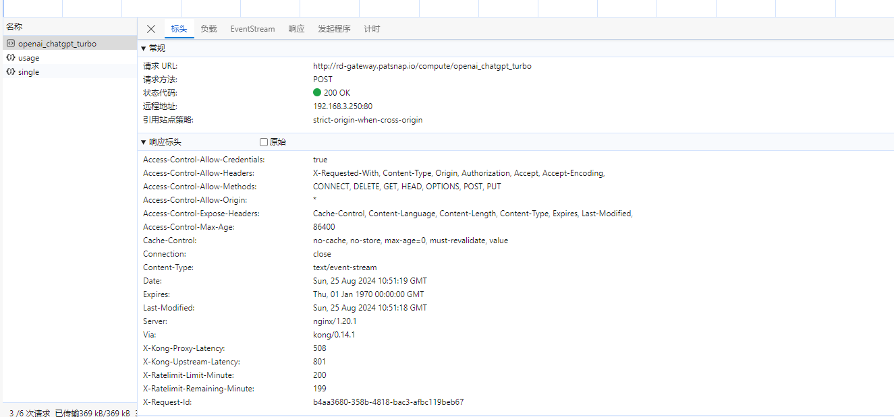
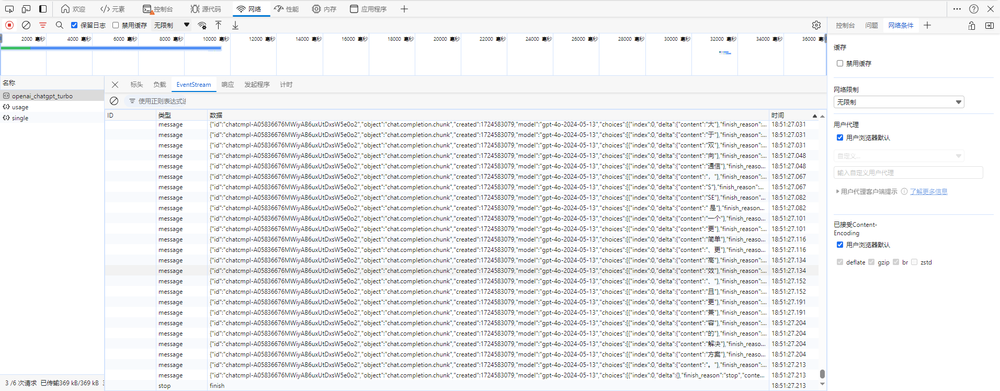

## 这个开发过程中有使用过 cookie 或者是 local storage， session storage 这种前端的缓存的能力吗，说说场景区别

在Web开发中，`cookie`、`localStorage`和`sessionStorage`都是常用的存储机制，用于在客户端保存数据。它们具有不同的特性，适用于不同的场景：

### Cookie

- **特性**：
  - **持久性**：Cookie的生命周期可以通过设置过期时间来控制。从几秒钟到几年不等。
  - **大小限制**：通常大小限制为4KB。
  - **服务器通信**：在每次HTTP请求中，浏览器都会将Cookie发送到服务器。
  - **安全性**：可以设置`HttpOnly`和`Secure`标志来提高安全性。

- **使用场景**：
  - **会话管理**：用于保存登录状态或用户会话信息。
  - **用户偏好**：记录用户的语言选择、主题等。
  - **跟踪用户行为**：广告商常用Cookie进行用户跟踪和分析。

### localStorage

- **特性**：
  - **持久性**：数据持久存储，除非显式删除，否则数据不会失效。
  - **大小限制**：通常能存储约5MB的数据，具体限制因浏览器而异。
  - **无服务器通信**：数据仅存储在客户端，不随请求发送到服务器。

- **使用场景**：
  - **大量数据存储**：适合于不需要与服务器同步的大量数据，比如保存应用设置或配置信息。
  - **离线应用**：可以用于存储在离线状态下使用的数据。
  - **用户数据缓存**：如缓存用户输入表单的数据，以防页面刷新导致数据丢失。

### sessionStorage

- **特性**：
  - **短暂性**：数据只在单一浏览会话中有效；当浏览器或标签页关闭时，数据会被清除。
  - **大小限制**：与`localStorage`类似，大约为5MB。
  - **无服务器通信**：同样不随请求发送到服务器。

- **使用场景**：
  - **一次性数据存储**：适用于仅在当前会话中需要的数据，如单次填写的表单信息。
  - **页面刷新保持状态**：在一次浏览会话中，允许页面刷新后数据仍然有效。
  - **多标签页隔离**：不同标签页间的数据需要彼此隔离时适用。

### 选择使用场景的区别

- **持久性需求**：若需要数据长时间有效而不随浏览器关闭删除，使用`cookie`或`localStorage`。若只需在当前标签页中有效，选择`sessionStorage`。
- **数据大小**：如果需要存储较大数据，`localStorage`和`sessionStorage`更合适，因为`cookie`的数据量非常有限。
- **服务器通信需求**：若需要在服务器端读取数据，需用`cookie`，因为它会随HTTP请求发送。`localStorage`和`sessionStorage`则不会。
- **安全性顾虑**：对安全要求高的数据不适合存储在`cookie`、`localStorage`或`sessionStorage`中，应该通过更安全的方式如加密或安全传输机制进行处理。

合理使用这些存储机制可以显著提升Web应用的用户体验和性能表现。选择正确的存储方案应根据应用的具体需求、数据类型、持久性及安全性考量。

## 如果你同时打开了两个浏览器的Tab，然后都是www.baidu.com，嗯，然后你在 TAB 1 下面的在对它的 session storage 进行了一些操作，那在 Tab 二下面同域名下这个 session 会同步到 Tab 二下面吗

`sessionStorage` 是在浏览器中用于存储会话级数据的一种机制，它有一些独特的特性，其中一个关键特性是它的数据仅在单个浏览会话中有效，并且在页面会话结束（即浏览器标签页或窗口关闭）时数据会被清除。

### 关于多个 Tab 的行为：

- **独立的会话**：每个浏览器标签页或窗口在同一个域下的 `sessionStorage` 是互相独立的。这意味着如果你在一个标签页中对 `sessionStorage` 进行了修改，另一个打开的标签页不会看到这些变化。
  
- **标签页不共享**：即使是同一个网站（例如 `www.baidu.com`）在不同的标签页中打开，每个标签页都有自己独立的 `sessionStorage` 实例。因此，对 `sessionStorage` 的任何读写操作都仅限于当前的标签页，不会自动同步到其他的标签页，即便它们指向同一个 URL。

### 场景说明：

如果你在 Tab 1 上对 `www.baidu.com` 的 `sessionStorage` 进行了一些操作，比如设置键值对，这些改变不会反映到 Tab 2 上的 `sessionStorage`。Tab 2 上的 `sessionStorage` 仍会保留它自己的初始状态，除非它自己也对 `sessionStorage` 进行操作。

### 使用提示：

- 如果需要在多个标签页之间共享数据，考虑使用 `localStorage`、`cookie` 或其他跨标签页数据共享的方法。
- 用于同一会话的临时数据而不需要持久化存储时，`sessionStorage` 是有用和安全的，因为它的隔离特性。

所以，对于你提到的情况，在 Tab 1 中对 `sessionStorage` 进行的操作不会影响 Tab 2。每个标签页的 `sessionStorage` 是隔离且独立的。

## local storage有什么样的限制？在存储的情况下，比方说触发了什么限制，拿不到 local storage

`localStorage` 是一种方便的客户端存储机制，但它也有一些限制和注意事项。了解这些限制可以更有效地利用 `localStorage`，避免在使用过程中出现问题：

### 限制

1. **容量限制**：
   - 各个浏览器对 `localStorage` 的存储容量有不同的限制，但通常每个域名有5MB左右的存储空间。
   - 当试图存储的数据超过此限制时，会抛出 `QuotaExceededError` 错误。

2. **同源策略**：
   - `localStorage` 遵循同源策略，即只有在相同协议、相同域名、相同端口下的页面才能访问其数据。
   - 不同域或子域无法共享同一个 `localStorage`。

3. **同步操作**：
   - `localStorage` 的操作是同步执行的，这意味着大量数据读写可能会导致性能问题或页面冻结，尤其是在主线程受到阻塞的情况下。

4. **数据格式**：
   - `localStorage` 只能存储字符串格式的数据。如果要存储对象或其他复杂数据类型，需要先将它们转换成字符串（例如使用 JSON.stringify）再存储。

5. **隐私模式**：
   - 在某些浏览器的隐私模式或无痕浏览模式下，`localStorage` 可能被禁用或不保持数据。

6. **浏览器支持**：
   - 虽然大多数现代浏览器都支持 `localStorage`，有些较旧的浏览器可能不完全支持。

### 无法获取 `localStorage` 时的情况

1. **禁用 JavaScript**：
   - 如果用户关闭了浏览器中的 JavaScript，那么任何对于 `localStorage` 的访问都会失败。

2. **隐私设置**：
   - 用户的隐私设置可能禁用了 `localStorage`。在隐私模式下，有些浏览器可能不支持 `localStorage`。

3. **浏览器的存储空间已满**：
   - 如果浏览器的存储配额已经达到上限，那么在继续写入数据时会触发 `QuotaExceededError`。

4. **跨域限制**：
   - 访问不同域的 `localStorage` 会因为同源策略而不被允许。

5. **用户的插件或扩展程序**：
   - 一些插件或扩展程序可能会干扰浏览器的存储机制。

应对这些限制，最好是尝试在使用`localStorage`之前检查其是否可用，并处理可能抛出的异常。这样可以提高应用的鲁棒性和用户体验。例如，在存储数据之前检查现有数据的大小并做出清理策略，或者在访问 `localStorage` 的时候使用 `try-catch` 块来捕获潜在的错误。

## 如果要是 local storage 存满了会怎么样

当 `localStorage` 达到其存储限制时（通常为每个域名约5MB，这可能因浏览器而异），尝试存储更多数据会导致以下情况：

1. **QuotaExceededError**：
   - 浏览器会抛出一个 `QuotaExceededError` 异常。此错误表示试图超过允许的存储空间。
   - 这通常发生在执行 `localStorage.setItem()` 方法时，且只有当新数据使当前存储的数据量超出上限时才会抛出。

2. **无数据写入**：
   - 尝试写入的数据将不会被保存到 `localStorage` 中。原有的数据依然保留，只有超出容量的新数据会被拒绝。

### 如何处理存储已满的情况？

1. **错误处理**：
   - 在使用 `localStorage.setItem()` 写入数据时，使用 `try-catch` 结构捕获 `QuotaExceededError`。这可以防止应用崩溃，并允许你处理错误。

   ```javascript
   try {
       localStorage.setItem('key', 'value');
   } catch (e) {
       if (e instanceof DOMException && e.code === 22) {
           console.error('LocalStorage quota exceeded');
       }
   }
   ```

2. **清理旧数据**：
   - 实施数据清理策略。例如，在存储新数据之前，清理掉不再需要的旧数据以释放空间。
   - 可以通过一开始设计好数据过期机制，比如在记录数据时同时记录时间戳，并定期删除过期的数据。

3. **压缩数据**：
   - 考虑对大块数据进行压缩以节省空间。例如，使用 JSON 的压缩算法。
   - 优化存储的数据结构，确保以更加高效的方式存储数据。

4. **用户反馈**：
   - 在检测到存储溢出错误时，给用户一些反馈或选项，比如清除一些不常用的数据或重新加载页面。

了解并处理 `localStorage` 的存储限制是开发应用时需要考虑的重要部分，有助于确保应用在不同情况下的稳定性和健壮性。

## cookie 有什么限制吗？比如说是什么情况下是前端拿不到这个 cookie 的？然后什么情况下是可以拿到它？有它相对于 local storage 或 session storage 有什么限制？

Cookies 是一种最初用于在客户端和服务器之间维护状态的小型文本数据存储方式。不过，使用 Cookies 会受到一些限制和条件影响，这些限制包括存储容量、安全设置、域名和路径限制等。具体来说：

### Cookies 的限制

1. **容量限制**：
   - Cookies 的大小通常限制为 4KB，每个域名下可以存储的 cookies 数量也是有限的（通常为 20 到 50 个不等，视浏览器而定）。

2. **数据类型限制**：
   - Cookies 只能存储字符串。复杂数据类型（如对象、数组）需要先转换为字符串（通常用 JSON 编码）才能存储。

3. **域名和路径限制**：
   - Cookies 与 domain 和 path 属性关联，限制其在哪些请求中可用。例如，设置特定的 domain 和 path 可以使得 cookies 在特定的子域或路径下可用。

4. **安全属性**：
   - `Secure` 属性：如果设置了此属性，Cookies 只能在 HTTPS 连接中发送。
   - `HttpOnly` 属性：如果设置了此属性，仅服务器端可以访问，限制 JavaScript 访问（无法通过 `document.cookie` 读取），有助于防御一些跨站脚本（XSS）攻击。

5. **SameSite 属性**：
   - `SameSite` 属性用于控制跨站请求时是否发送 cookies。可设置为 `Strict`、`Lax` 或 `None`。

### 前端无法访问 Cookie 的情形

1. **HttpOnly**：
   - 如果设置了 `HttpOnly` 属性，JavaScript 在客户端无法读取该 Cookies。

2. **跨域限制**：
   - Cookies 受制于同源政策，无法跨域访问。即一个域名或子域不能访问由其他域设置的 cookies。

3. **路径和域不匹配**：
   - 如果请求的路径或域不匹配 Cookies 的路径或域属性，Cookies 不会被发送，也无法在前端访问。

4. **浏览器设置**：
   - 用户可以通过浏览器的隐私设置禁用 cookies。

5. **`SameSite` 设置**：
   - 当 Cookies 的 `SameSite` 属性为 `Strict` 或 `Lax` 时，跨站请求可能会阻止 Cookies 的发送。

### Cookies vs. Local Storage/Session Storage

1. **存储容量**：
   - Cookies 大约限制为 4KB，而 `localStorage` 和 `sessionStorage` 的存储容量通常为每域 5MB 或更大。

2. **生命周期**：
   - Cookies 可以设置过期时间，更适合持久化情况，而 `localStorage` 数据没有过期限制，除非用户或代码主动清除。`sessionStorage` 数据在页面会话结束（通常是关闭浏览器标签页）后清除。

3. **通信功能**：
   - Cookies 可以自动随请求发送到与其 domain 和 path 属性匹配的服务器，适合用于需要与服务器通信的情况，而 `localStorage` 和 `sessionStorage` 只能在客户端使用，不会自动随请求发送。

4. **安全性**：
   - Cookies 提供一些安全属性（如 `Secure` 和 `HttpOnly`）来增加安全性，但也可能成为跨站点请求伪造（CSRF）和 XSS 攻击的目标。`localStorage` 和 `sessionStorage` 无这些属性，容易受到 XSS 攻击，需做好输入输出验证。

在选择使用哪种存储机制时，通常需要根据具体的应用场景、数据安全和持久性需求进行权衡。

## cookie 通过什么样的方式来实现前端和服务端的这个共享

Cookies 是一种特殊的 HTTP 头字段，能够在客户端（通常是浏览器）和服务端之间共享数据。其工作机制基于请求-响应模型，具体来说，通过以下方式实现共享：

### 1. 服务端设置 Cookies

服务端通过在 HTTP 响应中设置 `Set-Cookie` 头来创建 Cookies。例如：

```http
HTTP/1.1 200 OK
Set-Cookie: sessionId=abc123; Path=/; HttpOnly
```

#### 详细解析：

- **`Set-Cookie` 头**：这是服务端传递给客户端的命令，告诉浏览器存储一个 Cookies。
- **`sessionId=abc123`**：指示键值对，其中 `sessionId` 是 Cookies 的名称，`abc123` 是其值。
- **`Path=/`**：定义 Cookies 在何种路径下有效。这里的 `/` 表示在该域的所有路径下都有效。
- **`HttpOnly`**：指示此 Cookies 不能通过 JavaScript 的 `document.cookie` 访问，提高了安全性。

### 2. 客户端持久化和发送 Cookies

浏览器接收到来自服务端的 `Set-Cookie` 响应头后，会根据该命令创建和存储 Cookies。在随后的请求中，浏览器会自动将符合条件的 Cookies 发送给服务器。这是通过 HTTP 请求头中的 `Cookie` 字段实现的。例如：

```http
GET /dashboard HTTP/1.1
Host: example.com
Cookie: sessionId=abc123
```

#### 详细解析：

- **`Cookie` 头**：当客户端向服务端发送请求时，浏览器自动附加存储的、符合条件的 Cookies。
- **服务端可以从请求的 `Cookie` 头解析需要的信息。**

### 3. 共享机制

cookies 在客户端和服务端之间共享是通过请求和响应之间的 `Cookie` 和 `Set-Cookie` 头机制实现的：

- **读取 Cookies**：客户端可以使用 JavaScript 读取非 `HttpOnly` 的 Cookies 值，从而实现某些业务逻辑，如个性化展示，但注意安全性。
- **发送 Cookies**：由于请求中的 Cookies 会在每次匹配条件的请求中自动发送给服务端，因此服务端能够保持用户会话的状态并进行适当的响应处理。

### 4. 细节考虑

- **域和路径**：通过设置适当的 `domain` 和 `path`，可以控制 Cookies 被附加在哪些请求上，从而管理访问范围。
  
- **过期时间和生命周期**：使用 `Expires` 或 `Max-Age` 属性设置 Cookies 有效期限，从而控制其生命周期。

- **安全性属性**：使用 `Secure` 属性确保 Cookies 仅通过 HTTPS 发送，使用 `SameSite` 属性限制 Cookies 的跨站请求。

这种机制为客户端和服务端之间的数据共享提供了基础，常用于会话管理、用户追踪、个性化设置等场景。通过合理设置和使用 Cookies，有可能对系统的安全性和用户体验产生深远的影响。

## cookie具体通过哪些字段携带

Cookies 在 HTTP 请求和响应中通过特定的头字段进行传递和管理。以下是请求和响应中涉及 cookies 的关键字段和相关属性：

### 在 HTTP 响应中设置 Cookies

通常在服务器端响应中使用 `Set-Cookie` 头字段来设定 cookies。该字段可以包含多个属性：

1. **Name=Value**：
   - 必须字段，用于定义 Cookies 的名称和值。例如，`sessionId=abc123`。

2. **Expires**：
   - 指定 Cookies 的失效日期。例如，`Expires=Wed, 09 Jun 2023 10:18:14 GMT`。这是一个绝对时间。

3. **Max-Age**：
   - 设置 Cookies 的存活时长（秒数）。使用 `Max-Age=3600` 说明 cookies 在 3600 秒后失效。

4. **Domain**：
   - 指定 cookies 的有效域。例如，`Domain=example.com`。子域名可以共享此 cookies。

5. **Path**：
   - 限定 cookies 的使用路径。例如，`Path=/` 使 cookies 按照网站的根目录适用。

6. **Secure**：
   - 指示 cookies 仅通过 HTTPS 连接传输，增加数据传输过程中的安全性。

7. **HttpOnly**：
   - 设置该属性后，cookies 不可通过 JavaScript 的 `document.cookie` 访问，从而提高安全性。

8. **SameSite**：
   - 控制 cookies 的跨站请求行为。 可能的值包括：`Strict`、`Lax` 和 `None`。

示例：
```http
Set-Cookie: sessionId=abc123; Expires=Wed, 09 Jun 2023 10:18:14 GMT; Path=/; Domain=example.com; Secure; HttpOnly; SameSite=Lax
```

### 在 HTTP 请求中发送 Cookies

客户端（通常是浏览器）会在每次发送符合条件的请求时自动附带 `Cookie` 头字段。客户端的 `Cookie` 字段包含多个 cookies 的名称和值对，用分号和空格分隔。例如：

```http
Cookie: sessionId=abc123; theme=light; userId=789
```

- **Name=Value 对**：请求中携带的 cookies 的名称和值对，可以在请求中包含多个。

每个 cookies 都会根据浏览器管理的域和路径规则决定是否随请求发送，包括但不限于：

- 同源策略限制 cookies 的发送，仅发送到与其域和路径配置相符的服务器。
- `Secure` 选项限制 cookies 仅通过 HTTPS 通信。
- `SameSite` 限制 cookies 的跨域行为。

这些文件头字段和相关属性组合形成了一种灵活且功能强大的机制，确保明智地传递、访问和管理 cookies。它们广泛用于用户会话管理、偏好设置管理以及其他需要维持状态的场景。

## websocket

WebSocket 是一种通信协议，它提供了全双工通信通道，通过单个 TCP 连接实现客户端和服务器之间的即时数据交换。WebSocket 解决了传统 HTTP 协议在双向通信方面的局限性，使得实时应用开发（如在线聊天、股票行情、在线游戏等）变得更加高效和可行。

### WebSocket 的特点和优势

1. **全双工通信**：
   - WebSocket 允许客户端和服务器之间双向同时通信，无需像 HTTP 那样请求-响应的模式。这样可以显著降低延迟，提高实时性。

2. **单个持久连接**：
   - 与短时间即失效的 HTTP 连接不同，WebSocket 在初次连接建立后，保持一个持久的连接，用于传输数据，这减少了额外的 HTTP 连接开销。

3. **减少开销**：
   - 在 WebSocket 中，消息头较小，从而进一步减小了数据传输时的开销，与 HTTP 的高频短连接相比，WebSocket 更节省带宽。

4. **实时性**：
   - 因为信息可以立即从服务器推送到客户端，无需客户端不断轮询服务器。这样可以显著优化实时应用的用户体验。

### WebSocket 通信基础

1. **连接建立**：
   - WebSocket 连接是通过 HTTP/HTTPS 握手建立的。
   - 客户端通过发起带有 `Upgrade` 头的 HTTP 请求来请求从 HTTP 连接升级为 WebSocket 连接。

2. **握手过程**：
   - **客户端请求**：
     ```http
     GET /chat HTTP/1.1
     Host: server.example.com
     Upgrade: websocket
     Connection: Upgrade
     Sec-WebSocket-Key: dGhlIHNhbXBsZSBub25jZQ==
     Sec-WebSocket-Version: 13
     ```
   - **服务器响应**：
     ```http
     HTTP/1.1 101 Switching Protocols
     Upgrade: websocket
     Connection: Upgrade
     Sec-WebSocket-Accept: s3pPLMBiTxaQ9kYGzzhZRbK+xOo=
     ```

3. **数据帧**：
   - WebSocket 通过帧（frame）传输数据。
   - 每个帧包含一个帧头和可选的负载数据。
   - 帧细分了控制信息和负载数据，支持文本（UTF-8 编码）和二进制数据。

4. **关闭连接**：
   - 任何一方都可以发送帧请求关闭连接，并指定一个关闭状态码，表示关闭的原因。

### 使用场景

1. **在线游戏**：
   - 需要实时双向通信，WebSocket 可以提供低延迟的连续性连接。
   
2. **实时聊天**：
   - 支持实时消息发送和接收，不需要客户端轮询服务器。
   
3. **交易系统/股票行情**：
   - 高频率的数据推送，在市场震动时迅速通知客户端。
   
4. **协作编辑平台**：
   - 允许多个用户实时编辑同一文档或项目。

### 实现 WebSocket

#### 在浏览器中

JavaScript API 很简单：

```javascript
// 创建 WebSocket 对象并建立连接
const socket = new WebSocket('ws://example.com/socket');

// 监听连接打开事件
socket.addEventListener('open', function (event) {
    console.log("Connection established!");
    socket.send('Hello Server!');
});

// 监听消息事件
socket.addEventListener('message', function (event) {
    console.log('Message from server:', event.data);
});

// 监听关闭事件
socket.addEventListener('close', function(event) {
    console.log('Connection closed');
});

// 监听错误事件
socket.addEventListener('error', function(error) {
    console.log('WebSocket error:', error);
});
```

#### 在服务器上

服务器可以在不同平台和语言中实现，Node.js 中有多个库可以用来创建 WebSocket。例如，`ws` 是一个受欢迎的库：

```javascript
const WebSocket = require('ws');
const wss = new WebSocket.Server({ port: 8080 });

wss.on('connection', function connection(ws) {
    ws.on('message', function incoming(message) {
        console.log('received:', message);
        ws.send('Hello, client!');
    });

    ws.send('Welcome to WebSocket server!');
});
```

### 安全性和限制

- **安全性**：使用 WSS(`wss://`) 来确保数据传输的加密性。
  
- **跨域**：WebSocket 本身不受限于浏览器的同源策略，但需要注意服务器配置以防止恶意连接。

- **TCP/IP 限制**：由于基于 TCP/IP 协议，WebSocket 不适用于 UDP 的轻量和广播功能要求的应用。

### 总结

WebSocket 是一种强大的工具，能够在现代网络应用中实现实时、高效的数据传输。相比于传统的 HTTP 通信方式，WebSocket 通过其持久连接和全双工通信能力，显著提高了双向实时通信的响应速度和效率。

## websocket的握手流程

WebSocket 的握手流程是将现有的 HTTP/HTTPS 连接升级为 WebSocket 连接的过程。这个过程确保客户端与服务器之间的协议切换是安全可靠的，并由双方确认。握手过程通常包括以下步骤：

### 1. 客户端请求

客户端通过发送一个标准的 HTTP 请求来发起握手请求，但请求中包含一些特殊的头信息，表明希望升级到 WebSocket 协议。

**示例请求**：
```http
GET /chat HTTP/1.1
Host: server.example.com
Upgrade: websocket
Connection: Upgrade
Sec-WebSocket-Key: dGhlIHNhbXBsZSBub25jZQ==
Origin: http://example.com
Sec-WebSocket-Protocol: chat, superchat
Sec-WebSocket-Version: 13
```

- **GET**：请求行中使用 HTTP GET 方法请求建立连接。
- **Upgrade: websocket**：表明请求升级到 WebSocket 协议。
- **Connection: Upgrade**：表示当前连接要被“升级”。
- **Sec-WebSocket-Key**：一个 Base64 编码的随机字符串，由客户端生成，用于后续握手验证。
- **Origin**：说明请求来源，通常用来防止跨域攻击。
- **Sec-WebSocket-Protocol**：可选的，表明协议子集，以此来选择子协议。
- **Sec-WebSocket-Version**：表示 WebSocket 协议的版本，必须是 13。

### 2. 服务器响应

服务器收到请求后，确认请求中 Upgrade 和 Connection 头的值，验证 Sec-WebSocket-Key，返回 HTTP 101 状态代码表示协议切换成功，以及必要的头信息。

**示例响应**：
```http
HTTP/1.1 101 Switching Protocols
Upgrade: websocket
Connection: Upgrade
Sec-WebSocket-Accept: s3pPLMBiTxaQ9kYGzzhZRbK+xOo=
Sec-WebSocket-Protocol: chat
```

- **101 Switching Protocols**：表示协议切换成功，HTTP 连接被升级。
- **Upgrade: websocket**：确认切换到 WebSocket 协议。
- **Connection: Upgrade**：与请求头相匹配。
- **Sec-WebSocket-Accept**：这是服务器根据客户端提供的 `Sec-WebSocket-Key` 计算得出。服务器将客户端的 `Sec-WebSocket-Key` 和一个固定的全局唯一标识符 `258EAFA5-E914-47DA-95CA-C5AB0DC85B11` 拼接后，使用 SHA-1 哈希进行计算，再通过 Base64 编码得到结果。这个结果用于验证客户端的 WebSocket 握手请求。
- **Sec-WebSocket-Protocol**：表明选中的子协议（如果客户端请求了多个可选子协议）。

### 3. 握手成功

一旦服务器发回了标准的 101 HTTP 响应码，并确认了协议被升级，客户端会开始发送和接收 WebSocket 帧。此后，连接处于活跃状态，直到任一方发起连接关闭操作。

### 小结

WebSocket 握手是通过 HTTP/HTTPS 进行的标准请求/响应通讯过程。这种设计方式确保 WebSocket 可以正常穿越防火墙及代理服务器，因为它最初的请求与常规的 HTTP/HTTPS 请求并无二致。而通过握手过程中的特殊头来判断和进行协议切换，使得连接很安全并高效支持双向实时通信。

## SSE

服务器发送事件（Server-Sent Events，简称 SSE）是一种基于 HTTP 协议的技术，用于从服务器向客户端推送更新数据。SSE 是单向的，只能由服务器向客户端发送数据，不能从客户端向服务器发送数据。SSE 主要用于需要持续数据更新的应用场景，如实时新闻、股票价格、社交媒体更新等。

### SSE 的特点与优势

1. **简单性**：
   - 使用简单，符合 HTTP 协议，易于实施。
   - 不需要复杂的协议处理，仅需在客户端维护一个持久连接。

2. **自动重连**：
   - 浏览器会自动处理连接断开后的重连操作，可以为应用开发提供更高的可用性。

3. **文本事件传输**：
   - SSE 以文本格式发送事件，便于解析和处理。

4. **较低延迟**：
   - 通过持久连接推送数据，通常比传统的 HTTP 轮询方法具有更低的延迟。

5. **广泛的浏览器支持**：
   - 原生支持主流的现代浏览器，虽然不如 WebSocket 普及和强大，但在文本流用途上很有效。

### 工作原理

#### 1. 服务器端

服务器端通过持续发送带有特定格式的文本信息来实现数据推送。这些文本信息具有一定的格式，用于标识事件类型和数据内容。

**示例响应**：
```http
HTTP/1.1 200 OK
Content-Type: text/event-stream
Cache-Control: no-cache
Connection: keep-alive

retry: 10000
id: 1
event: message
data: Hello, world!

id: 2
data: Another message
```

- **Content-Type: text/event-stream**：设置响应的内容类型为 `text/event-stream`，表明是 SSE 数据流。
- **id**：可选，每个事件的唯一标识符，用于恢复连接时从正确的状态恢复。
- **event**：可选，事件类型名。客户端脚本可以监听特定类型的事件。
- **data**：事件传输的数据内容。可以有多行，连接成单个消息发送。
- **retry**：可选，表示在断开后浏览器重新连接的时间间隔，以毫秒为单位。

#### 2. 客户端

客户端使用 `EventSource` API 来接收服务器发送的事件。`EventSource` 自动处理连接维护和重试。

**示例 JavaScript 客户端代码**：
```javascript
if (typeof(EventSource) !== "undefined") {
    const source = new EventSource('http://example.com/events');

    source.onopen = function(event) {
        console.log("Connection to server opened.");
    };

    source.onmessage = function(event) {
        console.log("New message:", event.data);
    };
    
    source.addEventListener('message', function(event) {
        console.log("Another message:", event.data);
    });

    source.onerror = function(event) {
        console.error("EventSource failed:", event);
    };
} else {
    console.log("SSE not supported by the browser.");
}
```

### 适用的应用场景

1. **实时更新的新闻或博客**：
   - 需要定时刷新以获取最新内容，而 SSE 可以自动推送更新。

2. **实时报价或市场数据**：
   - 如股票、外汇市场监控。SSE 提供了允许客户端持续接收更新的方式。

3. **社交媒体动态**：
   - 实时聊天或消息通知流，实现数据不丢失的新鲜度推送。
   
4. **监控面板**：
   - 某些需要实时展示状态或事件的面板，适合使用 SSE。

### 与其他技术的比较

1. **与 WebSocket**：
   - SSE 是单向的，只能服务器向客户端推送数据，而 WebSocket 是双向的。
   - SSE 使用 HTTP 协议，在原有 HTTP 基础上增加灵活性和简单性，而 WebSocket 则是一个独立协议。

2. **与 HTTP 轮询/长轮询**：
   - 轮询需要客户端定期请求更新，这会带来较大延迟，和服务器负担，长轮询虽然改善了这一点，但实现复杂度增加。
   - SSE 优化了常规 HTTP 的缺陷，通过持久连接降低开销和复杂度。

3. **与 AJAX**：
   - AJAX 主要处理传统的请求-响应模型，而 SSE 专注于实时数据流。

### 总结

SSE 是一种纯文本下的高效事件推送机制，符合 HTTP 标准和简单实现的特性，适用于绝大多数浏览器环境。对于需要由服务器向浏览器频繁推送数据的场景，SSE 提供了一个较为轻量级的解决方案，并且不再需要复杂的客户端轮询逻辑。尽管 WebSocket 更为强大、灵活，能够进行双向通信，但对于许多与流数据推送相似的问题领域，SSE 提供了一个性能优良且简单可靠的工具。

## sse的握手过程





服务器发送事件（Server-Sent Events, SSE）使用 HTTP 协议之上的简单文本流来实现服务器向客户端推送事件的功能。相比于 WebSocket 的双向通信，SSE 的握手过程更加简单和直接。它实际上是一个标准的 HTTP 请求，用于建立从服务器到客户端的单向连接。

### SSE 握手过程详解

1. **客户端请求**

   客户端通过一个普通的 HTTP GET 请求来启动 SSE 连接。这个请求目的明确，即请求与服务器建立一个持久的连接来接收事件流。

   ```http
   GET /events HTTP/1.1
   Host: example.com
   Accept: text/event-stream
   ```

   - **GET /events**：请求路径可能是 `/events`，具体根据应用设计。
   - **Accept: text/event-stream**：表明客户端希望接收服务器发送的事件流，这个头尤其重要。

2. **服务器响应**

   服务器接收到请求后，以长连接的方式回复一个特殊格式的响应，response 的内容类型 为 `text/event-stream`。这个响应头表示数据将以事件流的形式持续发送而不是一次性返回：

   ```http
   HTTP/1.1 200 OK
   Content-Type: text/event-stream
   Cache-Control: no-cache
   Connection: keep-alive
   ```

   - **Content-Type: text/event-stream**：指示响应内容是 SSE 事件流。
   - **Cache-Control: no-cache**：防止代理服务器缓存响应。
   - **Connection: keep-alive**：保持连接的持续性，保证流数据的连续传输。

3. **数据流开始**

   一旦 SSE 连接建立，服务器开始以事件流的形式向客户端发送数据。数据块可以包含几个类型的字段：

   ```http
   id: 1
   event: message
   data: Hello, World!
   ```

   - **id**：事件的唯一标识符（可选），用于断线重连时标识从哪个事件开始。
   - **event**：事件类型（可选），客户端可以针对特定类型事件作出反应。
   - **data**：具体的事件数据，须用`data:`指示，每行一条信息。
   - **retry**：表示客户端应该在断开连接后等待的毫秒数后重新连接（可选）。

4. **客户端事件处理**

   客户端使用 `EventSource` 对象来处理这些事件。`EventSource` 在打开连接、接收数据、出错等情况下都有相应的事件触发：

   ```javascript
   const eventSource = new EventSource('/events');

   eventSource.onmessage = function(event) {
       console.log("Data received:", event.data);
   };

   eventSource.onerror = function(event) {
       console.error("Error occurred:", event);
   };
   ```

5. **自动重连**

   默认情况下，连接中断时，`EventSource` 对象会自动尝试重新连接服务器, 如果成功，客户端可以使用 ID 恢复到它们丢失的事件表.

### 总结

在执行上述过程时，握手细节显得简单而有效，这使得 SSE 特别适合在服务器到客户端的单向更新中使用。这种通信模式不需要复杂的协议切换，且加载小，适宜用在需要实时更新流、推送通知和其他广播信息的场景。与 WebSocket 不同，SSE 是一种更轻量级的协议，与标准 HTTP 兼容，因此易于与现有基础设施集成。

## 为什么ai问答的前端页面使用sse而不是websocket

在构建 AI 问答系统的前端页面时，选择使用 SSE（服务器发送事件）而不是 WebSocket 主要基于以下几个原因：

### 1. 单向数据流

AI 问答应用中的通信模式通常是由用户在客户端发送请求，然后服务器处理后将结果推送给客户端。这种场景天然符合 SSE 的单向数据流模型：

- **SSE**：适合于这种从服务器到客户端的单向数据流，客户端不需要主动向服务器发送持续信息，而只需要接收来自服务器的更新。
- **WebSocket**：设计用于双向通信，当需要频繁的双向数据交换时才更加合适。

### 2. 简单性与便利性

SSE 更加简单，易于实现，对于只需要服务器推消息给客户端的场景，SSE 提供了便捷的解决方案：

- **开发复杂度**：SSE 使用 HTTP 协议之上的文本流，而 WebSocket 则需要处理连接的管理和化繁为简的握手过程。
- **HTTP 友好性**：SSE 在 HTTP 上运行，易于跨越防火墙和代理，对现有的 HTTP 基础设施几乎没有改变。

### 3. 自动重连机制

SSE 有内置的自动重连机制，这一点非常利于提高应用的可用性和用户体验：

- **自动处理断开连接**：浏览器会在连接断开时自动尝试重新连接，而这个过程是透明的，不需要更多的代码实现。
- **方便接续**：借助于事件 ID（`event id`），SSE 可以方便地从中断点继续，使数据流保持一致性。

### 4. 浏览器支持

SSE 在现代浏览器中得到了很好的支持，并且实现方式上对常见场景已经足够：

- **广泛兼容性**：SSE 由大多数现代浏览器原生支持，并且可以在服务端简单实现。
- **自带 API**：SSE 使用 `EventSource` 接口，对开发者非常友好，将复杂性隐藏在 API 之后。

### 5. 延迟和效率

对于一些只需要接收数据而不需要实时发起请求的场景，SSE 是一种比 WebSocket 更高效的选择：

- **低延迟**：SSE 保持一个持久的连接，高效地传输信息，不需要频繁建立连接。
- **更少的资源消耗**：典型应用场景使用 SSE 需要的资源通常比 WebSocket 少，因为不涉及复杂的双向通信和心跳检测。

### 合适的应用场景

AI 问答系统的典型工作流可能是用户在前端进行问题输入，然后后端处理并将答案返回给用户。这种结果推送非常适合采用 SSE：

- 适合一对多广播场景，数据流简单、明确。
- 适用于需要以低延迟推送服务器事件而不需要返回结果的单向互动应用。

### 总结

SSE 很适合 AI 应用场景的原因主要在于通信模式的特性，简便的开发过程，以及 HTTP 友好的标准支持。WebSocket 则多用于复杂的双向通信应用，比如在线游戏、即时通信工具等。因此，在 AI 问答系统中，如果仅仅是为了实现从服务器向客户端推送 AI 计算结果或状态更新，SSE 是一种极为合适的选择

## 前后端交互的网络请求参数。

在前后端交互时，网络请求参数的设计和传递非常关键。这影响到系统的可维护性、安全性、效率和用户体验。以下是一些常见的参数设计及处理方式：

### 网络请求参数分类

1. **路径参数（Path Parameters）**
   - 用于 RESTful 风格的 API，通常用来标识特定资源。
   - 例如：`GET /api/users/{userId}`，其中 `{userId}` 是路径参数。

2. **查询参数（Query Parameters）**
   - 通常附加在 URL 的末尾，用于传递非敏感的、可以在 URL 显示的数据。
   - 格式为：`/api/items?category=books&page=2`。

3. **请求体参数（Body Parameters）**
   - 在 POST、PUT 等请求中，用于传输复杂和大的数据结构。
   - 常用 JSON 作为数据格式，包含在请求体中。

4. **头部参数（Header Parameters）**
   - 用于传递元信息，例如认证信息、客户端信息、内容类型等。
   - 例如：`Authorization: Bearer token`。

### 参数设计原则

1. **简洁明确**
   - 参数命名要清晰，便于理解和使用。例如，使用 `userId` 而不是 `uId`。

2. **安全性**
   - 避免在 URL 和 Header 中传递敏感信息，如密码和密钥。
   - 使用 HTTPS 协议确保数据在网络传输中的安全。

3. **灵活性和扩展性**
   - 在设计 API 时，确保参数能够支持未来的业务扩展。例如，通过引入新的可选查询参数支持更复杂的查询而不破坏现有功能。

4. **数据校验和验证**
   - 在发送请求之前和接收请求时，前后端都应对参数进行验证，确保数据格式和类型正确。

5. **使用规范和标准**
   - 遵从 RESTful 标准，合理使用路径参数、查询参数等。

### 常见的参数处理方式

1. **前端处理**
   - **构建请求**：使用 Fetch API 或 Axios 等库进行请求构建，处理路径、查询和请求体参数。
   - **参数验证**：在发送请求之前进行输入校验，确保参数合法。

2. **后端处理**
   - **解析参数**：从 URL、请求体或头部中解析参数。
   - **验证参数**：使用验证库（如 Joi、express-validator 等）进行参数的进一步验证。
   - **安全检查**：防止 SQL 注入、跨站脚本攻击（XSS）等。

### 例子

假设要设计一个获取用户信息的 API：

- 请求 URL: `GET /api/users/{userId}`
- 路径参数：`userId`，用于识别特定用户。
- 查询参数：如 `details=true` 控制返回的数据是否包括详细信息。
- 头部参数：`Authorization: Bearer token` 用于用户身份认证。

一个典型的请求构建：

```javascript
const userId = 123;
const token = 'your-auth-token';
fetch(`/api/users/${userId}?details=true`, {
  method: 'GET',
  headers: {
    'Authorization': `Bearer ${token}`,
    'Content-Type': 'application/json'
  }
}).then(response => response.json())
  .then(data => console.log(data));
```

通过合理设计和使用网络请求参数，可以大大提高前后端交互的效能，同时确保系统的安全性和可扩展性。

## 项目里用户名和密码是明文传输到后端的吗？

在项目中，**绝对不应该**以明文方式传输用户名和密码。这会严重威胁到用户的安全，因为明文传输的敏感信息很容易被窃听、截取和破解。为了保护用户的敏感信息，以下是一些常见的安全实践：

### 1. 使用 HTTPS 协议

- **加密传输**：确保所有数据，包括用户名和密码，通过 HTTPS 协议传输。这可以加密传输数据，避免在传输过程中被窃听。
- 通过 SSL/TLS 提供安全的通信通道，确保客户端与服务器之间的交互是保密和完整的。

### 2. 密码加密

- **客户端加密（可选）**：虽然 HTTPS 已经足够安全，但在一些高度敏感的应用中，可以在客户端使用加密算法（如 AES）对密码加密，然后再传输。不过，这是一个较少采用的做法，因为 SSL/TLS 本身已经提供了传输层的加密。

### 3. 不要在 URL 传输敏感数据

- 避免将用户名和密码作为查询参数在 URL 中传输，因为 URL 可能会被记录在服务器日志中或浏览器历史中而泄露。

### 4. 后端安全措施

- **哈希存储密码**：在保存用户密码时，绝不应该以明文形式保存。在后端使用强哈希算法（如 bcrypt, Argon2）对密码进行加密存储。
- **参数验证和清理**：在服务器端严格验证和清理收到的所有数据以防止注入攻击。

### 5. 身份验证机制

- **使用认证令牌**：例如 JWT 或 OAuth，可以避免直接传输密码。用户登录后，服务器生成一个令牌，前端只需在后续请求中附带该令牌即可进行身份验证。
- **开启跨站请求伪造（CSRF）保护**：防止攻击者在用户不知情的情况下执行身份验证操作。

通过以上安全措施，可以有效地保护用户的敏感信息，并提高系统的整体安全性与数据保护水平。在设计和实现身份验证机制时，务必认真遵循这些安全实践。

## ip地址和域名

IP 地址和域名是互联网通信的基础概念，它们在网络中扮演着重要角色，简化用户访问和数据传输的过程。

### IP 地址

**IP 地址**（Internet Protocol Address）是指分配给设备的一个数值标签，用于标识其在网络上的位置和进行网络通信。IP 地址有两种主要版本：

1. **IPv4**：
   - 由四个十进制数组成（范围为0到255），以点分隔，例如：`192.168.1.1`。
   - 由于地址数量有限，IPv4 地址的分配日益紧张。

2. **IPv6**：
   - 为了解决IPv4地址耗尽的问题，IPv6使用128位地址长度。
   - 通常表示为8组16进制数字，每组4个字符，以冒号分隔，例如：`2001:0db8:85a3:0000:0000:8a2e:0370:7334`。
   - 提供几乎无限的唯一地址，支持更多设备互联。

### 域名

**域名**（Domain Name）是用于识别人们和互联网的易于记忆的地址。它用来代替难以记忆的 IP 地址，使用户更方便地访问网站。主要特点包括：

1. **层次结构**：
   - 由多个部分组成，通过点号（`.`）分隔。通常有顶级域（TLD）、二级域名等，例如：`www.example.com`。
   - 顶级域名如 `.com`, `.org`, `.net`, 以及国家或地区代码如 `.cn`, `.uk`。

2. **DNS 系统**：
   - 域名系统（Domain Name System）负责将人类可读的域名转换为机器可读的 IP 地址。
   - DNS 服务器通过 DNS 解析（域名解析）过程，将用户输入的域名转换为对应的服务器 IP 地址进行访问。

### 工作原理

1. **用户输入域名**：用户在浏览器中输入一个域名，比如 `www.example.com`。

2. **DNS 解析**：浏览器通过 DNS 查找服务器，从而找到对应的 IP 地址。

3. **连接服务器**：浏览器使用得到的 IP 地址与目标服务器建立连接，并请求所需的资源。

4. **传输数据**：服务器接收请求，并返回相应的数据（如网页、图像、视频等）给浏览器。

IP 地址和域名相互配合，使得用户可以轻松访问互联网资源，而不必记忆复杂的数字地址。域名的管理通常由域名注册机构来进行，而互联网中的 IP 地址分配由国际和地区性的互联网注册机构进行管理。

## 网络协议都有哪几层？通过什么协议建立的连接

网络协议通常按照分层模型进行组织，以便标准化通信并简化设计。两种广泛使用的分层模型是 OSI 模型和 TCP/IP 模型。

### OSI 模型

OSI（开放系统互连）模型是一个理论模型，由七层组成：

1. **物理层**：负责传输原始比特流，通过电缆、电波等媒介。
2. **数据链路层**：提供节点到节点的数据传输，负责帧的生成、传输和校验。常见协议有以太网（Ethernet）、Wi-Fi 等。
3. **网络层**：负责数据包的路由和转发，如 IP (Internet Protocol)。
4. **传输层**：提供端到端的传输服务，协议包括 TCP (Transmission Control Protocol) 和 UDP (User Datagram Protocol)。
5. **会话层**：管理会话，维持连接，常用于会话维护和管理。
6. **表示层**：负责数据的格式化、加密和解密。
7. **应用层**：提供网络服务给应用软件，如 HTTP、FTP、SMTP 等。

### TCP/IP 模型

TCP/IP 模型是互联网的基础协议体系，较为简化，通常分为四层：

1. **网络接口层**（也称为链路层）：对应 OSI 的物理层和数据链路层。
2. **互联网层**：对应 OSI 的网络层，主要协议是 IP。
3. **传输层**：同 OSI 的传输层，主要协议是 TCP 和 UDP。
4. **应用层**：对应 OSI 的会话层、表示层和应用层，涵盖应用协议如 HTTP、FTP、DNS 等。

### 建立连接的协议

3. **通过什么协议建立的连接**

- **TCP（Transmission Control Protocol）**：用于建立可靠的连接。TCP 连接需要三次握手过程，以确保连接的稳定性和可靠性。常用于需要保证数据完整性的应用，如网页浏览 (HTTP/HTTPS)、文件传输 (FTP) 和电子邮件 (SMTP)。

- **UDP（User Datagram Protocol）**：用于建立不需要连接的传输协议。与 TCP 不同，UDP 不保证数据的可靠交付，更适合实时性要求较高或容许一定数据丢失的应用，如视频流、VOIP 和在线游戏。

根据不同的应用需求，网络程序会选择使用 TCP 或 UDP 来建立连接，以优化数据传输的速度、可靠性和实时性。

## TCP是怎么保证它的可靠性的

TCP（Transmission Control Protocol）是一种面向连接的协议，设计用于提供可靠的数据传输服务。它通过多种机制来确保数据的完整性和可靠性，这些机制包括：

1. **三次握手（Three-way Handshake）**：
   - 在传输数据之前，TCP 通过三次握手过程来建立连接，确保通信双方都准备好发送和接收数据。此过程有助于初始化顺序确认和窗口大小等信息。

2. **顺序数据传输（Ordered Data Transfer）**：
   - TCP 包含一个序列号系统，确保所有数据包按照发送顺序重新组装。这样的机制能够防止数据包乱序问题，尤其是在网络拥堵时。

3. **重传机制（Retransmission Mechanism）**：
   - TCP 使用确认（ACK）消息来确认数据包的接收。如果发生数据包丢失或损坏，发送方判断没有收到预期的 ACK 后会重传数据包。

4. **超时重传（Timeout Retransmission）**：
   - 如果发送方在一定时间（超时期限）内未收到 ACK，TCP 将自动重传该数据包，以应对丢失的数据包和临时中断。

5. **流量控制（Flow Control）**：
   - 使用滑动窗口协议，TCP 可以调节发送方的数据流速率，确保接收方不会被过量数据压倒。窗口大小动态变化，依据接收方的处理能力进行调整。

6. **拥塞控制（Congestion Control）**：
   - TCP 实现多种拥塞控制算法（如慢启动、拥塞避免、快速重传和快速恢复），以避免网络拥堵。这些算法调节发送数据的速度，确保不会超出网络的负载能力。

7. **错误检测（Error Detection）**：
   - TCP 使用校验和（checksum），在传输开始时计算并发送。接收方在收到数据时重新计算校验和，验证数据的完整性。如有错误则请求重传。

通过这些机制，TCP 确保数据能够在不可靠的网络环境中保持一致性和可靠性，为应用提供一个稳定的传输基础。

## cache-control,说一下对它的理解。no-store和no-cache的区别

`Cache-Control` 是 HTTP 协议中的一个重要头字段，用于指定请求和响应如何进行缓存。通过这一头字段，服务器可以控制资源在客户端和中间服务器（如代理服务器）中的缓存行为，以及缓存的时效性和条件。

### `Cache-Control` 基础概念

`Cache-Control` 的指令用于优化 HTTP 请求和响应的传输效率、减少网络带宽的使用，并改善用户体验提高资源访问速度。这个头字段中的指令可以分为请求指令和响应指令，常见的指令包括：

- `public`: 表示响应可以被任何缓存区缓存。
- `private`: 表示响应只能被单个用户缓存，不能共享缓存。
- `no-store`: 请求或响应禁止缓存，每次都要从源服务器获取数据。
- `no-cache`: 缓存可以存储，但是需要在使用之前重新验证。
- `max-age`: 指定资源在缓存中存储的最大时间（以秒为单位），例如：`max-age=3600`。
- `must-revalidate`: 必须重新验证缓存过期的内容。

### `no-store` 和 `no-cache` 的区别

- **`no-store`**:
  - 含义：完全禁止缓存机制，不保存请求和响应的任何内容，既不在客户端缓存，也不在中间服务器缓存。每次请求资源，总是从服务器获取。
  - 适用场景：敏感数据或实时数据更新，确保每次都从原始服务器获得最新数据。
  
- **`no-cache`**:
  - 含义：允许缓存，但是在使用缓存的副本之前，必须向服务器进行再验证。例如，浏览器在显示缓存的副本前会发出一个验证请求，以确认副本仍然是最新的。
  - 适用场景：希望减轻服务器压力和带宽负载，但在一定条件下保证数据的准确性和新鲜性。

### 实际应用

- 使用 `no-store` 可以确保诸如金融交易中的敏感数据不被无意缓存。
- 使用 `no-cache` 可以针对静态但需要不定时更新的数据（如配置文件）进行缓存优化，但需保证在过期时能正确重新验证和更新缓存。

总的来说，使用 `Cache-Control` 头字段可以有效地管理 HTTP 缓存策略，选择合适的策略可以提高网络应用的性能和安全性。了解如何正确地使用这些指令，有助于在开发中大幅提升页面加载速度和数据安全。

## null和undefind的区别，null一般怎么用?

`null` 和 `undefined` 是 JavaScript 中的两个表示“无值”或“空”的特殊值，但它们有着不同的用途和语义。

### 区别：

1. **类型和定义**:
   - `null` 是一个字面量，表示“空值”或“无对象”，它通常用于有意地赋值给变量，以表明该变量没有对象。`typeof null` 返回 `"object"`，这是一种历史遗留问题，因为在最初的 JavaScript 实现中，`null` 被认为是一个指向空地址的对象。
   - `undefined` 表示一个变量已经声明但尚未赋值。它是全局对象的一个属性，也可以由 JavaScript 引擎自动赋给未初始化的变量，或者在函数中没有明确返回值的地方被自动返回。`typeof undefined` 返回 `"undefined"`。

2. **用途**:
   - `null` 通常用于表示一个变量应该有一个对象或值，但目前为空。例如，在删除一个对象的属性或重置某些对象引用时，可以将其设为 `null`。
   - `undefined` 通常用于表示变量尚未赋值或不存在。它经常出现在函数参数未传递、对象属性不存在等情况下。

3. **使用场景**:
   - 使用 `null` 可以表示没有可用的对象或空值，开发者可以通过显式地将变量设置为 `null` 来表示变量的“空状态”。例如：
     ```javascript
     let user = null; // 没有设置用户对象
     ```
   - `undefined` 则更加用于检查变量是否已定义或初始化。例如，检查一个函数的参数是否传递：
     ```javascript
     function greet(name) {
       if (name === undefined) {
         console.log('Name not provided');
       } else {
         console.log('Hello, ' + name);
       }
     }
     ```

### 总结：

- `null` 是开发者可控的表述“空”的状态，用于明确意图地表示某个变量当前没有值。
- `undefined` 则更多是系统自动赋予表示未定义状态，当我们访问未初始化变量或属性时，会得到 `undefined`。
- 在编程中，合理地使用这两者可以更清晰地表述代码逻辑，从而减少理解和调试上的误解。

## 介绍一下promise，promise特性以及优缺点。

`Promise` 是 JavaScript 中的一种用于异步编程的对象，提供了一种更清晰和更具可读性的方式来处理异步操作。它是 ECMAScript 6 (ES6) 引入的特性，能够让开发者更好地管理异步代码的执行，从而避免陷入回调地狱。

### Promise 的基本概念

一个 `Promise` 对象代表一个在未来完成（或失败）的异步操作及其产生的值。它有三种状态：

1. **Pending (待定)**: 初始状态，既不是成功也不是失败。
2. **Fulfilled (已完成)**: 表示操作成功完成。
3. **Rejected (已拒绝)**: 表示操作失败。

一旦 `Promise` 的状态发生改变（从 Pending 变为 Fulfilled 或 Rejected），就会触发相关联的处理程序（handlers）。并且，状态一旦改变，就不会再变。

### Promise 的特性

1. **链式调用**:
   - 支持通过 `.then()` 方法进行链式调用，每个 `then` 返回的都是一个新的 `Promise`，可以串联多个异步操作。
2. **异常捕获**:
   - 异常自动传递，可以通过 `.catch()` 方法统一处理异常，提供了一种一致的错误处理方式。
3. **清晰的异步代码结构**:
   - 避免层层嵌套和回调地狱，使代码更易读，也更容易理解和维护。
4. **只处理一次**:
   - 每个 `Promise` 只会被处理一次，不会重复执行回调。

### Promise 的优点

1. **提高代码的可读性**:
   - 使用 `Promise` 可以写出更为线性的异步代码，避免传统回调函数格式导致的嵌套过深（即回调地狱）。
2. **错误处理更易管理**:
   - 提供了统一的异常处理机制，减少了因遗漏错误处理而导致的异常问题。
3. **支持组合操作**:
   - 通过 `Promise.all()` 和 `Promise.race()` 等方法，可以并行处理多个异步操作，并根据需求在全部完成或其中一个完成时继续操作。

### Promise 的缺点

1. **异常吞噬**：
   - 如果链中某一步忘记了错误处理，错误可能会被吞噬而未被检测到。
2. **复杂性增加**：
   - 对一些简单的异步操作而言，Promise 的链式调用和错误处理反而增加了复杂性。
3. **调试困难**：
   - 调试异步操作有时比较困难，尤其是在链条很长时，跟踪错误变得复杂。

## 性能分析有哪些指标

前端性能直接影响用户体验和交互效率。为了确保前端应用的高效性，前端性能分析需要关注多个关键指标。以下是一些常见且重要的前端性能分析指标：

### 1. 首屏时间（First Contentful Paint, FCP）
- **含义**：用户首次看到页面内容的时间。
- **衡量**：从页面开始加载到页面内容元素（如文本、图片）首次出现在屏幕上的时间。

### 2. 首字节时间（Time to First Byte, TTFB）
- **含义**：浏览器在发送请求后，从服务器接收第一个字节的时间。
- **衡量**：从浏览器请求发出到接收第一个字节响应的时间。

### 3. 首次绘制（First Paint, FP）
- **含义**：浏览器在屏幕上绘制任何像素的时间点。
- **衡量**：从导航开始到浏览器首次在屏幕上绘制任何视觉变化的时间。

### 4. 交互时间（Time to Interactive, TTI）
- **含义**：页面变得完全可交互的时间点。
- **衡量**：从导航开始到页面可可靠地响应用户输入的时间。

### 5. 完全加载时间（Load Time）
- **含义**：页面所有资源（包括图像、样式表、JavaScript）完全加载的时间。
- **衡量**：从导航开始到页面中的所有资源加载完毕的时间。

### 6. 首次意义性绘制时间（Largest Contentful Paint, LCP）
- **含义**：页面主内容展示所需的加载时间。
- **衡量**：从页面开始加载到最大的内容元素（如大型图像或块级文本）的渲染时间。

### 7. 持续阻塞时间（Total Blocking Time, TBT）
- **含义**：从 FCP（首次内容绘制）到 TTI（可交互）的时间之间，阻塞主线程的时间总和。
- **衡量**：这段时间中超过 50 毫秒的所有长任务的时间总和。

### 8. 累积布局偏移（Cumulative Layout Shift, CLS）
- **含义**：页面加载期间视觉内容的稳定性。
- **衡量**：在页面加载过程中，任何未预期页面布局变化的总和。

### 9. JavaScript 执行时间
- **含义**：关键 JavaScript 文件加载和执行所需的时间。
- **衡量**：解析和执行 JavaScript 的时间。

### 10. 资源大小和数量
- **含义**：页面加载的所有资源的总大小和请求数量。
- **衡量**：页面加载的总字节数和请求的总数。

### 11. 缓存利用率
- **含义**：利用浏览器缓存加载页面资源的比例。
- **衡量**：缓存命中率和缓存资源加载的性能影响。

### 12. DOM 解析时间（DOM Content Loaded, DCL）
- **含义**：浏览器完全解析 HTML 文档并构建 DOM 树的时间。
- **衡量**：从导航开始到 DOMContentLoaded 事件触发的时间。

### 13. CSS 解析时间
- **含义**：样式表（CSS）加载和解析所花费的时间。
- **衡量**：CSS 文件完全加载和解析完成的时间。

### 14. 链接和脚本阻塞时间
- **含义**：阻塞浏览器渲染的外部脚本和链接加载时间。
- **衡量**：阻塞资源的总加载和执行时间。

### 15. 网络请求时间（Network Request Time）
- **含义**：个别网络请求的时间，包括 DNS 查找、连接时间、TLS 握手时间等。
- **衡量**：总请求时间以及各部分的具体时间。

### 16. 图片和媒体加载时间
- **含义**：页面中所有图片和其他媒体文件的加载时间。
- **衡量**：各个图像和媒体资源加载完成所需的总时间。

### 17. 脚本错误率
- **含义**：前端脚本执行期间发生错误的比例。
- **衡量**：脚本错误的总数和错误率。

### 18. 用户交互延迟（Input Delay）
- **含义**：用户进行输入或点击操作到页面实际响应的时间。
- **衡量**：用户交互和页面响应之间的时间差。

### 19. 渲染帧率（Frames Per Second, FPS）
- **含义**：页面在浏览器中渲染帧的速率。
- **衡量**：每秒钟渲染的帧数，通常期望保持在 60 FPS 以上以确保流畅的用户体验。

### 20. 内存使用（Memory Usage）
- **含义**：浏览器在加载和运行页面时使用的内存数量。
- **衡量**：总内存使用量和峰值内存使用量。

全面的前端性能分析需要结合多个指标，通过工具如 Google 的 Lighthouse、WebPageTest、Chrome DevTools、Performance 很多监控服务和工具来获得这些指标，并不断优化和改进，以提供最佳的用户体验。

## 局域网怎么链接外部

局域网（LAN，Local Area Network）通常是指一个相对小的、基于地理位置的网络，例如家庭、办公室或校园网络。要让局域网中的设备连接到外部网络（即互联网），通常需要以下几个步骤和设备：

### 1. 硬件和网络结构

**1.1 路由器**

- 路由器是连接局域网和广域网（WAN，Wide Area Network，例如互联网）的关键设备。它具有连接内网和互联网的功能。
- 路由器有两个接口：
  - **WAN 接口**：连接到外部网络（通常是通过调制解调器连接到互联网服务提供商，ISP）。
  - **LAN 接口**：连接到局域网内部设备（电脑、打印机、手机等）。

**1.2 调制解调器**

- 调制解调器将来自 ISP 的信号（通常是光纤、电缆或DSL信号）转换为以太网信号，从而可以被路由器使用。

### 2. 网络配置

**2.1 路由器的设置**

- 配置路由器的 WAN 接口，确保其能够从 ISP 获取外部 IP 地址（通常是通过 DHCP 自动获取）。
- 路由器通过 NAT（Network Address Translation，网络地址转换）将局域网内部的私有 IP 地址映射到一个公共的 IP 地址，用于互联网通信。

**2.2 局域网设置**

- 路由器的 DHCP 服务器功能会为局域网内的设备分配本地 IP 地址。
- 局域网内的设备通过这个本地 IP 地址进行内部通信，并通过路由器访问外部网络。

### 3. DNS 配置

- 确保路由器和局域网内的设备配置了正确的 DNS（Domain Name System，域名系统）服务器地址，用于解析域名到 IP 地址。

### 4. 安全设置

- 配置防火墙规则，确保局域网内的设备受到保护，防止未经授权的外部访问。
- 配置 Wi-Fi 的安全设置，使用 WPA3 或者 WPA2 加密，确保网络安全。

### 连接示例

假设你有一个家庭网络，配置步骤可能如下：

1. **连接调制解调器**
   - 将 ISP 提供的调制解调器连接到墙上的网络接口。
   - 将调制解调器与路由器的 WAN 端口连接。

2. **配置路由器**
   - 访问路由器的管理界面对其进行配置（通常可以通过访问 `192.168.1.1` 或 `192.168.0.1` 进入管理界面，具体视路由器品牌和型号而定）。
   - 在 `WAN` 设置中，确保路由器通过 DHCP 获取 IP 地址。

3. **局域网设备连接**
   - 将局域网内的设备（电脑、手机等）连接到路由器的 LAN 端口或通过 Wi-Fi 连接。
   - 设备会通过 DHCP 获取本地 IP 地址。

4. **测试连接**
   - 在局域网内的设备上访问互联网，测试连接是否正常。

### 图示（简化版）

```plaintext
┌──────────────────────────────┐
│    互联网（ISP提供的连接）       │
└─────────────┬────────────────┘
              │
     ┌────────▼────────┐
     │   调制解调器    │（ISP提供）
     └────────┬────────┘
              │
     ┌────────▼────────┐
     │     路由器      │
     │ (NAT、DHCP、防火墙) │
     └────────┬────────┘
              │
   ┌──────────┼───────────┐
   │          │           │
┌──▼──┐   ┌───▼───┐   ┌───▼───┐
│PC1  │   │ Printer │   │ Phone│
└─────┘   └────────┘   └───────┘
```

通过以上配置，局域网内的设备就可以通过路由器连接到外部网络，即互联网。

## ftp协议干嘛的

FTP（File Transfer Protocol，文件传输协议）是一种用于在计算机网络间传输文件的标准通信协议。其主要功能包括：

1. **文件传输**:
   - **上传文件**: 从客户端计算机上传文件到服务器。
   - **下载文件**: 从服务器下载文件到客户端计算机。

2. **目录管理**:
   - **查看目录**: 检索和显示服务器上的目录和文件列表。
   - **创建、删除和移动文件/目录**: 在服务器上管理文件和目录的操作，包括创建新目录、删除文件和目录、重命名和移动等。

3. **访问控制**:
   - **用户认证**: 通过用户名和密码进行身份验证，确保只有授权用户可以访问和操作文件。
   - **权限管理**: 设置文件和目录的访问权限，控制哪些用户或组可以读取、写入或执行特定文件。

4. **支持多种传输模式**:
   - **ASCII模式**: 用于传输文本文件，自动处理不同系统的换行符。
   - **二进制模式**: 用于传输非文本文件，如图像、音频、视频和压缩文件，确保文件完整性。

FTP协议通常用于需要可靠和高效传输文件的场合，如网站文件更新、文件共享、系统备份和数据迁移等。然而，由于FTP协议缺乏加密机制，其传输内容（包括用户名和密码）可以被截获。因此，安全需求较高的场合可能使用更安全的协议替代，如SFTP（SSH File Transfer Protocol）或FTPS（FTP Secure），它们增加了加密和安全认证功能。

## nginx是什么，它反向代理底层实现

Nginx 是一个高性能的 Web 服务器和反向代理服务器，也是一个 IMAP/POP3/SMTP 代理服务器。广泛用于处理高并发连接、提供负载均衡、缓存、以及静态内容的快速处理等场景。Nginx 的轻量级、模块化架构和高效率使其成为许多企业和个人的首选服务器之一。

### 主要功能

1. **反向代理**:
   - 将客户端的请求转发至后端服务器，并将响应发送回客户端。它有效地隐藏了后端服务器的存在，增加了一层安全性。

2. **负载均衡**:
   - 通过将请求分配到多个服务器上，Nginx 提供了良好的负载均衡能力，支持多种调度算法，如轮询、Least Connections 和 IP Hash。

3. **HTTP 缓存**:
   - Nginx 可作为缓存服务器使用，缓存后端服务器响应的内容，以减轻后端服务器的负载和提高响应速度。

4. **静态文件处理**:
   - 高效地提供静态文件服务，如 HTML、图片、JavaScript 和 CSS 文件等。

5. **安全与访问控制**:
   - 提供 SSL/TLS 支持，允许配置细粒度的访问控制规则。

### 反向代理的底层实现

Nginx 反向代理的底层实现结合了事件驱动和异步非阻塞处理机制，主要特点包括：

1. **事件驱动架构**:
   - Nginx 使用事件驱动架构来处理请求。这意味着它可以利用单个线程来管理数千个并发连接，从而减少内存消耗和上下文切换开销。

2. **异步非阻塞 I/O**:
   - Nginx 使用操作系统提供的异步非阻塞 I/O 支持（如 `epoll`、`kqueue`），避免在等待 I/O 操作完成时阻塞进程。它通过事件通知机制在 I/O 完成时获得通知，从而处理请求。

3. **请求处理管道**:
   - 当接受一个客户端请求后，Nginx 会根据配置解析该请求，并将其转发给指定的后端服务器。处理响应时，Nginx 可以逐块读取数据并立即发送回客户端，从而有效减少延迟。

4. **连接池和复用**:
   - 为了提高性能，Nginx 实现了连接池机制，用以管理后端服务器的连接，减小建立和关闭连接的频繁消耗。

5. **模块化设计**:
   - Nginx 以模块化方式实现功能扩展，用户可以根据需要加载不同模块进行功能调整和扩展，如压缩、访问控制等。

总体来说，Nginx 的高性能和灵活性为其反向代理功能提供了坚实的底层技术支持，使其能够在高并发和多任务处理的环境下高效运行。

## 向后端发请求的时候，经常会遇到先选一个选项发请求，这个请求可能有一段时间才能相应，然后又选了另一个选项，你怎么保证我的数据是正确的？

1. 请求是可以打断的，比如fetch可以通过AbortController中断请求，然后去发最新的请求就行了

## AbortController原理

`AbortController` 和 `AbortSignal` 的实现原理主要依赖于事件发布-订阅模式（也称为观察者模式），并通过 JavaScript 的 Promise 和事件模型来实现对异步操作的取消控制。下面深入探讨其背后的技术实现原理。

### 实现原理

1. **事件发布-订阅模式**：
   - `AbortController` 充当发布者，而 `AbortSignal` 作为信号的订阅者。`AbortSignal` 会监听来自 `AbortController` 的信号。
   - 当 `AbortController` 调用 `abort()` 时，它会向所有关联的 `AbortSignal` 发送一个中止通知。

2. **AbortSignal 与 EventTarget**：
   - `AbortSignal` 实现自 `EventTarget` 接口，这意味着它具有标准的事件处理方法（如 `addEventListener`、`removeEventListener`）。
   - 这允许开发者通过事件监听器来响应信号的中止，例如监听 `abort` 事件。

3. **状态管理**：
   - `AbortSignal` 内部维护一个状态，表示该信号是否已中止。
   - 当 `AbortController` 的 `abort()` 方法被调用时，该状态会被更新，并触发一个 `abort` 事件。这一事件会通知所有的监听器，以及任何关联的 Promise，使它们能够适当地处理终止逻辑。

4. **Promise 中止**：
   - 在实际用例如网络请求中，例如使用 `fetch` API，`AbortSignal` 的实现需要与异步操作的 Promise 结合使用。
   - 当 `AbortController` 发出中止信号时，这种异步操作需要检测其对应的 `AbortSignal` 的状态，并在相应的 Promise 被标记为中止（通常通过抛出一个 `AbortError` 错误），让开发者可以用 `.catch()` 或 `try-catch` 块来处理取消后的逻辑。

5. **整合到浏览器 API**：
   - 浏览器的内建 API（例如 `fetch`）在实现上被扩展，以支持 `AbortSignal`。因此，当 `fetch` 请求启动时，它会观察传入的 `AbortSignal` 的状态。
   - 一旦 `signal` 被触发，`fetch` 的实现会捕捉到这个状态变化并终止请求，抛出一个 `AbortError`。

### 示例

下面简单的代码示例演示了 `AbortController` 和 `AbortSignal` 的工作流程：

```javascript
// 创建一个 AbortController 实例
const controller = new AbortController();
const signal = controller.signal;

// 模拟一个长时间的异步操作，比如 fetch 请求
fetch('https://example.com/data', { signal })
  .then(response => response.json())
  .then(data => console.log(data))
  .catch(err => {
    if (err.name === 'AbortError') {
      console.log('请求被中止');
    } else {
      console.error('请求失败:', err);
    }
  });

// 在某个条件下中止请求，比如用户离开页面或需要取消不必要的请求
setTimeout(() => {
  controller.abort();
  console.log('请求已被手动中止');
}, 5000);
```

### 实现中的关键要点

- **事件驱动与异步机制结合**：`AbortSignal` 的设计依赖事件驱动模型，以便在状态变更时通知所有相关的异步操作。
- **标准化**：`AbortController` 和 `AbortSignal` 的实现是浏览器原生标准 API 扩展的一部分，这使得它们与 JavaScript 异步生态系统得到很好的集成。
- **灵活的异步控制**：通过与 Promise 机制整合，开发者可以在诸如网络请求、异步计时器和自定义异步操作中有效地应用。

整体来说，`AbortController` 和 `AbortSignal` 提供了开发者一个标准且强大的工具，以精确控制异步操作的生命周期，尤其是在涉及资源管理和用户交互复杂的场景中。

## dns寻址过程

## 403

##  浏览器响应码 403 (Forbidden) 解释

当浏览器请求一个网页时，如果服务器理解了请求，但是拒绝授权访问，就会返回 **403 Forbidden**  错误。 这意味着你没有足够的权限访问请求的资源。 

**常见原因:**

* **权限不足:** 你尝试访问的页面或资源需要特定权限，而你当前的账户没有这些权限。 例如，你尝试访问网站后台，但你并非管理员。
* **身份验证失败:**  你可能需要登录才能访问该资源，但你的登录信息无效或已过期。
* **网站设置:**  网站所有者可能配置了服务器，禁止特定 IP 地址或用户代理访问特定资源。
* **文件或文件夹权限:**  你尝试访问的文件或文件夹可能设置了错误的权限，导致 Web 服务器无法读取或执行它们。
* **.htaccess 文件错误:**  `.htaccess` 文件用于控制网站访问，错误的配置可能导致 403 错误。
* **防火墙设置:**  防火墙可能阻止了你对网站的访问。


**解决方法:**

* **检查网址:** 确保你输入的网址正确，并且你确实有权访问该页面。
* **登录:**  如果需要登录，请尝试使用正确的用户名和密码登录。 
* **联系网站管理员:**  如果你认为自己应该有权限访问该页面，请联系网站管理员寻求帮助。
* **清除浏览器缓存和 Cookies:** 有时，浏览器缓存会导致问题，尝试清除缓存和 cookies 之后再试一次。
* **稍后再试:**  问题可能是暂时的，可以稍后再试。
* **检查文件或文件夹权限:**  如果你有服务器访问权限，请检查相关文件和文件夹的权限设置。
* **检查 .htaccess 文件:**  确保 `.htaccess` 文件没有错误配置。
* **检查防火墙设置:** 确保防火墙没有阻止你访问该网站。


**其他建议:**

* 仔细阅读错误信息： 有些网站会提供更详细的错误信息，帮助你找到问题所在。
* 使用其他浏览器或设备测试： 尝试使用其他浏览器或设备访问该网站，看是否能解决问题。


如果以上方法都无法解决问题，建议你联系网站管理员或技术支持寻求进一步的帮助。

## jsonp的原理是什么，是标签允许跨域还是某个属性允许跨域

你对 JSONP 的理解很到位！它的确利用了 `<script>` 标签不受同源策略限制的特点来实现跨域获取数据的。

**让我们更详细地解析 JSONP 的原理：**

1. **同源策略的限制：**  浏览器出于安全考虑，实施了同源策略。简单来说，它限制了来自不同源（协议、域名、端口都相同）的 JavaScript 代码之间的交互。这意味着，使用 XMLHttpRequest 或 Fetch API 通常只能请求相同域下的数据。

2. **`<script>` 标签的例外：** 浏览器允许 `<script>` 标签加载并执行来自任何域的 JavaScript 代码。这就是 JSONP 利用的漏洞！

3. **JSONP 的巧妙之处：**
   - **服务器端配合：** 你请求的服务器必须支持 JSONP。它会将数据包装在一个预先约定好的 JavaScript 函数调用中，而不是直接返回 JSON 数据。
   - **客户端的回调函数：** 在客户端，你需要定义一个与服务器约定好的回调函数。
   - **动态创建 `<script>` 标签：** 当你想要请求跨域数据时，JavaScript 代码会动态创建一个 `<script>` 标签，并将它的 `src` 属性设置为目标 URL，该 URL 包含要传递给回调函数的数据。
   - **数据传递与执行：** 浏览器加载 `<script>` 标签，并将服务器返回的代码（包含你的数据和回调函数调用）作为 JavaScript 执行。
   - **回调函数处理数据：**  预定义的回调函数被调用，并将服务器传递的数据作为参数，从而让你可以在客户端访问跨域数据。

**举个例子：**

```html
<!-- 客户端代码 -->
<script>
  function handleResponse(data) {
    console.log(data); // 处理接收到的数据
  }

  const script = document.createElement('script');
  script.src = 'https://example.com/api/data?callback=handleResponse'; // 假设服务器支持 JSONP
  document.body.appendChild(script); 
</script>
```

```javascript
// 服务器端代码 (示例)
const data = { name: 'Alice', age: 30 };
const callbackName = request.query.callback; // 获取回调函数名
response.send(`${callbackName}(${JSON.stringify(data)})`); 
```

**总结：**

-  JSONP 并不是 HTML 中某个属性允许跨域，而是利用了 `<script>` 标签本身不受同源策略限制的特性。
-  它需要服务器端的配合，将数据包装在回调函数中。
-  虽然 JSONP 可以解决跨域数据请求的问题，但它也有一些缺点，例如：
    -  只支持 GET 请求。
    -  安全性较低，容易受到跨站请求伪造（CSRF）攻击。

## IP地址的作用

IP地址（Internet Protocol Address）是设备在网络中进行识别和通信的重要标识符。它的主要作用包括以下几个方面：

1. **设备标识**：
   - IP地址为网络上每个设备提供了一个唯一的标识符，类似于邮寄地址，用于在网络中区分不同设备。
   
2. **位置信息**：
   - IP地址可以提供设备相对的地理位置（如国家、城市）信息，虽然这种定位并不精确，但在整体网络架构中具有指导意义。

3. **数据传输**：
   - IP地址被用于数据包的路由。它确保数据从源地址传输到目标地址。路由器和交换机等网络设备利用IP地址来实现数据传输的正确路径选择。

4. **网络管理**：
   - IP地址有助于网络管理员进行监控、管理和维护网络。通过查看IP地址，可以识别潜在的网络问题、监控网络流量和进行访问控制。

5. **远程访问和连接**：
   - IP地址允许用户通过互联网实现远程访问，例如远程桌面连接、服务器访问等。

6. **安全控制**：
   - IP地址也是网络安全系统的重要组成部分。防火墙和入侵检测系统可利用IP地址来设定规则，允许或阻止某些IP地址范围的访问。

7. **域名解析**：
   - IP地址与域名系统（DNS）一起工作。DNS将易于理解的域名（例如，www.example.com）转换为IP地址，从而使用户更容易访问网站。

IP地址分为IPv4和IPv6两种版本。IPv4使用32位地址格式，最多可支持约43亿个唯一地址。随着互联网的快速增长，IPv4地址逐渐短缺，于是引入了IPv6，其使用128位地址格式，可以提供更大的地址空间。

总体来说，IP地址是互联网及其相关系统基础设施中不可或缺的组成部分，确保了设备互联互通和数据的有效传递。

## https握手加密的关键是什么

HTTPS（Hypertext Transfer Protocol Secure）是通过在 HTTP 协议上增加 SSL/TLS 层来实现数据加密和安全传输的协议。HTTPS 握手过程是建立安全连接的关键，它确保客户端和服务器之间的数据传输是加密和验证的。HTTPS 握手过程的核心在于 **TLS（Transport Layer Security）握手**，其加密的关键在于以下几个方面：

### 1. 协议协商
客户端和服务器首先协商使用的 TLS 版本和加密算法。TLS 版本和加密套件决定了用于会话的加密算法、密钥交换算法、哈希算法等。

### 2. 服务器身份验证和公钥交换
服务器通过发送其数字证书（通常由受信任的证书颁发机构 CA 签发）来验证自己的身份。这个证书包含服务器的公钥，客户端通过验证证书来确保服务器的真实性。

### 3. 对称密钥生成
通过交换部分密钥材料，客户端和服务器生成一个共享的会话密钥，用于之后的对称加密通信。常见的密钥交换方法包括 RSA、Diffie-Hellman（DH）、Elliptic Curve Diffie-Hellman（ECDH）等。

### 4. 会话加密
一旦生成并共享了对称密钥，就会使用对称加密算法（如 AES 或 ChaCha20）加密通讯数据，从而保证数据在传输过程中的保密性和完整性。

### HTTPS/TLS 握手过程的详细步骤

1. **客户端问候（Client Hello）**
客户端向服务器发送问候消息，其中包括支持的 TLS 版本、加密套件列表、压缩方法和一个随机数（Client Random）。

```plaintext
Client Hello
  - TLS 版本
  - 支持的加密套件列表
  - 客户端随机数（Client Random）
  - 扩展字段（如支持的协议、散列算法等）
```

2. **服务器问候（Server Hello）**
服务器选择一组加密参数，并回应客户端问候消息，包括确定的 TLS 版本、加密套件、压缩方法和服务器随机数（Server Random）。

```plaintext
Server Hello
  - 确定的 TLS 版本
  - 确定的加密套件
  - 服务器随机数（Server Random）
```

3. **服务器发送证书（Server Certificate）**
服务器向客户端发送其数字证书。客户端验证证书是否合法，如证书是否由受信任的 CA 签发。

```plaintext
Server Certificate
  - 服务器证书
```

4. **（可选）服务器密钥交换（Server Key Exchange）**
如果密钥交换算法需要额外的密钥材料（如 ECDHE），服务器会发送服务器密钥交换消息。

```plaintext
Server Key Exchange
  - 额外的密钥材料
```

5. **服务器问候完毕（Server Hello Done）**
服务器表示它的问候阶段已结束。

```plaintext
Server Hello Done
```

6. **客户端密钥交换（Client Key Exchange）**
客户端生成预主密钥（Pre-Master Secret），并用服务器的公钥加密后发送给服务器。预主密钥结合客户端和服务器的随机数生成会话密钥（Master Secret）。

```plaintext
Client Key Exchange
  - 预主密钥（加密）
```

7. **客户端问候结束（Client Finished）**
客户端向服务器发送一条受会话密钥保护的“Finished”消息，表示客户端问候阶段结束。

```plaintext
Client Finished
```

8. **服务器问候结束（Server Finished）**
服务器用会话密钥加密前面的握手消息，并发送“Finished”消息以确认握手过程已完成。

```plaintext
Server Finished
```

在这个过程中，**加密的关键**包括：

1. **数字证书**：确保服务器身份的真实性。
2. **非对称加密**：用于安全地交换会话密钥（如 RSA）。
3. **对称加密**：用于保护实际数据传输的内容（如 AES）。
4. **哈希函数**：用于数据完整性验证和消息认证（如 SHA-256）。

### 会话密钥的生成

1. **预主密钥**：预主密钥是通过客户端和服务器间的密钥交换协议（如 RSA、DH、ECDH）生成的。
2. **随机数**：客户端和服务器各自生成一个随机数（Client Random 和 Server Random）。
3. **主密钥**：结合预主密钥和随机数生成主密钥。

```plaintext
Master Secret = PRF(Pre-Master Secret, "master secret", Client Random + Server Random)
```

### 加密通信

在握手阶段结束后，使用 Pseudo-random Function (PRF) 生成会话密钥进行对称加密通信，以保证数据传输的保密性和完整性：

```plaintext
Session Key = PRF(Master Secret, "key expansion", Server Random + Client Random)
```

### 总结

HTTPS 握手加密的关键在于：

- **数字证书和公钥技术**：用于认证服务器身份和安全交换预主密钥。
- **预主密钥和主密钥**：通过客户端和服务器的随机数生成安全的会话密钥。
- **对称加密和哈希算法**：用于加密会话数据和确保数据传输的完整性。

这整个过程使得 HTTPS 能够提供强大的安全性，保护用户数据免受窃取和篡改。

## https是怎么防止证书被篡改的

HTTPS通过使用数字证书来确保通信的安全性，而防止证书被篡改的机制主要依赖于公钥基础设施（PKI）和相关的信任链系统。以下是HTTPS防止证书被篡改的关键要素：

1. **数字签名**：
   - 数字证书由权威的证书颁发机构（CA）签署。CA使用它们的私钥对证书进行数字签名。客户端在收到证书时，可以使用CA的公钥来验证该签名的有效性，从而确认证书没有被篡改。

2. **证书链与信任链**：
   - 每个证书除了提供自身的信息，还会包含一系列的中间证书，形成了一个信任链，最终指向根证书。操作系统和浏览器通常有一组预装的信任根证书。通过这条链，客户端能够验证证书的合法性。

3. **证书吊销列表（CRL）与在线证书状态协议（OCSP）**：
   - CA可以使用CRL或OCSP来提供证书的吊销信息。用户的浏览器可以通过这些机制检查证书是否已被吊销。如果证书被标记为无效，则可能被认为已被篡改或者失去可信性。

4. **严格的验证与配置**：
   - 浏览器和操作系统会进行严格的证书验证。包括检查证书的有效期、域名（通配符）匹配、使用限制等。这有助于识别和忽略任何存在可疑问题的证书。

5. **HTTP严格传输安全（HSTS）**：
   - HSTS头被配置在服务器上，告诉浏览器必须与服务器进行HTTPS连接，并且不允许降级到不安全的HTTP。这种配置可以防止中间人攻击以及证书劫持风险。

6. **证书透明度**：
   - 这是一个由谷歌主导的机制，要求所有颁发的证书必须在公共日志中记录，使其可被审计和监督，以发现可能存在的错误或恶意签发事件。

## 讲讲常见的状态码

在计算机网络和Web开发中，状态码是HTTP协议的一部分，用于表示由服务器返回的响应结果。状态码一般由三位数字组成，第一位数字标识状态码的类别。以下是一些常见的状态码及其含义：

### 1xx - 信息性响应
- **100 Continue**：客户端应继续请求，如果请求已完成，忽略这个继续响应。
- **101 Switching Protocols**：服务器根据客户端的请求更改协议。

### 2xx - 成功
- **200 OK**：请求成功，服务器已返回请求的数据。
- **201 Created**：请求成功且服务器已创建新资源，通常对于POST请求。
- **202 Accepted**：请求已被接受，但处理尚未完成。
- **204 No Content**：服务器成功处理了请求，但不返回任何内容。

### 3xx - 重定向
- **301 Moved Permanently**：请求的资源已被永久移动到新的URL，后续请求应使用新URL。
- **302 Found**：请求的资源被临时移动到另一个URL。
- **304 Not Modified**：自从上次请求后，请求的资源未修改，可以使用缓存版本。

### 4xx - 客户端错误
- **400 Bad Request**：服务器无法理解请求，因为语法无效。
- **401 Unauthorized**：请求要求用户的身份认证。
- **403 Forbidden**：服务器理解请求但拒绝执行。
- **404 Not Found**：服务器找不到请求的资源。
- **405 Method Not Allowed**：请求中指定的方法不被允许。
- **408 Request Timeout**：请求超时，服务器等待客户端发送请求超时。

### 5xx - 服务器错误
- **500 Internal Server Error**：服务器遇到错误，无法完成请求。
- **501 Not Implemented**：服务器不支持请求的功能。
- **502 Bad Gateway**：服务器作为网关或代理，从上游服务器收到无效响应。
- **503 Service Unavailable**：服务器因过载或停机维护无法处理请求。
- **504 Gateway Timeout**：服务器作为网关或代理，未及时从上游服务器接收到响应。

## 网络请求方式

在 Web 开发中，有多种方式可以用来发起网络请求与服务器进行通信。每种方式都有其特定的用途和适用场景。下面是一些常见的网络请求方式：

### 1. HTTP 方法

HTTP（Hypertext Transfer Protocol）是 Web 上通信的基础协议，常用的方法包括：

- **GET**：用于从服务器获取数据。请求不应产生任何服务器的状态变化。
- **POST**：向服务器发送数据。例如，提交表单数据或上传文件。
- **PUT**：用于更新服务器上的资源。
- **DELETE**：用于删除指定的资源。

### 2. XMLHttpRequest (XHR)

这是较早在 JavaScript 中发起网络请求的接口，支持通过 JavaScript 发起 HTTP 请求和处理响应。

```javascript
var xhr = new XMLHttpRequest();
xhr.open('GET', 'https://api.example.com/data', true);
xhr.onload = function() {
    if (xhr.status === 200) {
        console.log(xhr.responseText);
    }
};
xhr.send();
```

### 3. Fetch API

Fetch 是现代浏览器中常用的接口，用于发起网络请求。它是基于 Promise 的，支持更简洁且异步的请求处理。

```javascript
fetch('https://api.example.com/data')
    .then(response => {
        if (!response.ok) {
            throw new Error('Network response was not ok');
        }
        return response.json();
    })
    .then(data => {
        console.log(data);
    })
    .catch(error => {
        console.error('There has been a problem with your fetch operation:', error);
    });
```

### 4. Axios

Axios 是一个流行的、基于 Promise 的 HTTP 客户端库，支持浏览器和 Node.js。它提供更高层的 API，简化请求处理。

```javascript
axios.get('https://api.example.com/data')
    .then(response => {
        console.log(response.data);
    })
    .catch(error => {
        console.error('Error fetching data:', error);
    });
```

### 5. JSONP

由于同源策略的限制，传统的跨域请求通常受到限制。JSONP（JSON with Padding）是一种早期的解决方案，通过动态插入`<script>`标签获取数据。

```html
<script src="https://api.example.com/data?callback=myCallback"></script>
```

```javascript
function myCallback(data) {
    console.log(data);
}
```

### 6. WebSockets

WebSocket 是一种持久化的通信协议，允许在客户端和服务器之间进行实时的双向通信，适用于需要时刻更新的应用（如聊天应用）。

```javascript
let socket = new WebSocket("ws://www.example.com/socketserver");
socket.onmessage = function(event) {
    console.log(event.data);
};
```

### 7. Server-Sent Events (SSE)

这是一个服务器向浏览器推送更新的机制，适合一些实时性需求较强但相对简单的场景。

```javascript
let eventSource = new EventSource('https://api.example.com/stream');
eventSource.onmessage = function(event) {
    console.log(event.data);
};
```

### 选择请求方式时应考虑的因素

在选择请求方式时，开发者应考虑到使用场景、浏览器兼容性、异步处理需求、数据类型和体量、双向通信需要等因素。此外，新技术如 HTTP/2 也在不断影响着 Web 通信的优化和重构。

## 常见的 HTTP 缓存，怎么知道某个资源是不是缓存下来的

HTTP 缓存是一种提升 Web 性能的重要手段，它能减少网络延迟，节省带宽，提高用户体验。判断资源是否被缓存、了解缓存策略以及配置缓存，这些都是 Web 开发中的重要技能。

### 1. HTTP 缓存策略

#### 1.1. 强缓存
**强缓存**并不与服务器进行通信，而是直接从浏览器缓存中获取资源。强缓存通过 HTTP 头部的 `Expires` 和 `Cache-Control` 字段来实现。

- **Expires**:
  ```http
  Expires: Wed, 21 Oct 2021 07:28:00 GMT
  ```
  指定资源在过期时间之前直接从缓存中获取。但它是一个绝对时间，依赖客户端的时间和服务器时间一致性。

- **Cache-Control**:
  ```http
  Cache-Control: max-age=3600
  ```
  表示资源在 3600 秒内有效，是相对时间，更为精确。

#### 1.2. 协商缓存
**协商缓存**在客户端缓存过期后，通过与服务器通讯来确认资源是否被修改。主要依赖 `Last-Modified`/`If-Modified-Since` 和 `ETag`/`If-None-Match` 头部。

- **Last-Modified** 和 **If-Modified-Since**:
  ```http
  Last-Modified: Wed, 21 Oct 2020 07:28:00 GMT
  If-Modified-Since: Wed, 21 Oct 2020 07:28:00 GMT
  ```
  `Last-Modified` 表示资源最后修改时间，`If-Modified-Since` 用于向服务器确认。

- **ETag** 和 **If-None-Match**:
  ```http
  ETag: "abc123"
  If-None-Match: "abc123"
  ```
  `ETag` 是资源的唯一标识符，资源变更时 `ETag` 改变，`If-None-Match` 用于验证。

### 2. 如何查看资源是否缓存

#### 使用 Chrome 开发者工具

1. **打开开发者工具**:
   - 按 `F12` 打开 Chrome 开发者工具，或者右键点击页面选择“检查”。

2. **查看 Network 面板**:
   - 选择 `Network` 面板。
   - 加载特定资源，并找到该资源请求。

3. **查看资源状态**:
   - 资源状态码：
     - `200 OK from cache` 或 `304 Not Modified` 表示资源被缓存。
   - **查看 HTTP 头部信息**:
     - 查看 `Expires`、`Cache-Control`、`Last-Modified`、`ETag` 等缓存相关的头部信息。

   举例：

   ```plaintext
   (从缓存加载示例)
   Request URL: https://example.com/image.png
   Status Code: 200 OK (from disk cache)
   
   (协商缓存示例)
   Request URL: https://example.com/image.png
   Status Code: 304 Not Modified
   Last-Modified: Wed, 21 Oct 2020 07:28:00 GMT
   ETag: "abc123"
   ```
   
   ##### 代码中判断：
   
   - 使用 Performance API：
   
     ```javascript
     const entry = performance.getEntriesByName(url)[0];
     const fromCache = entry.transferSize === 0;
     ```
   
   - 如果 transferSize 为 0，通常意味着资源来自缓存
   
   ##### Service Worker：
   
   - 如果使用 Service Worker 做缓存，可以在 Service Worker 中记录缓存状态
   
   ##### 缓存存储 API：
   
   - 使用 CacheStorage API 检查缓存：
   
     ```javascript
     caches.match(url).then(response => {
       if (response) {
         console.log('Resource is cached');
       }
     });
     ```

### 3. 示例代码和配置

#### 强缓存配置（Nginx）
```nginx
location /static/ {
    root /var/www/site;
    expires 30d;
    add_header Cache-Control "public";
}
```

#### 协商缓存配置（Apache）
```apache
<FilesMatch "\.(jpg|jpeg|png|gif|js|css)$">
    FileETag MTime Size
    Header set Cache-Control "public, must-revalidate"
</FilesMatch>
```

### 4. 实践中的缓存策略
- **静态资源**（如图片、CSS、JavaScript）：通常使用强缓存，并设置 `Cache-Control` 为一个较长的时间，例如一年 (`max-age=31536000`)。
- **动态资源**：使用协商缓存，确保内容最新。如使用 `ETag` 和 `Last-Modified` 来控制。

## ddos攻击

DDoS（分布式拒绝服务）攻击是一种恶意行为，旨在通过大量的流量或请求淹没目标服务器、网络或在线服务，从而使其无法正常服务合法用户。在这种攻击中，攻击者通常会使用庞大的“僵尸网络”——由受感染计算机组成的网络来发起攻击。

### DDoS 攻击的类型

1. **网络层攻击（Volumetric Attacks）**：
   - **UDP 洪泛**：通过发送大量伪造的 UDP 包，使得目标无法处理这些流量。
   - **ICMP 洪泛**：通过发送大量伪造的 ICMP 回显请求（如 ping），使得目标带宽耗尽。

2. **协议攻击（Protocol Attacks）**：
   - **SYN 洪泛**：利用 TCP 三次握手机制，通过发送大量 SYN 请求，但不完成握手，消耗服务器的连接资源。
   - **Ping of Death**：发送畸形或过大的数据包导致目标系统崩溃或重启。

3. **应用层攻击（Application Layer Attacks）**：
   - **HTTP 洪泛**：通过大量的 HTTP 请求，使得目标 Web 服务器资源耗尽。
   - **慢速攻击（如 Slowloris）**：以极慢速度发送请求，使得目标保持连接状态而耗尽资源。

### DDoS 攻击的方式

- **僵尸网络（Botnet）**：攻击者通过恶意软件感染大量计算机，使其成为僵尸网络的一部分。在需要时，攻击者控制这些受感染的电脑发起攻击。

- **反射攻击**：利用开放的服务器（如 DNS 服务器、NTP 服务器）反射流量到受害者。攻击者发送伪造源地址的请求，目标地址是受害者的 IP，服务器会将响应发送到受害者。

### 如何防范 DDoS 攻击

1. **升级基础设施**：
   - 确保有足够的带宽以承受潜在的流量峰值，可以通过接入内容分发网络（CDN）来分散流量。

2. **部署DDoS 保护服务**：
   - 使用专业的 DDoS 保护服务（如 Cloudflare、Akamai 等）来监测和拦截异常流量。

3. **网络配置和防火墙规则**：
   - 适当配置防火墙和路由器以阻止不必要的流量。
   - 实施速率限制，防止单一 IP 地址在短时间内发送过多请求。

4. **反射攻击防护**：
   - 关闭不必要的公开服务端口，防止未授权的反射流量。
   - 确保 DNS 和其他网络服务配置正确，以避免被利用进行反射攻击。

5. **应急响应计划**：
   - 制定和测试应急响应计划，确保在发生攻击时能够及时有效地反应。

通过综合这些措施，组织和个人可以有效降低受到DDoS攻击的风险并提升其网络和服务的可用性。在应对DDoS攻击时，规划和准备是实现持久防御的关键。

## dns劫持

DNS 劫持（DNS Hijacking）是一种网络攻击形式，攻击者**通过篡改域名系统（DNS）解析的过程**，迫使用户访问虚假或不当的互联网地址。它能够影响用户对网络资源的访问，例如网页、电子邮件等，从而导致安全风险和隐私问题。

### DNS 劫持的工作原理

1. **修改用户主机上的 DNS 设置**：攻击者可能通过**恶意软件感染用户设备**，从而更改设备上的 DNS 设置，使其请求不再指向正确的 DNS 服务器，而是攻击者控制的服务器。此外，某些恶意应用程序可以通过用户的网络浏览器实施此类攻击。

2. **篡改 DNS 服务器**：攻击者直接入侵并修改 DNS 服务器上的记录。当用户请求一个域名解析时，篡改后的 DNS 服务器会返回攻击者设定的错误 IP 地址。

3. **通过网络入侵**：攻击者可能会**控制用户与其 DNS 服务器之间的通信上下文**（**如在公共 Wi-Fi 上**），拦截和修改返回的 DNS 响应。

### DNS 劫持的目的

- **流量引导和广告**：攻击者通过劫持 DNS，将用户引导至广告网页，从而从中获利。
- **信息窃取**：通过假冒的登录页面进行钓鱼攻击，用以窃取用户的敏感信息（如用户名、密码、银行信息等）。
- **恶意软件传播**：诱导用户访问恶意网站，这些网站可能会尝试自动下载和执行恶意软件到用户设备。
- **操控网络流量**：有时，互联网服务提供商或政府可能也会使用 DNS 劫持来重定向用户访问特定页面，比如警告或阻止访问某些内容。

### 防范 DNS 劫持的方法

1. **使用安全的 DNS 服务**：选择公共 DNS 解析服务提供商，他们通常更安全，并且提供 DNSSEC 支持（如 Google Public DNS、Cloudflare DNS）。

2. **启用 DNSSEC**：确保使用支持 DNSSEC（域名系统安全扩展）的网站和服务，以验证 DNS 数据的完整性和真实性。

3. **注意并调整网络设备设置**： 经常检查和更新路由器及其他网络设备的固件，确保设置安全，不使用默认的用户名和密码。

4. **防火墙和杀毒软件**：使用最新的防火墙和反恶意软件保护个人计算机及网络设备，以防止恶意软件的安装和传播。

5. **HTTPS 和其他加密协议**：优先访问使用 HTTPS 的网站，以确保网络通信的保密性。

6. **教育和意识增强**：提高用户对钓鱼攻击和恶意网站的警惕性，并教育他们识别和避免潜在的安全威胁。

通过采用这些策略，可以大大降低 DNS 劫持和相关风险的可能性。
