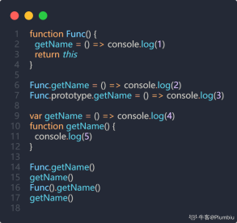
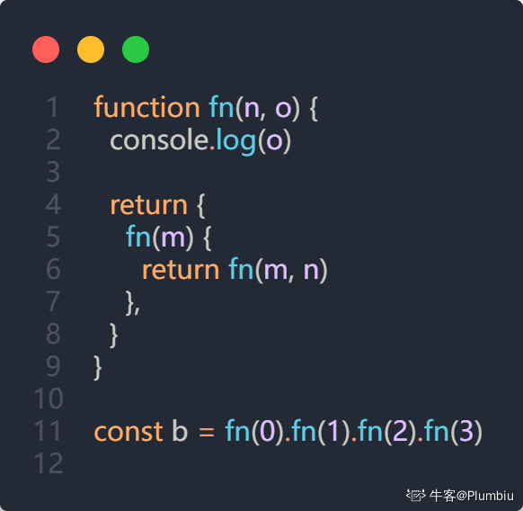
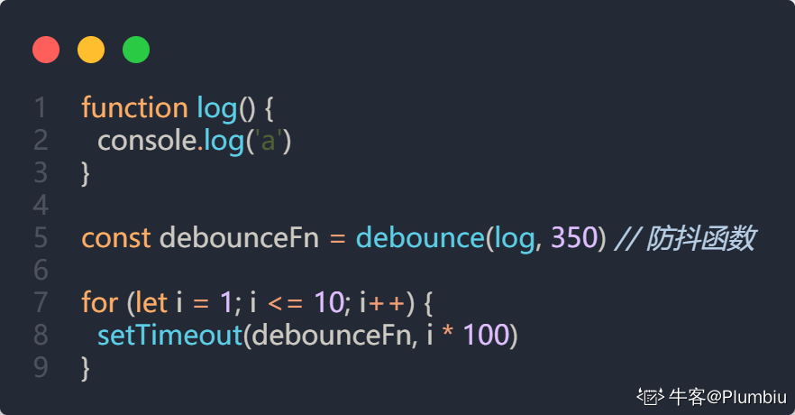

美团 - 前端 - 秋招 - 一面面经

    项目相关，得好好练习说一遍。项目拓展出来的一些场景题，不太会
    Vue的$set的相关八股
    Promise 、async/await的相关八股
    手写reduce函数
    如果用户反馈很卡，你要怎么做，有什么指标
    浏览器输入网址到网页显示过程
    浏览器请求资源之后，资源的渲染过程，js执行顺序
    vue 双向绑定的原理
    平时怎么学习前端，项目中的难点，自己在哪方面技术比较关注
    说说你封装的那个组件的思路
    浏览器缓存方式

作者：丶Mo
链接：https://www.nowcoder.com/?type=818_1
来源：牛客网

美团前端一面 —— 面经
五道手撕脑子都不正常了

1. 自我介绍
2. 实习经历（问的很细，甚至包括你的工作减少了多少 pd，有多少人在使用你做的东西）
3. HTTP 状态码
4. 网络请求方式
5. localStorage 及其应用，有没有其他类似的（嘴漏回答了 service worker，仔细想跟 localStorage 好像关系不大
6. service worker 跟其他有啥区别
7. React 常用的 hooks
8. React 重复 key 会导致什么问题
9. React 重复的 key 删除会咋样（没回答上来）
10. 常见的 HTTP 缓存，怎么知道某个资源是不是缓存下来的
11. 你说的开发者工具，除了网络那一栏，还用过什么
12. 你用 localStorage 做过什么缓存
13. useEffect 第二个参数，空数组和不传递有啥区别
14. 前端缓存有哪些方式
15. 手撕（根据印象写的，有些可能跟当时有差距
    a. this 指向
    b. 闭包输出
    c. 防抖函数
    d. 防抖函数执行结果
    e. 偶数和（做着做着想起来是之前做过 leetcode 的一道题，前四道已经把我脑子干烧了，有点晕，最后没来得及写完，说了一下思路）

作者：Plumbiu
链接：https://www.nowcoder.com/?type=818_1
来源：牛客网