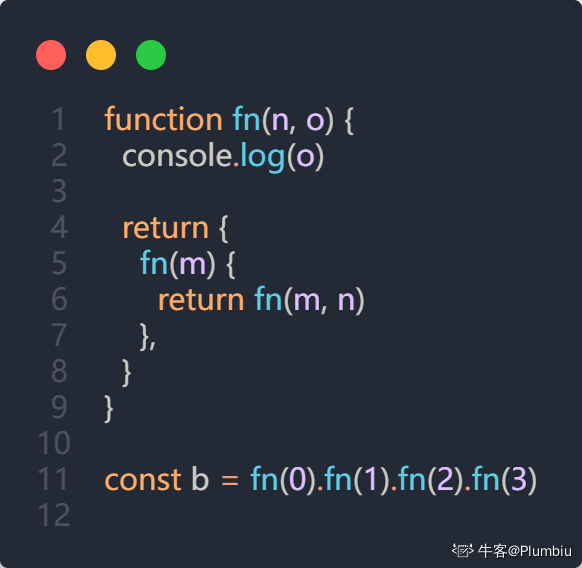
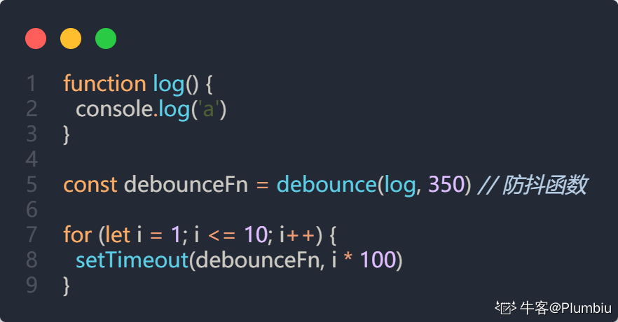

## 输出题


### 总结

```javascript
getName()
var getName = () => console.log(4);
function getName() {
	console.log(5);
}
getName()
//5
//4
```


函数声明会被变量声明覆盖，因为`var`声明的变量在编译阶段会提升到文件顶部。

`var` 声明的变量和函数声明发生冲突时，`var` 声明的变量会覆盖函数声明（但在**提升阶段函数声明具有高优先级**）

### 1解答

当然可以！这段代码涉及到JavaScript的函数、变量声明和重载的概念。让我们逐行分析代码以及每次调用时会发生什么。

```javascript
function Func() {
    getName = () => console.log(1)
    return this;
}
Func.getName = () => console.log(2);
Func.prototype.getName = () => console.log(3);

var getName = () => console.log(4);
function getName() {
    console.log(5);
}
```

### 分析：

1. **Func 定义**: 
   - `Func`是一个函数，通过其原型（`Func.prototype`）和它本身（`Func`对象）可以分别添加属性和方法。

2. **Func.getName = () => console.log(2)**:
   - 这行代码在`Func`函数对象上添加了一个静态方法`getName`，即`Func.getName()`会输出`2`。

3. **Func.prototype.getName = () => console.log(3)**:
   - 这行代码在`Func`的原型上定义了`getName`方法。这将影响到所有`Func`的实例，但不影响`Func`本身。

4. **var getName = () => console.log(4);**:
   - 这里定义了一个变量`getName`，它指向一个箭头函数，输出`4`。
   - **注意:** 下面`function getName()`函数声明会被变量声明覆盖，因为`var`声明的变量在编译阶段会提升到文件顶部。

5. **function getName() { console.log(5); }**:
   - 这个函数在本地作用域被`var getName`覆盖，所以不会被调用。

### 执行调用结果：

1. **Func.getName()**:
   - 直接调用`Func`对象上的`getName`方法，输出`2`。

2. **getName()**:
   - 由于`var getName = () => console.log(4);`覆盖了`function getName()`声明，因此这里调用的是变量`getName`中的箭头函数，输出`4`。

3. **Func().getName()**:
   - 执行`Func()`，它将一个没有用`var`、`let`、或`const`关键字定义的`getName`设为`console.log(1)`，实际改变了全局环境中的`getName`。
   - 紧接着`Func()`返回了`this`，在全局上下文中`this`是`window`（或`global`对象在Node.js中），所以这里尝试在全局上下文中调用`getName()`。
   - **最后**：这次调用实际上是在改变全局上下文的`getName`变量，输出`1`。

4. **getName()**:
   - 经过先前调用`Func()`的赋值操作，全局的`getName`已经被重新定义为`console.log(1)`。因此，第4次输出是`1`。

结合以上分析，最终的输出顺序是：2、4、1、1。

### 2解答

当然可以！我们可以逐行查看这段代码，并解释每行输出背后的原因。

先分析一下所有的代码：

```javascript
function Func() {
	getName = () => console.log(1)
	return this;
}
Func.getName = () => console.log(2);
Func.prototype.getName = () => console.log(3);

var getName = () => console.log(4);
function getName() {
	console.log(5);
}
Func.getName()
getName()
Func().getName()
getName()
```

1. 先声明了函数 `Func`，在函数内部定义了一个箭头函数 `getName`，并将其赋值为打印1的函数。同时返回了 `this`。

2. 接着定义了 `Func` 的一个静态方法（也被称为类方法）， `Func.getName`，它会打印2。

3. 然后在 `Func` 的原型上添加了一个方法 `getName`，它会打印3。

4. 声明了一个变量 `getName`，它是一个箭头函数，打印4。

5. 接下来声明了一个同名函数 `getName()`，打印5。但是要注意，在 `var` 声明的变量和函数声明发生冲突时，`var` 声明的变量会覆盖函数声明（但在提升阶段函数声明具有高优先级）。

然后是两种情况分别调用这些函数：

```javascript
Func.getName()
```

这里调用的是 `Func` 的静态方法，所以会打印2。

```javascript
getName()
```

`getName` 有两个定义：一个是作为函数的声明，另一个是作为变量的箭头函数。在变量声明之前，函数声明会生效；但在变量声明之后，变量赋值会覆盖函数声明。因此输出4。

```javascript
Func().getName()
```

调用 `Func()` 会执行 `Func` 函数体中的代码，这会将全局的 `getName` 改为 `() => console.log(1)`。 然后返回 `this` (在浏览器环境中，顶层的 `this` 是 `window`)，接下来调用 `window.getName()`，这里的 `getName` 已经被赋值为打印1的函数，所以会打印1。

```javascript
getName()
```

此时的 `getName` 已经被 `Func()` 调用时的那个赋值操作影响，因此再次调用时输出还是1。

总结一下输出顺序：

1. `Func.getName()` 打印2
2. `getName()` 打印4
3. `Func().getName()` 打印1
4. `getName()` 打印1

所以最终的输出结果是：

```
2
4
1
1
```

## 为什么执行Func()后,全局的getName函数会变成Func内部的这个箭头函数

这是因为在`Func`函数内部，你没有使用`var`、`let`或`const`关键字来声明`getName`，而直接使用`getName = () => console.log(1);`这样的赋值语句。在JavaScript中，当你在函数内这样赋值一个变量且未在函数中用`var`、`let`或`const`声明时，该变量会被隐式地添加到全局对象（浏览器中的`window`对象或Node.js中的`global`对象）上。

具体过程是这样的：

1. **`Func()`函数执行**: 当你调用`Func()`时，JavaScript引擎会在函数内部找到`getName = () => console.log(1);`这行代码。

2. **检查变量声明**: JavaScript会检查当前的作用域（这里是`Func()`内）有没有局部变量`getName`。
   - 如果使用`var`、`let`或`const`声明了`getName`，那`getName`会是一个局部变量。
   - 但这里没有使用这些关键字，所以没有在本地作用域中找到声明。

3. **作用到全局对象**: 因此，JavaScript解释器会将`getName`绑定到全局对象上。
   - 可以把这个过程想象成`window.getName = () => console.log(1);`（在浏览器环境下）。

这就是为什么全局`getName`变成了`Func`内部定义的箭头函数结果的原因。这种行为是JavaScript的一个常见陷阱，它可能会引发意外的全局变量定义，也被称作“隐式全局”，一般建议在严格模式（`'use strict';`）下编写代码来避免此类问题。严格模式下，这样的赋值会导致错误，从而避免将变量意外地提升到全局作用域。

## 链式调用输出题



这段代码使用了一种链式调用的方法。链式调用是一个 JavaScript 常见的编程技巧，它允许你连续调用方法，使代码更紧凑和可读。让我们逐行分析这段代码的行为，以及调用链`fn(0).fn(1).fn(2).fn(3)`时发生了什么。

### 函数定义

```javascript
function fn(n, o){
    console.log(o);
    return {
        fn(m){
            return fn(m, n)
        }
    }
}
```

- **`fn(n, o)`函数**: 这是一个接收两个参数`n`和`o`的函数。
  - `console.log(o)`: 输出参数`o`。
  - 返回一个对象，该对象有一个方法`fn(m)`，这又返回调用`fn(m, n)`的结果，继续传递下去。

### 链式调用

```javascript
const b = fn(0).fn(1).fn(2).fn(3);
```

让我们逐步解析这一行链式调用的过程：

1. **`fn(0)`**:
   - 传入`n=0`，因为`o`未定义，所以输出`undefined`。
   - 调用`fn(0)`返回一个对象，它有一个方法`fn(m)`。

2. **`.fn(1)`**:
   - 调用`fn(1)`方法，相当于调用首次返回对象的`fn`方法。
   - 这会导致`fn(m, n)`被调用，即`fn(1, 0)`。
   - 在`fn(1, 0)`内部：`n=1`，`o=0`，故输出`0`。
   - 再次返回一个对象，该对象有一个方法`fn(m)`。

3. **`.fn(2)`**:
   - 调用返回对象的`fn(2)`，相当于`fn(2, 1)`。
   - 在`fn(2, 1)`内部：`n=2`，`o=1`，故输出`1`。
   - 再次返回一个对象，该对象有一个方法`fn(m)`。

4. **`.fn(3)`**:
   - 调用返回对象的`fn(3)`，相当于`fn(3, 2)`。
   - 在`fn(3, 2)`内部：`n=3`，`o=2`，故输出`2`。

### 总结

所以这段代码最终的输出依次是：`undefined`、`0`、`1`、`2`。链式调用每一步都输出上一次的参数`n`作为当前`o`的值。这样依次嵌套，形成一个链式调用。

## 防抖定时器输出题



这段代码示例展示了一个防抖函数(`debounce`)的应用。防抖是一种函数执行控制策略，它确保在连续的函数调用中，只在最后一次调用发生后的指定时间间隔之后才会实际执行目标函数。

假设`debounce`函数是一个典型的防抖实现，它接收两个参数：需要防抖处理的函数`log`和防抖时间间隔`350`毫秒。典型的`debounce`函数实现如下所示：

```javascript
function debounce(func, delay) {
    let timeout;
    return function(...args) {
        clearTimeout(timeout);
        timeout = setTimeout(() => {
            func.apply(this, args);
        }, delay);
    };
}
```

### 代码分析

1. **防抖实现**：
   - `debounce`函数返回一个新的函数，这个新函数在每次调用时，都会清除之前的定时器(`clearTimeout(timeout)`)。
   - 然后，创建一个新的定时器(`setTimeout`)，在指定的延迟时间(`350`毫秒)后执行目标函数`log`。

2. **循环与超时**：
   - `for`循环通过`setTimeout`安排了10次`debounceFn`的调用，分别在`i * 100`毫秒后执行，每一次递增`100`毫秒。
   - 所以`debounceFn`会在以下时间点尝试被调用：`100`ms，`200`ms，`300`ms，`400`ms，`500`ms，`600`ms，`700`ms，`800`ms，`900`ms和`1000`ms。

3. **防抖逻辑**：
   - 在每一次`debounceFn`的调用中，之前的定时器都会被清除，然后设置一个新的定时器。
   - 只有当调用停顿的时间超过`350`毫秒后，`log`函数才会执行。

### 输出结果分析

- 调用时序：
  - 在`1000`ms时触发最后一次`debounceFn`调用，定时器在`1350`ms（即`1000ms + 350ms`）时到期。

因此，最终的输出是：

```
a
```

此输出表明`log`函数仅在最后一次防抖间隔后被执行，因为每次新的调用总是在前一个定时器到期前重置定时器，而直到最后一次调用没有后续调用会再次重置它。