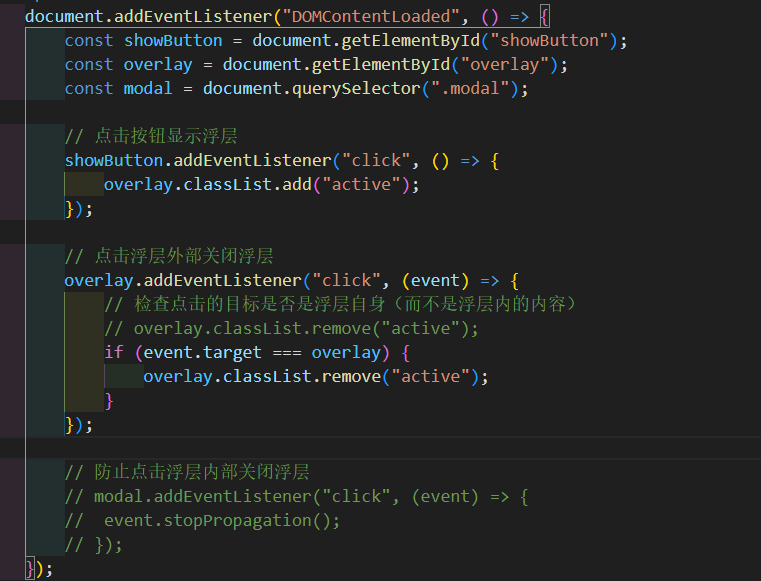

## 1个很大的数组,删除其中某几个索引的元素,怎么样性能最好

### 方法 1：使用 `filter` 方法

如果你有一个大数组，并且知道需要删除的索引，可以使用 `filter` 方法来创建一个新的数组，包含所有不需要删除的元素。这个方法相对简单且性能良好。

```js
let largeArray = [...]; // 假设这是一个很大的数组
let indicesToRemove = new Set([2000, 5000, 10000]);

let filteredArray = largeArray.filter((_, index) => !indicesToRemove.has(index));
```

### 方法 2：直接修改数组

如果你希望直接修改原数组，可以从高索引到低索引进行删除，这样可以避免数组重排多次带来的性能问题。

```js
let largeArray = [...]; // 假设这是一个很大的数组
let indicesToRemove = [2000, 5000, 10000];

// 从高索引到低索引删除元素
indicesToRemove.sort((a, b) => b - a).forEach(index => {
  largeArray.splice(index, 1);
});
```

### 方法 3：使用 `reduce` 方法

通过 `reduce` 方法可以创建一个新的数组，跳过需要删除的索引。

```js
let largeArray = [...]; // 假设这是一个很大的数组
let indicesToRemove = new Set([2000, 5000, 10000]);

let newArray = largeArray.reduce((acc, current, index) => {
  if (!indicesToRemove.has(index)) {
    acc.push(current);
  }
  return acc;
}, []);
```

### 方法 4：标记删除（懒惰删除）

如果你的操作不需要立刻删除元素，可以先标记删除，然后在最后一次性进行过滤。这在某些情况下可以提高性能。

```js
let largeArray = [...]; // 假设这是一个很大的数组
let indicesToRemove = new Set([2000, 5000, 10000]);

// 标记删除
indicesToRemove.forEach(index => {
  largeArray[index] = undefined;
});

// 过滤 undefined
largeArray = largeArray.filter(element => element !== undefined);
```

### 总结

对于大数组，性能最好的方法通常是创建一个新数组，而不是在原数组上进行多次操作。方法 1 使用 `filter` 和方法 3 使用 `reduce` 是最推荐的，因为它们简单且高效。直接修改数组的方法（方法 2）在某些情况下也可以有效，特别是当删除的索引数量较少时。

## this输出

## var声名变量和let区别

## promise.all

```javascript
function myPromiseAll(promises){
    //首先确保是可迭代对象
    if(!promises[Symbol.iterator]){
        throw new TypeError('Argument must be iterable')
    }

    //将可迭代对象转换为数组
    const promsieArray = Array.from(promises)
    //返回一个新的promise
    return new Promise((resolve, reject) => {
        const result = []//存储结果的数组
        let computed = 0//跟踪已经resolve的数量
        //数组为空,直接resolve并返回result
        if(promsieArray.length === 0) {
            resolve(result)
            return
        }
        //遍历所有的promise
        promsieArray.forEach((promise, index) => {
            //使用promise.resolve来处理非promise的值
            Promise.resolve(promise)
                .then(value => {
                    //结果存储在对应索引位置
                    result[index] = value
                    computed++
                    //所有promise都完成,解决返回的 Promise
                    if(computed === promsieArray.length){
                        resolve(result)
                    }
                })
                .catch(error => {
                    // 如果有任何一个 Promise 失败，立即拒绝返回的 Promise
                    reject(error)
                })
        })
    })
}
const promises1 = [
    Promise.resolve(1),
    Promise.resolve(2),
    Promise.resolve(3)
  ];
  
  myPromiseAll(promises1)
    .then(results => console.log('Test 1:', results))
    .catch(error => console.error('Test 1 Error:', error));
```

1. **遍历并处理 Promise**：
   - 使用 `Promise.resolve` 确保每个元素都是一个 Promise。`即使元素不是 Promise`，也会被 `Promise.resolve` 包装为一个已解决的 Promise。
   - 使用 `then` 方法处理已解决的 Promise，将结果存储在 `result` 数组对应的索引位置。
   - 使用一个计数器 `resolvedCount` 跟踪已解决的 Promise 数量。如果所有 Promise 都已解决，调用 `resolve` 返回结果数组。
   - 使用 `catch` 方法处理 Promise 拒绝的情况，立即调用 `reject`。

这种方式确保了即使输入包含非 Promise 值，也能正确处理，避免了冗余代码，同时保持了逻辑的清晰性和简洁性。

## 点击一个按钮,出现一个浮层,点击浮层内部没有反应,点击浮层外关闭浮层,怎么用浏览器的事件实现

##### 两种方式

- 给父级盒子添加点击事件,点击时判断target是否为浮层元素,如果不是添加隐藏的类名
- 给父级盒子添加点击事件,给浮层盒子也添加点击事件,内容为组织冒泡



1. **HTML 结构**：
   - 定义一个按钮和一个浮层（overlay）。
   - 浮层内部包含一个模态框（modal）。
2. **CSS 样式**：
   - `.overlay` 定义浮层的样式，初始状态为 `display: none`。
   - `.overlay.active` 当浮层被激活时，使用 `display: flex` 显示浮层，并让它居中对齐。
   - `.modal` 定义浮层内部内容的样式。
3. **JavaScript 逻辑**：
   - **点击按钮显示浮层**：点击按钮时，添加 `active` 类到浮层上，显示浮层。
   - **点击浮层外部关闭浮层**：给浮层添加点击事件监听器，检查点击的目标是否是浮层自身，如果是则移除 `active` 类关闭浮层。
   - **防止点击浮层内部关闭浮层**：给浮层内部内容添加点击事件监听器，使用 `event.stopPropagation()` 阻止事件冒泡，从而防止关闭浮层。

通过这种方式，可以实现点击按钮显示浮层，点击浮层内部不关闭浮层，点击浮层外部关闭浮层的效果。


